# Kubernetes 万卡 GPU 集群调度与大模型分布式通信分析

## 目录

1. [总体架构概览](#1-总体架构概览)
2. [GPU 资源管理与抽象](#2-gpu-资源管理与抽象)
3. [K8s 任务调度机制](#3-k8s-任务调度机制)
4. [万卡 Gang 调度与排队](#4-万卡-gang-调度与排队)
5. [跨站点多数据中心训练调度](#5-跨站点多数据中心训练调度)
6. [大模型分布式通信](#6-大模型分布式通信)
7. [端到端训练任务流程](#7-端到端训练任务流程)
8. [典型万卡集群部署架构](#8-典型万卡集群部署架构)

---

## 1. 总体架构概览

万卡 GPU 集群通常由多个数据中心（Site）组成，每个站点包含多个 GPU 计算节点，通过高速网络互联。Kubernetes 作为统一调度平台，管理从数百到数万张 GPU 的资源分配。

### 1.1 整体架构图

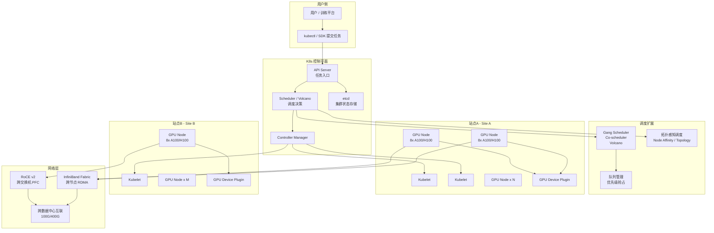

---

## 2. GPU 资源管理与抽象

### 2.1 GPU Device Plugin 机制

Kubernetes 通过 Device Plugin 框架将 GPU 资源暴露给调度器：

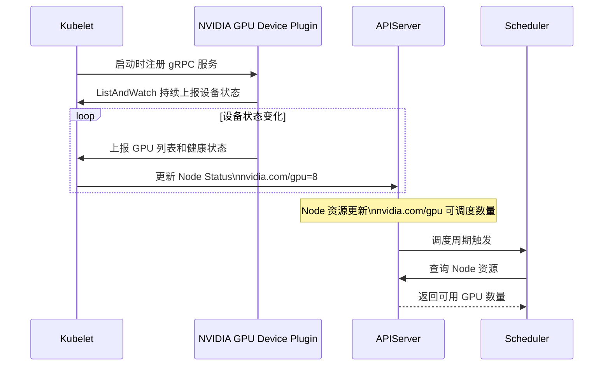

### 2.2 GPU 资源扩展

| 资源类型 | Device Plugin | 说明 |
|----------|---------------|------|
| `nvidia.com/gpu` | NVIDIA GPU Operator | 整卡分配 |
| `nvidia.com/mig-4g.20gb` | NVIDIA MIG | A100/H100 切片 |
| `nvidia.com/gpumem` | GPU Memory Operator | 显存按需分配 |
| `rdma/hca` | RDMA Device Plugin | InfiniBand 网卡 |
| `huawei.com/Ascend910` | Ascend NPU Plugin | 昇腾 NPU |

### 2.3 节点标签与拓扑标注

万卡集群需要丰富的拓扑标注来指导调度：

```yaml
# 节点拓扑标注示例
labels:
  topology.kubernetes.io/region: cn-beijing
  topology.kubernetes.io/zone: zone-a
  topology.kubernetes.io/rack: rack-01
  gpu-topology: nvlink-connected  # 同节点 NVLink
  network-topology: ib-fabric-a    # InfiniBand 子网
annotations:
  gpu-array: "dgx-a100"            # 服务器型号
  nccl-topo: "NODE0-NODE1..."      # NCCL 拓扑描述
```

---

## 3. K8s 任务调度机制

### 3.1 标准 K8s 调度流程

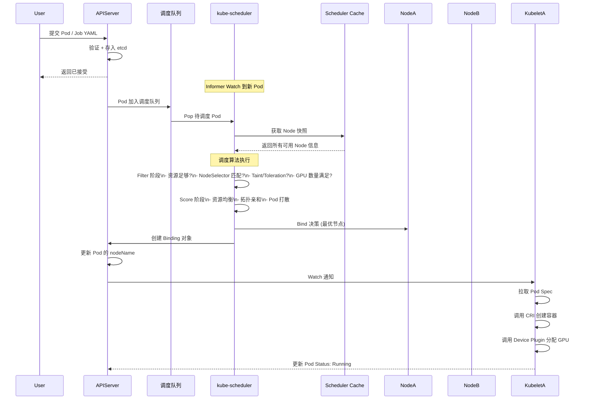

### 3.2 大模型训练任务的 Pod/Job 结构

大模型分布式训练通常以 Job (如 `PyTorchJob` / `MPIJob`) 方式提交，内含多个 Pod：

```
TrainingJob (Volcano / KubeFlow)
├── Launcher Pod          (1个, 协调训练)
│   └── 启动 torchrun/accelerate
└── Worker Pod Group      (N个, 执行训练)
    ├── Worker-0  (8 GPUs)
    ├── Worker-1  (8 GPUs)
    ├── ...
    └── Worker-N  (8 GPUs)
```

### 3.3 Pod 模板示例

```yaml
apiVersion: batch.volcano.sh/v1alpha1
kind: Job
metadata:
  name: llama3-70b-pretrain
spec:
  schedulerName: volcano
  queue: high-priority
  tasks:
    - replicas: 256          # 256 个 Worker Pod
      name: worker
      template:
        spec:
          containers:
            - name: train
              image: pytorch:2.1-cuda12
              resources:
                limits:
                  nvidia.com/gpu: 8     # 每 Pod 8 卡
                  cpu: 64
                  memory: 256Gi
              command: ["torchrun", "--nnodes=256", "--nproc_per_node=8", "train.py"]
          nodeSelector:
            topology.kubernetes.io/zone: zone-a
          affinity:
            podAntiAffinity:
              preferredDuringScheduling:
                - weight: 100
                  podAffinityTerm:
                    labelSelector:
                      matchLabels:
                        job-name: llama3-70b-pretrain
                    topologyKey: kubernetes.io/hostname
```

---

## 4. 万卡 Gang 调度与排队

### 4.1 为什么需要 Gang 调度

标准 K8s 调度器逐个调度 Pod，对大模型训练会导致：
- **死锁**：256 个 Pod 需要 256 节点，但部分节点空闲导致部分 Pod 调度成功，其余永远等待
- **资源浪费**：已调度的 Pod 空等，占据其他任务需要的资源
- **All-or-Nothing 语义**：分布式训练需要所有 Worker 同时就绪

**Gang Scheduling** 保证：一个 Job 的所有 Pod 要么全部调度成功，要么全部不调度。

### 4.2 Volcano Gang 调度流程

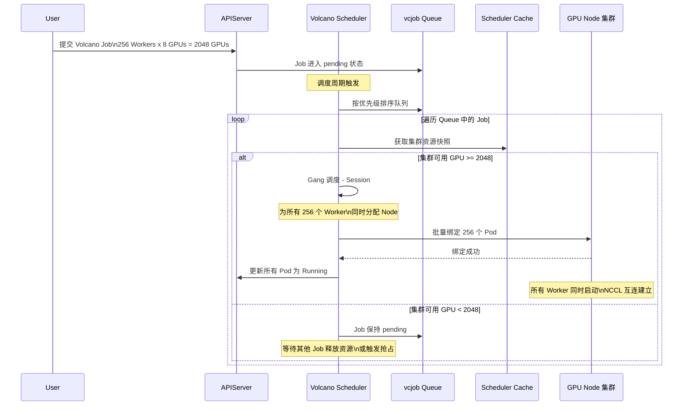

### 4.3 抢占与优先级

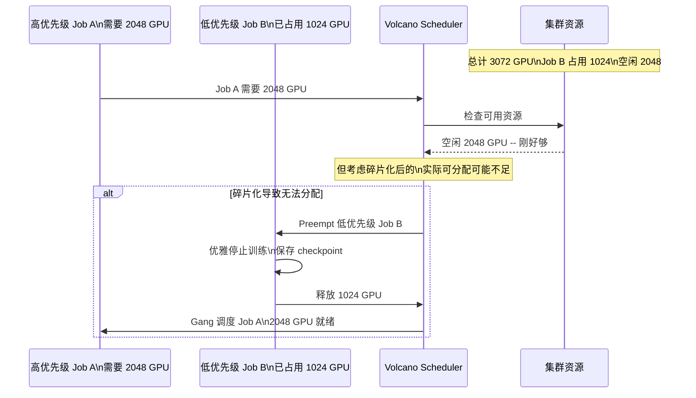

### 4.4 主流调度方案对比

| 方案 | 核心机制 | Gang 调度 | 适用规模 | 社区状态 |
|------|----------|-----------|----------|----------|
| kube-scheduler | 逐 Pod 调度 | 不支持 | 小规模 | K8s 内置 |
| Volcano | PodGroup + Gang | 原生支持 | 万卡 | CNCF 项目 |
| Kueue | ClusterQueue | 原生支持 | 中大规模 | K8s SIG |
| YuniKorn | 异构资源感知 | 原生支持 | 万卡 | Apache 项目 |
| Slurm on K8s | Slurm 调度器桥接 | Slurm 原生 | 超大规模 | 混合部署 |

---

## 5. 跨站点多数据中心训练调度

### 5.1 多站点资源视图

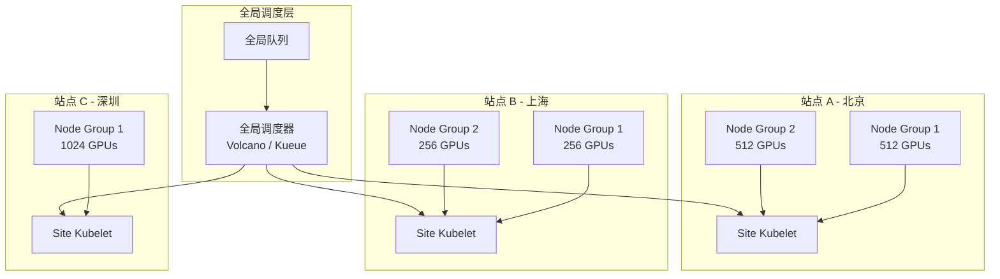

### 5.2 跨站点调度策略

跨站点调度需要考虑网络延迟和带宽差异：

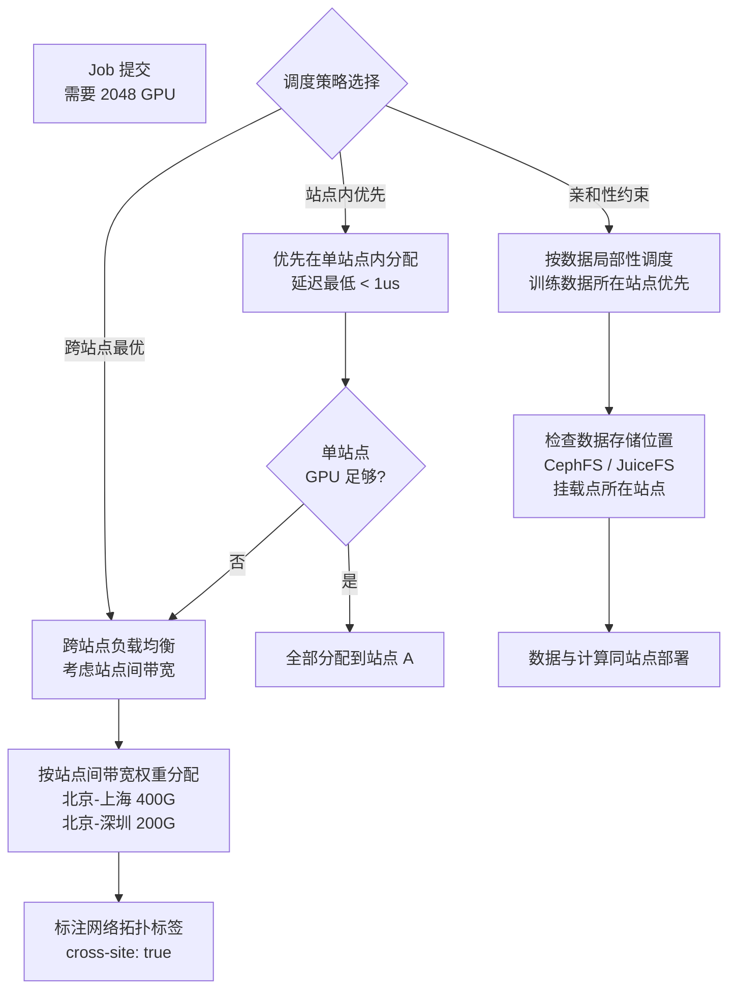

### 5.3 跨站点网络拓扑感知调度

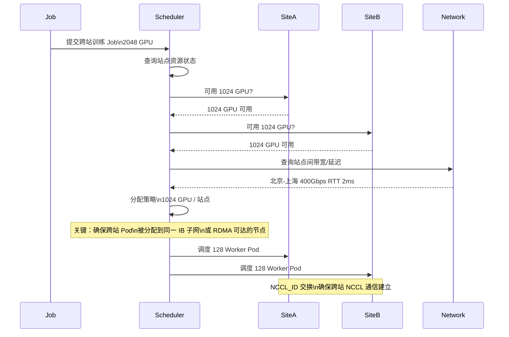

---

## 6. 大模型分布式通信

### 6.1 通信原语层级

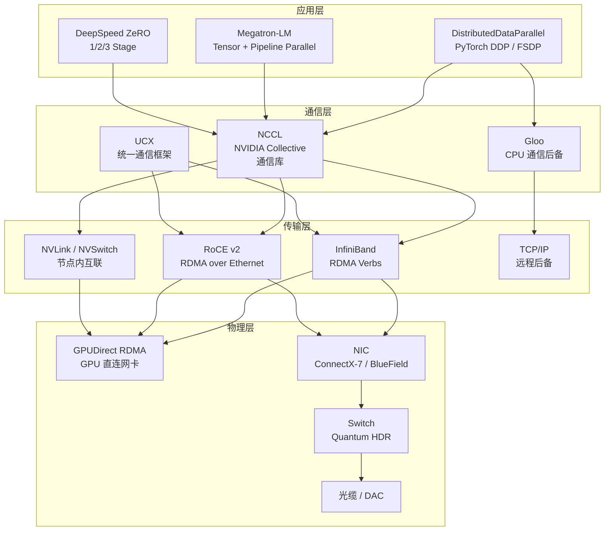

### 6.2 NCCL 通信初始化流程

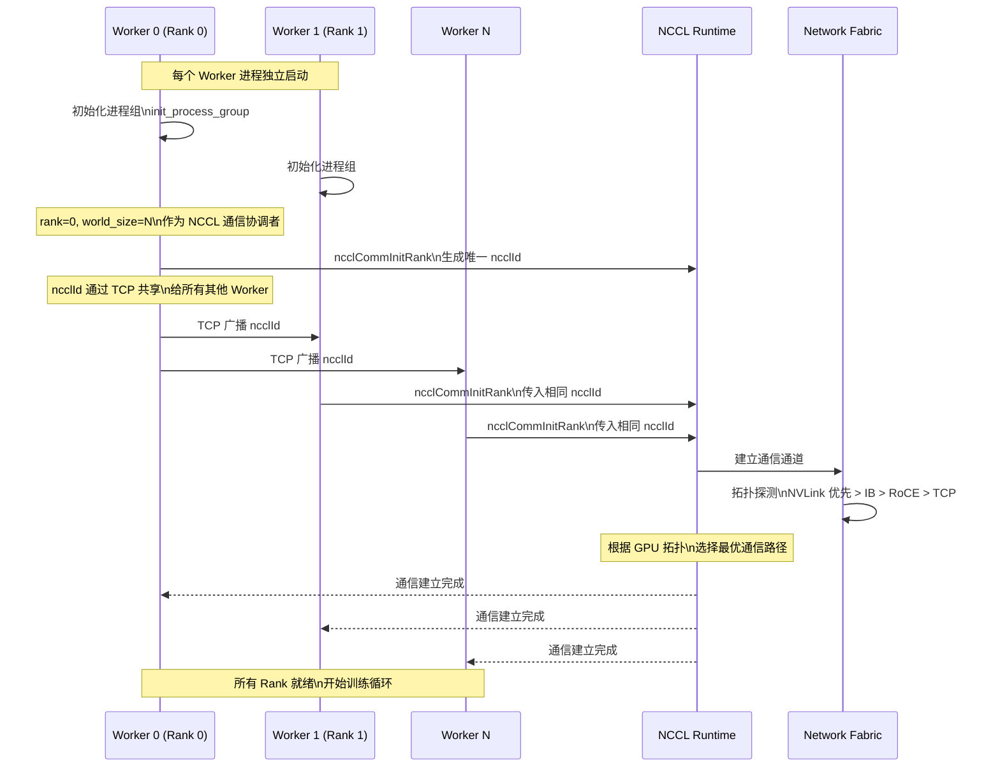

### 6.3 单步训练中的通信模式

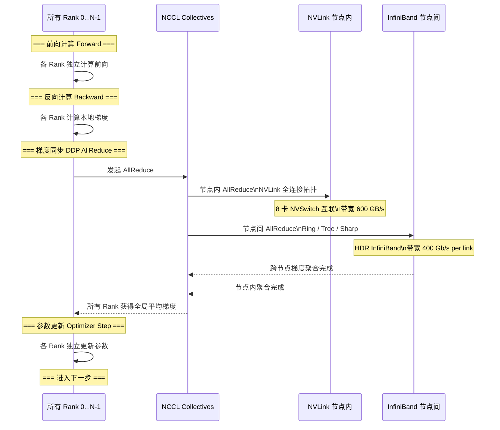

### 6.4 并行策略与通信模式

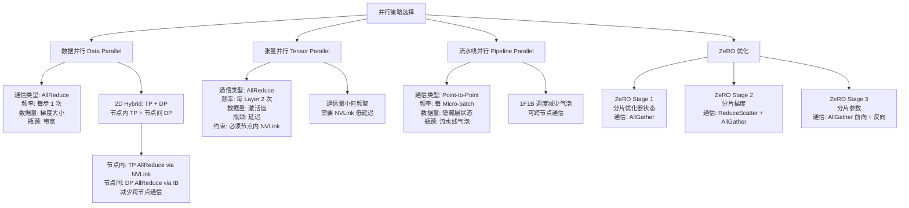

### 6.5 NCCL 跨站点通信

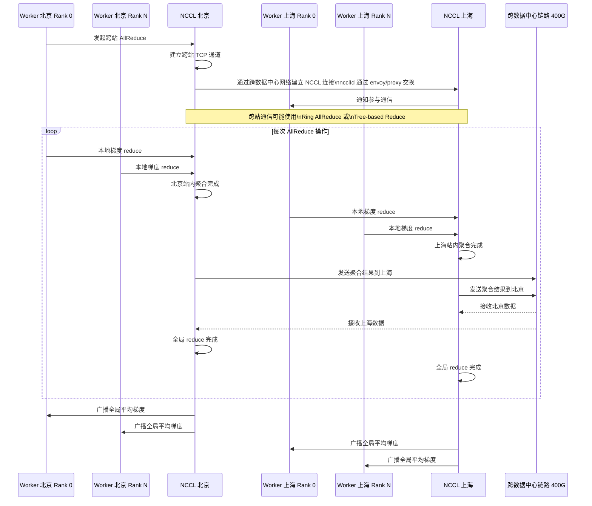

---

## 7. 端到端训练任务流程

### 7.1 从提交到训练启动全流程

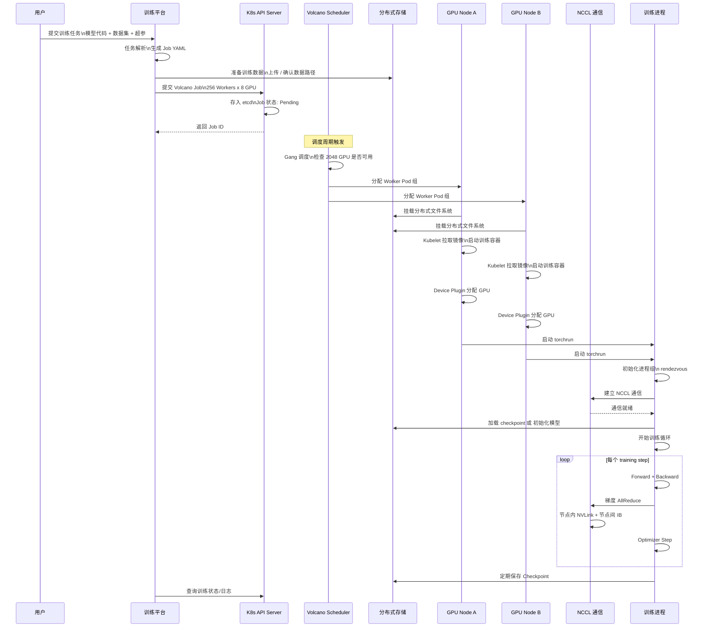

### 7.2 故障恢复流程

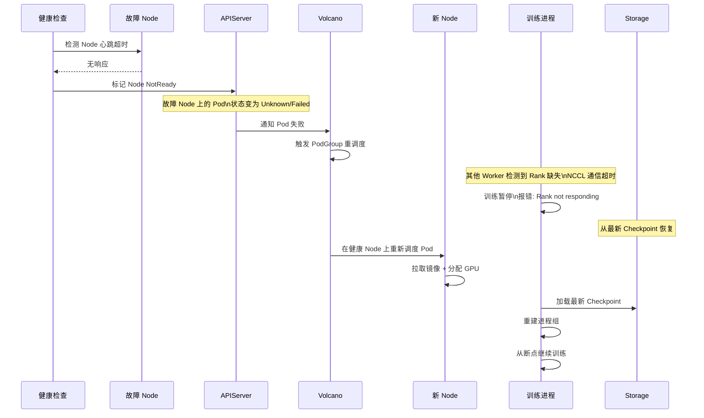

---

## 8. 典型万卡集群部署架构

### 8.1 物理拓扑与 K8s 映射

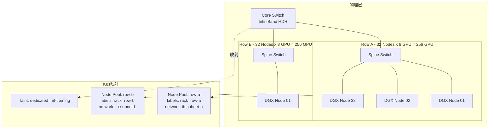

### 8.2 调度关键配置

| 配置项 | 说明 | 典型值 |
|--------|------|--------|
| `podGroups.minMember` | Gang 调度最小就绪 Pod 数 | 等于总 Worker 数 |
| `scheduler.volcano.sh/preemptable` | 是否允许被抢占 | true/false |
| `queue.capability.gpu` | 队列 GPU 资源上限 | 4096 |
| `nodeSelector.gpu-type` | GPU 型号约束 | a100-80g/h100 |
| `toleration.dedicated` | 专用节点容忍度 | ml-training |
| `priorityClassName` | 优先级 | production/staging/dev |
| `overcommit.gpu` | GPU 超分比 | 1.0 不超分 |

### 8.3 性能优化关键点

| 优化方向 | 具体措施 | 效果 |
|----------|----------|------|
| 调度延迟 | Gang 批量绑定 + 缓存预分配 | 分钟级 -> 秒级 |
| 通信拓扑 | 拓扑感知调度 + NVLink 优先 | 延迟降低 10x |
| 跨站带宽 | 梯度压缩 + 通信重叠计算 | 跨数据中心训练可行 |
| 容错恢复 | 自动 Checkpoint + 快速重调度 | MTBF 小时级 |
| 资源利用率 | 弹性队列 + 细粒度 GPU 分配 | 利用率 > 90% |
| 冷启动 | 镜像预热 + 容器热池 | Pod 启动 < 30s |

---

## 附录：术语表

| 术语 | 全称 | 说明 |
|------|------|------|
| NCCL | NVIDIA Collective Communications Library | NVIDIA 集合通信库 |
| RDMA | Remote Direct Memory Access | 远程直接内存访问 |
| NVLink | NVIDIA NVLink | GPU 间高速互联 |
| IB | InfiniBand | 高性能网络互联 |
| RoCE | RDMA over Converged Ethernet | 以太网上的 RDMA |
| DDP | Distributed Data Parallel | PyTorch 分布式数据并行 |
| FSDP | Fully Sharded Data Parallel | PyTorch 全分片数据并行 |
| ZeRO | Zero Redundancy Optimizer | DeepSpeed 零冗余优化器 |
| TP | Tensor Parallelism | 张量并行 |
| PP | Pipeline Parallelism | 流水线并行 |
| GPUDirect | GPUDirect RDMA | GPU 直接网卡访问 |
| MPI | Message Passing Interface | 消息传递接口 |
