# Kubernetes 管理万卡 GPU 集群的难点与痛点

## 目录

1. [调度层面的挑战](#1-调度层面的挑战)
2. [网络通信的挑战](#2-网络通信的挑战)
3. [存储与数据的挑战](#3-存储与数据的挑战)
4. [容错与稳定性的挑战](#4-容错与稳定性的挑战)
5. [资源利用率的挑战](#5-资源利用率的挑战)
6. [可观测性的挑战](#6-可观测性的挑战)
7. [运维管理的挑战](#7-运维管理的挑战)
8. [成本管理的挑战](#8-成本管理的挑战)
9. [难点关联全景图](#9-难点关联全景图)

---

## 1. 调度层面的挑战

### 1.1 Gang 调度死锁

大模型训练需要 All-or-Nothing 语义：一个 2048 GPU 的训练任务，要么所有 Pod 同时调度成功，要么全部等待。标准 K8s 逐 Pod 调度会导致严重的**资源死锁**。

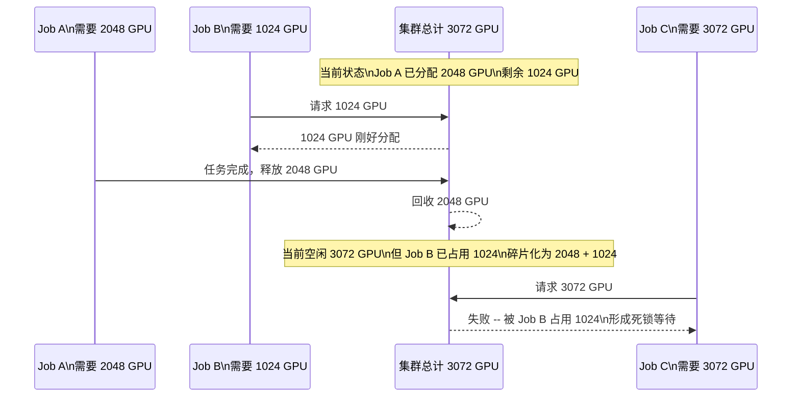

**痛点总结：**
- 标准调度器无法感知 PodGroup 语义，导致部分 Pod 调度成功、部分永久等待
- 需要引入 Volcano/Kueue 等批调度器，但增加了架构复杂度
- 调度器需要在数万 Node 中快速筛选满足拓扑约束的节点，调度延迟高

### 1.2 资源碎片化

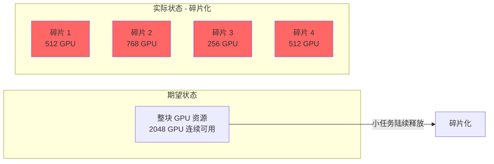

**具体表现：**
- 集群总空闲 GPU 满足需求，但分散在不同 Rack/Row/Site，无法满足拓扑亲和性约束
- 不同 GPU 型号（A100-40G / A100-80G / H100）混部导致资源池分裂
- 不同驱动版本/CUDA 版本的 Node 形成隐形的资源池隔离
- MIG 切片后的碎片更难回收利用

### 1.3 调度延迟

万卡集群的调度器面临严峻的性能瓶颈：

| 指标 | 小集群 | 万卡集群 | 痛点 |
|------|--------|----------|------|
| Node 数量 | ~100 | ~1,000-2,000 | 调度缓存膨胀 |
| 待调度 Pod | ~10 | ~1,000-10,000 | 队列积压 |
| 调度周期 | < 100ms | 数秒~数十秒 | 训练任务等待 |
| Filter 操作 | O(N) | O(N x M) | M 个约束条件 |
| 拓扑计算 | 简单 | 多层嵌套 | Rack/Row/Site 拓扑 |

**核心矛盾：** 调度需要精确拓扑匹配（慢），但训练任务对启动延迟敏感（要求快）。

### 1.4 抢占与优先级的连锁反应

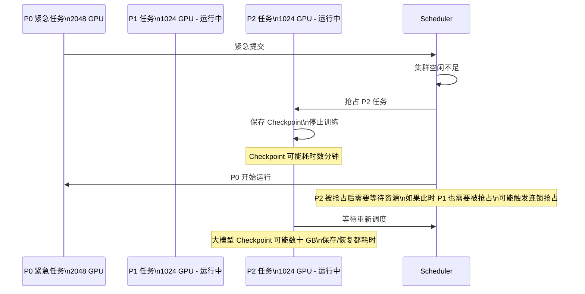

---

## 2. 网络通信的挑战

### 2.1 通信拓扑匹配

万卡训练的通信效率严重依赖拓扑感知调度：

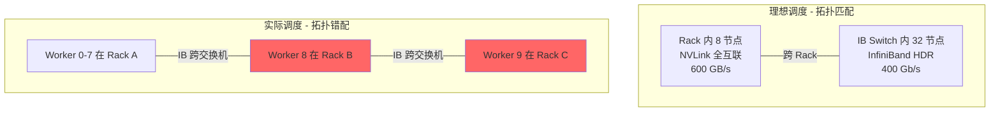

**痛点：**
- K8s 原生调度器不理解 GPU 互联拓扑（NVLink、NVSwitch、PCIe 拓扑）
- Pod 被分散到不同 Rack/Switch 时，NCCL 通信退化为跨交换机路径，带宽下降 3-10 倍
- 需要自定义调度器插件（如 NCCL Topology Awareness）或手动指定 NodeSelector
- 拓扑信息动态变化（硬件故障、维护），静态标注无法实时反映

### 2.2 通信瓶颈与训练效率

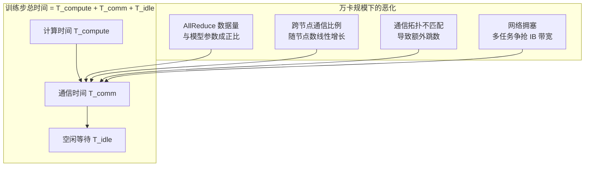

**量化影响：**

| 模型规模 | GPU 数 | AllReduce/步 | 典型 IB 带宽利用 | 通信占比 |
|----------|--------|-------------|-----------------|----------|
| 7B | 64 | ~28 GB | 80% | 15-20% |
| 70B | 512 | ~280 GB | 60% | 40-50% |
| 175B | 1024 | ~700 GB | 40% | 60-70% |
| 1T+ | 2048+ | ~4 TB+ | 30% | 70-85% |

通信时间占比超过 50% 时，增加 GPU 数量的加速比急剧下降，甚至出现**反向扩展（Negative Scaling）**。

### 2.3 网络拥塞与 PFC 风暴

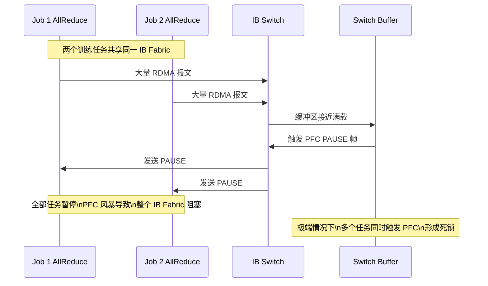

**痛点：**
- 大规模 RoCE 网络中，PFC（Priority Flow Control）风暴是常见故障
- InfiniBand 自带拥塞管理，但多租户场景下仍需精心配置 QoS
- 需要网络级流量隔离（Subnet、VL、QP 配置），配置极其复杂
- 网络拥塞的根因定位困难，需要专业知识

### 2.4 NCCL 调优复杂性

| 参数 | 影响 | 调优难度 |
|------|------|----------|
| `NCCL_NET` | 网络后端选择 | 需根据拓扑逐环境配置 |
| `NCCL_P2P_LEVEL` | 点对点通信策略 | 影响跨节点通信效率 |
| `NCCL_SHM_DISABLE` | 共享内存开关 | 节点内通信效率 |
| `NCCL_IB_DISABLE` | IB 开关 | 网络回退到 TCP 时性能骤降 |
| `NCCL_SOCKET_IFNAME` | 网卡绑定 | 绑错网卡导致通信失败 |
| `NCCL_DEBUG` | 调试日志 | 万级 Rank 下日志爆炸 |

**核心痛点：** NCCL 参数对拓扑高度敏感，一套配置无法适配所有场景，且错误配置的故障现象不直观（如训练速度慢但无报错）。

---

## 3. 存储与数据的挑战

### 3.1 海量并发 I/O

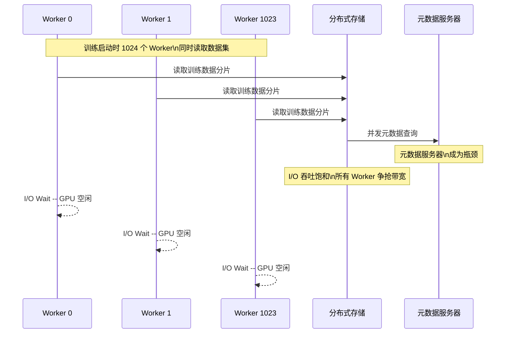

**痛点：**
- 万卡同时启动时，并发读取导致存储 I/O 瓶颈，GPU 空等数据
- 分布式文件系统（Lustre/GPFS/CephFS）在大规模并发下元数据操作成为瓶颈
- 数据加载成为训练速度的限制因素，GPU 利用率被 I/O 拖低

### 3.2 Checkpoint 管理

```mermaid
flowchart TB
    CkptSize["Checkpoint 大小"]

    subgraph "大模型 Checkpoint 规模"
        D7B["7B 模型: ~28 GB"]
        D70B["70B 模型: ~280 GB"]
        D175B["175B 模型: ~700 GB"]
        D1T["1T+ 模型: ~4 TB+"]
    end

    subgraph "保存开销"
        Time1["28 GB -> ~30s"]
        Time2["280 GB -> ~5min"]
        Time3["700 GB -> ~15min"]
        Time4["4 TB -> ~1h+"]
    end

    subgraph "痛点"
        P1["写入时间长\nGPU 空闲等待"]
        P2["存储空间占用大\n频繁 ckpt 需要数 TB"]
        P3["恢复延迟高\n从 ckpt 恢复需要重新加载"]
        P4["一致性难题\n分布式 ckpt 部分失败"]
    end

    CkptSize --> "大模型 Checkpoint 规模"
    "大模型 Checkpoint 规模" --> "保存开销"
    "保存开销" --> "痛点"
```

**关键难点：**
- FSDP/ZeRO-3 下每个 Rank 持有不同分片，需要协调保存
- 异步 Checkpoint 机制虽然能减少 GPU 等待，但增加实现复杂度
- 跨站点训练时 Checkpoint 需要跨网络存储，进一步增大延迟
- Checkpoint 版本管理、自动清理策略需要额外开发

---

## 4. 容错与稳定性的挑战

### 4.1 故障概率与 MTBF

万卡集群的硬件故障是常态而非异常：

| 组件 | 单卡 MTBF | 万卡集群预期故障率 | 说明 |
|------|-----------|-------------------|------|
| GPU | ~50,000h | 每 ~5h 一张卡故障 | 最常见的故障源 |
| 内存 | ~30,000h | 每 ~3h 一根内存故障 | ECC 纠错后仍可能触发 MCE |
| 网卡 | ~100,000h | 每 ~10h 一张网卡故障 | IB 网卡故障影响整个 Node |
| 硬盘 | ~100,000h | 每 ~10h 一块盘故障 | 影响 OS 和日志 |
| 电源 | ~200,000h | 每 ~20h 一个电源故障 | 整机掉电 |
| **整机** | - | **每 ~1-2h 一次节点故障** | **综合所有组件** |

**核心矛盾：** 大模型训练一次需要数天到数周，而集群 MTBF 只有 1-2 小时。**故障恢复能力决定训练能否完成。**

### 4.2 故障恢复流程

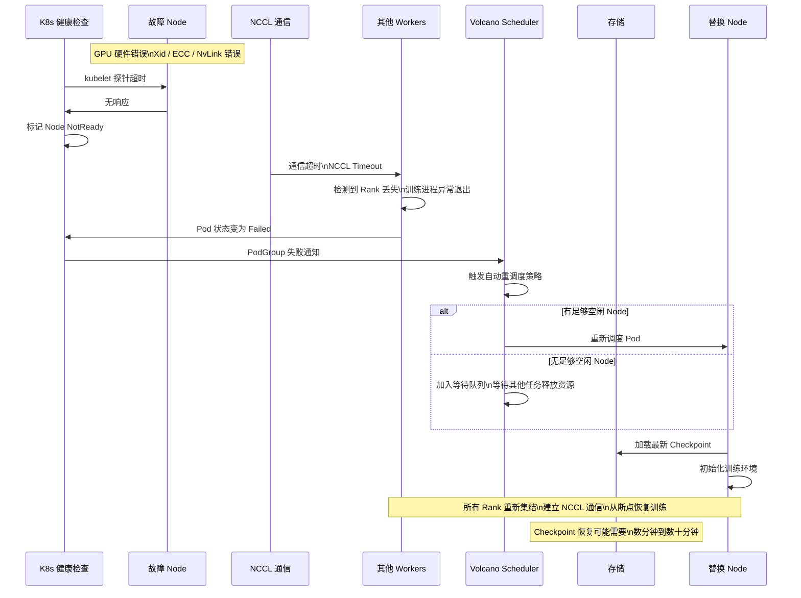

**痛点：**
- 单次故障恢复耗时：Checkpoint 保存 + Pod 重调度 + 镜像拉取 + 数据加载 + 通信建立 = **5-30 分钟**
- 万卡集群每天可能经历数十次故障恢复，累计损失巨大
- 自动化故障恢复的可靠性本身也是挑战（恢复脚本本身可能失败）

### 4.3 慢节点与静默错误

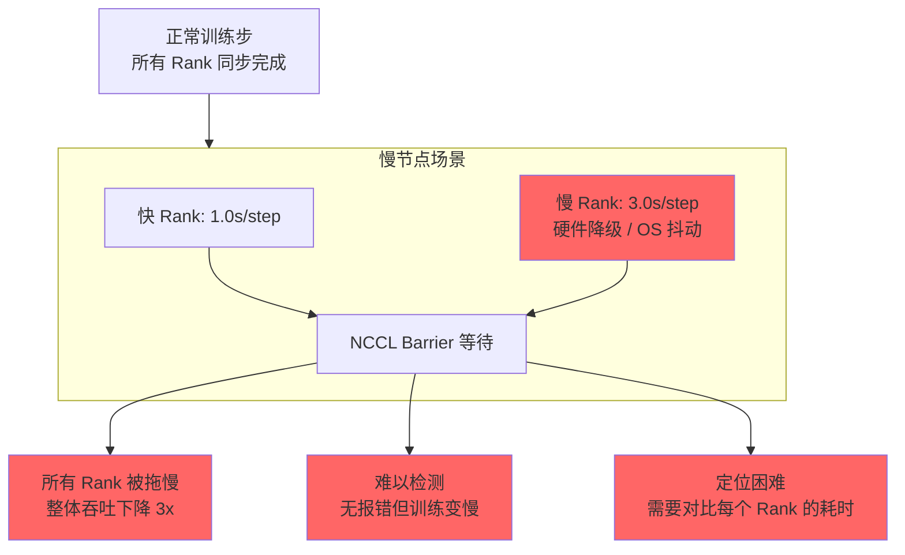

**痛点：**
- 慢节点比故障节点更难发现：没有明确的错误日志
- GPU 时钟频率降频、PCIe 降速、内存 ECC 纠错频繁等导致性能下降
- 需要每个 Rank 的 step 耗时监控和自动剔除机制
- K8s 层面无法感知训练层的性能问题

---

## 5. 资源利用率的挑战

### 5.1 GPU 利用率的多个维度

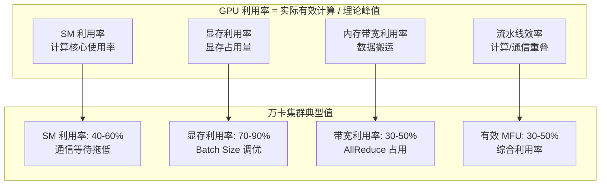

**MFU（Model FLOPs Utilization）** 是衡量训练效率的核心指标。万卡集群 MFU 通常只有 30-50%，意味着一半以上的 GPU 算力被浪费。

### 5.2 多租户资源争抢

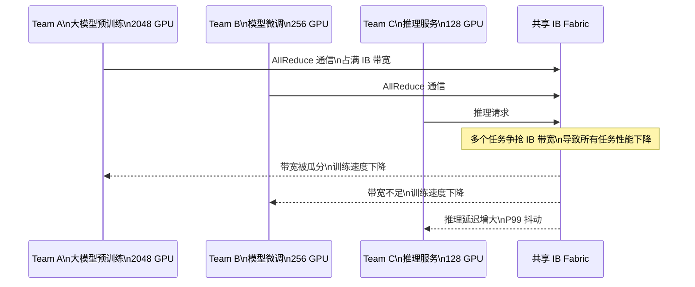

**痛点：**
- 不同团队的任务共享网络基础设施，互相影响
- 需要网络级隔离（VLAN/Subnet/QoS），配置复杂且降低整体利用率
- 训练任务与推理任务的混合部署需要精细的资源配额管理

### 5.3 冷启动与预热

| 阶段 | 耗时 | 说明 |
|------|------|------|
| Pod 调度 | 1-60s | 万卡 Gang 调度延迟高 |
| 镜像拉取 | 30s-10min | 大镜像 + 并发拉取争抢 Registry |
| CUDA/NCCL 初始化 | 5-30s | GPU 驱动加载 + 通信建立 |
| 数据集加载 | 10s-5min | 分布式文件系统挂载 + 索引 |
| 模型初始化 | 10s-30min | 从 Checkpoint 加载大模型 |
| 预热 Step | 数分钟 | JIT 编译、内存分配预热 |
| **总计** | **1-60min** | **GPU 空闲等待** |

**核心痛点：** 万卡冷启动期间，大量 GPU 处于空闲状态但已计费。频繁的故障恢复进一步放大这一成本。

---

## 6. 可观测性的挑战

### 6.1 监控数据爆炸

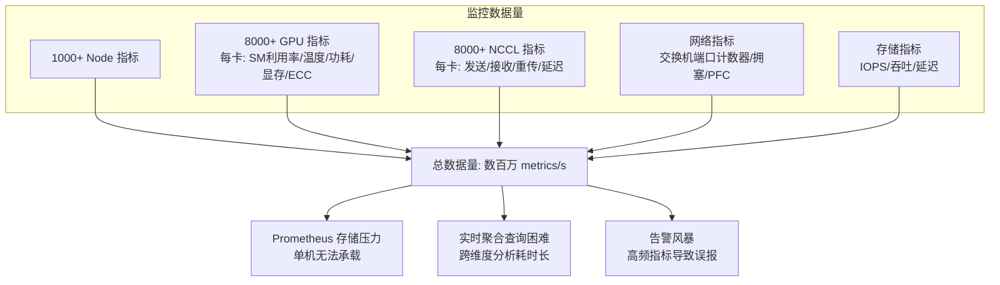

### 6.2 通信瓶颈定位

**核心困难：** 训练速度慢时，很难判断瓶颈在哪里。

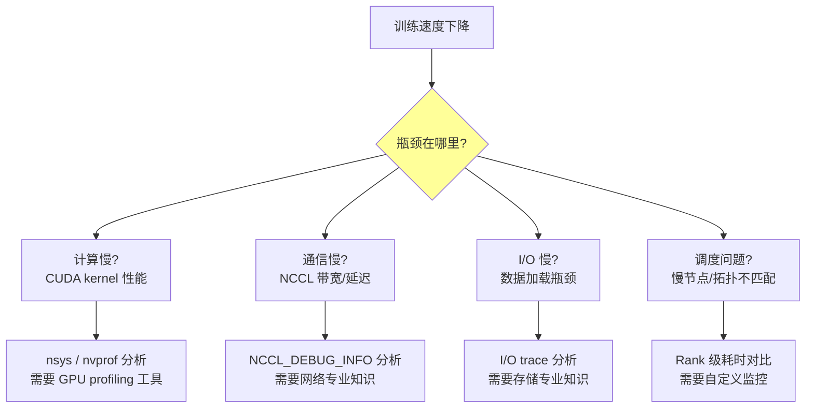

**痛点：**
- 需要跨领域专业知识（GPU/CUDA/网络/存储/K8s）才能定位问题
- 大规模下 profiling 工具自身开销大，影响在线训练
- 缺少统一的训练可观测性平台，信息分散在不同系统中

### 6.3 分布式训练的可观测性盲区

| 监控维度 | K8s 层面可见 | 训练层面可见 | 痛点 |
|----------|-------------|-------------|------|
| Pod 状态 | Yes | - | 无法看到训练是否正常 |
| GPU 温度 | Yes | - | 无法判断是否过热降频 |
| 训练 Loss | - | Yes | 需要额外日志收集 |
| Step 耗时 | - | Yes | 需要 per-rank 对比 |
| NCCL 通信 | - | 部分 | 需要特殊编译选项 |
| 梯度分布 | - | Yes | 需要自定义 hook |
| 内存泄漏 | 部分 | 部分 | 需要长时间监控 |

---

## 7. 运维管理的挑战

### 7.1 镜像分发

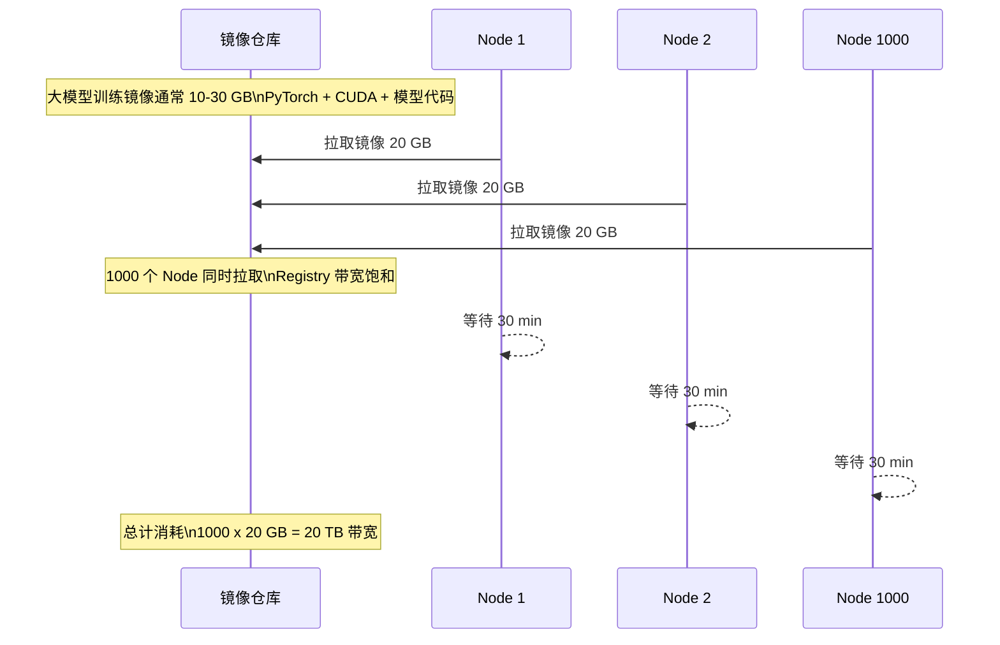

**解决方案与残留问题：**

| 方案 | 原理 | 残留问题 |
|------|------|----------|
| Dragonfly/P2P | 节点间 P2P 分发 | 需要额外基础设施 |
| 预加载 DaemonSet | 节点预热镜像到磁盘 | 磁盘空间管理 |
| Registry 镜像 | CDN 边缘缓存 | 多数据中心同步延迟 |
| CRI-O 缓存 | 节点本地缓存 | 缓存失效策略 |

### 7.2 环境一致性

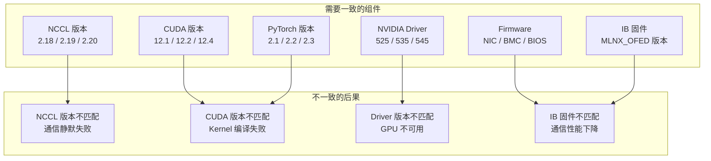

**核心痛点：**
- 万卡集群分批交付，不同批次可能使用不同硬件版本
- 驱动升级需要滚动重启所有 Node，大规模下耗时极长
- PyTorch/CUDA/NCCL 版本组合非常多，兼容性矩阵难以验证

### 7.3 集群升级与维护

| 操作 | 影响范围 | 停机时间 | 风险 |
|------|----------|----------|------|
| 驱动升级 | 所有 Node | 滚动数小时 | GPU 不可用 |
| K8s 版本升级 | 控制平面 + Node | 数天 | API 兼容性 |
| IB 固件升级 | 所有 Node | 滚动数小时 | 通信中断 |
| 网络设备升级 | 部分交换机 | 数小时 | 网络分区 |
| 安全补丁 | 所有 Node | 滚动数天 | 漏洞窗口 |

---

## 8. 成本管理的挑战

### 8.1 万卡集群的运营成本

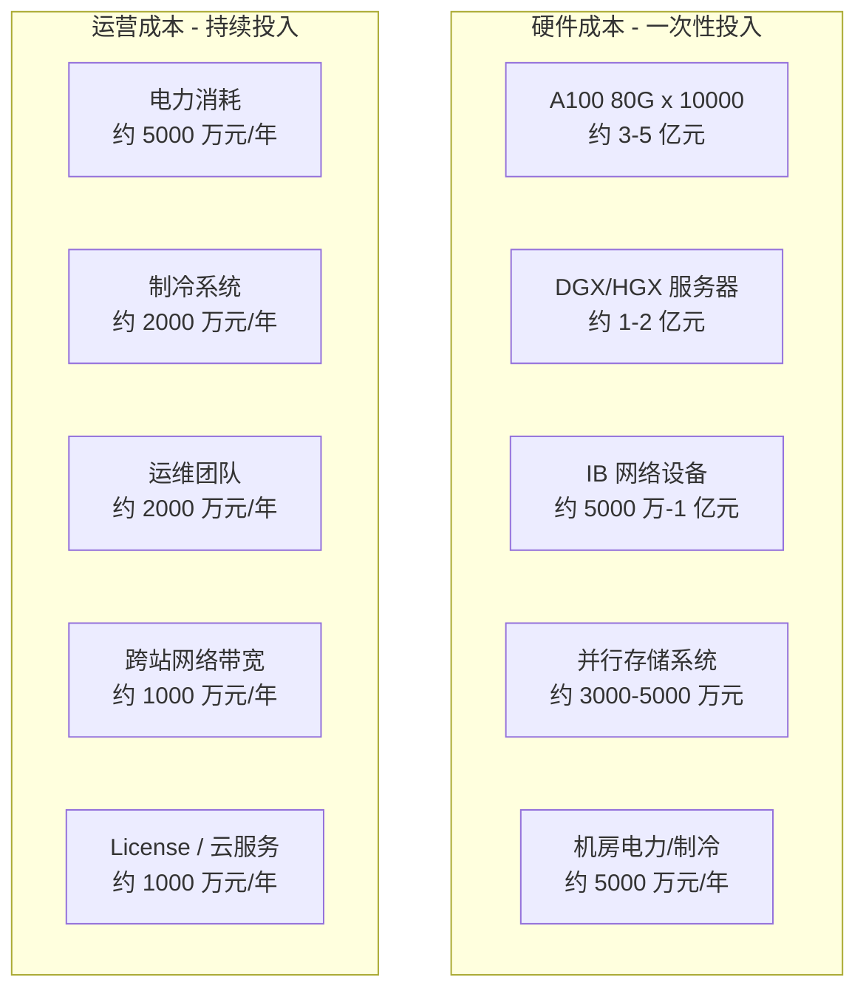

### 8.2 GPU 浪费的成本量化

| 浪费类型 | 典型占比 | 万卡年化成本损失 |
|----------|----------|-----------------|
| 通信等待 | 20-40% | 数千万元 |
| 故障恢复 | 5-15% | 数千万元 |
| 冷启动 | 2-5% | 数百万元 |
| 调度碎片 | 5-10% | 数千万元 |
| 资源闲置 | 10-20% | 数千万元 |
| **总浪费** | **40-80%** | **1-4 亿元/年** |

---

## 9. 难点关联全景图

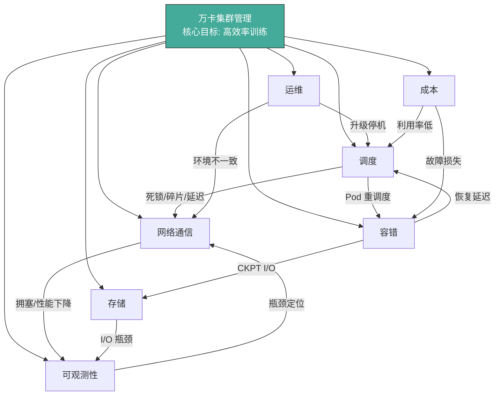

---

## 附录：业界应对方案参考

| 难点 | 业界方案 | 代表项目/产品 |
|------|----------|---------------|
| Gang 调度 | 批调度器 | Volcano, Kueue, YuniKorn, Slurm Bridge |
| 拓扑感知 | 自定义调度插件 | Kubeflow Training Operator, NVIDIA GPU Operator |
| 通信优化 | 通信库调优 | NCCL, MSCCL, RCCL |
| 故障恢复 | 自动 Checkpoint + 重启 | Torchrun Elastic, DeepSpeed Elastic |
| 可观测性 | 统一监控平台 | NVIDIA DCGM, Grafana + Prometheus |
| 镜像分发 | P2P 镜像分发 | Dragonfly, Kraken, Harbor P2P |
| 存储优化 | 数据预热 + 本地缓存 | Alluxio, JuiceFS, Datamover |
| 成本优化 | 弹性 + 竞价实例 | Spot GPU, 自动扩缩容 |
