# NVIDIA H100 (Hopper) GPU 硬件架构深度分析

## 目录

1. [架构概览](#1-架构概览)
2. [Streaming Multiprocessor (SM) 详解](#2-streaming-multiprocessor-sm-详解)
3. [指令流水线与执行流程](#3-指令流水线与执行流程)
4. [Cache 层次架构](#4-cache-层次架构)
5. [内存子系统 (HBM3)](#5-内存子系统-hbm3)
6. [Tensor Core 架构](#6-tensor-core-架构)
7. [互联架构 (NVLink / NVSwitch / PCIe)](#7-互联架构-nvlink--nvswitch--pcie)
8. [计算流水线时序分析](#8-计算流水线时序分析)
9. [典型计算场景数据流](#9-典型计算场景数据流)
10. [关键规格速查表](#10-关键规格速查表)

---

## 1. 架构概览

H100 采用 NVIDIA **Hopper 架构**，基于 TSMC 4N (定制 4nm) 工艺，集成约 **800 亿晶体管**，Die面积约 814 mm²。

### 1.1 H100 SXM5 整体架构框图

```
┌─────────────────────────────────────────────────────────────────────────────────┐
│                          H100 SXM5 GPU Die (814 mm², 800亿晶体管)                │
│                                                                                 │
│  ┌───────────────────────────────────────────────────────────────────────────┐  │
│  │                         9 个 GPC (图形处理集群)                             │  │
│  │                                                                           │  │
│  │  GPC0   GPC1   GPC2   GPC3   GPC4   GPC5   GPC6   GPC7   GPC8            │  │
│  │  ┌──┐   ┌──┐   ┌──┐   ┌──┐   ┌──┐   ┌──┐   ┌──┐   ┌──┐   ┌──┐        │  │
│  │  │SM│   │SM│   │SM│   │SM│   │SM│   │SM│   │SM│   │SM│   │SM│  ...      │  │
│  │  │x14│   │x15│   │x15│   │x15│   │x15│   │x15│   │x15│   │x14│   │x14│  │  │
│  │  └──┘   └──┘   └──┘   └──┘   └──┘   └──┘   └──┘   └──┘   └──┘        │  │
│  │                                                                           │  │
│  │           共 132 个 SM / 16,896 CUDA Cores / 528 Tensor Cores            │  │
│  └────────────────────────────┬──────────────────────────────────────────────┘  │
│                               │ 128B cache line                                 │
│                               ▼                                                 │
│  ┌──────────────────────────────────────────────────────────────────────────┐   │
│  │                    L2 Cache (50 MB, 128B cache line)                      │   │
│  │           TMA (Tensor Memory Accelerator) — 异步数据搬运                  │   │
│  └──┬──────────┬──────────┬──────────┬──────────┬──────────┬──────────┬─────┘   │
│     │          │          │          │          │          │          │          │
│  ┌──▼──┐    ┌──▼──┐    ┌──▼──┐    ┌──▼──┐    ┌──▼──┐    ┌──▼──┐    ┌──▼──┐    │
│  │ MC0 │    │ MC1 │    │ MC2 │    │ MC3 │    │ MC4 │    │ MC5 │    │外部  │    │
│  │     │    │     │    │     │    │     │    │     │    │     │    │互联  │    │
│  └──┬──┘    └──┬──┘    └──┬──┘    └──┬──┘    └──┬──┘    └──┬──┘    │接口  │    │
│     │          │          │          │          │          │     └──┬───┘    │
│     ▼          ▼          ▼          ▼          ▼          ▼        │        │
│  ┌──────┐  ┌──────┐  ┌──────┐  ┌──────┐  ┌──────┐  ┌──────┐     │        │
│  │ HBM  │  │ HBM  │  │ HBM  │  │ HBM  │  │ HBM  │  │ HBM  │     │        │
│  │Stack0│  │Stack1│  │Stack2│  │Stack3│  │Stack4│  │Stack5│     │        │
│  │ 16GB │  │ 16GB │  │ 16GB │  │ 16GB │  │ 16GB │  │ 16GB │     │        │
│  └──────┘  └──────┘  └──────┘  └──────┘  └──────┘  └──────┘     │        │
│                                                          ┌──────┘        │
│                                                          ▼               │
│                                              ┌─────────────────────┐    │
│                                              │  NVLink 4 (900GB/s) │    │
│                                              │  18 links, 100GB/s  │    │
│                                              │  或 PCIe Gen5 (64GB/s)   │
│                                              └─────────────────────┘    │
│                                                                           │
│                        HBM3 总计: 80 GB / 3.35 TB/s (6144-bit)           │
└───────────────────────────────────────────────────────────────────────────┘
```

### 1.2 GPC 内部结构

每个 GPC 包含多个 TPC (Texture Processing Clusters)，每个 TPC 内含 2 个 SM：

```
H100 Die (9 个 GPC, 共 132 SM)
│
└── GPC (Graphics Processing Cluster)
    │
    ├── Raster Engine (光栅化引擎)
    │
    └── TPC 0 ───── TPC 1 ───── ... ───── TPC N   (每个 GPC 含 2~4 个 TPC)
        │             │                       │
        │   ┌─────────┘                       │
        │   │                                 │
        ▼   ▼                                 ▼
    ┌─────────┐                           ┌─────────┐
    │   SM 0  │                           │  SM x   │
    │ 128 FP32│   每个 SM 独立包含:        │ 128 FP32│
    │  64 FP64│   - 128 CUDA Cores        │  64 FP64│
    │   4 TC  │   - 4 Tensor Cores        │   4 TC  │
    │  32 LSU │   - 32 LD/ST Units        │  32 LSU │
    │ 256KB   │   - 256KB L1/Shared Mem   │ 256KB   │
    │ 64 Warps│   - 64 Warps (2048线程)    │ 64 Warps│
    └─────────┘                           └─────────┘
        │
        ▼
      MMU (页表管理, 与 L2 Cache 交互)
```

> H100 SXM5 共 **9 个 GPC**，每个 GPC 内含 TPC 数量因 GPC 而异（非完全对称），总共 132 个 SM。

---

## 2. Streaming Multiprocessor (SM) 详解

SM 是 H100 的核心计算单元，每个 SM 是一个完整的独立处理器。

### 2.1 SM 内部架构框图

```
┌─────────────────────────────────────────────────────────────────────────┐
│                         Single SM (Streaming Multiprocessor)            │
│                     64 Warps = 2048 Threads, 每 Warp 32 线程            │
├─────────────────────────────────────────────────────────────────────────┤
│                                                                         │
│  ┌─────────────────────────────────────────────────────────────────┐   │
│  │              Instruction Buffer (64 KB)                         │   │
│  └────────────┬────────────┬────────────┬────────────┬────────────┘   │
│               │            │            │            │                  │
│               ▼            ▼            ▼            ▼                  │
│  ┌────────────┐  ┌────────────┐  ┌────────────┐  ┌────────────┐       │
│  │  Warp      │  │  Warp      │  │  Warp      │  │  Warp      │       │
│  │  Scheduler │  │  Scheduler │  │  Scheduler │  │  Scheduler │       │
│  │  0 (16W)   │  │  1 (16W)   │  │  2 (16W)   │  │  3 (16W)   │       │
│  │  GTO策略   │  │  GTO策略   │  │  GTO策略   │  │  GTO策略   │       │
│  └─────┬──────┘  └─────┬──────┘  └─────┬──────┘  └─────┬──────┘       │
│        │               │               │               │               │
│        ▼               ▼               ▼               ▼               │
│  ┌──────────┐   ┌──────────┐   ┌──────────┐   ┌──────────┐            │
│  │ Dispatch │   │ Dispatch │   │ Dispatch │   │ Dispatch │            │
│  │ 0 (2条)  │   │ 1 (2条)  │   │ 2 (2条)  │   │ 3 (2条)  │            │
│  └────┬─────┘   └────┬─────┘   └────┬─────┘   └────┬─────┘            │
│       │              │              │              │                    │
│  ═════╪══════════════╪══════════════╪══════════════╪═════════════      │
│       │      执行单元 (所有 Dispatch 共享, 8 instr/clock total)  │      │
│  ═════╪══════════════╪══════════════╪══════════════╪═════════════      │
│       │              │              │              │                    │
│  ┌────┴──────────────────────────────────────────────┴──────────┐     │
│  │                        执行单元                              │     │
│  ├──────────────┬──────────────┬──────────────┬────────────────┤     │
│  │ 128x FP32    │  64x FP64    │  64x INT32   │  32x SFU       │     │
│  │ ALU          │  ALU         │  ALU         │ sin/cos/exp/   │     │
│  │ 128 ops/clk  │  64 ops/clk  │  64 ops/clk  │ log/rsqrt      │     │
│  ├──────────────┼──────────────┼──────────────┼────────────────┤     │
│  │   4x Tensor  │              │  32x LD/ST   │                │     │
│  │   Core       │              │  Units       │                │     │
│  │ FP8:  1024   │              │ 256B/clk SMem│                │     │
│  │ FP16:  512   │              │ 128B/clk Glbl│                │     │
│  │ TF32:  256   │              │              │                │     │
│  │ FP64:  64    │              │              │                │     │
│  └──────┬───────┴──────┬───────┴──────┬───────┴────────────────┘     │
│         │              │              │                               │
│  ┌──────┴──────────────┴──────────────┴─────────────────────────┐    │
│  │              Register File — 256 KB (65,536 x 32-bit)       │    │
│  └──────────────────────────┬──────────────────────────────────┘    │
│                             │                                        │
│  ┌──────────────────────────┴──────────────────────────────────┐    │
│  │           L1 / Shared Memory — 256 KB (可配置)              │    │
│  │     Shared Memory: 92~256 KB  │  L1 Cache: 0~164 KB        │    │
│  └─────────────────────────────────────────────────────────────┘    │
│                                                                        │
└──────────────────────────────────────────────────────────────────────┘
```

### 2.2 SM 关键参数

| 参数 | 数值 | 说明 |
|------|------|------|
| Warps / SM | 64 | 2048 线程，每 Warp 32 线程 |
| Warp Schedulers / SM | 4 | 每个 Scheduler 管理 ~16 Warps |
| Dispatch 宽度 | 2 instr / scheduler / clock | 共 8 instr / SM / clock |
| Instruction Buffer | 64 KB | 软件管理的指令缓存 |
| Register File | 256 KB (65,536 x 32-bit) | 线程私有寄存器 |
| FP32 CUDA Cores | 128 | 128 ops/clock 或 64 FMA/clock |
| FP64 CUDA Cores | 64 | 64 ops/clock 或 32 FMA/clock |
| INT32 ALUs | 64 | 64 ops/clock |
| SFU | 32 | 特殊函数单元 |
| LD/ST Units | 32 | 256 B/clock Shared Mem |
| Tensor Cores | 4 | 4th Gen, 支持 FP8 |
| L1 + Shared Memory | 256 KB | 可配置分配比例 |
| 线程束调度策略 | GTO (Greedy-Then-Oldest) | 优先调度等待最久的就绪 Warp |

---

## 3. 指令流水线与执行流程

### 3.1 SM 指令流水线各级

SM 的指令执行流水线约为 **10~14 级**（NVIDIA 未公开精确级数，基于架构分析估算）。
各级之间是**流水线并行**的——每个 Clock 各级同时处理不同的指令。

**并行度概要：**

| 维度 | 并行数量 | 说明 |
|------|---------|------|
| 流水线级内并行 | 1 条/级 | 每级每 Clock 处理 1 条指令，~6 级即 ~6 条同时在流水线中 |
| Warp Scheduler 发射 | **8 条/clock** | 4 Scheduler × 2 双发射 |
| 执行单元并行 | **多条指令同时执行** | 6 类独立执行流水线 (FP32/FP64/INT32/SFU/TC/LSU) 可并行 |
| 跨 Warp 并行 | **数百条 in-flight** | 64 Warps 的指令混合在不同流水线阶段，长延迟操作(如 LD)期间其他 Warp 的指令照常推进 |

**流水线各级并行示意（单 Scheduler，每个格 = 1 Clock）：**

```
          Clock 0   Clock 1   Clock 2   Clock 3   Clock 4   Clock 5   Clock 6   Clock 7
         ─────────────────────────────────────────────────────────────────────────────────
指令 A:    [IF] ──▶ [ID] ──▶ [RR] ──▶ [IS] ──▶ [EX] ──▶ [WB]
指令 B:              [IF] ──▶ [ID] ──▶ [RR] ──▶ [IS] ──▶ [EX] ──▶ [WB]
指令 C:                        [IF] ──▶ [ID] ──▶ [RR] ──▶ [IS] ──▶ [EX] ──▶ [WB]
指令 D:                                  [IF] ──▶ [ID] ──▶ [RR] ──▶ [IS] ──▶ [EX] ──▶ [WB]
指令 E:                                            [IF] ──▶ [ID] ──▶ [RR] ──▶ [IS] ──▶ [EX] ──▶ [WB]
                             ↑
                   同一时刻 5 条指令分布在不同流水线级
                   (IF/ID/RR/IS/EX 各 1 条, WB 1 条)
```

**4 个 Scheduler 并行发射（8 条/clock）：**

```
Scheduler 0:  ──▶ [IS] ──▶ FP32 ALU ──▶ ...
                  [IS] ──▶ LD/ST   ──▶ ...       ← 同一 Warp 双发射

Scheduler 1:  ──▶ [IS] ──▶ Tensor Core ──▶ ...
                  [IS] ──▶ FP64 ALU ──▶ ...

Scheduler 2:  ──▶ [IS] ──▶ INT32 ALU ──▶ ...
                  [IS] ──▶ SFU ──▶ ...

Scheduler 3:  ──▶ [IS] ──▶ FP32 ALU ──▶ ...
                  [IS] ──▶ LD/ST ──▶ ...

              共 8 条指令在同一 Clock 进入执行阶段 (分配到不同功能单元)
```

**多 Warp 延迟隐藏（内存指令不阻塞其他 Warp）：**

```
Clock:        0    1    2    3    4    5    6  ...  500   501   502
            ───────────────────────────────────────────────────────────
Warp 0:     [LD] ──▶(等待 HBM 返回, ~500 cycles)────────────────▶[继续]
Warp 1:          [FP32 ADD] ──▶ [FP32 MUL] ──▶ ...
Warp 2:          [FP32 ADD] ──▶ [FP32 MUL] ──▶ ...
Warp 3:          [FP32 ADD] ──▶ [FP32 MUL] ──▶ ...
   ...
Warp 63:         [FP32 ADD] ──▶ [FP32 MUL] ──▶ ...

            Warp 0 LD 期间, Scheduler 0 切换到 Warp 1/2/3... 发射计算指令
            → 内存延迟被其他 Warp 的计算完全掩盖, SM 始终满载
```

**流水线各级功能：**

```
  ┌──────────┐   ┌──────────┐   ┌──────────────┐   ┌──────────┐   ┌──────────┐   ┌──────────┐
  │  1. IF   │──▶│  2. ID   │──▶│  3. RR       │──▶│  4. IS   │──▶│  5. EX   │──▶│  6. WB   │
  │ Fetch    │   │ Decode   │   │ Reg Read     │   │ Issue    │   │ Execute  │   │ Writeback│
  └──────────┘   └──────────┘   │ + Scoreboard │   └──────────┘   └──────────┘   └──────────┘
  从 Instruction  解析操作码与     └──────────────┘   Warp Scheduler     路由到功能单元      结果写入
  Buffer 获取    操作数/立即数     检查操作数依赖，     选择就绪 Warp 发射  FP32/FP64/INT32/   寄存器文件
                  解码为 micro-ops 读取寄存器文件       至多 2 instr/clock SFU/TC/LSU         唤醒依赖此
                  可以多路并行 IF    全部就绪才进入 IS                      结果的 Warp
```

### 3.2 各流水线级详细说明

| 流水线级 | 功能 | 细节 |
|----------|------|------|
| **Instruction Fetch** | 从 Instruction Buffer (64KB) 获取指令 | 每个 Clock 可 fetch 多条指令填充 buffer；buffer 解耦了 fetch 与 decode |
| **Instruction Decode** | 解码操作码、源/目标寄存器、立即数 | 解码为微操作 (micro-ops)；部分复杂指令可能解码为多条 micro-ops |
| **Scoreboard + Register Read** | 依赖检查 + 寄存器读取 | Scoreboard 跟踪：寄存器写回依赖、挂起的内存操作、功能单元占用；所有源操作数就绪后才进入 Issue |
| **Issue** | Warp Scheduler 选择就绪 Warp 发射 | 4 个 Scheduler 并行选择，每个可选 1 Warp 发射至多 2 条指令；使用 GTO 策略 |
| **Execute** | 在功能单元上执行 | 执行延迟因指令类型而异：FP32 ADD ~4 cycles, FP32 MUL ~4 cycles, LD ~200-400 cycles (全局内存) |
| **Writeback** | 结果写回寄存器文件 | 写回后更新 Scoreboard，唤醒依赖此结果的等待 Warp |

### 3.3 Warp 调度机制时序图

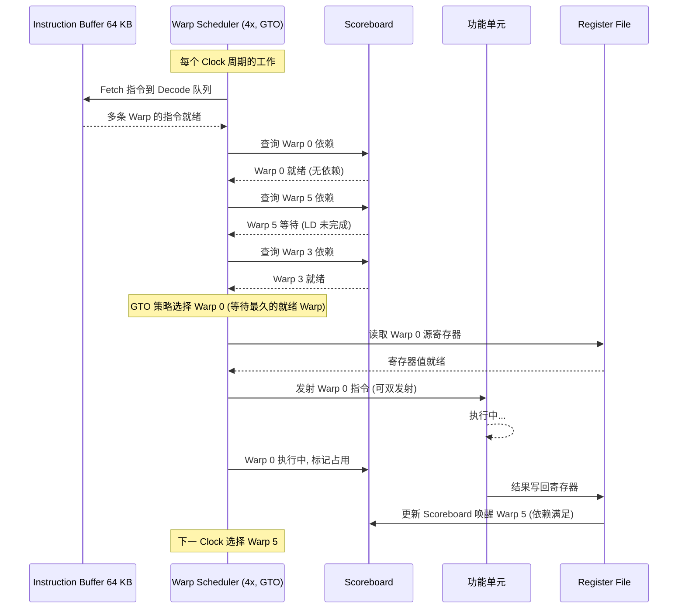

### 3.4 零开销 Warp 切换

当某个 Warp 因内存访问或其他原因 stall 时，Warp Scheduler 在同一 Clock 内切换到另一个就绪的 Warp，**无额外开销**：

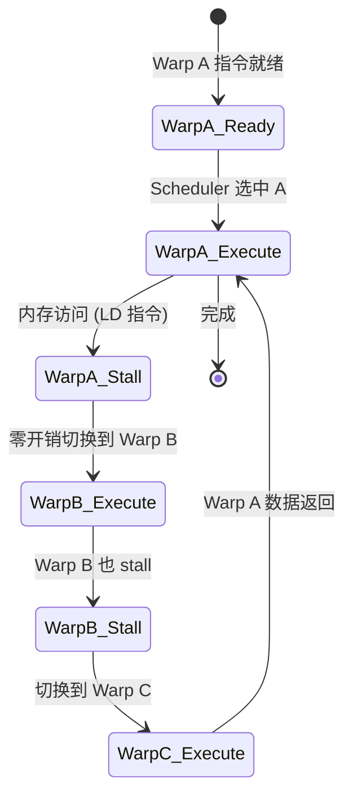

> 这就是 GPU 隐藏内存延迟的核心机制——通过大量 Warp 并发，保持功能单元始终忙碌。

---

## 4. Cache 层次架构

### 4.1 完整 Cache 层次结构图

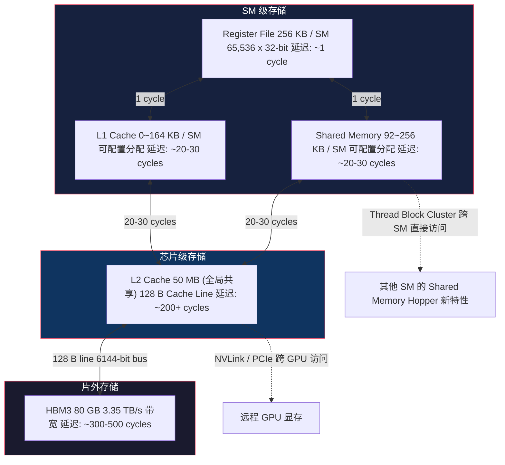

### 4.2 Cache Line 详细参数

| Cache 层级 | 大小 | Cache Line | 关联度 | 延迟 (cycles) | 带宽 |
|------------|------|-----------|--------|---------------|------|
| **Register File** | 256 KB / SM | 32-bit (1 register) | 全关联 (寄存器索引) | ~1 | 极高 |
| **Shared Memory** | 92~256 KB / SM | 4 B (32-bit word) | 32 banks | ~20-30 | 128-256 B/clock/SM |
| **L1 Cache** | 0~164 KB / SM | **128 B** | 多路组关联 | ~20-30 | 128 B/clock/SM |
| **L2 Cache** | 50 MB (全芯片) | **128 B** | 高关联度 | ~200+ | ~3.35 TB/s (到 HBM) |
| **HBM3** | 80 GB | 128 B (对齐) | N/A | ~300-500 | 3.35 TB/s |

### 4.3 L1 / Shared Memory 配置模式

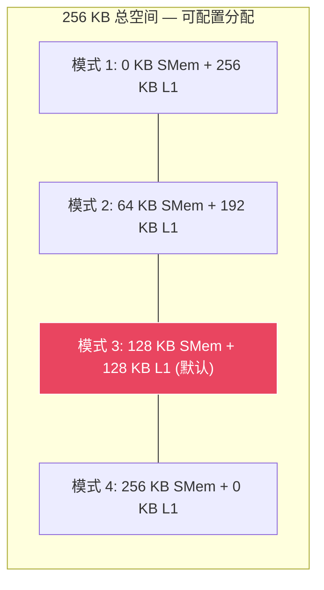

### 4.4 Cache 读写时序图

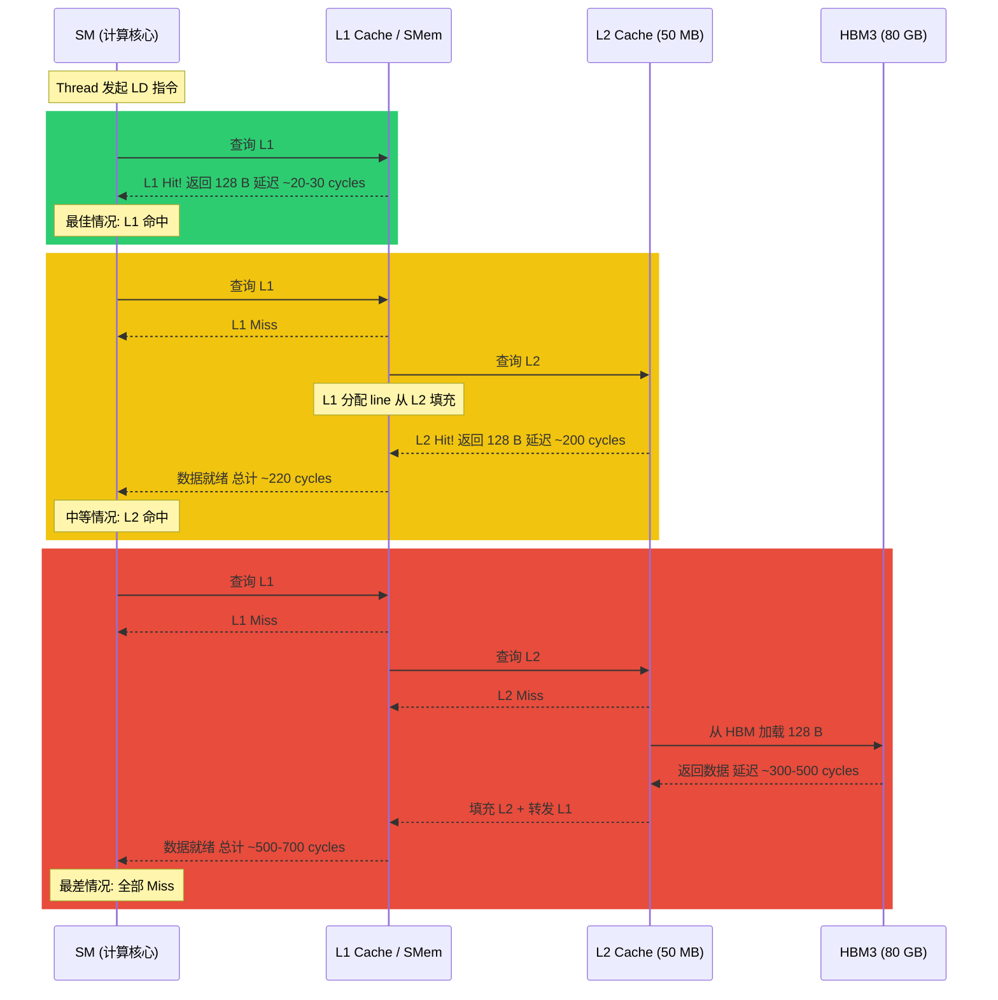

---

## 5. 内存子系统 (HBM3)

### 5.1 HBM3 架构图

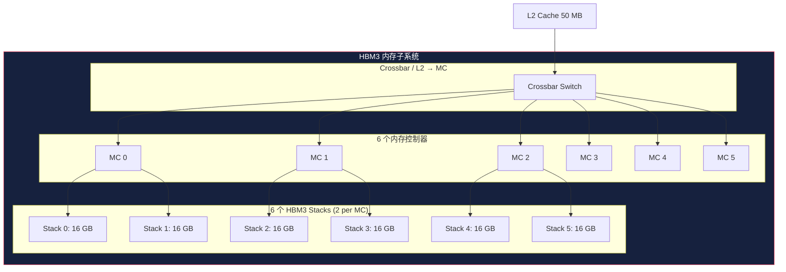

### 5.2 内存带宽与容量参数

| 参数 | 数值 |
|------|------|
| HBM3 容量 | 80 GB (6 x 16 GB stacks) |
| HBM3 带宽 (SXM5) | **3.35 TB/s** |
| 内存控制器数量 | 6 |
| HBM3 Stack 数量 | 6 (每 2 stack 共享 1 个 MC) |
| 总总线宽度 | **6144-bit** (每个 stack 1024-bit) |
| HBM3 数据速率 | ~1.5 Gbps/pin (有效) |
| 每个 Stack 带宽 | ~558 GB/s |

### 5.3 内存请求流水线时序

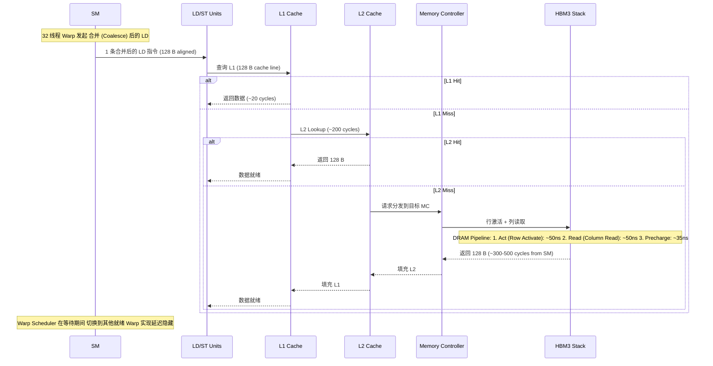

---

## 6. Tensor Core 架构

### 6.1 4th Gen Tensor Core 框图

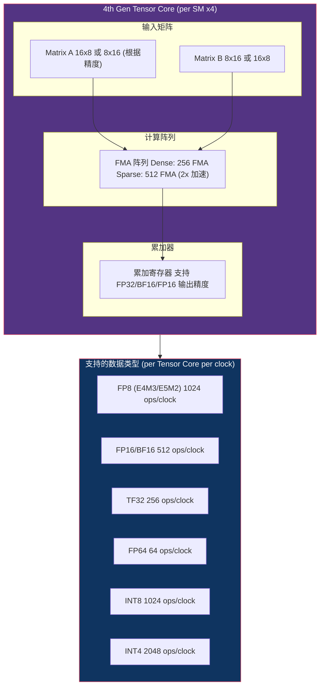

### 6.2 Tensor Core 峰值算力

| 精度 | Per SM / Clock | 总算力 (132 SMs, 1.83 GHz) | 结构化稀疏 (2x) |
|------|---------------|--------------------------|----------------|
| **FP8** | 1024 ops | **~3,958 TFLOPS** | ~7,916 TFLOPS |
| **FP16** | 512 ops | **~1,979 TFLOPS** | ~3,958 TFLOPS |
| **BF16** | 512 ops | **~1,979 TFLOPS** | ~3,958 TFLOPS |
| **TF32** | 256 ops | **~989 TFLOPS** | ~1,979 TFLOPS |
| **FP64** | 64 ops | **~34 TFLOPS** | ~67 TFLOPS |
| **INT8** | 1024 ops | **~3,958 TOPS** | ~7,916 TOPS |

### 6.3 Tensor Memory Accelerator (TMA) — Hopper 新特性

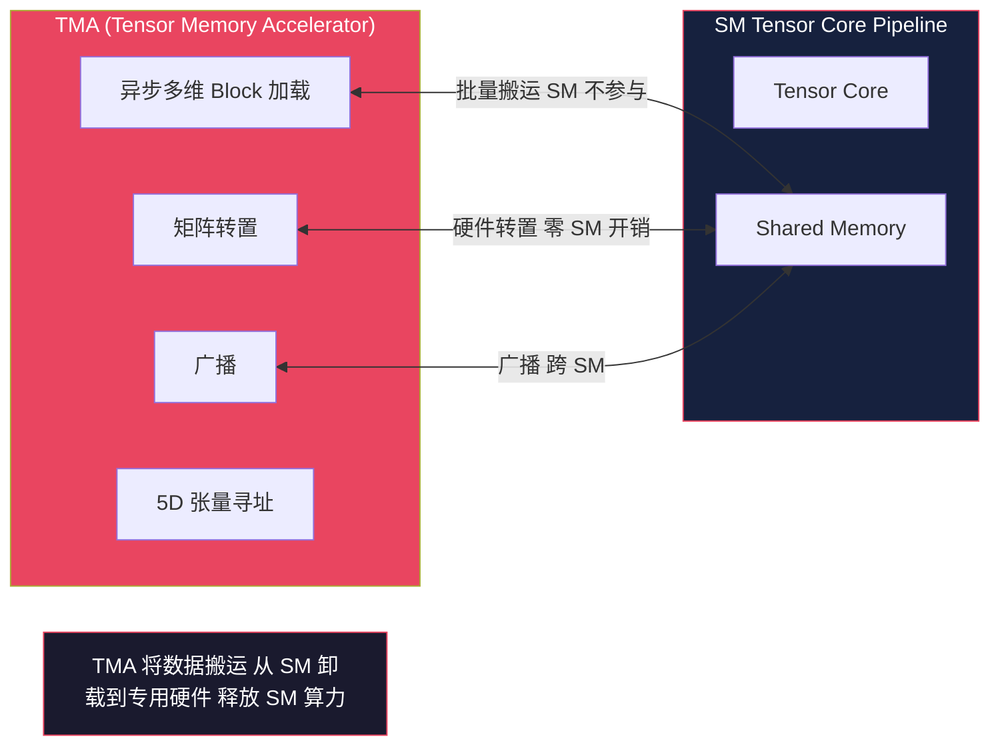

> **TMA 的关键意义**: 传统架构中 SM 需要执行 LD/ST 指令搬运数据到 Shared Memory 供 Tensor Core 使用，TMA 将这些搬运操作卸载到专用硬件，SM 可以在数据搬运期间执行其他计算，实现了真正的 **计算与通信重叠**。

---

## 7. 互联架构 (NVLink / NVSwitch / PCIe)

### 7.1 互联架构全景图

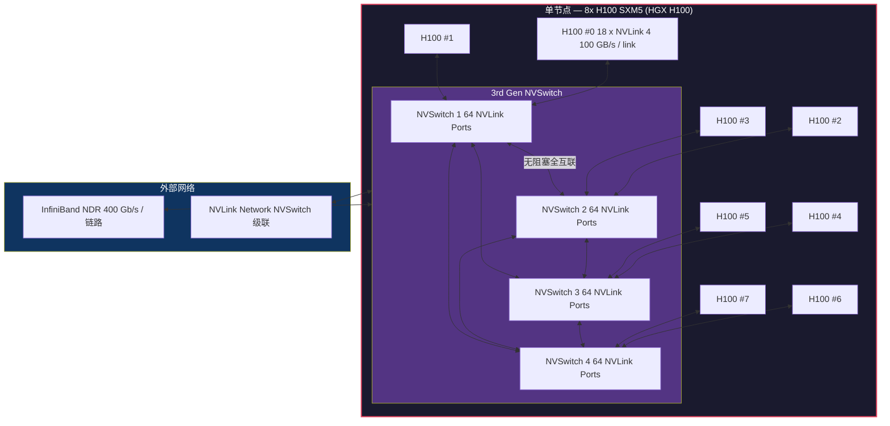

### 7.2 互联带宽对比

| 互联方式 | 带宽 | 延迟 | 适用场景 |
|----------|------|------|----------|
| **Shared Memory** | ~19.9 TB/s (聚合, 全 SM) | ~20-30 cycles | 同一 SM 内线程间 |
| **L2 Cache** | 3.35 TB/s | ~200 cycles | 同一 GPU 内跨 SM |
| **NVLink 4 (18 links)** | **900 GB/s** | ~微秒级 | 同一节点 8 GPU 间 |
| **NVLink Network** | 900 GB/s (跨节点) | ~微秒级 | 多节点扩展 (NVSwitch 直连) |
| **PCIe Gen5 x16** | 64 GB/s | ~微秒级 | 到 CPU / 存储 |
| **InfiniBand NDR** | 400 Gb/s (~50 GB/s) / port | ~微秒级 | 跨节点通信 |

---

## 8. 计算流水线时序分析

### 8.1 典型矩阵乘法 (GEMM) 在 Tensor Core 上的执行时序

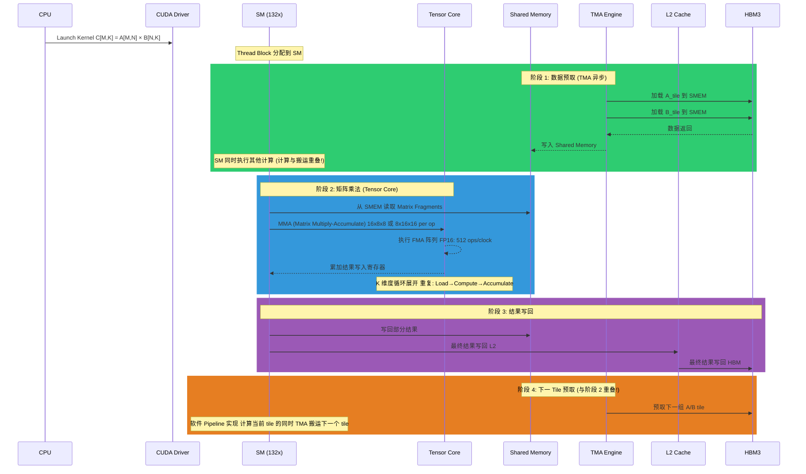

### 8.2 TMA + Tensor Core 软件 Pipeline 时序

```mermaid
gantt
    title GEMM Tiling Pipeline — 计算与数据搬运重叠
    dateFormat X
    axisFormat %s

    section TMA Engine
    Prefetch Tile 0     :tma0, 0, 3
    Prefetch Tile 1     :tma1, 3, 6
    Prefetch Tile 2     :tma2, 6, 9
    Prefetch Tile 3     :tma3, 9, 12

    section Tensor Core
    Compute Tile 0      :tc0, 3, 6
    Compute Tile 1      :tc1, 6, 9
    Compute Tile 2      :tc2, 9, 12
    Compute Tile 3      :tc3, 12, 15

    section Barrier
    Sync                 :sync, 15, 16
```

> 上图展示了 TMA 预取与 Tensor Core 计算的重叠执行。Tile 0 加载完成后，Tensor Core 开始计算 Tile 0 的同时 TMA 已在预取 Tile 1。这种 **双缓冲 (Double Buffering)** 技术使内存延迟完全被隐藏。

### 8.3 Warp 调度隐藏内存延迟时序

```mermaid
gantt
    title Warp 调度隐藏 LD 延迟 (单 SM 示例)
    dateFormat X
    axisFormat %s

    section Warp 0
    Issue LD指令         :w0_ld, 0, 1
    等待数据 (~500 cycles) :w0_wait, 1, 6
    继续执行              :w0_exec, 6, 8

    section Warp 1
    执行计算              :w1_exec, 1, 3
    Issue LD指令          :w1_ld, 3, 4
    等待数据              :w1_wait, 4, 8
    继续执行              :w1_cont, 8, 10

    section Warp 2
    执行计算              :w2_exec, 1, 5

    section Warp 3
    执行计算              :w3_exec, 1, 4
    等待 (资源)           :w3_wait, 4, 5
    继续执行              :w3_cont, 5, 7
```

> 关键洞察：当 Warp 0 等待内存数据时，Scheduler 在后续 clock 立即调度 Warp 1/2/3 执行。只要同时有足够多的就绪 Warp，内存延迟就被完全隐藏。这就是 GPU 需要高并发 Warp 数的原因。

---

## 9. 典型计算场景数据流

### 9.1 Transformer 推理 (Attention) 数据流

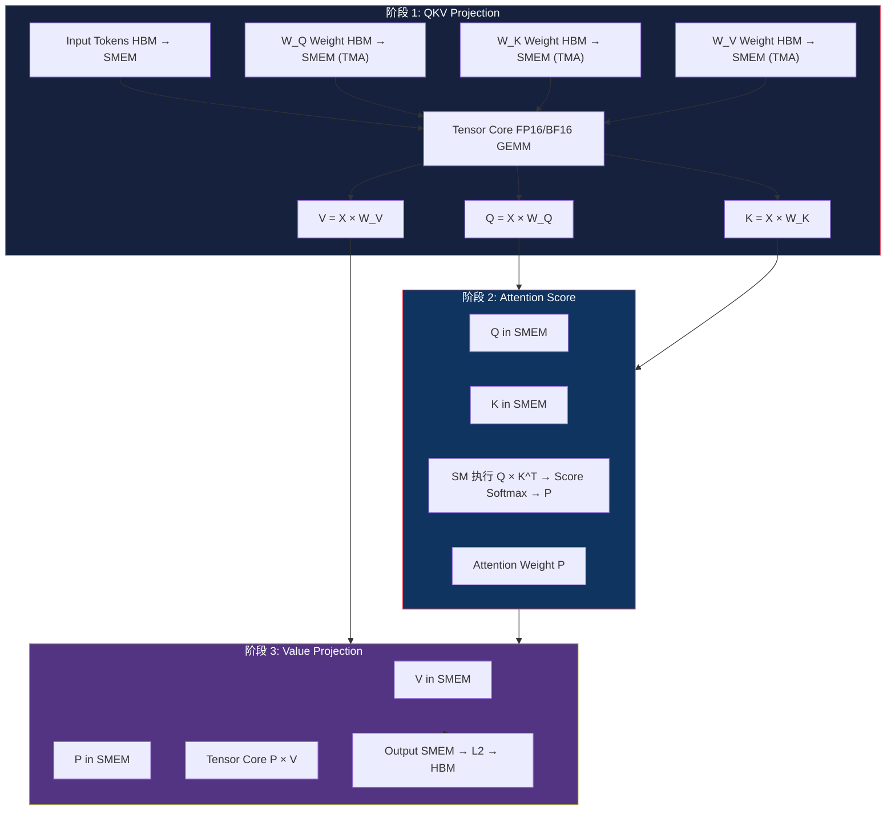

### 9.2 大模型训练 (Backward Pass) 数据流

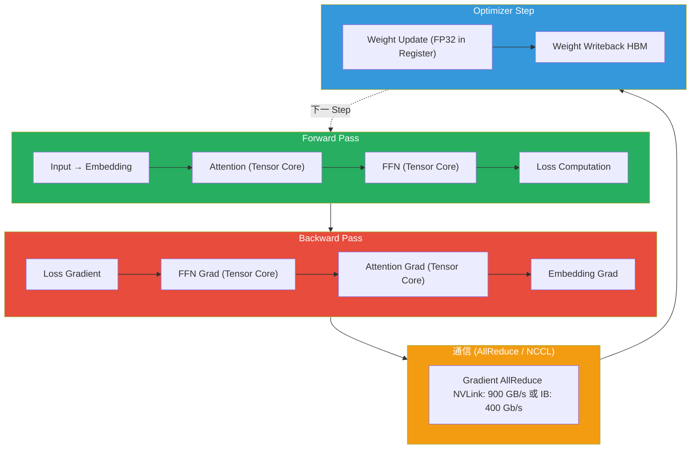

---

## 10. 关键规格速查表

### 10.1 H100 SXM5 核心规格

| 参数 | 数值 |
|------|------|
| **工艺** | TSMC 4N (定制 4nm) |
| **晶体管** | ~800 亿 |
| **Die 面积** | ~814 mm² |
| **TDP** | 700W |
| **SM 数量** | 132 |
| **CUDA Cores** | 16,896 (132 × 128) |
| **Tensor Cores** | 528 (132 × 4) |
| **FP32 峰值** | ~60 TFLOPS (dense) / ~120 TFLOPS (sparse) |
| **FP8 Tensor 峰值** | ~3,958 TFLOPS (dense) / ~7,916 TFLOPS (sparse) |
| **FP16/BF16 Tensor 峰值** | ~1,979 TFLOPS (dense) / ~3,958 TFLOPS (sparse) |
| **TF32 Tensor 峰值** | ~989 TFLOPS (dense) / ~1,979 TFLOPS (sparse) |
| **FP64 峰值** | ~34 TFLOPS (dense) / ~67 TFLOPS (sparse) |
| **L1/Shared Mem / SM** | 256 KB (可配置) |
| **L2 Cache** | 50 MB |
| **HBM3** | 80 GB, 3.35 TB/s |
| **内存总线** | 6144-bit |
| **NVLink 4** | 18 links, 900 GB/s 总带宽 |
| **PCIe Gen5** | x16, 64 GB/s |
| **SM Base Clock** | 1.095 GHz |
| **SM Boost Clock** | 1.830 GHz |

### 10.2 每周期吞吐量 (Per SM)

| 功能单元 | 数量 | 每周期操作数 |
|----------|------|------------|
| FP32 ALU | 128 | 128 ops/clock |
| FP64 ALU | 64 | 64 ops/clock |
| INT32 ALU | 64 | 64 ops/clock |
| SFU | 32 | 32 ops/clock |
| LD/ST Units | 32 | 128 B/clock (SMem) / 128 B/clock (Global) |
| Tensor Core (FP8) | 4 | 4,096 ops/clock |
| Tensor Core (FP16) | 4 | 2,048 ops/clock |
| Tensor Core (TF32) | 4 | 1,024 ops/clock |

### 10.3 Cache Line 汇总

| 层级 | Cache Line Size | 访问粒度 |
|------|----------------|---------|
| Register | 32-bit (1 register) | 1 register |
| Shared Memory | 4 B (32-bit word) | 32-bit, 按 bank 访问 |
| L1 Cache | **128 B** | 128 B (32 个 float) |
| L2 Cache | **128 B** | 128 B |
| HBM3 | 128 B (对齐) | 128 B burst |

### 10.4 各级执行延迟参考

| 操作 | 延迟 (cycles) | 延迟 (ns @ 1.83 GHz) |
|------|--------------|---------------------|
| 寄存器读取 | 1 | ~0.5 ns |
| Shared Memory 访问 | 20-30 | ~11-16 ns |
| L1 Cache 命中 | 20-30 | ~11-16 ns |
| L2 Cache 命中 | ~200 | ~109 ns |
| HBM3 访问 | 300-500 | ~164-273 ns |
| FP32 FMA | 4 | ~2.2 ns |
| FP64 FMA | 4-8 | ~2.2-4.4 ns |
| Tensor Core (MMA) | ~16-32 | ~8.7-17.5 ns |
| SFU (transcendental) | ~16-32 | ~8.7-17.5 ns |
| Warp 切换 | 0 | **零开销** |

---

## 附录：性能优化要点

1. **Occupancy 最大化**: 确保 active Warps 足够多以隐藏内存延迟（推荐每个 SM 至少 6-8 个 active Thread Block）
2. **L1/Shared Memory 调优**: 根据访问模式选择合理分配比例；矩阵运算推荐最大化 Shared Memory
3. **Coalesced Memory Access**: 同一 Warp 内线程访问连续地址，最大化单次 LD/ST 的 128 B cache line 利用率
4. **TMA 利用**: 在 Hopper 上尽可能使用 TMA 进行数据搬运，释放 SM 算力
5. **Tensor Core 利用**: FP8 精度提供 4x FP32 / 2x FP16 的吞吐量，适合训练和推理
6. **Thread Block Cluster**: Hopper 新特性，允许跨 SM 直接访问 Shared Memory，减少 L2/HBM 访问
7. **软件 Pipeline**: 使用 TMA + 双缓冲实现计算与数据搬运的完全重叠
