# PyTorch torch.nn 模块解析

> 基于 `pytorch-main/torch/nn/` 源码深度分析，涵盖 Module 基类、层实现、Functional API、并行模块等完整架构。

---

## 目录

1. [torch.nn 概览](#1-torchnn-概览)
2. [Module 基类深度解析](#2-module-基类深度解析)
3. [层实现模式分析](#3-层实现模式分析)
4. [Functional API](#4-functional-api)
5. [并行与分布式模块](#5-并行与分布式模块)
6. [参数初始化](#6-参数初始化)
7. [工具函数](#7-工具函数)
8. [时序流程图](#8-时序流程图)

---

## 1. torch.nn 概览

`torch.nn` 是 PyTorch 神经网络构建的核心包，提供：

- **Module 基类** — 所有神经网络组件的根基
- **预置层** — 160+ 层实现（Linear, Conv, RNN, Transformer...）
- **损失函数** — CrossEntropyLoss, MSELoss, BCELoss 等
- **容器** — Sequential, ModuleList, ModuleDict
- **Functional API** — 无状态函数式接口（`F.relu`, `F.conv2d`...）
- **并行模块** — DataParallel, DistributedDataParallel
- **参数初始化** — kaiming, xavier, uniform, normal 等
- **工具函数** — 梯度裁剪、参数转换、权重共享等

### 目录结构

```
torch/nn/
├── __init__.py           # 包入口，导出所有公共 API
├── modules/
│   ├── module.py         # ★ Module 基类（核心中的核心）
│   ├── container.py      # Sequential, ModuleList, ModuleDict, ParameterList
│   ├── linear.py         # Linear, Bilinear, Identity
│   ├── conv.py           # Conv1d/2d/3d, ConvTranspose1d/2d/3d
│   ├── batchnorm.py      # BatchNorm1d/2d/3d, InstanceNorm, SyncBatchNorm
│   ├── normalization.py  # LayerNorm, GroupNorm, RMSNorm
│   ├── activation.py     # ReLU, GELU, SiLU, Sigmoid, Tanh, PReLU...
│   ├── pooling.py        # MaxPool, AvgPool, AdaptivePool
│   ├── rnn.py            # RNN, LSTM, GRU
│   ├── transformer.py    # Transformer, TransformerEncoder/Decoder/Layer
│   ├── dropout.py        # Dropout, AlphaDropout
│   ├── loss.py           # CrossEntropyLoss, MSELoss, BCELoss...
│   ├── sparse.py         # Embedding, EmbeddingBag
│   ├── flatten.py        # Flatten, Unflatten
│   ├── padding.py        # Pad, ConstantPad, ReflectionPad...
│   └── ...
├── functional.py         # ★ Functional API（6952 行，所有无状态函数）
├── parallel/
│   ├── distributed.py    # ★ DistributedDataParallel (DDP)
│   ├── data_parallel.py  # DataParallel (DP, 已不推荐)
│   └── ...
├── init.py               # 参数初始化函数
├── parameter.py          # Parameter, Buffer, UninitializedParameter
├── utils/
│   ├── clip_grad.py      # 梯度裁剪 (clip_grad_norm_, clip_grad_value_)
│   ├── rnn_utils.py      # RNN 工具 (pack_padded_sequence, pad_sequence)
│   ├── spectral_norm.py  # 谱归一化
│   └── ...
└── attention/
    ├── scaled_dot_product_attention.py  # SDPA
    └── ...
```

---

## 2. Module 基类深度解析

### 2.1 Module 的核心数据结构

**文件**: `torch/nn/modules/module.py`

Module 维护五个核心字典，存储其全部状态：

```python
class Module:
    _parameters: dict[str, Parameter | None]   # 可学习参数
    _buffers: dict[str, Tensor | None]         # 非可学习张量（如 BatchNorm running stats）
    _modules: dict[str, Module | None]         # 子模块
    _forward_pre_hooks: dict[int, Callable]    # 前向 pre-hooks
    _forward_hooks: dict[int, Callable]        # 前向 post-hooks
    _backward_hooks: dict[int, Callable]       # 反向 hooks
    _backward_pre_hooks: dict[int, Callable]   # 反向 pre-hooks
    training: bool = True                      # 训练/评估模式
```

### 2.2 参数自动注册机制 — `__setattr__`

Module 的 `__setattr__` 是最关键的方法，它拦截所有属性赋值，根据值的类型自动注册到对应的字典中：

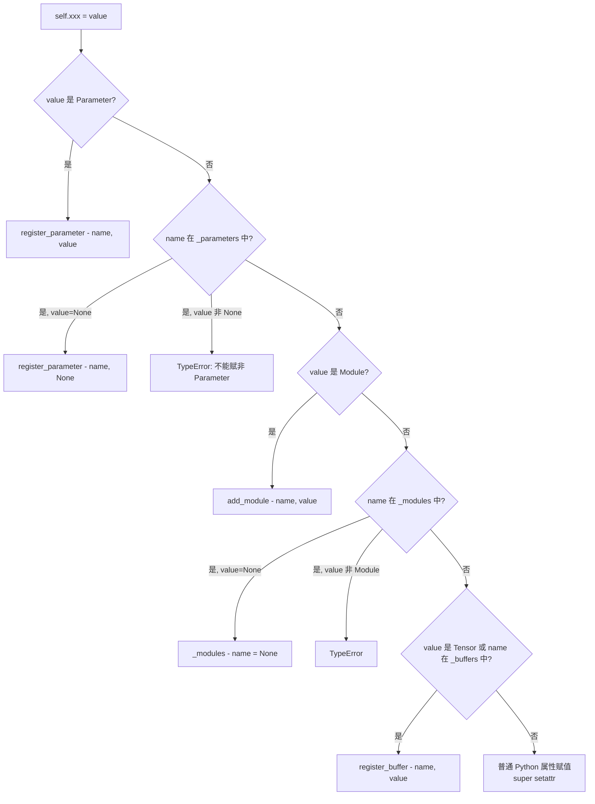

这意味着：
- `self.weight = nn.Parameter(...)` → 自动注册到 `_parameters`
- `self.conv1 = nn.Conv2d(...)` → 自动注册到 `_modules`
- `self.register_buffer('running_mean', ...)` → 显式注册到 `_buffers`

### 2.3 属性查找 — `__getattr__`

当 Python 正常属性查找失败时，`__getattr__` 按顺序搜索三个字典：

```python
def __getattr__(self, name):
    if name in self._parameters: return self._parameters[name]
    if name in self._buffers:    return self._buffers[name]
    if name in self._modules:    return self._modules[name]
    raise AttributeError(f"'{type(self).__name__}' has no attribute '{name}'")
```

### 2.4 `__call__` → `forward` 调用链

这是 Module 最核心的执行路径。当调用 `model(inputs)` 时：

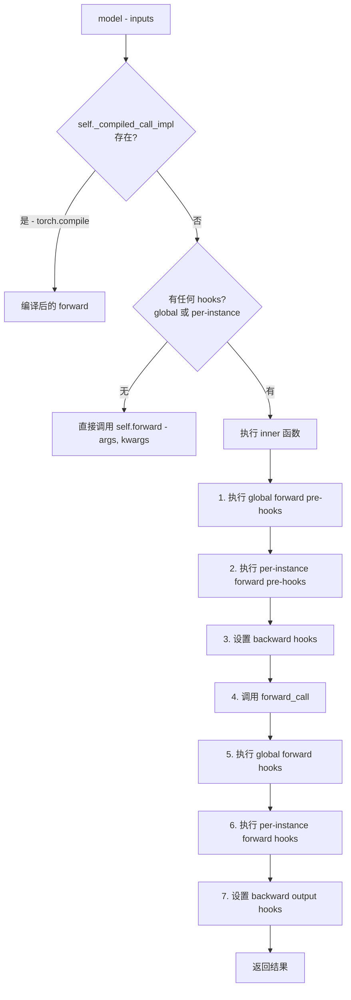

**Fast Path 优化**：当没有任何 hooks 时（最常见情况），直接调用 `self.forward()` 跳过所有 hook 检查逻辑，这是一个重要的性能优化。

### 2.5 Hook 系统

Module 提供了完整的 Hook 机制，支持全局和实例级两种粒度：

| Hook 类型 | 签名 | 时机 |
|-----------|------|------|
| `register_forward_pre_hook` | `(module, args) → args` | forward 前 |
| `register_forward_hook` | `(module, args, output) → output` | forward 后 |
| `register_full_backward_pre_hook` | `(module, grad_output) → grad_output` | backward 前 |
| `register_full_backward_hook` | `(module, grad_input, grad_output) → grad_input` | backward 后 |

- `prepend=True` 可将 hook 插入到队列最前面
- `with_kwargs=True` 可接收 kwargs
- `always_call=True` 即使 forward 异常也会调用
- 全局 hook 通过 `register_module_forward_hook` 注册，对所有 Module 生效

### 2.6 `_apply` — 设备/类型转换引擎

`to()`, `cuda()`, `cpu()`, `float()`, `half()` 等方法都委托给 `_apply(fn)`：

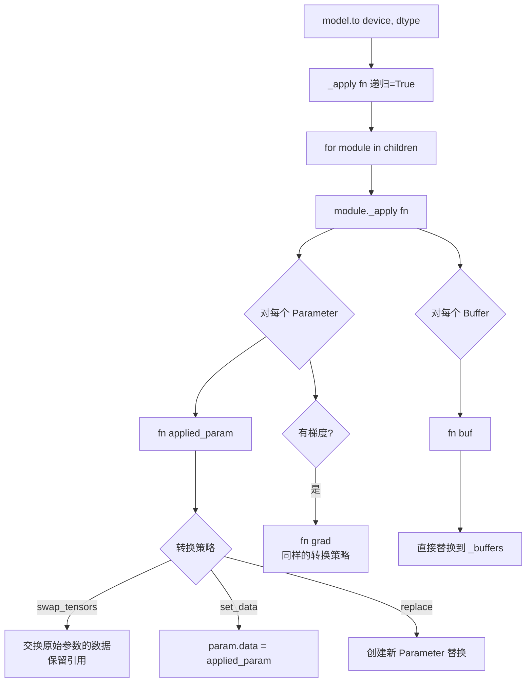

三种转换策略：
- **Swap**（默认）：交换底层数据，保留 Parameter 引用
- **Set-data**：`param.data = new_data`
- **Replace**：创建全新 Parameter 替换

### 2.7 `state_dict` / `load_state_dict`

**`state_dict()`**：收集所有模块的 parameters 和 persistent buffers（非 None），以 `OrderedDict` 返回。key 格式为 `prefix.name`。

**`load_state_dict()`**：将 state_dict 加载到模块中，处理：
- 缺失的 key（missing_keys）— 警告
- 多余的 key（unexpected_keys）— 警告
- 形状不匹配 — 默认报错，`strict=False` 时忽略

支持 pre-hooks 和 post-hooks 进行自定义加载逻辑。

### 2.8 `train()` / `eval()` 模式切换

```python
def train(self, mode=True):
    self.training = mode
    for module in self.children():
        module.train(mode)
    return self
```

递归设置所有子模块的 `training` 属性。影响的模块包括：
- **Dropout** — train 时随机丢弃，eval 时不丢弃
- **BatchNorm** — train 时用 batch 统计量并更新 running stats，eval 时用 running stats

### 2.9 `zero_grad()`

```python
def zero_grad(self, set_to_none=True):
    for p in self.parameters():
        if p.grad is not None:
            if set_to_none:
                p.grad = None    # 更快，避免 memset
            else:
                p.grad.zero_()
```

`set_to_none=True`（默认）比 `zero_()` 更快，且能让优化器检测到未被使用的参数。

---

## 3. 层实现模式分析

### 3.1 通用设计模式

所有 PyTorch 层都遵循相同的模式：

```
1. __init__: 超类 __init__ + 创建 Parameter/Buffer + reset_parameters
2. reset_parameters: 权重初始化
3. forward: 调用 F.xxx(输入, 参数)
4. extra_repr: 返回构造参数的字符串表示
```

### 3.2 Linear 层

**文件**: `torch/nn/modules/linear.py`

```python
class Linear(Module):
    def __init__(self, in_features, out_features, bias=True, device=None, dtype=None):
        super().__init__()
        self.in_features = in_features
        self.out_features = out_features
        self.weight = Parameter(torch.empty((out_features, in_features)))
        if bias:
            self.bias = Parameter(torch.empty(out_features))
        else:
            self.register_parameter("bias", None)  # 保持 state_dict 键一致
        self.reset_parameters()

    def reset_parameters(self):
        init.kaiming_uniform_(self.weight, a=math.sqrt(5))  # 等价于 Uniform(-1/sqrt(in), 1/sqrt(in))
        if self.bias is not None:
            bound = 1 / math.sqrt(self.weight.size(1))
            init.uniform_(self.bias, -bound, bound)

    def forward(self, input):
        return F.linear(input, self.weight, self.bias)  # y = xA^T + b
```

- **权重形状**: `(out_features, in_features)`
- **计算公式**: `output = input @ weight.T + bias`
- **初始化**: Kaiming Uniform + Uniform bias

### 3.3 卷积层 — Template Method 模式

**文件**: `torch/nn/modules/conv.py`

```
_ConvNd (基类)
  ├── 权重创建 (根据 transposed/维度确定形状)
  ├── reset_parameters (kaiming_uniform_)
  ├── forward() → 调用 self._conv_forward()
  │
  ├── Conv1d → _conv_forward() 使用 F.conv1d
  ├── Conv2d → _conv_forward() 使用 F.conv2d
  └── Conv3d → _conv_forward() 使用 F.conv3d
```

**权重形状**:
- 标准: `(out_channels, in_channels/groups, *kernel_size)`
- 转置: `(in_channels, out_channels/groups, *kernel_size)`

### 3.4 BatchNorm — 训练/评估双模式

**文件**: `torch/nn/modules/batchnorm.py`

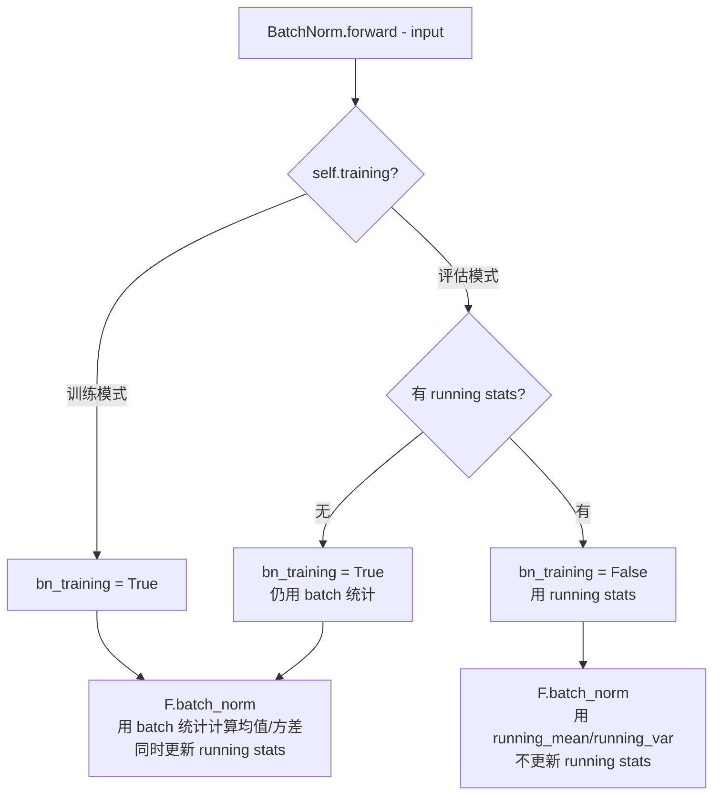

| 属性 | 类型 | 说明 |
|------|------|------|
| `weight` | Parameter (gamma) | 可学习缩放因子 |
| `bias` | Parameter (beta) | 可学习偏移因子 |
| `running_mean` | Buffer | 指数移动平均的均值 |
| `running_var` | Buffer | 指数移动平均的方差 |
| `num_batches_tracked` | Buffer (long) | 已跟踪的 batch 数 |

### 3.5 Normalization 层对比

| 层 | 归一化维度 | 训练/评估行为 | 可学习参数 | Buffer |
|----|-----------|-------------|-----------|--------|
| BatchNorm | per-channel per-batch | train: batch stats; eval: running stats | weight, bias | running_mean, running_var |
| LayerNorm | per-sample per-feature | train/eval 相同 (用输入统计量) | weight, bias | 无 |
| GroupNorm | per-group per-sample | train/eval 相同 (用输入统计量) | weight, bias | 无 |
| RMSNorm | per-sample per-feature | train/eval 相同 (用输入统计量) | weight (无 bias) | 无 |
| InstanceNorm | per-channel per-sample | train/eval 相同或可选 running stats | weight, bias | 可选 |

### 3.6 Transformer 模块架构

**文件**: `torch/nn/modules/transformer.py`

```
TransformerEncoder
  └── norm (可选 LayerNorm)
  └── layers: N x TransformerEncoderLayer
        ├── self_attn (MultiheadAttention)
        ├── linear1 (Linear: d_model → dim_feedforward)
        ├── linear2 (Linear: dim_feedforward → d_model)
        ├── norm1 (LayerNorm)
        ├── norm2 (LayerNorm)
        ├── dropout, dropout1, dropout2
        └── activation (relu/gelu)
```

**两种架构**:
- **Post-norm** (原版 Transformer): `x = norm(x + sublayer(x))`
- **Pre-norm** (GPT-2 风格): `x = x + sublayer(norm(x))`

由 `norm_first` 参数控制。

### 3.7 RNN 层 (LSTM/GRU)

**文件**: `torch/nn/modules/rnn.py`

LSTM 每层每方向创建 4 组权重（input/forget/cell/output gates）：

```
weight_ih_l{layer}   (4*hidden_size, input_size)    — 输入到隐藏
weight_hh_l{layer}   (4*hidden_size, hidden_size)   — 隐藏到隐藏
bias_ih_l{layer}     (4*hidden_size,)               — 输入偏置
bias_hh_l{layer}     (4*hidden_size,)               — 隐藏偏置 (CuDNN 兼容)
```

双方向时加 `_reverse` 后缀。支持 `proj_size` 投影和 `flatten_parameters()` 优化（合并为连续内存块以使用 CuDNN 快速路径）。

### 3.8 Activation 层

所有激活层都是超薄封装，无可学习参数（PReLU 除外）：

| 层 | 公式 | 可学习参数 |
|----|------|-----------|
| ReLU | max(0, x) | 无 |
| GELU | x * Phi(x) | 无 |
| SiLU | x * sigmoid(x) | 无 |
| LeakyReLU | max(alpha*x, x) | 无 |
| PReLU | max(alpha*x, x) | weight (alpha) |
| Sigmoid | 1/(1+exp(-x)) | 无 |
| Tanh | tanh(x) | 无 |

---

## 4. Functional API

**文件**: `torch/nn/functional.py` (6952 行)

### 4.1 设计理念

Functional API 是**无状态的纯函数**，与 Module 类一一对应：

```
Module 类           →    Functional 函数
─────────────────────────────────────────
nn.Conv2d(weight, bias)   →    F.conv2d(input, weight, bias, ...)
nn.ReLU(inplace=True)     →    F.relu(input, inplace=True)
nn.BatchNorm2d(...)       →    F.batch_norm(input, running_mean, running_var, weight, bias, ...)
nn.Linear(weight, bias)   →    F.linear(input, weight, bias)
nn.CrossEntropyLoss()     →    F.cross_entropy(input, target, ...)
nn.Dropout(p)             →    F.dropout(input, p, training)
nn.Embedding(weight)      →    F.embedding(input, weight, ...)
```

### 4.2 两种实现模式

**Pattern A — C++ 函数包装**（薄包装）:
```python
linear = _add_docstr(torch._C._VariableFunctions.linear, r"""...""")
scaled_dot_product_attention = _add_docstr(torch._native_scaled_dot_product_attention, r"""...""")
```

**Pattern B — Python 完整实现**（含完整逻辑）:
```python
def batch_norm(input, running_mean, running_var, weight, bias, training, momentum, eps):
    # 完整的归一化逻辑
    ...
```

### 4.3 使用场景

- 在自定义 Module 的 `forward()` 中调用
- 不需要创建 Module 实例时直接使用
- 函数式编程风格

---

## 5. 并行与分布式模块

### 5.1 DataParallel (DP) — 单机多 GPU

**文件**: `torch/nn/parallel/data_parallel.py`

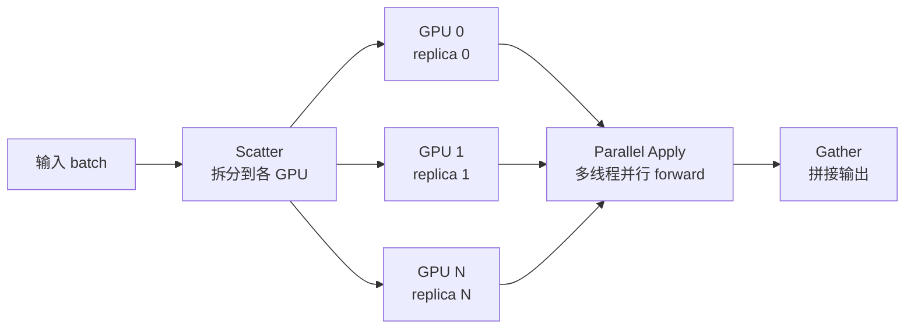

- **范围**: 单进程多 GPU（线程级并行）
- **缺点**: GIL 争用、每次 forward 都复制模块、不支持多机
- **已不推荐**: 官方推荐使用 DDP

### 5.2 DistributedDataParallel (DDP) — 多进程多 GPU

**文件**: `torch/nn/parallel/distributed.py`

DDP 的核心是 **C++ Reducer**，它管理梯度同步：

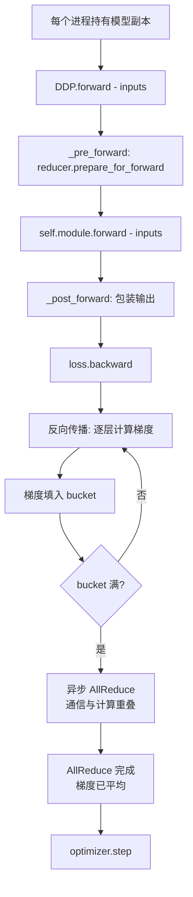

**关键优化**:
- **Bucketed AllReduce**: 梯度按 bucket 大小（默认 25MiB）分桶，填满即启动 AllReduce，通信与后续计算重叠
- **Gradient-as-bucket-view**: `param.grad` 直接指向通信 buffer 的偏移，避免额外拷贝
- **Mixed Precision**: 支持 FP16/BF16 参数 + FP32 通信
- **Static Graph**: 静态图优化，跳过未使用参数检测
- **Join**: 处理不同 rank 输入不均匀的情况

### 5.3 DP vs DDP 对比

| 特性 | DP | DDP |
|------|----|----|
| 并行方式 | 单进程多线程 | 多进程 |
| 模型复制 | 每次 forward 复制 | 每进程持久副本 |
| 梯度同步 | autograd 自动求和 | 显式 AllReduce + 分桶 |
| 性能 | 较慢（GIL） | 快，通信计算重叠 |
| 多机扩展 | 不支持 | 支持 |
| 推荐 | 不推荐 | 推荐 |

---

## 6. 参数初始化

**文件**: `torch/nn/init.py`

| 函数 | 分布 | 典型用途 |
|------|------|---------|
| `kaiming_uniform_` / `kaiming_normal_` | He 初始化 | Conv, Linear (ReLU 系列) |
| `xavier_uniform_` / `xavier_normal_` | Glorot 初始化 | Transformer |
| `uniform_` | 均匀分布 | 通用 |
| `normal_` | 正态分布 | 通用 |
| `zeros_` / `ones_` | 常量 | BatchNorm, LayerNorm |
| `constant_` | 指定常量 | 自定义 |
| `eye_` | 单位矩阵 | 特殊结构 |
| `sparse_` | 稀疏初始化 | Embedding |
| `dirac_` | Dirac delta | 特定正交初始化 |
| `orthogonal_` | 正交初始化 | RNN |
| `trunc_normal_` | 截断正态 | ViT, GPT 系列 |

**默认初始化规则**:
- Linear / Conv → `kaiming_uniform_(a=sqrt(5))`
- BatchNorm → weight=1, bias=0
- LayerNorm → weight=1, bias=0
- Embedding → `normal_(0, 1)`

---

## 7. 工具函数

### 7.1 梯度裁剪

**文件**: `torch/nn/utils/clip_grad.py`

```python
# 按范数裁剪（最常用）
torch.nn.utils.clip_grad_norm_(model.parameters(), max_norm=1.0)

# 按值裁剪
torch.nn.utils.clip_grad_value_(model.parameters(), clip_value=0.5)
```

`clip_grad_norm_` 算法：
1. 计算所有梯度的总范数 `total_norm`
2. 计算缩放系数 `clip_coef = min(max_norm / (total_norm + eps), 1.0)`
3. 所有梯度乘以 `clip_coef`
4. 返回 `total_norm`（可用于日志）

### 7.2 容器类

**文件**: `torch/nn/modules/container.py`

| 容器 | 用途 | state_dict 键格式 |
|------|------|-------------------|
| `Sequential` | 顺序链 `0.layer1, 1.layer2` | `0.weight, 1.weight` |
| `ModuleList` | 索引列表 `modules[0], modules[1]` | `0.weight, 1.weight` |
| `ModuleDict` | 命名字典 `modules['conv'], modules['bn']` | `conv.weight, bn.weight` |
| `ParameterList` | 参数列表 | `0`, `1` |
| `ParameterDict` | 参数字典 | 键名 |

---

## 8. 时序流程图

### 8.1 Module 生命周期：从创建到推理

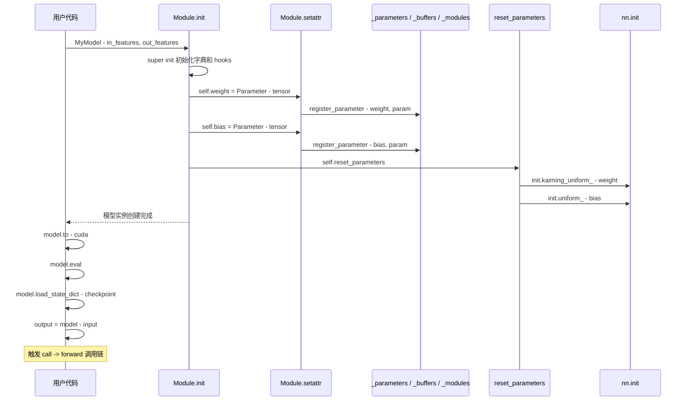

### 8.2 Module.forward 完整调用链

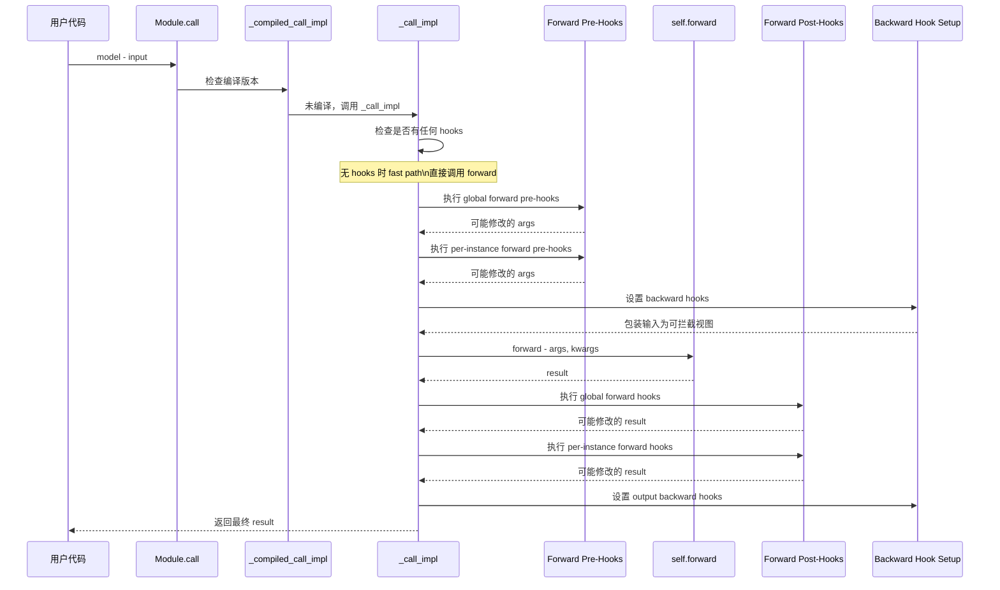

### 8.3 自定义 Module 的典型 forward 流程

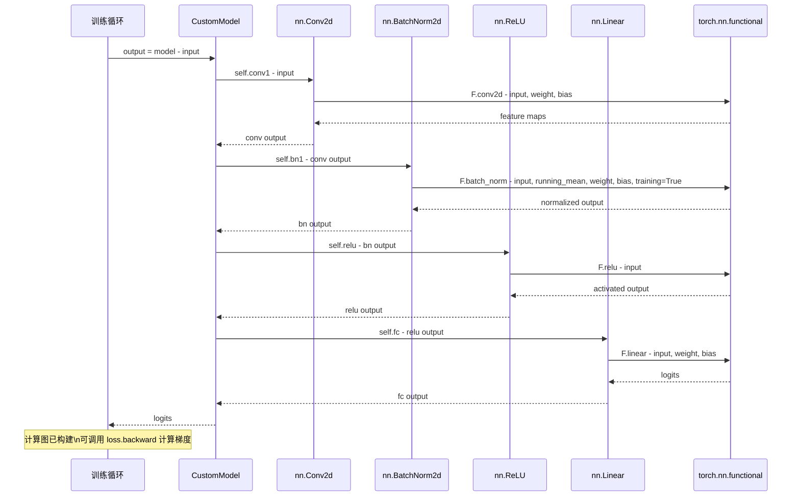

### 8.4 BatchNorm 训练 vs 评估对比

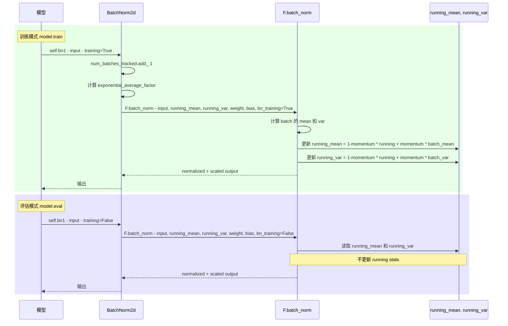

### 8.5 state_dict 保存与加载

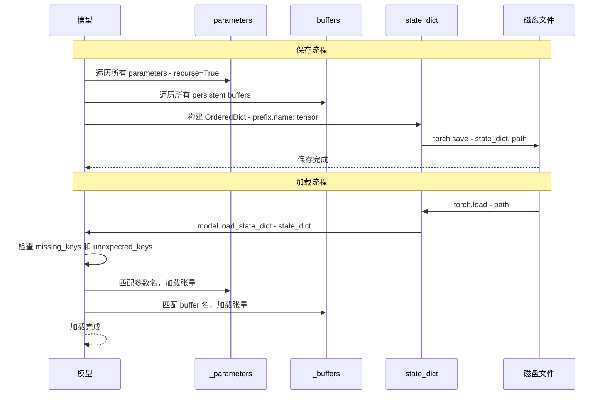

### 8.6 DDP 训练完整时序

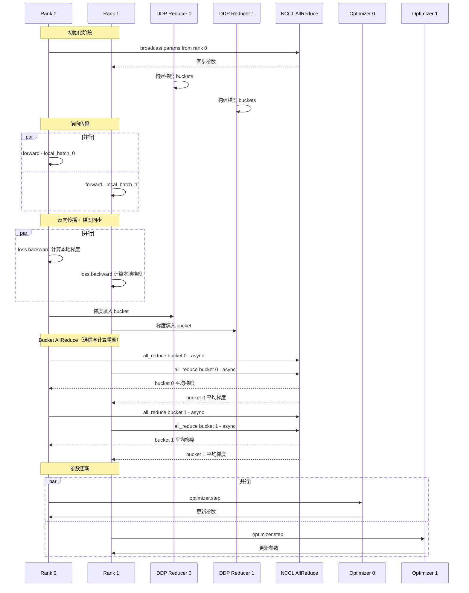

### 8.7 DataParallel 前向传播流程

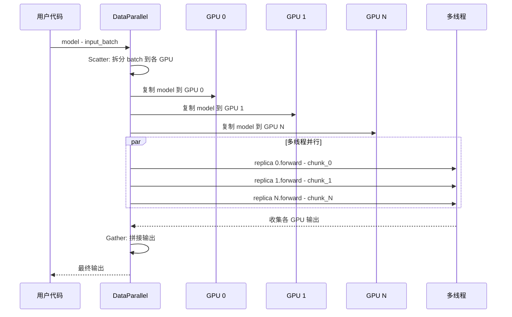

### 8.8 train/eval 模式切换影响

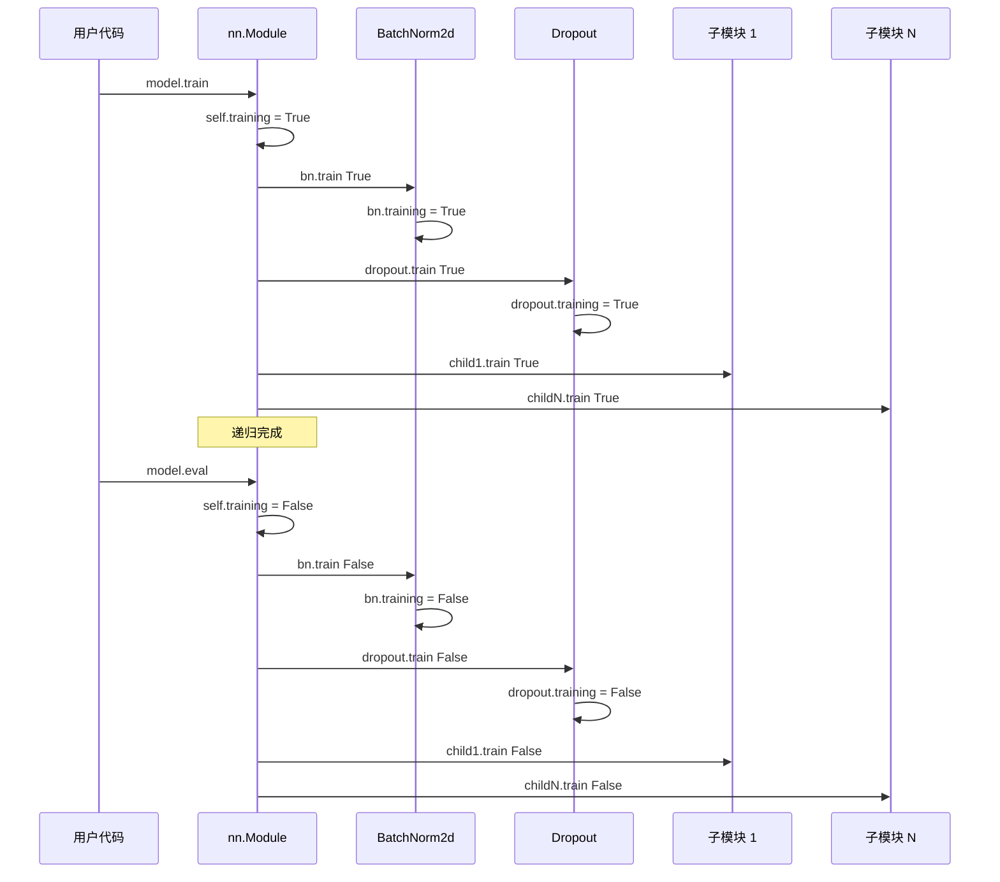

### 8.9 典型训练循环中 nn 的完整交互

```mermaid
sequenceDiagram
    participant User as 训练循环
    participant DL as DataLoader
    participant Model as nn.Module
    participant LossFn as CrossEntropyLoss
    participant AG as Autograd
    participant Opt as Optimizer
    participant Clip as clip_grad_norm_

    loop 每个 epoch
        loop 每个 batch
            User->>DL: for inputs, targets in dataloader
            DL-->>User: batch data

            User->>Opt: optimizer.zero_grad
            Note over Opt: set_to_none=True

            User->>Model: outputs = model - inputs
            Note over Model: forward 构建计算图

            User->>LossFn: loss = criterion - outputs, targets
            Note over LossFn: 计算损失

            User->>AG: loss.backward
            Note over AG: 反向传播计算梯度

            User->>Clip: clip_grad_norm_ - model.parameters, max_norm=1.0
            Note over Clip: 按范数裁剪梯度

            User->>Opt: optimizer.step
            Note over Opt: 用裁剪后的梯度更新参数
        end
    end

    User->>Model: torch.save - model.state_dict, checkpoint.pth
    Note over User: 保存训练好的模型
```
