# PyTorch torch.optim 模块深度分析

## 目录

1. [模块总览](#1-模块总览)
2. [Optimizer 基类架构](#2-optimizer-基类架构)
3. [优化器算法详解](#3-优化器算法详解)
4. [学习率调度器](#4-学习率调度器)
5. [训练循环完整流程](#5-训练循环完整流程)
6. [内核加速路径](#6-内核加速路径)

---

## 1. 模块总览

`torch.optim` 是 PyTorch 的优化器模块，提供模型参数更新的核心能力。模块由三大部分组成：

- **Optimizer 基类**：定义统一的优化器接口、参数分组、状态管理、Hook 系统
- **具体优化算法**：SGD、Adam、AdamW、NAdam、RAdam、AdaMax、Adagrad、RMSprop、LBFGS 等
- **学习率调度器**：StepLR、CosineAnnealingLR、OneCycleLR、ReduceLROnPlateau 等

### 1.1 模块架构图

```mermaid
graph TB
    subgraph torch.optim
        OptimizerBase["Optimizer 基类\noptimizer.py"]
        SchedulerBase["LRScheduler 基类\nlr_scheduler.py"]
    end

    subgraph 优化算法
        SGD["SGD\nsgd.py"]
        Adam["Adam\nadam.py"]
        AdamW["AdamW\nadamw.py"]
        NAdam["NAdam\nnadam.py"]
        RAdam["RAdam\nradam.py"]
        AdaMax["AdaMax\nadamax.py"]
        Adagrad["Adagrad\nadagrad.py"]
        RMSprop["RMSprop\nrmsprop.py"]
        LBFGS["LBFGS\nlbfgs.py"]
        Adadelta["Adadelta\nadadelta.py"]
        ASGD["ASGD\nasgd.py"]
        SparseAdam["SparseAdam\nsparse_adam.py"]
    end

    subgraph 学习率调度器
        StepLR["StepLR"]
        MultiStepLR["MultiStepLR"]
        CosineAnnealingLR["CosineAnnealingLR"]
        OneCycleLR["OneCycleLR"]
        ReduceLROnPlateau["ReduceLROnPlateau"]
        CyclicLR["CyclicLR"]
        ExponentialLR["ExponentialLR"]
        SequentialLR["SequentialLR"]
    end

    AdamW -.->|"继承 decoupled_weight_decay=True"| Adam
    SGD --> OptimizerBase
    Adam --> OptimizerBase
    NAdam --> OptimizerBase
    RAdam --> OptimizerBase
    AdaMax --> OptimizerBase
    Adagrad --> OptimizerBase
    RMSprop --> OptimizerBase
    LBFGS --> OptimizerBase
    Adadelta --> OptimizerBase
    ASGD --> OptimizerBase
    SparseAdam --> OptimizerBase

    StepLR --> SchedulerBase
    MultiStepLR --> SchedulerBase
    CosineAnnealingLR --> SchedulerBase
    OneCycleLR --> SchedulerBase
    ReduceLROnPlateau --> SchedulerBase
    CyclicLR --> SchedulerBase
    ExponentialLR --> SchedulerBase
    SequentialLR --> SchedulerBase

    SchedulerBase -.->|"持有 optimizer 引用"| OptimizerBase
```

---

## 2. Optimizer 基类架构

### 2.1 核心数据结构

Optimizer 基类（[optimizer.py](torch/optim/optimizer.py)）维护三个核心属性：

| 属性 | 类型 | 说明 |
|------|------|------|
| `self.defaults` | `dict` | 超参数默认值，如 lr、momentum、weight_decay |
| `self.param_groups` | `list[dict]` | 参数分组列表，每组有自己的超参数和参数列表 |
| `self.state` | `defaultdict[Tensor, dict]` | 以参数张量为 key 的状态字典，存储 momentum_buffer、exp_avg 等 |

### 2.2 初始化流程

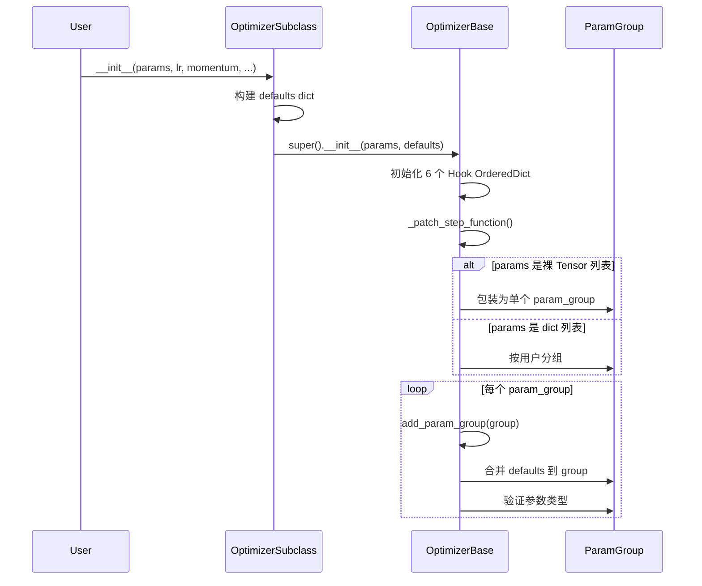

### 2.3 参数分组机制

`param_groups` 是 `torch.optim` 的核心设计，允许不同层使用不同的超参数：

```python
optimizer = torch.optim.SGD([
    {'params': model.base.parameters(), 'lr': 1e-3},       # 基础层：较小 lr
    {'params': model.classifier.parameters(), 'lr': 1e-2}, # 分类器：较大 lr
    {'params': model.finetune.parameters(), 'lr': 5e-4, 'weight_decay': 0.01},
], momentum=0.9)  # momentum 对所有组默认生效
```

每个 `param_group` 是一个字典，包含：
- `params`：该组的参数列表
- 超参数：`lr`、`momentum`、`weight_decay` 等（未指定则从 `defaults` 继承）
- `initial_lr`：由 LRScheduler 添加，用于记录初始学习率

### 2.4 state 惰性初始化

优化器状态不是在构造时创建的，而是在第一次 `step()` 调用时惰性初始化。这种设计避免了构造优化器时的内存开销：

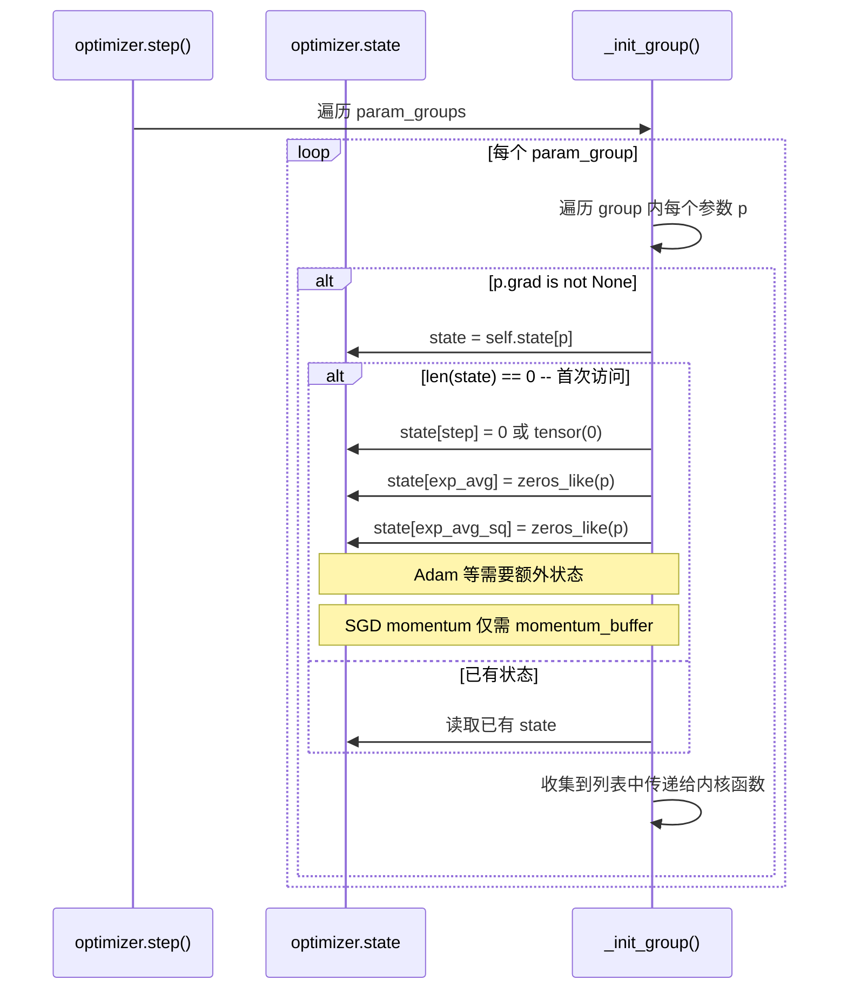

### 2.5 Hook 系统

Optimizer 提供两层 Hook 机制：

| Hook 类型 | 作用域 | 调用时机 |
|-----------|--------|----------|
| `_global_optimizer_pre_hooks` | 全局（所有 Optimizer 实例） | `step()` 执行前 |
| `_global_optimizer_post_hooks` | 全局（所有 Optimizer 实例） | `step()` 执行后 |
| `_optimizer_step_pre_hooks` | 实例级别 | `step()` 执行前 |
| `_optimizer_step_post_hooks` | 实例级别 | `step()` 执行后 |
| `_optimizer_state_dict_pre_hooks` | 实例级别 | `state_dict()` 前 |
| `_optimizer_state_dict_post_hooks` | 实例级别 | `state_dict()` 后 |

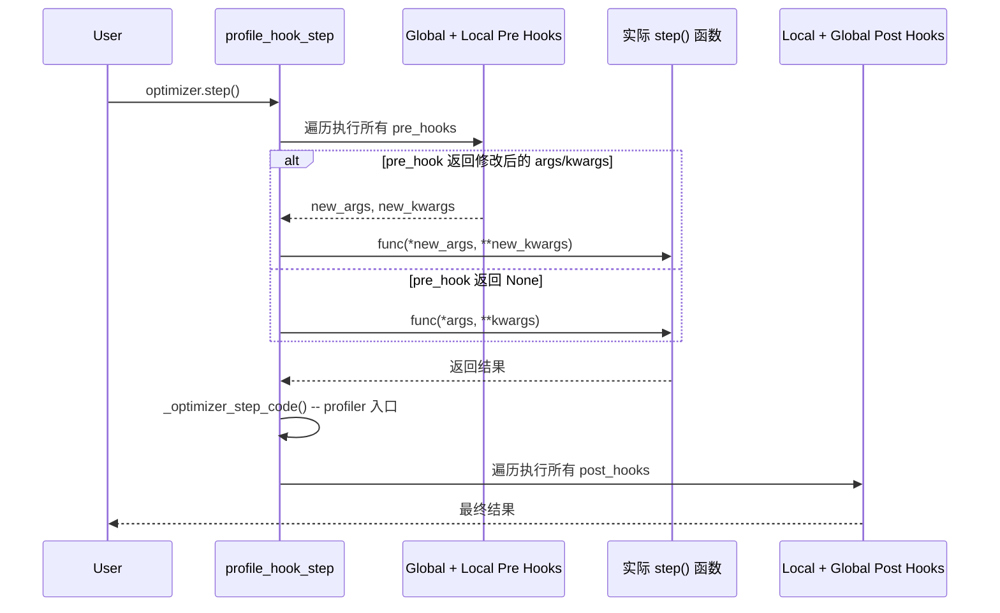

### 2.6 state_dict / load_state_dict

优化器的状态保存与恢复：

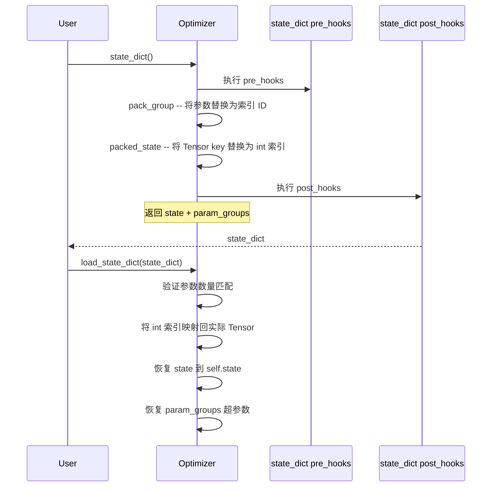

---

## 3. 优化器算法详解

### 3.1 SGD — 随机梯度下降

SGD（[sgd.py](torch/optim/sgd.py)）是最基础的优化器，支持 momentum、dampening、nesterov 和 weight_decay。

**核心公式：**

```
g_t = ∇f(θ_{t-1})
if weight_decay != 0:  g_t = g_t + λ * θ_{t-1}
if t > 1:  b_t = μ * b_{t-1} + (1-τ) * g_t
else:      b_t = g_t           -- 注意：首次初始化为梯度而非零
if nesterov:  g_t = g_t + μ * b_t   -- Hinton's formulation
else:         g_t = b_t
θ_t = θ_{t-1} - lr * g_t
```

**关键实现细节：**
- momentum buffer 首次初始化为当前梯度值（而非零），这是 PyTorch 的特定实现选择
- Nesterov 使用 Hinton 的公式（先更新梯度再计算方向），而非传统公式（先移动再计算梯度）
- 支持 `maximize` 参数，翻转梯度方向实现最大化

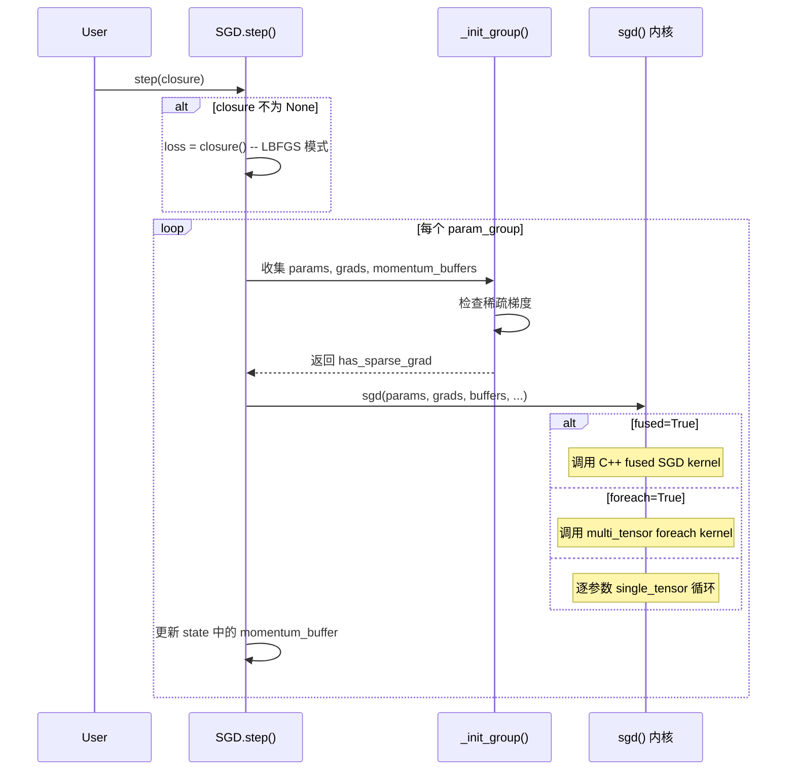

### 3.2 Adam — 自适应矩估计

Adam（[adam.py](torch/optim/adam.py)）结合了一阶动量（均值）和二阶动量（方差），是目前最常用的优化器。

**核心公式：**

```
m_t = β₁ * m_{t-1} + (1 - β₁) * g_t       -- 一阶矩（均值）
v_t = β₂ * v_{t-1} + (1 - β₂) * g_t²      -- 二阶矩（方差）
m̂_t = m_t / (1 - β₁^t)                     -- 偏差修正
v̂_t = v_t / (1 - β₂^t)                     -- 偏差修正
θ_t = θ_{t-1} - lr * m̂_t / (√v̂_t + ε)
```

**amsgrad 变体：**
```
v̂_t = max(v̂_{t-1}, v_t)                     -- 保留历史最大值
θ_t = θ_{t-1} - lr * m̂_t / (√v̂_t + ε)
```

**关键实现细节：**
- `decoupled_weight_decay` 选项：为 AdamW 预留，解耦权重衰减
- state 初始化时，`step` 默认放在 CPU 上（避免 GPU kernel launch 开销），除非 `capturable=True` 或 `fused=True`
- 不支持稀疏梯度（需用 SparseAdam）

### 3.3 AdamW — 解耦权重衰减

AdamW（[adamw.py](torch/optim/adamw.py)）继承自 Adam，唯一区别是强制 `decoupled_weight_decay=True`。

**与 Adam(L2) 的关键区别：**

```
Adam (L2 正则化):
    g_t = ∇f(θ) + λ * θ          -- 梯度中包含权重衰减
    m_t = β₁ * m_{t-1} + (1-β₁) * g_t   -- 衰减混入动量

AdamW (解耦衰减):
    g_t = ∇f(θ)                   -- 梯度不含权重衰减
    m_t = β₁ * m_{t-1} + (1-β₁) * g_t   -- 纯梯度动量
    θ_t = (1 - lr * λ) * θ_{t-1} - lr * m̂_t / (√v̂_t + ε)  -- 独立衰减
```

解耦衰减的核心价值：权重衰减不会影响自适应学习率的计算，使 lr 调度更加可预测。

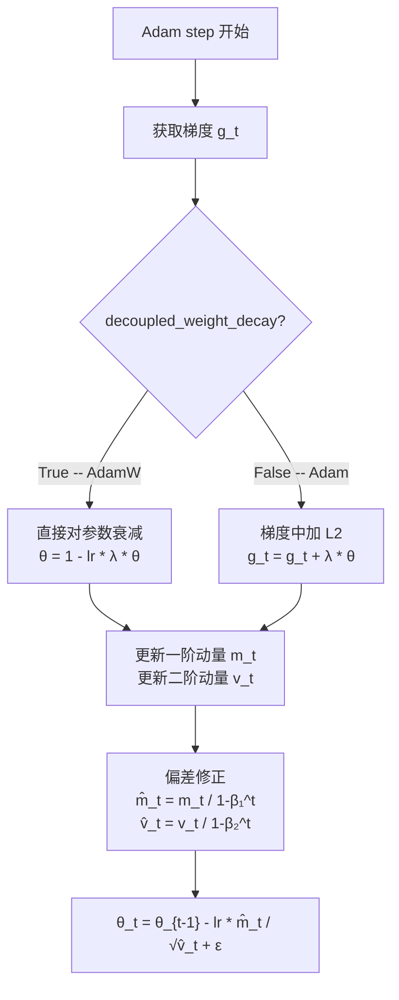

### 3.4 NAdam — Nesterov 加速 Adam

NAdam（[nadam.py](torch/optim/nadam.py)）将 Nesterov 动量融入 Adam 框架。

**核心公式：**
```
m_t = β₁ * m_{t-1} + (1 - β₁) * g_t
v_t = β₂ * v_{t-1} + (1 - β₂) * g_t²
m̂_t = μ_t * m_t / (1 - β₁^t) + (1 - β₁) * g_t / (1 - β₁^t)
     其中 μ_t = β₁ * (1 - 0.5 * 0.96^(t * momentum_decay))
θ_t = θ_{t-1} - lr * m̂_t / (√v̂_t + ε)
```

特点：`momentum_decay` 参数控制 Nesterov 动量的衰减调度。

### 3.5 RAdam — 方差修正的 Adam

RAdam（[radam.py](torch/optim/radam.py)）解决 Adam 在训练初期因方差估计不准确导致不稳定的问题。

**核心机制：**
```
ρ = inf(1, (2 - (1-β₂)^t * something) / ...)

if ρ >= threshold:
    使用 Adam 公式（自适应）
else:
    使用 SGD + momentum（退化为简单更新）
    v_t 被忽略，充当 rectification factor
```

训练初期（t 较小），二阶矩估计不可靠，RAdam 退化为近似 SGD；随着 step 增大，自动切换到 Adam 的自适应更新。这消除了 Adam 常见的 warmup 需求。

### 3.6 AdaMax — 无穷范数 Adam

AdaMax（[adamax.py](torch/optim/adamax.py)）将二阶矩的 L2 范数替换为 L∞ 范数：

```
m_t = β₁ * m_{t-1} + (1 - β₁) * g_t
u_t = max(β₂ * u_{t-1}, |g_t|)          -- L∞ 范数
θ_t = θ_{t-1} - lr * m̂_t / (u_t + ε)
```

### 3.7 优化器对比总结

| 优化器 | 一阶动量 | 二阶动量 | Nesterov | 解耦 WD | 适用场景 |
|--------|----------|----------|----------|---------|----------|
| SGD | 可选 | 无 | 可选 | 无 | 简单任务、CV |
| Adam | β₁ | β₂ | 无 | 可选 | 通用、NLP |
| AdamW | β₁ | β₂ | 无 | 默认 | Transformer、大模型 |
| NAdam | β₁ + schedule | β₂ | 内置 | 可选 | NLP、快速收敛 |
| RAdam | β₁ | β₂(修正) | 无 | 可选 | 无 warmup 场景 |
| AdaMax | β₁ | L∞ | 无 | 无 | 梯度异常大时 |
| Adagrad | 无 | 累积平方和 | 无 | 无 | 稀疏数据 |
| RMSprop | 无 | 指数衰减平方 | 无 | 无 | RNN、非平稳 |
| LBFGS | 无（二阶近似） | Hessian 近似 | 无 | 无 | 小规模全批次 |

---

## 4. 学习率调度器

### 4.1 LRScheduler 基类

LRScheduler（[lr_scheduler.py](torch/optim/lr_scheduler.py)）是所有调度器的基类。

**核心属性：**
- `self.optimizer`：关联的优化器引用
- `self.base_lrs`：每个 param_group 的初始学习率
- `self.last_epoch`：上次更新的 epoch 数
- `self._last_lr`：最近一次计算的学习率

**关键设计：**
- 初始化时会在每个 param_group 中设置 `initial_lr`，记录调度器启动前的 lr
- 自动 monkey-patch `optimizer.step()`，追踪是否在 `scheduler.step()` 之前调用
- 如果检测到调用顺序错误（先 scheduler.step() 后 optimizer.step()），会发出 Warning

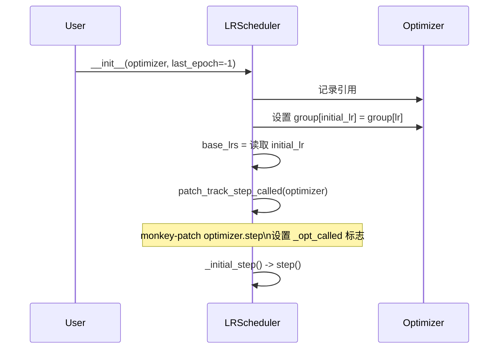

### 4.2 step() 流程

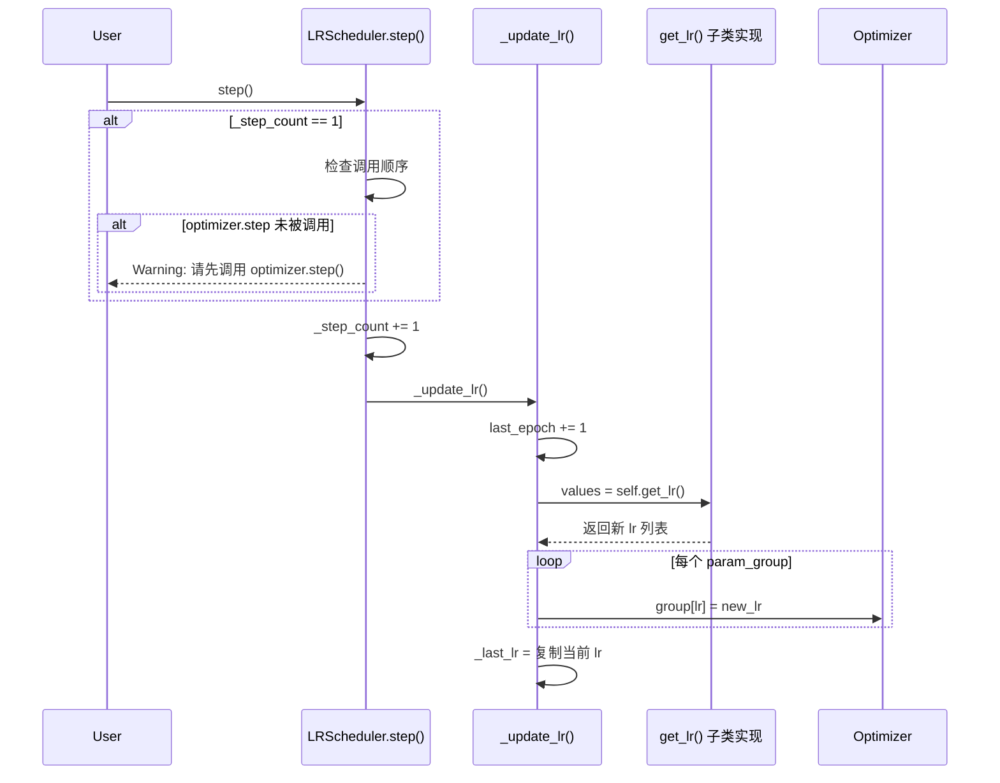

### 4.3 常用调度器算法

**StepLR：** 每 `step_size` 个 epoch 将 lr 乘以 `gamma`
```
lr_t = lr_0 * gamma^(t // step_size)
```

**CosineAnnealingLR：** 余弦退火，lr 按余弦曲线从初始值降到 η_min
```
lr_t = η_min + 0.5 * (lr_0 - η_min) * (1 + cos(π * t / T_max))
```

**OneCycleLR：** 三阶段策略
```
阶段1 (0 → pct_start): lr 从 initial_lr 线性上升到 max_lr
阶段2 (pct_start → 1): lr 从 max_lr 按余弦下降到 min_lr
阶段3 (训练结束后): lr 从 min_lr 线性上升到 final_lr
```

**ReduceLROnPlateau：** 基于 metric 监控
```
if metric 连续 patience 个 epoch 没有改善 mode 指定的方向:
    lr = lr * factor
    if lr < min_lr: 停止衰减
```

### 4.4 学习率调度对比

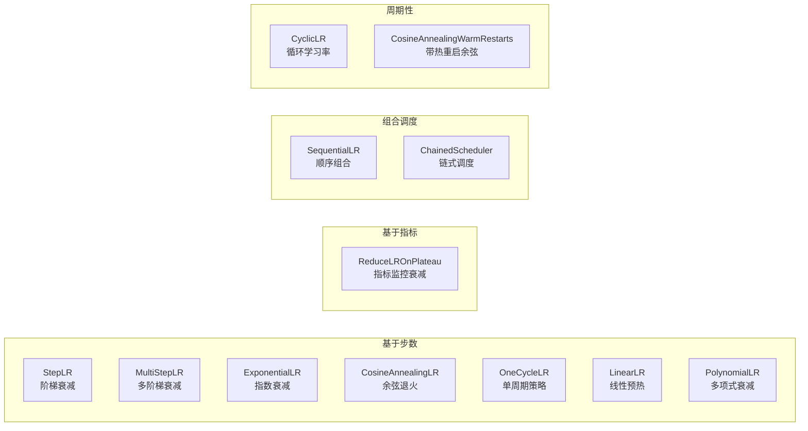

---

## 5. 训练循环完整流程

### 5.1 标准 Training Loop

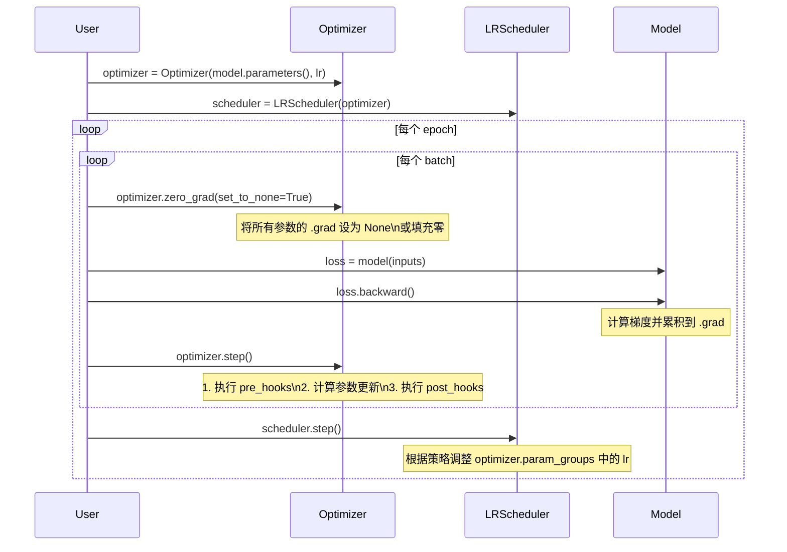

### 5.2 zero_grad 的两种模式

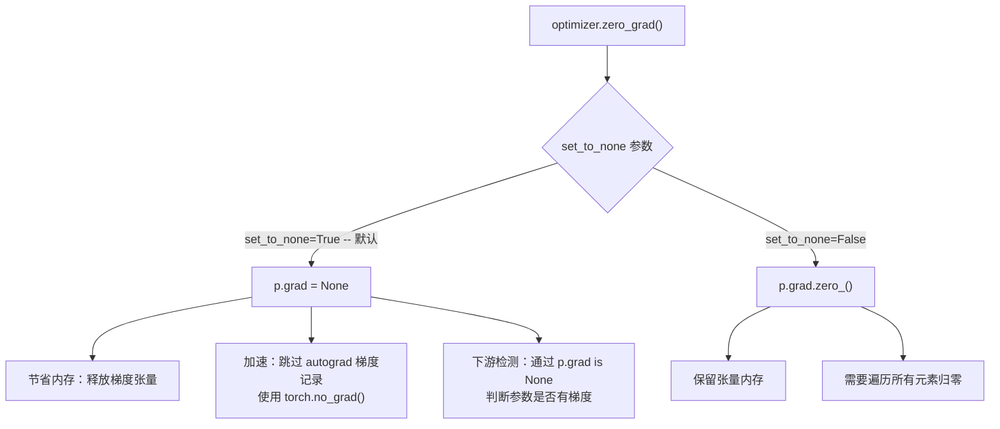

---

## 6. 内核加速路径

### 6.1 三层内核架构

PyTorch 优化器支持三种执行路径，按性能从低到高：

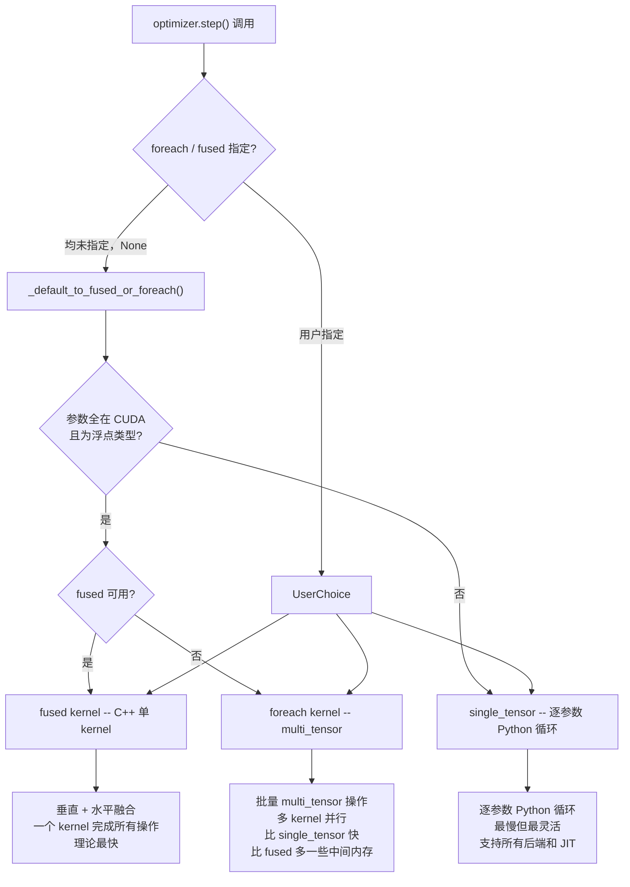

### 6.2 不同iable 模式

当 `differentiable=True` 时，优化器的 step 操作可以被 autograd 追踪：

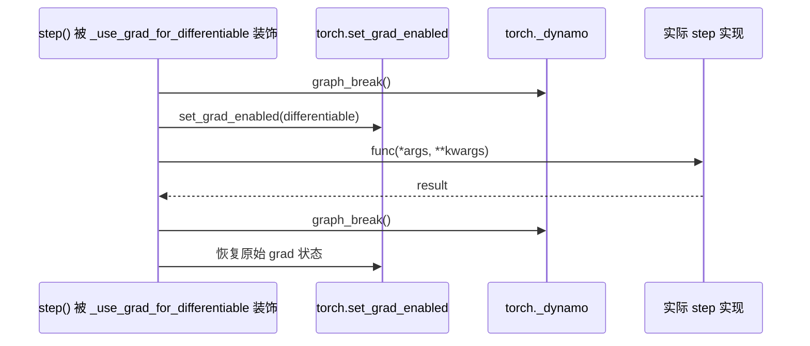

`differentiable` 模式的限制：不支持 `fused=True`、不支持 `foreach=True`，强制走 single_tensor 路径。主要用于元学习（meta-learning）、双层优化等需要二阶梯度的场景。

### 6.3 capturable 模式

`capturable=True` 使优化器实例可以被 CUDA Graph 或 `torch.compile` 捕获：

- `step` 张量会放在 GPU 上（而非 CPU），避免 device 同步
- 需要 `torch.compile` 时自动启用（即使未显式设置）
- 如果未在 graph capture 下运行会发出警告
- 支持 CUDA、XPU、HPU、XLA 等加速器后端

---

## 附录：文件索引

| 文件 | 核心内容 |
|------|----------|
| [optimizer.py](torch/optim/optimizer.py) | Optimizer 基类、Hook 系统、foreach/fused 分发 |
| [sgd.py](torch/optim/sgd.py) | SGD（momentum / nesterov / weight_decay） |
| [adam.py](torch/optim/adam.py) | Adam（amsgrad / decoupled_weight_decay） |
| [adamw.py](torch/optim/adamw.py) | AdamW（继承 Adam，强制解耦权重衰减） |
| [nadam.py](torch/optim/nadam.py) | NAdam（scheduled Nesterov momentum） |
| [radam.py](torch/optim/radam.py) | RAdam（variance rectification） |
| [adamax.py](torch/optim/adamax.py) | AdaMax（L∞ 范数二阶矩） |
| [adagrad.py](torch/optim/adagrad.py) | Adagrad（累积平方和） |
| [rmsprop.py](torch/optim/rmsprop.py) | RMSprop（指数衰减平方） |
| [lbfgs.py](torch/optim/lbfgs.py) | LBFGS（拟牛顿法，需要 closure） |
| [asgd.py](torch/optim/asgd.py) | ASGD（随机平均梯度） |
| [sparse_adam.py](torch/optim/sparse_adam.py) | SparseAdam（稀疏梯度 Adam） |
| [lr_scheduler.py](torch/optim/lr_scheduler.py) | LRScheduler 基类及所有调度器实现 |
| [swa_utils.py](torch/optim/swa_utils.py) | 随机权重平均（Stochastic Weight Averaging） |
