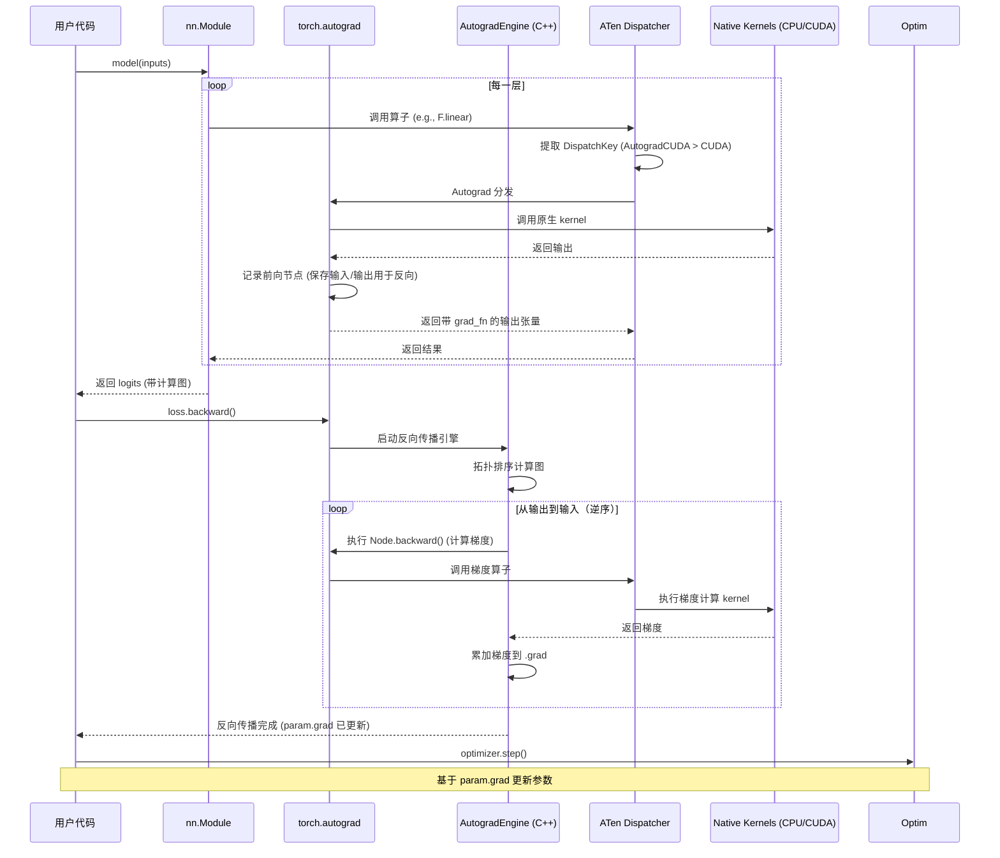
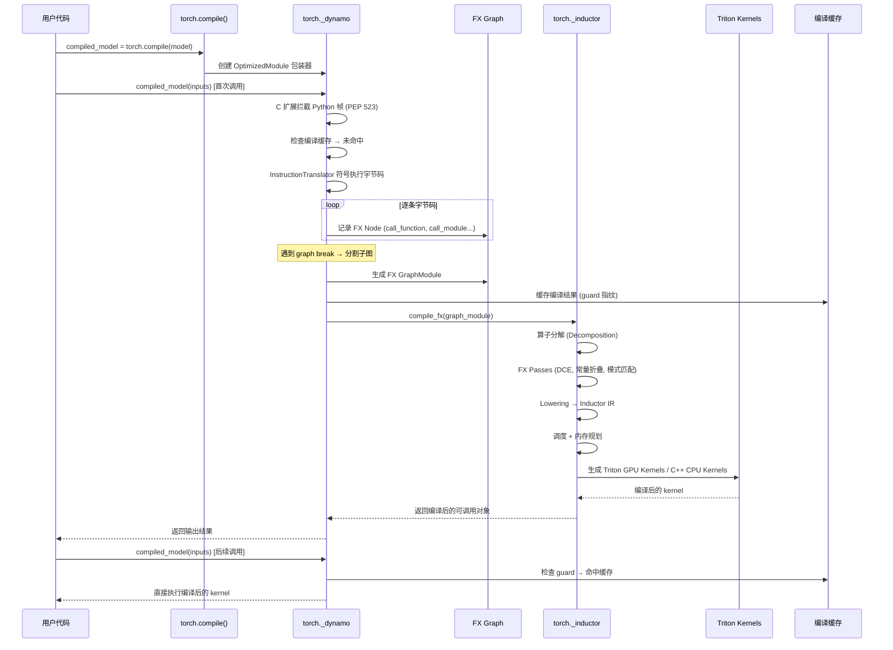
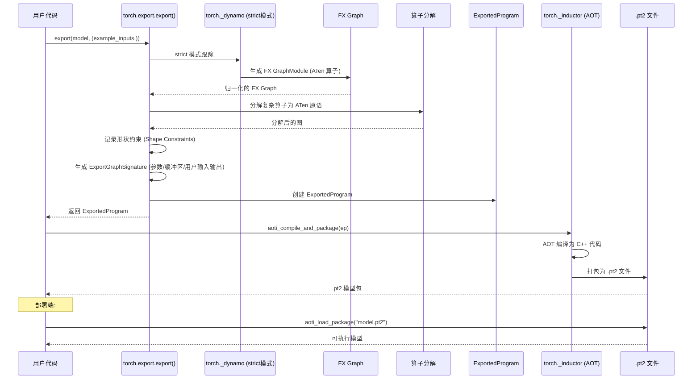
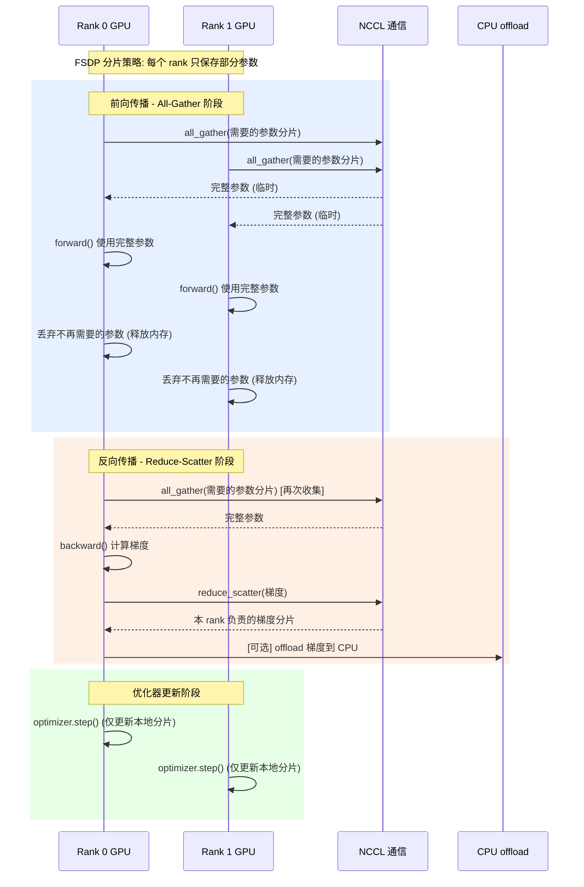
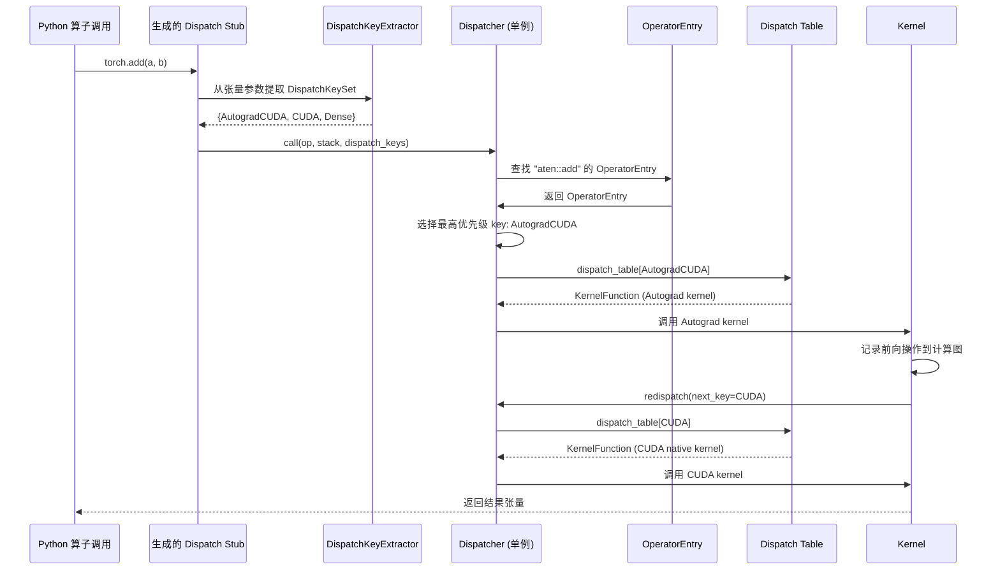

# PyTorch 模块架构与时序流程图

> 基于 `pytorch-main` 源码分析，梳理 PyTorch 整体模块框架与核心时序流程。

---

## 目录

1. [整体架构概览](#1-整体架构概览)
2. [C++ 核心层（c10 + ATen）](#2-c-核心层c10--aten)
3. [Python 前端模块](#3-python-前端模块)
4. [编译与导出体系](#4-编译与导出体系)
5. [分布式训练体系](#5-分布式训练体系)
6. [模型优化体系](#6-模型优化体系)
7. [时序流程图](#7-时序流程图)
8. [模块依赖关系总图](#8-模块依赖关系总图)

---

## 1. 整体架构概览

PyTorch 采用分层架构，从底向上分为四个主要层次：

```
┌──────────────────────────────────────────────────────────────────────────┐
│                        用户 API 层 (User API)                           │
│  torch.nn (模型定义) │ torch.optim (优化器) │ torch.utils.data (数据加载)  │
├──────────────────────────────────────────────────────────────────────────┤
│                      核心计算层 (Core Computation)                       │
│  torch.autograd (自动微分) │ torch.cuda (GPU支持) │ torch.distributed    │
├──────────────────────────────────────────────────────────────────────────┤
│                   编译与导出层 (Compilation & Export)                     │
│  torch._dynamo (前端) │ torch.fx (IR) │ torch._inductor (后端)           │
│  torch.export (AOT导出) │ torch.onnx (ONNX导出)                          │
├──────────────────────────────────────────────────────────────────────────┤
│                   C++ 运行时层 (C++ Runtime)                             │
│  ATen (算子库 + 分发器) │ C10 (核心抽象 + 工具库) │ Caffe2 (构建/序列化)   │
├──────────────────────────────────────────────────────────────────────────┤
│                        硬件 / 操作系统                                   │
└──────────────────────────────────────────────────────────────────────────┘
```

---

## 2. C++ 核心层（c10 + ATen）

### 2.1 C10 —— 最底层基础库

**路径**: `c10/`

C10 是 PyTorch 最底层的库（"C"+"10"=Ten），提供设备无关、框架无关的基础构件。**C10 不依赖任何上层组件**，仅依赖 C++ 标准库。

| 目录 | 职责 |
|------|------|
| `c10/core/` | **核心张量抽象**: TensorImpl, Storage, DispatchKey, TensorOptions, Device, Scalar, ScalarType, Allocator, Stream |
| `c10/core/impl/` | 实现细节: SizesAndStrides, LocalDispatchKeySet, PythonDispatcherTLS, COW(写时复制) |
| `c10/util/` | **通用工具**: intrusive_ptr(引用计数), ArrayRef, SmallVector, Half/BFloat16/Float8(低精度类型), Exception, Logging |
| `c10/cuda/` | CUDA 分配器和设备守卫 |
| `c10/hip/` | HIP (AMD) 后端 |
| `c10/xpu/` | XPU (Intel) 后端 |
| `c10/metal/` | Metal 后端 |

**核心类 — TensorImpl** (`c10/core/TensorImpl.h`):
- PyTorch **最重要的类**，所有张量数据的实际存储
- 继承自 `c10::intrusive_ptr_target`（引用计数）
- 包含: `Storage`（数据指针）、sizes/strides、`DispatchKeySet`、`VariableVersion`（autograd 用）
- 通过 `AutogradMetaInterface` 指针支持自动微分（惰性初始化）

**核心类 — DispatchKey** (`c10/core/DispatchKey.h`):
- 定义所有可能的分发目标枚举，分为:
  - **BackendComponent**（低位）: CPU, CUDA, HIP, XLA, MPS, Meta...
  - **Functionality keys**（高位）: Dense, Quantized, Sparse, Autograd, Tracer, Autocast...

**核心类 — TensorOptions** (`c10/core/TensorOptions.h`):
- 构建 tensor 的选项: device, dtype, layout, requires_grad, pinned_memory, memory_format

### 2.2 ATen —— 张量计算库

**路径**: `aten/`

ATen（A Tensor library）构建在 C10 之上，提供用户面向的张量类、分发系统和算子实现。

| 目录 | 职责 |
|------|------|
| `aten/src/ATen/core/` | **核心 ATen 抽象**: Tensor, TensorBase, Dispatch, FunctionSchema, IValue |
| `aten/src/ATen/core/dispatch/` | **分发器**: Dispatcher(单例), OperatorEntry, DispatchKeyExtractor |
| `aten/src/ATen/core/boxing/` | **类型擦除**: KernelFunction, BoxedKernel（Stack-based 调用） |
| `aten/src/ATen/native/` | **原生算子实现**: ~200+ .cpp 文件 (Convolution, LinearAlgebra, ReduceOps...) |
| `aten/src/ATen/native/native_functions.yaml` | **算子主定义文件**（所有 ATen 算子的声明） |
| `aten/src/ATen/templates/TensorBody.h` | **代码生成模板**: at::Tensor 类（占位符由 torchgen 填充） |
| `aten/src/ATen/ops/` | 生成的算子声明和分发桩 |

**继承关系**:
```
c10::intrusive_ptr_target
       │
       ▼
c10::TensorImpl          ← 实际数据和元数据（"内核"）
       │ (wrapped by intrusive_ptr)
       ▼
at::TensorBase            ← 轻量句柄，无代码生成方法（避免头文件依赖）
       │ (inherits)
       ▼
at::Tensor                ← 完整算子 API（${tensor_method_declarations} 由代码生成器填充）
```

**分发流程** (`at::add(tensor_a, tensor_b)`):
```
调用 at::add()
    │
    ▼
torchgen 生成的桩 (aten/src/ATen/ops/)
    │ 提取 DispatchKeySet
    ▼
Dispatcher::singleton().call(op_handle, args...)
    │ 查找 OperatorEntry
    ▼
确定最高优先级 DispatchKey（如 AutogradCPU > CPU）
    │ 查找 dispatch table
    ▼
调用 KernelFunction（Boxed 或 Unboxed）
    │
    ▼
[内核执行] → 如需 redispatch，调用 Dispatcher::redispatch(next_key)
```

---

## 3. Python 前端模块

### 3.1 torch.autograd —— 自动微分引擎

**路径**: `torch/autograd/`

PyTorch 的核心自动微分系统，支持前向模式和反向模式自动微分。

**关键组件**:

| 类/函数 | 说明 |
|---------|------|
| `engine.Engine` | 执行引擎（C++ 实现 `torch._C._EngineBase`），管理反向传播的拓扑排序和执行 |
| `function.Function` | 自定义操作的基类，用户通过继承并实现 `forward()`/`backward()` |
| `grad()` | 一阶梯度计算 |
| `backward()` | 张量级反向传播 |
| `grad_and_value()` | 同时返回梯度和值 |
| `detect_anomaly()` | 异常检测（NaN/Inf） |

**架构**:
- C++ 引擎负责图的拓扑排序和并行执行
- Python `Function` 类允许用户定义自定义微分规则
- `Node`（`torch._C._EngineBase`）表示计算图中的节点，每个节点保存前向输入/输出和反向函数
- 支持双线程模式：计算梯度线程 + 准备下一个节点线程

### 3.2 torch.nn —— 神经网络模块

**路径**: `torch/nn/`

提供神经网络构建的所有组件：层、损失函数、容器、初始化等。

**核心类**:

| 类 | 说明 |
|----|------|
| `Module` | 所有神经网络模块的基类，管理参数、子模块、forward/backward hooks |
| `Parameter` | Tensor 的子类，标记为模型参数（自动注册到 Module） |
| `Container` | Sequential, ModuleList, ModuleDict, ParameterList 等 |
| `Linear`, `Conv2d`, `BatchNorm2d` 等 | 常用网络层 |
| `CrossEntropyLoss`, `MSELoss` 等 | 损失函数 |
| `init` | 参数初始化函数 |

**Module 子目录**:
```
nn/
  modules/          → 各层实现 (conv.py, linear.py, batchnorm.py, pooling.py, rnn.py, transformer.py...)
  parallel/         → 并行模块 (DistributedDataParallel 已迁移到 distributed/)
  functional/       → 无状态函数式 API (F.linear, F.conv2d, F.relu...)
  utils/            → 权重转换、参数计算等工具
  init.py           → 初始化方案
  quantized/        → 量化模块
```

### 3.3 torch.optim —— 优化器

**路径**: `torch/optim/`

**关键类**:

| 类 | 说明 |
|----|------|
| `Optimizer` | 所有优化器的基类，管理参数组、状态、step/clear_grad/zero_grad |
| `SGD`, `Adam`, `AdamW`, `Adagrad` 等 | 具体优化算法实现 |
| `lr_scheduler` | 学习率调度器（StepLR, CosineAnnealingLR, OneCycleLR 等） |

**关键流程**: `optimizer.step()` → 读取 `param.grad` → 应用更新规则 → 更新 `param.data`

### 3.4 torch.cuda —— CUDA 支持

**路径**: `torch/cuda/`

提供 CUDA 张量、内存管理、流、事件、CUDA Graph 等支持。

**关键 API**: `is_available()`, `device_count()`, `Stream`, `Event`, `CUDAGraph`, `memory_allocated()`, `synchronize()`, `empty_cache()`

### 3.5 torch.utils.data —— 数据加载

**路径**: `torch/utils/data/`

| 类 | 说明 |
|----|------|
| `Dataset` | 数据集基类（`__getitem__`, `__len__`） |
| `DataLoader` | 核心加载器：组合 Dataset + Sampler，处理批处理、多进程加载、预取 |
| `Sampler` | 采样策略（Sequential, Random, Distributed, Weighted） |
| `IterDataPipe` / `MapDataPipe` | 可组合数据管道抽象 |

---

## 4. 编译与导出体系

### 4.1 torch.fx —— FX 图变换工具包

**路径**: `torch/fx/`

FX 是 PyTorch 现代**中间表示（IR）**的基础，是 Dynamo、Inductor 和 Export 的核心共享组件。

**关键类**:

| 类 | 说明 |
|----|------|
| `Graph` | 有向图 IR，节点类型: `placeholder`, `get_attr`, `call_function`, `call_method`, `call_module`, `output` |
| `GraphModule` | 持有 Graph 的 nn.Module，从图生成 `forward()` 方法 |
| `Node` | 图中的单个操作节点（target, args, kwargs, users） |
| `Proxy` | 跟踪期间的值包装器，操作被记录为图节点 |
| `Tracer` | 符号跟踪器 |
| `Interpreter` / `Transformer` | 图分析/变换的基类 |
| `symbolic_trace()` | 符号跟踪入口函数 |
| `replace_pattern()` | 子图模式匹配替换 |

### 4.2 torch._dynamo —— TorchDynamo（Python 级 JIT）

**路径**: `torch/_dynamo/`

`torch.compile()` 的前端，通过 CPython PEP 523 frame evaluation API 拦截 Python 字节码，符号跟踪为 FX 图。

**编译流水线**:
```
Python 函数调用
    │
    ▼
eval_frame.py → C 扩展拦截 Python 帧 (PEP 523)
    │
    ▼
convert_frame.py → 检查缓存，处理重编译
    │
    ▼
symbolic_convert.py → InstructionTranslator 逐条符号执行字节码
    │ 维护 VariableTracker 栈
    ▼
output_graph.py → 构建 FX Graph，调用后端编译
    │
    ▼
codegen.py → PyCodegen 生成输出字节码（调用编译后的代码）
    │
    ▼
resume_execution.py → 处理 graph break 继续执行
```

**关键类**:

| 类 | 说明 |
|----|------|
| `InstructionTranslator` | 字节码符号执行器 |
| `OutputGraph` | FX 图构建管理 |
| `VariableTracker` | 跟踪所有 Python 值的层次类（TensorVariable, ConstantVariable, ListVariable...） |
| `OptimizedModule` | 包装原始可调用对象，拦截调用触发编译 |

### 4.3 torch._inductor —— Inductor 编译器后端

**路径**: `torch/_inductor/`

`torch.compile()` 的默认后端，将 FX 图编译为优化的 Triton GPU kernel 或 C++/OpenMP CPU kernel。

**编译流水线**:
```
FX Graph (from Dynamo)
    │
    ▼
Operator Decomposition → 算子分解
    │
    ▼
FX Passes (DCE, 常量折叠, 模式匹配优化...)
    │
    ▼
Lowering to Inductor IR → 降级到 Inductor 中间表示
    │
    ▼
Scheduling → 操作调度
    │
    ▼
Memory Planning → 内存规划
    │
    ▼
Code Generation → Triton kernels (GPU) / C++/OpenMP (CPU)
    │
    ▼
Execution / CUDA Graphs
```

**配置模式**: `default`, `reduce-overhead`（CUDA graphs）, `max-autotune`, `lite`

### 4.4 torch.export —— AOT 模型导出

**路径**: `torch/export/`

现代 AOT 导出替代 TorchScript，生成 `ExportedProgram`。

**关键 API**:
- `export()` → 导出 nn.Module 为 ExportedProgram
- `save()` / `load()` → 序列化/反序列化为 .pt2
- `Dim` / `Constraint` → 动态形状约束声明
- `draft_export()` → 非严格导出（报告潜在问题）

### 4.5 torch.onnx —— ONNX 导出

**路径**: `torch/onnx/`

导出 PyTorch 模型为 ONNX 格式。新路径（`dynamo=True`）基于 `ExportedProgram`，旧路径基于 TorchScript tracing。

---

## 5. 分布式训练体系

**路径**: `torch/distributed/`

| 组件 | 说明 |
|------|------|
| `c10d` (distributed_c10d.py) | 核心通信 API: `init_process_group()`, `all_reduce()`, `broadcast()`, `all_gather()` |
| `ProcessGroup` | 进程组抽象（NCCL, Gloo, MPI 后端） |
| `DistributedDataParallel` (nn/) | 数据并行包装器（梯度 all-reduce） |
| `FSDP` (fsdp/) | 全分片数据并行（参数/梯度/优化器状态分片） |
| `DeviceMesh` | N 维设备网格（张量并行/流水线并行） |
| `rpc/` | 远程过程调用框架 |
| `elastic/` | 弹性训练 (torchrun) |
| `pipelining/` | 流水线并行 |
| `tensor/` | 分布式张量抽象 |
| `_sharded_tensor/` | 分片张量原语 |
| `checkpoint/` | 分布式检查点 |

---

## 6. 模型优化体系

### 6.1 torch.ao —— 架构优化

**路径**: `torch/ao/`

统一优化命名空间:

| 子包 | 说明 |
|------|------|
| `torch.ao.quantization` | 完整量化流水线 (PTQ, QAT, FX 模式) |
| `torch.ao.pruning` | 剪枝（权重/数据稀疏化） |
| `torch.ao.nn` | 量化/QAT/稀疏/融合模块实现 |
| `torch.ao.ns` | 数值稳定性工具 |

### 6.2 torch.func —— 函数式变换 API

**路径**: `torch/func/`

functorch 的继任者，提供 JAX 风格的可组合变换:

- `grad`, `grad_and_value` — 反向微分
- `vjp`, `jvp` — 向量-雅可比积
- `jacfwd`, `jacrev`, `hessian` — 雅可比/海森
- `vmap` — 向量化映射
- `functional_call` — 函数式模块调用

### 6.3 torch._prims / torch._refs —— 原语与引用实现

| 模块 | 说明 |
|------|------|
| `torch._prims` | 最低级原语算子集，所有后端必须支持 |
| `torch._refs` | 基于 prims 的 Python 参考实现，作为正确性规范 |

### 6.4 torch._lazy —— 惰性张量

**路径**: `torch/_lazy/`

惰性执行后端（PyTorch/XLA 基础），操作记录到 IR 图中按需执行。

---

## 7. 时序流程图

### 7.1 前向传播与反向传播



### 7.2 典型训练循环

```mermaid
sequenceDiagram
    participant User as 用户代码
    participant DL as DataLoader
    participant Model as nn.Module
    participant Loss as Loss Function
    participant Opt as Optimizer
    participant AG as torch.autograd

    loop 每个 epoch
        loop 每个 batch
            User->>DL: for batch in dataloader
            DL-->>User: (inputs, targets)

            User->>Opt: optimizer.zero_grad()
            Note over Opt: 清零所有 param.grad

            User->>Model: outputs = model(inputs)
            Note over Model: 前向传播，构建计算图

            User->>Loss: loss = criterion(outputs, targets)
            Note over Loss: 计算损失值

            User->>AG: loss.backward()
            Note over AG: 反向传播，计算梯度

            User->>Opt: optimizer.step()
            Note over Opt: 基于 param.grad 更新参数
        end
    end
```

### 7.3 torch.compile 编译流程



### 7.4 torch.export AOT 导出流程



### 7.5 分布式数据并行训练 (DDP)

```mermaid
sequenceDialog
    participant G as Process Group (NCCL)
    participant R0 as Rank 0
    participant R1 as Rank 1

    Note over R0,R1: 初始化阶段
    R0->>G: init_process_group(backend="nccl")
    R1->>G: init_process_group(backend="nccl")

    R0->>R0: DDP(model) → 包装 nn.Module
    R1->>R1: DDP(model) → 包装 nn.Module
    Note over R0,R1: 广播参数确保一致
    R0->>G: broadcast(params)
    R1->>G: broadcast(params)

    Note over R0,R1: 训练阶段 (每步)
    par 前向传播
        R0->>R0: forward(local_batch)
        and
        R1->>R1: forward(local_batch)
    end

    par 计算损失
        R0->>R0: loss = criterion(output, target)
        and
        R1->>R1: loss = criterion(output, target)
    end

    par 反向传播
        R0->>R0: loss.backward() → 计算本地梯度
        and
        R1->>R1: loss.backward() → 计算本地梯度
    end

    Note over R0,R1: DDP 自动插入的 All-Reduce
    R0->>G: all_reduce(gradients) [通信]
    R1->>G: all_reduce(gradients) [通信]
    G-->>R0: 聚合后的全局梯度
    G-->>R1: 聚合后的全局梯度

    par 更新参数
        R0->>R0: optimizer.step() → 用全局梯度更新参数
        and
        R1->>R1: optimizer.step() → 用全局梯度更新参数
    end
```

### 7.6 FSDP 全分片数据并行



### 7.7 ATen 分发器 (Dispatcher) 调用流程



### 7.8 数据加载流程

```mermaid
sequenceDiagram
    participant User as 训练循环
    participant DL as DataLoader
    participant Sampler as Sampler
    MP as Multi-Process Workers
    participant DS as Dataset
    Collate as Collate Fn
    PinMem as Pin Memory

    User->>DL: for batch in dataloader
    DL->>Sampler: next() → 获取索引
    Sampler-->>DL: [batch_indices]

    par 并行加载数据
        DL->>MP: 分发索引到各 worker
        MP->>DS: worker 0: dataset[i] for i in indices_0
        MP->>DS: worker 1: dataset[i] for i in indices_1
        MP->>DS: worker N: dataset[i] for i in indices_N
        DS-->>MP: 各 worker 返回 samples
        MP-->>DL: 汇总所有 samples
    end

    DL->>Collate: collate_fn(samples)
    Collate-->>DL: batched_tensors

    alt GPU 训练 + pin_memory=True
        DL->>PinMem: tensor.pin_memory()
        PinMem-->>DL: pinned tensors
    end

    DL-->>User: 返回 batch (inputs, targets)
```

---

## 8. 模块依赖关系总图

```
                           ┌─────────────────────────┐
                           │      用户应用代码         │
                           └───────────┬─────────────┘
                                       │
                    ┌──────────────────┼──────────────────┐
                    │                  │                  │
              ┌─────▼─────┐    ┌──────▼──────┐   ┌──────▼──────┐
              │ torch.nn   │    │ torch.optim │   │ torch.utils │
              │ (模型定义)  │    │ (优化器)    │   │   .data     │
              └─────┬─────┘    └──────┬──────┘   │ (数据加载)   │
                    │                 │           └─────────────┘
                    │                 │
              ┌─────▼─────────────────▼─────┐
              │       torch.autograd         │
              │     (自动微分引擎)            │
              └──────────────┬──────────────┘
                             │
          ┌──────────────────┼──────────────────┐
          │                  │                  │
    ┌─────▼──────┐   ┌──────▼──────┐   ┌──────▼───────┐
    │ torch.cuda │   │ torch.dist  │   │ torch.func    │
    │ (GPU支持)   │   │ (分布式训练) │   │ (函数式变换)  │
    └─────┬──────┘   └──────┬──────┘   └──────┬───────┘
          │                 │                 │
          │          ┌──────▼──────┐   ┌──────▼───────┐
          │          │    NCCL     │   │  functorch    │
          │          │   Gloo      │   │  (vmap/grad)  │
          │          └─────────────┘   └──────────────┘
          │
          └──────────────┬──────────────────────────────┐
                         │                              │
    ┌────────────────────▼──────────────────────────────▼────────┐
    │              编译与导出层                                     │
    │                                                              │
    │  ┌──────────┐   ┌───────────┐   ┌────────────┐              │
    │  │ _dynamo  │──▶│   torch.fx │──▶│  _inductor │              │
    │  │ (前端)    │   │ (FX IR)   │   │  (后端)     │              │
    │  └──────────┘   └─────┬─────┘   └─────┬──────┘              │
    │                       │               │                      │
    │                 ┌─────▼─────┐   ┌─────▼──────┐              │
    │                 │  export   │   │  Triton    │              │
    │                 │  (AOT导出) │   │  C++/OMP   │              │
    │                 └─────┬─────┘   └────────────┘              │
    │                       │                                     │
    │                 ┌─────▼─────┐   ┌────────────┐              │
    │                 │  onnx     │   │  _refs      │              │
    │                 │ (ONNX导出) │   │  _prims     │              │
    │                 └───────────┘   └────────────┘              │
    └──────────────────────┬──────────────────────────────────────┘
                           │
    ┌──────────────────────▼──────────────────────────────────────┐
    │                    C++ 运行时层                                │
    │                                                              │
    │  ┌─────────────────────────────────────────────────────┐     │
    │  │                    ATen                              │     │
    │  │  ┌──────────┐  ┌──────────┐  ┌──────────────────┐  │     │
    │  │  │ Tensor   │  │Dispatcher│  │ native/ kernels  │  │     │
    │  │  │TensorBase│  │OperatorEn│  │ (CPU/CUDA/cuDNN) │  │     │
    │  │  └────┬─────┘  └──────────┘  └──────────────────┘  │     │
    │  └───────┼─────────────────────────────────────────────┘     │
    │          │                                                    │
    │  ┌───────▼───────────────────────────────────────────────┐   │
    │  │                     C10                                │   │
    │  │  ┌──────────┐  ┌───────────┐  ┌──────────────────┐   │   │
    │  │  │TensorImpl│  │ DispatchKey│  │ Storage/Allocator│   │   │
    │  │  │ Scalar   │  │ Device    │  │ intrusive_ptr    │   │   │
    │  │  │Half/BF16 │  │ TensorOpts│  │ ArrayRef/util    │   │   │
    │  │  └──────────┘  └───────────┘  └──────────────────┘   │   │
    │  └──────────────────────────────────────────────────────┘   │
    │                                                             │
    │  ┌───────────────┐  ┌────────────────────────────────────┐  │
    │  │   Caffe2      │  │         torchgen                   │  │
    │  │ (构建/序列化)  │  │ (native_functions.yaml → 代码生成) │  │
    │  └───────────────┘  └────────────────────────────────────┘  │
    └──────────────────────┬──────────────────────────────────────┘
                           │
                    ┌──────▼──────┐
                    │  硬件 / OS   │
                    │ CPU/GPU/TPU  │
                    └─────────────┘
```

---

## 附录：目录结构速查

```
pytorch-main/
├── c10/                     # C++ 基础库 (TensorImpl, DispatchKey, Storage, 工具)
├── aten/                    # ATen 张量库 (Tensor, Dispatcher, native kernels)
│   └── src/ATen/
│       ├── core/            #   核心: Tensor, TensorBase, Dispatch
│       │   ├── dispatch/    #     Dispatcher, OperatorEntry
│       │   ├── boxing/      #     KernelFunction, 类型擦除
│       │   └── op_registration/ # RegisterOperators
│       ├── native/          #   原生算子实现 (~200+ .cpp)
│       │   ├── native_functions.yaml  # 算子主定义文件
│       │   ├── cpu/         #     CPU kernels
│       │   ├── cuda/        #     CUDA kernels
│       │   └── cudnn/       #     cuDNN kernels
│       ├── templates/       #   代码生成模板 (TensorBody.h)
│       └── ops/             #   生成的算子声明
├── caffe2/                  # Caffe2 构建系统与运行时
├── torchgen/                # 代码生成器 (处理 YAML → C++/Python 代码)
├── torch/                   # Python 包
│   ├── __init__.py
│   ├── autograd/            # 自动微分引擎
│   ├── nn/                  # 神经网络模块 (Module, 层, 损失)
│   ├── optim/               # 优化器 (SGD, Adam, lr_scheduler)
│   ├── cuda/                # CUDA 支持 (Stream, Event, CUDAGraph)
│   ├── distributed/         # 分布式训练 (c10d, DDP, FSDP, elastic)
│   ├── utils/data/          # 数据加载 (DataLoader, Dataset, Sampler)
│   ├── _dynamo/             # TorchDynamo (torch.compile 前端)
│   ├── fx/                  # FX 图变换 (Graph, GraphModule, Node)
│   ├── _inductor/           # Inductor 编译器后端
│   ├── export/              # AOT 导出 (ExportedProgram)
│   ├── onnx/                # ONNX 导出
│   ├── jit/                 # TorchScript (已废弃，被 torch.compile 替代)
│   ├── func/                # 函数式变换 API (grad, vmap)
│   ├── _functorch/          # functorch 实现 (vmap, grad, vjp)
│   ├── ao/                  # 架构优化 (量化, 剪枝, 稀疏)
│   ├── quantization/        # 量化 (legacy API)
│   ├── _refs/               # 算子参考实现
│   ├── _prims/              # 原语算子集
│   ├── _dispatch/           # Python 级分发控制
│   ├── _lazy/               # 惰性张量后端
│   ├── _compile.py          # 编译入口点
│   └── csrc/                # Python/C++ 绑定 (pybind11)
├── CMakeLists.txt           # 顶层 CMake 构建
├── setup.py                 # Python 包安装
└── requirements.txt         # 依赖
```
