# PCIe 协议时序流程图详解

## 1. PCIe 协议架构概述

PCIe 采用分层协议架构，从上到下分为：
- **事务层 (Transaction Layer)**: 处理 TLP (Transaction Layer Packet)
- **数据链路层 (Data Link Layer)**: 负责链路可靠性和完整性
- **物理层 (Physical Layer)**: 处理电气信号和编码

---

## 2. PCIe 拓扑与核心组件

### 2.1 PCIe 拓扑结构

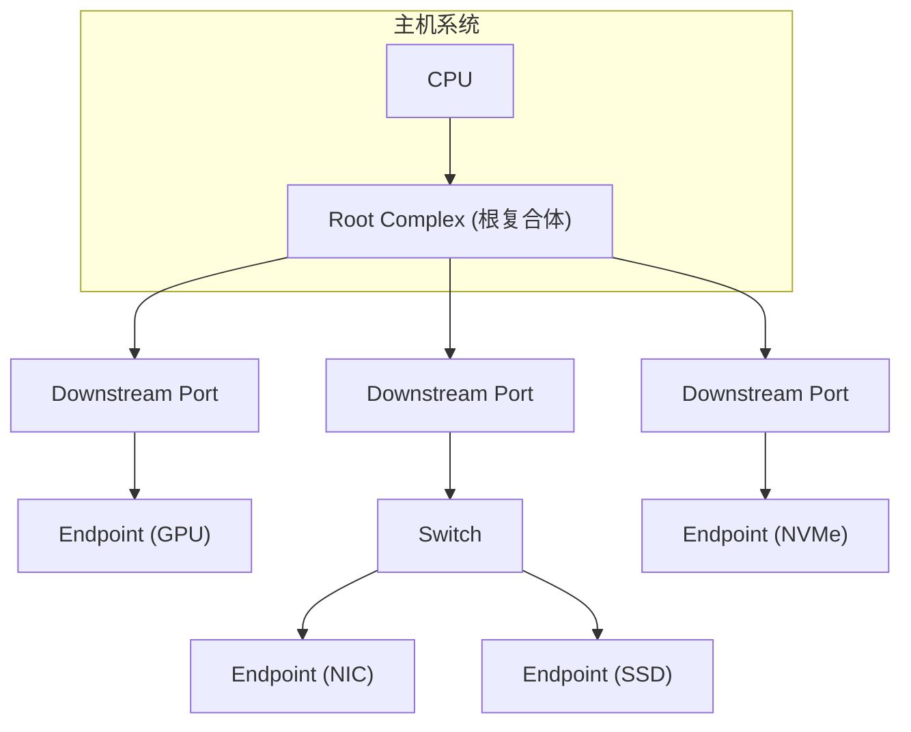
```mermaid
flowchart TB
    subgraph Host["主机系统"]
        CPU["CPU"]
        RC["Root Complex (根复合体)"]
    end

    CPU --> RC

    RC --> DS1["Downstream Port"]
    RC --> DS2["Downstream Port"]
    RC --> DS3["Downstream Port"]

    DS1 --> EP1["Endpoint (GPU)"]
    DS2 --> SW["Switch"]
    DS3 --> EP2["Endpoint (NVMe)"]

    SW --> EP3["Endpoint (NIC)"]
    SW --> EP4["Endpoint (SSD)"]
```

### 2.2 Root Complex (根复合体) 详解

#### 2.2.1 什么是 Root Complex

**Root Complex (RC)** 是 PCIe 架构中的核心组件，是 **CPU 与 PCIe 设备之间的桥梁**。

```
CPU 想读写 PCIe 设备:
  CPU → Memory/IO 指令 → Root Complex → 生成 TLP → 发送到 Endpoint

设备想通知 CPU:
  Endpoint → 产生中断/消息 → Root Complex → 传递给 CPU
```

**类比理解**：Root Complex 就像是一个**交通枢纽**，负责：
- 把 CPU 的指令"翻译"成 PCIe 设备能理解的 TLP 包
- 把设备的响应"翻译"回 CPU 能处理的数据
- 管理整个 PCIe 总线的配置和电源

#### 2.2.2 Root Complex 主要功能

| 功能 | 说明 |
|------|------|
| **总线桥接** | 连接 CPU 总线与 PCIe 总线，进行协议转换 |
| **事务发起** | 代表 CPU 发起 Memory Read/Write 请求 |
| **配置管理** | 负责设备枚举、配置空间访问 |
| **路由转发** | 将 TLP 路由到正确的目标设备 |
| **中断处理** | 接收并传递设备中断到 CPU |
| **电源管理** | 管理 PCIe 链路的电源状态 |

#### 2.2.3 Root Complex 硬件实现

Root Complex **由专门的硬件实现**，通常集成在芯片组或 CPU 内部。

**硬件位置演变：**

```
传统架构 (2010年前):
┌──────────────────────────────────────────┐
│                 CPU                       │
└──────────────────┬───────────────────────┘
                   │   FSB/QPI
┌──────────────────┴───────────────────────┐
│            北桥 (MCH)                     │
│     ┌─────────────────────────┐          │
│     │     Root Complex        │ ← 硬件   │
│     │   (Memory Controller)   │          │
│     └─────────────────────────┘          │
└──────────────────┬───────────────────────┘
                   │
              PCIe Slots

现代架构 (2010年后):
┌──────────────────────────────────────────┐
│                 CPU (SoC)                 │
│  ┌────────────┐  ┌─────────────────────┐ │
│  │ CPU Cores  │  │   Root Complex      │ │ ← 集成在CPU内部
│  │            │  │   (PCIe Controller) │ │
│  └────────────┘  └─────────────────────┘ │
└──────────────────┬───────────────────────┘
                   │
              PCIe Slots
```

**实际硬件示例：**

| 厂商 | 产品 | Root Complex 实现 |
|------|------|-------------------|
| **Intel** | Core i 系列 | 集成在 CPU (PCH 辅助) |
| **AMD** | Ryzen/EPYC | 集成在 CPU (IO Die) |
| **ARM** | 服务器芯片 | 集成在 SoC |
| **Apple** | M 系列 | 集成在 SoC |

#### 2.2.4 Root Complex 硬件组成

```
┌─────────────────────────────────────────────────────┐
│                  Root Complex 硬件                  │
├─────────────────────────────────────────────────────┤
│  ┌─────────────┐  ┌─────────────┐  ┌────────────┐  │
│  │ PCIe 控制器 │  │ 路由引擎   │  │ 配置空间  │  │
│  │ (PHY + MAC)│  │ (Routing)  │  │ 管理      │  │
│  └─────────────┘  └─────────────┘  └────────────┘  │
│                                                     │
│  ┌─────────────┐  ┌─────────────┐  ┌────────────┐  │
│  │ TLP 生成/   │  │ 流控制     │  │ 电源管理  │  │
│  │ 解析引擎   │  │ 管理器     │  │ 控制器    │  │
│  └─────────────┘  └─────────────┘  └────────────┘  │
│                                                     │
│  ┌─────────────┐  ┌─────────────┐                  │
│  │ 中断控制器 │  │ DMA 引擎   │                  │
│  │ (MSI/INTx) │  │ (可选)     │                  │
│  └─────────────┘  └─────────────┘                  │
└─────────────────────────────────────────────────────┘
```

#### 2.2.5 为什么 Root Complex 需要硬件实现

| 原因 | 说明 |
|------|------|
| **性能** | 硬件处理 TLP 封装/解析比软件快几个数量级 |
| **时序** | PCIe 链路训练有严格的时序要求（微秒级） |
| **可靠性** | 硬件实现 CRC、Ack/Nak 等可靠性机制 |
| **并行性** | 硬件可同时处理多个 PCIe 事务 |

**总结**：Root Complex 是一个实打实的硬件模块，不是软件抽象。它在芯片内部占用真实的硅片面积，有自己的时钟、电源域和寄存器配置空间。

---

## 3. PCIe 初始化时序图

### 3.1 完整初始化流程

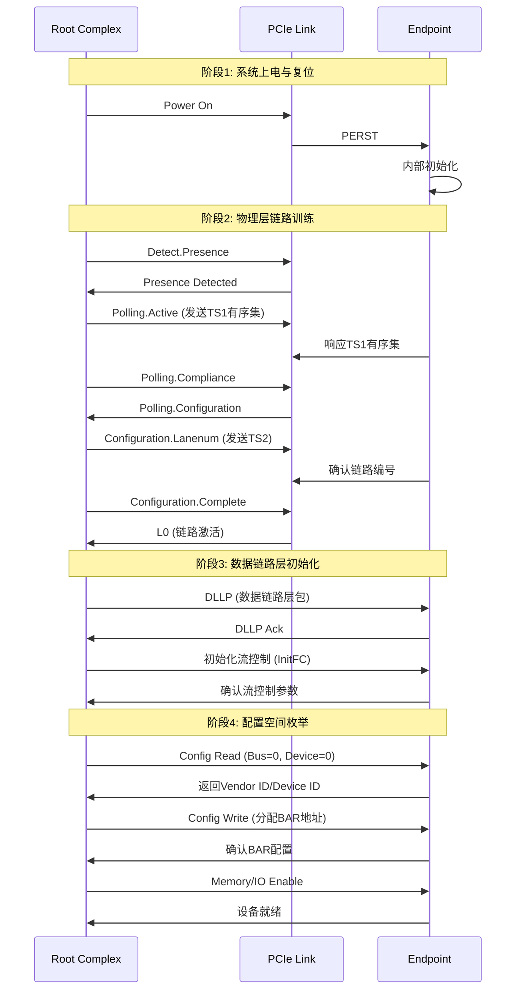
```mermaid
sequenceDiagram
    participant RC as Root Complex
    participant PLink as PCIe Link
    participant EP as Endpoint

    Note over RC,EP: 阶段1: 系统上电与复位
    RC->>PLink: Power On
    PLink->>EP: PERST# (Fundamental Reset)
    EP->>EP: 内部初始化

    Note over RC,EP: 阶段2: 物理层链路训练
    RC->>PLink: Detect.Presence
    PLink->>RC: Presence Detected
    RC->>PLink: Polling.Active (发送TS1有序集)
    EP->>PLink: 响应TS1有序集
    RC->>PLink: Polling.Compliance
    PLink->>RC: Polling.Configuration
    RC->>PLink: Configuration.Lanenum (发送TS2)
    EP->>PLink: 确认链路编号
    RC->>PLink: Configuration.Complete
    PLink->>RC: L0 (链路激活)

    Note over RC,EP: 阶段3: 数据链路层初始化
    RC->>EP: DLLP (数据链路层包)
    EP->>RC: DLLP Ack
    RC->>EP: 初始化流控制 (InitFC)
    EP->>RC: 确认流控制参数

    Note over RC,EP: 阶段4: 配置空间枚举
    RC->>EP: Config Read (Bus=0, Device=0)
    EP->>RC: 返回Vendor ID/Device ID
    RC->>EP: Config Write (分配BAR地址)
    EP->>RC: 确认BAR配置
    RC->>EP: Memory/IO Enable
    EP->>RC: 设备就绪
```

### 3.2 链路训练状态机 (LTSSM)

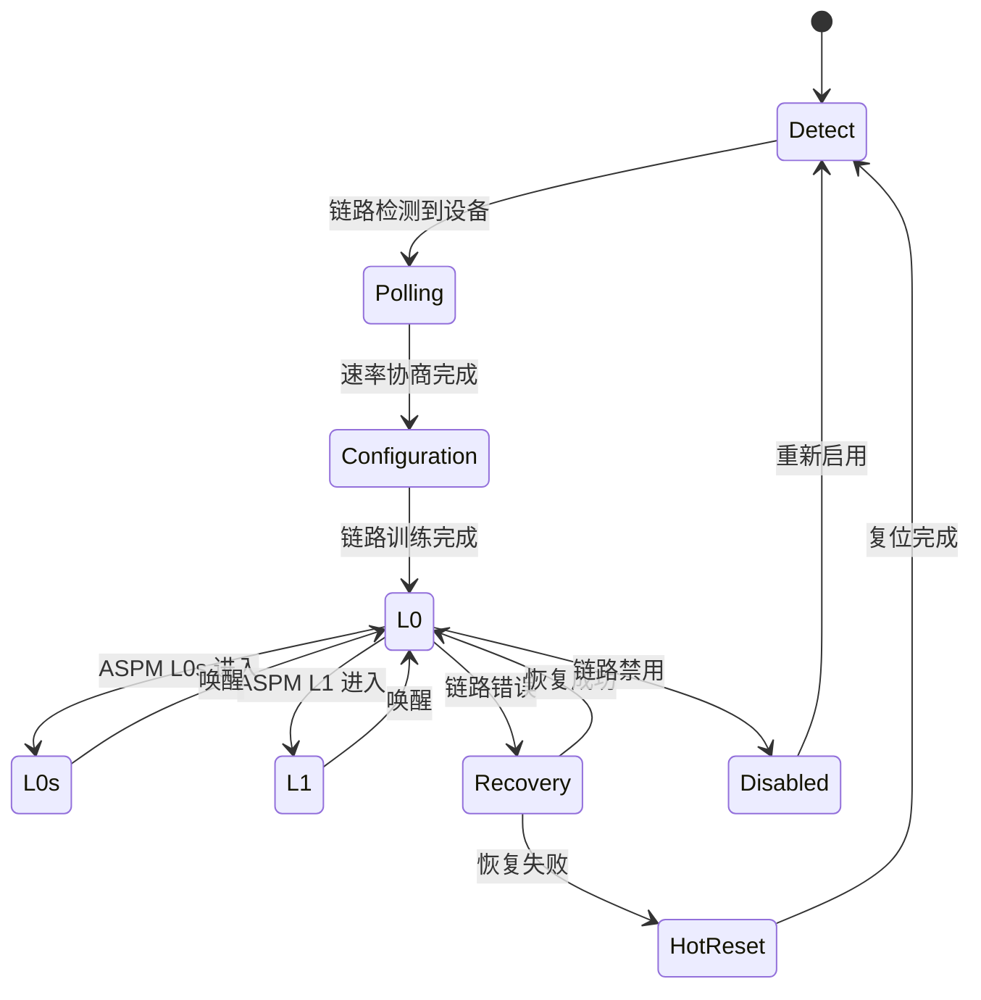
```mermaid
stateDiagram-v2
    [*] --> Detect
    Detect --> Polling: 链路检测到设备
    Polling --> Configuration: 速率协商完成
    Configuration --> L0: 链路训练完成
    L0 --> L0s: ASPM L0s 进入
    L0 --> L1: ASPM L1 进入
    L0s --> L0: 唤醒
    L1 --> L0: 唤醒
    L0 --> Recovery: 链路错误
    Recovery --> L0: 恢复成功
    Recovery --> HotReset: 恢复失败
    HotReset --> Detect: 复位完成
    L0 --> Disabled: 链路禁用
    Disabled --> Detect: 重新启用
```

---

## 4. PCIe 数据读操作时序图

### 4.1 Memory Read 操作

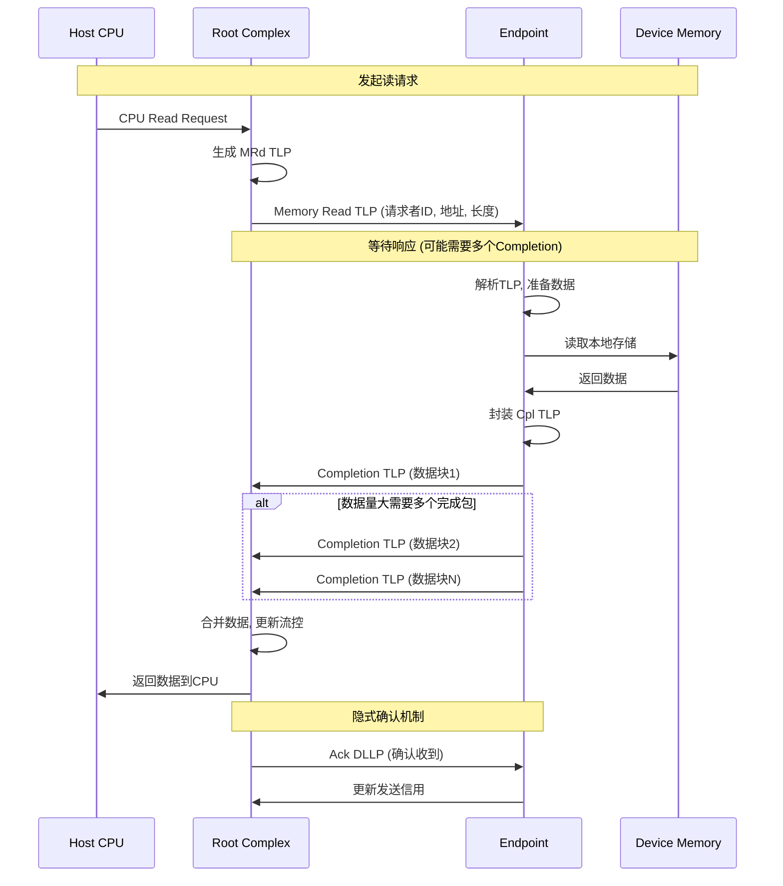
```mermaid
sequenceDiagram
    participant Host as Host CPU
    participant RC as Root Complex
    participant EP as Endpoint
    participant Mem as Device Memory

    Note over Host,Mem: 发起读请求
    Host->>RC: CPU Read Request
    RC->>RC: 生成 MRd TLP
    RC->>EP: Memory Read TLP (请求者ID, 地址, 长度)

    Note over RC,Mem: 等待响应 (可能需要多个Completion)
    EP->>EP: 解析TLP, 准备数据
    EP->>Mem: 读取本地存储
    Mem->>EP: 返回数据
    EP->>EP: 封装 Cpl TLP
    EP->>RC: Completion TLP (数据块1)

    alt 数据量大需要多个完成包
        EP->>RC: Completion TLP (数据块2)
        EP->>RC: Completion TLP (数据块N)
    end

    RC->>RC: 合并数据, 更新流控
    RC->>Host: 返回数据到CPU

    Note over RC,EP: 隐式确认机制
    RC->>EP: Ack DLLP (确认收到)
    EP->>RC: 更新发送信用
```

### 4.2 Memory Read 详细时序参数

| 阶段 | 典型延迟 | 说明 |
|------|----------|------|
| TLP 封装 | 100-200ns | RC生成请求包 |
| 链路传输 | 1-10μs | 取决于链路宽度和速率 |
| EP 响应时间 | 变化大 | 取决于设备内部延迟 |
| Completion 返回 | 1-10μs | 链路传输时间 |

---

## 5. PCIe 数据写操作时序图

### 5.1 Memory Write 操作 (Posted)

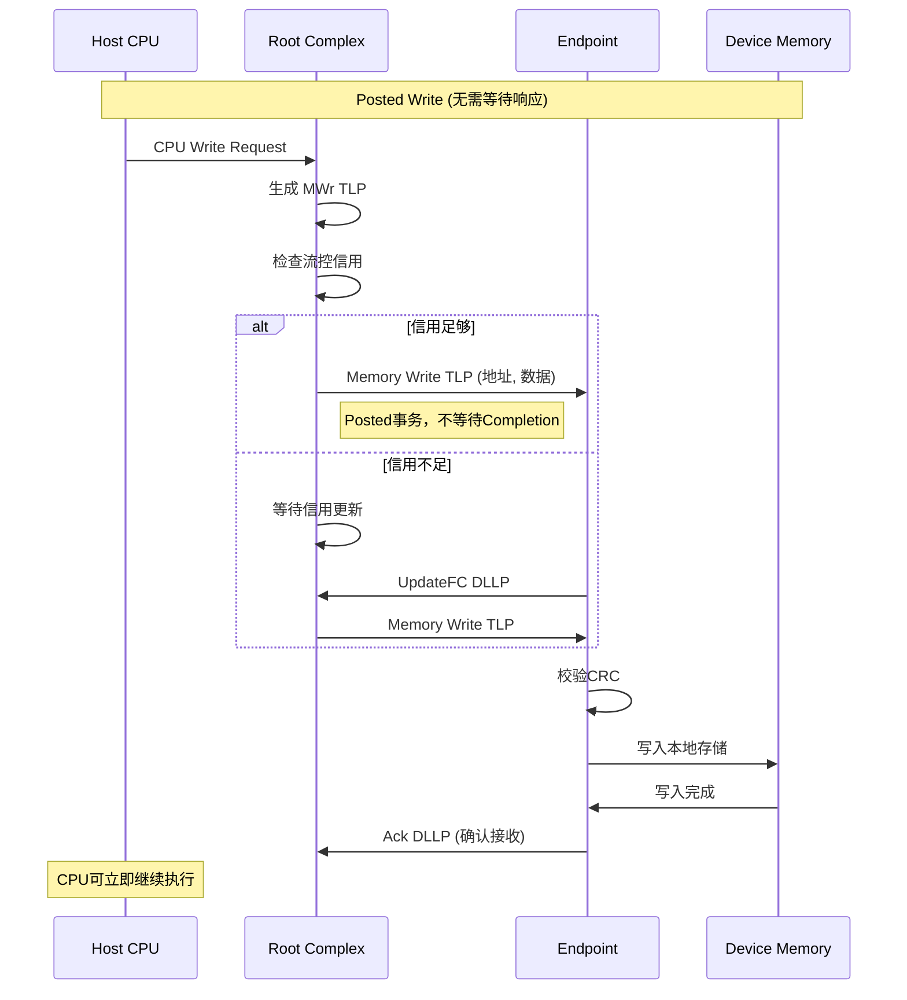
```mermaid
sequenceDiagram
    participant Host as Host CPU
    participant RC as Root Complex
    participant EP as Endpoint
    participant Mem as Device Memory

    Note over Host,Mem: Posted Write (无需等待响应)
    Host->>RC: CPU Write Request
    RC->>RC: 生成 MWr TLP
    RC->>RC: 检查流控信用

    alt 信用足够
        RC->>EP: Memory Write TLP (地址, 数据)
        Note right of RC: Posted事务，不等待Completion
    else 信用不足
        RC->>RC: 等待信用更新
        EP->>RC: UpdateFC DLLP
        RC->>EP: Memory Write TLP
    end

    EP->>EP: 校验CRC
    EP->>Mem: 写入本地存储
    Mem->>EP: 写入完成
    EP->>RC: Ack DLLP (确认接收)

    Note over Host: CPU可立即继续执行
```

### 5.2 Memory Write 操作 (Non-Posted)

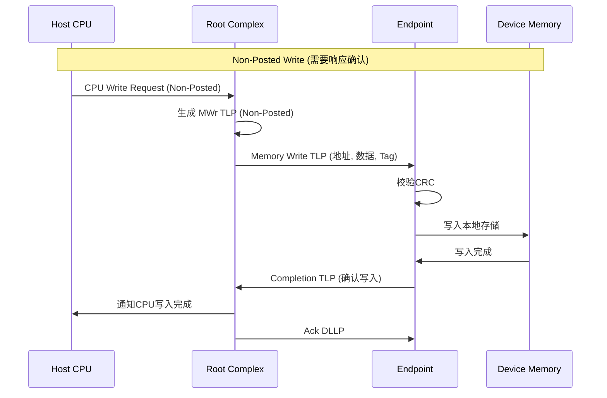
```mermaid
sequenceDiagram
    participant Host as Host CPU
    participant RC as Root Complex
    participant EP as Endpoint
    participant Mem as Device Memory

    Note over Host,Mem: Non-Posted Write (需要响应确认)
    Host->>RC: CPU Write Request (Non-Posted)
    RC->>RC: 生成 MWr TLP (Non-Posted)
    RC->>EP: Memory Write TLP (地址, 数据, Tag)

    EP->>EP: 校验CRC
    EP->>Mem: 写入本地存储
    Mem->>EP: 写入完成
    EP->>RC: Completion TLP (确认写入)

    RC->>Host: 通知CPU写入完成
    RC->>EP: Ack DLLP
```

### 5.3 读写 IO 时序流程总结

#### 4.3.1 读操作简化时序图

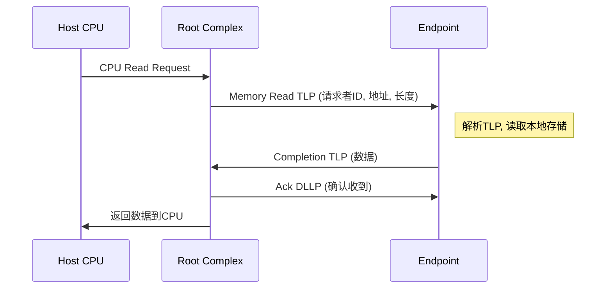
```mermaid
sequenceDiagram
    participant Host as Host CPU
    participant RC as Root Complex
    participant EP as Endpoint

    Host->>RC: CPU Read Request
    RC->>EP: Memory Read TLP (请求者ID, 地址, 长度)

    Note right of EP: 解析TLP, 读取本地存储

    EP->>RC: Completion TLP (数据)
    RC->>EP: Ack DLLP (确认收到)
    RC->>Host: 返回数据到CPU
```

**读操作关键特点：**
- **Non-Posted 事务**：必须等待 Completion 响应
- 可能需要多个 Completion 包（数据量大时）
- 发送方在等待响应期间持有 Tag（用于匹配请求和响应）

#### 4.3.2 Posted Write 简化时序图

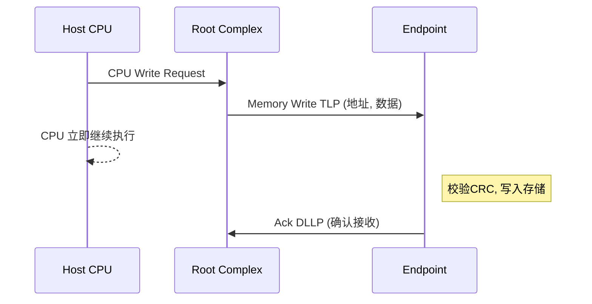
```mermaid
sequenceDiagram
    participant Host as Host CPU
    participant RC as Root Complex
    participant EP as Endpoint

    Host->>RC: CPU Write Request
    RC->>EP: Memory Write TLP (地址, 数据)
    Host-->>Host: CPU 立即继续执行

    Note right of EP: 校验CRC, 写入存储

    EP->>RC: Ack DLLP (确认接收)
```

**Posted Write 关键特点：**
- **无需 Completion 响应**，发送后立即返回
- 性能更高，适合大量数据传输
- 可靠性由 Ack/Nak 机制保证

#### 4.3.3 Non-Posted Write 简化时序图

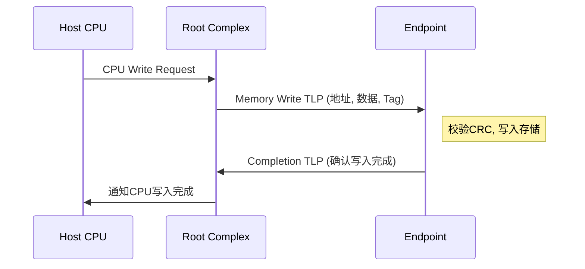
```mermaid
sequenceDiagram
    participant Host as Host CPU
    participant RC as Root Complex
    participant EP as Endpoint

    Host->>RC: CPU Write Request
    RC->>EP: Memory Write TLP (地址, 数据, Tag)

    Note right of EP: 校验CRC, 写入存储

    EP->>RC: Completion TLP (确认写入完成)
    RC->>Host: 通知CPU写入完成
```

**Non-Posted Write 关键特点：**
- 需要等待 Completion 确认写入成功
- 适用于需要确保数据已写入的场景
- 使用 Tag 匹配请求和响应

#### 4.3.4 读写操作对比总结

| 特性 | Memory Read | Posted Write | Non-Posted Write |
|------|-------------|--------------|------------------|
| **响应方式** | Completion TLP | 无 | Completion TLP |
| **等待时间** | 必须等待 | 无需等待 | 需要等待 |
| **性能** | 较低 | 最高 | 中等 |
| **适用场景** | 读取数据 | 批量写入 | 需要确认的写入 |
| **Tag 使用** | 是 | 否 | 是 |
| **可靠性机制** | Ack/Nak + 超时 | Ack/Nak | Ack/Nak + Completion |

#### 4.3.5 核心流程口诀

```
读操作：      发请求 → 等响应 → 返回数据 → 发Ack
Posted写：   发数据 → 立即返回 → 对方Ack
Non-Posted写：发数据 → 等Completion → 通知完成
```

---

## 6. PCIe 配置读写时序流程

### 6.1 配置空间概述

PCIe 配置空间用于设备枚举、资源分配和功能配置：
- **配置空间大小**：每个 Function 4KB（PCIe 扩展）
- **访问方式**：Config Read / Config Write TLP
- **事务类型**：始终为 **Non-Posted**（必须等待 Completion）
- **地址格式**：Bus + Device + Function + Register Offset

### 6.2 配置读操作时序图

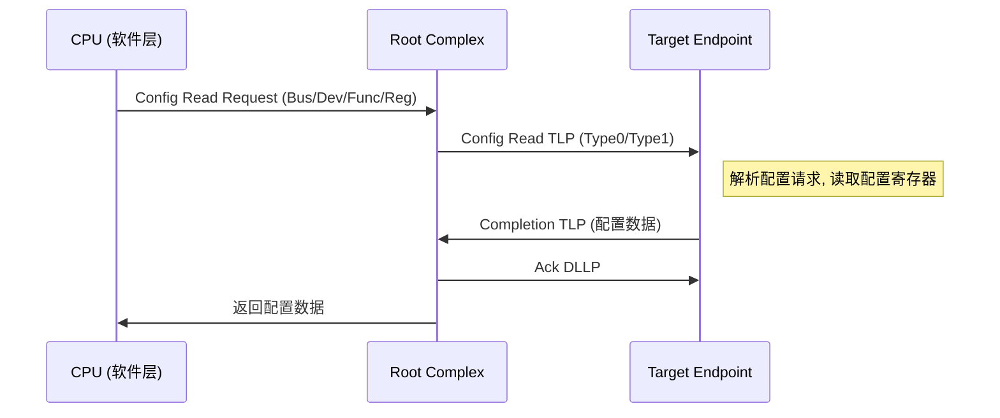
```mermaid
sequenceDiagram
    participant CPU as CPU (软件层)
    participant RC as Root Complex
    participant EP as Target Endpoint

    CPU->>RC: Config Read Request (Bus/Dev/Func/Reg)
    RC->>EP: Config Read TLP (Type0/Type1)

    Note right of EP: 解析配置请求, 读取配置寄存器

    EP->>RC: Completion TLP (配置数据)
    RC->>EP: Ack DLLP
    RC->>CPU: 返回配置数据
```

### 6.3 配置写操作时序图

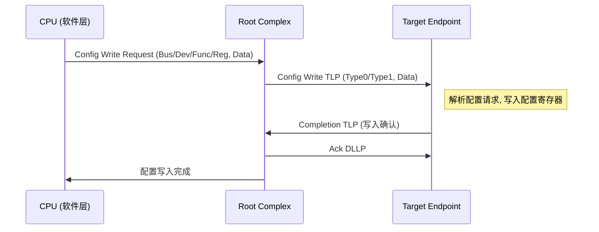
```mermaid
sequenceDiagram
    participant CPU as CPU (软件层)
    participant RC as Root Complex
    participant EP as Target Endpoint

    CPU->>RC: Config Write Request (Bus/Dev/Func/Reg, Data)
    RC->>EP: Config Write TLP (Type0/Type1, Data)

    Note right of EP: 解析配置请求, 写入配置寄存器

    EP->>RC: Completion TLP (写入确认)
    RC->>EP: Ack DLLP
    RC->>CPU: 配置写入完成
```

### 6.4 配置 TLP 类型

| TLP 类型 | 适用场景 | 说明 |
|----------|----------|------|
| **Type 0** | 本地总线设备 | 直接访问目标设备，不经过 Switch |
| **Type 1** | 跨总线设备 | 经过 Switch 转发，包含完整路由信息 |

```
Type 0 配置请求地址格式:
┌─────────────────────────────────────────────────────────┐
│ Reserved │  Register Offset  │ Function │ Device │ Bus  │
│  (4bit)  │     (12bit)       │  (3bit)  │ (5bit) │(8bit)│
└─────────────────────────────────────────────────────────┘

Type 1 配置请求地址格式 (包含完整路由):
┌─────────────────────────────────────────────────────────┐
│ Register │ Function │ Device │ Bus  │   Reserved       │
│ (12bit)  │  (3bit)  │ (5bit) │(8bit)│    (32bit)       │
└─────────────────────────────────────────────────────────┘
```

### 6.5 配置读写与 Memory 读写对比

| 特性 | 配置读写 | Memory 读写 |
|------|----------|-------------|
| **TLP 类型** | Config Read/Write | MRd/MWr |
| **地址空间** | 配置空间 | Memory/IO 空间 |
| **事务属性** | 始终 Non-Posted | 可 Posted 或 Non-Posted |
| **数据长度** | 通常 4 字节 | 可达 MaxPayload |
| **访问时机** | 初始化/枚举阶段 | 正常数据传输阶段 |
| **路由方式** | Bus/Device/Function | Memory 地址 |
| **超时处理** | 返回错误值 | 重试机制 |

### 6.6 配置访问典型场景

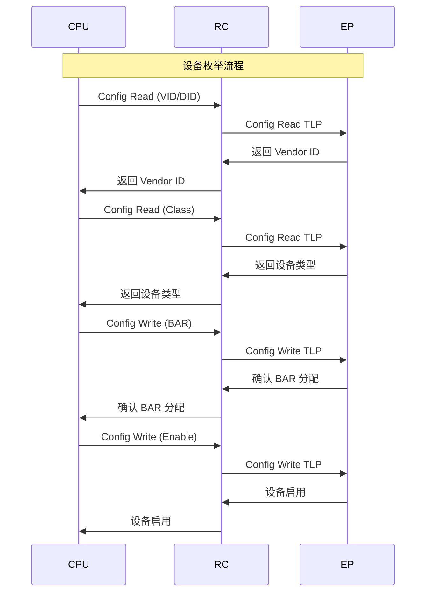
```mermaid
sequenceDiagram
    participant CPU as CPU
    participant RC as RC
    participant EP as EP

    Note over CPU,EP: 设备枚举流程

    CPU->>RC: Config Read (VID/DID)
    RC->>EP: Config Read TLP
    EP->>RC: 返回 Vendor ID
    RC->>CPU: 返回 Vendor ID

    CPU->>RC: Config Read (Class)
    RC->>EP: Config Read TLP
    EP->>RC: 返回设备类型
    RC->>CPU: 返回设备类型

    CPU->>RC: Config Write (BAR)
    RC->>EP: Config Write TLP
    EP->>RC: 确认 BAR 分配
    RC->>CPU: 确认 BAR 分配

    CPU->>RC: Config Write (Enable)
    RC->>EP: Config Write TLP
    EP->>RC: 设备启用
    RC->>CPU: 设备启用
```

---

## 7. PCIe 数据传输流程图

### 7.1 TLP 包结构与传输

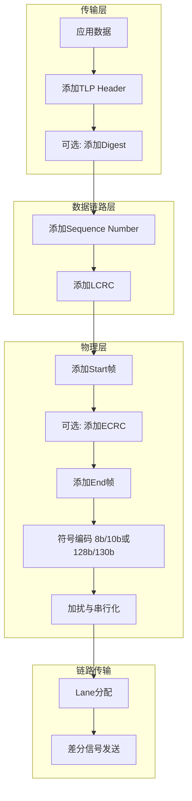
```mermaid
flowchart TB
    subgraph 传输层
        A[应用数据] --> B[添加TLP Header]
        B --> C[可选: 添加Digest]
    end

    subgraph 数据链路层
        C --> D[添加Sequence Number]
        D --> E[添加LCRC]
    end

    subgraph 物理层
        E --> F[添加Start帧]
        F --> G[可选: 添加ECRC]
        G --> H[添加End帧]
        H --> I[符号编码 8b/10b或128b/130b]
        I --> J[加扰与串行化]
    end

    subgraph 链路传输
        J --> K[Lane分配]
        K --> L[差分信号发送]
    end
```

### 7.2 数据链路层确认机制

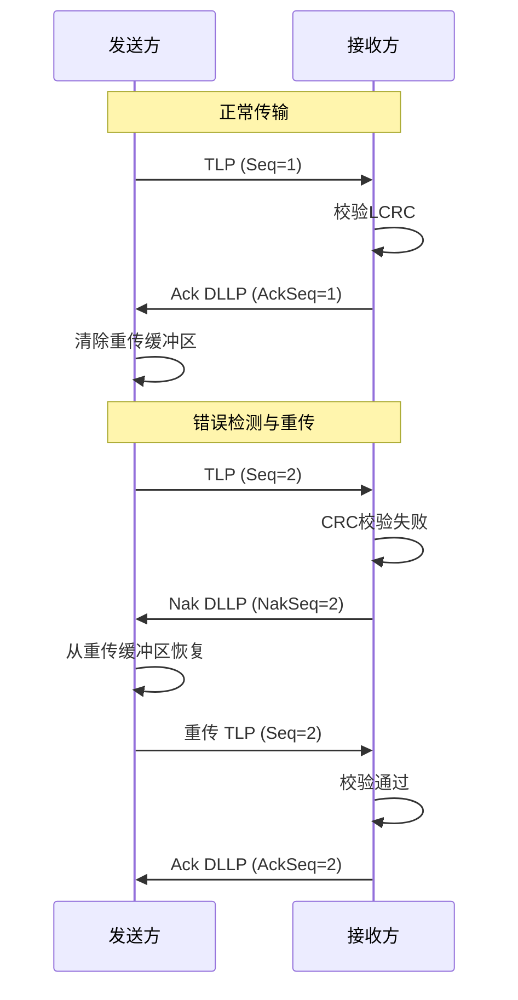
```mermaid
sequenceDiagram
    participant Sender as 发送方
    participant Receiver as 接收方

    Note over Sender,Receiver: 正常传输
    Sender->>Receiver: TLP (Seq=1)
    Receiver->>Receiver: 校验LCRC
    Receiver->>Sender: Ack DLLP (AckSeq=1)
    Sender->>Sender: 清除重传缓冲区

    Note over Sender,Receiver: 错误检测与重传
    Sender->>Receiver: TLP (Seq=2)
    Receiver->>Receiver: CRC校验失败
    Receiver->>Sender: Nak DLLP (NakSeq=2)
    Sender->>Sender: 从重传缓冲区恢复
    Sender->>Receiver: 重传 TLP (Seq=2)
    Receiver->>Receiver: 校验通过
    Receiver->>Sender: Ack DLLP (AckSeq=2)
```

---

## 8. PCIe 流控制时序图

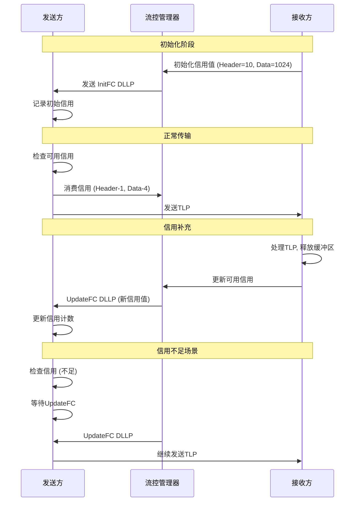
```mermaid
sequenceDiagram
    participant TX as 发送方
    participant FC as 流控管理器
    participant RX as 接收方

    Note over TX,RX: 初始化阶段
    RX->>FC: 初始化信用值 (Header=10, Data=1024)
    FC->>TX: 发送 InitFC DLLP
    TX->>TX: 记录初始信用

    Note over TX,RX: 正常传输
    TX->>TX: 检查可用信用
    TX->>FC: 消费信用 (Header-1, Data-4)
    TX->>RX: 发送TLP

    Note over TX,RX: 信用补充
    RX->>RX: 处理TLP, 释放缓冲区
    RX->>FC: 更新可用信用
    FC->>TX: UpdateFC DLLP (新信用值)
    TX->>TX: 更新信用计数

    Note over TX,RX: 信用不足场景
    TX->>TX: 检查信用 (不足)
    TX->>TX: 等待UpdateFC
    FC->>TX: UpdateFC DLLP
    TX->>RX: 继续发送TLP
```

---

## 9. PCIe 电源管理与退出时序图

### 9.1 进入低功耗状态 (ASPM L1)

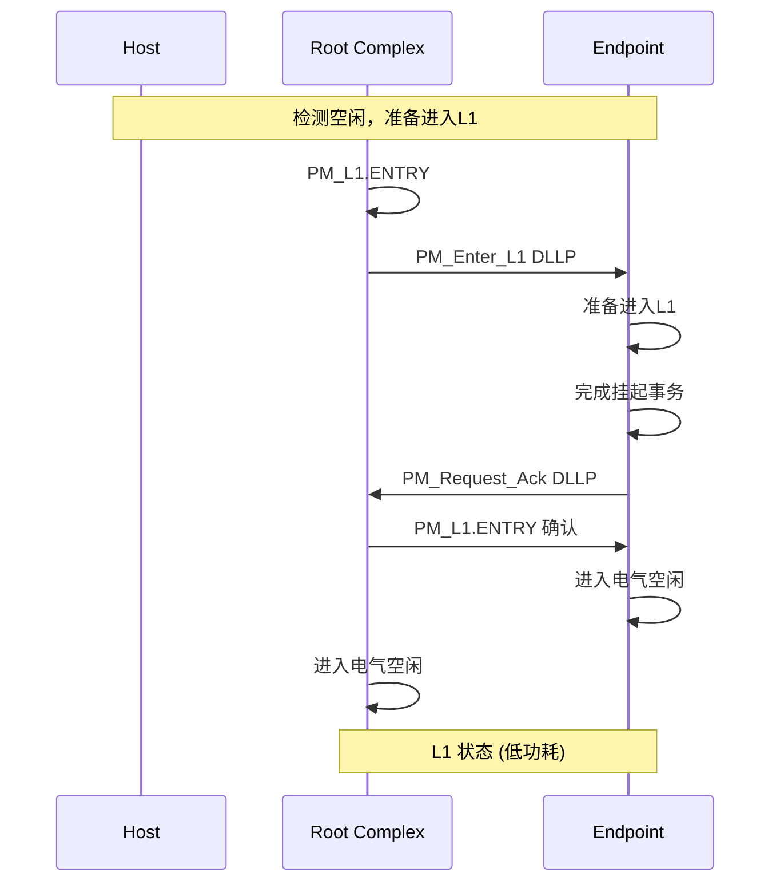
```mermaid
sequenceDiagram
    participant Host as Host
    participant RC as Root Complex
    participant EP as Endpoint

    Note over Host,EP: 检测空闲，准备进入L1
    RC->>RC: PM_L1.ENTRY

    RC->>EP: PM_Enter_L1 DLLP
    EP->>EP: 准备进入L1
    EP->>EP: 完成挂起事务
    EP->>RC: PM_Request_Ack DLLP

    RC->>EP: PM_L1.ENTRY 确认
    EP->>EP: 进入电气空闲
    RC->>RC: 进入电气空闲

    Note over RC,EP: L1 状态 (低功耗)
```

### 9.2 从低功耗状态唤醒

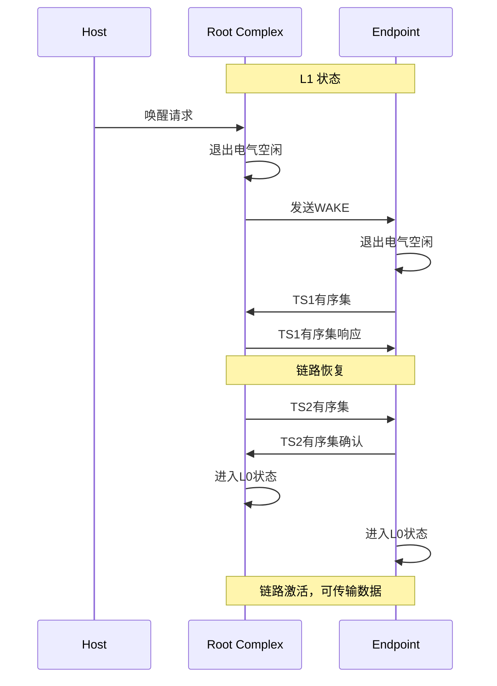
```mermaid
sequenceDiagram
    participant Host as Host
    participant RC as Root Complex
    participant EP as Endpoint

    Note over RC,EP: L1 状态
    Host->>RC: 唤醒请求
    RC->>RC: 退出电气空闲
    RC->>EP: 发送WAKE#信号

    EP->>EP: 退出电气空闲
    EP->>RC: TS1有序集
    RC->>EP: TS1有序集响应

    Note over RC,EP: 链路恢复
    RC->>EP: TS2有序集
    EP->>RC: TS2有序集确认

    RC->>RC: 进入L0状态
    EP->>EP: 进入L0状态
    Note over RC,EP: 链路激活，可传输数据
```

---

## 10. PCIe 正常退出流程

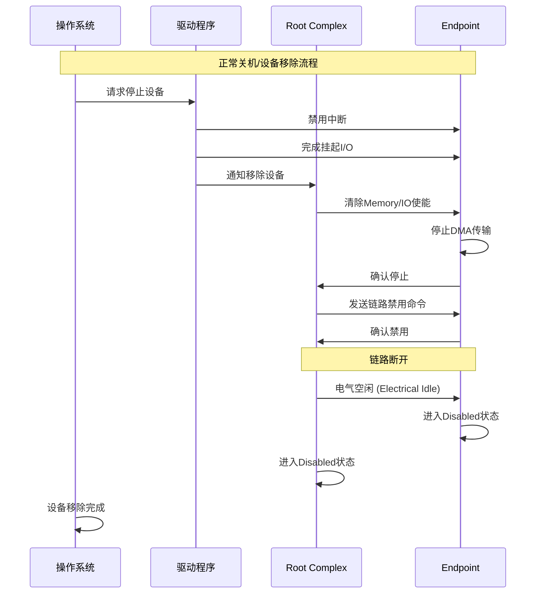
```mermaid
sequenceDiagram
    participant OS as 操作系统
    participant Driver as 驱动程序
    participant RC as Root Complex
    participant EP as Endpoint

    Note over OS,EP: 正常关机/设备移除流程
    OS->>Driver: 请求停止设备
    Driver->>EP: 禁用中断
    Driver->>EP: 完成挂起I/O

    Driver->>RC: 通知移除设备
    RC->>EP: 清除Memory/IO使能
    EP->>EP: 停止DMA传输
    EP->>RC: 确认停止

    RC->>EP: 发送链路禁用命令
    EP->>RC: 确认禁用

    Note over RC,EP: 链路断开
    RC->>EP: 电气空闲 (Electrical Idle)
    EP->>EP: 进入Disabled状态
    RC->>RC: 进入Disabled状态

    OS->>OS: 设备移除完成
```

---

## 11. PCIe 异常处理时序图

### 11.1 错误检测与恢复

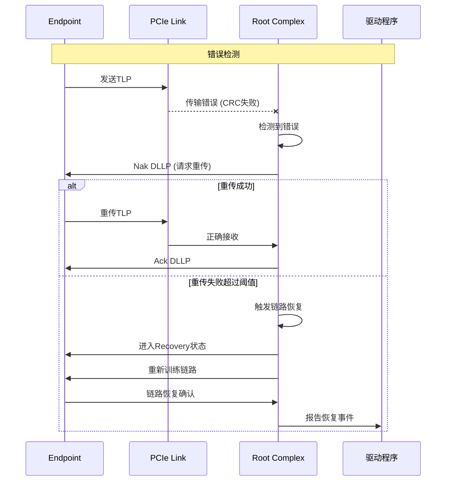
```mermaid
sequenceDiagram
    participant EP as Endpoint
    participant PLink as PCIe Link
    participant RC as Root Complex
    participant Driver as 驱动程序

    Note over EP,Driver: 错误检测
    EP->>PLink: 发送TLP
    PLink--xRC: 传输错误 (CRC失败)

    RC->>RC: 检测到错误
    RC->>EP: Nak DLLP (请求重传)

    alt 重传成功
        EP->>PLink: 重传TLP
        PLink->>RC: 正确接收
        RC->>EP: Ack DLLP
    else 重传失败超过阈值
        RC->>RC: 触发链路恢复
        RC->>EP: 进入Recovery状态
        RC->>EP: 重新训练链路
        EP->>RC: 链路恢复确认
        RC->>Driver: 报告恢复事件
    end
```

### 11.2 致命错误处理

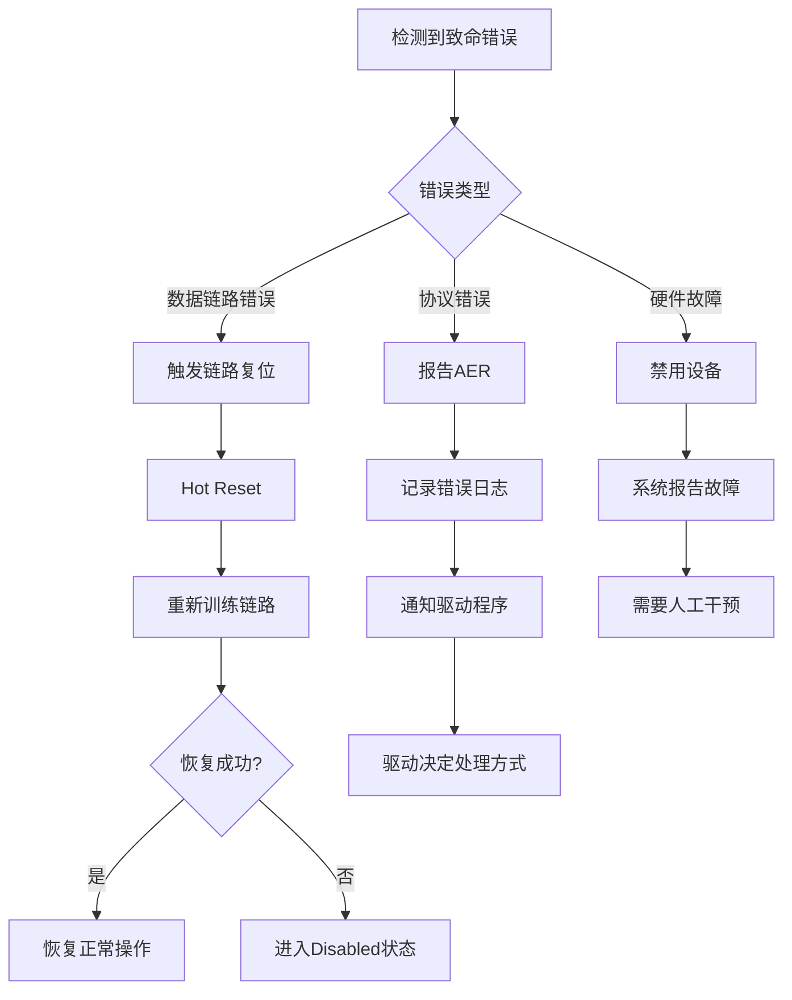
```mermaid
flowchart TD
    A[检测到致命错误] --> B{错误类型}

    B -->|数据链路错误| C[触发链路复位]
    B -->|协议错误| D[报告AER]
    B -->|硬件故障| E[禁用设备]

    C --> F[Hot Reset]
    F --> G[重新训练链路]
    G --> H{恢复成功?}

    H -->|是| I[恢复正常操作]
    H -->|否| J[进入Disabled状态]

    D --> K[记录错误日志]
    K --> L[通知驱动程序]
    L --> M[驱动决定处理方式]

    E --> N[系统报告故障]
    N --> O[需要人工干预]
```

---

## 12. 完整的 PCIe 操作时序总结

| 操作类型 | Posted | 完成时间 | 可靠性机制 |
|----------|--------|----------|------------|
| Memory Read | 否 | 等待Completion | 重试 + Ack/Nak |
| Memory Write | 是/否 | Posted立即/Non-Posted等待 | LCRC + Ack/Nak |
| Config Read | 否 | 等待Completion | 超时机制 |
| Config Write | 否 | 等待Completion | 超时机制 |
| Message | 是 | 立即完成 | 无确认 |
| Interrupt | 是 | 立即完成 | MSI确认 |

---

## 13. 时序参数参考

### 13.1 链路训练时序

| 参数 | PCIe 3.0 | PCIe 4.0 | PCIe 5.0 |
|------|----------|----------|----------|
| 最小训练时间 | 20ms | 20ms | 20ms |
| 典型训练时间 | 50-100ms | 50-100ms | 50-100ms |
| Recovery时间 | 1-10ms | 1-10ms | 1-10ms |

### 13.2 数据传输时序

| 参数 | PCIe 3.0 x16 | PCIe 4.0 x16 | PCIe 5.0 x16 |
|------|--------------|--------------|--------------|
| 带宽 | ~16 GB/s | ~32 GB/s | ~63 GB/s |
| TLP延迟 | 200-500ns | 200-500ns | 200-500ns |
| 最大Payload | 4096字节 | 4096字节 | 4096字节 |

---
