# PCIe 协议时序流程图详解

## 1. PCIe 协议架构概述

PCIe 采用分层协议架构，从上到下分为：
- **事务层 (Transaction Layer)**: 处理 TLP (Transaction Layer Packet)
- **数据链路层 (Data Link Layer)**: 负责链路可靠性和完整性
- **物理层 (Physical Layer)**: 处理电气信号和编码

---

## 2. PCIe 初始化时序图

### 2.1 完整初始化流程

```mermaid
sequenceDiagram
    participant RC as Root Complex
    participant Link as PCIe Link
    participant EP as Endpoint

    Note over RC,EP: 阶段1: 系统上电与复位
    RC->>Link: Power On
    Link->>EP: PERST# (Fundamental Reset)
    EP->>EP: 内部初始化

    Note over RC,EP: 阶段2: 物理层链路训练
    RC->>Link: Detect.Presence
    Link->>RC: Presence Detected
    RC->>Link: Polling.Active (发送TS1有序集)
    EP->>Link: 响应TS1有序集
    RC->>Link: Polling.Compliance
    Link->>RC: Polling.Configuration
    RC->>Link: Configuration.Lanenum (发送TS2)
    EP->>Link: 确认链路编号
    RC->>Link: Configuration.Complete
    Link->>RC: L0 (链路激活)

    Note over RC,EP: 阶段3: 数据链路层初始化
    RC->>EP: DLLP (数据链路层包)
    EP->>RC: DLLP Ack
    RC->>EP: 初始化流控制 (InitFC)
    EP->>RC: 确认流控制参数

    Note over RC,EP: 阶段4: 配置空间枚举
    RC->>EP: Config Read (Bus=0, Device=0)
    EP->>RC: 返回Vendor ID/Device ID
    RC->>EP: Config Write (分配BAR地址)
    EP->>RC: 确认BAR配置
    RC->>EP: Memory/IO Enable
    EP->>RC: 设备就绪
```

### 2.2 链路训练状态机 (LTSSM)

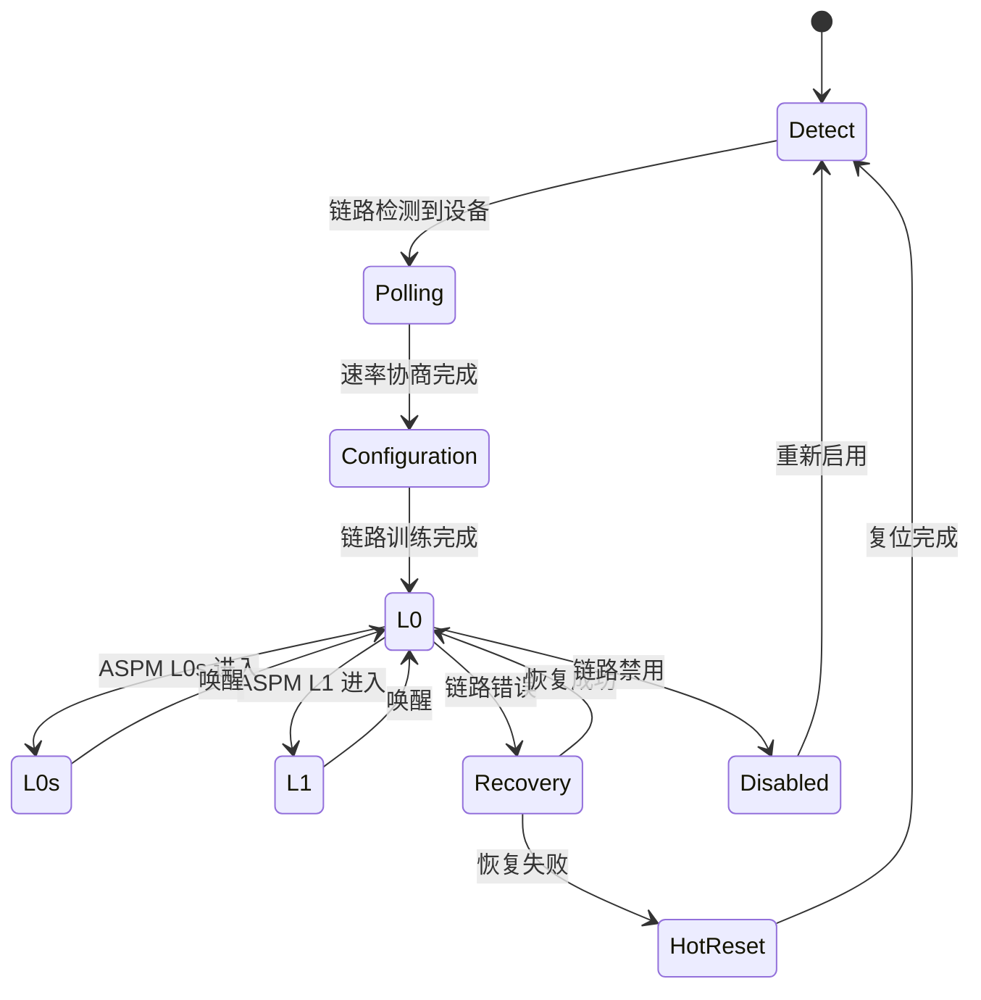

---

## 3. PCIe 数据读操作时序图

### 3.1 Memory Read 操作

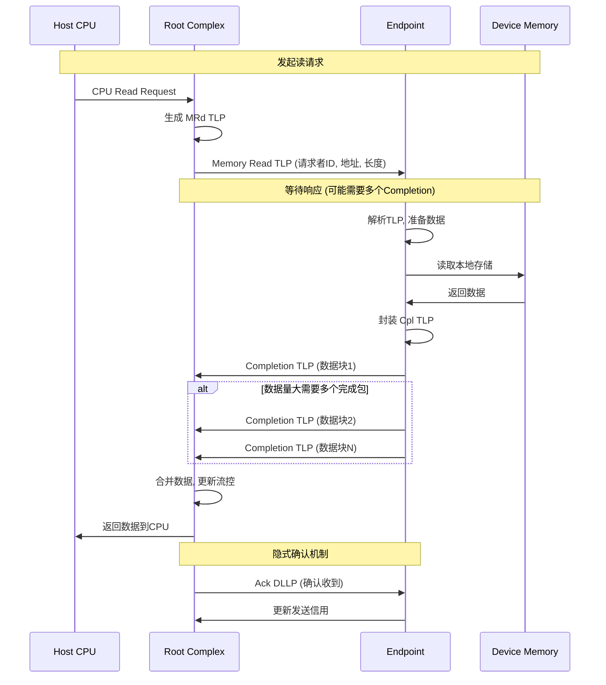

### 3.2 Memory Read 详细时序参数

| 阶段 | 典型延迟 | 说明 |
|------|----------|------|
| TLP 封装 | 100-200ns | RC生成请求包 |
| 链路传输 | 1-10μs | 取决于链路宽度和速率 |
| EP 响应时间 | 变化大 | 取决于设备内部延迟 |
| Completion 返回 | 1-10μs | 链路传输时间 |

---

## 4. PCIe 数据写操作时序图

### 4.1 Memory Write 操作 (Posted)

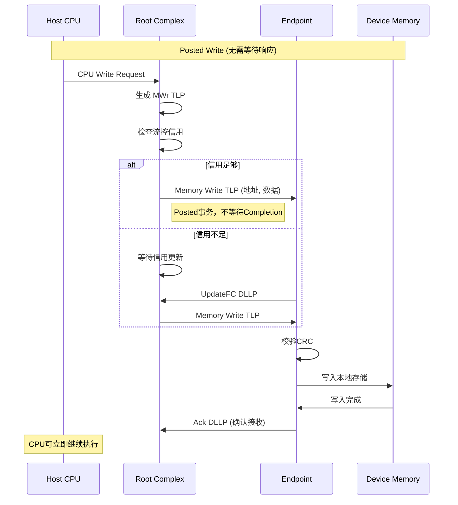

### 4.2 Memory Write 操作 (Non-Posted)

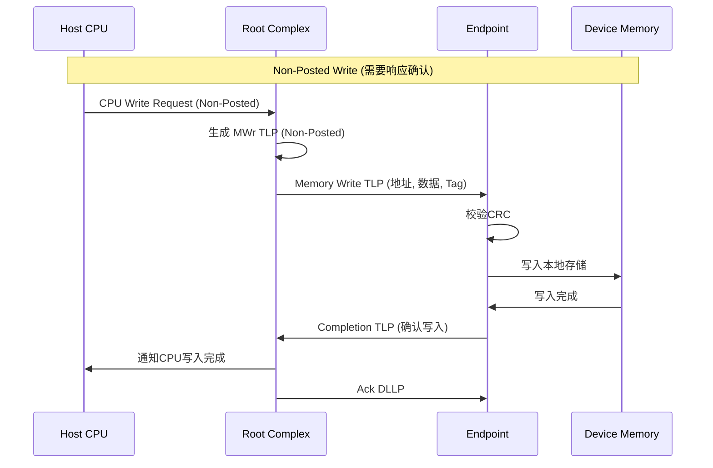

---

## 5. PCIe 数据传输流程图

### 5.1 TLP 包结构与传输

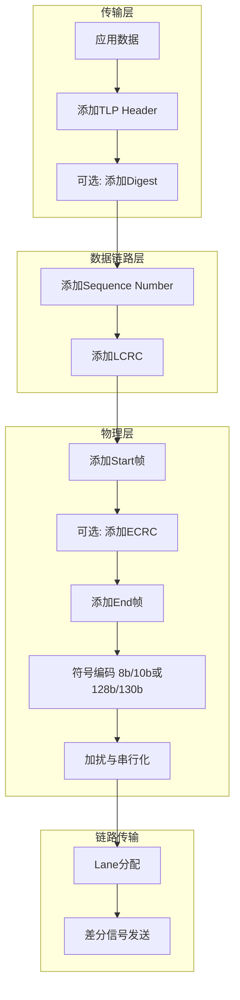

### 5.2 数据链路层确认机制

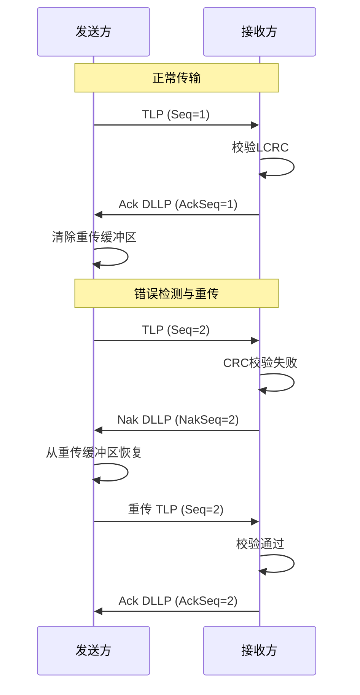

---

## 6. PCIe 流控制时序图

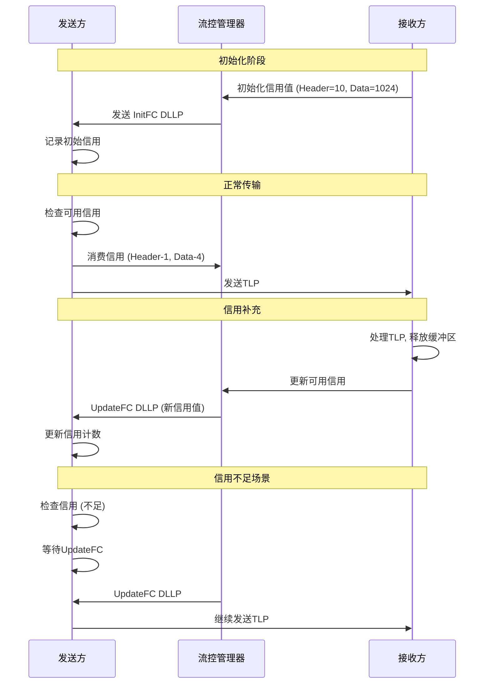

---

## 7. PCIe 电源管理与退出时序图

### 7.1 进入低功耗状态 (ASPM L1)

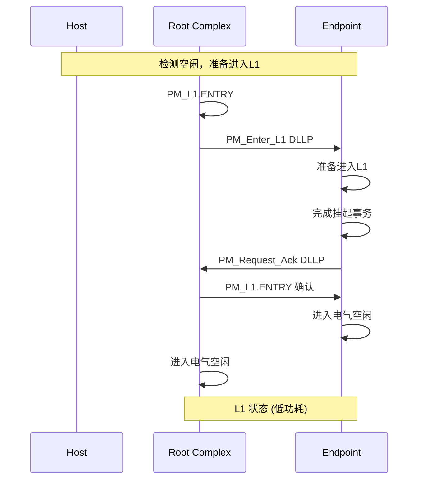

### 7.2 从低功耗状态唤醒

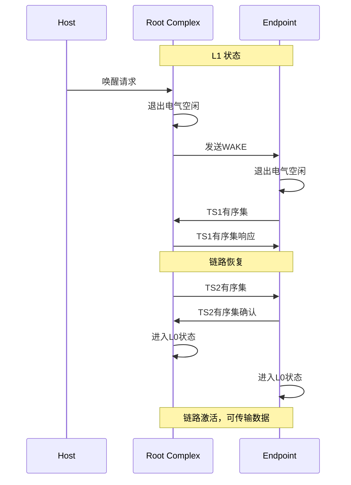

---

## 8. PCIe 正常退出流程

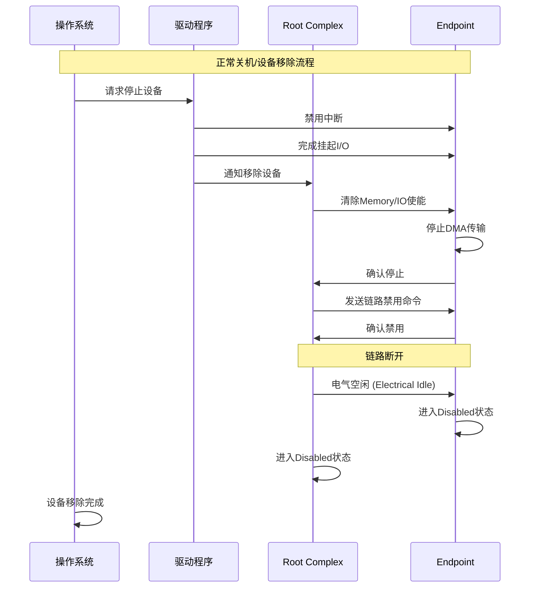

---

## 9. PCIe 异常处理时序图

### 9.1 错误检测与恢复

```mermaid
sequenceDiagram
    participant EP as Endpoint
    participant Link as PCIe Link
    participant RC as Root Complex
    participant Driver as 驱动程序

    Note over EP,Driver: 错误检测
    EP->>Link: 发送TLP
    Link--xRC: 传输错误 (CRC失败)

    RC->>RC: 检测到错误
    RC->>EP: Nak DLLP (请求重传)

    alt 重传成功
        EP->>Link: 重传TLP
        Link->>RC: 正确接收
        RC->>EP: Ack DLLP
    else 重传失败超过阈值
        RC->>RC: 触发链路恢复
        RC->>EP: 进入Recovery状态
        RC->>EP: 重新训练链路
        EP->>RC: 链路恢复确认
        RC->>Driver: 报告恢复事件
    end
```

### 9.2 致命错误处理

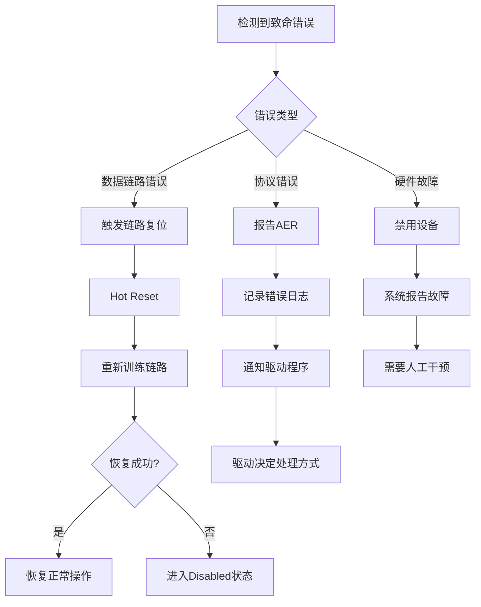

---

## 10. 完整的 PCIe 操作时序总结

| 操作类型 | Posted | 完成时间 | 可靠性机制 |
|----------|--------|----------|------------|
| Memory Read | 否 | 等待Completion | 重试 + Ack/Nak |
| Memory Write | 是/否 | Posted立即/Non-Posted等待 | LCRC + Ack/Nak |
| Config Read | 否 | 等待Completion | 超时机制 |
| Config Write | 否 | 等待Completion | 超时机制 |
| Message | 是 | 立即完成 | 无确认 |
| Interrupt | 是 | 立即完成 | MSI确认 |

---

## 11. 时序参数参考

### 11.1 链路训练时序

| 参数 | PCIe 3.0 | PCIe 4.0 | PCIe 5.0 |
|------|----------|----------|----------|
| 最小训练时间 | 20ms | 20ms | 20ms |
| 典型训练时间 | 50-100ms | 50-100ms | 50-100ms |
| Recovery时间 | 1-10ms | 1-10ms | 1-10ms |

### 11.2 数据传输时序

| 参数 | PCIe 3.0 x16 | PCIe 4.0 x16 | PCIe 5.0 x16 |
|------|--------------|--------------|--------------|
| 带宽 | ~16 GB/s | ~32 GB/s | ~63 GB/s |
| TLP延迟 | 200-500ns | 200-500ns | 200-500ns |
| 最大Payload | 4096字节 | 4096字节 | 4096字节 |

---
