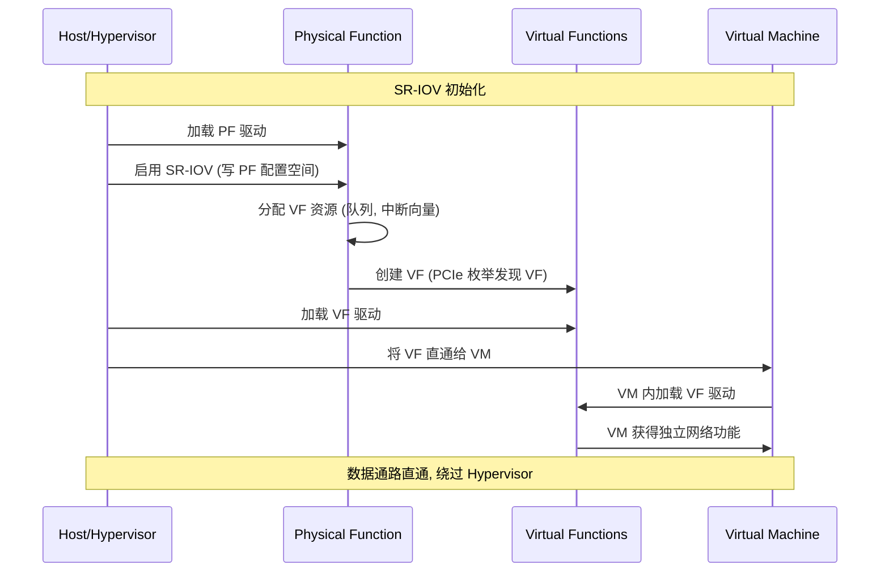

# SR-IOV (Single Root I/O Virtualization) 技术

## 1. 概述

**SR-IOV** 是一种 PCIe 规范扩展，允许单个物理 PCIe 设备在虚拟化环境中呈现为多个独立的虚拟设备。

## 2. 传统虚拟化 vs SR-IOV

### 2.1 传统方式 (软件虚拟化)

```
┌─────────────────────────────────────────────┐
│                 Hypervisor                   │
│  ┌─────────┐  ┌─────────┐  ┌─────────┐     │
│  │  VM1    │  │  VM2    │  │  VM3    │     │
│  └────┬────┘  └────┬────┘  └────┬────┘     │
│       │            │            │           │
│       └────────────┼────────────┘           │
│                    ▼                        │
│            ┌──────────────┐                 │
│            │ 虚拟设备模拟 │  ← CPU开销大    │
│            └──────┬───────┘                 │
└───────────────────┼─────────────────────────┘
                    ▼
            ┌──────────────┐
            │ 物理网卡 PF  │
            └──────────────┘
```

### 2.2 SR-IOV 方式 (硬件虚拟化)

```
┌─────────────────────────────────────────────┐
│                 Hypervisor                   │
│  ┌─────────┐  ┌─────────┐  ┌─────────┐     │
│  │  VM1    │  │  VM2    │  │  VM3    │     │
│  └────┬────┘  └────┬────┘  └────┬────┘     │
│       │            │            │           │
│       ▼            ▼            ▼           │
│     VF1          VF2          VF3  ← 直通  │
│       │            │            │           │
└───────┼────────────┼────────────┼───────────┘
        └────────────┼────────────┘
                     ▼
            ┌──────────────┐
            │ 物理网卡 PF  │  ← 硬件级隔离
            │  + VF 硬件  │
            └──────────────┘
```

---

## 3. 核心概念

| 术语 | 全称 | 说明 |
|------|------|------|
| **PF** | Physical Function | 物理功能，完整的 PCIe 功能，用于管理设备 |
| **VF** | Virtual Function | 虚拟功能，轻量级 PCIe 功能，分配给虚拟机使用 |
| **BAR** | Base Address Register | 基地址寄存器，PF/VF 各自独立 |

---

## 4. SR-IOV 架构

```
┌─────────────────────────────────────────────────────────┐
│                    物理 PCIe 设备                        │
│  (例如: 支持 SR-IOV 的网卡)                              │
├─────────────────────────────────────────────────────────┤
│                                                          │
│   ┌─────────────────────────────────────────────────┐   │
│   │              Physical Function (PF)              │   │
│   │  ┌─────────┐  ┌─────────┐  ┌─────────────────┐  │   │
│   │  │ 配置空间│  │ 管理接口│  │ 全局资源管理   │  │   │
│   │  └─────────┘  └─────────┘  └─────────────────┘  │   │
│   └─────────────────────────────────────────────────┘   │
│                         │                                │
│                         │ 管理控制                       │
│                         ▼                                │
│   ┌──────────┐ ┌──────────┐ ┌──────────┐ ┌──────────┐   │
│   │  VF0     │ │  VF1     │ │  VF2     │ │  VF_n    │   │
│   │ 队列对 0 │ │ 队列对 1 │ │ 队列对 2 │ │ 队列对 n │   │
│   │ 中断向量 │ │ 中断向量 │ │ 中断向量 │ │ 中断向量 │   │
│   └──────────┘ └──────────┘ └──────────┘ └──────────┘   │
│        │            │            │            │          │
└────────┼────────────┼────────────┼────────────┼──────────┘
         │            │            │            │
         ▼            ▼            ▼            ▼
       VM0          VM1          VM2          VMn
```

---

## 5. 数据流模型

### 5.1 核心原则：数据不经过 PF

SR-IOV 的核心优势就是 **VF 的数据通路不经过 PF**，而是直接由硬件处理。

```
┌─────────────────────────────────────────────────────────────────┐
│                    物理网卡 (支持 SR-IOV)                        │
├─────────────────────────────────────────────────────────────────┤
│                                                                  │
│  ┌─────────────────────────────────────────────────────────┐    │
│  │                    Physical Function                     │    │
│  │  ┌──────────┐  ┌──────────┐  ┌──────────────────────┐  │    │
│  │  │Admin队列 │  │ IO队列   │  │ 全局管理(交换/路由) │  │    │
│  │  │ (管理用) │  │ (可选)   │  │                     │  │    │
│  │  └──────────┘  └──────────┘  └──────────────────────┘  │    │
│  └─────────────────────────────────────────────────────────┘    │
│                          │                                       │
│                          │ 仅管理命令交互                        │
│                          ▼                                       │
│  ┌────────────┐ ┌────────────┐ ┌────────────┐ ┌────────────┐    │
│  │    VF0     │ │    VF1     │ │    VF2     │ │    VF_n    │    │
│  │ ┌────────┐ │ │ ┌────────┐ │ │ ┌────────┐ │ │ ┌────────┐ │    │
│  │ │Admin Q │ │ │ │Admin Q │ │ │ │Admin Q │ │ │ │Admin Q │ │    │
│  │ └────────┘ │ │ └────────┘ │ │ └────────┘ │ │ └────────┘ │    │
│  │ ┌────────┐ │ │ ┌────────┐ │ │ ┌────────┐ │ │ ┌────────┐ │    │
│  │ │ TX队列 │ │ │ │ TX队列 │ │ │ │ TX队列 │ │ │ │ TX队列 │ │    │
│  │ └────────┘ │ │ └────────┘ │ │ └────────┘ │ │ └────────┘ │    │
│  │ ┌────────┐ │ │ ┌────────┐ │ │ ┌────────┐ │ │ ┌────────┐ │    │
│  │ │ RX队列 │ │ │ │ RX队列 │ │ │ │ RX队列 │ │ │ │ RX队列 │ │    │
│  │ └────────┘ │ │ └────────┘ │ │ └────────┘ │ │ └────────┘ │    │
│  └─────┬──────┘ └─────┬──────┘ └─────┬──────┘ └─────┬──────┘    │
│        │              │              │              │            │
│        ▼              ▼              ▼              ▼            │
│  ┌─────────────────────────────────────────────────────────┐    │
│  │              硬件交换/分发逻辑 (MAC/VLAN)                │    │
│  └─────────────────────────────────────────────────────────┘    │
│                          │                                       │
└──────────────────────────┼───────────────────────────────────────┘
                           │
                           ▼
                      物理网口
                    (发送/接收)
```

### 5.2 接收方向 (RX) - 不经过 PF

```
物理网口收到数据包
       │
       ▼
┌──────────────────────────┐
│ 硬件解析 (MAC/VLAN/RSS)  │
│ 判断属于哪个 VF          │
└───────────┬──────────────┘
            │
            ▼
     直接写入 VF 的 RX 队列
     (DMA 直接到 VM 内存)
            │
            ▼
          VM 收到数据

❌ 不经过 PF
✅ 硬件直接分发到 VF
```

### 5.3 发送方向 (TX) - 不经过 PF

```
VM 将数据放入 VF 的 TX 队列
       │
       ▼
┌──────────────────────────┐
│ 网卡硬件读取 TX 队列      │
│ DMA 获取数据包           │
└───────────┬──────────────┘
            │
            ▼
      直接发送到物理网口

❌ 不经过 PF
✅ VF 直通硬件发送
```

### 5.4 Admin 队列 - 可能经过 PF

```
VM 发送管理命令 (如设置 MAC 地址)
       │
       ▼
  VF 的 Admin 队列
       │
       ▼
┌──────────────────────────┐
│ PF 处理管理请求          │  ← 这里有 PF 介入
│ 配置硬件资源             │
└──────────────────────────┘
```

### 5.5 队列类型与 PF 关系

| 队列类型 | 用途 | 是否经过 PF |
|----------|------|-------------|
| **VF TX/RX 队列** | 数据收发 | ❌ 不经过，硬件直通 |
| **VF Admin 队列** | 管理命令 | ✅ 可能需要 PF 处理 |
| **PF Admin 队列** | 全局管理 | - |

### 5.6 为什么数据不经过 PF？

```
如果数据经过 PF:

  VM → VF → PF → 网口
            ↑
         性能瓶颈
         CPU 开销大
         延迟增加

SR-IOV 设计 (数据不经过 PF):

  VM → VF → 网口
       ↑
    硬件直通
    接近原生性能
    绕过 Hypervisor
```

---

## 6. PF (Physical Function) 详解

### 6.1 PF 的核心角色

PF 的核心角色是**管理者和控制者**，不参与数据转发，但负责所有管理任务。

```
┌─────────────────────────────────────────────────────────────────┐
│                    SR-IOV 设备角色划分                           │
├─────────────────────────────────────────────────────────────────┤
│                                                                  │
│   ┌─────────────────────────────────────────────────────────┐   │
│   │                    PF (管理者)                           │   │
│   │                                                          │   │
│   │   ✅ 设备初始化与配置                                    │   │
│   │   ✅ 创建/销毁 VF                                        │   │
│   │   ✅ 全局资源分配 (队列、中断向量、MAC地址)              │   │
│   │   ✅ VLAN/流分类规则配置                                 │   │
│   │   ✅ 链路状态管理                                        │   │
│   │   ✅ 错误处理与恢复                                      │   │
│   │   ✅ 统计信息收集                                        │   │
│   │   ✅ 固件升级                                            │   │
│   │                                                          │   │
│   │   ❌ 不参与 VF 数据转发                                  │   │
│   │                                                          │   │
│   └─────────────────────────────────────────────────────────┘   │
│                              │                                   │
│                              │ 管理/控制                         │
│                              ▼                                   │
│   ┌────────────┐ ┌────────────┐ ┌────────────┐                  │
│   │    VF0     │ │    VF1     │ │    VF2     │                  │
│   │   (数据)   │ │   (数据)   │ │   (数据)   │                  │
│   └────────────┘ └────────────┘ └────────────┘                  │
│                                                                  │
└─────────────────────────────────────────────────────────────────┘
```

### 6.2 PF 具体职责

#### 6.2.1 设备初始化

```
Host/驱动 → 加载 PF 驱动
    │
    ▼
PF → 初始化硬件资源
    │
    ▼
PF → 配置全局参数、设置链路速率
    │
    ▼
设备就绪
```

#### 6.2.2 VF 生命周期管理

```
创建 VF:
  PF 驱动 → 写 PF 配置寄存器 → 指定 VF 数量
       │
       ▼
  硬件为每个 VF 分配:
    - 独立的 PCIe 配置空间
    - 独立的 BAR 空间
    - 独立的队列对
    - 独立的中断向量
       │
       ▼
  PCIe 总线枚举发现新 VF

销毁 VF:
  PF 驱动 → 禁用 SR-IOV → VF 消失
```

#### 6.2.3 资源分配与配置

| 资源类型 | PF 职责 | 示例 |
|----------|---------|------|
| **队列** | 为每个 VF 分配队列对 | VF0: 队列0-3, VF1: 队列4-7 |
| **中断** | 分配 MSI-X 向量 | 每个 VF 独立中断 |
| **MAC 地址** | 为 VF 分配/设置 MAC | VF MAC 地址管理 |
| **VLAN** | 配置 VLAN 过滤规则 | VF0: VLAN 100, VF1: VLAN 200 |
| **带宽** | 配置 QoS/带宽限制 | 限速配置 |

#### 6.2.4 流规则与交换配置

```
接收方向 (入站):
┌──────────────────────────────────────────────────────┐
│ 数据包到达 → PF 已配置规则 → 硬件直接分发到对应 VF   │
│                                                      │
│ 规则示例:                                            │
│   MAC=AA:BB:CC:DD:EE:FF → VF0                       │
│   VLAN=100           → VF0                          │
│   VLAN=200           → VF1                          │
│   RSS 哈希           → VF0/VF1 (负载均衡)           │
└──────────────────────────────────────────────────────┘

发送方向 (出站):
┌──────────────────────────────────────────────────────┐
│ VF 发送 → 硬件检查 PF 配置的规则 → 允许/拒绝/标记   │
│                                                      │
│ 规则示例:                                            │
│   VF0 只能发送 VLAN 100 的包                         │
│   VF1 只能发送 VLAN 200 的包                         │
│   带宽限制: VF0 最大 1Gbps                           │
└──────────────────────────────────────────────────────┘
```

#### 6.2.5 特权操作处理

```
VM 发起特权操作:

VM → 设置 MAC 地址 → VF
                      │
                      ▼ 转发特权请求
                     PF → 验证权限并执行
                      │
                      ▼ 返回结果
                     VF → 操作结果 → VM
```

#### 6.2.6 全局事件处理

| 事件类型 | PF 处理方式 |
|----------|-------------|
| **链路状态变化** | 通知所有 VF，更新状态 |
| **设备错误** | 收集错误信息，尝试恢复 |
| **VF 故障** | 重置单个 VF，不影响其他 VF |
| **固件升级** | 执行升级流程 |

### 6.3 PF 与 VF 关系类比

```
┌─────────────────────────────────────────────────────────────┐
│                     酒店管理类比                             │
├─────────────────────────────────────────────────────────────┤
│                                                              │
│   PF = 酒店经理                                              │
│   ├── 分配房间 (VF 资源)                                    │
│   ├── 制定规则 (流规则、VLAN)                               │
│   ├── 处理投诉 (错误处理)                                   │
│   ├── 管理设施 (全局配置)                                   │
│   └── 不直接服务客人 (不参与数据转发)                       │
│                                                              │
│   VF = 服务员                                                │
│   ├── 直接服务客人 (数据收发)                               │
│   ├── 独立工作 (硬件隔离)                                   │
│   └── 按经理分配的规则工作 (PF 配置的规则)                  │
│                                                              │
│   客人 = VM                                                  │
│   ├── 通过 VF 获得服务 (数据通路)                           │
│   └── 特殊需求找经理 (特权操作通过 PF)                      │
│                                                              │
└─────────────────────────────────────────────────────────────┘
```

### 6.4 PF 功能总结

| PF 功能 | 说明 |
|---------|------|
| **VF 生命周期** | 创建、配置、销毁 VF |
| **资源管理** | 分配队列、中断、内存 |
| **规则配置** | MAC/VLAN/QoS 流规则 |
| **特权操作** | 处理 VF 无法完成的操作 |
| **全局事件** | 链路状态、错误处理 |
| **监控统计** | 收集设备运行状态 |

**一句话总结**：PF 是设备的"管理者"，负责配置和分配资源，制定规则；VF 是"执行者"，在 PF 设定的规则下独立处理数据。两者分工明确，PF 不参与数据转发，保证 VF 的性能。

---

## 7. PF 与 VF 对比

| 特性 | PF (物理功能) | VF (虚拟功能) |
|------|---------------|---------------|
| **数量** | 每设备 1 个 | 可多达数百个 |
| **配置空间** | 完整配置空间 | 受限配置空间 |
| **管理权限** | 设备管理、VF 创建/销毁 | 仅数据通路 |
| **所属** | Hypervisor/Host | 直接分配给 VM |
| **中断** | 完整 MSI/MSI-X | 独立中断向量 |
| **DMA** | 完整 DMA 能力 | 独立 DMA 空间 |

---

## 8. SR-IOV 的优势

```
┌────────────────────────────────────────────────────────┐
│                    SR-IOV 优势                         │
├────────────────────────────────────────────────────────┤
│                                                        │
│  ┌──────────────┐   ┌──────────────┐                  │
│  │  性能提升    │   │  降低延迟    │                  │
│  │  接近原生    │   │  绕过Hypervisor│                 │
│  └──────────────┘   └──────────────┘                  │
│                                                        │
│  ┌──────────────┐   ┌──────────────┐                  │
│  │  CPU 占用低  │   │  安全隔离    │                  │
│  │  硬件直通    │   │  硬件级隔离  │                  │
│  └──────────────┘   └──────────────┘                  │
│                                                        │
│  ┌──────────────┐   ┌──────────────┐                  │
│  │  成本节约    │   │  灵活配置    │                  │
│  │  一卡多用    │   │  动态分配VF  │                  │
│  └──────────────┘   └──────────────┘                  │
│                                                        │
└────────────────────────────────────────────────────────┘
```

---

## 9. 性能对比

| 指标 | 软件虚拟化 | SR-IOV | 原生性能 |
|------|------------|--------|----------|
| **吞吐量** | 60-80% | 95-99% | 100% |
| **延迟** | 高 (μs级) | 低 (接近原生) | 最低 |
| **CPU 占用** | 高 (10-30%) | 低 (1-5%) | 最低 |
| **中断处理** | Hypervisor 转发 | 直通 VM | 直通 |

---

## 10. 典型应用场景

### 8.1 云计算数据中心

```
┌─────────────────────────────────────┐
│          物理服务器                 │
│  ┌─────┐ ┌─────┐ ┌─────┐ ┌─────┐  │
│  │ VM1 │ │ VM2 │ │ VM3 │ │ VM4 │  │
│  │ VF0 │ │ VF1 │ │ VF2 │ │ VF3 │  │
│  └──┬──┘ └──┬──┘ └──┬──┘ └──┬──┘  │
│     └───────┴───────┴───────┘      │
│              │                      │
│     ┌────────┴────────┐            │
│     │   SR-IOV 网卡   │            │
│     │   (Intel X710)  │            │
│     └─────────────────┘            │
└─────────────────────────────────────┘
```

### 8.2 NFV (网络功能虚拟化)

- vRouter, vSwitch, vFirewall
- 每个 VF 运行一个网络功能实例

### 8.3 存储虚拟化

- NVMe SR-IOV
- 每个 VM 直接访问存储队列

---

## 11. SR-IOV 初始化流程



---

## 12. 常见支持 SR-IOV 的设备

| 设备类型 | 示例产品 | 最大 VF 数 |
|----------|----------|------------|
| 网卡 | Intel X710, Mellanox ConnectX-5 | 64-128 |
| NVMe SSD | Intel Optane, Samsung PM1733 | 64-128 |
| GPU | NVIDIA A100 (vGPU) | 多个 vGPU 实例 |
| FPGA | Intel PAC N3000 | 依赖配置 |

---

## 13. 总结

| 问题 | SR-IOV 解决方案 |
|------|-----------------|
| 虚拟化性能损失 | 硬件级虚拟化，接近原生性能 |
| CPU 开销大 | VF 直通，绕过 Hypervisor |
| 设备隔离需求 | 每个 VF 独立的 DMA、中断、配置空间 |
| 多租户场景 | 单物理设备服务多个 VM，硬件隔离 |

**一句话总结**：SR-IOV 让一个物理 PCIe 设备"变身"为多个独立的虚拟设备，让虚拟机直接访问硬件，获得接近原生的性能。

---
