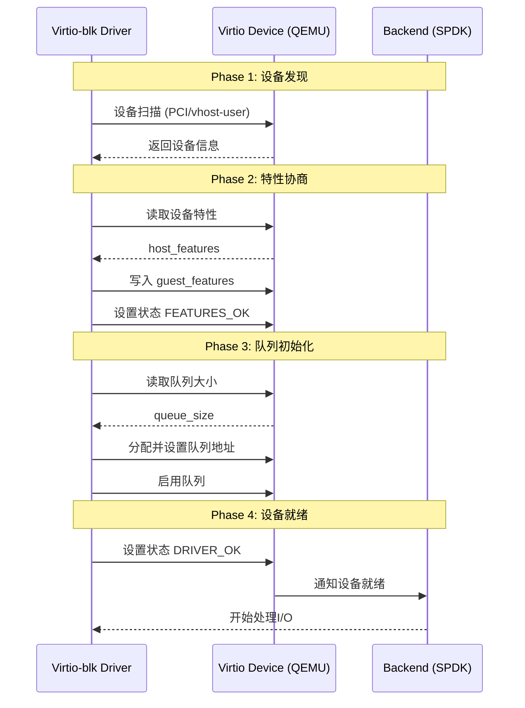
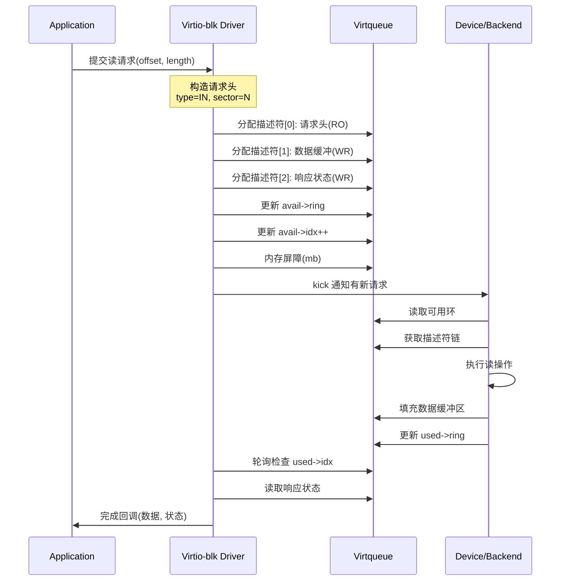
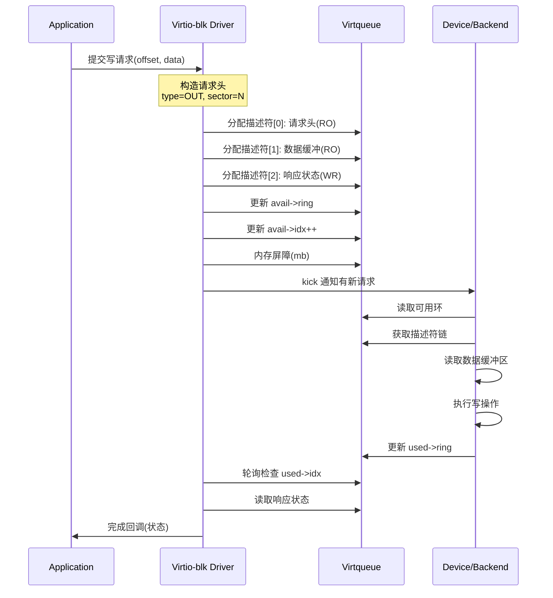
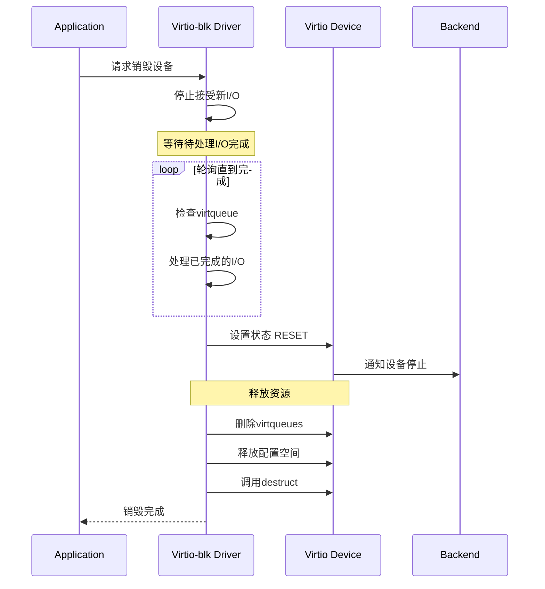

# Virtio-blk 协议时序流程

## 1. 协议概述

Virtio-blk 是 VirtIO 规范中定义的块设备协议，用于虚拟机与宿主机之间的高性能块设备通信。它通过 virtqueue（虚拟队列）实现请求和响应的传递，支持多种传输后端：

- **PCI传输**：标准虚拟化场景，通过虚拟PCI设备呈现
- **vhost-user传输**：同一主机上的高性能通信，直接通过Unix socket连接
- **vfio-user传输**：支持用户态设备框架的传输方式

## 2. 架构层次

```
┌─────────────────────────────────────────────────────────┐
│                    Application Layer                      │
│                   (Block I/O Requests)                    │
├─────────────────────────────────────────────────────────┤
│                    Virtio-blk Layer                       │
│              (Request/Response Processing)                │
├─────────────────────────────────────────────────────────┤
│                    Virtqueue Layer                        │
│           (Descriptor Rings: Available/Used)              │
├─────────────────────────────────────────────────────────┤
│                    Transport Layer                         │
│         (PCI / vhost-user / vfio-user)                    │
├─────────────────────────────────────────────────────────┤
│                    Backend Device                          │
│               (SPDK vhost / QEMU)                         │
└─────────────────────────────────────────────────────────┘
```

## 3. 核心数据结构

### 3.1 Virtio-blk 请求头 (virtio_blk_outhdr)

```c
struct virtio_blk_outhdr {
    __virtio32 type;    // 请求类型: IN/OUT/FLUSH/DISCARD等
    __virtio32 ioprio;  // I/O优先级
    __virtio64 sector;  // 起始扇区号 (512字节单位)
};
```

### 3.2 请求类型定义

| 类型 | 值 | 说明 |
|------|-----|------|
| VIRTIO_BLK_T_IN | 0 | 读请求 |
| VIRTIO_BLK_T_OUT | 1 | 写请求 |
| VIRTIO_BLK_T_FLUSH | 4 | 刷新缓存 |
| VIRTIO_BLK_T_GET_ID | 8 | 获取设备ID |
| VIRTIO_BLK_T_DISCARD | 11 | 丢弃/取消映射 |
| VIRTIO_BLK_T_WRITE_ZEROES | 13 | 写零 |

### 3.3 响应状态

| 状态 | 值 | 说明 |
|------|-----|------|
| VIRTIO_BLK_S_OK | 0 | 成功 |
| VIRTIO_BLK_S_IOERR | 1 | I/O错误 |
| VIRTIO_BLK_S_UNSUPP | 2 | 不支持的操作 |

### 3.4 设备配置 (virtio_blk_config)

```c
struct virtio_blk_config {
    __u64 capacity;           // 容量(512字节扇区数)
    __u32 size_max;           // 最大段大小
    __u32 seg_max;            // 最大段数
    __u32 blk_size;           // 块大小
    __u16 num_queues;         // 队列数(MQ特性)
    // ... 其他拓扑和特性字段
};
```

## 4. Virtqueue 环形结构

### 4.1 描述符表 (Descriptor Table)

```c
struct vring_desc {
    __virtio64 addr;   // 数据缓冲区地址
    __virtio32 len;    // 数据长度
    __virtio16 flags;  // 标志位(NEXT/WRITE/INDIRECT)
    __virtio16 next;   // 下一个描述符索引
};
```

标志位说明：
- **VRING_DESC_F_NEXT (1)**: 链接到下一个描述符
- **VRING_DESC_F_WRITE (2)**: 设备可写(响应数据)
- **VRING_DESC_F_INDIRECT (4)**: 间接描述符表

### 4.2 可用环 (Available Ring)

```c
struct vring_avail {
    __virtio16 flags;    // 标志(NO_INTERRUPT等)
    __virtio16 idx;      // 下一个可用槽位索引
    __virtio16 ring[];   // 描述符链头索引数组
};
```

### 4.3 已用环 (Used Ring)

```c
struct vring_used_elem {
    __virtio32 id;   // 描述符链头索引
    __virtio32 len;  // 写入字节数(对写操作)
};

struct vring_used {
    __virtio16 flags;          // 标志(NO_NOTIFY等)
    __virtio16 idx;            // 下一个已用槽位索引
    struct vring_used_elem ring[];  // 已用元素数组
};
```


## 5. 时序流程图

### 5.1 设备初始化时序



### 5.2 读请求时序



### 5.3 写请求时序



### 5.4 设备关闭时序



## 6. 描述符链结构

### 6.1 读请求描述符链

```
+--------------+    +--------------+    +--------------+
| Descriptor 0 |--->| Descriptor 1 |--->| Descriptor 2 |
|   (请求头)    |    |  (数据缓冲)   |    |  (响应状态)   |
|   READ-ONLY  |    |   WRITEABLE  |    |   WRITEABLE  |
|  16 bytes    |    |   N bytes    |    |   1 byte     |
+--------------+    +--------------+    +--------------+
```

### 6.2 写请求描述符链

```
+--------------+    +--------------+    +--------------+
| Descriptor 0 |--->| Descriptor 1 |--->| Descriptor 2 |
|   (请求头)    |    |  (数据缓冲)   |    |  (响应状态)   |
|   READ-ONLY  |    |   READ-ONLY  |    |   WRITEABLE  |
|  16 bytes    |    |   N bytes    |    |   1 byte     |
+--------------+    +--------------+    +--------------+
```

## 7. 特性位 (Feature Bits)

### 7.1 设备特性

| 特性位 | 值 | 说明 |
|--------|-----|------|
| VIRTIO_BLK_F_SIZE_MAX | 1 | 最大段大小 |
| VIRTIO_BLK_F_SEG_MAX | 2 | 最大段数 |
| VIRTIO_BLK_F_RO | 5 | 只读设备 |
| VIRTIO_BLK_F_BLK_SIZE | 6 | 块大小可用 |
| VIRTIO_BLK_F_MQ | 12 | 支持多队列 |
| VIRTIO_BLK_F_DISCARD | 13 | 支持DISCARD |
| VIRTIO_BLK_F_WRITE_ZEROES | 14 | 支持写零 |

### 7.2 环特性

| 特性位 | 值 | 说明 |
|--------|-----|------|
| VIRTIO_RING_F_INDIRECT_DESC | 28 | 支持间接描述符 |
| VIRTIO_RING_F_EVENT_IDX | 29 | 支持事件索引 |

## 8. 内存屏障与同步

### 8.1 内存屏障使用

- **virtio_wmb()**: 写屏障，确保idx更新可见后再kick
- **virtio_rmb()**: 读屏障，确保正确读取used环
- **virtio_mb()**: 全内存屏障

### 8.2 通知抑制优化

- **VRING_USED_F_NO_NOTIFY**: 设备告诉驱动不需要每次都kick
- **VRING_AVAIL_F_NO_INTERRUPT**: 驱动告诉设备不需要中断
- **VIRTIO_RING_F_EVENT_IDX**: 使用事件索引进行精确通知控制

## 9. SPDK Virtio-blk 实现要点

### 9.1 轮询模式

SPDK使用轮询而非中断模式：
- 避免上下文切换开销
- 绕过QEMU的用户态-内核态切换
- 更低的I/O延迟

### 9.2 请求提交流程

1. `virtqueue_req_start()` - 开始请求
2. `virtqueue_req_add_iovs()` - 添加描述符(请求头、数据、响应)
3. `virtqueue_req_flush()` - 提交请求并通知设备

## 10. 性能优化建议

1. **使用多队列**: 利用VIRTIO_BLK_F_MQ特性实现并行I/O
2. **批量处理**: 合并多个I/O请求后一次性kick
3. **大页内存**: 使用2MB或1GB大页减少TLB miss
4. **事件索引**: 协商VIRTIO_RING_F_EVENT_IDX减少通知开销
5. **间接描述符**: 对于大I/O请求使用间接描述符减少描述符占用

---
