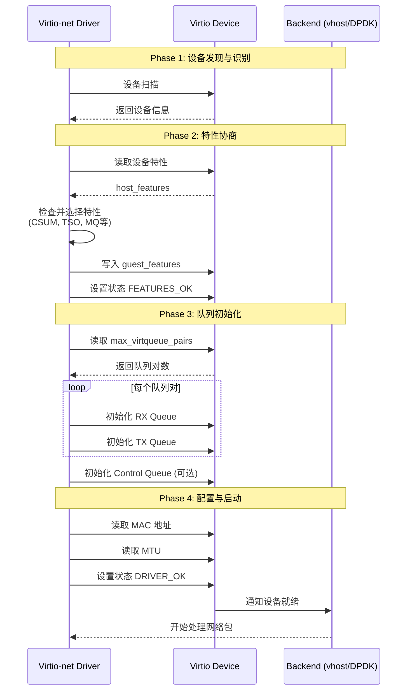
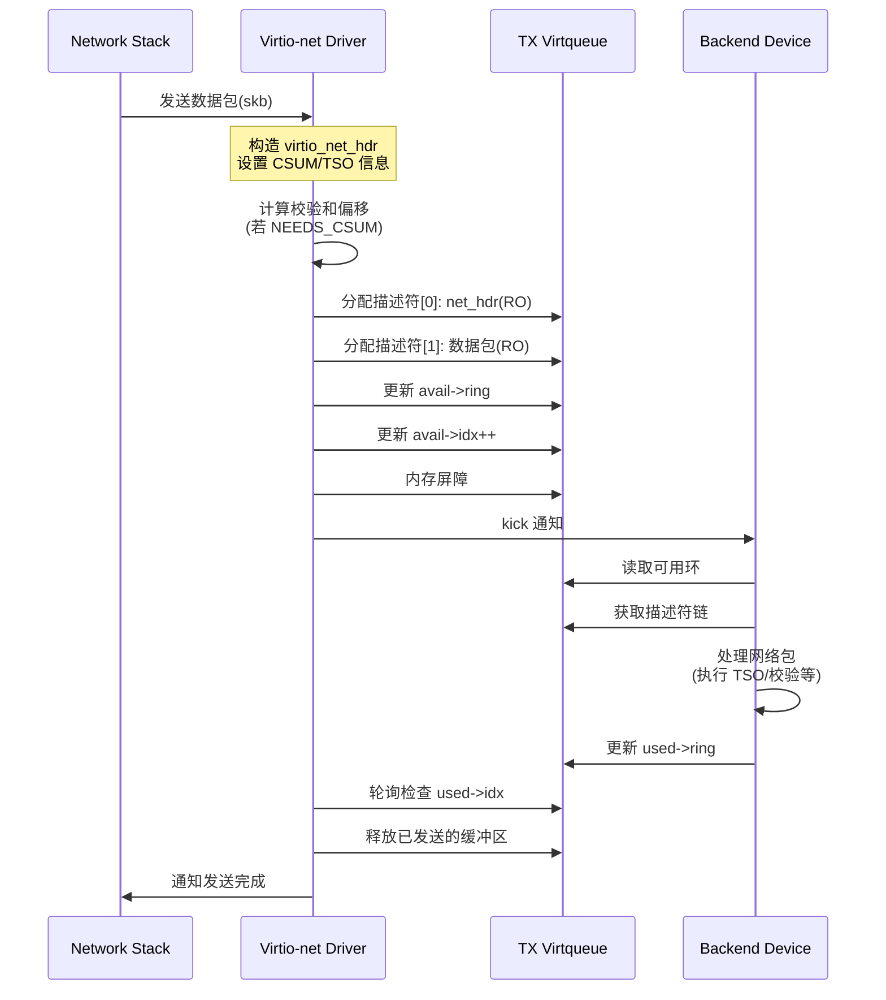
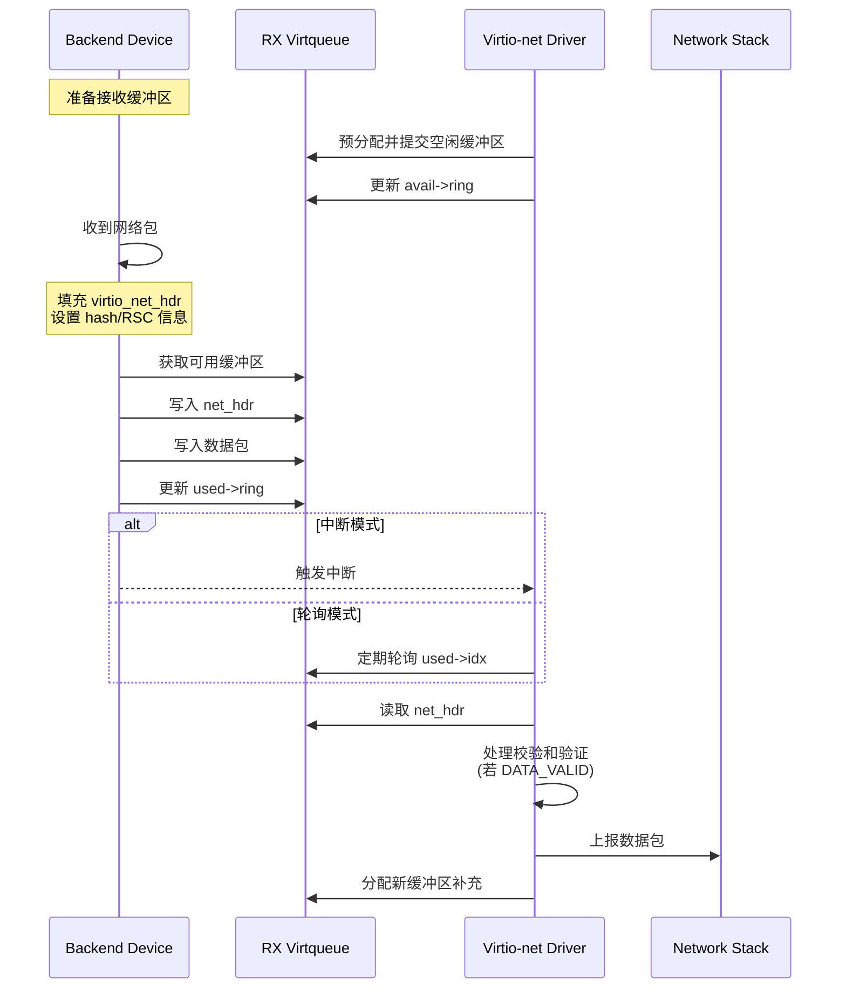
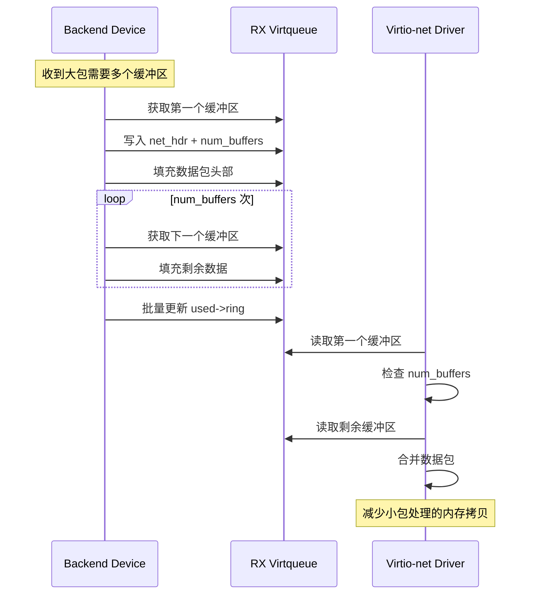
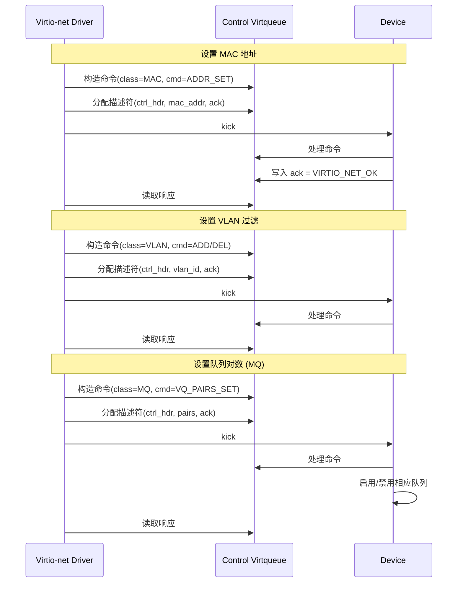
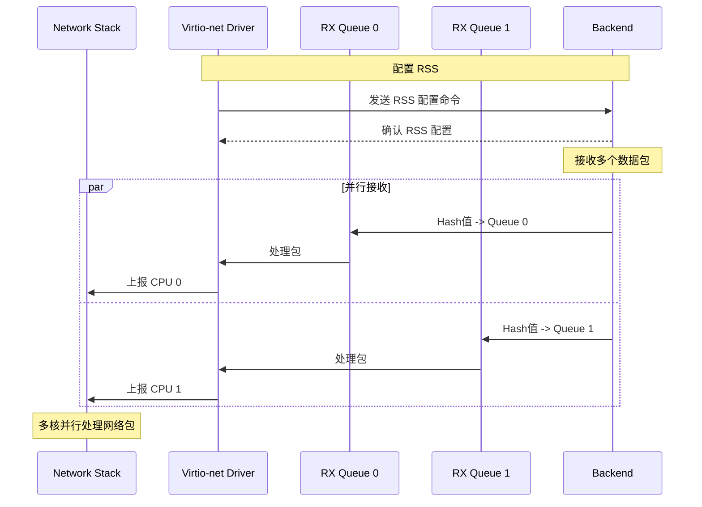

# Virtio-net 协议时序流程

## 1. 协议概述

Virtio-net 是 VirtIO 规范中定义的网络设备协议，用于虚拟机与宿主机之间的高性能网络通信。与 virtio-blk 不同，virtio-net 需要处理双向数据流（发送和接收），因此具有更复杂的队列结构和数据包处理机制。

### 1.1 主要特性

- **双向数据流**: 独立的 TX（发送）和 RX（接收）队列
- **多队列支持**: 支持 MQ 特性实现多队列对，提升并行性能
- **控制队列**: 用于运行时配置（MAC地址、VLAN、RSS等）
- **网络卸载**: 支持 CSUM、TSO、UFO 等硬件卸载特性
- **合并接收缓冲**: MRG_RXBUF 特性减少小包处理的内存开销

### 1.2 传输后端

- **PCI传输**: 标准虚拟化场景
- **vhost-net**: 内核态高性能后端
- **vhost-user**: 用户态高性能后端（如 DPDK、SPDK）
- **vdpa**: vDPA 硬件加速

## 2. 架构层次

```
┌─────────────────────────────────────────────────────────┐
│                    Application Layer                      │
│                  (Network Stack - TCP/IP)                 │
├─────────────────────────────────────────────────────────┤
│                    Virtio-net Layer                       │
│           (Packet TX/RX, Offload Processing)              │
├─────────────────────────────────────────────────────────┤
│                    Virtqueue Layer                        │
│        (TX Queues / RX Queues / Control Queue)            │
├─────────────────────────────────────────────────────────┤
│                    Transport Layer                         │
│         (PCI / vhost-net / vhost-user / vdpa)             │
├─────────────────────────────────────────────────────────┤
│                    Backend Device                          │
│          (vhost-net / DPDK / SmartNIC)                    │
└─────────────────────────────────────────────────────────┘
```

## 3. 核心数据结构

### 3.1 网络配置 (virtio_net_config)

```c
struct virtio_net_config {
    uint8_t mac[ETH_ALEN];           // MAC地址
    __virtio16 status;               // 链路状态
    __virtio16 max_virtqueue_pairs;  // 最大队列对数
    __virtio16 mtu;                  // MTU值
    uint32_t speed;                  // 链路速度 (1Mb单位)
    uint8_t duplex;                  // 双工模式
};
```

### 3.2 数据包头部 (virtio_net_hdr_v1)

```c
struct virtio_net_hdr_v1 {
    uint8_t flags;        // VIRTIO_NET_HDR_F_*
    uint8_t gso_type;     // GSO类型
    __virtio16 hdr_len;   // 头部长度
    __virtio16 gso_size;  // GSO段大小
    __virtio16 csum_start; // 校验和起始位置
    __virtio16 csum_offset; // 校验和偏移
    __virtio16 num_buffers; // 合并缓冲区数量(RX)
};
```

### 3.3 头部标志位

| 标志 | 值 | 说明 |
|------|-----|------|
| VIRTIO_NET_HDR_F_NEEDS_CSUM | 1 | 需要计算校验和 |
| VIRTIO_NET_HDR_F_DATA_VALID | 2 | 校验和已验证 |
| VIRTIO_NET_HDR_F_RSC_INFO | 4 | RSC信息 |

### 3.4 GSO类型

| 类型 | 值 | 说明 |
|------|-----|------|
| VIRTIO_NET_HDR_GSO_NONE | 0 | 非GSO帧 |
| VIRTIO_NET_HDR_GSO_TCPV4 | 1 | IPv4 TCP TSO |
| VIRTIO_NET_HDR_GSO_UDP | 3 | IPv4 UDP UFO |
| VIRTIO_NET_HDR_GSO_TCPV6 | 4 | IPv6 TCP TSO |
| VIRTIO_NET_HDR_GSO_ECN | 0x80 | ECN标志 |

### 3.5 控制命令头部

```c
struct virtio_net_ctrl_hdr {
    uint8_t class;  // 命令类别
    uint8_t cmd;    // 具体命令
};

typedef uint8_t virtio_net_ctrl_ack;
#define VIRTIO_NET_OK     0
#define VIRTIO_NET_ERR    1
```

## 4. Virtqueue 结构

### 4.1 队列布局

```
Virtio-net 队列结构:
┌─────────────────────────────────────────────┐
│              Queue Pair 0                    │
│  ┌─────────────┐    ┌─────────────┐         │
│  │  RX Queue 0 │    │  TX Queue 0 │         │
│  │  (接收队列)  │    │  (发送队列)  │         │
│  └─────────────┘    └─────────────┘         │
├─────────────────────────────────────────────┤
│              Queue Pair 1                    │
│  ┌─────────────┐    ┌─────────────┐         │
│  │  RX Queue 1 │    │  TX Queue 1 │         │
│  └─────────────┘    └─────────────┘         │
├─────────────────────────────────────────────┤
│                  ...                         │
├─────────────────────────────────────────────┤
│              Control Queue                   │
│  ┌─────────────────────────────────────┐    │
│  │      配置命令队列 (可选)              │    │
│  └─────────────────────────────────────┘    │
└─────────────────────────────────────────────┘
```

### 4.2 发送描述符链 (TX)

```
TX 描述符链:
┌──────────────┐    ┌──────────────┐
│ Descriptor 0 │───>│ Descriptor 1 │
│  (net_hdr)   │    │  (数据包)     │
│   READ-ONLY  │    │   READ-ONLY  │
│  10-12 bytes │    │   N bytes    │
└──────────────┘    └──────────────┘
```

### 4.3 接收描述符链 (RX)

```
RX 描述符链:
┌──────────────┐    ┌──────────────┐
│ Descriptor 0 │───>│ Descriptor 1 │
│  (net_hdr)   │    │  (数据缓冲)   │
│  WRITEABLE   │    │  WRITEABLE   │
│  10-12 bytes │    │   N bytes    │
└──────────────┘    └──────────────┘
```

### 4.4 控制队列描述符链

```
Control 描述符链:
┌──────────────┐    ┌──────────────┐    ┌──────────────┐
│ Descriptor 0 │───>│ Descriptor 1 │───>│ Descriptor 2 │
│   (ctrl_hdr) │    │   (cmd_data) │    │   (ack)      │
│   READ-ONLY  │    │   READ-ONLY  │    │  WRITEABLE   │
│   2 bytes    │    │   N bytes    │    │   1 byte     │
└──────────────┘    └──────────────┘    └──────────────┘
```


## 5. 时序流程图

### 5.1 设备初始化时序



### 5.2 数据包发送时序 (TX)



### 5.3 数据包接收时序 (RX)



### 5.4 合并接收缓冲区 (MRG_RXBUF)



### 5.5 控制队列命令时序



### 5.6 多队列 RSS 流量分发




## 6. 特性位 (Feature Bits)

### 6.1 校验和与分段卸载

| 特性位 | 值 | 说明 |
|--------|-----|------|
| VIRTIO_NET_F_CSUM | 0 | 主机处理部分校验和 |
| VIRTIO_NET_F_GUEST_CSUM | 1 | Guest处理部分校验和 |
| VIRTIO_NET_F_GUEST_TSO4 | 7 | Guest支持IPv4 TSO |
| VIRTIO_NET_F_GUEST_TSO6 | 8 | Guest支持IPv6 TSO |
| VIRTIO_NET_F_GUEST_UFO | 10 | Guest支持UFO |
| VIRTIO_NET_F_HOST_TSO4 | 11 | 主机支持IPv4 TSO |
| VIRTIO_NET_F_HOST_TSO6 | 12 | 主机支持IPv6 TSO |
| VIRTIO_NET_F_HOST_UFO | 14 | 主机支持UFO |

### 6.2 队列与缓冲区

| 特性位 | 值 | 说明 |
|--------|-----|------|
| VIRTIO_NET_F_MRG_RXBUF | 15 | 支持合并接收缓冲区 |
| VIRTIO_NET_F_CTRL_VQ | 17 | 控制队列可用 |
| VIRTIO_NET_F_MQ | 22 | 支持多队列 |

### 6.3 控制命令特性

| 特性位 | 值 | 说明 |
|--------|-----|------|
| VIRTIO_NET_F_CTRL_RX | 18 | RX模式控制 |
| VIRTIO_NET_F_CTRL_VLAN | 19 | VLAN过滤控制 |
| VIRTIO_NET_F_CTRL_RX_EXTRA | 20 | 扩展RX模式控制 |
| VIRTIO_NET_F_CTRL_MAC_ADDR | 23 | MAC地址设置 |

### 6.4 高级特性

| 特性位 | 值 | 说明 |
|--------|-----|------|
| VIRTIO_NET_F_MAC | 5 | 设备提供MAC地址 |
| VIRTIO_NET_F_MTU | 3 | 设备提供MTU |
| VIRTIO_NET_F_STATUS | 16 | 链路状态可用 |
| VIRTIO_NET_F_RSS | 60 | 支持RSS |
| VIRTIO_NET_F_HASH_REPORT | 57 | 支持哈希报告 |

## 7. 控制命令详解

### 7.1 RX 模式控制

| 命令 | 值 | 说明 |
|------|-----|------|
| VIRTIO_NET_CTRL_RX_PROMISC | 0 | 混杂模式 |
| VIRTIO_NET_CTRL_RX_ALLMULTI | 1 | 接收所有多播 |
| VIRTIO_NET_CTRL_RX_ALLUNI | 2 | 接收所有单播 |
| VIRTIO_NET_CTRL_RX_NOMULTI | 3 | 禁止多播 |
| VIRTIO_NET_CTRL_RX_NOUNI | 4 | 禁止单播 |
| VIRTIO_NET_CTRL_RX_NOBCAST | 5 | 禁止广播 |

### 7.2 MAC 地址控制

| 命令 | 值 | 说明 |
|------|-----|------|
| VIRTIO_NET_CTRL_MAC_TABLE_SET | 0 | 设置MAC过滤表 |
| VIRTIO_NET_CTRL_MAC_ADDR_SET | 1 | 设置设备MAC地址 |

### 7.3 VLAN 控制

| 命令 | 值 | 说明 |
|------|-----|------|
| VIRTIO_NET_CTRL_VLAN_ADD | 0 | 添加VLAN过滤 |
| VIRTIO_NET_CTRL_VLAN_DEL | 1 | 删除VLAN过滤 |

### 7.4 多队列控制

| 命令 | 值 | 说明 |
|------|-----|------|
| VIRTIO_NET_CTRL_MQ_VQ_PAIRS_SET | 0 | 设置队列对数 |
| VIRTIO_NET_CTRL_MQ_RSS_CONFIG | 1 | 配置RSS |
| VIRTIO_NET_CTRL_MQ_HASH_CONFIG | 2 | 配置哈希报告 |

## 8. 内存屏障与同步

### 8.1 发送路径

```c
// 提交发送请求
tx_desc->addr = packet_addr;
tx_desc->len = packet_len;
vq->vq_ring.avail->idx = vq->vq_avail_idx;

virtio_wmb();  // 确保描述符和idx更新可见

if (vq->vq_ring.used->flags != VRING_USED_F_NO_NOTIFY) {
    notify_queue(vdev, vq);  // kick
}
```

### 8.2 接收路径

```c
// 提交接收缓冲区
rx_desc->addr = buffer_addr;
rx_desc->len = buffer_len;
vq->vq_ring.avail->idx = vq->vq_avail_idx;

virtio_wmb();

// 处理已接收的包
virtio_rmb();  // 确保正确读取used环
for (i = 0; i < vq->vq_ring.used->idx - last_used; i++) {
    process_rx_packet(vq->vq_ring.used->ring[i]);
}
```

### 8.3 通知优化

- **VRING_USED_F_NO_NOTIFY**: 后端告诉驱动不需要每次都kick
- **VRING_AVAIL_F_NO_INTERRUPT**: 驱动告诉后端不需要中断
- **VIRTIO_RING_F_EVENT_IDX**: 使用事件索引精确控制通知

## 9. 性能优化建议

### 9.1 多队列优化

1. **队列数匹配CPU数**: 每个CPU核心绑定一个队列对
2. **RSS流量分发**: 根据四元组哈希分配到不同队列
3. **CPU亲和性**: 绑定中断和NAPI到对应CPU

### 9.2 网络卸载优化

1. **启用 TSO**: 减少大包的分段开销
2. **启用 CSUM**: 硬件计算校验和
3. **启用 MRG_RXBUF**: 减少小包内存开销

### 9.3 内存优化

1. **大页内存**: 使用2MB/1GB大页减少TLB miss
2. **批量分配**: 预分配接收缓冲区池
3. **零拷贝**: 避免数据包内存拷贝

### 9.4 通知优化

1. **批处理**: 累积多个包后一次kick
2. **事件索引**: 使用EVENT_IDX减少通知
3. **忙轮询**: 高吞吐场景禁用中断

## 10. 与 Virtio-blk 对比

| 特性 | Virtio-blk | Virtio-net |
|------|------------|------------|
| 数据方向 | 单向请求/响应 | 双向独立流 |
| 队列类型 | 单类型队列 | TX/RX队列对 + 控制队列 |
| 请求头部 | 固定16字节 | 可变10-12字节 + 扩展 |
| 响应状态 | 1字节状态 | 无显式响应(TX) / 头部标志(RX) |
| 合并缓冲 | 不支持 | MRG_RXBUF支持 |
| 控制命令 | 无 | 丰富的控制队列 |
| 性能关键 | 队列深度 | 包率、延迟、CPU开销 |

---
