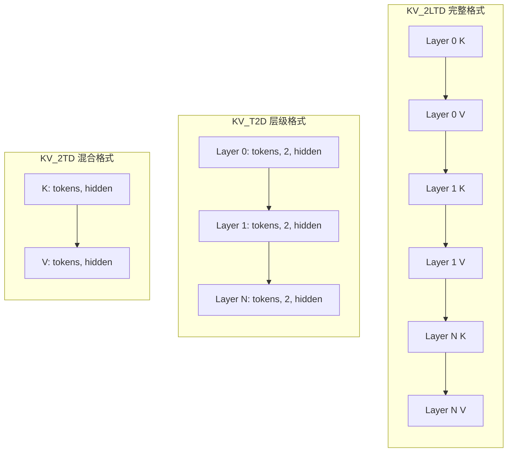
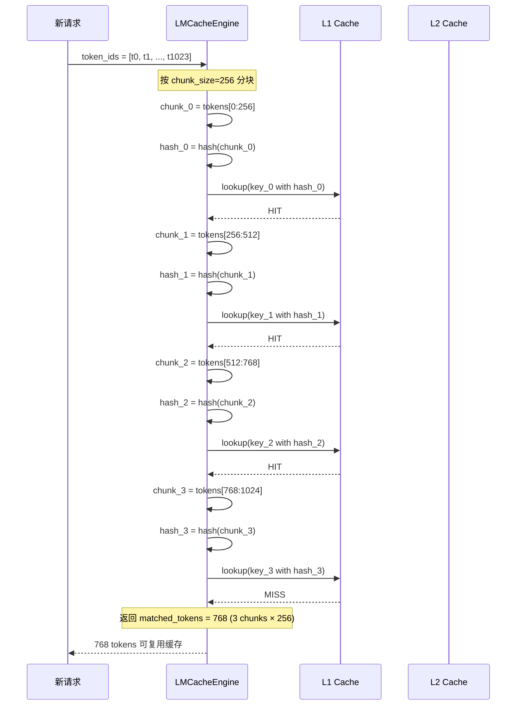
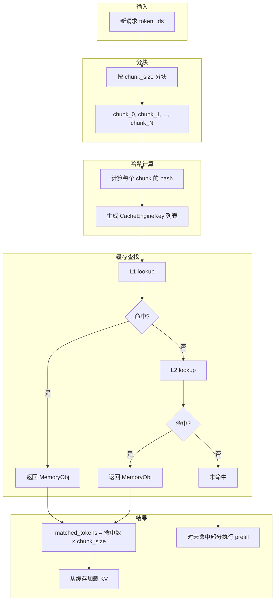
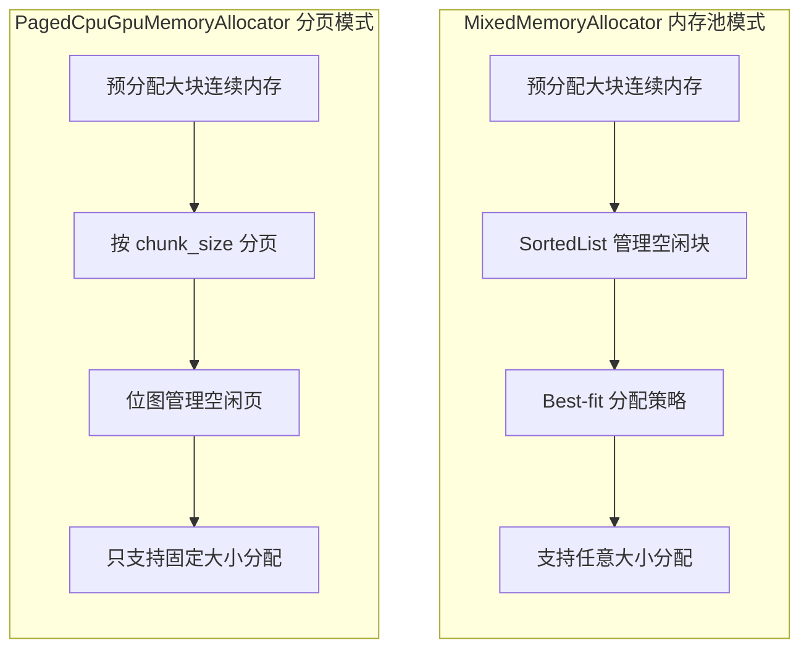
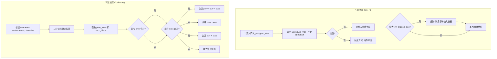

# LMCache KV Cache 内存布局和cache查找

## 一、部署架构

### 1. LMCache 不需要专门机器

LMCache **不是一个独立服务**，而是**嵌入在推理进程中的缓存库**。

### 2. 部署模式

#### 本地模式 (无需额外机器)

```
推理节点:
┌─────────────────────────────────────┐
│  vLLM 进程                          │
│  ├── Scheduler                      │
│  ├── Workers                        │
│  └── LMCache (嵌入式)               │
│      ├── L1: 本地 CPU 内存          │
│      └── L2: 本地磁盘 (可选)        │
└─────────────────────────────────────┘
```

配置示例：
```yaml
# 只用本地 CPU 内存
max_local_cpu_size: 10  # GB
```

#### 共享缓存模式 (复用现有基础设施)

```
推理节点 1                 推理节点 2                 推理节点 N
┌──────────────┐         ┌──────────────┐         ┌──────────────┐
│ vLLM + LMCache│         │ vLLM + LMCache│         │ vLLM + LMCache│
│ L1: CPU 内存  │         │ L1: CPU 内存  │         │ L1: CPU 内存  │
└──────┬───────┘         └──────┬───────┘         └──────┬───────┘
       │                        │                        │
       └────────────────────────┼────────────────────────┘
                                │
                                ▼
                    ┌──────────────────────┐
                    │  Redis / S3 / NFS    │  ← 共享存储 (已有基础设施)
                    │  (L2 远程缓存)        │
                    └──────────────────────┘
```

### 3. 部署模式总结

| 模式 | 需要额外机器 | 说明 |
|------|-------------|------|
| **本地模式** | 否 | L1 用推理节点自己的 CPU 内存 |
| **磁盘缓存** | 否 | L2 用推理节点的本地磁盘 |
| **共享缓存** | 视情况 | 复用现有的 Redis/S3/NFS |
| **P2P 传输** | 否 | 节点间直接传输，无需中心节点 |

---

## 二、KV 张量内存布局

### 1. 三种布局格式

#### KV_2LTD (完整格式)

```
Shape: [2, num_layers, num_tokens, hidden_dim]

维度说明:
  2:          K 和 V
  num_layers: 模型层数 (如 Llama-70B 有 80 层)
  num_tokens: token 数量 (chunk_size，如 256)
  hidden_dim: 隐藏维度 (num_heads × head_dim)

内存排列:
┌─────────────────────────────────────────────────────────────┐
│ Layer 0 K │ Layer 0 V │ Layer 1 K │ Layer 1 V │ ... │ Layer N V │
└─────────────────────────────────────────────────────────────┘
```

#### KV_T2D (层级格式)

```
Shape: [num_tokens, 2, hidden_dim]

内存排列 (按层存储):
┌─────────────────────────────────┐
│ Layer 0: [tokens, 2, hidden]    │
├─────────────────────────────────┤
│ Layer 1: [tokens, 2, hidden]    │
├─────────────────────────────────┤
│ ...                              │
├─────────────────────────────────┤
│ Layer N: [tokens, 2, hidden]    │
└─────────────────────────────────┘
```

#### KV_2TD (混合格式)

```
Shape: [2, num_tokens, hidden_dim]

内存排列:
┌─────────────────────────────────┐
│ K: [tokens, hidden]              │
├─────────────────────────────────┤
│ V: [tokens, hidden]              │
└─────────────────────────────────┘
```

### 2. 布局对比



### 3. 使用场景

| 布局 | 场景 | 优点 | 缺点 |
|------|------|------|------|
| **KV_2LTD** | 非层级模式 | 一次存储所有层，简单 | 内存碎片大，淘汰粒度粗 |
| **KV_T2D** | 层级模式 | 按层淘汰，灵活 | 需要多次存储 |
| **KV_2TD** | 层级+混合 | K/V 分离，适合融合 | 需要额外处理 |

### 4. 内存计算示例

```
模型: Llama-70B
  num_layers = 80
  num_heads = 64
  head_dim = 128
  hidden_dim = 64 × 128 = 8192

chunk_size = 256 tokens
dtype = FP16 (2 bytes)

KV_2LTD 单个 chunk:
  2 × 80 × 256 × 8192 × 2 = 671,088,640 bytes ≈ 640 MB

KV_T2D 单个 chunk (单层):
  256 × 2 × 8192 × 2 = 8,388,608 bytes ≈ 8 MB

KV_T2D 所有层:
  80 × 8 MB = 640 MB (总量相同，但可按层分配/淘汰)
```

---

## 三、KV Cache 查找机制

### 1. 核心思想

**用 token 序列的前缀哈希作为缓存键**。

### 2. Chunk 划分

```
请求的 token 序列:
[t0, t1, t2, ..., t255, t256, t257, ..., t511, t512, ...]
 └──── chunk 0 ────┘  └──── chunk 1 ────┘  └──── chunk 2 ──┘

chunk_size = 256 (可配置)
```

### 3. CacheEngineKey 生成

```python
def generate_key(model_name, worker_id, token_chunk, dtype):
    # 计算 chunk_hash: 对 token 序列计算哈希
    chunk_hash = hash_tokens(token_chunk)
    
    return CacheEngineKey(
        model_name=model_name,
        world_size=world_size,
        worker_id=worker_id,
        chunk_hash=chunk_hash,    # 关键：token 序列的哈希
        dtype=dtype,
    )
```

### 4. 前缀匹配查找流程



### 5. 具体例子

```
请求 A: "请介绍一下中国的首都北京的历史"
tokens: [1024, 3567, 2341, 892, 5678, 1234, 567, 890, ...]

请求 B: "请介绍一下中国的首都上海的特色"
tokens: [1024, 3567, 2341, 892, 5678, 9999, 777, 666, ...]
        └────────── 相同的前缀 ──────────┘

两个请求的 chunk_0 hash 相同:
  hash([1024, 3567, 2341, 892, ...]) = 0xABC123

请求 A 首次处理:
  1. 计算 chunk_0 hash → 0xABC123
  2. 缓存未命中，执行 prefill
  3. 将 KV cache 存入 L1: key = (model, worker, 0xABC123)

请求 B 处理:
  1. 计算 chunk_0 hash → 0xABC123
  2. 缓存命中！直接加载 KV，跳过 prefill
  3. 后续 token 重新计算
```

### 6. 完整查找流程图



### 7. 设计优势

| 设计选择 | 原因 |
|---------|------|
| **用 token hash 作为 key** | 相同 token 序列 → 相同 hash → 可复用 |
| **按 chunk 分块** | 细粒度缓存，最大化复用率 |
| **前缀匹配** | LLM 推理的特点：相同 prompt 前缀很常见 |
| **独立于上下文** | KV cache 只和 token 序列相关，不关心"语义" |

---

## 四、内存管理模式

LMCache 使用**内存池 + 可选的分页**两种模式。

### 1. 默认模式：内存池 (MixedMemoryAllocator)

```python
class MixedMemoryAllocator(MemoryAllocatorInterface):
    """
    预分配一大块连续内存，按需从中分配
    """
    def __init__(self, total_size, numa_mapping=None):
        # 预分配 pinned memory
        self.buffer = torch.empty(total_size, dtype=torch.uint8)

        # 使用 SortedList 管理空闲块
        self.free_blocks = SortedList()  # 按大小排序的空闲块列表
```

### 2. P2P 模式：分页管理 (PagedCpuGpuMemoryAllocator)

```python
class PagedCpuGpuMemoryAllocator(MemoryAllocatorInterface):
    """
    按 chunk 大小分页管理，用于 P2P 传输场景
    """
    def init_cpu_memory_allocator(self, total_size, shapes, dtypes, fmt):
        # 计算单个 chunk 的大小
        chunk_size_bytes = get_size_bytes(shapes, dtypes)

        # 按 chunk 分页
        self.num_chunks = total_size // chunk_size_bytes
        self.chunk_size = chunk_size_bytes
```

### 3. 两种模式对比



### 4. 具体实现细节

#### 内存池模式

```
预分配内存 (例如 10GB):
┌──────────────────────────────────────────────────────────────────┐
│                        10GB pinned memory                        │
└──────────────────────────────────────────────────────────────────┘

初始状态:
  free_blocks = [(0, 10GB)]  # 一个大空闲块

分配 640MB 后:
  free_blocks = [(640MB, 9.36GB)]

再分配 8MB 后:
  free_blocks = [(648MB, 9.352GB)]

释放 640MB 后:
  free_blocks = [(0, 640MB), (648MB, 9.352GB)]  # 可能合并
```

#### 分页模式

```
预分配内存 (例如 10GB), chunk_size = 640MB:
┌───────┬───────┬───────┬───────┬───────┬───────┬───────┬───────┬───┐
│Page 0 │Page 1 │Page 2 │Page 3 │Page 4 │Page 5 │Page 6 │Page 7 │...│
│640MB  │640MB  │640MB  │640MB  │640MB  │640MB  │640MB  │640MB  │   │
└───────┴───────┴───────┴───────┴───────┴───────┴───────┴───────┴───┘

bitmap = [0, 0, 0, 0, 0, 0, 0, 0, ...]  # 0=空闲, 1=已用

分配 Page 2 后:
  bitmap = [0, 0, 1, 0, 0, 0, 0, 0, ...]
```

### 5. 模式选择

```python
# local_cpu_backend.py
def initialize_allocator(self, config, metadata):
    if config.enable_p2p:
        # P2P 模式：使用分页分配器
        return PagedCpuGpuMemoryAllocator()
    else:
        # 默认模式：使用内存池
        return MixedMemoryAllocator(cpu_size_bytes, numa_mapping=numa_mapping)
```

### 6. 总结对比

| 模式 | 管理方式 | 适用场景 | 优点 | 缺点 |
|------|---------|---------|------|------|
| **内存池** | SortedList + First-Fit | 默认模式 | 灵活，支持任意大小 | 有碎片问题 |
| **分页** | Bitmap + 固定大小 | P2P 传输 | 无碎片，O(1) 分配 | 只支持固定大小 |

### 7. 内存池分配策略 (First-Fit)

```python
class AddressManager:
    ALIGN_BYTES = 4096  # 4KB 对齐

    def __init__(self, size: int, align_bytes: int = ALIGN_BYTES):
        # 使用 SortedList 管理空闲块，按起始地址排序
        self._explicit_list: SortedList[FreeBlock] = SortedList(key=lambda x: x.start)
        self._explicit_list.add(FreeBlock(start=0, size=size))
        self._lock = threading.Lock()

    def allocate(self, size: int) -> tuple[int, int]:
        aligned_size = self.compute_aligned_size(size)

        # First-Fit: 找到第一个足够大的空闲块
        for block in self._explicit_list:
            if block.size >= aligned_size:
                break
        else:
            raise RuntimeError("No memory available")

        self._explicit_list.remove(block)

        # 如果块比需要的大，分割剩余部分
        if block.size > aligned_size:
            self._explicit_list.add(
                FreeBlock(start=block.start + aligned_size,
                         size=block.size - aligned_size)
            )

        return block.start, aligned_size
```

### 8. 内存池释放策略 (Coalescing)

```python
def free(self, address: int, size: int):
    new_free_block = FreeBlock(start=address, size=size)

    # 二分查找确定位置
    index = self._explicit_list.bisect_left(new_free_block)
    prev_block = self._explicit_list[index - 1] if index > 0 else None
    succ_block = self._explicit_list[index] if index < len(self._explicit_list) else None

    # 尝试合并相邻块
    coalesced = self._coalesce(new_free_block, prev_block, succ_block)
    if not coalesced:
        self._explicit_list.add(new_free_block)
```

### 9. 合并逻辑

```python
@dataclass
class FreeBlock:
    start: int
    size: int

    def can_be_coalesced(self, succ: "FreeBlock") -> bool:
        # 相邻条件: 前一个块的末尾 == 后一个块的起始
        return self.start + self.size == succ.start

def _coalesce(self, curr_block, prev_block, succ_block):
    merge_prev = prev_block and prev_block.can_be_coalesced(curr_block)
    merge_succ = succ_block and curr_block.can_be_coalesced(succ_block)

    if merge_prev and merge_succ:
        # 同时合并前后: [prev][curr][succ] -> [一个大块]
        prev_block.size += curr_block.size + succ_block.size
        self._explicit_list.remove(succ_block)
    elif merge_prev:
        # 只合并前: [prev][curr] -> [prev]
        prev_block.size += curr_block.size
    elif merge_succ:
        # 只合并后: [curr][succ] -> [succ]
        succ_block.start -= curr_block.size
        succ_block.size += curr_block.size
```

### 10. 分配释放流程图



### 11. 示例演示

```
初始状态 (10GB 内存池):
  free_blocks = [(0, 10GB)]

分配 640MB:
  1. aligned_size = 640MB (已对齐)
  2. 找到 (0, 10GB)
  3. 分割: 保留 (640MB, 9.36GB)
  free_blocks = [(640MB, 9.36GB)]

分配 8MB:
  1. aligned_size = 8MB (已对齐)
  2. 找到 (640MB, 9.36GB)
  3. 分割: 保留 (648MB, 9.352GB)
  free_blocks = [(648MB, 9.352GB)]

释放 640MB (address=0):
  1. 创建 FreeBlock(0, 640MB)
  2. prev=None, succ=(648MB, 9.352GB)
  3. 不能合并 (succ.start=648MB != 0+640MB)
  4. 独立加入链表
  free_blocks = [(0, 640MB), (648MB, 9.352GB)]

释放 8MB (address=640MB):
  1. 创建 FreeBlock(640MB, 8MB)
  2. prev=(0, 640MB), succ=(648MB, 9.352GB)
  3. prev.start + prev.size = 0 + 640MB = 640MB = curr.start -> 可合并
  4. curr.start + curr.size = 640MB + 8MB = 648MB = succ.start -> 可合并
  5. 三块合并成一块
  free_blocks = [(0, 10GB)]  # 回到初始状态
```

---

## 五、总结

| 主题 | 核心要点 |
|------|---------|
| **部署架构** | 嵌入式库，无需专门机器，复用现有基础设施 |
| **内存布局** | KV_2LTD/KV_T2D/KV_2TD 三种格式，适应不同场景 |
| **查找机制** | token 序列 → 分块 → 计算哈希 → 作为缓存键查找 |
| **内存管理** | 默认内存池模式，P2P 场景使用分页模式 |
