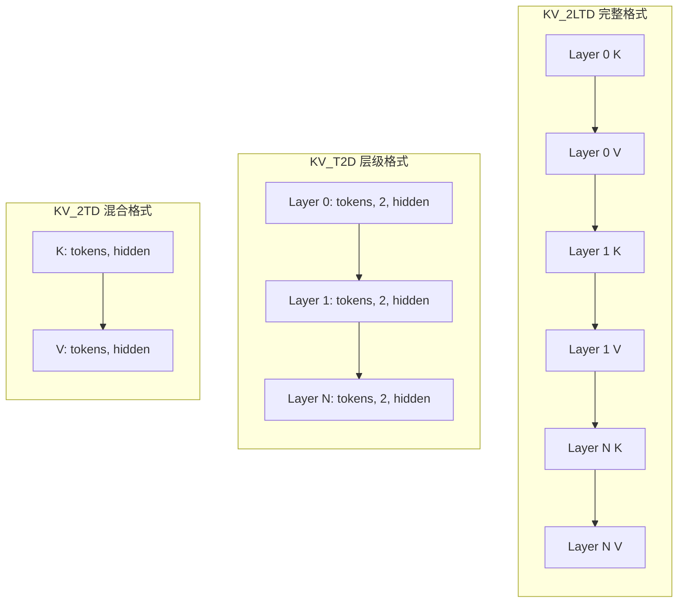
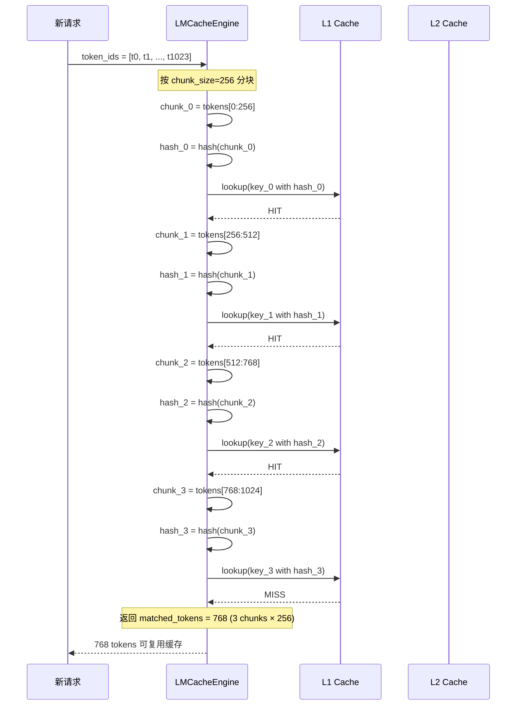
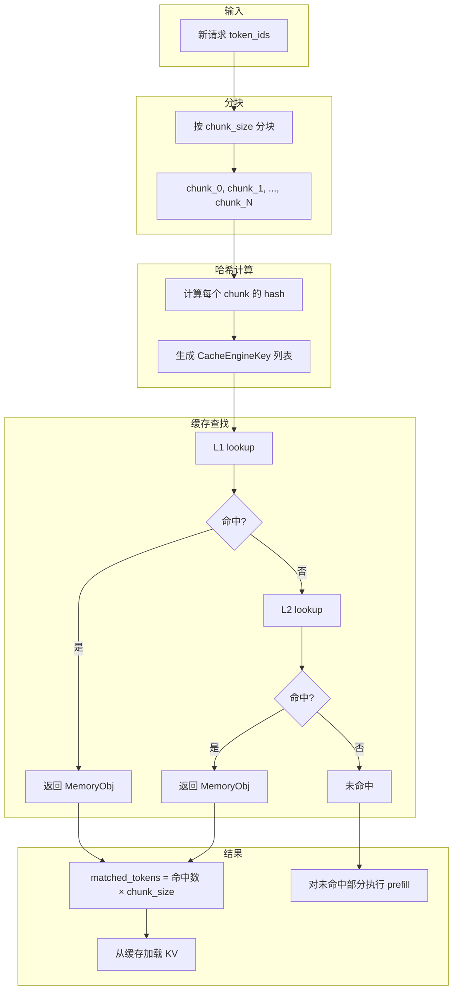

# LMCache KV Cache 内存布局和cache查找

## 一、部署架构

### 1. LMCache 不需要专门机器

LMCache **不是一个独立服务**，而是**嵌入在推理进程中的缓存库**。

### 2. 部署模式

#### 本地模式 (无需额外机器)

```
推理节点:
┌─────────────────────────────────────┐
│  vLLM 进程                          │
│  ├── Scheduler                      │
│  ├── Workers                        │
│  └── LMCache (嵌入式)               │
│      ├── L1: 本地 CPU 内存          │
│      └── L2: 本地磁盘 (可选)        │
└─────────────────────────────────────┘
```

配置示例：
```yaml
# 只用本地 CPU 内存
max_local_cpu_size: 10  # GB
```

#### 共享缓存模式 (复用现有基础设施)

```
推理节点 1                 推理节点 2                 推理节点 N
┌──────────────┐         ┌──────────────┐         ┌──────────────┐
│ vLLM + LMCache│         │ vLLM + LMCache│         │ vLLM + LMCache│
│ L1: CPU 内存  │         │ L1: CPU 内存  │         │ L1: CPU 内存  │
└──────┬───────┘         └──────┬───────┘         └──────┬───────┘
       │                        │                        │
       └────────────────────────┼────────────────────────┘
                                │
                                ▼
                    ┌──────────────────────┐
                    │  Redis / S3 / NFS    │  ← 共享存储 (已有基础设施)
                    │  (L2 远程缓存)        │
                    └──────────────────────┘
```

### 3. 部署模式总结

| 模式 | 需要额外机器 | 说明 |
|------|-------------|------|
| **本地模式** | 否 | L1 用推理节点自己的 CPU 内存 |
| **磁盘缓存** | 否 | L2 用推理节点的本地磁盘 |
| **共享缓存** | 视情况 | 复用现有的 Redis/S3/NFS |
| **P2P 传输** | 否 | 节点间直接传输，无需中心节点 |

---

## 二、KV 张量内存布局

### 1. 三种布局格式

#### KV_2LTD (完整格式)

```
Shape: [2, num_layers, num_tokens, hidden_dim]

维度说明:
  2:          K 和 V
  num_layers: 模型层数 (如 Llama-70B 有 80 层)
  num_tokens: token 数量 (chunk_size，如 256)
  hidden_dim: 隐藏维度 (num_heads × head_dim)

内存排列:
┌─────────────────────────────────────────────────────────────┐
│ Layer 0 K │ Layer 0 V │ Layer 1 K │ Layer 1 V │ ... │ Layer N V │
└─────────────────────────────────────────────────────────────┘
```

#### KV_T2D (层级格式)

```
Shape: [num_tokens, 2, hidden_dim]

内存排列 (按层存储):
┌─────────────────────────────────┐
│ Layer 0: [tokens, 2, hidden]    │
├─────────────────────────────────┤
│ Layer 1: [tokens, 2, hidden]    │
├─────────────────────────────────┤
│ ...                              │
├─────────────────────────────────┤
│ Layer N: [tokens, 2, hidden]    │
└─────────────────────────────────┘
```

#### KV_2TD (混合格式)

```
Shape: [2, num_tokens, hidden_dim]

内存排列:
┌─────────────────────────────────┐
│ K: [tokens, hidden]              │
├─────────────────────────────────┤
│ V: [tokens, hidden]              │
└─────────────────────────────────┘
```

### 2. 布局对比



### 3. 使用场景

| 布局 | 场景 | 优点 | 缺点 |
|------|------|------|------|
| **KV_2LTD** | 非层级模式 | 一次存储所有层，简单 | 内存碎片大，淘汰粒度粗 |
| **KV_T2D** | 层级模式 | 按层淘汰，灵活 | 需要多次存储 |
| **KV_2TD** | 层级+混合 | K/V 分离，适合融合 | 需要额外处理 |

### 4. 内存计算示例

```
模型: Llama-70B
  num_layers = 80
  num_heads = 64
  head_dim = 128
  hidden_dim = 64 × 128 = 8192

chunk_size = 256 tokens
dtype = FP16 (2 bytes)

KV_2LTD 单个 chunk:
  2 × 80 × 256 × 8192 × 2 = 671,088,640 bytes ≈ 640 MB

KV_T2D 单个 chunk (单层):
  256 × 2 × 8192 × 2 = 8,388,608 bytes ≈ 8 MB

KV_T2D 所有层:
  80 × 8 MB = 640 MB (总量相同，但可按层分配/淘汰)
```

---

## 三、KV Cache 查找机制

### 1. 核心思想

**用 token 序列的前缀哈希作为缓存键**。

### 2. Chunk 划分

```
请求的 token 序列:
[t0, t1, t2, ..., t255, t256, t257, ..., t511, t512, ...]
 └──── chunk 0 ────┘  └──── chunk 1 ────┘  └──── chunk 2 ──┘

chunk_size = 256 (可配置)
```

### 3. CacheEngineKey 生成

```python
def generate_key(model_name, worker_id, token_chunk, dtype):
    # 计算 chunk_hash: 对 token 序列计算哈希
    chunk_hash = hash_tokens(token_chunk)
    
    return CacheEngineKey(
        model_name=model_name,
        world_size=world_size,
        worker_id=worker_id,
        chunk_hash=chunk_hash,    # 关键：token 序列的哈希
        dtype=dtype,
    )
```

### 4. 前缀匹配查找流程



### 5. 具体例子

```
请求 A: "请介绍一下中国的首都北京的历史"
tokens: [1024, 3567, 2341, 892, 5678, 1234, 567, 890, ...]

请求 B: "请介绍一下中国的首都上海的特色"
tokens: [1024, 3567, 2341, 892, 5678, 9999, 777, 666, ...]
        └────────── 相同的前缀 ──────────┘

两个请求的 chunk_0 hash 相同:
  hash([1024, 3567, 2341, 892, ...]) = 0xABC123

请求 A 首次处理:
  1. 计算 chunk_0 hash → 0xABC123
  2. 缓存未命中，执行 prefill
  3. 将 KV cache 存入 L1: key = (model, worker, 0xABC123)

请求 B 处理:
  1. 计算 chunk_0 hash → 0xABC123
  2. 缓存命中！直接加载 KV，跳过 prefill
  3. 后续 token 重新计算
```

### 6. 完整查找流程图



### 7. 设计优势

| 设计选择 | 原因 |
|---------|------|
| **用 token hash 作为 key** | 相同 token 序列 → 相同 hash → 可复用 |
| **按 chunk 分块** | 细粒度缓存，最大化复用率 |
| **前缀匹配** | LLM 推理的特点：相同 prompt 前缀很常见 |
| **独立于上下文** | KV cache 只和 token 序列相关，不关心"语义" |

---

## 四、总结

| 主题 | 核心要点 |
|------|---------|
| **部署架构** | 嵌入式库，无需专门机器，复用现有基础设施 |
| **内存布局** | KV_2LTD/KV_T2D/KV_2TD 三种格式，适应不同场景 |
| **查找机制** | token 序列 → 分块 → 计算哈希 → 作为缓存键查找 |
