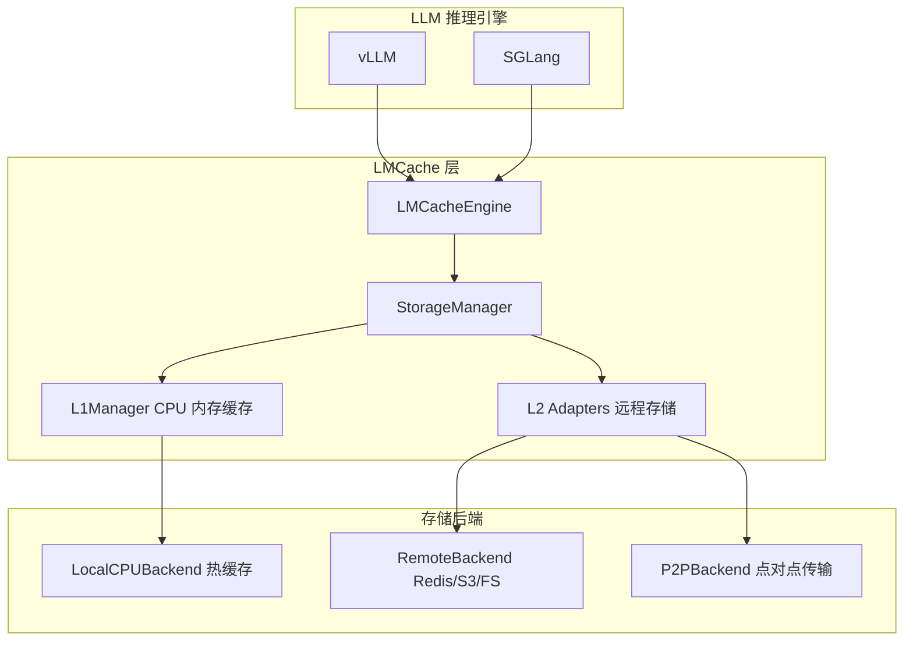
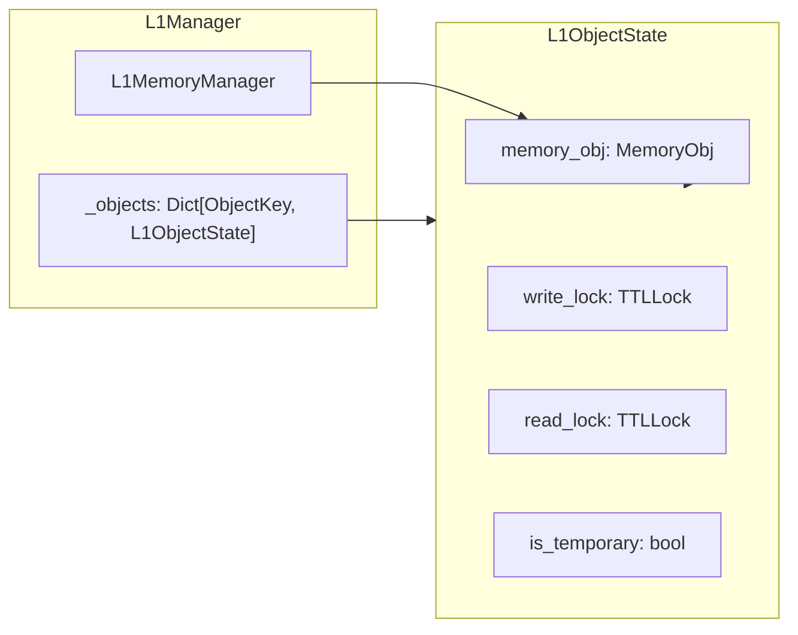
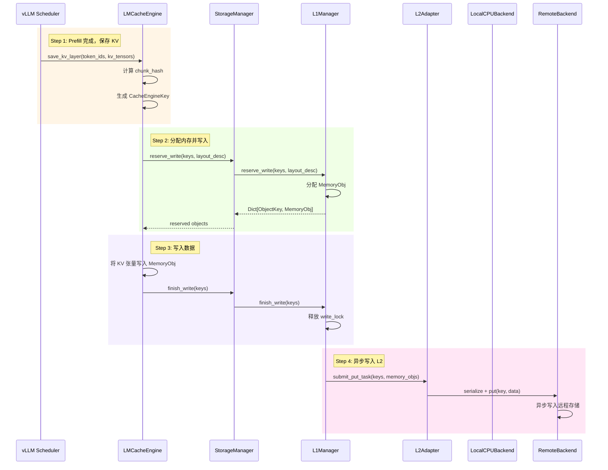
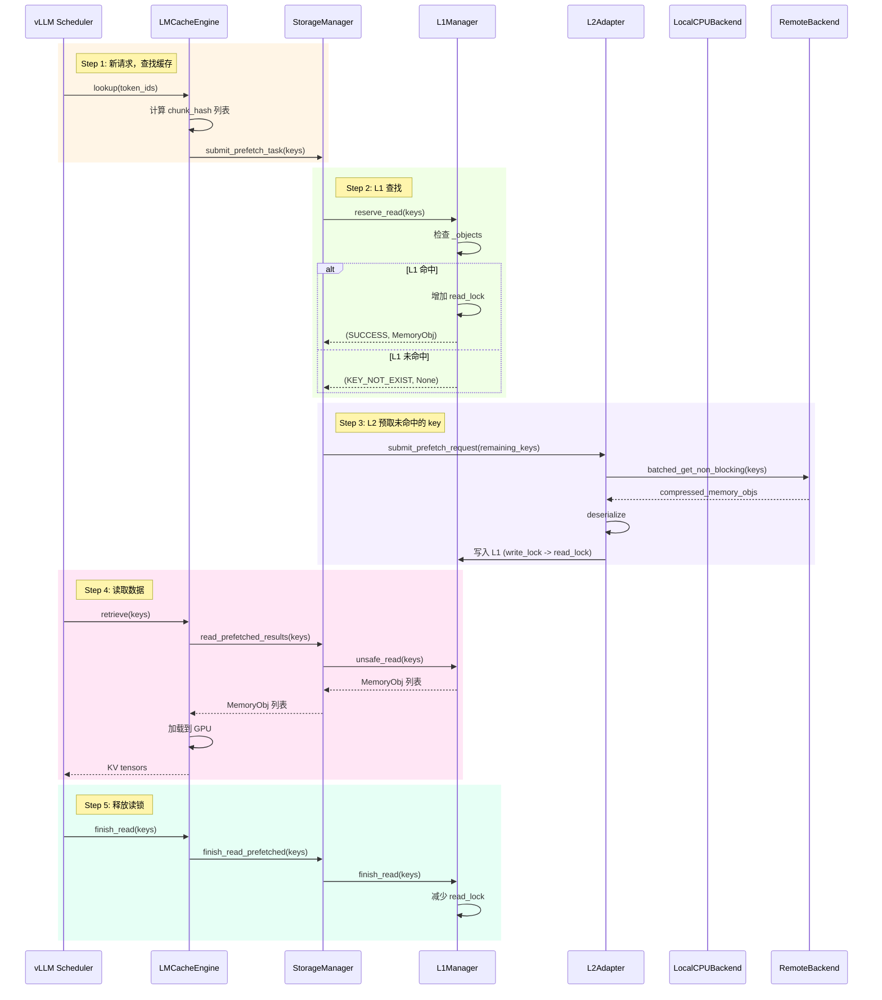
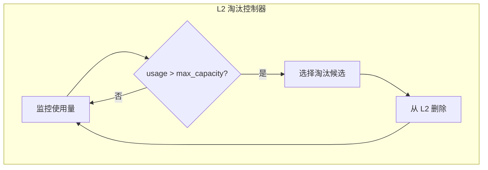
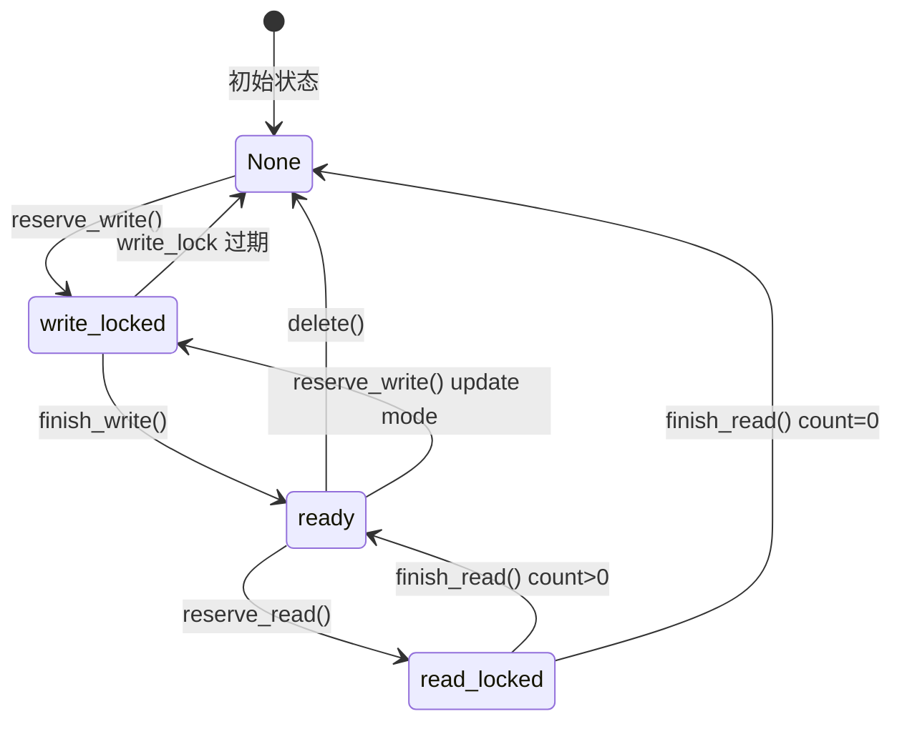
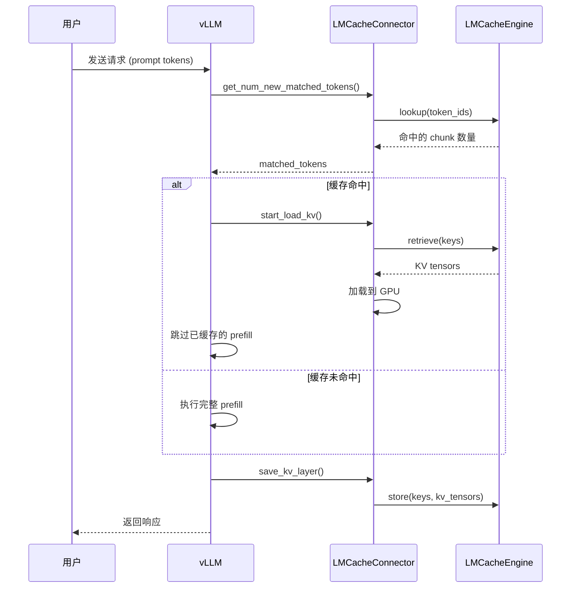

# LMCache KV Cache 存储模型分析

## 一、LMCache 概述

LMCache 是一个 LLM KV Cache 缓存系统，用于加速大语言模型推理。核心功能：
- 缓存已计算的 KV (Key-Value) 张量，避免重复计算
- 支持多级存储 (L1 CPU 内存 / L2 远程存储)
- 与 vLLM、SGLang 等推理框架深度集成

## 二、整体架构



## 三、核心数据结构

### 1. CacheEngineKey

```python
@dataclass(slots=True)
class CacheEngineKey:
    model_name: str       # 模型名称
    world_size: int       # 分布式世界大小
    worker_id: int        # Worker ID
    chunk_hash: int       # Token chunk 的哈希值
    dtype: torch.dtype    # 数据类型
    request_configs: Optional[dict]  # 请求级配置
```

### 2. MemoryObj

```python
class MemoryObj:
    raw_data: Tensor          # 实际数据
    meta: MemoryObjMetadata   # 元数据
    ref_count: int            # 引用计数
    _pinned: bool             # 是否被 pin
```

### 3. MemoryFormat

```
KV_2LTD: [2, num_layers, num_tokens, hidden_dim]  # 完整 KV
KV_T2D:  [num_tokens, 2, hidden_dim]              # 层级 KV
KV_2TD:  [2, num_tokens, hidden_dim]              # 混合格式
```

## 四、存储层次结构

### 1. L1 缓存 (CPU 内存)



### 2. L2 存储 (远程后端)

| 后端 | 说明 |
|------|------|
| RemoteBackend | Redis / S3 / 文件系统 |
| P2PBackend | 节点间直接传输 |
| PDBackend | Prefill-Decode 分离 |
| GDSBackend | GPU Direct Storage |

## 五、写入流程时序图



## 六、读取流程时序图



## 七、淘汰策略

### 1. L1 淘汰

```python
class LRUCachePolicy:
    def get_evict_candidates(self, cache_dict, num_candidates=1):
        evict_keys = []
        for key, cache in cache_dict.items():
            if not cache.can_evict:  # 检查 ref_count 和 pin 状态
                continue
            evict_keys.append(key)
            if len(evict_keys) == num_candidates:
                break
        return evict_keys
```

### 2. L2 淘汰



## 八、状态机模型

### L1 对象状态转换



## 九、与 vLLM 集成

### vLLM V1 Adapter

```python
class LMCacheConnectorV1Impl(KVConnectorBase_V1):
    def start_load_kv(self, forward_context):
        """开始加载 KV 缓存"""
        
    def wait_for_layer_load(self, layer_name):
        """等待特定层加载完成"""
        
    def save_kv_layer(self, layer_name, kv_tuple):
        """保存 KV 层到缓存"""
        
    def get_num_new_matched_tokens(self, request):
        """返回匹配的 token 数量"""
```

### 请求处理流程



## 十、关键配置

| 配置项 | 说明 | 默认值 |
|--------|------|--------|
| max_local_cpu_size | L1 CPU 内存大小 (GB) | - |
| chunk_size | KV chunk 的 token 数 | 256 |
| cache_policy | 淘汰策略 | LRU |
| remote_url | 远程存储 URL | None |
| remote_serde | 序列化方式 | naive |
| enable_p2p | 启用 P2P 传输 | False |
| write_ttl_seconds | 写锁 TTL | 30 |
| read_ttl_seconds | 读锁 TTL | 30 |

## 十一、性能优化

### 1. 批量操作

```python
# 批量分配
def batched_allocate(shapes, dtypes, batch_size):
    memory_objs = allocator.batched_allocate(shapes, dtypes, batch_size)
    # 如果内存不足，触发淘汰
    while memory_objs is None:
        evict_keys = policy.get_evict_candidates(hot_cache)
        batched_remove(evict_keys)
        memory_objs = allocator.batched_allocate(...)
    return memory_objs
```

### 2. 异步写入

```python
# L2 写入异步执行，不阻塞推理
def submit_put_task(key, memory_obj):
    memory_obj.ref_count_up()
    compressed = serializer.serialize(memory_obj)
    future = asyncio.run_coroutine_threadsafe(
        connection.put(key, compressed), loop
    )
    future.add_done_callback(put_callback)
```

### 3. 预取机制

```python
# 提前预取，隐藏网络延迟
def submit_prefetch_task(keys, layout_desc):
    # L1 前缀匹配
    l1_result = l1_manager.reserve_read(keys)
    hit_count = count_hits(l1_result)
    
    # L2 异步预取剩余
    remaining_keys = keys[hit_count:]
    prefetch_controller.submit_prefetch_request(remaining_keys)
```

## 十二、总结

| 特性 | 说明 |
|------|------|
| **多级存储** | L1 (CPU 内存) + L2 (远程存储) |
| **缓存键** | model_name + worker_id + chunk_hash |
| **淘汰策略** | LRU / LFU / FIFO / MRU 可选 |
| **并发控制** | TTLLock 实现读写锁，带超时 |
| **集成方式** | vLLM KVConnector 接口 |
| **序列化** | 支持 naive / CacheGen / KIVI |
