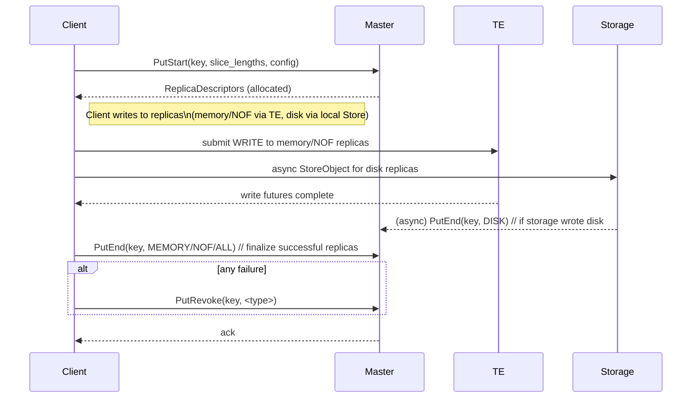
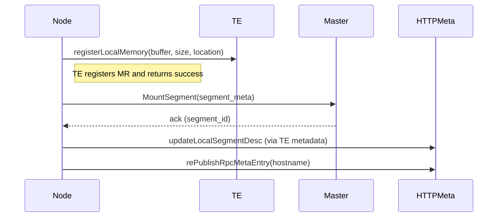
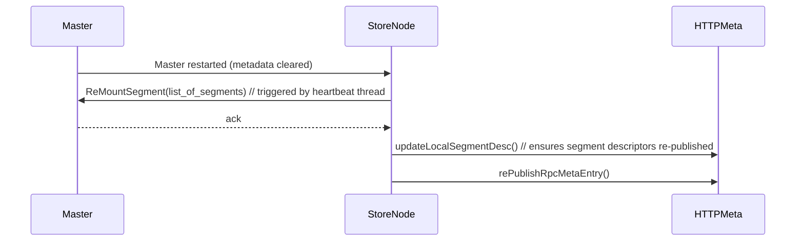
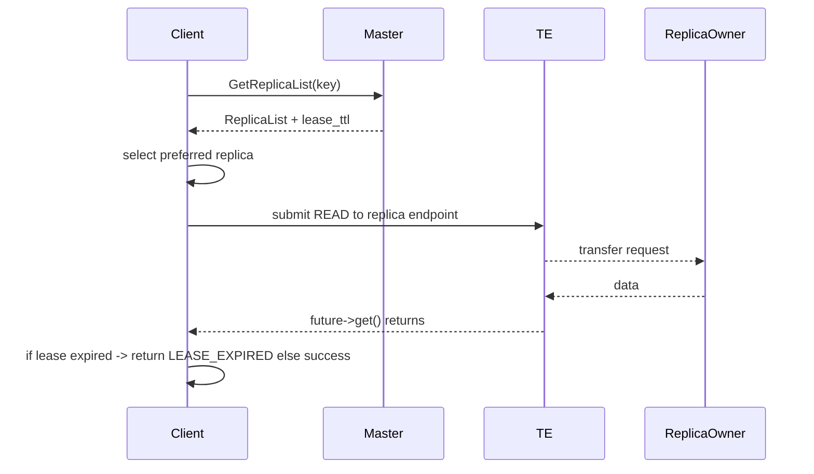

# Mooncake 元数据布局（Metadata Layout）

## 目录
- 概述
- 元数据总体模型（概念实体与关系）
- 主要元数据对象与字段（详细）
- 元数据存储与发现（Master / HA / HTTP metadata server / TE metadata）
- 典型控制面操作（PutStart / PutEnd / PutRevoke 等）与元数据变更时序
- Segment 注册 / Mount / Remount 时序（元数据发布与恢复）
- 读取（Get）时 metadata + lease 流程
- 元数据一致性与失效/恢复处理要点
- 参考源码位置

---

## 概述
Mooncake 把控制面（元数据）和数据平面（Transfer Engine）分离。Master 保存对象与副本的元数据（谁持有什么副本、状态、副本类型、磁盘路径、租约等），并提供 RPC（PutStart/GetReplicaList/End/Revoke/Task APIs 等）。Transfer Engine 与 HTTP metadata server 提供传输端点的发现，使节点能通过 transport（RDMA/TCP/NOF 等）找到彼此的内存段。元数据布局围绕以下核心实体：Object、Replica、Segment、Client（或节点），以及 Task/Promotion/Offload 条目。

---

## 元数据总体模型（实体与关系）
简要实体与它们的关系：
- Object (key) —> has many Replicas
- Replica —> belongs to a Segment (or DiskDescriptor) and has BufferDescriptor or DiskDescriptor
- Segment —> represents a registered local memory region on a Store node
- Client / Store node —> registers Segment(s) and has transport endpoint metadata (rpc_meta)
- Master —> stores mapping: key -> [ReplicaDescriptors], segment registry, tasks (copy/move/offload/promotion), storage config, tenant info
- HTTP Metadata Server / TE metadata —> publishes segment descriptors and rpc_meta so peers can find endpoints for transfers

用图表示（实体关系，Mermaid）：
```mermaid
flowchart TB
  Object[Object (key)]
  Replica[ReplicaDescriptor]
  Segment[Segment (id, base, size, endpoint)]
  Disk[DiskDescriptor (file_path, object_size)]
  Node[Store Node / Client]
  Master[Master metadata DB]
  HTTPMeta[HTTP Metadata Server / TE metadata]

  Object -->|has replicas| Replica
  Replica -->|on segment| Segment
  Replica -->|or on disk| Disk
  Segment -->|owned by| Node
  Node -->|registers| Master
  Node -->|publishes segment desc| HTTPMeta
  Master -->|stores mappings| Object
```

---

## 主要元数据对象与字段（详述）

1) Object（按 key 索引）
- key (string)
- tenant_id (optional)
- replica_list: array of ReplicaDescriptor
- metadata: creation time, ttl/lease policy, version/epoch
- optional: tags, user-provided priority/placement hints

2) ReplicaDescriptor（每个副本的记录）
- id / descriptor 唯一标识（内部）
- type: MEMORY | NOF_SSD | DISK | LOCAL_DISK
- status: ALLOCATED | COMPLETE | REVOKED | UNKNOWN
- memory_descriptor:
  - buffer_descriptor:
    - transport_endpoint (hostname, ip:port 或 TE endpoint string)
    - buffer_address (uintptr_t)  — 用于远端 RDMA/NOF 直接访问
    - size
    - segment_id / segment_name references
- nof_descriptor: (类似 memory，可能有 additional fields)
- disk_descriptor:
  - file_path
  - object_size
  - storage_segment (local disk segment id)
- owner / allocated_node (which node holds the replica)
- generation/epoch / allocation_time
- lease_ttl_ms (attached at Query time by Master)

3) Segment（节点上注册的内存区域）
- id (UUID)
- name (logical name / hostname)
- base (uintptr_t)
- size (bytes)
- protocol (rdma/tcp/ascend/ubshmem/...)
- te_endpoint (what other peers should use to address this segment; often local hostname or RDMA endpoint)
- mount status (MOUNTED / UNMOUNTING / UNMOUNTED)
- registered_with_TE (boolean)

4) Node / RPC metadata
- hostname
- rpc_meta: endpoint info for RPC/handshake (for RDMA RPC or TE rendezvous)
- reported capacities (SSD capacity, available memory, labels)

5) Tasks & Control entries
- Offload tasks, Promotion tasks, Copy/Move tasks
- Each task: id, key, source, targets, status, retries, schedule info

6) Master view / HA state
- Leader view version, leader_address, cluster namespace (when using etcd/k8s lease)
- Master stores current view and client heartbeat info

7) Lease (per Query response)
- lease_ttl_ms: when Master responds to GetReplicaList, client receives an expiration time (absolute or TTL) — client should finish transfers before expiry

---

## 元数据存储与发现（谁把数据放在哪里）
- Master 的元数据存储：可后端（etcd, internal DB 等）或程序内存 + HA coordination. Code shows master_client RPC and HA coordinator support (etcd or k8s-lease).
- HTTP Metadata Server：Master/Store 将段描述和 rpc_meta 发布到 HTTP metadata (used by TE/peers to discover transport endpoints and segment descriptors). TE metadata provides updateLocalSegmentDesc() and rePublishRpcMetaEntry() calls.
- Transfer Engine（TE）本地 metadata：registerLocalMemory 使 TE 能访问内存并 TE 自身持有本地 segment descriptors；这些也需要被发布到 HTTP metadata server so peers can read them.
- For HA: leader coordinator (etcd/k8s lease) provides leader view; clients can discover leader via HA backend.

---

## 典型控制面操作与元数据变更（Put lifecycle）

高层次步骤：
- PutStart: Client -> Master. Master checks capacity/policy并分配一组 ReplicaDescriptor（标记为 ALLOCATED or ALLOC_PENDING）。Master records these allocations in metadata.
- Transfer to replicas: Client writes data to allocated replicas (memory/noF/disk). During this time replicas may be incomplete.
- PutEnd / PutRevoke: Client notifies Master about completion; Master marks replica status COMPLETE (or removes/Veto on revoke).

Put 时序图（Mermaid）：


关键元数据变更点：
- On PutStart: Master records `replica_list` entries in object metadata (status: ALLOCATED).
- On successful PutEnd: Master updates relevant replica status -> COMPLETE and may attach timestamp/version.
- On PutRevoke: Master removes or marks replica invalid and may trigger eviction/cleanup tasks.

---

## Segment 注册 / Mount / Remount（元数据发布与恢复）
- 当节点希望让其内存段可被远端访问时，Client::MountSegmentAndGetId 调用 transfer_engine_->registerLocalMemory(...)，然后调用 master_client_.MountSegment(segment). Master stores segment registration in its metadata and HTTP metadata server entry is expected to be updated.
- When Master restarts or loses in-memory metadata, Store nodes need to re-register their segments (remount). Client has a StorageHeartbeatThreadMain that calls master_client_.ReMountSegment(segments) and also republish segment descriptor via TE metadata updateLocalSegmentDesc() and republish rpc_meta.

Mount / remount 时序图（Mermaid）：


Remount on Master restart:


实现细节（在代码中可见）：
- StorageHeartbeatThreadMain 调用 master_client_.ReMountSegment(segments) 并随后调用 transfer_engine_->getMetadata()->updateLocalSegmentDesc() 和 rePublishRpcMetaEntry(local_hostname_)，并会重试在失败情形下（见 client_service.cpp）

---

## 读取（Get）时 metadata + lease 流程
- Client calls Master.GetReplicaList(key). Master returns replica_list plus lease_ttl_ms (relative deadline).
- Client picks replica (FindFirstCompleteReplica / GetPreferredReplica); if local hot cache can serve, redirect to local address.
- Client submits TransferRead via TransferSubmitter to TE; waits for future->get().
- After transfer, client checks if lease expired; if expired returns LEASE_EXPIRED.

Get 时序图（Mermaid）：


元数据要点：
- Lease 的存在：Master 在 Query 时返回 lease，客户端应在 lease 到期前完成数据传输，以防元数据发生变化。
- Replica status：Master 管理副本的状态，只有 COMPLETE 的副本才被选为读取目标（见 FindFirstCompleteReplica）。

---

## 元数据一致性与失效/恢复处理要点
- Lease-based short-term validity：客户端依赖 Master 分配的副本描述的短期一致性（lease），以避免 race（如 replica 被回收或迁移期间读到不一致数据）。
- Master HA：Master 可通过 etcd/k8s lease 实现 leader election；节点需能在 leader 切换后重新 switch leader（SwitchLeader）或通过 ReMountSegment 恢复段元数据。
- Segment descriptor republishing：Master restart 会导致 HTTP metadata server 或内存条目丢失，Store nodes 必须在心跳中重登并调用 updateLocalSegmentDesc() 与 rePublishRpcMetaEntry() 以恢复可达性。
- Put finalize semantics：PutEnd / PutRevoke 保证最终一致性（PutEnd 将 replica 标为 COMPLETE；PutRevoke 撤销分配避免 phantom replicas）。Flexible write modes（例如 FLEXIBLE_DUAL_REPLICA）允许部分成功策略。
- Error handling：当 transfer 或 storage 后端失败时，客户端应调用 PutRevoke / UpsertRevoke，并记录上下文便于调查。

---

## 参考源码位置（主要在仓库中）
- mooncake-store/src/client_service.cpp
  - PutStart/PutEnd/PutRevoke、MountSegment、StorageHeartbeatThreadMain、updateLocalSegmentDesc 调用点
- mooncake-store/src/master_service.cpp（Master 元数据处理）
- mooncake-common/etcd、mooncake-common/k8s-lease（HA 协调）
- mooncake-transfer-engine/src/metadata 或 transfer_engine 元数据相关接口（updateLocalSegmentDesc / rePublishRpcMetaEntry）

---