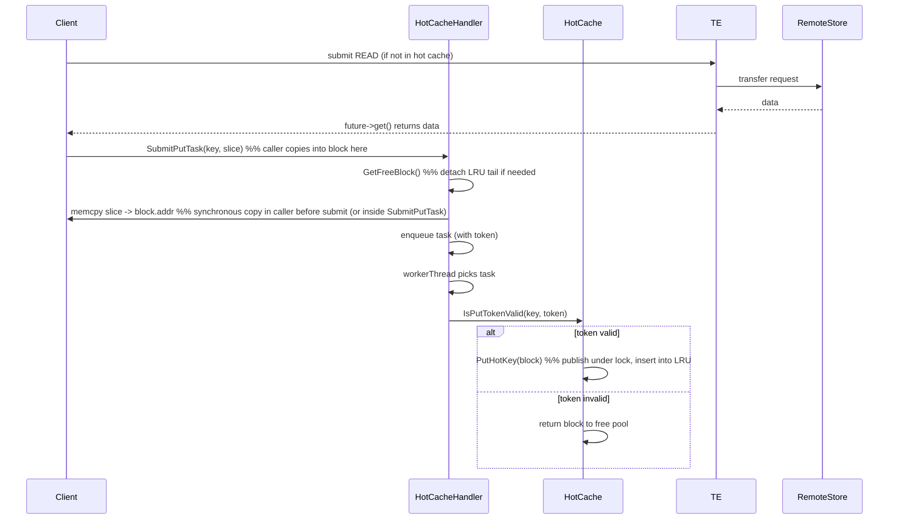
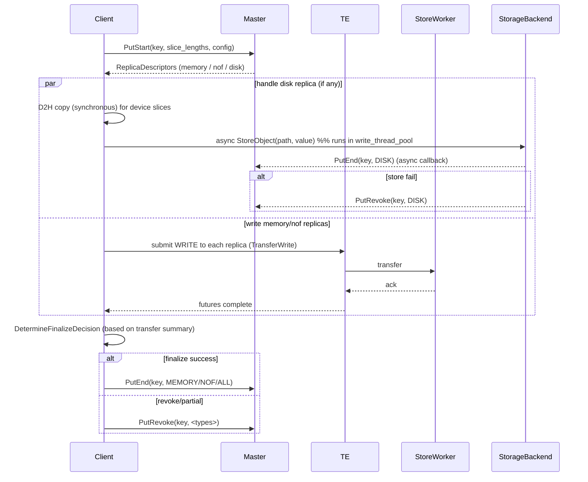
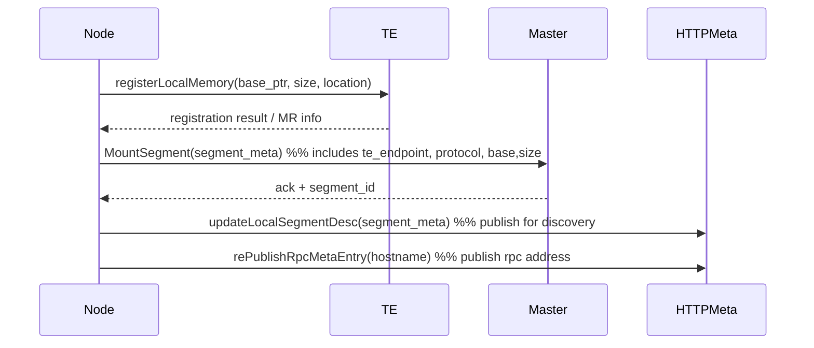

# Mooncake 内存管理策略（Memory Management）分析

## 概要（Direct answer）
Mooncake 的内存管理由若干协同子系统组成：
- Local Hot Cache：面向热点对象的本地固定块缓存（块池 + LRU）。
- 客户端缓冲区分配/批量分配（client buffer allocator / AlignedClientBufferAllocator / pinned buffer pool）：用于 D2H、staging、BatchGet/BatchLoad。
- Transfer Engine 相关的内存注册（registerLocalMemory / Segment 注册）：把节点内存暴露给 TE / RDMA。
- 异步热缓存填充与 token 验证（Put token / epoch / generation）以保证并发安全。
- 磁盘 offload 时的同步 D2H（调用线程做拷贝） + 后台异步写（StorageBackend）。
- GC / lease / eviction（客户端缓冲 GC、hot cache LRU、disk evict + Master 通知）。
下面逐项分析并给出关键的时序图与实现要点。

---

## 1. 关键概念与组件
- HotMemBlock / LocalHotCache
  - 块（HotMemBlock）是固定大小 block（block_size_），包含 addr、size、ref_count、key、accessed flag。
  - LocalHotCache 管理一组 blocks（bulk allocation 或 shm），维护 LRU（lru_queue_）与 key->iterator 映射、key_generation、cache_epoch。
  - 提供 GetFreeBlock、PutHotKey、GetHotKey、ReleaseHotKey、HasHotKey、TouchHotKey、RemoveHotKey、BumpKeyGeneration、AcquirePutToken/IsPutTokenValid。

- LocalHotCacheHandler（async Put 处理）
  - 提交 Put 任务：SubmitPutTask(key, slice)。
  - 在 SubmitPutTask 中会把切片数据 memcpy 到 block 的 addr（调用线程在提交前完成 data copy），然后 worker 线程在后台 publish（调用 PutHotKey(block, token)）。

- Client Buffer Allocator / PinnedBufferPool
  - 客户端用于 BatchGet/BatchPut 的分配器（AlignedClientBufferAllocator），用于提供对齐的 host buffers（例如用于 O_DIRECT 或 uring）。
  - PinnedBufferPool 用于临时 D2H staging（例如 FileStorage::OffloadObjects 会用 pinned_buffer_pool_->Acquire 并 CopyDeviceToHost）。
  - AllocateBatch / AllocateBatch->allocate 并返回 slices，其中 BatchLoad 调用 storage_backend_->BatchLoad（I/O）并随后释放 staging buffers。

- Transfer Engine Memory Registration
  - registerLocalMemory 将 bulk 内存段（hot cache 或 client buffer）注册到 TE（或 RDMA），以便远端可以零拷贝访问（通过 buffer_address 在 ReplicaDescriptor 中引用）。

- Lease / Generation / Put Token
  - Master 在 GetReplicaList/PutStart 等响应中返回 lease（lease_ttl_ms）；客户端应在 lease 到期之前完成数据传输。
  - Hot cache 使用 PutToken（HotCachePutToken）包含 cache_epoch 和 key_generation；在 async publish 前验证 token（IsPutTokenValid）确保在 publish 期间 key 未被移除/覆盖。

---

## 2. 内存分配与生命周期（总体）
- 启动：LocalHotCache 在构造时做 bulk allocation（或 shm allocation），把内存划分为 block_size_ 大小的 HotMemBlock，并放入 free pool / LRU（空闲列表）。
- 读取路径（若命中 hot cache）：GetHotKey 返回 HotMemBlock* 并增 ref_count，客户端读取后调用 ReleaseHotKey（减 ref_count）。
- 异步填充：当客户端从远端读取后若决定缓存，调用 LocalHotCacheHandler::SubmitPutTask：
  - SubmitPutTask 内部在调用线程做 memcpy（D2H staging 若需要），占用 GetFreeBlock 得到 block。
  - 构造 HotCachePutTask（含 token），推入任务队列，worker 线程取出并在最终 publish 前再次验证 token（IsPutTokenValid）；若有效则 PutHotKey(block)；否则释放 block。
- Batch / File offload：FileStorage::AllocateBatch 分配对齐 staging buffer；BatchLoad 从 disk 读取数据到 staging buffer；Promotion/Offload 也用这些 staging buffers，并在完成后释放或提交 transfers。

---

## 3. 重要时序场景（Mermaid 图）

1) 热缓存填充（HotCache async put）
- 场景：读取（Get）从远端拿到数据后，把切片异步写入本地 hot cache。

注：
- memcpy（将切片复制到 block）在 SubmitPutTask 中由调用线程同步完成（代码注释指出“Data is copied into the cache block synchronously within this call. The caller may free the source slice memory after this function returns.”）。
- Put token 验证保证 RemoveHotKey / BumpKeyGeneration 等并发操作不会导致 stale publish。

2) Put（写入）到 memory / NOF / disk（包含 D2H staging 和异步写盘）
- 场景：Client 写入一个 key，Master 分配 replicas（可能包含 disk），Client 对不同副本采取不同路径。

要点：
- D2H（Device-to-Host）在调用线程同步进行，以保证源 GPU buffer 在复制时仍然可用（见 FileStorage::OffloadObjects 中使用 pinned_buffer_pool 并 CopyDeviceToHost）。
- Disk 写是异步的，完成后由后台线程回调 Master PutEnd（或 PutRevoke）。

3) RegisterLocalMemory / MountSegment（TE / Master 注册）
- 场景：节点把自己的内存段注册到 TE 并通知 Master（用于暴露 buffer addresses 给远端）。

恢复（Master restart）时，节点在 Heartbeat 中会触发 ReMountSegment 并重新发布 HTTP meta。

---

## 4. 内存分配策略细节与实现点

- 块式热缓存（fixed block）
  - block_size_: 通常较大（默认 16MB），方便缓存大型 tensor / KVCache。
  - bulk allocation：一次性分配大块内存（bulk_memory_standard_）并将其拆分为 blocks，减少碎片与页表开销。
  - 可选 shm（use_shm=true）：用 memfd/Shared Memory 以支持跨进程共享（FileStorage 注册全局 buffer 供 io_uring 使用）。

- LRU + deferred touches
  - 有 lru_queue_ 和 accessed flag（deferred LRU touch）—减少在高并发访问下对 LRU 的频繁锁竞争，定期 drainDeferredTouches 把 accessed 标记的块移动到 LRU 前端。

- 引用计数（ref_count）
  - 获取 GetHotKey 会把块标为 in_use，增加 ref_count；释放 ReleaseHotKey 减少 ref_count，保证正在读取的块不会被回收或重用。

- 令牌与 epoch（并发安全）
  - AcquirePutToken 返回 HotCachePutToken{cache_epoch, key_generation}。
  - 在实际 publish 前验证 token（IsPutTokenValid 与 isPutTokenValidLocked），用于检测在任务排队或 worker 延迟期间 key 是否已被 Remove 或 generation bumped，从而避免 publish stale data。

- 获取空闲块（GetFreeBlock）与逐出（eviction）
  - GetFreeBlock 从 LRU tail 抽取一个块（必要时 evict：若块在尾部且 ref_count==0，则回收并返回），并将其交由调用者填充。
  - PutHotKey 在 put 时会检测 key 已存在的竞态并退回块。

- 缓冲器的 GC（客户端 buffer）
  - client_buffer_allocated_batches_：AllocateBatch 在 BatchGet/BatchLoad 中分配临时 staging buffers，并设置 lease_timeout（client_buffer_gc_ttl_ms），GC 线程定期释放过期的 staging buffers。
  - 这是为了防止长期未完成的批次占用 host staging 内存。

- BufferAllocatorType
  - 支持多种 BufferAllocator（CACHELIB、OFFSET 等），以便在不同部署/后端优化内存分配行为（如 slab 分配或 offset-based arena 分配）。

---

## 5. 与 Device（GPU/ASCEND）相关的 D2H staging
- 对于在 GPU 上的 slice（detect via IsDevicePointer），系统会：
  - 在提交到 storage 或做 BatchOffload 之前调用 CopyDeviceToHost（同步）到 pinned staging buffer（来自 pinned_buffer_pool_）。
  - 复制完成后将 host pointer 提交给 storage backend（BatchOffload / StoreObject）。
- D2H 通常在调用线程同步完成（见 FileStorage::OffloadObjects 中的注释），因为需要保证源 GPU buffer 在复制过程中不被回收。

---

## 6. 磁盘/持久化与内存的交互（Promotion / Offload）
- Promotion（L2->L1）：
  - Master 可能返回 PromotionAllocStart（给客户端一个 PROCESSING MEMORY descriptor），客户端会 Read from disk into staging buffer（AllocateBatch -> BatchLoad），然后 TE write 到 MEMORY replica（PromotionWrite），最后 NotifyPromotionSuccess（Master 把 PROCESSING 标记为 COMPLETE）。
- Offload（L1->L2）：
  - 心跳（OffloadObjectHeartbeat）告知客户端要将某些对象写到磁盘，客户端做 AllocateBatch、BatchLoad（读取 local disk）、BatchOffload（写入 global offload backend），随后 NotifyOffloadSuccess（Master 注册 offloaded object metadata）。

---

## 7. 回收 / eviction 策略概览
- Hot cache 基于 LRU，但有 deferred touch 优化；当需要回收，GetFreeBlock 会从 LRU tail 回收 ref_count 为 0 的块。
- Disk offload 有 eviction handler（在 FileStorage::OffloadObjects 的 eviction_handler），当本地 disk 被回收时，会调用 client_->BatchEvictDiskReplica 通知 Master。
- Master 层还有更复杂的 eviction / quota / tenant 限制（见 tenant_quota.h、eviction_strategy.h）。

---

## 8. 并发、阻塞点与调优建议
- D2H 在主线程同步：对高并发场景是主要阻塞点，尽量减少 D2H 频率或使用 pinned pools、批量化。
- Hot cache block_size 越大单位命中越高但并发利用可能降低；根据 typical tensor size 调整 block_size（默认 16MB）。
- GetFreeBlock/PutHotKey 锁争用点：在高并发时提高 worker 线程数、增加 deferred touch drain 周期可以减少争用。
- client buffer GC TTL：设置得过小会导致正在用的批次被过早释放，过大则可能占用过多内存。
- 使用 submit_batch 合并到同一 transport endpoint 的请求以节省 RTT 并提高带宽。

---

## 9. 关键源码参考（便于深入阅读）
- Hot Cache / Handler：
  - mooncake-store/include/local_hot_cache.h
  - mooncake-store/src/（相关实现文件）
- Client buffer & staging：
  - mooncake-store/src/file_storage.cpp（AllocateBatch / BatchLoad / OffloadObjects）
  - mooncake-store/include/pinned_buffer_pool.h, aligned_client_buffer.hpp
- Transfer registration / segment：
  - transfer engine registerLocalMemory 调用点：client->RegisterLocalMemory(...)（FileStorage::RegisterLocalMemory）
  - master_client_.MountLocalDiskSegment / ReMountSegment (FileStorage::Init & Heartbeat)
- Eviction / quota / promotion：
  - mooncake-store/include/eviction_strategy.h
  - mooncake-store/include/tenant_quota.h
  - mooncake-store/src/xxx (promotion/offload code paths in FileStorage::ProcessPromotionTasks)

---

## 10. 总结（要点回顾）
- Mooncake 使用“大块+块池+LRU+token”组合来实现稳定与高效的本地内存缓存（hot cache），避免细粒度分配带来的碎片和锁竞争。
- 与设备（GPU）交互时强调同步的 D2H staging 并使用 pinned pool 以保证正确性与性能。
- Transfer Engine 通过内存注册（registerLocalMemory）使远端能直接访问本地内存，配合 replica descriptor 和 lease 保证短期的一致性。
- 异步 publish（Put token）和 GC 机制用于处理并发、恢复与资源回收场景。
- 调优方向主要围绕 block 大小、D2H 频率、并发提交合并（submit_batch）、GC TTL 与 LRU 策略参数。

---
