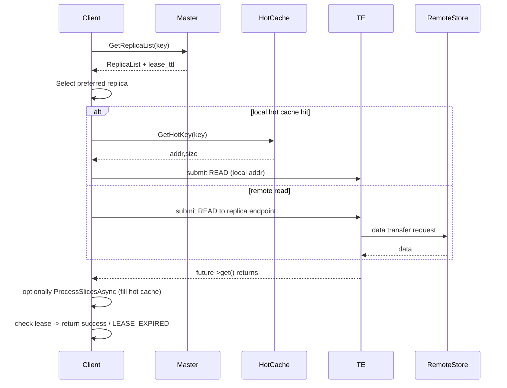
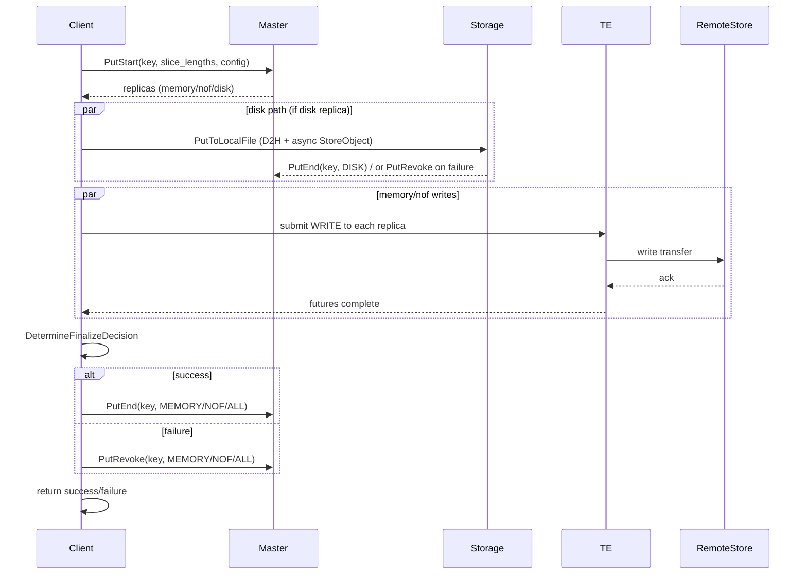
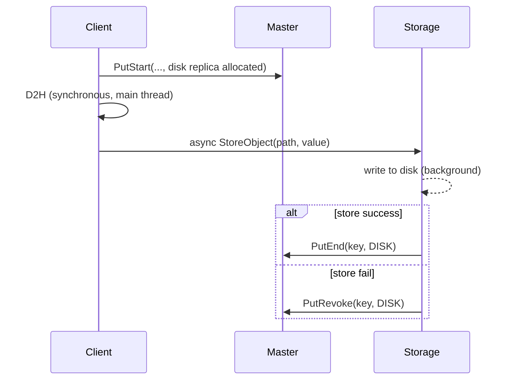
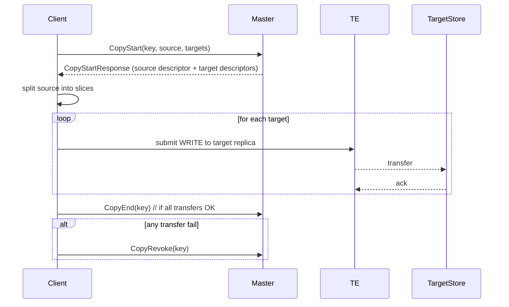

# Mooncake 存储模型（Storage Model）分析

## 目录
- 概述
- 基本概念与数据模型
- 关键组件与职责
- 生命周期与一致性语义（lease / finalize）
- 读（Get）流程（步骤 + 时序图）
- 写（Put / Upsert）流程（步骤 + 时序图）
- 磁盘离线（Offload）与本地写盘流程
- Replica Copy / Move 流程（时序图）
- 批量 / 优化点与注意事项
- 关键源码位置参考

---

## 概述
Mooncake 的存储模型围绕 KVCache 对象（object）与其副本（replica）展开。对象可以有多种类型的副本：内存副本（memory），NoF（网络/SSD 直通）副本，以及磁盘副本（disk / local_disk）。控制平面（Master）负责副本分配与元数据，数据平面（Transfer Engine）负责高效传输。客户端（Prefill/Decoder/StoreWorker）通过 Master 的 RPC 协商后，使用 Transfer Engine 在节点间移动数据。

---

## 基本概念与数据模型
- Object（对象 / key）  
  表示 KVCache 的一个条目（通常为 tensor blob），由字符串 key 唯一标识。

- Replica（副本）  
  每个对象可能会在集群的多个位置有副本。每个 ReplicaDescriptor 包含：
  - 类型（memory / nof / disk / local_disk）
  - 状态（ALLOCATED / COMPLETE / ...）
  - BufferDescriptor（transport_endpoint, buffer_address, size 等）
  - DiskDescriptor（file_path, object_size）等

- Segment（段 / memory segment）  
  节点上用于挂载内存供 Transfer Engine 访问的地址区间（registerLocalMemory 后在 Master 注册 segment 元数据）。

- Lease（租约）  
  Master 在返回 ReplicaList 时会附带 lease ttl，指示该副本描述在客户端查询后多长时间内有效（防止读取/写入期间元数据变化产生不一致）。

- TransferSubmitter / Transfer Engine（传输层）  
  抽象用于 submit/submit_batch 读写请求，底层可使用 RDMA/TCP/NOF/CXL 等 transport。

- Local Hot Cache（本地热缓存）  
  提升热点对象的本地访问速度，注册为 transfer 的本地内存段，支持零拷贝读取。

---

## 关键组件与职责
- Master（控制面）  
  - 管理对象元数据、分配 replica（PutStart/UpsertStart/CopyStart/MoveStart）、最终化（PutEnd/UpsertEnd/CopyEnd/MoveEnd）、回收（PutRevoke 等）。
  - 提供 HA 支持（etcd / k8s-lease）。

- Store Worker / Client（数据面）  
  - 执行具体数据读写：通过 TransferSubmitter 调用 Transfer Engine 进行传输。
  - 注册本地内存 segment（MountSegment / registerLocalMemory）。
  - 维护本地 hot cache 与磁盘存储（StorageBackend）。

- Transfer Engine（TE）  
  - 提供高吞吐、拓扑感知的数据传输能力。
  - 支持 registerLocalMemory，使远端节点能直接 RDMA/NOF 访问本地 buffer。

- StorageBackend（本地磁盘）  
  - 当 Master 分配 disk replica 时，Store 将对象异步写入本地文件/SSD（PutToLocalFile），并在完成时通知 Master PutEnd。

---

## 生命周期与一致性语义（lease / finalize）
- 客户端在 Query/Get 前通过 master_client_.GetReplicaList 获取 Replica 描述与 lease_ttl。客户端应在 lease 有效期内完成传输，若 Lease 过期，Master 可能调整副本分配，客户端需返回 LEASE_EXPIRED。
- Put / Upsert 分为 Start -> Transfer -> Finalize（End/Revoke）三阶段：
  - PutStart 分配 handles（replicas），返回要写入的副本描述。
  - 客户端对分配到的 replicas 发起传输（TransferWrite）；若存在 disk replica，通常先写盘（异步）并在完成后调用 PutEnd(disk)。
  - 根据 transfer 成功情况与重试策略，客户端调用 PutEnd/PutRevoke（或 UpsertEnd/UpsertRevoke）。对于 FLEXIBLE_DUAL_REPLICA 等策略，可以在一类副本成功时撤销另一类副本。

---

## 读（Get）流程（步骤）
1. Client -> Master：GetReplicaList(key)（master_client_.GetReplicaList），Master 返回 replicas + lease_ttl。
2. Client 选择副本：FindFirstCompleteReplica 或 GetPreferredReplica（优先本地 memory，再本地 nof，否则远端）。
3. 若本地 HotCache 命中（RedirectToHotCache），直接用本地地址读取；否则：
4. Client 调用 TransferRead(replica, slices)：
   - TransferRead -> TransferData -> transfer_submitter_->submit(replica, slices, READ)
   - TransferSubmitter 返回 TransferFuture；Client 等待 future->get() 完成。
5. 传输完成后，若满足热缓存策略，Client 异步调用 ProcessSlicesAsync 填充 hot cache。
6. Client 检查 lease（QueryResult.IsLeaseExpired），如过期返回错误。

### Get 时序图（Mermaid）

---

## 写（Put / Upsert）流程（步骤）
1. Client 为 slices 计算长度并调用 master_client_.PutStart(key, slice_lengths, config)。Master 返回一组 ReplicaDescriptor（memory / nof / disk）。
2. 如果 storage_backend 可用且存在 disk replica：Client 同步做 D2H（若 slice 在 GPU 上），然后把数据打包并提交给异步写线程（PutToLocalFile），写成功后异步调用 master_client_.PutEnd(key, DISK)。若失败，调用 PutRevoke(key, DISK)。
3. 对 memory / nof replicas：Client 调用 TransferWrite(replica, slices) -> transfer_submitter_->submit(..., WRITE)，得到 future 并等待 future->get()。
4. 等待所有传输完成后，基于 ReplicaTransferSummary 与 ReplicateConfig 调用 DetermineFinalizeDecision，决定调用 PutEnd/PutRevoke（或 UpsertEnd/UpsertRevoke）以完成提交或回滚。
5. 返回结果给调用方（Put 成功或失败错误码）。

### Put 时序图（Mermaid）

---

## 磁盘离线（Offload）与本地写盘流程
- 当 Master 分配 disk replica（用于持久化 / evict 场景），Store 在本地将对象写入指定文件路径（PutToLocalFile）。
- PutToLocalFile 的要点：
  - 对于 GPU buffer：在调用线程同步完成 D2H（以保证 GPU buffer 的生命周期），避免使用被回收的临时 buffer。
  - 将数据作为 string 或者连续缓冲区传递给 storage backend 的 StoreObject（在后台线程中执行 I/O）。
  - Storage 后台线程在成功后调用 master_client_.PutEnd(key, DISK)，若失败则 PutRevoke。
- StorageBackend 还负责磁盘回收（eviction），并在 eviction 时通知 Master BatchEvictDiskReplica。

### Disk offload 时序图（Mermaid）

---

## Replica Copy / Move 流程
- Master 提供 CopyStart / CopyEnd 和 MoveStart / MoveEnd 接口，分配目标副本或验证目标已存在。
- ExecuteReplicaTransfer 将源（通常是 memory replica）按照 buffer descriptor 分片并对每个目标执行 TransferWrite。
- 失败时调用 CopyRevoke / MoveRevoke。

### Copy / Move 时序图（Mermaid）

---

## 批量 / 优化点与注意事项
- BatchGet / BatchPut 会把同一 transport endpoint 的请求合并到一次 submit_batch，以减少 RTT 和提升带宽。
- Put 时对 disk replica 的本地写入需要注意 GPU -> Host 的同步拷贝开销（会在调用线程阻塞），应避免在高并发路径中频繁阻塞。
- TransferSubmitter 的策略（多路径、拓扑感知、fallback）会影响传输延迟与带宽，应监控 strategy 选择。
- Lease 管理：客户端必须检测和处理 lease 过期（返回 LEASE_EXPIRED），以避免使用过期的 replica 描述进行数据传输。
- 错误恢复：对部分成功/部分失败的 Put（尤其多副本场景）要正确调用 PutRevoke / UpsertRevoke 并记录错误上下文（client_service 中有丰富的日志与统计）。

---

## 关键源码位置参考（在源码仓库内）
- mooncake-store/src/client_service.cpp
  - Get / BatchGet / TransferRead / TransferReadRange
  - Put / Upsert / BatchPut / BatchUpsert / PutToLocalFile / TransferWrite
  - StartBatchPut / SubmitTransfers / WaitForTransfers / FinalizeBatchPut
  - RedirectToHotCache / ProcessSlicesAsync
- mooncake-store/src/storage_backend.*（StorageBackend，StoreObject 实现）
- mooncake-store/src/etcd_helper.cpp、k8s_lease_helper.cpp（HA 支持）
- mooncake-transfer-engine/src/*（transfer_engine、multi_transport、topology、transport adapters）

---
