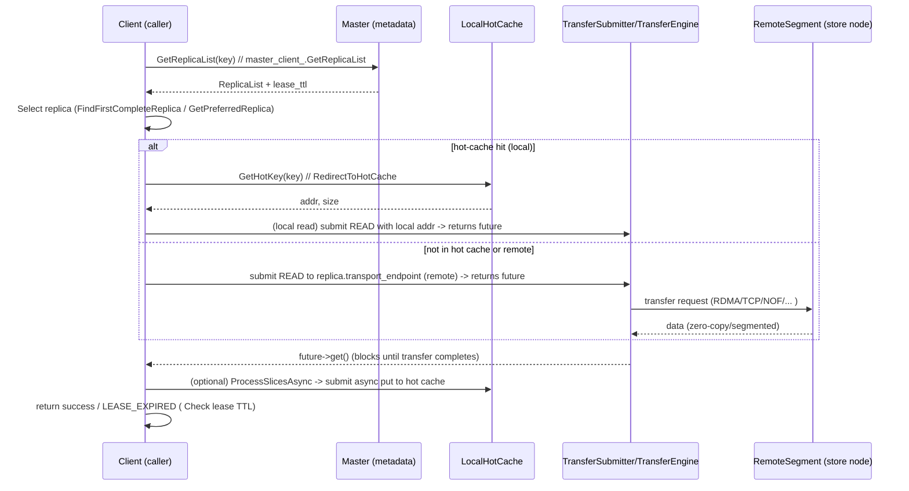
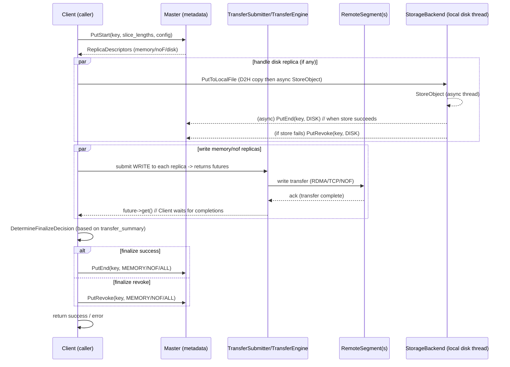

# Mooncake Store — 读写流程分析

## 一句话概述
Mooncake Store 提供分布式 KVCache 存储与传输：读操作以 master 查副本并通过 Transfer Engine（TE）传输数据；写操作通过 master 分配副本（memory / NOF / disk），对 disk 先写盘、对 memory/NOF 走 TE，再根据传输结果调用 master 的 finalize（PutEnd/PutRevoke 等）。

## 目录
- 高级流程概览
- 关键源码与函数（索引）
- 读流程（步骤 + Mermaid 时序图）
- 写流程（步骤 + Mermaid 时序图）
- 批量/并发场景要点
- 异步 / 阻塞点与调优关注
- 图查看与导出方式

---

## 高级流程概览
- Client 向 Master 请求对象副本列表（GetReplicaList / PutStart / UpsertStart）。
- 选择副本（偏好本地 memory / NOF），若本地 hot cache 命中则直接从本地读取。
- 通过 TransferSubmitter（封装 TransferEngine）提交传输（read/write），等待 future->get() 完成。
- 写路径对 disk replica 做本地写盘（异步存储线程），成功后调用 PutEnd；对 memory/NOF replica 用 TE 写入，再根据传输汇总决定调用 PutEnd 或 PutRevoke。

---

## 关键源码与函数（快速索引）
文件：`mooncake-store/src/client_service.cpp`

- 读相关
  - Client::Get / Client::BatchGet
  - Client::Query（调用 master_client_.GetReplicaList）
  - Client::FindFirstCompleteReplica / Client::GetPreferredReplica
  - Client::RedirectToHotCache
  - Client::TransferRead / TransferReadRange -> TransferData -> transfer_submitter_->submit -> future->get()
  - Client::ProcessSlicesAsync（读取后异步填充 hot cache）

- 写相关
  - Client::Put / Client::Upsert / BatchPut / BatchUpsert
  - master_client_.PutStart / UpsertStart（请求 master 分配 replica）
  - Client::PutToLocalFile（D2H + async storage_backend_->StoreObject，然后 async 调用 master PutEnd / PutRevoke）
  - Client::TransferWrite -> TransferData -> transfer_submitter_->submit -> future->get()
  - DetermineFinalizeDecision（决定 PutEnd / PutRevoke / UpsertEnd / UpsertRevoke）
  - FinalizeBatchPut / FinalizeBatchUpsert（批量 finalize）

- 传输与注册
  - transfer_engine_->registerLocalMemory / unregisterLocalMemory
  - TransferSubmitter（由 Client::InitTransferSubmitter 创建，提供 submit / submit_batch）

---

## 读流程（详细步骤）
1. Client 调用 Query(key) -> master_client_.GetReplicaList(key)。Master 返回 replica 列表和 lease ttl。
2. Client 选择副本：
   - FindFirstCompleteReplica 找到 COMPLETE 的 replica。
   - GetPreferredReplica 如果有本地挂载段，优先本地 memory，再本地 NOF。
3. 若启用本地 hot cache，尝试 RedirectToHotCache（GetHotKey）；命中则修改 replica 的 buffer_address/endpoint 指向本地 hot cache。
4. 调用 TransferRead(replica, slices)：
   - TransferRead -> TransferData -> transfer_submitter_->submit(replica, slices, READ)（或 submitRangeRead for range），得到 TransferFuture。
   - Client 等待 future->get()（阻塞直到传输完成或失败）。
5. 传输结束后：
   - 若使用 hot cache，则 ReleaseHotKey。
   - 若满足入缓存策略（频次等），调用 ProcessSlicesAsync 异步填充本地 hot cache（非本地数据才会尝试）。
6. 检查查询返回的 lease 是否在传输期间过期；若过期返回 LEASE_EXPIRED，否则返回成功。

Mermaid 时序图（读）：

---

## 写流程（Put / Upsert，详细步骤）
1. Client 为 slices 计算长度并调用 master_client_.PutStart(key, slice_lengths, config)。
2. Master 返回分配的副本描述（可能含 memory、nof、disk）。若 PutStart 返回 OBJECT_ALREADY_EXISTS，Put 视为成功直接返回。
3. 若存在 disk replica 并且 storage backend 可用：
   - Client::PutToLocalFile：把 GPU slice 同步做 D2H（保证 buffer 在当前线程有效），合并为字符串 value，并将写入请求提交给 write_thread_pool（异步）。
   - 存储线程完成后调用 master_client_.PutEnd(key, DISK)（若失败则调用 PutRevoke）。
4. 针对 memory/NOF replica：
   - Client::TransferWrite(replica, slices) -> TransferData -> transfer_submitter_->submit(..., WRITE)，得到 future，Client 等待 future->get()。
5. 等待所有 pending transfer futures（WaitForTransfers）。
6. 构造 ReplicaTransferSummary，调用 DetermineFinalizeDecision 根据复制策略决定 end/revoke/success。
7. 调用 master_client_.PutEnd / PutRevoke（支持批量 BatchPutEnd / BatchPutRevoke）。
8. 返回最终结果；对于 Upsert，失败时要调用 UpsertRevoke。

Mermaid 时序图（写）：

---

## 批量 / 并发场景要点
- BatchGet / BatchPut 会把属于同一 transport endpoint（segment）的请求合并并调用 transfer_submitter_->submit_batch，以降低 RPC/RTT 开销并提高带宽利用。
- BatchPut 的流程包含 StartBatchPut -> SubmitTransfers -> WaitForTransfers -> FinalizeBatchPut -> CollectResults，期间会对每个 op 跟踪状态（PENDING / TRANSFER_FAILED / FINALIZE_FAILED / SUCCESS）。
- Put 的 disk 写采用异步后台线程（write_thread_pool），而 D2H（GPU->Host）是同步在调用线程完成以保证缓冲区正确性。

---

## 异步 / 阻塞点与调优关注
重要阻塞点（影响延迟）：
- master RPC：GetReplicaList / PutStart / PutEnd / PutRevoke（metadata 延迟或 leader 切换会影响）。
- transfer_submitter_->submit(...).future->get()：实际的传输（RDMA/TCP/NOF）延迟与带宽主导。
- PutToLocalFile 的 D2H（在主线程同步完成），可能是显著开销（尤其 GPU buffer）。
性能与可观测性建议：
- 监控 master RPC 延迟与失败率（心跳/leader 切换指标）。
- 监控 transfer 的策略选择与带宽（transfer metric 在代码中有采集点）。
- 对高并发场景，优先使用 submit_batch 合并以减少传输开销。
- 调整本地 hot cache（size/block_size/入缓存阈值）以提升命中率，减少远程传输。

---
