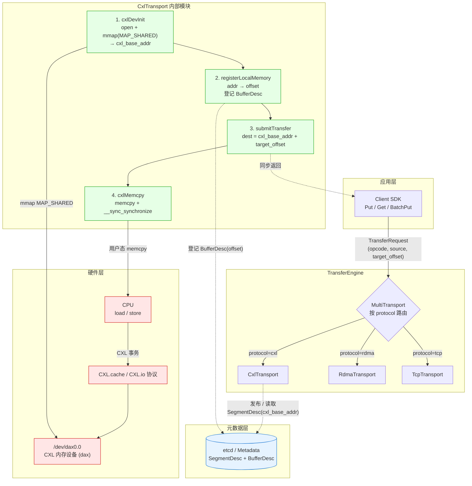
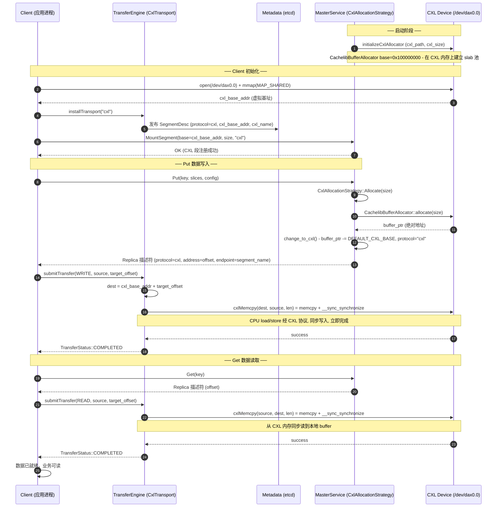

# Mooncake 中 CXL 协议分析

通过分析 Mooncake 的代码，Mooncake 把 CXL（Compute Express Link）当作与 RDMA/TCP/UB 同级的一种 *transport*，并额外提供了 store 层的 CXL 内存分层分配。整体可分三层理解：

---

## 一、Transfer Engine 层：`CxlTransport`（数据面）

**相关文件**
- `mooncake-transfer-engine/src/transport/cxl_transport/cxl_transport.cpp`
- `mooncake-transfer-engine/include/transport/cxl_transport/cxl_transport.h`

### 1. 设备初始化（把 CXL 内存映射进进程地址空间）

- 构造时从环境变量读取 `MC_CXL_DEV_PATH`（如 `/dev/dax0.0`），`MC_CXL_DEV_SIZE` 或从 `/sys/bus/dax/devices/<daxN.M>/size` 读取容量。
- `cxlDevInit()`：`open(dev_path, O_RDWR)` → `mmap(NULL, dev_size, PROT_READ|PROT_WRITE, MAP_SHARED, fd, 0)`，得到 `cxl_base_addr`，整个 CXL 设备以一段连续虚拟地址暴露给本进程。
- `install()` 完成设备 mmap → `allocateLocalSegmentID()` → 把 `protocol="cxl"`、`cxl_base_addr`、`cxl_name` 写入 `SegmentDesc` 并通过 `metadata_->updateLocalSegmentDesc()` 发布到 etcd/元数据存储。

### 2. 内存注册（按 offset 而非绝对地址）

`registerLocalMemory(addr, len, ...)`：
- 校验 `addr` 必须落在 `[cxl_base_addr, cxl_base_addr + cxl_dev_size)` 内；
- 构造 `BufferDesc`，其中 `offset = addr - cxl_base_addr`，`protocol = "cxl"`，`length = len`，登记到元数据。

> **关键点**：CXL buffer 在元数据里只存 **相对偏移**，跨节点时由接收方用本地 `cxl_base_addr` 重建绝对地址。

### 3. 数据拷贝（`cxlMemcpy`）

```cpp
std::memcpy(dest, src, size);
if (isAddressInCxlRange(dest) || isAddressInCxlRange(src))
    __sync_synchronize();   // 仅当涉及 CXL 地址时加全内存屏障
```

底层就是 CPU 的 load/store 经 CXL.io/CXL.cache 协议落到 CXL 内存；没有任何 RDMA verb、没有内核 bounce，全部在用户态完成。`validateMemoryBounds`/`isAddressInCxlRange` 保证不越界。

### 4. 提交传输（`submitTransfer` / `submitTransferTask`）

对每个 `TransferRequest`：
- 计算 `dest_addr = (char*)cxl_base_addr + request.target_offset`；
- `READ`：`cxlMemcpy(source_addr(本地), dest_addr(CXL), length)` — 从 CXL 读到本地内存；
- `WRITE`：`cxlMemcpy(dest_addr(CXL), source_addr(本地), length)` — 从本地写到 CXL；
- 拷贝是 **同步** 的，立即 `markSuccess()/markFailed()`，`getTransferStatus` 只是把 `transferred_bytes`/状态上报给上层。

这与 RDMA 异步提交截然不同，本质是"共享内存式 memcpy"。

### 5. 多协议协同（`multi_transport.cpp`）

当一个 segment 同时注册了 cxl/rdma/tcp 等 buffer 时，`submitTransfer` 通过 `target_offset` 落在哪个 buffer 范围来选协议；对 CXL 特殊处理：

```cpp
uint64_t start = (buffer.protocol == "cxl")
    ? buffer.offset + target_segment_desc->cxl_base_addr
    : buffer.addr;
```

即 CXL 用 `offset + 对端 cxl_base_addr` 还原绝对地址，其他协议直接用 `buffer.addr`。

### 6. CxlTransport 架构图



**架构图说明**

- **应用层**：业务通过 Client SDK 发起 `Put/Get`，构造 `TransferRequest`（含 `opcode`、本地 `source` buffer、对端 `target_offset`）。
- **TransferEngine 层**：`MultiTransport` 是协议路由器，依据 replica 描述符里的 `protocol` 字段把请求派发给对应 Transport；CXL 与 RDMA/TCP 平级共存于同一 segment。
- **CxlTransport 内部**：4 个核心步骤串成数据通路 —— 设备 mmap → 内存注册（绝对地址转 offset）→ 提交传输（offset 加回 base）→ `cxlMemcpy` 同步拷贝。
- **元数据层**：etcd 存放 `SegmentDesc`（含 `cxl_base_addr`、`cxl_name`）与 `BufferDesc`（只存 `offset`），实现跨节点寻址。
- **硬件层**：`memcpy` 本质是 CPU 的 load/store，经 CXL.cache/CXL.io 协议落到 CXL 内存设备，全程无内核 bounce、无 RDMA verb。

---

## 二、Mooncake Store 层：CXL 内存分层分配

**相关文件**
- `mooncake-store/src/segment.cpp`
- `mooncake-store/src/allocator.cpp`
- `mooncake-store/include/allocation_strategy.h`
- `mooncake-store/src/master_service.cpp`

### 1. 启用方式（master 启动参数）

```bash
mooncake_master --enable_cxl=true \
                --cxl_path=/dev/dax0.0 \
                --cxl_size=17179869184 \
                --allocation_strategy=cxl
```

`MasterService` 构造时若 `enable_cxl_`，则：
- `allocation_strategy_ = make_shared<CxlAllocationStrategy>()`；
- `segment_manager_.initializeCxlAllocator(cxl_path_, cxl_size_)` 创建一个 **CachelibBufferAllocator**，base 固定为 `DEFAULT_CXL_BASE = 0x100000000`（4GB），用 cachelib 的 slab 分配器管理整段 CXL 内存。

### 2. `CxlAllocationStrategy::Allocate`

- 必须传 `preferred_segments`，取第一个作为目标 CXL segment；
- 调用该 segment 的 `BufferAllocatorBase::allocate(size)` 得到 `AllocatedBuffer`；
- `buffer->change_to_cxl(client_segment_name)`：把 `buffer_ptr_` 从绝对地址改成 offset（减去 `DEFAULT_CXL_BASE`），并置 `protocol="cxl"`、记录 segment 名；
- 只支持单副本，不支持 `AllocateFrom`。

### 3. 描述符序列化（`get_descriptor`）

- CXL buffer 的 `transport_endpoint` 被改写成 `segment_name_`（而不是真实 RPC 地址），因为同段 CXL 设备通过 mmap 共享，定位靠 segment 名 + offset；
- `get_vaddr_from_cxl()` 反向加回 `DEFAULT_CXL_BASE` 用于本地 free。

### 4. 客户端侧

- `Client::GetBaseAddr()` 返回 `transfer_engine_->getBaseAddr()`，对 CXL transport 就是 mmap 出来的 `cxl_base_addr`。
- 客户端 `MountSegment(buffer, size, "cxl")` 把这段 CXL 内存注册到 transfer engine 并通知 master，之后 Put/Get 的 replica 就落在 CXL tier 上。
- 测试 `cxl_client_integration_test.cpp` 中用普通 tmp 文件 `tmp_dax_sim` 模拟 dax 设备，先 `open+ftruncate`，再通过环境变量喂给 `CxlTransport`，即可跑通 Put/Get/Evict。

---

## 三、关键设计要点

| 维度 | CXL 实现 |
|---|---|
| 通信原语 | 用户态 `memcpy` + `__sync_synchronize`（CPU load/store 走 CXL 协议） |
| 寻址 | 元数据存 `offset`，运行期 `offset + cxl_base_addr` 还原绝对地址 |
| 同步性 | 完全同步，提交即完成，无完成队列 |
| 设备访问 | `open("/dev/dax0.0") + mmap(MAP_SHARED)` |
| 内存管理 | cachelib slab 分配器；base 固定 `0x100000000` |
| 多协议 | 通过 `protocol="cxl"` 标记，与 rdma/tcp 在同一 segment 共存，按 offset 路由 |
| 分配策略 | `CxlAllocationStrategy`：单副本、强制指定 CXL segment、`change_to_cxl` 改写描述符 |
| 部署 | 需 CXL 硬件 + dax 设备；编译开关 `-DUSE_CXL=ON`，运行期 `MC_CXL_DEV_PATH` |

---

## 四、数据传输完整链路（以一次 Put 为例）

### 时序流程图



1. Master 启用 `enable_cxl`，`CachelibBufferAllocator` 在 `0x100000000` 起、覆盖 `cxl_size` 的 CXL 内存上建立 slab 池；
2. Client 启动时 `installTransport("cxl")` → mmap `/dev/dax0.0` 得到本进程 `cxl_base_addr`，并把 segment 元数据（含 `cxl_base_addr`）发布到 metadata；
3. Client `MountSegment(base=getBaseAddr(), size, "cxl")`，向 master 注册该段为 CXL 段；
4. `Put` 时 master 用 `CxlAllocationStrategy` 从 CXL segment 分配一个 buffer，`change_to_cxl` 把绝对地址转 offset，返回 replica 描述符（protocol=cxl, address=offset, endpoint=segment_name）；
5. Client 拿到 replica 后构造 `TransferRequest{opcode=WRITE, source=本地buffer, target_id, target_offset=replica.offset}`，由 `MultiTransport` 识别 protocol=cxl 路由到 `CxlTransport::submitTransfer`；
6. `submitTransfer` 计算 `dest = cxl_base_addr + target_offset`，调用 `cxlMemcpy(dest, source, len)` → `memcpy` + 内存屏障，立即成功；
7. `Get` 反向：`READ` 时 `cxlMemcpy(source, dest, len)`，把 CXL 内存里的数据 memcpy 回本地 buffer。

---

## 五、核心结论

本质上，Mooncake 对 CXL 的使用就是 **"把 CXL 内存 mmap 成进程虚拟地址 + 普通 memcpy"**，再借助 transfer engine 的元数据/offset 机制让多节点共享同一段 CXL 设备，从而把 CXL 内存当作一种可被分配、可被寻址、可与 RDMA/TCP 并存的"共享内存 tier"。

**优点**
- 极简：无 RDMA verb、无内核 bounce，纯用户态 memcpy；
- 与现有 transport 框架无缝融合（多协议路由、元数据发布）；
- 支持 store 层内存分层，把 CXL 当作独立分配 tier。

**限制**
- 同步拷贝，无异步流水线；
- 单副本分配策略，不支持 `AllocateFrom`；
- 依赖真实 CXL 硬件 + dax 设备才能发挥性能（测试环境用 tmp 文件模拟）。