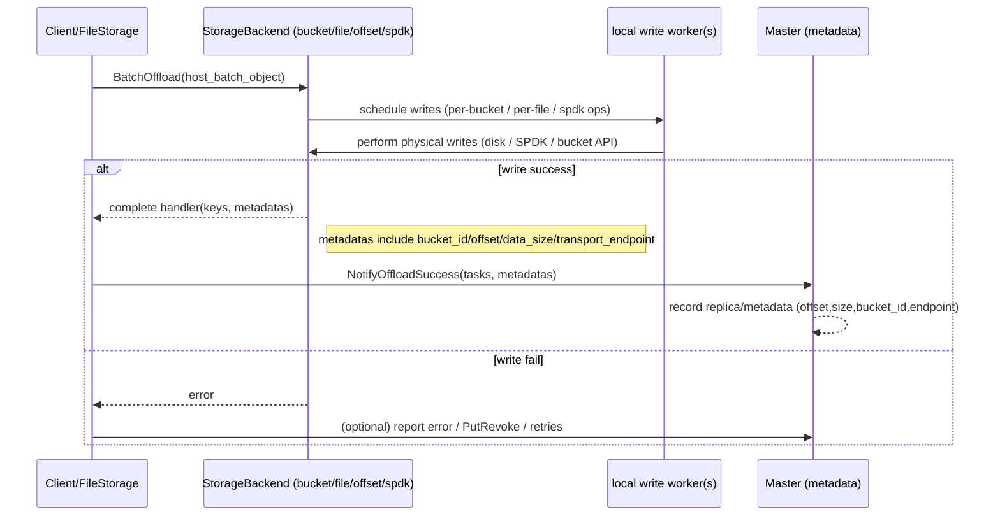

mooncake支持写ssd裸盘吗？

简短结论
- 是的：Mooncake 后端写 SSD 时是不是“裸盘写”（raw write）以及 Master 如何记录位置取决于选用的 storage backend 类型。无论后端类型如何，最终 Master 都通过由客户端（FileStorage）上报的 StorageObjectMetadata（包含 offset/size/bucket_id/transport_endpoint 等字段）来记录对象的持久化元数据。也就是说：物理写入由 storage backend（或 SPDK/NOF 层）执行，Master 不直接写盘；Master 记录的元数据（offset + length / bucket id / etc.）用于后续定位与恢复。

关键代码点（快速证据）
- StorageObjectMetadata 定义（types.h）包含 bucket_id、offset、key_size、data_size、transport_endpoint，代表上报给 Master 的持久化对象元数据。
  - mooncake-store/include/types.h (StorageObjectMetadata: bucket_id, offset, key_size, data_size, transport_endpoint)
- FileStorage 把写盘成功后的元数据上报给 Master：
  - 在 OffloadObjects 的 complete handler 中，FileStorage 在对象写入成功后会调用 client_->NotifyOffloadSuccess(tasks, metadatas) 将这些 metadatas 传给 Master（见 file_storage.cpp OffloadObjects）。
- FileStorage 在恢复（Master 重启或 Master 忘记元数据）时，会调用 storage_backend_->ScanMeta() 并用 NotifyOffloadSuccess 逐批把本地持久对象注册回 Master（见 file_storage.cpp ReRegisterOffloadedObjects）。

不同 backend 的语义（重要）
- file_per_key_storage_backend（“每 key 一个文件”）
  - 后端通常把每个对象写成单独的文件（文件名或路径可编码 tenant/key/hash）。
  - Master/StorageObjectMetadata 可以用 bucket_id 或 offset 表示为文件标识（实现上可能用 bucket_id==0 + offset==0 或用 metadatas 中的 transport_endpoint/其它字段表示路径）。
  - 定位：通过后端定义的 key/路径来读取，不一定依赖全局 offset。

- bucket_storage_backend（对象放到 bucket/分块里）
  - 后端可能把若干对象聚合到 bucket，bucket_id 标识存放桶，offset/length 在桶内定位对象。
  - Master 记录 bucket_id 与 offset、data_size，因此可以定位到桶内偏移并读取该对象。

- offset_allocator_storage_backend（大区域 + offset 分配）
  - 后端在大的 preallocated 文件/区域上分配连续区块（offset），把对象直接写入该偏移。Master 需要 offset 与 data_size 才能找到数据。
  - 这更接近“裸盘写（按偏移写）”的语义：对象以 offset+size 在单个大型容器文件/设备中存储。

- distributed / external backends（例如 S3 / object storage）
  - 后端可能返回一个外部标识（bucket/key/URI）而不是本地 offset；Master 存储相应的元数据字段（StorageObjectMetadata 结构会被填充恰当的字段）。

- SPDK / NOF / NVMe 原语（USE_NOF）
  - 当使用 SPDK 或 NVMe-oF 路径时，底层可能使用 LBA/segment handles。Transfer/NOF 子系统中使用的结构（SpdkNofTask）包含 seg_handle、lba、lba_count —— 这类后端会以 LBA/segment 形式管理定位信息。Master 侧会以 StorageObjectMetadata 或特殊 descriptor 记录可重建的元数据（例如 seg id + lba + length）。

端到端时序（简化 Mermaid / 流程说明）
- 场景：Client（FileStorage）把若干对象 offload 到后端，写入成功后把元数据上报给 Master。

Mermaid（简化）：

解释要点
- “裸盘写”层面：若后端是 offset allocator 或使用 SPDK，写操作确实可能是按偏移（或 LBA）直接在大型文件或裸设备上写入，这与“裸盘写”语义接近；若是 file-per-key，写的是独立文件；若是 bucket backend，写入是通过后端 API（例如 S3）完成。换句话说，物理写法由 storage backend 决定，不由 Master 直接控制。
- Master 的角色：Master 不直接管理物理 bytes；它保存指向持久化位置的元数据（bucket_id、offset、data_size、transport_endpoint 等），以便读/evict/恢复时定位这些对象。
- 恢复与重注册：在 Master 丢失元数据或 Master 重启时，FileStorage 会通过 ScanMeta 把后端中的对象列表与其存储的 metadatas 批量上报给 Master（ReRegisterOffloadedObjects），Master 用上报的元数据重新构建索引/记录。

实务建议
- 如果你需要“按偏移随机写并由 Master 记录偏移”这种语义，选择 offset_allocator_storage_backend 或支持 SPDK 的 NOF 后端更贴合。file_per_key 更适合按对象单独存文件的场景。bucket_backend 适合对象存储与多租户分桶场景。  
- 监控与配置：观察 FileStorage::OffloadObjects 中对错误（例如 KEYS_ULTRA_LIMIT）的处理，设置合适的 offload 配额与 GC 策略，确保主从元数据的一致性和恢复路径（ScanMeta/NotifyOffloadSuccess）可靠运行。  
- 注意权限/路径与安全：当后端是本地文件或裸设备时，FileStorage 的 ValidatePath 会检查写权限并拒绝含 “..” 或符号链接等潜在不安全路径（见 FileStorage::ValidatePath）。