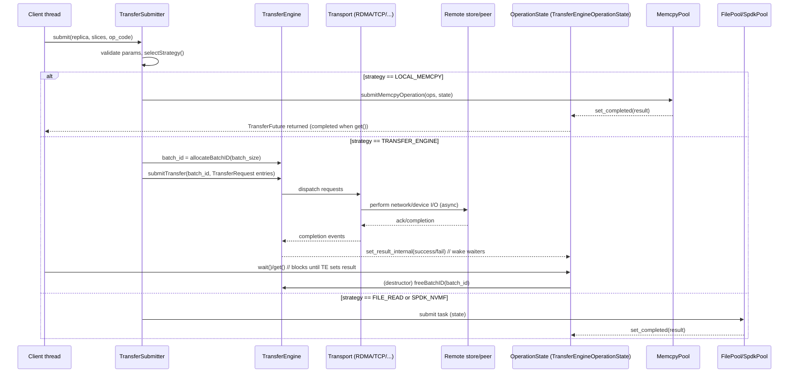
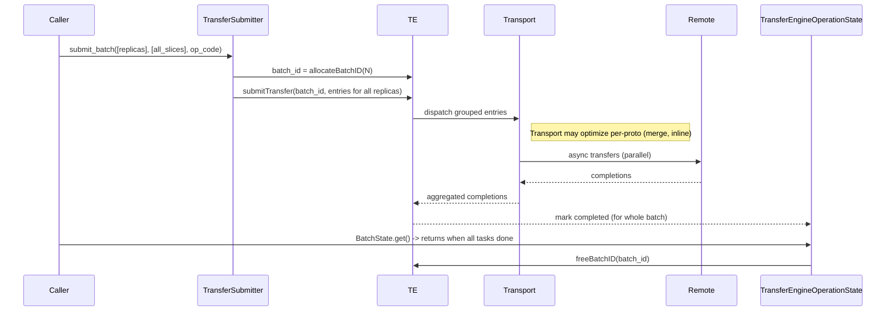
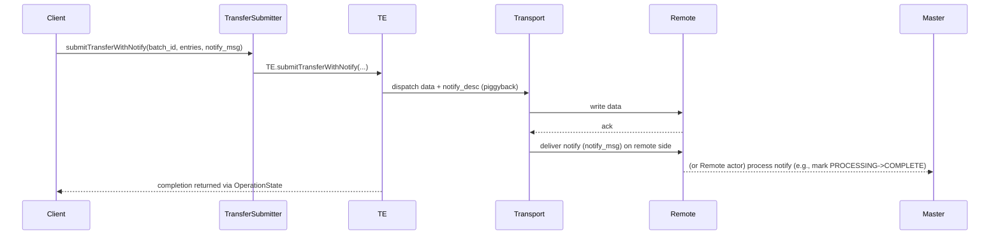

# Mooncake — Transfer Engine发送执行流程分析

直接结论（摘要）
- Transfer 发送由两部分协同完成：Client 侧的 TransferSubmitter（策略选择、构建请求、分配 batch id、提交异步 future）和 TransferEngine（多传输/多协议的实现层，安装各类 Transport 并调度实际 I/O）。  
- 提交后得到一个 TransferFuture；内部有 OperationState（Memcpy/FileRead/Spdk/TE 类型）负责等待与返回 ErrorCode。TE 通过批次 id + transport 实现异步完成与通知（notify 或 getNotifies）。  
- 发送路径支持多种策略（LOCAL_MEMCPY、TRANSFER_ENGINE、FILE_READ、SPDK_NVMF），会在 TransferSubmitter.selectStrategy 中选择并用对应 worker pool 或直接调用 TE.submitTransfer。  
- 核心同步点：AllocateBatchID → submitTransfer(...) → TE/Transport 异步传输 → TE 通知或查询完成 → TransferFuture.get()/wait() 返回结果 → freeBatchID。下文给出详细分层说明与时序图，并讨论异常/重试、内存注册与调优建议。

目录
1. 组成要素（主要类 / 概念）
2. 发送流程分解（步骤说明）
3. TransferSubmitter 的策略分支与 worker pools
4. TransferEngine 内部（传输与 transport 安装、内存注册、batch 管理）
5. 时序流程图（Mermaid）
  - 普通单个传输（TransferSubmitter.submit）
  - 批量传输 submit_batch
  - submitTransferWithNotify（写 + notify 场景，例如 promotion commit）
6. 错误处理、超时、状态查询
7. 性能 & 调优建议
8. 参考源码位置

---

1) 组成要素（主要类 / 概念）
- TransferSubmitter  
  - 入口：submit(const Replica::Descriptor& replica, vector<Slice>& slices, op_code) 及 submit_batch、submitRangeRead、submit_batch_get_offload_object、submitTransfer 等。  
  - 责任：验证参数、选择 TransferStrategy、基于策略路由到 memcpy pool / file read pool / spdk pool / TE submit。创建并返回 TransferFuture（封装 OperationState）。

- OperationState 与 TransferFuture  
  - OperationState 的派生类：MemcpyOperationState, TransferEngineOperationState, FilereadOperationState, SpdkNofOperationState, EmptyOperationState。  
  - TransferFuture 封装 shared_ptr<OperationState>，提供 isReady/wait/get。

- TransferEngine  
  - 实际传输实现封装（TransferEngineImpl 或 tent）。提供 API：allocateBatchID、submitTransfer、submitTransferWithNotify、registerLocalMemory 等。  
  - 管理 Transport（多协议：rdma/tcp/ascend/nvlink/cxl/…）和内存 region 的注册。

- Transport（在 TransferEngineImpl 管理的各个 transport）  
  - 真正做网络/设备 I/O 的模块；Transport::registerLocalMemory、submit 等是其接口（实现细节在 transport/* 目录）。

- Worker pools（在 TransferSubmitter 中）  
  - memcpy_pool_（MemcpyWorkerPool）: 用于 local memcpy 操作（异步执行）。  
  - fileread_pool_（FilereadWorkerPool）：做文件读取（异步）。  
  - spdk_nvmf_pool_（SpdkNofWorkerPool）：用于 SPDK NVMe-oF 操作（当 USE_NOF 可用）。  

---

2) 发送流程分解（高层步骤）
1. 上层（Client）准备要传输的数据 slices，并调用 TransferSubmitter::submit(...) 或 submit_batch(...)。  
2. TransferSubmitter.validateTransferParams(...) 做参数验证（handles、slices 长度、alignment 等）。  
3. TransferSubmitter.selectStrategy(...) 基于 Replica 描述（handle）、本地 endpoint 与配置（memcpy_enabled 等）选择策略：  
   - LOCAL_MEMCPY：目标在同一进程/地址空间或 TE 判定可直接 memcpy。  
   - TRANSFER_ENGINE：跨进程/跨节点，使用 TransferEngine/Transport（RDMA/TCP/...）。  
   - FILE_READ：源是文件，需要 fileread_pool 异步读取。  
   - SPDK_NVMF：SPDK NVMe-oF 操作（USE_NOF）。  
4. 如果是 TRANSFER_ENGINE：  
   - TransferSubmitter 构造 TransferRequest 列表（每个 request 指明 source、target_id/target_offset、length、op_code 等）。  
   - 调用 TransferEngine.allocateBatchID(batch_size) 获取一个 batch id（TE 用于跟踪该批）。  
   - 调用 TransferEngine.submitTransfer(batch_id, entries)（或 submitTransferWithNotify），TE 将请求下发到对应 Transport。  
   - 创建 TransferEngineOperationState(engine, batch_id, batch_size) 作为 OperationState；TransferFuture 封装该 state 返回给调用方。  
5. 如果是 LOCAL_MEMCPY / FILE_READ / SPDK：TransferSubmitter 会把操作封装为对应任务并提交到对应 worker pool，create 对应 OperationState（MemcpyOperationState / FilereadOperationState / SpdkNofOperationState），返回 TransferFuture。worker 在后台执行、在完成时 set_completed(error_code) 并通知 condition_variable。  
6. 调用方可以调用 TransferFuture.get() / wait() 阻塞直到完成；内部实现会等待 OperationState 的完成标志并返回 ErrorCode。对于 TE 操作，TransferEngineOperationState 的 is_completed()/wait_for_completion 会查询/等待 TE 的完成（通过 TE 的 getBatchTransferStatus/getTransferStatus 或 TE 的 notify 机制）。

---

3) TransferSubmitter 的策略分支与 worker pools（实现要点）
- selectStrategy(...) 基于 AllocatedBuffer::Descriptor（handle）与 slices 决定：
  - 如果 handle 标识本地内存 region（isLocalTransfer 返回 true）并且 memcpy_enabled_，会选 LOCAL_MEMCPY，以避免网络堆栈开销。
  - 如果 handle 表示 SPDK/NOF storage（USE_NOF），会选 SPDK_NVMF（提交到 spdk_nvmf_pool_）。  
  - 如果 replica 对应的是文件或 file-per-key 后端，会选 FILE_READ 并提交 to fileread_pool_.  
  - 默认跨节点/跨进程情况选择 TRANSFER_ENGINE，通过 TE submit 转发。  
- submitMemcpyOperation(...)：把多个 memcpy ops 打包为 MemcpyTask，提交给 MemcpyWorkerPool 的任务队列，由单独 worker 执行并在完成后设置 MemcpyOperationState::set_completed。  
- submitFileReadOperation(...)：交给 FilereadWorkerPool，由后端 storage_backend_ 的 API 执行读（可能是 O_DIRECT / aligned read），并在完成时 set_completed。  
- submitSpdkNofOperation(...)：交给 SpdkNofWorkerPool 做 NVMe-oF I/O 子任务与 QoS 管理。

---

4) TransferEngine 内部（传输与 transport 安装、内存注册、batch 管理）
- Transport 安装（TransferEngineImpl::init）  
  - 根据编译时选项与运行时环境自动安装合适 transport（rdma、tcp、ascend、nvlink、cxl 等），通过 MultiTransport 管理。  
  - Transport 在 install 时会把已注册的本地内存 region 注册到该 transport（transport->registerLocalMemory）。

- 内存注册（registerLocalMemory / registerLocalMemoryBatch）  
  - TransferEngineImpl 在向 transport 注册本地缓冲时检查地址重叠，并为每个 transport 调用 transport->registerLocalMemory(...)；若失败需回滚。  
  - 支持多协议注册（ENABLE_MULTI_PROTOCOL 情形）。

- Batch 管理  
  - TransferEngine.allocateBatchID(batch_size) 为一组 TransferRequest 分配一个 BatchID（TE 用来聚合和跟踪）。  
  - submitTransfer(batch_id, entries) 把 entries 交给 impl_->submitTransfer，impl 将请求下传到具体 transport 的 submit，transport 返回立即（通常为异步，TE 内部注册监控）。  
  - TransferEngine.freeBatchID(batch_id) 在 TransferEngineOperationState 析构时调用以释放资源。

- 通知机制  
  - TE 支持 submitTransferWithNotify(...)：在某些场景需要传输完成时立即触发目标端逻辑（例如写入完成后触发 remote notify），TE/transport 支持发送 notify 消息（TransferMetadata::NotifyDesc），并可通过 getNotifies() 在接收端处理通知。  
  - TE 也提供 getTransferStatus/getBatchTransferStatus 接口供轮询/检查。

- Transport 的职责  
  - 依据请求实现低延迟数据移动（RDMA verbs / RoCE / TCP send/recv / NVLink / device p2p）。  
  - 维护 per-transport completion/notification 机制，并通过 TE impl 把完成状态映射到 BatchID/task_id。

---

5) 时序流程图（Mermaid）

A. 单个传输（TransferSubmitter.submit → TE → Transport → Remote）：

B. 批量提交（submit_batch） — 多个 requests 合成一个 Batch：

C. submitTransferWithNotify（带 notify） — 写 + remote notify（例如 Promotion commit）

说明：
- submitTransferWithNotify 允许在传输完成时把一个 notify（结构化消息）发往接收方，以便触发接收端的元数据 commit（常见于 promotion commit / staged replica finalization）。

---

6) 错误处理、超时、状态查询
- OperationState.get_result / set_completed：worker/TE 在完成时把 ErrorCode 写入 result_ 并 notify condition_variable。TransferFuture.get() 读取并返回该错误码。  
- TE 支持 getTransferStatus / getBatchTransferStatus：用于轮询单个 task 或整个 batch 的状态（TransferEngine::getTransferStatus / getBatchTransferStatus）。TransferEngineOperationState::check_task_status() 会调用这些接口以实现 wait_for_completion 的轮询/等待逻辑。  
- 批次失败：Transport/TE 将失败原因映射成 ErrorCode，最终由 TransferFuture 返回调用方，调用方会在业务层决定 retry / revoke。  
- notify 机制（submitTransferWithNotify / getNotifies）：用于把传输完成事件传递到目标端以便目标端能执行后续原子 commit（例如 Master 的 PromotionCommit / NotifyPromotionSuccess 场景）。  
- 资源释放：TransferEngineOperationState 的析构会调用 engine_.freeBatchID(batch_id_) 释放 TE 内部资源。

---

7) 性能 & 调优建议
- 合并/批量化：使用 submit_batch 合并同一 endpoint 的多个 requests，减少 TE/transport 的 per-request overhead。  
- 内存注册：提前 batch registerLocalMemory（registerLocalMemoryBatch）可以减少每次传输时的注册开销，尤其在 RDMA/CXL 等需要内存注册的 transports 上。protect against overlap。  
- LOCAL_MEMCPY 优化：对同机/同进程路径启用 memcpy_enabled_ 可以极大降低开销（避免网络栈），但要保证地址确实可直接 memcpy（isSameProcessEndpoint 检查）。  
- worker pools：调整 memcpy_pool_、fileread_pool_ 与 spdk_nvmf_pool 的线程数以配合 CPU 与 I/O 带宽（例如 NVMe 容错或 RDMA HCA 并行度）。  
- batch size：allocateBatchID(batch_size) 与批量大小平衡 latency vs throughput；过小导致高 overhead，过大导致单次失败代价大。  
- metrics：启用 TE metrics（MC_TE_METRIC）观察 task latency distribution 与吞吐以发现热点。TransferEngineImpl 有周期性 metrics thread 汇报。

---

8) 参考源码位置
- TransferSubmitter / transfer_task.h（策略、OperationState、TransferFuture、worker pools、submit 接口）：`mooncake-store/include/transfer_task.h`  
- TransferEngine API（外壳）: `mooncake-transfer-engine/src/transfer_engine.cpp`  
- TransferEngineImpl（transport 安装、memory register、submitTransfer / submitTransferWithNotify / allocateBatchID / freeBatchID / getNotifies / metrics）：`mooncake-transfer-engine/src/transfer_engine_impl.cpp`  
- Transport implementations：`mooncake-transfer-engine/src/transport/*`（具体 transport 如 rdma、tcp、nvlink 等）

---

补充（常见场景示例）  
- Promotion（L2→L1）用 TE 写并可能在 submitTransferWithNotify 中携带 notify，写入结束后远端通过 notify 做 commit（或客户端再调用 NotifyPromotionSuccess）。  
- Offload/BatchGetOffloadObject：submit_batch_get_offload_object 用于“把多个 keys 由 offload backend 批量读回到 remote pointers”的场景，TransferSubmitter 会构造批量请求并提交到 TE。
