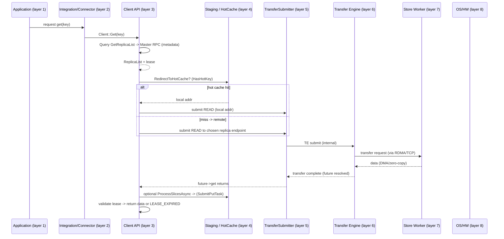
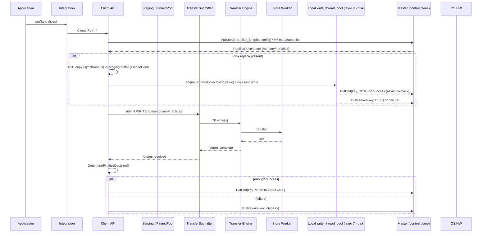
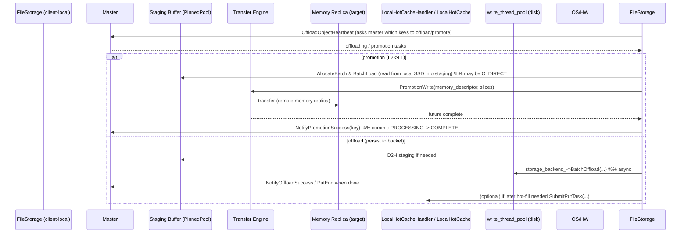

# Mooncake IO 流水线层级分析（Pipeline Layers）

摘要（直接结论）  
- Mooncake 的 I/O 流程可以分为 8 个逻辑层级（从上到下）：应用层、integration/connector、客户端 API 层、本地 staging / hot cache 层、TransferSubmitter（client-side adapter）、Transfer Engine（数据平面）、Store Worker / Storage Backend（远端块/SSD/文件层）、底层 OS/硬件（内核、NIC、NVMe）。  
- 每层有明确职责：调用/业务语义 → 参数与元数据管理 → 本地缓冲与零拷贝注册 → 传输的组织与调度 → 传输实现与多协议支持 → 目标节点接收与存储。  
- 读写路径跨越这些层级，并在多个点产生同步阻塞（D2H、future->get、metadata RPC）与异步执行（write_thread_pool、hot cache handler、TE 内部 IO 线程）。  

下面按层级逐一说明，再给出三个关键场景的时序图（读、写、disk offload / promotion / hot cache 填充）。

---

## 一、总览：8 个逻辑流水层级（自上而下）
1. 应用层（Application / Worker）  
   - 典型角色：prefill workers、decode workers、vLLM 等上层推理组件。  
   - 作用：产生日志/请求（prefill 生成 KVCache；decode 请求 KVCache）；负责业务重试策略与高层并发控制。  
   - 同步点：调用 Client API，等待最终返回（可能被传输/IO 阻塞）。

2. Integration / Connector（框架适配层）  
   - 典型文件：mooncake-integration/allocator.py、connectors。  
   - 作用：把应用语义映射成 Mooncake 的 Put/Get/Upsert/Query 调用，提供设备选择、分配偏好、batch 化策略。  
   - 特别：可以合并请求（batch）以提高下游吞吐。

3. 客户端 API 层（Client library）  
   - 典型代码：Client::Get / Put / Query / PutStart（client_service.*）。  
   - 作用：联系人 Master（元数据），发起 PutStart/GetReplicaList，决定使用哪些 replicas、是否本地缓存命中、是否需要 D2H。  
   - 同步点：metadata RPC（PutStart / GetReplicaList / PutEnd / PutRevoke）——为控制平面的原子点；调用线程会等待一些 RPC 响应。  
   - 负责：创建 TransferSubmitter、管理 write_thread_pool、task_thread_pool、heartbeat、leader monitor。

4. 本地 staging / hot cache 层（Local Memory & Staging）  
   - 典型组件：LocalHotCache、PinnedBufferPool、AlignedClientBufferAllocator、AllocateBatch。  
   - 作用：提供固定大小块（hot cache blocks）、客户端临时 staging buffer（D2H 后保存数据以供 I/O），可选共享内存（shm）。  
   - 特点：大块分配、LRU + deferred touch、ref_count；AcquirePutToken/IsPutTokenValid 保证异步 publish 安全。  
   - 同步点：D2H（Device->Host）通常在调用线程同步完成；数据复制到 staging 之后可以异步提交给后层。

5. TransferSubmitter（client-side adapter / batching）  
   - 作用：把客户端的读/写请求组织成 TE 可提交的单元或 batch，进行 endpoint 合并、路径选择、retry 策略的封装。  
   - 优化：submit_batch 把同一 endpoint 的多个请求合并，减少 RTT。  
   - 同步点：提交后返回 future；调用线程可能等待 future->get()。

6. Transfer Engine（TE，数据平面）  
   - 典型模块：transfer_engine/src（multi_transport、topology、transport adapters）。  
   - 作用：负责高吞吐传输实现（RDMA / TCP / NOF / NVMe-oF / NVLink / CXL 等），基于拓扑做路径选择、多 NIC 聚合、零拷贝/内存注册。  
   - 线程：TE 自身通常运行 I/O / poll / progress 线程，处理网络消息与数据移动。  
   - 同步点：传输完成通过 future/callback 通知 client。

7. Store Worker / Storage Backend（目标节点的接收和持久化）  
   - 典型组件：Store worker 服务逻辑、storage_backend（file_storage、spdk、bucket 后端等）。  
   - 作用：根据 replica 类型把数据写入内存 replica、NoF SSD、或磁盘（文件或 bucket）；执行 PutEnd/PutRevoke 逻辑、更新 Master（或由 client 调用 master）。  
   - 异步点：对 disk 的写通常在本地后台线程（write_thread_pool）异步完成；成功回调通知 Master。

8. OS / Kernel / HW（设备层）  
   - 包括：内核网络栈、RDMA 驱动、NIC、NVMe 驱动、DMA 引擎。  
   - 作用：最终提供网络传输与磁盘 I/O 的实际执行与 DMA 加速。  
   - 可见行为：zero-copy RDMA, DMA offload, interrupt / poll-driven IO。

---

## 二、每层的职责/设计意图（简要）
- 应用层：保持业务正确性、重试/超时控制、batch/合并策略决定。  
- Integration：做命名、优先段、device 选择等“策略”转换。  
- 客户端 API：控制平面交互（master RPC）、构建 replica list、决定哪个副本用于读/写，管理本地线程池/心跳/任务。  
- Staging/HotCache：减少远程传输的频率（命中本地 hot cache），以及做 Device→Host 的安全临时缓冲，减少 D2H 的重复。  
- TransferSubmitter：把高层请求平滑成 TE 可接收的传输单元，合并同端点请求、选择策略。  
- TE：实现高性能传输并屏蔽底层 transport 多样性。  
- Store Worker / Storage Backend：在目标节点上接收 bytes 并持久化或暴露为 replica（在内存中注册 buffer），维护 replica 状态与对 Master 的回调。  
- OS/HW：实现最终的物理传输与 I/O。

---

## 三、关键同步 / 异步点（全局视角）
- 同步（会阻塞调用线程）：
  - metadata RPC（PutStart / GetReplicaList / PutEnd）——客户端等待 Master 响应以继续；
  - D2H staging（Device→Host）拷贝（通常在调用线程同步完成以保证源 buffer 生命周期）；
  - 等待 transfer future->get()（读/写传输完成的同步点）。
- 异步（后台完成）：
  - disk 写入由 write_thread_pool 执行，完成后异步回调 Master；
  - hot cache publish 在 hot cache worker 中完成（SubmitPutTask 将 memcpy 与 publish 解耦）；
  - TE 内部数据流由 TE 线程驱动，不在调用线程阻塞（除了等待 future）。

---

## 四、时序流程图（Mermaid）

下面给出 3 个典型场景的时序图：Read（从远端 / hot cache）、Write（memory/noF + disk）、Offload（disk offload / promotion）。

注：图中列出的“层”对应上面 8 层的抽象，便于对照。

### 1) Read（Get）流程 — 跨层序列

关键点：
- 在 hot cache 命中时尽可能走本地零拷贝路径；若 miss，TE 做远端读取并通过 future 异步通知客户端完成。
- 在传输完成后，客户端可能异步填充 hot cache（SubmitPutTask），使未来命中更多本地访问。

### 2) Write（Put）流程 — memory/NOF + disk hybrid

关键点：
- D2H 在调用线程同步完成（可能是主要的阻塞开销），但实际磁盘 I/O 交给 write_thread_pool 执行；
- Transfer 到 memory/NOF 由 TE 执行并通过 futures 通知客户端，客户端通过 PutEnd/PutRevoke 决定最终元数据状态。

### 3) Disk Offload / Promotion / Hot Cache Fill（混合流程）

关键点：
- Promotion 使用“staging -> TE write -> NotifyPromotionSuccess”两阶段语义保证 atomic commit；
- Offload 写盘可能涉及 O_DIRECT、aligned buffers、staging buffers 和后端分桶逻辑，完成后要 NotifyOffloadSuccess 给 Master 注册元数据。

---

## 五、实践性说明与优化建议（与流水层相关）
- 尽量减少调用线程的同步 D2H：把 D2H 批量化、提前 staging，或把尽可能多的工作放入 write_thread_pool / staging pipeline。D2H 是调用路径的主要阻塞点。  
- 使用 submit_batch 在 TransferSubmitter 层合并相同 endpoint 的多次传输，减少 RTT 并提高带宽；这是跨应用层与 TE 的重要吞吐优化。  
- HotCache 的 Put 异步化把 publish（LRU 更新等锁操作）放到专门 worker，从而减轻调用线程压力。确保 token/epoch 机制正确以避免 stale publish。  
- 调整 block_size 与 hot cache 大小：较大 block 能减少管理开销与 NVM 对齐复杂性，但会增加内存碎片与读写单位大小的浪费；根据典型 tensor 大小调优。  
- 监控点：TE transfer latency、write_thread_pool queue length、hot cache task queue depth、master rpc latency、D2H copy time 分布。

---

## 六、参考源码位置（快速定位）
- Client 与控制平面交互 / 线程成员：`mooncake-store/include/client_service.h`、`mooncake-store/src/client_service.cpp`  
- Hot cache / async handler：`mooncake-store/include/local_hot_cache.h`、实现文件（local hot cache impl）  
- FileStorage / staging / offload：`mooncake-store/src/file_storage.cpp`  
- Transfer Engine：`mooncake-transfer-engine/src/*`（multi_transport, topology, transport adapters）  
- Storage backend / disk IO：`mooncake-store/include/storage_backend.h`、`file_storage.cpp` 中的 CreateStorageBackend / BatchOffload  

---
