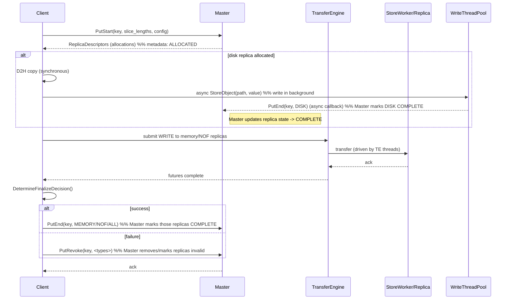
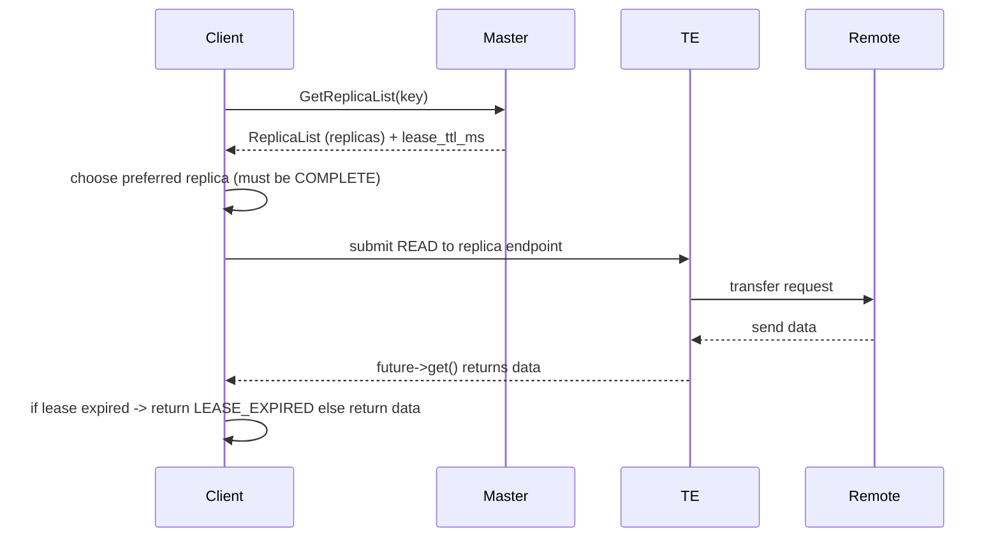
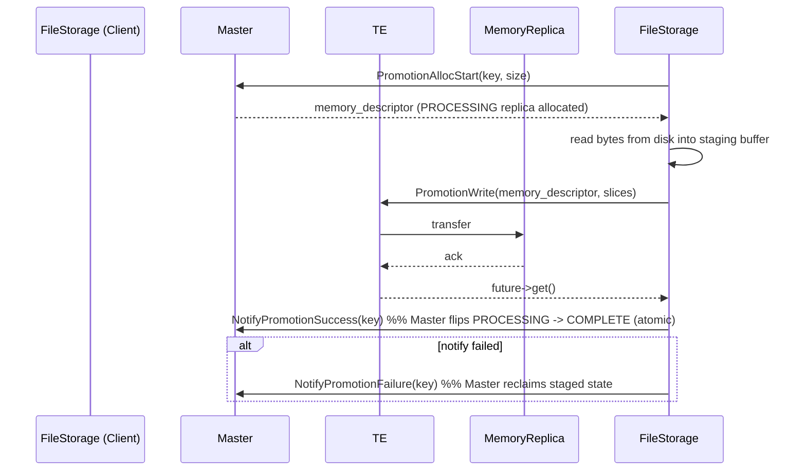
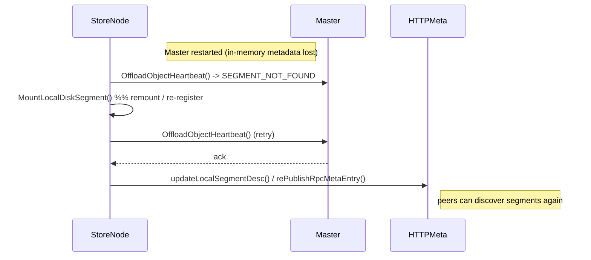

# Mooncake — 一致性保证机制分析

概览（直接结论）
- Mooncake 的一致性模型是“工程化的弱一致性 + 局部强语义”：
  - 对象元数据由 Master 做强一致管理（通过 leader / HA 后端），Master 保证对 replica 分配、finalize（PutEnd/PutRevoke/NotifyPromotionSuccess 等）的线性化更新。
  - 数据平面（Transfer Engine）在短时窗口内依赖 Master 返回的 replica 描述 + lease（短期租约）来保证传输期间元数据不变。lease 是防止竞态的关键短期一致性机制。
  - 对于异步/部分成功情况（磁盘异步写、跨节点复制失败），系统使用明确的 End/Revoke/Notify 接口与幂等回退，并通过重试、reaper、心跳和任务机制保证最终一致性或回滚。
- 补充机制：Put token / cache epoch（用于 hot cache）与 Promotion staged replica（PROCESSING）引入额外的本地并发防护与可恢复的两阶段完成语义。

下文按主题分解机制、保证的语义、典型时序与代码对应点，并给出 Mermaid 时序图帮助说明。

---

## 1) 关键原语与它们的语义（源码关联）
- PutStart / PutEnd / PutRevoke（Client ↔ Master）  
  - PutStart：Master 分配 replica 描述并在元数据中记录“分配”意向（ALLOCATED/PROCESSING）；调用者随后向这些副本写入数据。  
  - PutEnd：客户端通知 Master 某类 replica 已成功完成（例如 MEMORY/NOF/ALL 或 DISK），Master 将对应 replica 标记为 COMPLETE 并使其对读取可见。  
  - PutRevoke：客户端通知 Master 回滚或撤销特定类型的 replica（例如写入失败或回滚场景）。  
  - 语义：这些接口构成 Put 的 Start → Transfer → Finalize 三阶段协议。Master 端是元数据的线性化点（最终状态由 PutEnd/PutRevoke 决定）。
  - 代码位置：client_service.h / client_service.cpp 的 Put / PutToLocalFile / DetermineFinalizeDecision / FinalizeBatchPut 等。

- GetReplicaList / lease（Query / Get）
  - Master 在返回 replica 列表时同时返回 lease_ttl_ms（GetReplicaListResponse.replicas + lease_ttl_ms）。客户端必须在 lease 有效期内完成传输，否则读操作应检测并返回 LEASE_EXPIRED。
  - 语义：lease 提供短期一致性保证（“在 lease 到期之前，分配信息不会被 Master 单方面修改或回收”——实现上防止读/写的元数据 race）。
  - 代码位置：rpc_types.h (GetReplicaListResponse)，client_service.cpp 中 Query/TransferRead 路径。

- PromotionAllocStart / NotifyPromotionSuccess / NotifyPromotionFailure（Promotion two-phase）
  - PromotionAllocStart：Master 为 L2->L1 promotion 分配一个 PROCESSING MEMORY replica（staged buffer）。
  - PromotionWrite：客户端将 bytes 写入 PROCESSING replica（通过 TE）。
  - NotifyPromotionSuccess：客户端告知 Master commit：Master 将 PROCESSING 转为 COMPLETE，读者可见。
  - 如果失败：NotifyPromotionFailure 撤销 Master 的 staged state（幂等）。
  - 语义：为 promotion 提供显式的“staging + commit”语义，类似短事务。
  - 代码位置：client_service.h / file_storage.cpp（ProcessPromotionTasks）。

- RegisterLocalMemory / MountSegment / ReMount（segment registration）
  - 节点把本地内存段注册到 TE 并调用 Master.MountSegment（或 MountLocalDiskSegment），Master 将 segment 注册到元数据并将 segment 描述发布到 HTTP meta。Master 重启时节点会在 Heartbeat 中触发 ReMountSegment 并重新 publish metadata。
  - 语义：保证 Master 与数据平面之间对 segment/endpoint 的可达性与元数据一致；重启恢复逻辑保证元数据丢失后节点可重新注册并重新产生可访问描述。
  - 代码位置：client_service.h、file_storage.cpp（RegisterLocalMemory / MountLocalDiskSegment / Heartbeat）。

- Lease / token / epoch（本地并发控制）
  - Hot cache 使用 HotCachePutToken（cache_epoch、key_generation），LocalHotCacheHandler 在异步 publish 前验证 token，避免 stale publish（当 key 被 Remove 或 generation bumped 时，token 失效）。
  - 语义：解决本地（hot cache）异步填充与删除并发问题，保证本地缓存状态与 Master 元数据语义不会互相冲突。
  - 代码位置：local_hot_cache.h（HotCachePutToken、AcquirePutToken、IsPutTokenValid、BumpKeyGeneration）。

---

## 2) 一致性等级与延展语义
- 强一致（控制平面元数据）：Master 在元数据（key -> replica list, replica status）上的操作是由 Master 序列化并通过 HA（etcd / k8s-lease）保证 leader 单一性，从而在控制平面上提供线性化更新（元数据的最终状态由 Master 决定）。
- 短期合法性（lease）：客户端基于 Master 发放的 lease 在短时间内可以安全地依赖所返回的 replica 描述做传输；lease 过期后 Master 可能对 replica 做出不同决议，客户端必须检测 lease 并在过期时返回 LEASE_EXPIRED。
- 弱/最终一致（数据面）：由于网络/异步写盘/失败回退的存在，数据在多个副本间最终一致由 End/Revoke/Notify 等 RPC + 重试、task/reaper、heartbeat 等机制保证。
- 原子性（per-operation）：每一次 Put/Promotion 等客户端到 Master 的 finalize 调用（PutEnd / NotifyPromotionSuccess）是元数据层面的原子点，决定 replica 是否对读者可见。

---

## 3) 典型时序图（Mermaid）

> 注意：图里简化了网络与多副本并行写的细节以突出一致性点（lease、PutEnd/PutRevoke、NotifyPromotionSuccess 等）。

### A — Put（三阶段：Start → Transfer → Finalize）

一致性要点：
- 在 PutStart 之后到 PutEnd 之前，replica 状态在 Master 侧通常不是 COMPLETE，读者不会选择这些副本（Master 的 GetReplicaList 返回 COMPLETE 副本或会给 lease，但客户端选择 COMPLETE）。
- PutEnd 是使新的 replica 对读者可见的原子事件。若传输失败或回滚，PutRevoke 撤销分配，保证不会暴露损坏/部分写的数据。

### B — Get + Lease（Query → Transfer → validate lease）

一致性要点：
- 客户端必须检查 lease（在 transfer 完成后也要再检查）；如果 lease 在传输期间过期，客户端必须返回 LEASE_EXPIRED，避免基于已失效元数据读到不可保证的数据。

### C — Promotion（L2 -> L1 两阶段）

一致性要点：
- Promotion 使用 explicit staging + commit，保证在 commit 之前读者看不到 PROCESSING replica（只有 NotifyPromotionSuccess 将其标为 COMPLETE）。
- NotifyPromotionFailure 是安全幂等的回滚接口。

### D — Master restart & Segment remount (metadata recovery)

一致性要点：
- Master 重启会丢失内存元数据（若没有外部 persistent store）；节点通过 Heartbeat / ReMount 重新注册其 segments 与 offloaded object metadata（FileStorage::ReRegisterOffloadedObjects）。
- Master 与节点之间通过 explicit re-registration 与 idempotent NotifyOffloadSuccess 等 RPC 逐步恢复全局一致性。

---

## 4) 错误/部分成功处理与最终一致性
- 部分成功（某些 replica 写成功、另一些写失败）：
  - 客户端收集 transfer_summary 并通过 DetermineFinalizeDecision 决定是否把成功类别 finalize（PutEnd）或撤销（PutRevoke）。Master 元数据因此反映出最终的成功集合或撤回操作。
- 异步 disk 写失败：
  - Storage 后台线程在失败时调用 PutRevoke(key, DISK)，Master 会移除该 disk replica 元数据并可触发重试或上层报警。
- Master 重启导致元数据遗失：
  - 节点在 Heartbeat 中会重新注册 segments 与 offloaded object metadata（ReRegisterOffloadedObjects），通过 NotifyOffloadSuccess 等幂等 RPC 恢复 Master 的元数据。若阶段性状态（PROCESSING）存在不确定性，reaper 或 TTL 会在 Master 侧回收或重新调度。
- 幂等与回收：
  - NotifyPromotionSuccess / NotifyPromotionFailure / PutEnd / PutRevoke 等接口在设计上要支持幂等调用（源码注释中多处提及“idempotent”），以便在网络抖动或 retry 时 Master 状态不会被错误重复申请。

---

## 5) 并发控制与避免竞态的实践要点
- Lease 检查：在客户端在传输后再次检查 lease（QueryResult.IsLeaseExpired），保证读写依赖的元数据在传输期间仍然有效。
- Put token / cache epoch：对于本地缓存异步 publish，token 防止在 publish 前 key 已被删除或 generation bumped；避免 stale hot cache entry。
- 引入 PROCESSING 状态：Promotion 用 PROCESSING replica 来保证 staged 写入不可见，直到 commit（NotifyPromotionSuccess），从而实现原子化 promotion。
- Master 为元数据的唯一序列化点：所有决定（allocation、COMPLETE、REVOKE、task assignment）都在 Master 的序列化路径上进行，从而避免分布式并发更新冲突。

---

## 6) 限制、风险与建议
- lease 窗口短（默认 5s 等配置可见）意味着在高延迟/带宽不足场景下客户端可能频繁遇到 LEASE_EXPIRED；应优化传输（submit_batch、RDMA）或适当延长 lease（谨慎）。
- D2H 在调用线程同步完成会导致写路径的短期阻塞，若频繁发生会影响 Put 的响应并增加 retry/timeout 风险。建议：
  - 采用 pinned buffer pool 与批量化 D2H。
  - 在高延迟网络上调整 PutStart/PutEnd timeout 与 lease 策略。
- Master 重启恢复依赖节点心跳和 re-registration，若节点未及时重试或 Master 与节点之间网络不通，会导致元数据长期不完整；建议配置 HA 后端（etcd / k8s lease）并保证心跳/heartbeat 配置合理。
- 热缓存 token 只保护本地异步 publish，不替代 Master 上的 lease 与复制一致性；不要把 hot cache 当作强一致层。

---

## 7) 参考源码（快速定位）
- 元数据与 RPC types：`mooncake-store/include/rpc_types.h`（GetReplicaListResponse 等）
- Lease 常量与类型：`mooncake-store/include/types.h`（DEFAULT_DEFAULT_KV_LEASE_TTL 等）
- Client Put / Finalize 流程：`mooncake-store/include/client_service.h`、`mooncake-store/src/client_service.cpp`（PutStart / TransferWrite / PutEnd / PutRevoke / DetermineFinalizeDecision）
- Promotion / Offload：`mooncake-store/src/file_storage.cpp`（PromotionAllocStart / PromotionWrite / NotifyPromotionSuccess / NotifyPromotionFailure / OffloadObjects）
- Local hot cache token：`mooncake-store/include/local_hot_cache.h`（HotCachePutToken、AcquirePutToken、IsPutTokenValid、BumpKeyGeneration）
- Segment mount / re-register：`mooncake-store/src/file_storage.cpp`（RegisterLocalMemory、MountLocalDiskSegment、ReRegisterOffloadedObjects、Heartbeat）

---

## 8) 总结（一句话）
Mooncake 通过将控制平面的元数据放在单一 Master（leader / HA 协调）来提供可序列化的元数据更新，结合短期 lease、两阶段的 promotion/put finalize 原语、token 验证、幂等的回退接口与节点心跳/重注册机制，构建了一个在工程实践下能在高性能传输与部分失败情形下保证最终一致性和可恢复性的分布式存储控制面。
