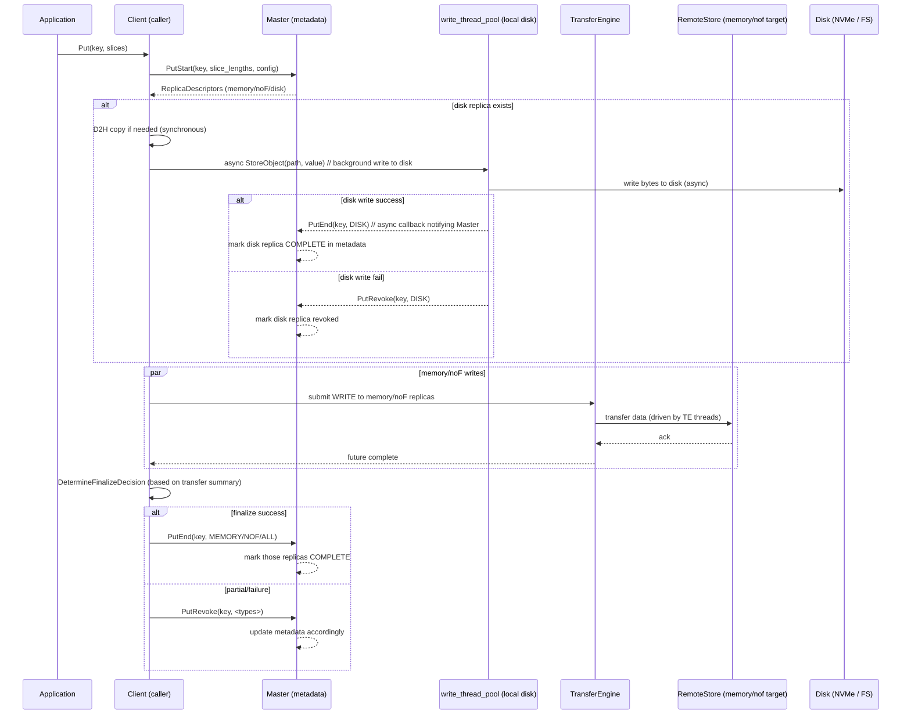
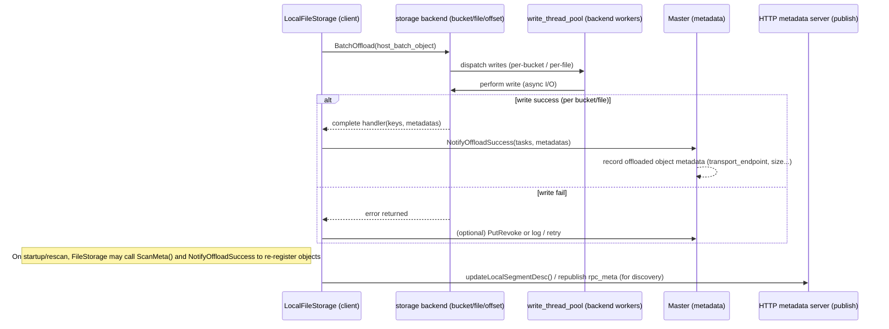
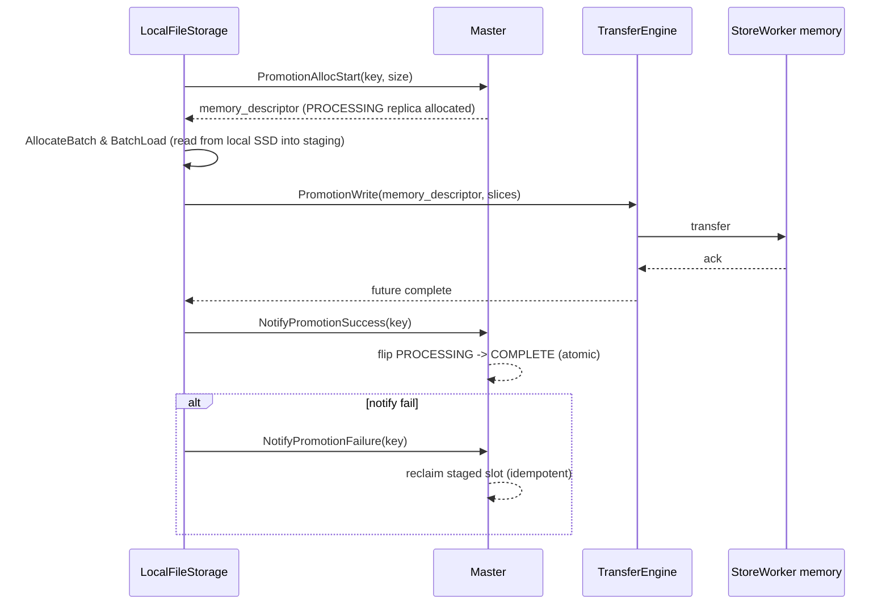

# Mooncake 持久化策略分析

目录
- 概述（什么需要持久化）
- 持久化目标与保证等级（语义）
- 持久化路径与参与组件（端到端层次）
- 典型持久化流程与时序图
  - Put 含 Disk Replica（写入并 finalize）
  - OffloadObjects（把本地对象写到 storage backend 并通知 Master）
  - Promotion（L2->L1，staging + commit）
  - Master 重启后的元数据恢复（ReRegisterOffloadedObjects）
- 错误处理、幂等与回滚
- 配置选项与存储后端差异
- 性能与运维建议
- 参考源码位置

---

## 概述（什么需要持久化）
Mooncake 需要把 KVCache / 对象在三类层面保持或转为持久化：
1. 临时内存副本（MEMORY）——短期内存副本，非持久，依赖 Master 的元数据与节点存活。
2. NoF/直通/SSD 副本（NOF）——高速直通存储，介于内存与磁盘之间。
3. 磁盘/本地持久副本（DISK / LOCAL_DISK / offloaded objects）——持久化到本地文件或后端（bucket / offset allocator / distributed store），用于 eviction、重启恢复或长期保存。

持久化策略要回答两类问题：
- 数据什么时候被视为“持久化完成”（对外可见）？（元数据原子点）
- 发生中断（写失败 / 节点崩溃 / master 重启）时数据如何被恢复或回滚？

---

## 持久化目标与保证等级（语义）
- 元数据可见性原子点：PutEnd / NotifyPromotionSuccess / NotifyOffloadSuccess。只有 Master 在接收到这些成功通知后，才将对应 replica 标为 COMPLETE 并对读者可见。
- 短期可用性语义：客户端在 Master 返回的 lease 有效期内可安全依赖分配的 replica 描述进行传输；超过 lease 则认为元数据可能被变更。
- 最终一致性与幂等回退：对于异步持久化（disk offload、bucket write），系统通过异步回调、PutRevoke / NotifyPromotionFailure / NotifyOffloadSuccess、心跳重试、reaper/TTL 等机制，保证最终要么 commit（Master 可见），要么撤销（Master 回滚元数据）。
- 不保证强同步复制 across multiple distinct persistent backends — Master 是控制平面的单一真相来源（metadata）并保证在其视图下的线性化决策。

---

## 持久化路径与参与组件（端到端层次）
从上到下参与组件与责任：
1. 应用 / Prefill（生成 object bytes）  
2. Integration / Client API（Client::Put / PutStart）——向 Master 请求分配副本、得到 replica_descriptors（包含 disk descriptors）  
3. 本地 staging（D2H / pinned buffers / AlignedClientBufferAllocator）——若 slice 在 GPU 上，D2H 在调用线程同步完成，或使用 pinned pool 进行临时缓冲  
4. write_thread_pool / StorageBackend（异步写盘逻辑）——实际把数据写到文件/bucket/offset allocator 等后端  
5. Transfer Engine（TE） & TransferSubmitter（网络传输）——如果目标是 memory/NOF replica，TE 做传输（RDMA/TCP/NOF）  
6. Master（元数据）——在 PutEnd/PutRevoke/NotifyOffloadSuccess 等 RPC 到达时更新元数据，决定 replica 是否 COMPLETE / visible  
7. HTTP Metadata / TE metadata — 用于 segment / endpoint discovery  
8. OS/HW（NVMe / network / drivers）——最终完成持久 I/O

关键点：磁盘持久化通常是异步（后台 I/O）且需要主动回调 Master 通知成功（NotifyOffloadSuccess / PutEnd(disk)）以将元数据状态切换为 COMPLETE。

---

## 典型持久化流程与时序图

下面给出若干典型场景的时序图（Mermaid），以说明数据从申请分配到真正“持久化并元数据可见”的端到端流程。

注意：图中“Client”通常为 FileStorage/Store client 的角色；“Master”为控制平面；“WritePool”指本地异步写线程池或 storage backend 的异步 worker；“TE/Remote”表示网络传输情形下的远端 store。

### 场景 A：Put 含 Disk Replica（写 + finalize）
- 场景说明：上层发起 Put，请求 Master 分配包含 DISK 副本的 replicas；Client 同时需要把数据写入 disk replica（异步）并把内存/NOF 副本通过 TE 传输，然后调用 PutEnd/PutRevoke 决定最终可见性。



关键节点说明：
- PutStart 给出分配；写盘是异步，且其成功/失败以后台回调形式更新 Master（PutEnd / PutRevoke）。
- 只有当 Master 收到 PutEnd（对应副本类型）后，元数据变更（标为 COMPLETE）并对读者可见。
- 客户端需要根据 transfer_summary 决定是否 finalize（该逻辑在 Client::DetermineFinalizeDecision 中实现）。

### 场景 B：OffloadObjects（把本地对象写到 storage backend 并通知 Master）
- 场景说明：FileStorage 的离线持久化（OffloadObjects）把若干 keys 写到 storage backend（bucket、file-per-key、offset allocator 等），并在成功后通知 Master（NotifyOffloadSuccess / NotifyOffloadSuccess(tasks, metadatas) 或相应 RPC）。



关键节点说明：
- Offload 是异步且可能分桶（bucket）处理。StorageBackend 的实现类型（bucket/offset/file/distributed）决定写入原语与成功回调的语义。
- FileStorage::ReRegisterOffloadedObjects 在初始化/恢复时会 scan meta 并调用 NotifyOffloadSuccess，保证 Master 在重启或丢失元数据时可以恢复 offloaded 对象的注册。

### 场景 C：Promotion（L2->L1，staging + commit）
- 场景说明：Promotion 把已经持久化在 L2 (disk) 的对象提升为 MEMORY 副本。该流程用 PROCESSING（staged）副本 + PromotionWrite + NotifyPromotionSuccess 来保证 atomic commit。



关键节点说明：
- 使用 PROCESSING 提供了阶段化的写（类似事务的 prepare）并在成功后做 Commit（NotifyPromotionSuccess），保证读者不会看到半成品。
- NotifyPromotionFailure 是幂等 API，用于失败路径回滚 master 的 staged state。

### 场景 D：Master 重启后的元数据恢复（ReRegisterOffloadedObjects）
- 场景说明：Master 重启（或丢失元数据）时，节点需要重新把本地 offloaded 对象的元数据注册回 Master；FileStorage 的 Heartbeat/Init 会触发 ScanMeta 并调用 NotifyOffloadSuccess。

```mermaid
sequenceDiagram
  participant Master as Master (restarted)
  participant FileStorage as Node/FileStorage
  participant StorageBackend as storage backend
  participant WritePool as write_thread_pool

  Note left of Master: Master restarted; in-memory metadata lost
  FileStorage->>FileStorage: storage_backend_->ScanMeta()  // iterate local storage meta
  FileStorage->>Master: NotifyOffloadSuccess(tasks, metadatas) per batch
  Master-->>Master: re-populate object metadata (transport_endpoint set from metadatas)
  FileStorage->>FileStorage: (optional) trigger local promotion/offload tasks if necessary
```

关键点：
- ReRegister 是主动的、分批的、异步的；心跳发现 SEGMENT_NOT_FOUND 会触发 remount + rescan（见 FileStorage::Heartbeat 中处理逻辑）。
- 该设计使得 Master 重启不会丢失持久化对象的信息，只要节点完成扫描并 Notify，Master 就能恢复视图。

---

## 错误处理、幂等与回滚
- PutRevoke / NotifyPromotionFailure：这些 RPC 旨在让客户端在出现失败时撤销 Master 的“分配意向”（ALLOCATED/PROCESSING），是幂等的，确保在网络重试或重复调用情况下不会让 Master 的元数据进入不一致状态。
- 异步 disk 写失败：Storage backend 的写失败会导致 FileStorage 返回错误并（通常）调用 PutRevoke 或在 heartbeat 中重试；BucketBackend 等实现可能返回不同的错误码（KEYS_ULTRA_LIMIT 等），FileStorage 根据错误进行降级/开关（见 FileStorage::OffloadObjects 中对 errors 的处理）。
- Master 重启恢复依赖节点心跳、re-registration 与 NotifyOffloadSuccess（幂等）。
- Promotion 的 commit/rollback 明确分离（PromotionAllocStart -> PromotionWrite -> NotifyPromotionSuccess / NotifyPromotionFailure），保证正确的原子可见性。

---

## 配置项与存储后端差异
- 存储后端类型（见 FileStorageConfig::FromEnvironment）
  - bucket_storage_backend（bucket）  
  - file_per_key_storage_backend（文件每 key）  
  - offset_allocator_storage_backend（offset allocator）  
  - distributed_storage_backend（分布式后端）
- 每种后端在持久化语义、原子写、批量写、元数据表示上可能不同：
  - bucket：通常会用 bucket 提供的原子写/列出接口；适合大对象集合与分桶。
  - file-per-key：在文件系统上做单文件写，易于逐个回收/查询，但需处理文件名编码。
  - offset allocator：将对象写入大的已分配文件/区域并跟踪 offset，便于高效存储但要求精细的元数据管理。
  - distributed：跨节点的持久存储，可能提供更强耐久保证，但实现复杂。
- 相关 Env / config：
  - MOONCAKE_OFFLOAD_STORAGE_BACKEND_DESCRIPTOR
  - MOONCAKE_OFFLOAD_FILE_STORAGE_PATH
  - client_buffer_gc_ttl_ms（staging buffer lease）
  - offload heartbeat interval 等

---

## 性能与运维建议（与持久化相关）
- 把 D2H（Device->Host）批量化并使用 pinned pool 减少 memcpy 开销；D2H 在调用线程上做会直接影响 Put latency。
- 使用 write_thread_pool 将实际磁盘 I/O 异步化（已在实现中），但要设置适当的线程数与队列长度以避免内存堆积或 I/O 饱和。
- 调整 Offload heartbeat interval 与 rescan 策略：Master 重启恢复过程依赖节点在 heartbeat 中触发 rescan 与 NotifyOffloadSuccess（FileStorage::Init 与 Heartbeat）。确保 heartbeat 周期与重试策略适合你的运维窗口。
- 监控点：offload 写 latency、storage_backend error rates、PutRevoke frequency、master RPC latency 与 heartbeat failures。
- 若需要较强的跨节点持久保证，应选择合适的 storage backend 或在 offload 后对 object 做额外的 replication/backup。

---

## 参考源码位置（快速定位）
- Put / Finalize / replica decision：`mooncake-store/include/client_service.h`、`mooncake-store/src/client_service.cpp`
- FileStorage（Offload / ScanMeta / ReRegisterOffloadedObjects / Heartbeat）：`mooncake-store/src/file_storage.cpp`
- Storage backend interface：`mooncake-store/include/storage_backend.h`
- RPC types / GetReplicaList response / promotion responses：`mooncake-store/include/rpc_types.h`
- Local hot cache token / publish semantics（保证不把异步缓存 publish 为 stale）：`mooncake-store/include/local_hot_cache.h`
- Types / constants（lease defaults）: `mooncake-store/include/types.h`

---

## 小结
- Mooncake 的持久化是一个跨组件的工程化流程：Master（元数据） + Client（发起与 finalize） + StorageBackend（实际持久化） + TE（传输） + 节点心跳/重注册。  
- 元数据可见性与持久化完成以 Master 的 PutEnd / NotifyOffloadSuccess / NotifyPromotionSuccess 为原子点。  
- 系统通过异步写（后台线程）、token 与 lease、防御性回调与幂等撤销接口，来处理现实中 I/O 的失败和 Master 重启带来的恢复问题。  
