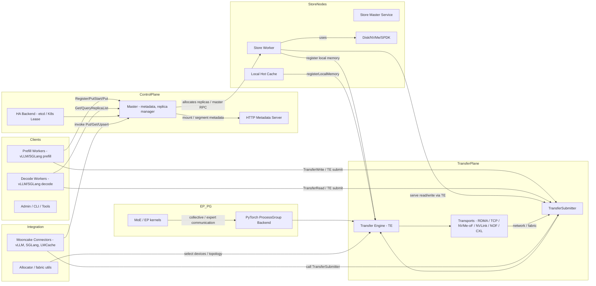

# Mooncake — 整体架构分析

## 目录
- 概述
- 高阶设计目标与原则
- 重点模块一览（职责、关键接口、源码位置）
- 模块架构图（Mermaid）
- 模块交互与数据流（prefill / decode 路径）
- 部署与运行依赖（硬件/网络/调优点）
- 可扩展点与集成建议
- 推荐阅读/代码定位顺序

---

## 概述
Mooncake 的目标是通过把 KVCache（键-值缓存）作为中心资源，把 LLM 推理中的 prefill（生成 KVCache）与 decode（使用 KVCache 的生成解码）工作流解耦，从而用网络与存储资源替换重复计算，以提升整体吞吐并满足延迟 SLO。核心思想是“把数据移动做好”：高带宽、拓扑感知、容错的数据平面 + 一套分布式存储/控制平面用于管理 KVCache 对象生命周期与副本。

---

## 高阶设计目标与原则
- KVCache-centric：KVCache（hidden-state）作为可重用对象，在集群间共享/迁移，减少重复计算。
- 分离数据平面与控制平面：Transfer Engine 负责高效数据移动；Master/Store 控制对象分配、生命周期与策略。
- 多传输多后端：支持 RDMA、TCP、NVMe-oF、NVLink、HIP、CXL、厂商 SDK（Cambricon/Hygon 等）。
- 可编程策略：对象级策略（副本数、优先段、软/硬过期策略）可由上层决定。
- 兼容与集成：提供 Python/Go/Rust 绑定，并与 vLLM、SGLang、Torch（EP/PG）集成。

---

## 重点模块（职责、关键接口与源码定位）

- Transfer Engine（数据平面）
  - 职责：高性能的数据传输框架，支持多传输协议、设备聚合、拓扑感知路径选择与故障切换。
  - 提供：C++ API、C 接口、Python 绑定（wheel）、Rust 示例。
  - 关键点：registerLocalMemory/unregisterLocalMemory、installTransport、submit/submit_batch（通过 TransferSubmitter 封装）。
  - 代码位置：`mooncake-transfer-engine/src/*`（transfer_engine.cpp、transfer_engine_impl.cpp、multi_transport.cpp、topology.cpp、transport/*）
  - 关注：多 NIC 聚合、NUMA/HCAs 拓扑、传输策略（选择 RDMA / TCP / NOF 等）。

- Mooncake Store（分布式控制与存储）
  - 职责：分布式 KVCache 存储服务；管理对象（segment/replica）、任务（copy/move）、多级存储（memory/NOF/disk）、hot cache、主从/HA 逻辑。
  - 提供：Master 服务（元数据与控制 RPC）、Store worker（服务数据/transfer endpoints）、storage backend（local disk / spdk / uring）、HTTP metadata server、k8s/etcd HA 接口。
  - 关键接口：PutStart/PutEnd/PutRevoke、GetReplicaList、MountSegment、BatchPutStart/BatchPutEnd 等。
  - 代码位置：`mooncake-store/src/*`（master_service.cpp、storage_backend.cpp、transfer_task.cpp、segment.cpp、file_storage.cpp、rpc_service.cpp）
  - 关注：lease、replica allocation、disk offload、hot cache 策略、master HA（etcd/k8s-lease）。

- EP（Expert Parallel）与 PG（ProcessGroup）
  - 职责：为 MoE（Mixture-of-Experts）推理提供容错的 expert-parallel 调度与用于 torch.distributed 的 ProcessGroup 后端。
  - 提供：DeepEP 兼容 API、active_ranks、elastic rank recovery、PyTorch 扩展（构建为 Python wheel）。
  - 代码位置：`mooncake-ep/`、`mooncake-pg/`（BuildEpExt.cmake、src/*）
  - 关注：集体通信兼容性、容错与重试机制、Torch CUDA arch 管理。

- Integration（适配层）
  - 职责：为上层推理框架（vLLM、SGLang、LMCache）提供 connector / allocator / utils；包含 runtime 侧的设备/传输分配逻辑与示例。
  - 主要文件：`mooncake-integration/allocator.py`、`integration_utils.h`、`fabric_allocator_utils.py`、`mooncake-integration/transfer_engine/*`、`mooncake-integration/store/*`
  - 作用：实现 framework -> Mooncake 的对接（注册、复制/移动调用、prefill/decoder 交互）。

- mooncake-common / 构建与绑定
  - 职责：构建帮助脚本、第三方查找（JsonCpp、GLOG）、Python 打包（pybind11）、etcd/k8s glue。
  - 代码位置：`mooncake-common/`、顶层 `CMakeLists.txt`（构建选项：WITH_TE/WITH_STORE/WITH_EP 等）

- mooncake-p2p-store / mooncake-transfer-engine/rust / mooncake-store/go（生态）
  - 职责：P2P store 示例、Rust / Go 绑定与示例代码，便于不同生态接入和二次开发。
  - 路径：`mooncake-p2p-store/`、`mooncake-transfer-engine/rust/`、`mooncake-store/go/`

- 工具/支持模块
  - 本地 Hot Cache：LocalHotCache + LocalHotCacheHandler（快速本地命中，registerLocalMemory 到 TE）
  - Storage backend：本地 disk、uring、SPDK 后端（支持 offload）
  - Metrics / HA：master heartbeat、metrics 集成（master_metric_manager、ha_metric_manager）

---

## 模块架构图（Mermaid，复制到 mermaid.live 或保存为文档渲染）

---

## 模块交互与数据流（prefill → decode 场景）
1. Prefill worker（生成 KVCache）调用 Master.PutStart 请求分配 replica（memory/NOF/disk）并获得 replica 描述（包含 transport endpoint、buffer handles 等）。
2. Prefill 使用 TransferSubmitter -> Transfer Engine 将 KVCache 写入目标（memory replica 或 NOF/disk）。若是 disk replica，可能本地先写入 StorageBackend（PutToLocalFile），异步通知 Master PutEnd。
3. Master 记录副本与 lease；StoreWorker 更新 metadata（HTTP metadata server 用于 TE 的端点发现）。
4. Decoder worker 发起 Get：Query -> Master.GetReplicaList，选择首选副本（优先本地 memory/NOF）；若本地 hot cache 命中则直接从本地内存读取；否则通过 TransferEngine 发起 RDMA/TCP 等读取。
5. 数据返回后，Decoder 可异步触发 ProcessSlicesAsync 将热点数据写入本地 hot cache（以提高后续命中率）。
6. EP/PG 在需要专家并行或集体通信时，使用 PG 后端并可能通过 TE 进行高效 tensor 移动。

---

## 部署、运行依赖与调优要点
- 强烈推荐在 RDMA/OFED 环境下运行以发挥 TE 的性能；TCP 模式也可用但性能受限。
- 必要组件：RDMA 驱动、对应厂商 SDK（CUDA / Neuware / DTK / CoreX）根据构建选项。
- Make/CMake 配置：顶层 CMake 支持打开或关闭 TE / STORE / EP / Rust / Go 绑定（参见顶层 CMakeLists.txt）。
- 调优关注点：
  - NIC/NUMA 拓扑调优（TE 的 topology-aware path selection）
  - 本地 hot cache 大小与入缓存阈值（环境变量 MC_STORE_LOCAL_HOT_*）
  - master 的 HA 配置（etcd vs k8s lease）与 heartbeat 参数
  - batch submit（submit_batch）在高并发下能显著提升带宽利用率

---

## 可扩展点与集成建议
- 新传输后端：在 TE 的 transport 子系统实现一个新适配器（遵循 transport 接口）。
- 新存储后端：实现 StorageBackend 接口（例如对象存储、远端 NVMe pool）。
- 对上层推理框架：在 mooncake-integration 中添加 connector（示例：vLLM connector、SGLang connector），主要实现 Put/Query/Get 接口与 event hooks。
- 监控/运维：扩展 master/store 的 metric export（Prometheus），并在 master_metric_manager/ha_metric_manager 中添加健康检查/报警点。

---

## 推荐阅读 / 代码定位顺序（上手建议）
1. README.md（项目概览、设计图与 quick start）。
2. mooncake-transfer-engine/src（理解数据平面与传输策略）。
3. mooncake-store/src（掌握控制平面：replica 管理、master/service、transfer_task）。
4. mooncake-integration（看怎样接入 vLLM/SGLang / allocator 策略）。
5. mooncake-ep（如果需要 MoE/PG 支持，查看 EP/PG 的扩展方式）。
6. docs/ 与 examples（运行与部署示例）。

---
