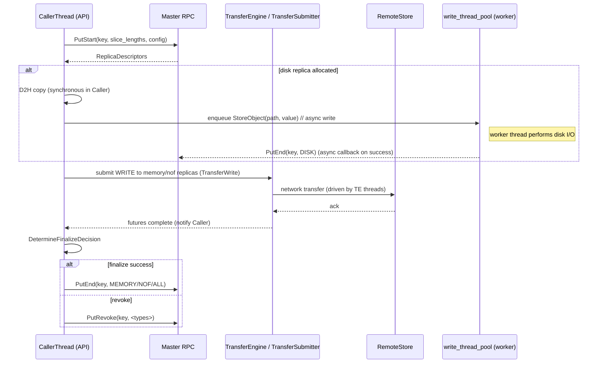
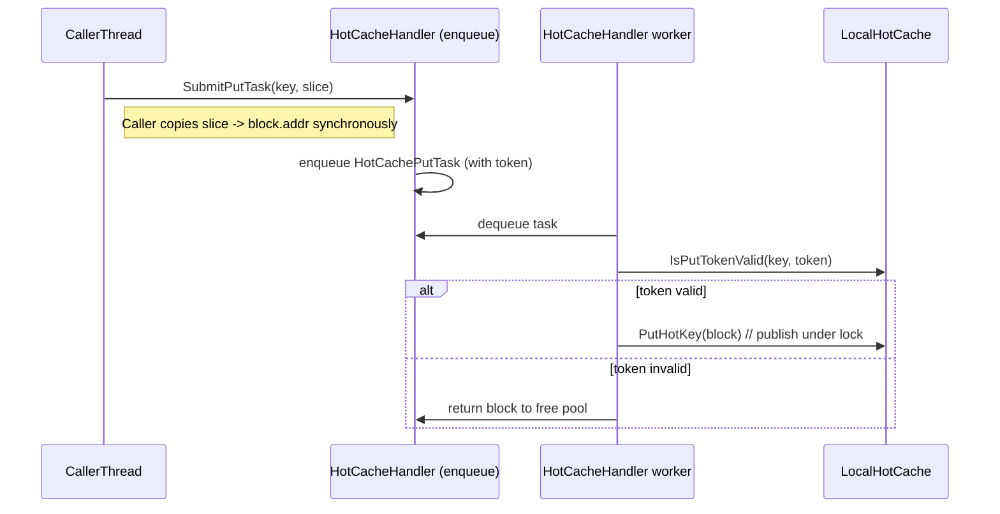
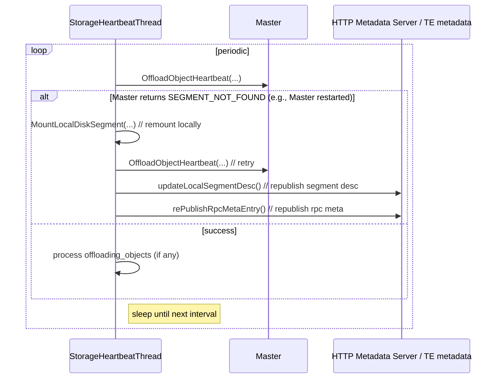
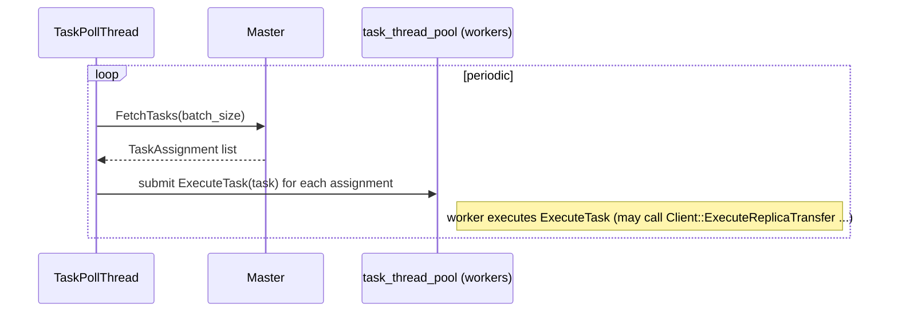

# Mooncake 线程模型分析

## 目录
- 概览
- 线程分类与职责
  - 前端/调用线程（API caller）
  - 固定/持久后台线程
  - 线程池（worker pools）
  - 热缓存异步处理线程组
  - Transfer Engine / transport 线程（数据平面线程）
  - 计时/等待器（定时器、条件变量）
- 典型交互时序（Mermaid）
  - Put / Transfer / Finalize（写）流程
  - 热缓存异步填充（SubmitPutTask）流程
  - Storage Heartbeat 与 ReMount（master restart 恢复）流程
  - Task poll / execute 流程
- 并发与同步要点（锁、refcount、token、lease）
- 调优与运维建议
- 参考源码定位

---

## 概览
Mooncake 的服务端与客户端代码中同时存在多类线程：应用（调用）线程负责发起 Get/Put/Query 等操作；若干后台线程负责心跳、任务轮询、leader monitor；若干线程池负责 I/O（写盘）、任务执行；热缓存采用独立的异步 Put handler worker 线程；Transfer Engine（TE）作为数据平面通常维护自己的一组 I/O / transport 线程以驱动 RDMA/TCP 等传输。整体设计把长时占用或阻塞性的工作放到后台线程或线程池，保持前端调用路径简洁但在关键处仍有同步开销（例如 D2H、future.wait）。

---

## 线程分类与职责

1) 前端 / 调用线程（API caller）
- 从上层（prefill/decoder/vLLM）发起 API（Client::Get / Put / Query / BatchGet 等）。
- 在 Put / Offload 等路径中，调用线程会执行同步 D2H（Device→Host）拷贝以保证来源缓冲区有效，然后将后续 I/O/transfer 提交到线程池或 Transfer Engine。
- 典型路径会在调用线程上阻塞等待 transfer future->get() 完成（因此调用线程可能被阻塞直至传输结束或超时）。

2) 固定 / 持久后台线程（Client 成员）
在 Client 实例中（见 client_service.h）可看到长期运行的线程成员：
- leader_monitor_thread_：负责 leader 检测 / leader 切换（LeaderMonitorThreadMain）。
- storage_heartbeat_thread_：负责定期 Heartbeat（StorageHeartbeatThreadMain），包括 Offload/Promotion heartbeat、re-register 段等。
- task_poll_thread_：轮询与提交 task（TaskPollThreadMain）。
- client_buffer_gc_thread_（FileStorage 中）：回收过期的 batch staging buffers。
- 这些线程通常以 std::thread 启动，并由 atomic flags 控制生命周期。

3) 线程池（worker pools）
- write_thread_pool_（Client::write_thread_pool_）  
  - 用于异步磁盘写（PutToLocalFile / storage backend 写入），把同步 D2H 后的数据交给后台 I/O。
  - 保证写盘不会在主调用线程上阻塞过久（但 D2H 仍是同步）。
- task_thread_pool_（Client::task_thread_pool_）  
  - 用于并发执行拉取到的任务（ExecuteTask / SubmitTask）。
- 其它内部线程池：storage backend 可能有自己的内部 I/O worker 池（见 storage_backend 实现）。

4) 热缓存异步处理线程组
- LocalHotCacheHandler（local_hot_cache.h）维护一组 worker 线程（workers_），通过任务队列（task_queue_）执行 PutHotKey 的最终 publish。
- SubmitPutTask 会在调用线程同步把数据复制到 block 地址，然后把 HotCachePutTask 推入任务队列，由 worker 线程完成 token 验证并调用 PutHotKey。
- 这把阻塞拷贝与锁竞争（LRU publish）解耦：拷贝在调用线程，publish 在 hot cache worker。

5) Transfer Engine / Data plane 线程（TE）
- Transfer Engine（mooncake-transfer-engine）在数据平面可能内部维护网络 IO 线程、poll loops、RDMA 收发线程等（TransferEngine 的实现为高性能传输设计）。Client 通过 TransferSubmitter submit 请求后，TE 内部线程负责完成传输并将结果通过 future / callback 通知提交方。
- TransferSubmitter/transfer futures 是调用路径中与 TE 交互的同步点（主线程通常等待 future->get()）。

6) 计时/等待器（定时器、Graceful Unmount）
- Client 包含用于 graceful unmount 的定时/等待机制（condition_variable + timer thread），例如 StartGracefulUnmountTimer / OnGracefulUnmountTimer 使用 graceful_unmount_timer_cv_。
- Heartbeat / GC 线程都采用周期 sleep 或 condition-wait 模式控制执行。

---

## 典型交互时序（Mermaid 图）

说明：下列图使用简化角色来聚焦线程间活动与线程池 / worker 的关系。Mermaid 图适合粘贴到 GitHub 或 mermaid.live。

### 1) Put（写）流程 — 线程参与视角
- 角色：CallerThread（API 调用线程）、Master、TransferEngine（TE）、RemoteStore（目标节点）、WriteThreadPool（异步写磁盘）、Master async callback

要点：
- D2H 在 Caller 线程同步完成（可能耗时），但 I/O 写盘交给 write_thread_pool。
- Transfer 由 TE 内部线程驱动；Caller 块等待 futures。

### 2) 热缓存填充（SubmitPutTask） — 线程参与视角
- 角色：CallerThread、HotCacheHandler（task queue + workers）、LocalHotCache

要点：
- 数据复制与任务提交分离；Worker 负责验证 token 并 publish，从而避免 publish 已过时数据。

### 3) Storage Heartbeat & ReMount（Master restart 场景）
- 角色：StorageHeartbeatThread（background）、Master、HTTPMeta/TE metadata

要点：
- Heartbeat 线程不仅发送心跳，也负责在 master 丢失元数据时触发 remount + metadata rescan（见 FileStorage::Init / Heartbeat）。

### 4) Task poll & execute 流程
- 角色：TaskPollThread、TaskThreadPool（workers）、Master

要点:
- Poll 线程负责从 Master 获取任务并提交给 task_thread_pool 执行；任务执行通常涉及更多 I/O / transfer 工作。

---

## 并发与同步要点

- 锁粒度
  - mounted_segments_mutex_: 保护 mounted_segments_ 等段相关数据。
  - lru_mutex_（LocalHotCache）: 保护 LRU 队列、key->iterator 映射与 key_generation。
  - graceful_unmount_timer_cv_ 与相关 mutex：用于 graceful unmount 的等待与通知。

- 引用计数与生命周期
  - HotMemBlock.ref_count: 确保正在被读的 block 不会被回收或重用。
  - client_buffer_allocated_batches_ lease timeout：Batch staging buffers 有 lease，GC 线程会回收过期 batch。

- Token / epoch 并发模式
  - HotCache 使用 HotCachePutToken（cache_epoch + key_generation）来判定在异步 publish 前数据是否仍有效，防止 race（RemoveHotKey / BumpKeyGeneration）。

- 主线程阻塞点
  - future->get()（等待 TE 传输完成）
  - D2H 同步拷贝（可能在调用线程显著耗时）
  - master RPC（PutStart / PutEnd / GetReplicaList）延迟也会阻塞调用线程

- 线程安全 invariants
  - 在修改 mounted_segments_、graceful_unmounting_segments_ 等共享结构时必须持有相应 mutex（代码中明确使用 mounted_segments_mutex_）。
  - Task/worker 提交与取消需要在 task pool 中保证幂等与重试逻辑。

---

## 调优与运维建议

- 将耗时 I/O 与网络操作尽量放到线程池或 TE 的异步机制里，减少主 API 线程阻塞；但注意 D2H 必然是同步的（除非上层提前做 staging）。
- write_thread_pool_ 与 task_thread_pool_ 的线程数量应基于磁盘 IOPS、网络带宽和 CPU 核数调优。
- HotCacheHandler worker 数量需平衡：过少会造成 publish 延迟，过多可能引起 LRU 锁竞争。
- GC / heartbeat 间隔：heartbeat 频率影响 Master 的感知与任务下发，client_buffer_gc_ttl 要在避免过早回收和释放内存间权衡。
- 监控点：thread pool 队列长度、write_thread_pool 延迟、hot_cache handler queue 长度、TE transfer latency、master RPC latency。

---

## 参考源码定位（主要声明/启动线程位置）
- mooncake-store/include/client_service.h  
  - leader_monitor_thread_, storage_heartbeat_thread_, task_poll_thread_, write_thread_pool_, task_thread_pool_, hot_cache_handler_（线程或线程池成员）。
- mooncake-store/include/local_hot_cache.h  
  - LocalHotCacheHandler（workers_，SubmitPutTask / workerThread）
- mooncake-store/src/file_storage.cpp  
  - client_buffer_gc_thread_、heartbeat_thread_ 的实现（Init / Heartbeat）
- mooncake-store/include/thread_pool.h / task manager / transfer_task.h  
  - 线程池与任务执行支持
- mooncake-transfer-engine/*（Transfer Engine 内部线程/IO 实现）

---
