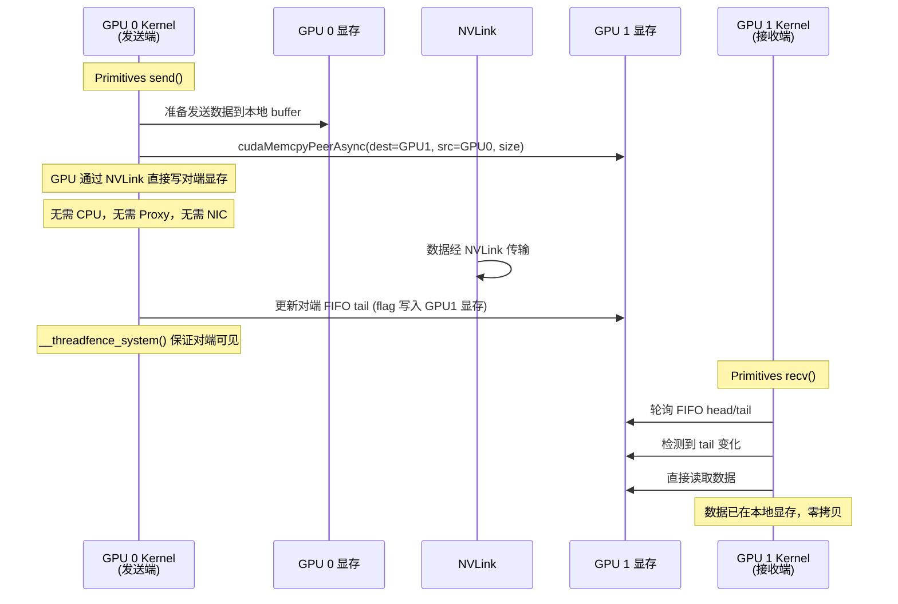
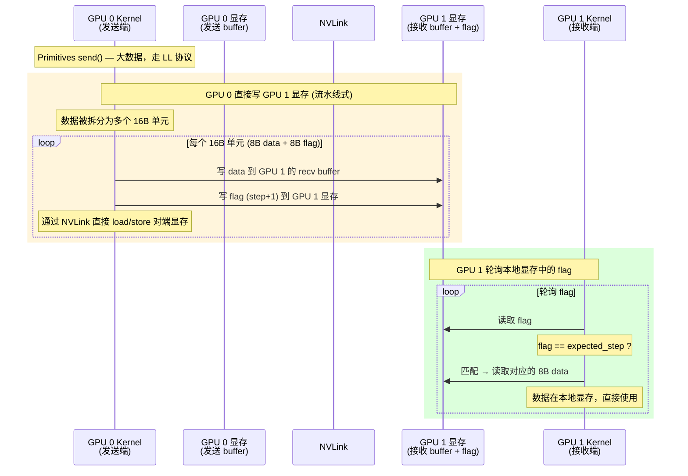
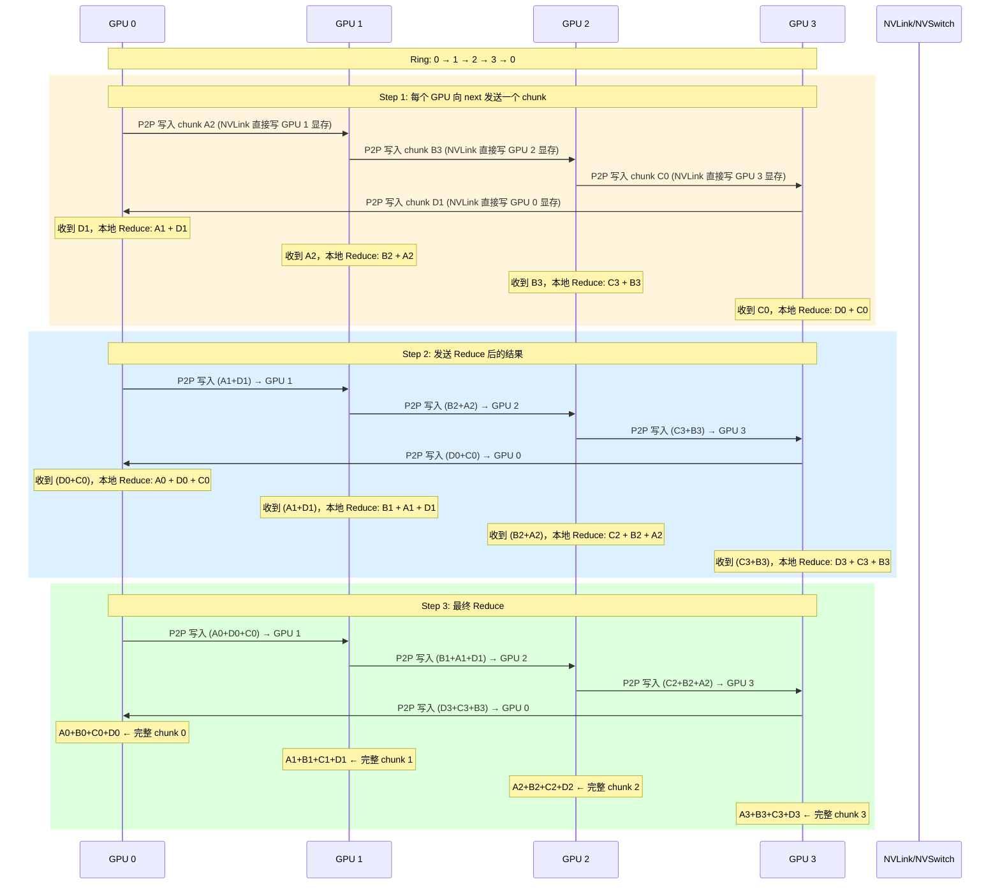
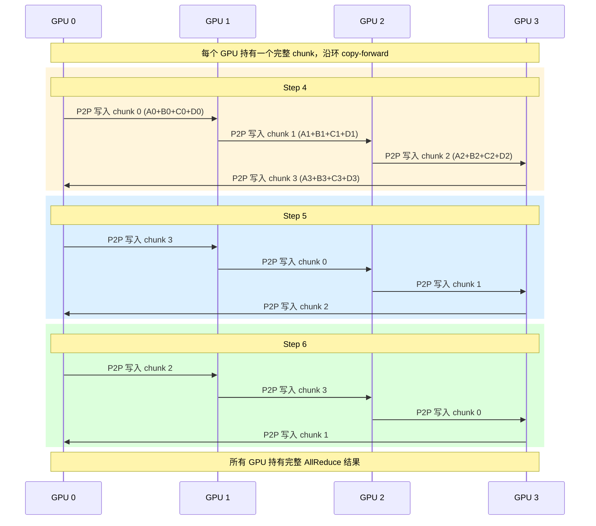

# NCCL P2P (NVLink) 数据传输

## 1. P2P (NVLink) 概述

### 什么是 P2P？

P2P（Peer-to-Peer）指**同一节点内 GPU 之间直接通信**，数据通过 NVLink/NVSwitch 传输，无需经过 CPU 或网卡。

```
┌─────────────────────────────────────────────────────────────────┐
│                    P2P vs NET 对比                               │
│                                                                 │
│  P2P (NVLink)  — 同节点内 GPU 互访                              │
│    GPU 0 ◄──── NVLink/NVSwitch ────► GPU 1                     │
│    延迟: ~1-2 us    带宽: 300-900 GB/s                          │
│                                                                 │
│  NET (RDMA)    — 跨节点通过网卡                                  │
│    GPU 0 ──► NIC ──► 网络 ──► NIC ──► GPU 1                    │
│    延迟: ~5-10 us   带宽: 100-400 GB/s (取决于网卡)             │
│                                                                 │
│  NCCL 传输选择优先级: P2P > SHM > NET > CollNet                 │
└─────────────────────────────────────────────────────────────────┘
```

### 为什么 P2P 不需要 Proxy？

| | P2P (NVLink) | NET (RDMA) |
|--|-------------|-----------|
| GPU 能否直接访问对端显存？ | **能**，NVLink 提供统一地址空间 | **不能**，必须通过网卡 |
| 谁搬运数据？ | **GPU 自己**（直接 load/store） | **网卡**（DMA） |
| 需要 Proxy 吗？ | **不需要**，GPU Kernel 完成一切 | **需要**，Proxy 调用 RDMA Verbs |
| CPU 是否参与数据路径？ | **完全不参与** | 仅 Proxy 提交/检测，不搬运数据 |

关键：NVLink 让所有 GPU 共享同一个**统一设备地址空间**，GPU 可以直接用 `load/store` 指令读写对端显存，无需任何中间层。

---

## 2. NVLink 硬件拓扑

### 单 NVLink 直连（2 卡）

```
GPU 0 ◄═══════════════════► GPU 1
       4-6 条 NVLink 通道
       每条 25-50 GB/s (单向)
```

### NVSwitch 全互联（4/8 卡）

```
              NVSwitch
         ┌─────┼─────┐
         │     │     │
  GPU 0 ─┤     │     ├─ GPU 1
         │     │     │
  GPU 2 ─┤     │     ├─ GPU 3
         │     │     │
         └─────┼─────┘

  8 卡:
         ┌── NVSwitch 0 ──┐
         │                 │
  GPU 0  GPU 1  GPU 2  GPU 3
         │                 │
         └── NVSwitch 1 ──┘
         │                 │
  GPU 4  GPU 5  GPU 6  GPU 7
         │                 │
         └─────────────────┘

  NVSwitch 是全互联交换机，任意 GPU 之间等距等带宽
```

---

## 3. P2P 传输的协议选择

NCCL 在 P2P 模式下使用以下协议：

| 协议 | 适用条件 | 特点 |
|------|---------|------|
| **LL** | 大块数据（>4KB），NVLink 延迟允许 | 16B 粒度（8B data + 8B flag），流水线式 |
| **LL128** | 中等数据量 | 128-bit 打包，更紧凑 |
| **SIMPLE** | 小数据量，最低延迟 | 单次内存拷贝，无 flag 机制 |

```
协议选择逻辑 (P2P 模式):

  数据量小 (阈值以下)  → SIMPLE (单次 memcpy)
  数据量大             → LL / LL128 (流水线，充分利用带宽)
```

---

## 4. SIMPLE 协议时序（小数据量）

SIMPLE 是最简单的协议，GPU Kernel 之间通过一次内存拷贝完成数据传输。



### SIMPLE 协议特点

```
发送端:
  1. 准备数据到本地 buffer
  2. cudaMemcpyPeerAsync() 直接写对端显存 (GPU 硬件完成)
  3. 写对端 flag (tail++) 通知接收端

接收端:
  1. 轮询本地 flag (tail)
  2. flag 变化 → 数据已就绪
  3. 直接读取

优点: 最少步骤，延迟最低
缺点: 每次 memcpy 有固定开销，不适合大数据量
```

---

## 5. LL 协议时序（大数据量，流水线）

LL（Large Latency）是 P2P 大数据传输的核心协议。数据被分成 16B 的单元，每个单元包含 8B data + 8B flag，发送端直接将 data 和 flag 写入对端 GPU 显存。

### 5.1 单次流水线时序



### 5.2 LL 协议内存布局

```
GPU 1 显存 (接收端):

┌──────────────────────────────────────────────────────────┐
│  recv buffer (数据区)          │  flags (标志区)          │
│                               │                          │
│  offset 0:  8B data chunk 0   │  offset 0:  flag 0 (step) │
│  offset 8:  8B data chunk 1   │  offset 8:  flag 1 (step) │
│  offset 16: 8B data chunk 2   │  offset 16: flag 2 (step) │
│  ...                          │  ...                     │
│  offset N:  8B data chunk N   │  offset N:  flag N (step) │
│                               │                          │
│  GPU 0 通过 NVLink 直接写入    │  GPU 1 本地轮询读取       │
│  GPU 1 本地读取                │  GPU 0 通过 NVLink 写入   │
└──────────────────────────────────────────────────────────┘

flag 是一个单调递增的计数器 (step):
  发送端: 写完 data 后，写 flag = current_step + 1
  接收端: 轮询 flag 直到 == expected_step，表示数据就绪
```

### 5.3 LL 协议的 Flag 同步机制

```
┌─────────────────────────────────────────────────────────┐
│  Flag 同步 (step counter) 工作原理                       │
│                                                         │
│  初始状态: flag = 0                                      │
│                                                         │
│  发送端 GPU 0:                接收端 GPU 1:              │
│                                                         │
│  [step 0]                    等待 flag == 1              │
│  写 data[0] 到 GPU 1 显存     轮询 flag...               │
│  写 flag = 1  ◄─────────────► flag == 1 ✓               │
│                              读 data[0]，处理            │
│                                                         │
│  [step 1]                    等待 flag == 2              │
│  写 data[1] 到 GPU 1 显存     轮询 flag...               │
│  写 flag = 2  ◄─────────────► flag == 2 ✓               │
│                              读 data[1]，处理            │
│                                                         │
│  ... 重复直到所有数据传输完成 ...                         │
│                                                         │
│  关键: flag 使用 __threadfence_system() 保证跨 GPU 可见  │
│        NVLink/NVSwitch 提供 GPU 间缓存一致性              │
└─────────────────────────────────────────────────────────┘
```

---

## 6. Ring AllReduce 全流程（P2P NVLink）

以 4 卡同节点 Ring AllReduce 为例，所有通信走 NVLink P2P。

### 6.1 Reduce-Scatter 阶段时序



### 6.2 All-Gather 阶段时序



---

## 7. P2P 与 RDMA 数据路径对比

```
═══════════════════════════════════════════════════════════
  P2P (NVLink) 数据路径 — 全程 GPU 硬件完成
═══════════════════════════════════════════════════════════

  GPU 0 Kernel               GPU 1 Kernel
  ┌──────────┐              ┌──────────┐
  │ 准备数据  │              │ 轮询 flag │
  └────┬─────┘              └────▲─────┘
       │                         │
       ▼                         │
  ┌──────────┐  NVLink 直写      │
  │ GPU 0    │ ─────────────────►│ GPU 1 显存
  │ SM 引擎   │   load/store 指令  │ (data + flag)
  └──────────┘                   │
                                 │
  CPU: 不参与                     │ 数据已在本地显存
  Proxy: 不参与                   │ 直接使用
  NIC: 不参与                     │

═══════════════════════════════════════════════════════════
  NET (RDMA) 数据路径 — 需要网卡和 Proxy
═══════════════════════════════════════════════════════════

  GPU 0 Kernel     Proxy      NIC     网络     NIC     Proxy     GPU 1 Kernel
  ┌──────┐       ┌──────┐  ┌──────┐  ┌────┐  ┌──────┐  ┌──────┐  ┌──────┐
  │ 写FIFO│──►    │ 轮询  │  │ DMA  │  │    │  │ DMA  │  │ 轮询  │  │ 轮询  │
  │ tail  │       │ tail  │─►│ 读取 │─►│传输│─►│ 写入 │─►│ CQ   │─►│ head  │
  └──────┘       │ 提交  │  │GPU显存│  │    │  │GPU显存│  │ 更新  │  │ 读取  │
                │ RDMA  │  └──────┘  └────┘  └──────┘  │ head  │  └──────┘
                └──────┘                                └──────┘

  CPU 参与: Proxy 线程轮询
  NIC 参与: DMA 搬运数据
```

---

## 8. CUDA P2P 访问机制

### 8.1 启用 P2P 访问

```c
// NCCL 初始化时检查并启用 P2P
int canAccessPeer;
cudaDeviceCanAccessPeer(&canAccessPeer, gpu0, gpu1);

if (canAccessPeer) {
    cudaDeviceEnablePeerAccess(peerDeviceId, 0);
    // 现在 gpu0 可以直接访问 gpu1 的显存
}
```

### 8.2 直接内存访问方式

```
方式 1: cudaDeviceEnablePeerAccess + 直接指针访问
  GPU 0: 直接用 peer GPU 的 device pointer 做 load/store
  ptr = gpu1_device_ptr;
  value = ptr[offset];  // GPU 0 通过 NVLink 读 GPU 1 显存

方式 2: cudaMemcpyPeerAsync
  cudaMemcpyPeerAsync(dst, gpu1, src, gpu0, size, stream);
  // GPU 驱动底层自动走 NVLink

方式 3: Unified Memory (cudaMallocManaged)
  cudaMallocManaged(&ptr, size);
  // 所有 GPU 共享同一个虚拟地址空间
  // 访问远端 GPU 内存时自动通过 NVLink

NCCL 的 LL 协议主要使用方式 1 (直接指针访问)，
因为可以做到 16B 粒度的精细控制
```

### 8.3 缓存一致性

```
NVLink/NVSwitch 提供 GPU 间缓存一致性:

  GPU 0 L2 ── NVLink ── GPU 1 L2
       ▲                    ▲
       │                    │
  GPU 0 SM               GPU 1 SM

  __threadfence_system() 保证:
    GPU 0 的 store 对 GPU 1 立即可见
    无需 CPU cache flush
    硬件自动维护一致性
```

---

## 9. 总结

```
┌─────────────────────────────────────────────────────────────────┐
│                 NCCL P2P (NVLink) 核心要点                      │
│                                                                 │
│  适用场景: 同节点内 GPU 间通信                                    │
│                                                                 │
│  传输路径: GPU Kernel ── NVLink ── GPU Kernel                   │
│  CPU: 不参与数据路径                                             │
│  Proxy: 不参与（或极少参与）                                      │
│  NIC: 不参与                                                    │
│                                                                 │
│  核心机制:                                                       │
│    GPU 通过统一地址空间直接 load/store 对端显存                    │
│    Flag (step counter) + __threadfence_system() 实现同步         │
│    LL 协议: 16B 粒度流水线 (8B data + 8B flag)                  │
│    SIMPLE 协议: 单次 cudaMemcpyPeerAsync                        │
│                                                                 │
│  性能特征:                                                       │
│    延迟: ~1-2 us (远低于 RDMA 的 5-10 us)                       │
│    带宽: 300-900 GB/s (取决于 NVLink 代数和 GPU 数量)             │
│    零拷贝: 数据始终在 GPU 显存中，无需中转                        │
│                                                                 │
│  与 RDMA 对比:                                                   │
│    RDMA 需要 Proxy 桥接 GPU 和 NIC                               │
│    P2P 完全在 GPU 硬件内完成，是同节点通信的最优选择               │
└─────────────────────────────────────────────────────────────────┘
```
