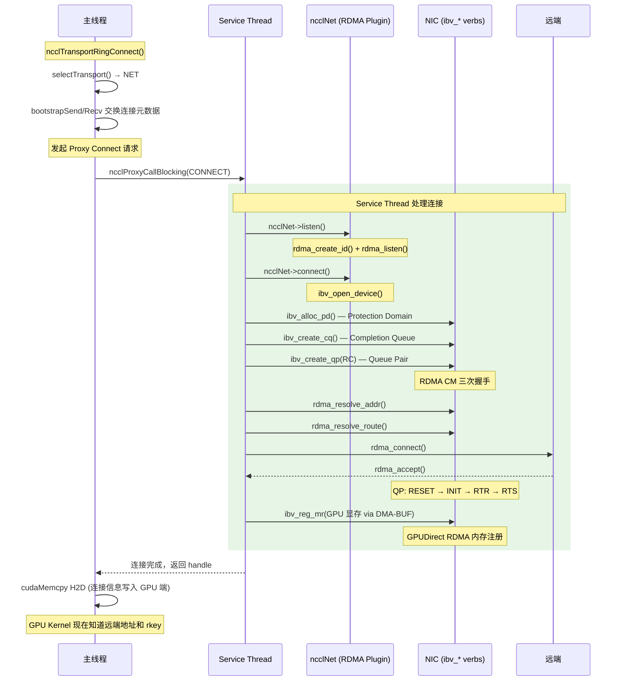
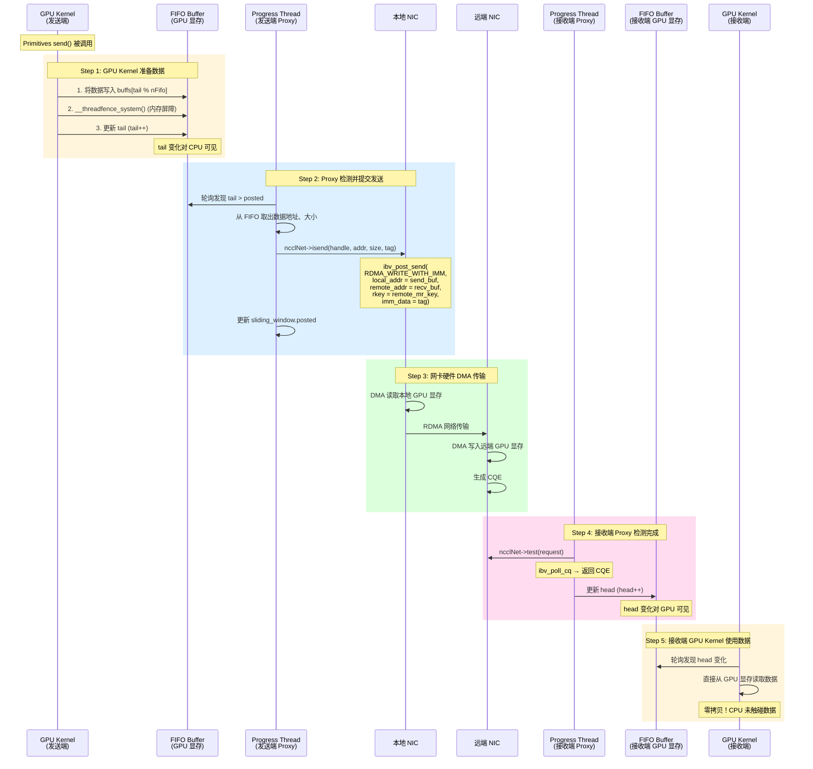
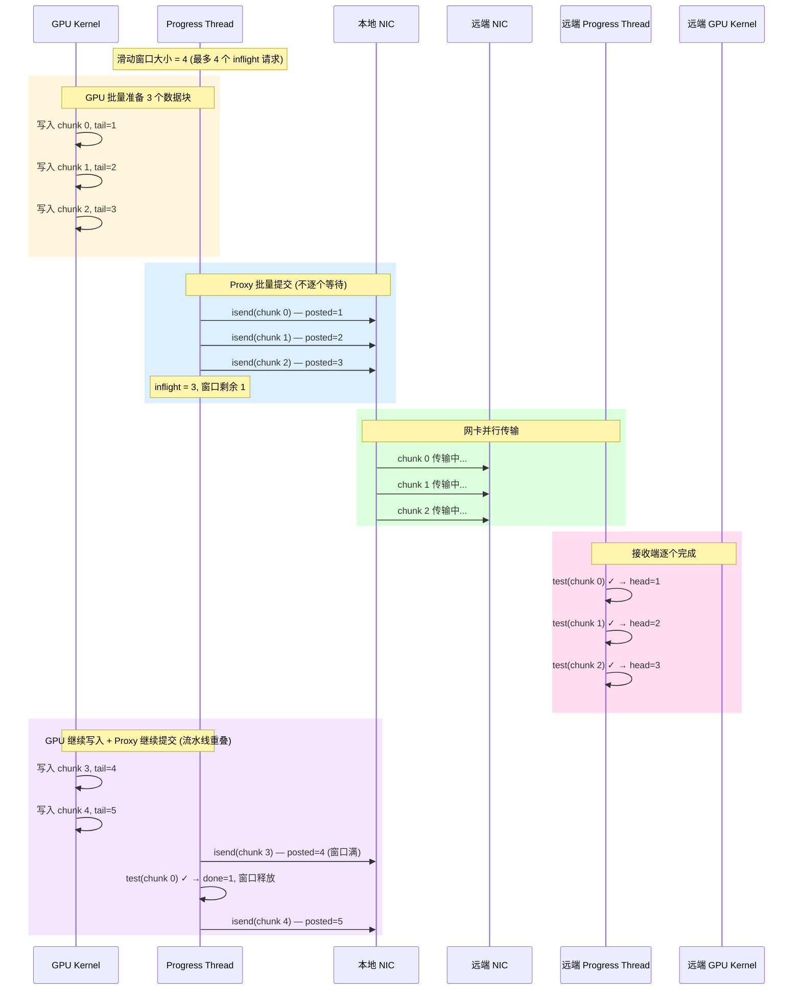
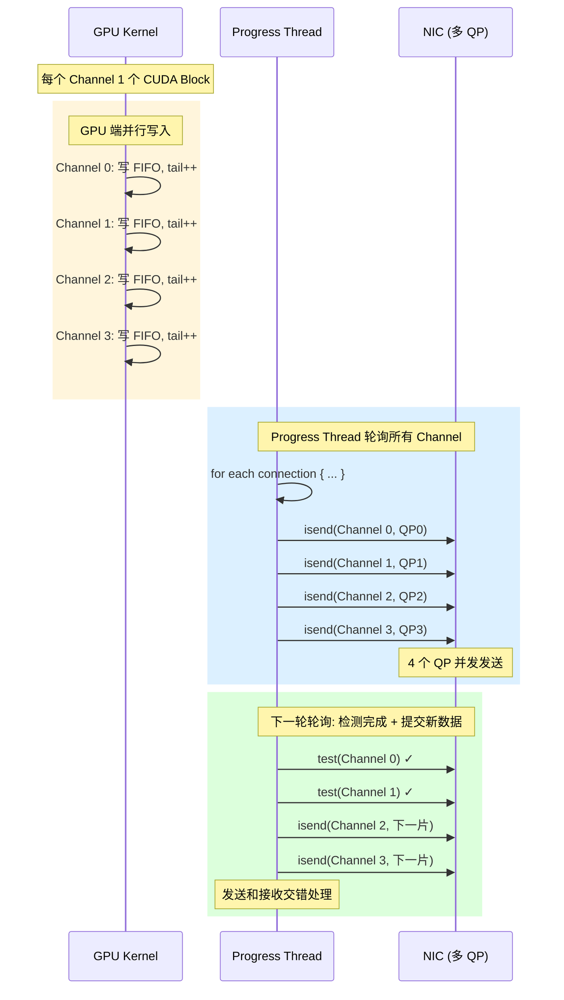

# NCCL Proxy 层功能分析

## 1. Proxy 层的定位与作用

### 为什么需要 Proxy？

GPU Kernel 运行在 GPU 上，RDMA Verbs 运行在 CPU 用户态，两者是**不同的执行环境**，无法直接调用。需要一个 CPU 端的"中间层"来桥接：

```
┌────────────────────────────────────────────────────────────────────┐
│                         为什么需要 Proxy？                          │
│                                                                    │
│  GPU Kernel:     运行在 GPU 上，只能访问 GPU 显存，不能调用系统 API  │
│  RDMA Verbs:     运行在 CPU 上（libibverbs），操控网卡硬件           │
│                                                                    │
│  问题: GPU 无法直接调用 ibv_post_send / ibv_poll_cq                │
│  方案: Proxy 作为 CPU 端的"搬运工"，通过 FIFO 与 GPU Kernel 协同    │
└────────────────────────────────────────────────────────────────────┘
```

### Proxy 的三大职责

| 职责 | 说明 |
|------|------|
| **连接管理** | Service Thread 处理建连/拆连请求（创建 QP、内存注册等） |
| **数据搬运** | Progress Thread 轮询 FIFO，提交 RDMA 操作（ibv_post_send），轮询完成（ibv_poll_cq） |
| **状态同步** | 更新 FIFO head/tail，作为 GPU Kernel 与网络之间的信号桥梁 |

### Proxy 的整体位置

```
┌───────────────────────┐
│    GPU Kernel         │  CUDA Block 执行 send/recv Primitives
│    (ncclKernelMain)   │  直接读写 GPU 显存中的 FIFO
└───────────┬───────────┘
            │ FIFO (head/tail 在 GPU 显存)
┌───────────▼───────────┐
│    Proxy 层           │  CPU 用户态线程
│  ┌─────────────────┐  │
│  │ Service Thread  │  │  连接管理: 创建 QP、注册 MR、RDMA CM 握手
│  ├─────────────────┤  │
│  │Progress Thread  │  │  数据搬运: 轮询 FIFO → 提交 RDMA → 轮询 CQ
│  └────────┬────────┘  │
└───────────┼───────────┘
            │ ncclNet 接口 (isend/irecv/test/regMr)
┌───────────▼───────────┐
│    NET 传输层         │  RDMA Plugin (libibverbs)
│    (ibv_post_send,    │
│     ibv_poll_cq,      │
│     ibv_reg_mr)       │
└───────────┬───────────┘
            │ 硬件指令
┌───────────▼───────────┐
│    NIC (RNIC)         │  网卡硬件，DMA 直接搬运 GPU 显存
└───────────────────────┘
```

---

## 2. Proxy 的两个线程

### Service Thread（服务线程）

**职责：处理一次性/低频的控制面操作**

- 响应主线程的连接请求（`ncclTransportRingConnect` / `ncclTransportTreeConnect`）
- 创建 RDMA QP、CQ、PD
- 注册内存区域（MR）—— GPUDirect RDMA
- RDMA CM 地址解析与连接建立
- 拆连时的资源释放

```
Service Thread 生命周期:
  创建 ──► 等待请求 ──► 处理 connect ──► 返回结果 ──► 等待下一个请求 ...
                      处理 disconnect ──► 释放资源
  特点: 事件驱动，空闲时不消耗 CPU
```

### Progress Thread（进度线程）

**职责：处理连续的高频的数据面操作**

- **轮询发送端 FIFO**：检测 `tail` 变化，有新数据则提交 RDMA 发送
- **轮询接收端 CQ**：检测 RDMA 完成事件，更新 FIFO `head`
- **管理滑动窗口**：批量提交、追踪 inflight 请求数，避免 QP 溢出
- **处理所有 Channel**：一个 Progress Thread 管理一个 GPU 的所有 Channel

```
Progress Thread 主循环 (伪代码):

  while (running) {
      // 扫描所有 connection，检查是否有新数据要发
      for each connection in managed_connections {
          // 发送方向: GPU → Network
          tail = read(connection.fifo.tail)
          while (connection.sliding_window.posted < tail) {
              data = connection.fifo.buffs[posted % nFifo]
              ncclNet->isend(handle, data, size, tag)
              connection.sliding_window.posted++
          }

          // 接收方向: Network → GPU
          while (connection.sliding_window.done < connection.sliding_window.received) {
              if (ncclNet->test(request) == complete) {
                  write(connection.fifo.head, ++done)
              }
          }
      }
  }
```

---

## 3. Proxy 连接管理时序



---

## 4. Proxy 数据搬运时序（单次 Send）

这是 Proxy 最核心的工作流程：**GPU Kernel 准备数据 → Proxy 提交 RDMA → Proxy 检测完成 → GPU Kernel 使用数据**。



---

## 5. Proxy 数据搬运时序（流水线批量）

实际生产中，Proxy 不会等单个请求完成再处理下一个，而是用**滑动窗口**批量提交：



### 滑动窗口状态机

```
              GPU Kernel 写入 FIFO
                     │
                     ▼
              tail 递增
                     │
                     ▼
  ┌──────────────────────────────────────┐
  │  Sliding Window (Proxy 管理)         │
  │                                      │
  │  ┌─────┬──────────┬─────────┬─────┐  │
  │  │done │ received │ posted  │tail │  │
  │  │  ↑  │    ↑     │   ↑     │  ↑  │  │
  │  │ 已确认│ 已完成   │ 已提交   │已写入│  │
  │  └─────┴──────────┴─────────┴─────┘  │
  │       │              │                │
  │       │              │                │
  │  ncclNet->test()  ncclNet->isend()   │
  │  检测远端完成     提交到本地 NIC       │
  │       │              │                │
  │       ▼              ▼                │
  │  更新 FIFO head   从 FIFO 读数据      │
  └──────────────────────────────────────┘
                     │
                     ▼
              GPU Kernel 读 FIFO
              (检测 head 变化)
```

---

## 6. 多 Channel 并行时序

一个 GPU 上所有 Channel 共享同一个 Progress Thread，Proxy 在主循环中轮询所有连接：



---

## 7. Proxy 在不同传输模式下的差异

| 传输层 | Proxy 职责 | 数据路径 |
|--------|-----------|---------|
| **NET (RDMA)** | 轮询 FIFO → ibv_post_send(RDMA_WRITE) → ibv_poll_cq | GPU 显存 → NIC DMA → 网络 |
| **P2P (NVLink)** | 几乎不参与，GPU Kernel 通过 NVLink 直接读写对端显存 | GPU → NVLink → GPU |
| **SHM (共享内存)** | 轻量级，轮询 FIFO → memcpy 到共享内存 | GPU → D2H → /dev/shm → H2D → GPU |

```
                  Proxy 负载排序:

  P2P (NVLink)  ◄── 最轻，几乎不参与
       │
       ▼
  SHM (共享内存) ◄── 中等，做 CPU 端 memcpy
       │
       ▼
  NET (RDMA)    ◄── 最重，负责所有 RDMA 操作
                  但数据本身仍零拷贝 (GPUDirect)
```

---

## 8. 总结

```
┌─────────────────────────────────────────────────────────────────┐
│                    NCCL Proxy 层核心要点                        │
│                                                                 │
│  存在原因: GPU Kernel 无法直接调用 RDMA Verbs                   │
│                                                                 │
│  Service Thread:  事件驱动，处理建连/拆连（低频、一次性）          │
│  Progress Thread: 轮询驱动，搬运数据（高频、持续运行）             │
│                                                                 │
│  工作模式:                                                       │
│    GPU Kernel 写 FIFO tail  ←→  Progress Thread 检测并提交 RDMA  │
│    Progress Thread 检测完成  ←→  GPU Kernel 读 FIFO head        │
│                                                                 │
│  关键优化:                                                       │
│    滑动窗口批量提交 → 提高 NIC 利用率                             │
│    多 Channel 轮询 → 单线程管理所有连接                           │
│    GPUDirect RDMA → 数据零拷贝，Proxy 不触碰实际数据             │
│                                                                 │
│  性能特征:                                                       │
│    Proxy 不搬运数据本身，只提交和管理 RDMA 操作                   │
│    瓶颈在轮询延迟和网络带宽，不在 Proxy 的 CPU 开销              │
└─────────────────────────────────────────────────────────────────┘
```
