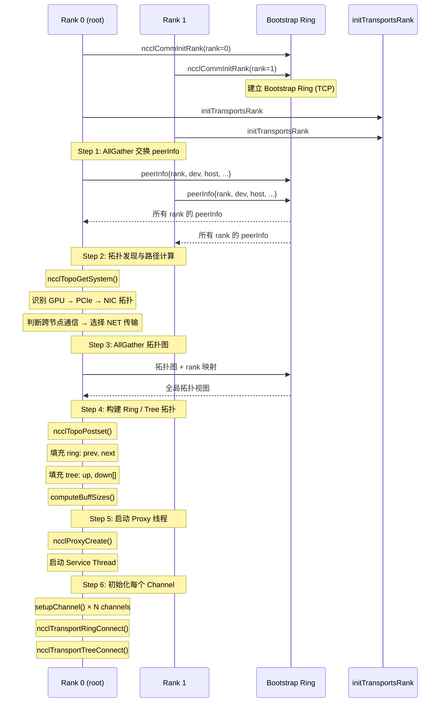
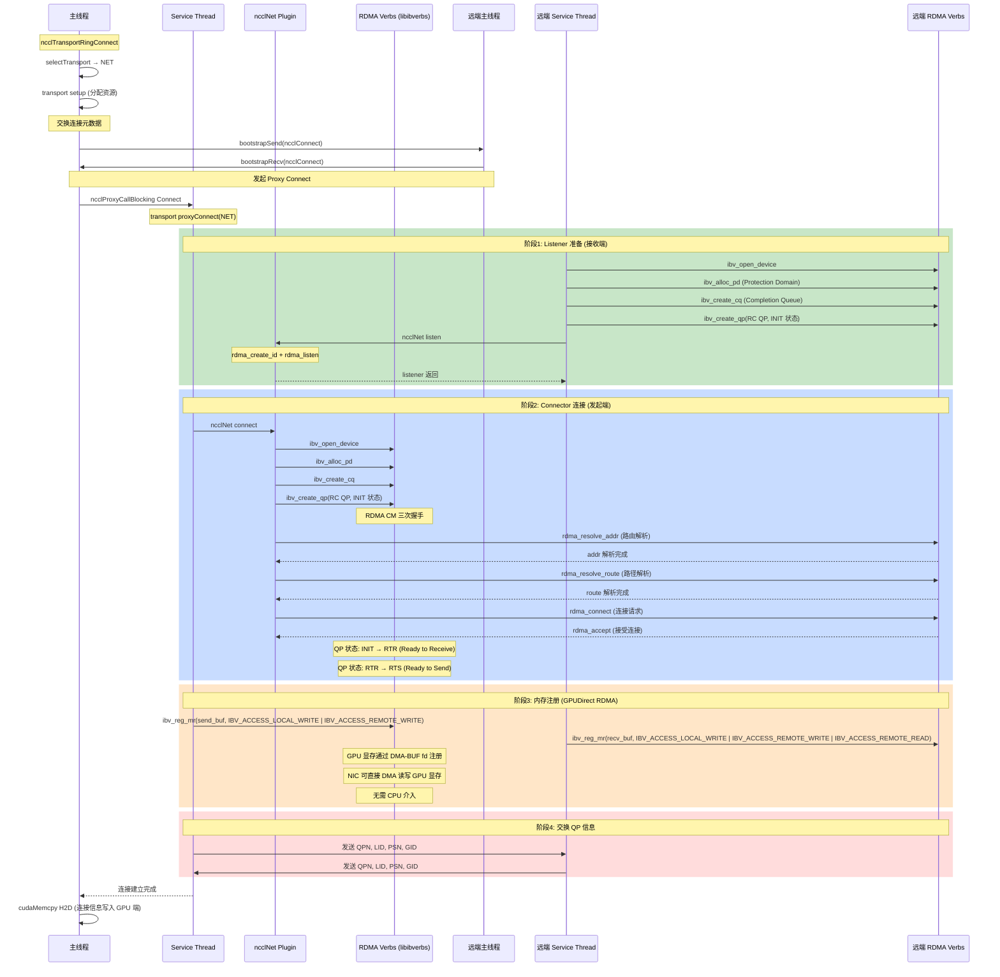
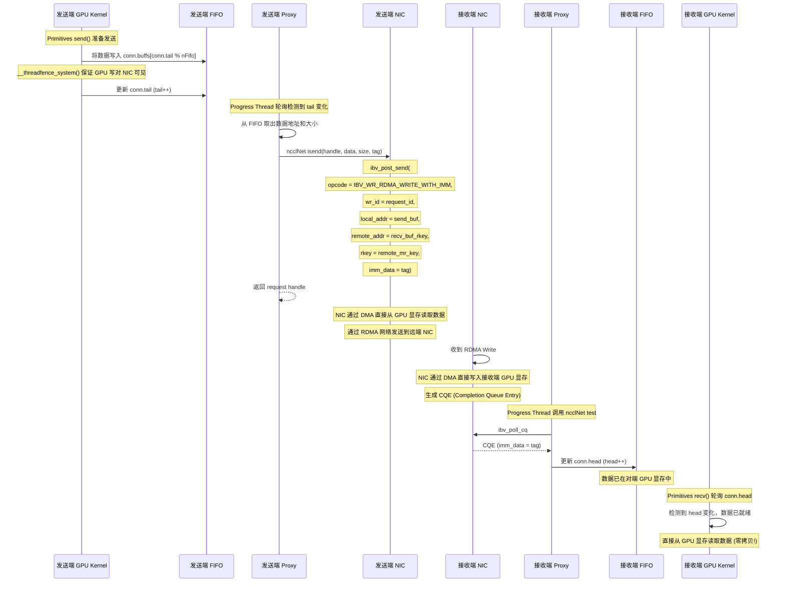
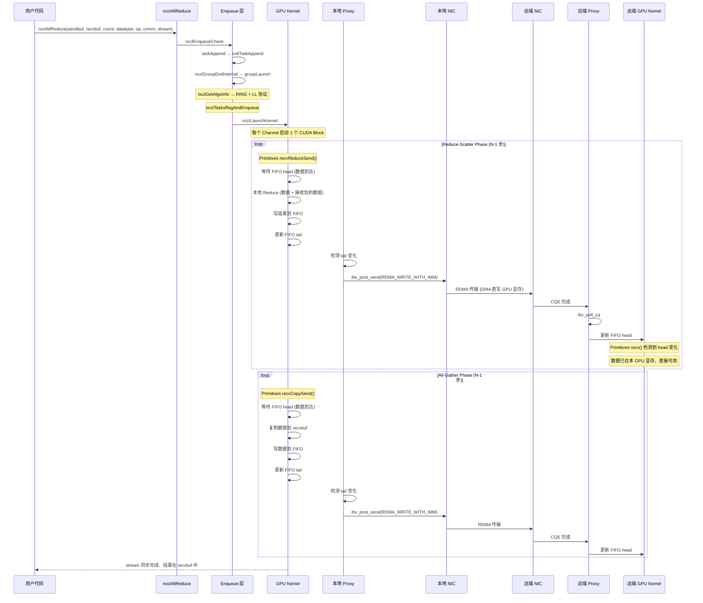

# NCCL 中 RDMA 处理 IO 的完整流程

## 1. 概述

NCCL（NVIDIA Collective Communications Library）在跨节点通信时使用 **NET 传输层**，底层依赖 RDMA（InfiniBand / RoCE）进行高效数据传输。整个流程可以分为三个阶段：**初始化阶段**、**连接建立阶段**、**数据传输阶段**。

### 关键特点

- NCCL 使用 **RDMA Write**（而非传统 send/recv），sender 直接写入 receiver 的显存
- Receiver 通过 **RDMA Write with Immediate** 收到完成通知
- GPU 显存通过 **DMA-BUF / GPUDirect RDMA** 直接注册到 NIC，零拷贝
- Proxy 线程作为 CPU 端"搬运工"，通过 FIFO 与 GPU Kernel 协同

### 传输选择优先级

```
P2P (同节点 NVLink/IPC) > SHM (同节点共享内存) > NET (跨节点 RDMA) > CollNet (SHARP 卸载)

跨节点通信必然走 NET 传输，即 RDMA
```

## 2. 整体架构

```
┌─────────────────────────────────────────────────────────────────┐
│                        用户 API 层                               │
│                  ncclAllReduce / ncclBroadcast / ...            │
└────────────────────────────┬────────────────────────────────────┘
                             │
┌────────────────────────────▼────────────────────────────────────┐
│                     GPU Kernel 层                               │
│              ncclKernelMain (CUDA Kernel)                       │
│         每个 Channel 启动 1 个 CUDA Block                        │
│         Primitives: send / recv / recvReduceSend                │
└─────┬──────────────────────────────┬───────────────────────────┘
      │ FIFO 信号                     │ FIFO 信号
      │ (head/tail)                   │ (head/tail)
┌─────▼──────────────────────────────▼───────────────────────────┐
│                     Proxy 线程层                                │
│         Service Thread (连接管理)                               │
│         Progress Thread (数据搬运)                              │
└────────────────────────────┬───────────────────────────────────┘
                             │ ncclNet isend / irecv / test
┌────────────────────────────▼───────────────────────────────────┐
│                    NET 传输层 (RDMA)                             │
│         ncclNet_v12_t 接口 (Plugin 架构)                        │
│         ┌──────────────────────────────────────┐               │
│         │  ibv_post_send (RDMA_WRITE)          │               │
│         │  ibv_post_recv                       │               │
│         │  ibv_poll_cq                         │               │
│         │  ibv_reg_mr (GPUDirect)              │               │
│         └──────────────────────────────────────┘               │
└────────────────────────────┬───────────────────────────────────┘
                             │
┌────────────────────────────▼───────────────────────────────────┐
│                  RDMA 硬件 (InfiniBand / RoCE)                   │
│                     NIC / HCA                                   │
└─────────────────────────────────────────────────────────────────┘
```

## 3. 初始化阶段：RDMA 传输发现与选择



### 传输选择详细判断

```
selectTransport() 对每对 (localRank, remoteRank):

  同节点?
    ├─ 支持 NVLink/IPC 且拓扑允许 → P2P (最优)
    ├─ 同 /dev/shm 可用            → SHM
    └─ 拓扑强制                   → NET
  跨节点?
    └─ 必然走 NET (RDMA)

  NET 传输子类型判断:
    GPU 支持 DMA-BUF + NIC 支持 GPUDirect?
      └─ 是 → NET/GDR (GPU 显存直接 RDMA，零拷贝)
      └─ 否 → NET/非GDR (GPU → Host staging → NIC)
```

## 4. 连接建立阶段：RDMA QP 创建与握手



### RDMA QP 状态转换

```
ibv_create_qp
     │
     ▼
  ┌────────┐
  │ RESET  │ ← 初始状态
  └───┬────┘
      │ ibv_modify_qp (INIT)
      ▼
  ┌────────┐
  │  INIT  │ ← QP 属性: 端口、PKEY、QKEY
  └───┬────┘
      │ ibv_modify_qp (RTR)
      ▼
  ┌────────────────┐
  │ RTR (Ready to  │ ← 收到远端 QP 信息后切换
  │    Receive)    │    可以接收 RDMA 请求
  └───┬────────────┘
      │ ibv_modify_qp (RTS)
      ▼
  ┌────────────────┐
  │ RTS (Ready to  │ ← 可以发送 RDMA 请求
  │    Send)       │
  └────────────────┘
```

## 5. 数据传输阶段：AllReduce over RDMA

### 5.1 Ring AllReduce 数据流概览

以 4 节点、Ring 算法为例：

```
数据分片: 将数据均匀分为 N 份 (N=4)

Rank 0: [A0 | A1 | A2 | A3]
Rank 1: [B0 | B1 | B2 | B3]
Rank 2: [C0 | C1 | C2 | C3]
Rank 3: [D0 | D1 | D2 | D3]

目标: 每个 Rank 最终持有 [A0+B0+C0+D0 | A1+B1+C1+D1 | A2+B2+C2+D2 | A3+B3+C3+D3]

═════════════════════════════════════════════════
Phase 1: Reduce-Scatter (3 步, 沿环 reduce-forward)
═════════════════════════════════════════════════

  Step 1:                    Step 2:                    Step 3:
  0 → 1: 发送 A2             0 → 1: 发送 D1+A1         0 → 1: 发送 C0+D0+A0
  1 → 2: 发送 B3             1 → 2: 发送 A2+B2         1 → 2: 发送 D1+A1+B1
  2 → 3: 发送 C0             2 → 3: 发送 B3+C3         2 → 3: 发送 A2+B2+C2
  3 → 0: 发送 D1             3 → 0: 发送 C0+D0         3 → 0: 发送 B3+C3+D3

  结果: Rank 0 持有 A0+B0+C0+D0 (完整 chunk 0)
        Rank 1 持有 A1+B1+C1+D1 (完整 chunk 1)
        Rank 2 持有 A2+B2+C2+D2 (完整 chunk 2)
        Rank 3 持有 A3+B3+C3+D3 (完整 chunk 3)

═════════════════════════════════════════════════
Phase 2: All-Gather (3 步, 沿环 copy-forward)
═════════════════════════════════════════════════

  Step 4:                    Step 5:                    Step 6:
  0 → 1: 发送完整 chunk0      0 → 1: 发送 chunk3        0 → 1: 发送 chunk2
  1 → 2: 发送完整 chunk1      1 → 2: 发送 chunk0        1 → 2: 发送 chunk3
  2 → 3: 发送完整 chunk2      2 → 3: 发送 chunk1        2 → 3: 发送 chunk0
  3 → 0: 发送完整 chunk3      3 → 0: 发送 chunk2        3 → 0: 发送 chunk1

  结果: 所有 Rank 持有完整 AllReduce 结果
```

### 5.2 单次 RDMA 数据传输详细时序



### 5.3 NCCL 使用的具体 RDMA Verbs

| RDMA Verb | 用途 | 说明 |
|-----------|------|------|
| `ibv_post_send(RDMA_WRITE_WITH_IMM)` | 主传输方式 | Sender 直接写入 Receiver 显存，同时携带 Immediate Data 作为通知 |
| `ibv_post_send(RDMA_WRITE)` | 部分传输 | 不带 Immediate Data 的单向写入 |
| `ibv_reg_mr` | 内存注册 | 将 GPU 显存注册为 MR，NIC 获得 DMA 访问权限 (GPUDirect) |
| `ibv_poll_cq` | 完成检测 | 轮询 CQ 获取完成事件 |
| `ibv_create_qp(IBV_QPT_RC)` | 创建 QP | Reliable Connection 模式，保证可靠传输 |
| `ibv_create_cq` | 创建完成队列 | 接收 RDMA 操作完成通知 |
| `ibv_modify_qp` | QP 状态转换 | INIT → RTR → RTS |

### 5.4 RDMA Write vs 传统 Send/Recv

```
传统 Send/Recv (NCCL 未采用):
  Sender: ibv_post_send(SEND)          Receiver: ibv_post_recv(RECV)
                    │                                      │
                    └─────── 需要双方协同 ─────────────────┘
  问题: Receiver 必须提前 post recv buffer
       双方需要严格同步

RDMA Write (NCCL 实际采用):
  Sender: ibv_post_send(RDMA_WRITE_WITH_IMM)
                    │
                    └─────── 单向写入，Receiver 无需预先 post recv
  优势: Sender 主动将数据写入 Receiver 的预注册内存区域
       Receiver 通过 Immediate Data 被动得知数据到达
       解耦发送和接收的同步要求
```

### 5.5 GPUDirect RDMA 数据路径

```
┌──────────────────────────────────────────────────────────────────┐
│                    GPUDirect RDMA 数据路径                        │
│                                                                  │
│  ┌─────────┐    DMA-BUF     ┌─────────┐    PCIe / NVLink       │
│  │ GPU 显存 │ ◄───────────► │   NIC   │ ◄────────────────────► │
│  │ (HBM)   │    直接 DMA     │ (RDMA)  │    IB / RoCE 网络      │
│  └─────────┘   无需 CPU      └─────────┘                        │
│                                                                  │
│  传统路径 (非 GDRDMA):                                           │
│  GPU 显存 ──D2H──► CPU 内存 ──DMA──► NIC  (多一次拷贝，CPU 开销) │
│                                                                  │
│  GDRDMA 路径:                                                    │
│  GPU 显存 ──DMA──► NIC  (零拷贝，CPU 完全不参与数据搬运)          │
└──────────────────────────────────────────────────────────────────┘

内存注册过程 (ibv_reg_mr):
  1. GPU 驱动为显存分配 DMA-BUF file descriptor
  2. NCCL 通过 ncclNet regMr() 传递 DMA-BUF fd 给 NIC
  3. NIC 驱动通过 ibv_reg_mr 将 fd 映射为设备可访问的物理地址
  4. 返回 rkey (remote key)，供远端 NIC 做 RDMA Write 时使用

  注册权限:
    IBV_ACCESS_LOCAL_WRITE     — 本地可写
    IBV_ACCESS_REMOTE_WRITE    — 远端可写 (RDMA Write)
    IBV_ACCESS_REMOTE_READ     — 远端可读
```

## 6. 多通道并行传输

```
NCCL 每个 comm 最多 64 个 Channel，数据被分片到多个 Channel 上并发传输:

假设数据 256MB，8 个 Channel:

  Channel 0: 传输 chunk 0-7  (32MB)  ──→ RDMA Write ──→
  Channel 1: 传输 chunk 8-15 (32MB)  ──→ RDMA Write ──→
  Channel 2: 传输 chunk 16-23(32MB)  ──→ RDMA Write ──→
  Channel 3: 传输 chunk 24-31(32MB)  ──→ RDMA Write ──→
  Channel 4: 传输 chunk 32-39(32MB)  ──→ RDMA Write ──→
  Channel 5: 传输 chunk 40-47(32MB)  ──→ RDMA Write ──→
  Channel 6: 传输 chunk 48-55(32MB)  ──→ RDMA Write ──→
  Channel 7: 传输 chunk 56-63(32MB)  ──→ RDMA Write ──→

  GPU 端: 每个 Channel 1 个 CUDA Block 并行执行
  Proxy 端: Progress Thread 通过一个 FIFO 管理所有 Channel 的请求
  NIC 端: 多个 QP 并发，充分利用网络带宽

  实际通道数由拓扑分析决定: min(ringChannels, treeChannels, nvlsChannels)
```

## 7. 协议选择与 RDMA 的关系

| 协议 | 适用场景 | RDMA 交互方式 |
|------|---------|-------------|
| **LL (Large Latency)** | 跨节点 RDMA | GPU Kernel 写 FIFO → Proxy 用 RDMA Write 发送 → 远端 Proxy 更新 FIFO → 远端 GPU Kernel 读取 |
| **LL128** | 中等延迟 (PCIe/NVLink) | 128-bit 线打包，类似 LL 但更紧凑 |
| **SIMPLE** | 低延迟 (同节点) | FIFO head/tail 直接同步，可能走 P2P 或 SHM 而非 RDMA |

```
跨节点 RDMA 传输默认使用 LL 协议:

  GPU Kernel 端:
    每 16B 包含: 8B data + 8B flag (单调递增计数器)
    send 时: 写数据 + 写 flag (step+1)
    recv 时: 轮询 flag 直到匹配期望值

  Proxy 端 (LL 协议对 RDMA 的封装):
    检测到 FIFO tail 变化 → 调用 ncclNet isend (RDMA Write)
    检测到 CQ 完成 → 更新远端 FIFO head
```

## 8. 完整 AllReduce 时序总结



## 9. 关键数据结构

| 结构 | 说明 |
|------|------|
| `ncclComm` | 通信器，包含 rank、nRanks、channels、topo 等全部状态 |
| `ncclChannel` | 通信通道，承载 ring/tree 拓扑和 per-peer 连接信息 |
| `ncclProxyState` | Proxy 线程状态，管理 ops pool 和 progress 循环 |
| `ncclDevChannel` | GPU 端通道数据，含 ring/tree 连接和 FIFO 信息 |
| `ncclProxySubArgs` | 滑动窗口状态: posted/received/flushed/transmitted/done |
| `ncclNet_v12_t` | NET 传输插件接口 (isend/irecv/test/regMr/...) |

## 10. 性能优化要点

| 优化技术 | 说明 |
|---------|------|
| **GPUDirect RDMA** | GPU 显存零拷贝直传 NIC，避免 CPU 中转 |
| **多 Channel 并行** | 最多 64 个 Channel 充分利用网络带宽 |
| **RDMA Write (单向)** | Sender 直接写入 Receiver 显存，无需双方协同 post |
| **流水线执行** | Reduce-Scatter 和 All-Gather 各步骤流水重叠 |
| **LL 协议** | 16B (8B data + 8B flag) 紧凑协议，每步开销可忽略 |
| **滑动窗口** | Proxy 维护 posted/received/transmitted/done 状态，批量提交 |
| **ECE (Explicit Congestion Notification)** | 拥塞控制，避免网络拥塞导致重传 |
| **OOO RQ (Out-of-Order Receive Queue)** | 允许乱序到达，减少等待，提高吞吐 |
