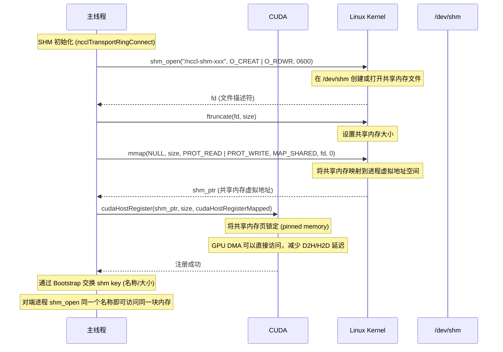
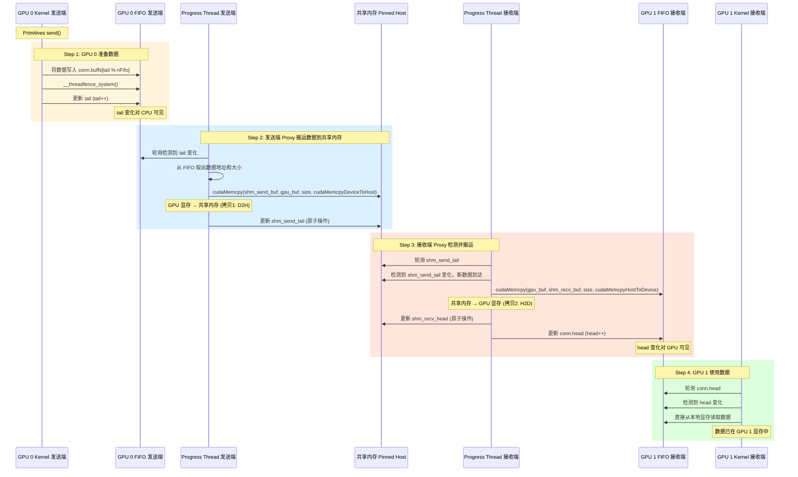
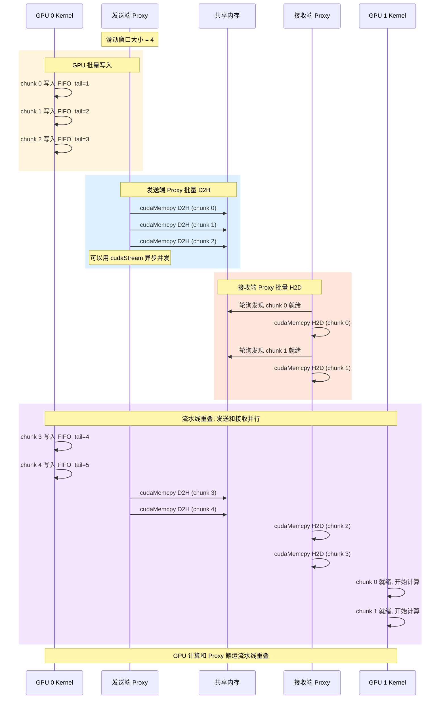
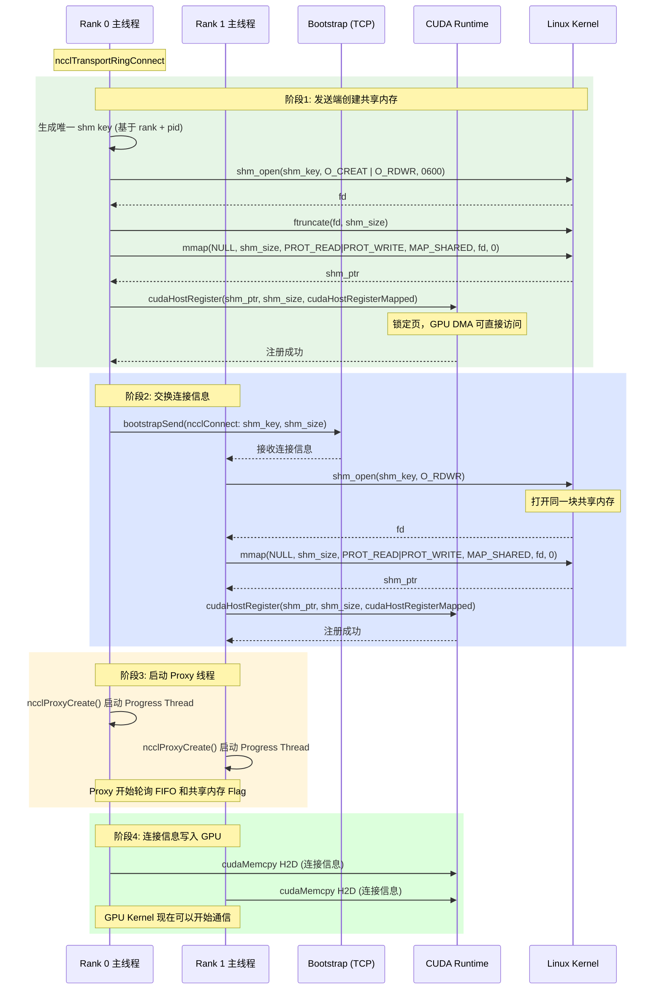
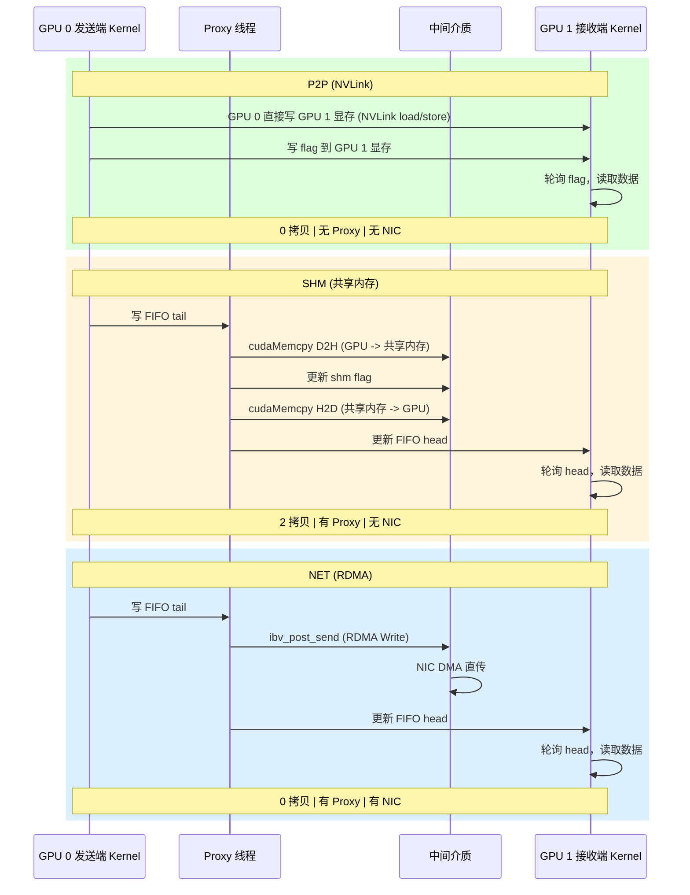

# NCCL SHM (共享内存) 传输机制分析

## 1. SHM 传输概述

### 什么是 SHM？

SHM（Shared Memory）是 NCCL 用于**同节点内 GPU 间通信**的传输方式之一，当 P2P（NVLink）不可用或不适配时使用。数据通过**主机共享内存**（/dev/shm 或 mmap）中转。

```
┌─────────────────────────────────────────────────────────────────┐
│              同节点 GPU 通信的三种路径                            │
│                                                                 │
│  P2P (NVLink)  — GPU 之间直连，最快                             │
│    GPU 0 ═══ NVLink ═══ GPU 1                                  │
│    延迟 ~1-2 us   零拷贝   CPU/Proxy 不参与                     │
│                                                                 │
│  SHM (共享内存)  — 通过主机内存中转                             │
│    GPU 0 ──D2H── /dev/shm ──H2D── GPU 1                        │
│    延迟 ~3-5 us   2次拷贝   Proxy 参与                         │
│                                                                 │
│  NET (RDMA)    — 跨节点，通过网卡                               │
│    GPU 0 ── Proxy ── NIC ── 网络 ── NIC ── Proxy ── GPU 1     │
│    延迟 ~5-10 us  零拷贝  Proxy 参与                            │
│                                                                 │
│  NCCL 优先级: P2P > SHM > NET > CollNet                         │
└─────────────────────────────────────────────────────────────────┘
```

### 什么时候走 SHM？

```
selectTransport() 判断逻辑:

  同节点通信?
    ├─ 支持 NVLink P2P 且拓扑允许  → P2P (最优)
    ├─ 不支持 P2P 但同 /dev/shm 可用 → SHM (次优)
    └─ 都不满足                    → NET (RDMA 回退)

  SHM 典型触发场景:
    - GPU 之间没有 NVLink 直连
    - GPU 分布在不同 PCIe Root Complex 上 (无法 P2P)
    - P2P 访问被驱动或环境变量禁用 (NCCL_P2P_DISABLE=1)
    - 跨 NUMA 节点且 NVSwitch 不可用
```

---

## 2. SHM 数据路径

### 与 P2P / RDMA 的核心区别

| | P2P (NVLink) | SHM (共享内存) | NET (RDMA) |
|--|-------------|---------------|-----------|
| 中间介质 | 无 | **主机内存** | 网卡 + 网络 |
| 拷贝次数 | 0 (零拷贝) | **2 次** (D2H + H2D) | 0 (GPUDirect) |
| Proxy 参与 | 不参与 | **参与** (做 memcpy) | **参与** (提交 RDMA) |
| CPU 触碰数据 | 不触碰 | **触碰** (memcpy) | 不触碰 |

### 数据路径示意

```
SHM 数据路径 (2 次拷贝):

  发送端 GPU 0              共享内存              接收端 GPU 1
  ┌──────────┐         ┌──────────────┐         ┌──────────┐
  │ GPU 显存  │──D2H──►│  Pinned Host │──H2D──►│ GPU 显存  │
  │ (HBM)    │ memcpy │  Memory      │ memcpy │ (HBM)    │
  └──────────┘         │  (/dev/shm)  │         └──────────┘
       ▲                └──────────────┘              ▲
       │                      ▲  ▲                    │
       │                      │  │                    │
  GPU Kernel              发送端                  接收端
  写 FIFO tail            Proxy                   Proxy
                         cudaMemcpy              cudaMemcpy
                         (async)                 (async)

  拷贝1: GPU 0 显存 → 共享内存 (cudaMemcpy DeviceToHost)
  拷贝2: 共享内存 → GPU 1 显存 (cudaMemcpy HostToDevice)
```

---

## 3. 共享内存分配与管理

### 3.1 共享内存分配流程



### 3.2 内存布局

```
共享内存区域布局 (每对 GPU 之间):

┌──────────────────────────────────────────────────────┐
│  Send Buffer (发送缓冲区)                             │
│                                                      │
│  ┌────────┬────────┬────────┬────────┐               │
│  │chunk 0 │chunk 1 │chunk 2 │  ...   │               │
│  │ (16KB) │ (16KB) │ (16KB) │        │               │
│  └────────┴────────┴────────┴────────┘               │
│                                                      │
├──────────────────────────────────────────────────────┤
│  Recv Buffer (接收缓冲区)                             │
│                                                      │
│  ┌────────┬────────┬────────┬────────┐               │
│  │chunk 0 │chunk 1 │chunk 2 │  ...   │               │
│  │ (16KB) │ (16KB) │ (16KB) │        │               │
│  └────────┴────────┴────────┴────────┘               │
│                                                      │
├──────────────────────────────────────────────────────┤
│  Flags / Head / Tail (同步信号)                       │
│                                                      │
│  send_tail:  发送端写入，表示已提交多少 chunk           │
│  recv_head:  接收端写入，表示已消费多少 chunk           │
│  recv_tail:  接收端写入，表示接收端 FIFO 的 tail        │
│  send_head:  发送端写入，表示发送端 FIFO 的 head        │
│                                                      │
└──────────────────────────────────────────────────────┘

关键: 所有进程映射同一块物理内存，一端写入对端立即可见
      使用 cudaHostRegister 锁定页，避免页面换出
```

---

## 4. SHM 数据传输时序

### 4.1 单次 Send 完整时序



### 4.2 流水线批量时序

与 RDMA 类似，SHM 也使用滑动窗口批量提交，避免等待单个请求完成：



---

## 5. SHM 同步机制

### 5.1 共享内存中的 Flag 机制

```
┌────────────────────────────────────────────────────────────────┐
│  共享内存 Flag 同步                                             │
│                                                                │
│  发送端 (GPU 0 进程):             接收端 (GPU 1 进程):          │
│                                                                │
│  [发送 chunk 0]                                                │
│  cudaMemcpy D2H (chunk 0 → shm)                                │
│  atomic_store(shm_send_tail, 1)  ──►  轮询 shm_send_tail       │
│                                       shm_send_tail == 1 ✓     │
│                                       cudaMemcpy H2D           │
│                                       (shm → GPU 1 显存)       │
│                                       atomic_store(shm_recv_   │
│                                       head, 1)                 │
│                                     ──►  轮询 shm_recv_head   │
│  shm_recv_head == 1 ✓                                            │
│  (窗口释放，可以发送下一个)                                      │
│                                                                │
│  [发送 chunk 1]                                                │
│  cudaMemcpy D2H (chunk 1 → shm)                                │
│  atomic_store(shm_send_tail, 2)  ──►  ...                      │
│                                                                │
│  同步方式:                                                      │
│    - atomic_store / atomic_load (C11 原子操作)                  │
│    - 共享内存天然跨进程可见 (mmap MAP_SHARED)                   │
│    - cudaHostRegister 保证 DMA 一致性                           │
└────────────────────────────────────────────────────────────────┘
```

### 5.2 FIFO 双层结构

SHM 使用**双层 FIFO**实现同步：GPU 端 FIFO + 共享内存端 FIFO。

```
┌─────────────────────────────────────────────────────────────┐
│  发送端视角                                                   │
│                                                              │
│  GPU 0 显存 FIFO            共享内存 FIFO                     │
│  ┌──────────┐              ┌──────────────┐                  │
│  │ buffs[]  │              │ send_buf[]   │                  │
│  │ tail ────┼── Proxy 轮询─┼── send_tail  │                  │
│  │ head     │              │              │                  │
│  └──────────┘              └──────┬───────┘                  │
│                                   │                           │
│  GPU 0 Kernel 写 tail       接收端 Proxy 轮询 send_tail       │
│  Proxy 读 tail，D2H 搬运                                    │
│                                                              │
├─────────────────────────────────────────────────────────────┤
│  接收端视角                                                   │
│                                                              │
│  共享内存 FIFO             GPU 1 显存 FIFO                    │
│  ┌──────────────┐          ┌──────────┐                      │
│  │ recv_buf[]   │          │ buffs[]  │                      │
│  │ recv_head ───┼── Proxy ─┼── head   │                      │
│  │              │   写 head │          │                      │
│  └──────────────┘          └──────────┘                      │
│                                                              │
│  接收端 Proxy 轮询 send_tail，H2D 搬运，写 recv_head          │
│  GPU 1 Kernel 轮询 head                                      │
└─────────────────────────────────────────────────────────────┘
```

---

## 6. SHM 初始化连接时序



---

## 7. P2P vs SHM vs RDMA 全面对比

### 7.1 数据路径对比时序



### 7.2 性能对比表

| 特性 | P2P (NVLink) | SHM (共享内存) | NET (RDMA) |
|------|-------------|---------------|-----------|
| 适用范围 | 同节点 | 同节点 | 跨节点 |
| 拷贝次数 | 0 | **2** | 0 (GPUDirect) |
| 延迟 | ~1-2 us | **~3-5 us** | ~5-10 us |
| 带宽 | 300-900 GB/s | **PCe 带宽 ~64 GB/s** | 100-400 GB/s |
| CPU 参与 | 不参与 | **Proxy 做 memcpy** | Proxy 提交/检测 |
| GPU 直访对端 | 能 | **不能** | 不能 |
| 需要 NIC | 不需要 | 不需要 | 需要 |
| 需要 Proxy | 不需要 | **需要** | 需要 |
| 页锁定内存 | 不需要 | **需要 (cudaHostRegister)** | 需要 (ibv_reg_mr) |

### 7.3 SHM 的性能瓶颈

```
SHM 性能瓶颈分析:

  1. 两次 memcpy 开销
     D2H: GPU 显存 → CPU 内存  (PCIe 带宽，~32 GB/s 单向)
     H2D: CPU 内存 → GPU 显存  (PCIe 带宽，~32 GB/s 单向)
     理论上带宽受限于 PCIe 单向带宽

  2. CPU 内存带宽
     即使使用 Page-locked memory，CPU 内存带宽 (~50-80 GB/s)
     可能低于 GPU 间 NVLink 带宽 (~300-900 GB/s)

  3. Proxy 线程开销
     每次 memcpy 需要 CPU 发起 cudaMemcpy 调用
     虽然可以异步 (cudaMemcpyAsync + cudaStream)，但仍有调度开销

  优化手段:
     - cudaHostRegister 锁定页，减少 TLB miss
     - cudaMemcpyAsync + cudaStream 异步并发
     - 滑动窗口批量提交，减少同步等待
     - 多 Channel 并行，充分利用 PCIe 带宽
```

---

## 8. SHM 的变体

### 8.1 SHM 传输子类型

| 子类型 | 说明 |
|--------|------|
| **SHM** | 标准 POSIX 共享内存 (/dev/shm)，pinned memory |
| **SHM IPC** | 使用 CUDA IPC (cudaIpcGetMemHandle) 在 GPU 间共享 GPU 内存，避免 D2H/H2D |

### 8.2 CUDA IPC 模式

```
SHM IPC (CUDA Inter-Process Communication):

  传统 SHM:
    GPU 0 显存 ──D2H── CPU 内存 ──H2D── GPU 1 显存
    需要经过 CPU 内存中转

  SHM IPC:
    GPU 0 通过 cudaIpcGetMemHandle 导出 GPU 显存句柄
    GPU 1 通过 cudaIpcOpenMemHandle 导入并直接访问
    GPU 1 直接通过 PCIe 读取 GPU 0 的显存

  特点:
    - 仍然是 PCIe 传输 (非 NVLink)
    - 但避免了数据经过 CPU 内存
    - 延迟比传统 SHM 低
    - 需要 GPU 在同一台机器上且支持 CUDA IPC
```

---

## 9. 总结

```
┌─────────────────────────────────────────────────────────────────┐
│                NCCL SHM 传输核心要点                             │
│                                                                 │
│  定位: 同节点内 P2P 不可用时的回退方案                            │
│                                                                 │
│  数据路径:                                                       │
│    GPU Kernel → FIFO → Proxy → cudaMemcpy D2H → 共享内存         │
│    共享内存 → Proxy → cudaMemcpy H2D → FIFO → GPU Kernel         │
│                                                                 │
│  核心机制:                                                       │
│    POSIX 共享内存 (shm_open + mmap) 作为中转缓冲区               │
│    cudaHostRegister 锁定页，允许 GPU DMA 直接访问                 │
│    双层 FIFO 同步: GPU 端 FIFO + 共享内存 Flag                   │
│    滑动窗口批量提交，cudaMemcpyAsync 异步并发                     │
│                                                                 │
│  性能特征:                                                       │
│    2 次拷贝 (D2H + H2D)，带宽受 PCIe 限制                        │
│    延迟高于 P2P 但低于 RDMA                                       │
│    Proxy 参与 memcpy，CPU 有一定开销                              │
│                                                                 │
│  在传输优先级中的位置:                                             │
│    P2P > SHM > NET                                              │
│    能用 P2P 就不用 SHM，能用 SHM 就不跨节点走 RDMA                │
└─────────────────────────────────────────────────────────────────┘
```
