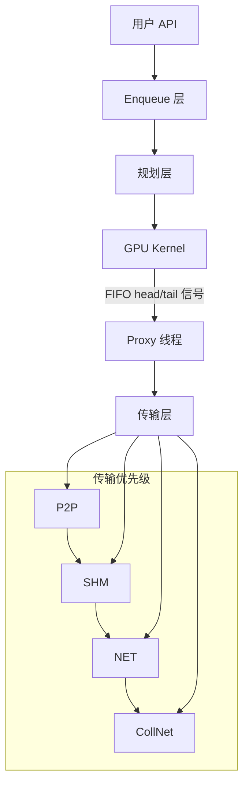
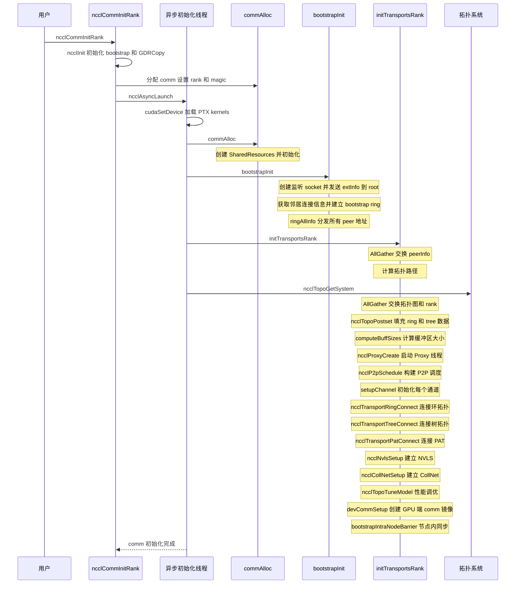
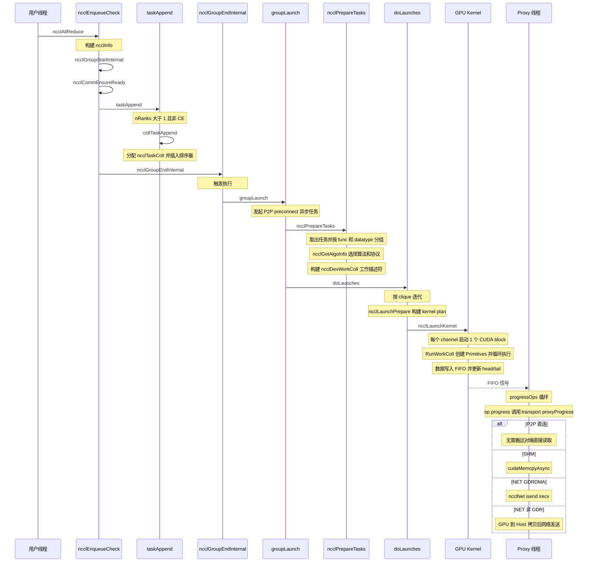
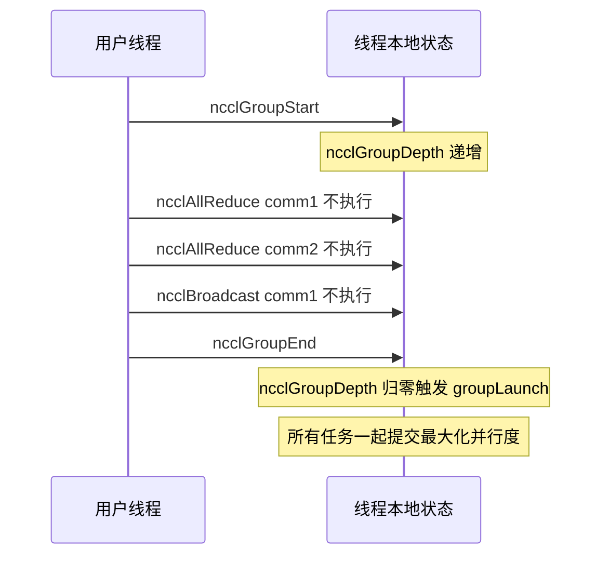
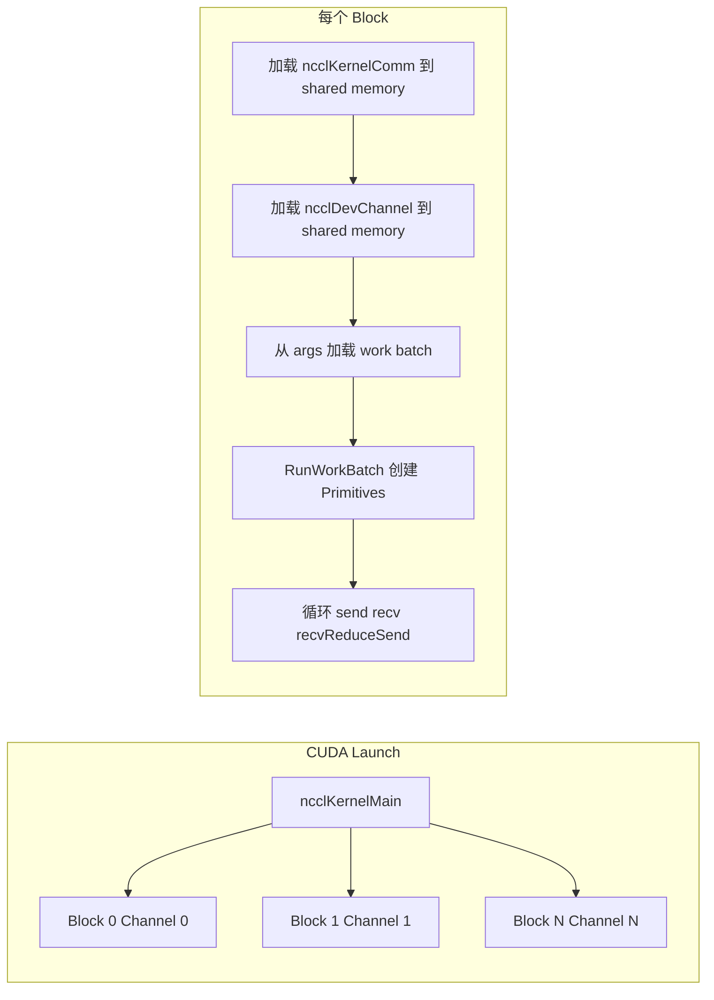
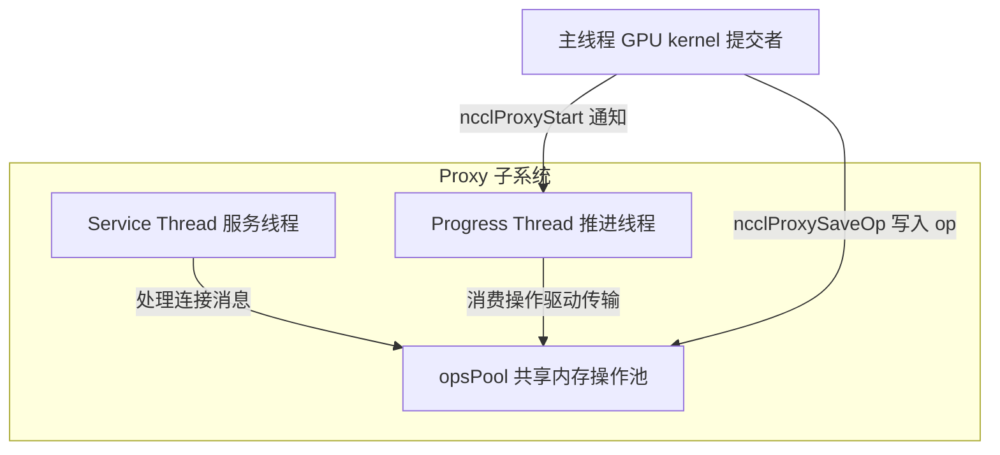
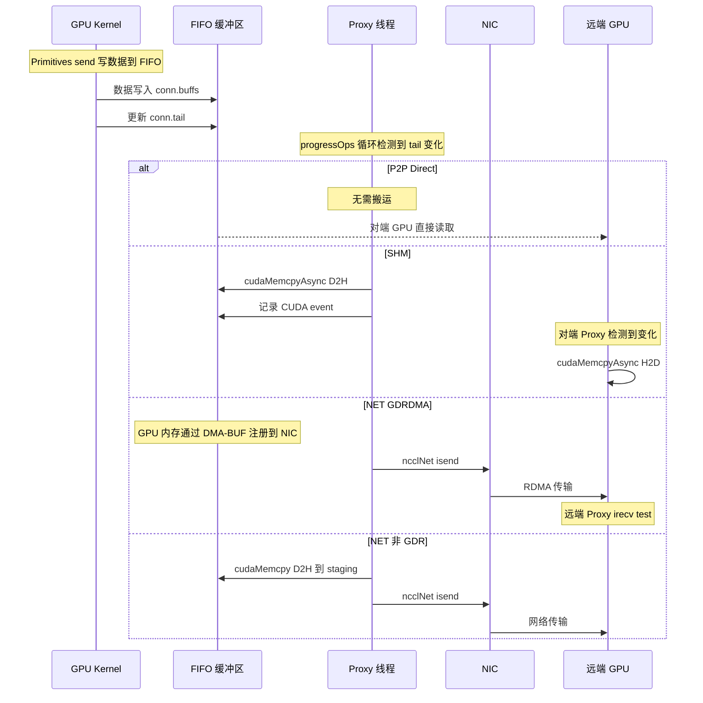
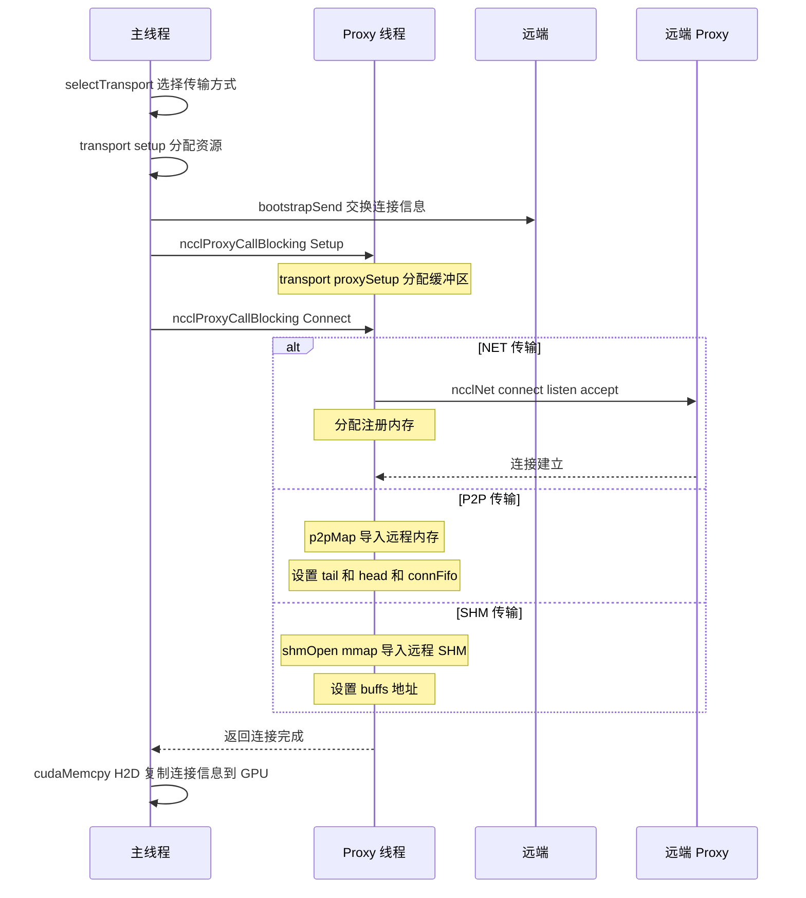
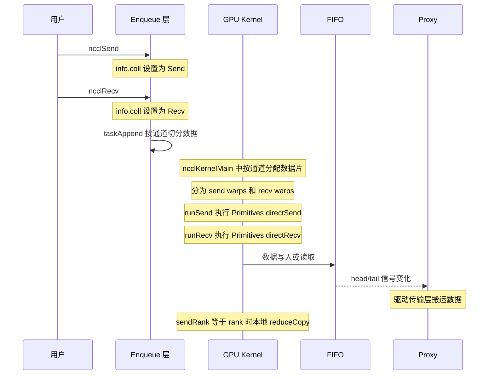
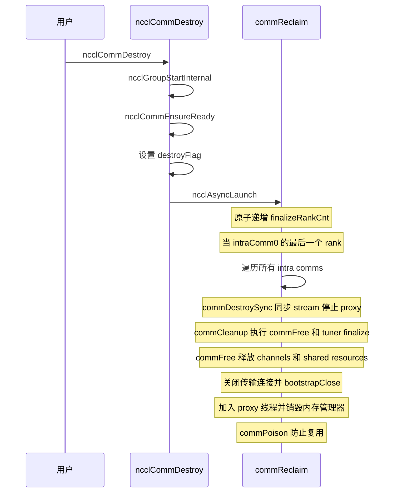

# NCCL 通信流程分析

## 1. 一句话概括

NCCL 是一个用于多 GPU 集体通信的库，采用组提交加算法选择加通道并行加 GPU 内核与 Proxy 线程协同的架构，通过 Ring/Tree/NVLS/CollNet 等拓扑算法和 P2P/SHM/NET 三级传输层，实现跨 GPU 和跨节点的高效数据交换。

## 2. 整体架构



## 3. 核心数据结构

| 结构 | 定义位置 | 作用 |
|------|---------|------|
| `ncclComm` | `include/comm.h` | 通信器，包含 rank、nRanks、channels、topo、bootstrap 等全部状态 |
| `ncclChannel` | `include/comm.h:147` | 通信通道，承载 ring/tree/collnet/NVLS 拓扑和 per-peer 连接信息 |
| `ncclInfo` | `include/info.h` | API 参数打包结构，从用户 API 传递到 enqueue 层 |
| `ncclTaskColl` | `include/comm.h:190` | 内部集合任务描述符（func、buffers、algo、protocol） |
| `ncclKernelComm` | `include/nccl_device/comm.h` | GPU 端通信器镜像，kernel 可直接访问 |
| `ncclDevChannel` | device 侧 | GPU 端通道数据，含 ring/tree/NVLS/collnet 连接信息 |
| `ncclProxyState` | `include/proxy.h:326` | Proxy 线程状态，管理 ops pool 和 progress 循环 |

### 3.1 通道（Channel）机制

```
每个 ncclComm 拥有最多 64 个通道（MAXCHANNELS = 64）
实际通道数由拓扑分析决定，通常为 min(ringGraph->nChannels, treeGraph->nChannels)

每个通道包含:
  - ring:    环拓扑（prev, next, userRanks[]）
  - tree:    树拓扑（up, down[NCCL_MAX_TREE_ARITY]）
  - nvls:    NVLS 拓扑（up[], down[], nHeads）
  - collnetDirect / collnetChain: CollNet 拓扑
  - peers[]: per-peer 连接信息（host + device）
```

通道提供通信并行性：大数据被分片到多个通道上并发传输。

## 4. 通信器初始化流程



### 4.1 Bootstrap 协议

Bootstrap 是带外协调通道，在传输层建立之前为所有 rank 提供 ring 通信能力：

```
1. 生成 ncclUniqueId 的 rank 启动 root 线程
2. 所有 rank 向 root 发送 extInfo（rank、监听地址）
3. Root 按环顺序匹配每个 rank 与其下一个邻居，并转发连接信息
4. 每个 rank 与前驱/后继建立 TCP 或网络插件连接，形成 bootstrap ring
5. 通过 ring-based AllGather 分发所有 peer 地址
```

## 5. 集合通信执行流程

以 `ncclAllReduce` 为例：



### 5.1 API 到 Kernel 的完整调用链

```
ncclAllReduce()                              [collectives.cc]
  → ncclEnqueueCheck(info)                   [enqueue.cc]
    → ncclGroupStartInternal()               // ncclGroupDepth++
    → ncclCommEnsureReady(comm)
    → taskAppend(comm, info)                 [enqueue.cc]
      → collTaskAppend(comm, info)           // 分配 ncclTaskColl, 排序插入
    → ncclGroupEndInternal()                 [group.cc]
      → groupLaunch()
        → ncclPrepareTasks()                 // 算法选择 + 通道分配
          → ncclGetAlgoInfo()                // 选 RING/TREE/NVLS/PAT + LL/LL128/SIMPLE
        → ncclTasksRegAndEnqueue()           // 注册 buffer, 构建工作描述符
        → doLaunches()
          → ncclLaunchKernel()               // <<< 启动 CUDA kernel >>>
```

### 5.2 Group 机制

Group 允许将多个集合操作批量提交、并发执行：



- 单独调用集合 API（不在 Group 内）会隐式包装为 depth 0→1→0 的 Group
- 支持嵌套 Group
- 任务按 trafficBytes 降序排列，大任务优先调度
- 同一 clique（共享 intraComm0）的 comm 的 kernel 可并行启动

## 6. 算法选择

### 6.1 可用算法

| 算法 | 适用集合 | 拓扑 | 说明 |
|------|---------|------|------|
| RING | AllReduce, ReduceScatter, AllGather, Broadcast, Reduce | 环 | 数据沿环依次传递，每个 rank 处理一个 chunk |
| TREE | AllReduce, ReduceScatter, AllGather, Broadcast, Reduce | 树 | 上下行两阶段：reduce-up → broadcast-down |
| NVLS | AllReduce, ReduceScatter, AllGather | NVLink SHARP | 单节点内通过 NVLink 互联做集合 |
| NVLS_TREE | AllReduce | NVLink + 网络 | 节点内 NVLS + 节点间 Tree |
| COLLNET_DIRECT | AllReduce | SHARP 硬件卸载 | 利用交换机内聚合能力 |
| COLLNET_CHAIN | AllReduce | 链式 CollNet | 多节点级联聚合 |
| PAT | ReduceScatter, AllGather | 自适应 | 并行自适应拓扑，递归倍增/减半 |

### 6.2 可用协议

| 协议 | 适用场景 | 特点 |
|------|---------|------|
| SIMPLE | 低延迟（NVLink、同节点） | FIFO 缓冲区 + head/tail 计数器同步，支持 Direct 模式（零拷贝） |
| LL (Large Latency) | 高延迟（跨节点网络） | 8B data + 8B flag 的 flag-word 协议，每步开销可忽略 |
| LL128 | 中等延迟（PCIe/NVLink） | 128-bit line 打包，专用 flag 线程 |

### 6.3 AllReduce Ring 算法示例（4 rank）

```
数据: [A0|A1|A2|A3] (rank 0), [B0|B1|B2|B3] (rank 1), [C0|C1|C2|C3] (rank 2), [D0|D1|D2|D3] (rank 3)
目标: 每个 rank 持有 [A0+B0+C0+D0 | A1+B1+C1+D1 | A2+B2+C2+D2 | A3+B3+C3+D3]

Phase 1: Reduce-Scatter (3 步，沿环 reduce-forward)
  Step 1: Rank 0→1: A2;  Rank 1→2: B3;  Rank 2→3: C0;  Rank 3→0: D1
          Rank 0: D1+A1;  Rank 1: A2+B2;  Rank 2: B3+C3;  Rank 3: C0+D0
  Step 2: Rank 0→1: D1+A1;  Rank 1→2: A2+B2;  Rank 2→3: B3+C3;  Rank 3→0: C0+D0
          Rank 0: C0+D0+A0;  Rank 1: D1+A1+B1;  Rank 2: A2+B2+C2;  Rank 3: B3+C3+D3
  Step 3: Rank 0→1: C0+D0+A0;  ...
          Rank 0 持有完整的 A0+B0+C0+D0; Rank 1 持有 B 部分完整结果; ...

Phase 2: All-Gather (3 步，沿环 copy-forward)
  Step 4: Rank 0 将完整结果发给 Rank 1
  Step 5: Rank 1 转发给 Rank 2
  Step 6: Rank 2 转发给 Rank 3
  最终所有 rank 持有完整的 AllReduce 结果
```

## 7. GPU 内核执行模型

### 7.1 Kernel 启动与通道映射



- **一个 CUDA block 对应一个 channel**：`blockIdx.x` 通过 `channelMask` 的 popcount 映射到 channelId
- 通信器数据（rank, nRanks, abortFlag, buffSizes）和通道数据（ring/tree 拓扑, peer 连接）从 global memory 加载到 shared memory
- 支持工作批处理（work batching）：多个工作项可在同一 kernel 中顺序执行

### 7.2 三种设备端协议

| 协议 | 同步方式 | 特点 |
|------|---------|------|
| ProtoSimple | FIFO 缓冲区 + head/tail 计数器 | 发送方写数据更新 tail，接收方轮询 tail 读数据更新 head。支持 Direct 模式直接写对端输出地址（零拷贝） |
| ProtoLL | 每 16B 含 8B data + 8B flag | flag 是单调递增计数器（step+1），接收方轮询 flag 直到匹配期望值，写入方用 `__threadfence_system()` 保证全局可见 |
| ProtoLL128 | 128-bit line 末尾 flag | 紧凑打包数据，专用 flag 线程（tid%WARP_SIZE == FLAGTHREAD），两阶段加载/存储隐藏 shuffle 延迟 |

### 7.3 Primitives 操作

Primitives 模板类提供统一的 send/recv/reduce 接口：

| 操作 | 说明 | 用途 |
|------|------|------|
| `send(offset, size)` | 发送数据 | Ring forward, Tree broadcast |
| `recv(offset, size)` | 接收数据 | Tree gather |
| `recvReduceSend(offset, size)` | 接收 + reduce + 转发 | Ring reduce-scatter |
| `recvReduceCopySend(offset, size)` | 接收 + reduce + 存本地 + 转发 | Ring 最后一步 |
| `recvCopySend(offset, size)` | 接收 + 存本地 + 转发 | Ring all-gather |
| `directSend/directRecv` | 直接读写对端 buffer | P2P, Direct 模式 |
| `scatter/gather` | 分散/收集 | Broadcast, Reduce |

## 8. Proxy 线程模型

### 8.1 双线程架构



**Service Thread（服务线程）：**
- 在 `ncclProxyCreate` 时启动，绑定到专用 CPU 核
- 主循环：`poll()` 监听 socket，处理连接管理消息（Init/Setup/Connect/Register 等）
- 每个消息委托给对应 transport 的 `proxySetup/proxyConnect` 函数

**Progress Thread（推进线程）：**
- 在第一个需要 progress 的连接建立时惰性启动
- 主循环：反复调用 `progressOps()` 驱动所有活跃操作
- 从 `opsPool`（共享内存无锁队列）中取出操作，调用 `op->progress(proxyState, op)`
- 空闲时 `yield()` 等待新操作

### 8.2 数据搬运流程



### 8.3 代理操作状态机

```
每个 ProxySubArgs 追踪滑动窗口:
  posted      → 已交给 GPU 的 buffer 数
  received    → 对端确认收到的 buffer 数
  flushed     → GPU 端刷新完成的 buffer 数
  transmitted → 已发送到 NIC 的 buffer 数
  done        → NIC 确认完成的 buffer 数

状态流转: Ready → Progress → None (完成)
```

## 9. 传输层

### 9.1 传输选择优先级

```
selectTransport() 按优先级遍历:

  P2P → SHM → NET → CollNet

  每个传输的 canConnect() 判断是否可用:
  ┌─────────────┬──────────────────────────────────────────────────┐
  │ 传输         │ canConnect 条件                                   │
  ├─────────────┼──────────────────────────────────────────────────┤
  │ P2P         │ 同节点 + 支持 NVLink/IPC + 拓扑允许              │
  │ SHM         │ 同节点 + 同 /dev/shm + SHM_DISABLE≠1             │
  │ NET         │ 跨节点(必定可用) / 同节点(拓扑强制)               │
  │ CollNet     │ 不走 selectTransport，单独通过 CollNetSetup 建立  │
  └─────────────┴──────────────────────────────────────────────────┘
```

### 9.2 传输类型详解

| 传输 | 适用场景 | 数据路径 | Proxy 参与 |
|------|---------|---------|-----------|
| P2P/DIRECT | 同进程同 GPU | 直接指针访问 | 不需要 |
| P2P/IPC | 同节点不同进程 | CUDA IPC 导入远程内存 | 不需要 |
| P2P/CUMEM | 同节点不同进程 | cuMem API 导入 | 不需要 |
| SHM | 同节点无 P2P | 共享内存 + CPU bounce | CE memcpy (可选) |
| NET/GDR | 跨节点有 GDRCopy | GPU→NIC RDMA 直传 | isend/irecv + test |
| NET/非GDR | 跨节点 | GPU→Host→NIC | D2H/H2D 拷贝 + isend/irecv |
| CollNet | SHARP 硬件卸载 | GPU→交换机聚合 | irecv/isend + reqFifo |

### 9.3 连接建立流程



## 10. Send/Recv (P2P) 流程



- Send/Recv 以 `uint8_t` 为单位操作（`static_assert(sizeof(T)==1)`）
- 通道分配使用 bit-reversal permutation 避免竞争
- 协议可选 LL 或 SIMPLE
- 同一 Group 内多个 Send/Recv 可被批处理

## 11. 销毁流程



## 12. 源码索引

| 文件 | 内容 |
|------|------|
| `collectives.cc` | 所有集合通信 API 入口 (AllReduce, Broadcast, Reduce 等) |
| `enqueue.cc` | 任务提交、算法选择、通道分配、kernel plan 构建 |
| `group.cc` | Group Start/End 机制，同步/异步启动 |
| `init.cc` | 通信器初始化 (ncclCommInitRank, Destroy) |
| `bootstrap.cc` | Bootstrap 协议 (ring 建立, AllGather 地址交换) |
| `channel.cc` | 通道初始化/释放 (per-channel 拓扑和连接) |
| `transport.cc` | 传输层框架 (selectTransport, CollNet setup) |
| `transport/p2p.cc` | P2P 传输 (DIRECT/IPC/CUMEM) |
| `transport/shm.cc` | 共享内存传输 |
| `transport/net.cc` | 网络传输 (IB/RoCE, GDRDMA, PXN) |
| `transport/coll_net.cc` | CollNet 传输 (SHARP 硬件卸载) |
| `proxy.cc` | Proxy 线程 (Service + Progress) |
| `device/common.cu` | GPU 端入口 (ncclKernelMain, work batch) |
| `device/primitives.h` | Primitives 模板基类 |
| `device/prims_simple.h` | SIMPLE 协议实现 |
| `device/prims_ll.h` | LL 协议实现 |
| `device/prims_ll128.h` | LL128 协议实现 |
| `device/all_reduce.h` | AllReduce kernel (Ring/Tree/NVLS/CollNet) |
| `device/reduce_scatter.h` | ReduceScatter kernel |
| `device/all_gather.h` | AllGather kernel |
| `device/sendrecv.h` | Send/Recv kernel |
| `include/trees.h` | 拓扑生成 (binary/double tree) |
| `include/comm.h` | ncclComm, ncclChannel 结构定义 |
| `include/proxy.h` | Proxy 状态、操作池、连接结构 |
| `include/collectives.h` | RingAlgorithm, PAT 算法 |
| `include/transport.h` | 传输层接口定义 |
