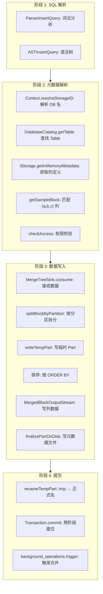
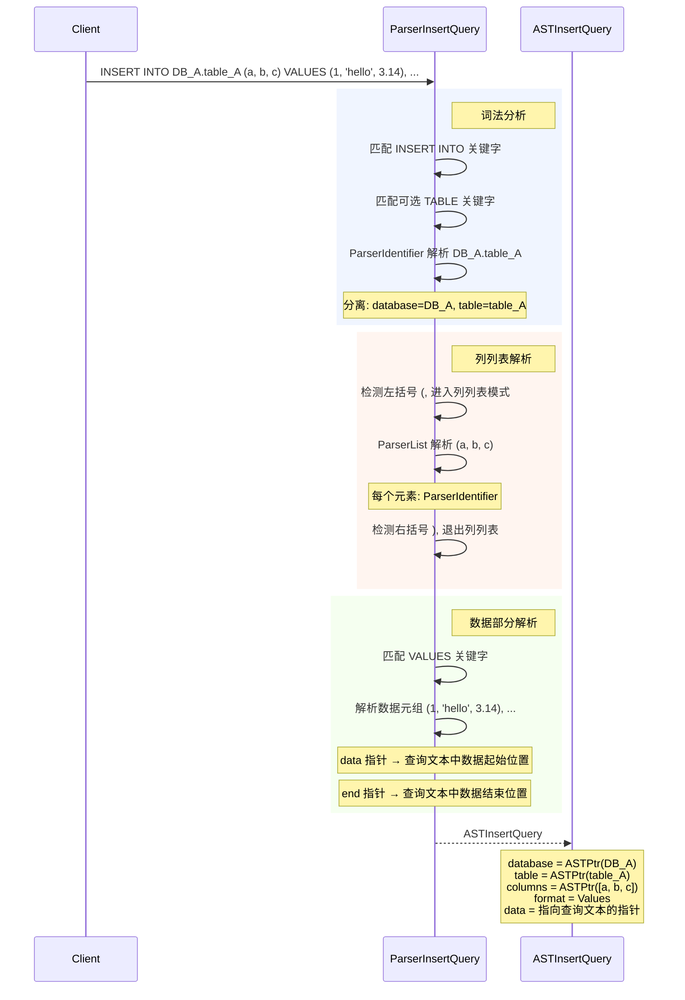
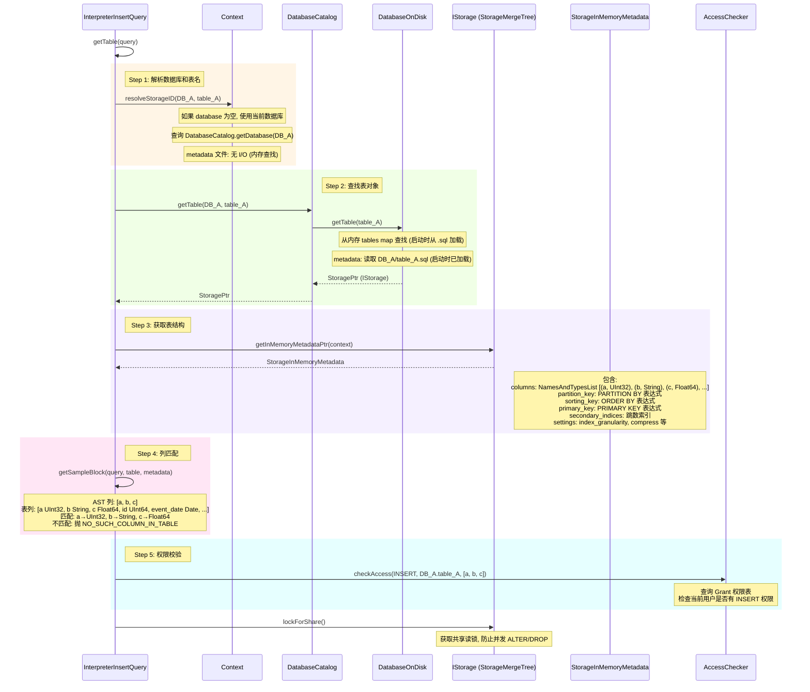
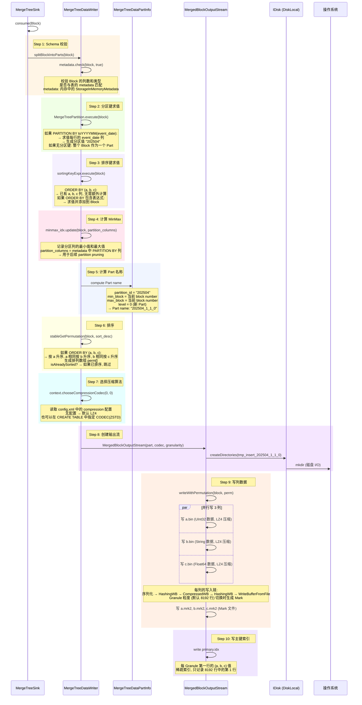
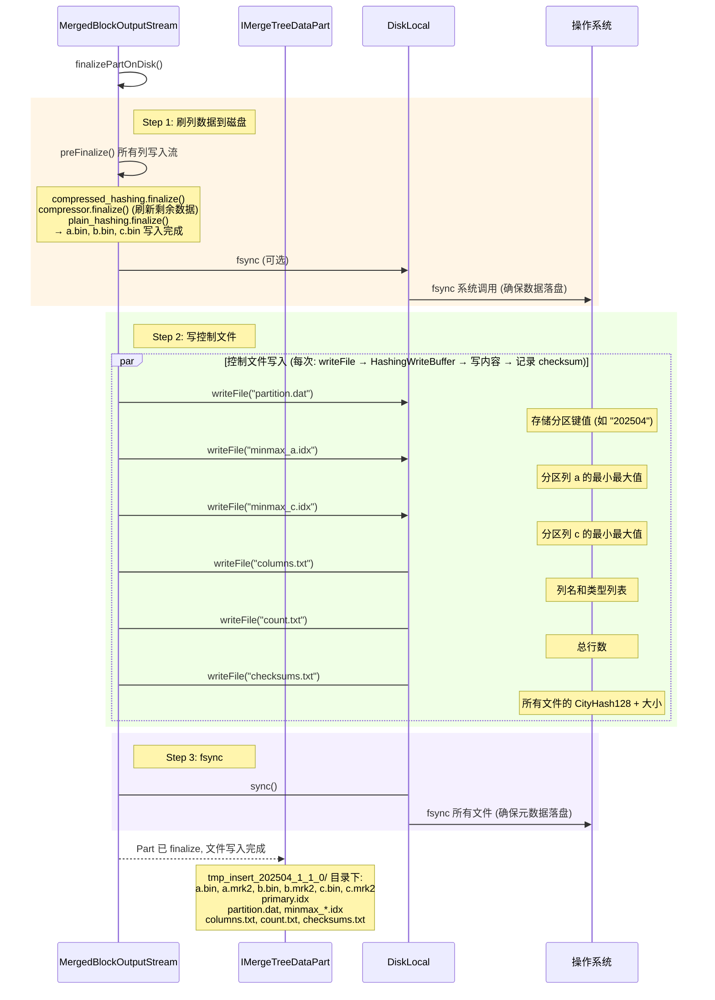
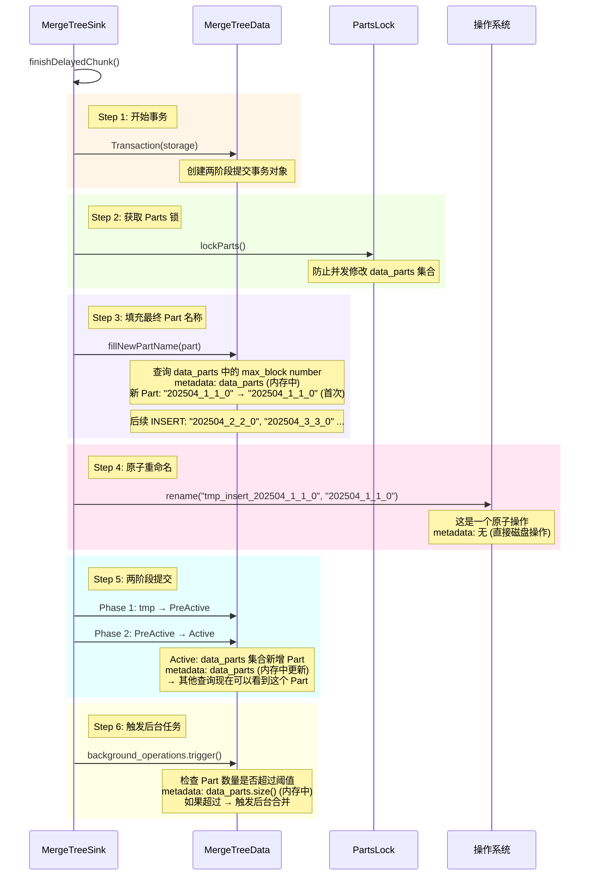
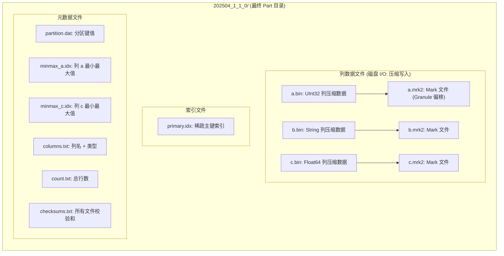
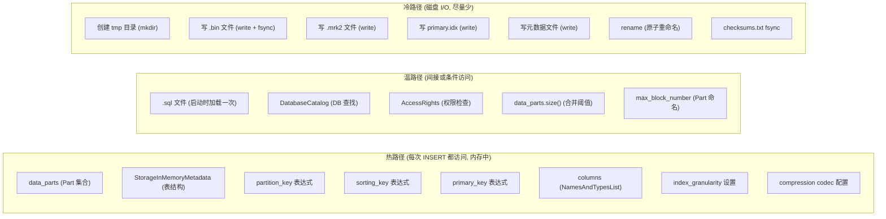

# ClickHouse INSERT 执行流程分析

> 基于 ClickHouse 源码分析, 追踪 `INSERT INTO DB_A.table_A (a, b, c) VALUES (1, 2, 3), ...` 的完整执行路径, 每一步标注了涉及的元数据查询和数据落盘细节

## 一、全链路总览



## 二、SQL 解析阶段



**此阶段不查询任何元数据**, 纯粹的语法分析, 生成 AST。

## 三、元数据解析阶段 (关键步骤)



### 此阶段涉及的元数据查询汇总

| 步骤 | 查询内容 | 数据来源 | 是否磁盘 I/O |
|------|---------|---------|------------|
| 解析 DB 名 | database 存在性 | DatabaseCatalog 内存 map | 否 |
| 查找表 | table 对象 | DatabaseOnDisk.tables map | 否 (启动时从 .sql 加载) |
| 表结构 | 列名、类型、分区键、排序键 | StorageInMemoryMetadata | 否 (内存中) |
| 列匹配 | (a,b,c) → 类型 | metadata.getSampleBlockInsertable() | 否 |
| 权限 | INSERT 权限 | AccessRights | 否 |

## 四、数据写入阶段



### 写入阶段元数据查询汇总

| 步骤 | 查询的元数据 | 用途 |
|------|------------|------|
| Schema 校验 | metadata.columns | 验证 Block 列与表定义一致 |
| 分区键求值 | metadata.partition_key | 计算 PARTITION BY 值 |
| 排序键求值 | metadata.sorting_key | 构建 SortDescription |
| MinMax | metadata.partition_key 列 | 记录分区列最值 |
| 排序 | metadata.sorting_key 列 | 生成排列顺序 |
| 主键索引 | metadata.primary_key | 选择索引列写入 primary.idx |
| 压缩算法 | context config.xml | 选择 LZ4/ZSTD/默认 |
| Granularity | metadata.settings.index_granularity | 每 8192 行生成 Mark |
| 列名+类型 | metadata.columns | 写 columns.txt |

## 五、元数据文件落盘阶段



## 六、两阶段提交阶段



## 七、数据落盘完整文件列表



### 每个文件的落盘细节

| 文件 | 写入方式 | Buffer 链 | 磁盘 I/O |
|------|---------|---------|---------|
| `a.bin` | 逐 Granule | Serialize → HashingWB → **CompressedWB** → HashingWB → WriteBufferFromFile | write() + fsync |
| `a.mrk2` | 逐 Granule | 计算偏移 → HashingWB → CompressedWB → HashingWB → WriteBufferFromFile | write() |
| `b.bin` | 逐 Granule | 同 a.bin, 但 String 列数据更大 | write() |
| `primary.idx` | 每 Granule 第一行 | Serialize → (可选) CompressedWB → HashingWB → WriteBufferFromFile | write() |
| `partition.dat` | 一次性 | Serialize → HashingWB → WriteBufferFromFile | write() |
| `minmax_*.idx` | 一次性 | Serialize → HashingWB → WriteBufferFromFile | write() |
| `columns.txt` | 一次性 | NamesAndTypesList.writeText → HashingWB → WriteBufferFromFile | write() |
| `count.txt` | 一次性 | toString → HashingWB → WriteBufferFromFile | write() |
| `checksums.txt` | 所有文件写完后 | 遍历 checksum map → HashingWB → WriteBufferFromFile | write() + fsync |

## 八、全程元数据访问热力图



## 九、性能优化要点

```
1. 零元数据 I/O 设计
   所有元数据 (表结构, Part 列表, 设置) 在内存中
   INSERT 过程中不读取任何磁盘元数据文件
   .sql 文件仅在启动时加载一次

2. 批量写入效率
   一次 INSERT 批量写入, 不是逐行
   排序后顺序写入, 利用磁盘顺序写优势
   压缩减少磁盘 I/O 量

3. 延迟提交
   Part 先写为 tmp_, 数据就绪后再原子 rename
   rename 是原子操作, 保证查询不会看到不完整 Part

4. 后台合并异步化
   INSERT 路径完全不等待合并
   合并由后台线程独立触发
   INSERT 延迟 = 排序 + 写磁盘 + rename (不含合并)
```
