# ClickHouse I/O 流程分析

> 基于 ClickHouse 源码 (ClickHouse-master) 分析，聚焦 I/O 层的 Buffer 链、压缩、缓存、异步与预取机制

## 一、I/O 层整体架构

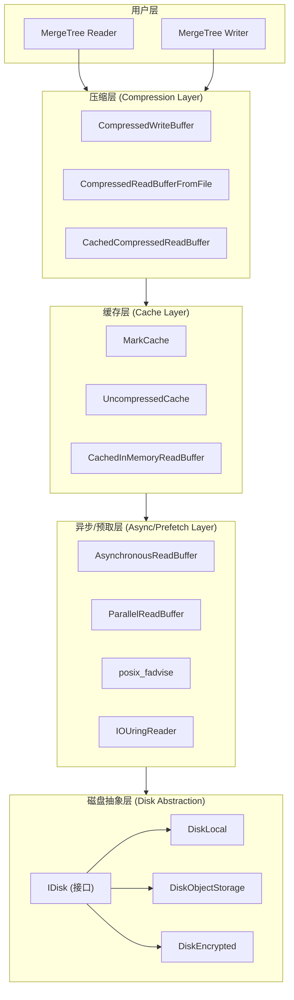
```mermaid
flowchart TB
    subgraph UserLayer["用户层"]
        Reader["MergeTree Reader"]
        Writer["MergeTree Writer"]
    end

    subgraph CompressLayer["压缩层 (Compression Layer)"]
        CWBuf["CompressedWriteBuffer"]
        CRBufFile["CompressedReadBufferFromFile"]
        CCachedBuf["CachedCompressedReadBuffer"]
    end

    subgraph CacheLayer["缓存层 (Cache Layer)"]
        MarkCache["MarkCache"]
        UCache["UncompressedCache"]
        PageCache["CachedInMemoryReadBuffer"]
    end

    subgraph AsyncLayer["异步/预取层 (Async/Prefetch Layer)"]
        AsyncBuf["AsynchronousReadBuffer"]
        ParallelBuf["ParallelReadBuffer"]
        FAdvise["posix_fadvise"]
        IOUring["IOUringReader"]
    end

    subgraph DiskLayer["磁盘抽象层 (Disk Abstraction)"]
        IDisk["IDisk (接口)"]
        DiskLocal["DiskLocal"]
        DiskRemote["DiskObjectStorage"]
        DiskEncrypted["DiskEncrypted"]
        IDisk --> DiskLocal
        IDisk --> DiskRemote
        IDisk --> DiskEncrypted
    end

    Reader --> CompressLayer
    Writer --> CompressLayer
    CompressLayer --> CacheLayer
    CacheLayer --> AsyncLayer
    AsyncLayer --> DiskLayer
```

### ReadBuffer 工厂方法

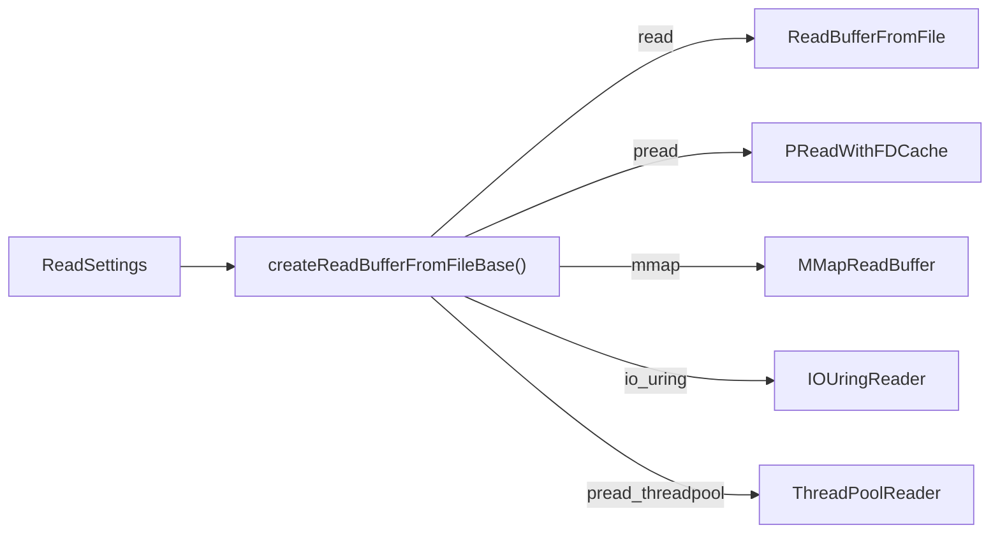
```mermaid
flowchart LR
    RS["ReadSettings"] --> Factory["createReadBufferFromFileBase()"]
    Factory --> |read| RBF["ReadBufferFromFile"]
    Factory --> |pread| PRFD["PReadWithFDCache"]
    Factory --> |mmap| MMAP["MMapReadBuffer"]
    Factory --> |io_uring| IOUR["IOUringReader"]
    Factory --> |pread_threadpool| TPR["ThreadPoolReader"]
```

## 二、写入 I/O 流程

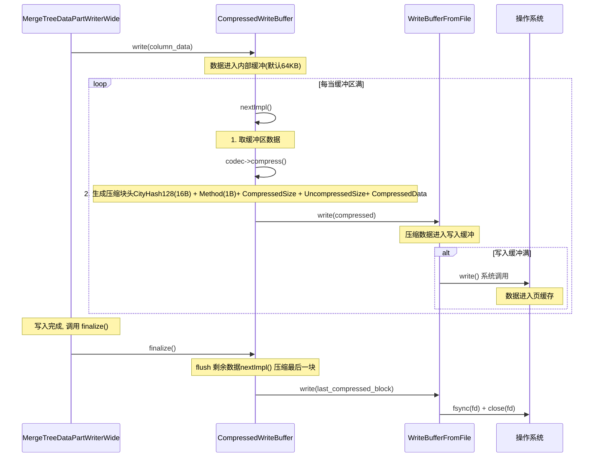
```mermaid
sequenceDiagram
    participant W as MergeTreeDataPartWriterWide
    participant CWB as CompressedWriteBuffer
    participant WB as WriteBufferFromFile
    participant OS as 操作系统

    W->>CWB: write(column_data)
    Note over CWB: 数据进入内部缓冲(默认64KB)

    loop 每当缓冲区满
        CWB->>CWB: nextImpl()
        Note over CWB: 1. 取缓冲区数据
        CWB->>CWB: codec->compress()
        Note over CWB: 2. 生成压缩块头CityHash128(16B) + Method(1B)+ CompressedSize + UncompressedSize+ CompressedData
        CWB->>WB: write(compressed)
        Note over WB: 压缩数据进入写入缓冲

        alt 写入缓冲满
            WB->>OS: write() 系统调用
            Note over OS: 数据进入页缓存
        end
    end

    Note over W: 写入完成, 调用 finalize()
    W->>CWB: finalize()
    Note over CWB: flush 剩余数据nextImpl() 压缩最后一块
    CWB->>WB: write(last_compressed_block)
    WB->>OS: fsync(fd) + close(fd)
```

### 压缩块磁盘格式

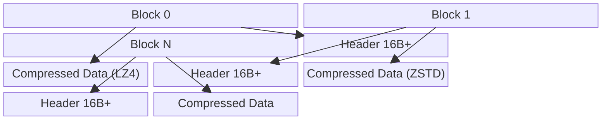
```mermaid
block-beta
    columns 3
    B0["Block 0"]:2
    B1["Block 1"]:2
    BN["Block N"]:2
    B0 --> H0["Header 16B+"]
    B0 --> CD0["Compressed Data (LZ4)"]
    B1 --> H1["Header 16B+"]
    B1 --> CD1["Compressed Data (ZSTD)"]
    BN --> HN["Header 16B+"]
    BN --> CDN["Compressed Data"]
```

### 并行压缩写入

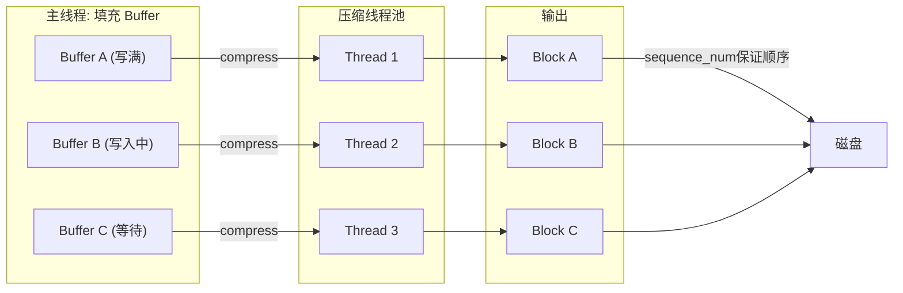
```mermaid
flowchart LR
    subgraph Main["主线程: 填充 Buffer"]
        BA["Buffer A (写满)"]
        BB["Buffer B (写入中)"]
        BC["Buffer C (等待)"]
    end

    subgraph TP["压缩线程池"]
        T1["Thread 1"]
        T2["Thread 2"]
        T3["Thread 3"]
    end

    subgraph Output["输出"]
        O1["Block A"]
        O2["Block B"]
        O3["Block C"]
    end

    BA --> |compress| T1 --> O1
    BB --> |compress| T2 --> O2
    BC --> |compress| T3 --> O3
    O1 --> |sequence_num保证顺序| Disk["磁盘"]
    O2 --> Disk
    O3 --> Disk
```

## 三、读取 I/O 流程

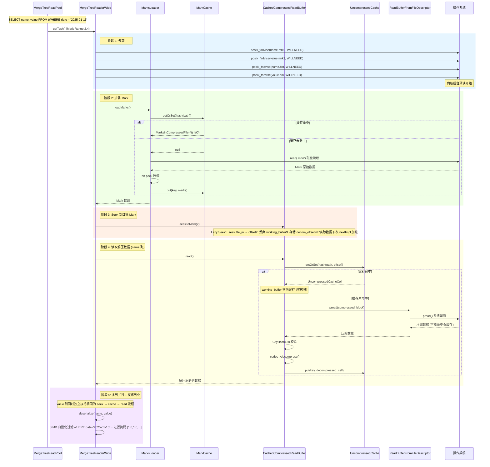
```mermaid
sequenceDiagram
    participant RP as MergeTreeReadPool
    participant RW as MergeTreeReaderWide
    participant ML as MarksLoader
    participant MC as MarkCache
    participant CS as CachedCompressedReadBuffer
    participant UC as UncompressedCache
    participant FD as ReadBufferFromFileDescriptor
    participant OS as 操作系统

    Note over RP: SELECT name, value FROM tWHERE date = '2025-01-15'

    RP->>RW: getTask() [Mark Range 2,4)

    rect rgb(230, 245, 255)
        Note right of RW: 阶段 1: 预取
        RW->>OS: posix_fadvise(name.mrk2, WILLNEED)
        RW->>OS: posix_fadvise(value.mrk2, WILLNEED)
        RW->>OS: posix_fadvise(name.bin, WILLNEED)
        RW->>OS: posix_fadvise(value.bin, WILLNEED)
        Note over OS: 内核后台预读开始
    end

    rect rgb(240, 255, 230)
        Note right of RW: 阶段 2: 加载 Mark
        RW->>ML: loadMarks()
        ML->>MC: getOrSet(hash(path))
        alt 缓存命中
            MC-->>ML: MarksInCompressedFile (零 I/O)
        else 缓存未命中
            MC-->>ML: null
            ML->>OS: read(.mrk2) 磁盘读取
            OS-->>ML: Mark 原始数据
            ML->>ML: bit-pack 压缩
            ML->>MC: put(key, marks)
        end
        ML-->>RW: Mark 数组
    end

    rect rgb(255, 240, 230)
        Note right of RW: 阶段 3: Seek 到目标 Mark
        RW->>CS: seekToMark(2)
        Note over CS: Lazy Seek1. seek file_in → offset2. 丢弃 working_buffer3. 存储 decom_offset=67实际数据下次 nextImpl 加载
    end

    rect rgb(255, 255, 230)
        Note right of RW: 阶段 4: 读取解压数据 (name 列)
        RW->>CS: read()
        CS->>UC: getOrSet(hash(path, offset))
        alt 缓存命中
            UC-->>CS: UncompressedCacheCell
            Note over CS: working_buffer 指向缓存 (零拷贝)
        else 缓存未命中
            CS->>FD: pread(compressed_block)
            FD->>OS: pread() 系统调用
            OS-->>FD: 压缩数据 (可能命中页缓存)
            FD-->>CS: 压缩数据
            CS->>CS: CityHash128 校验
            CS->>CS: codec->decompress()
            CS->>UC: put(key, decompressed_cell)
        end
        CS-->>RW: 解压后的列数据
    end

    rect rgb(245, 230, 255)
        Note right of RW: 阶段 5: 多列并行 + 反序列化
        Note over RW: value 列同时独立执行相同的 seek → cache → read 流程
        RW->>RW: deserialize(name, value)
        RW->>RW: SIMD 向量化过滤WHERE date='2025-01-15'→ 过滤掩码 [1,0,1,0,...]
    end
```

## 四、ReadBuffer 链式组合

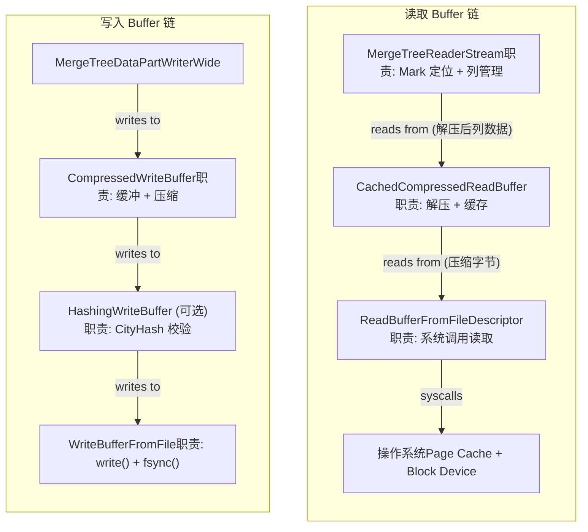
```mermaid
flowchart TB
    subgraph ReadChain["读取 Buffer 链"]
        direction TB
        User["MergeTreeReaderStream职责: Mark 定位 + 列管理"]
        CCBuf["CachedCompressedReadBuffer职责: 解压 + 缓存"]
        RFD["ReadBufferFromFileDescriptor职责: 系统调用读取"]
        Linux["操作系统Page Cache + Block Device"]
    end

    subgraph WriteChain["写入 Buffer 链"]
        direction TB
        WUser["MergeTreeDataPartWriterWide"]
        CWBuf["CompressedWriteBuffer职责: 缓冲 + 压缩"]
        HWBuf["HashingWriteBuffer (可选)职责: CityHash 校验"]
        WFile["WriteBufferFromFile职责: write() + fsync()"]
    end

    User -->|"reads from (解压后列数据)"| CCBuf
    CCBuf -->|"reads from (压缩字节)"| RFD
    RFD -->|"syscalls"| Linux

    WUser -->|"writes to"| CWBuf
    CWBuf -->|"writes to"| HWBuf
    HWBuf -->|"writes to"| WFile
```

### 各层职责

| 层级 | 职责 | 输入 | 输出 |
|------|------|------|------|
| ReadBufferFromFile | 系统调用 | fd + offset | 压缩字节 |
| CompressedReadBuffer | 解压缩 | 压缩字节 | 原始数据 |
| CachedCompressed | 解压 + 缓存 | 压缩字节 | 原始数据 (可能零拷贝) |
| MergeTreeReaderStream | Mark 定位 + 列管理 | 原始数据 | 列数据 |
| MergeTreeReaderWide | 多列协调 + 反序列化 | 列数据 | Block |

## 五、缓存体系

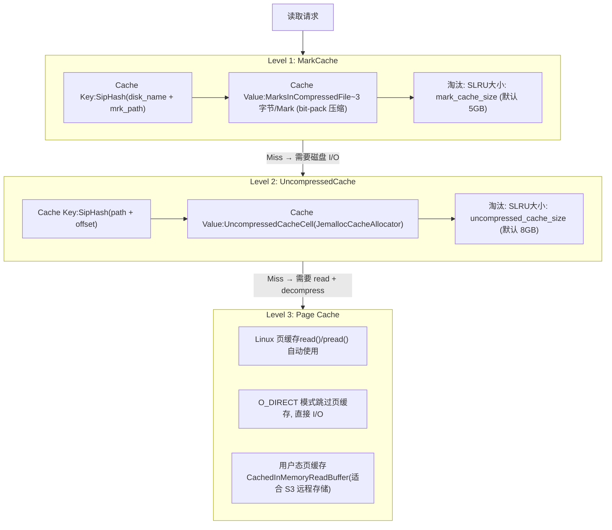
```mermaid
flowchart TB
    subgraph L1["Level 1: MarkCache"]
        direction LR
        MK_In["Cache Key:SipHash(disk_name + mrk_path)"]
        MK_Val["Cache Value:MarksInCompressedFile~3 字节/Mark (bit-pack 压缩)"]
        MK_Pol["淘汰: SLRU大小: mark_cache_size (默认 5GB)"]
        MK_In --> MK_Val --> MK_Pol
    end

    subgraph L2["Level 2: UncompressedCache"]
        direction LR
        UC_In["Cache Key:SipHash(path + offset)"]
        UC_Val["Cache Value:UncompressedCacheCell(JemallocCacheAllocator)"]
        UC_Pol["淘汰: SLRU大小: uncompressed_cache_size (默认 8GB)"]
        UC_In --> UC_Val --> UC_Pol
    end

    subgraph L3["Level 3: Page Cache"]
        direction LR
        PC_Linux["Linux 页缓存read()/pread() 自动使用"]
        PC_ODirect["O_DIRECT 模式跳过页缓存, 直接 I/O"]
        PC_User["用户态页缓存CachedInMemoryReadBuffer(适合 S3 远程存储)"]
    end

    ReadPath["读取请求"] --> L1
    L1 -->|"Miss → 需要磁盘 I/O"| L2
    L2 -->|"Miss → 需要 read + decompress"| L3
```

### Mark 加载缓存流程

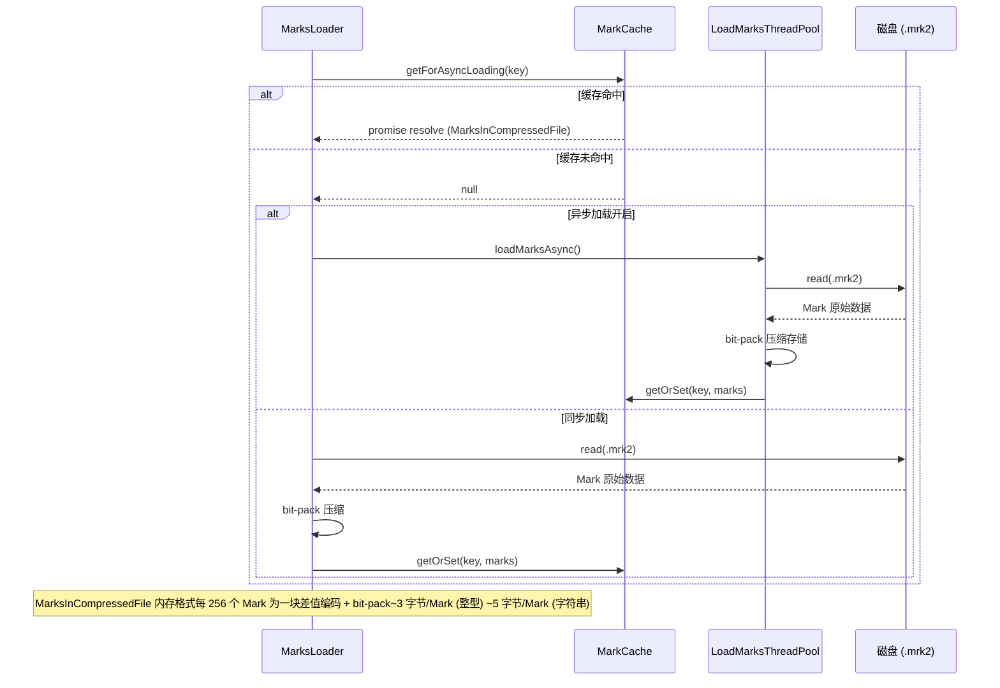
```mermaid
sequenceDiagram
    participant RL as MarksLoader
    participant MC as MarkCache
    participant TP as LoadMarksThreadPool
    participant Disk as 磁盘 (.mrk2)

    RL->>MC: getForAsyncLoading(key)
    alt 缓存命中
        MC-->>RL: promise resolve (MarksInCompressedFile)
    else 缓存未命中
        MC-->>RL: null
        alt 异步加载开启
            RL->>TP: loadMarksAsync()
            TP->>Disk: read(.mrk2)
            Disk-->>TP: Mark 原始数据
            TP->>TP: bit-pack 压缩存储
            TP->>MC: getOrSet(key, marks)
        else 同步加载
            RL->>Disk: read(.mrk2)
            Disk-->>RL: Mark 原始数据
            RL->>RL: bit-pack 压缩
            RL->>MC: getOrSet(key, marks)
        end
    end
    Note over RL: MarksInCompressedFile 内存格式每 256 个 Mark 为一块差值编码 + bit-pack~3 字节/Mark (整型) ~5 字节/Mark (字符串)
```

### UncompressedCache 读取流程

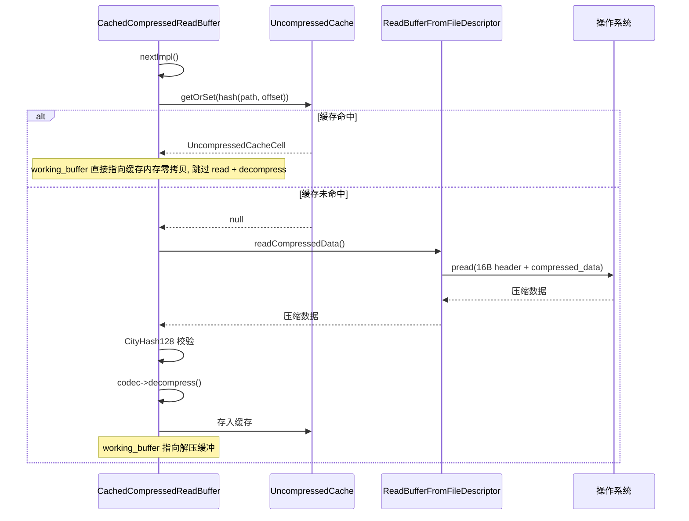
```mermaid
sequenceDiagram
    participant CCRB as CachedCompressedReadBuffer
    participant UC as UncompressedCache
    participant FD as ReadBufferFromFileDescriptor
    participant OS as 操作系统

    CCRB->>CCRB: nextImpl()
    CCRB->>UC: getOrSet(hash(path, offset))

    alt 缓存命中
        UC-->>CCRB: UncompressedCacheCell
        Note over CCRB: working_buffer 直接指向缓存内存零拷贝, 跳过 read + decompress
    else 缓存未命中
        UC-->>CCRB: null
        CCRB->>FD: readCompressedData()
        FD->>OS: pread(16B header + compressed_data)
        OS-->>FD: 压缩数据
        FD-->>CCRB: 压缩数据
        CCRB->>CCRB: CityHash128 校验
        CCRB->>CCRB: codec->decompress()
        CCRB->>UC: 存入缓存
        Note over CCRB: working_buffer 指向解压缓冲
    end
```

## 六、异步 I/O 与预取机制

### ReadMethod 对比

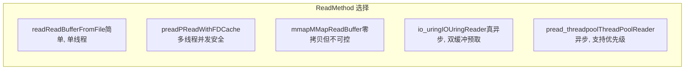
```mermaid
flowchart LR
    subgraph RM["ReadMethod 选择"]
        R1["readReadBufferFromFile简单, 单线程"]
        R2["preadPReadWithFDCache多线程并发安全"]
        R3["mmapMMapReadBuffer零拷贝但不可控"]
        R4["io_uringIOUringReader真异步, 双缓冲预取"]
        R5["pread_threadpoolThreadPoolReader异步, 支持优先级"]
    end
```

### posix_fadvise 预取时序

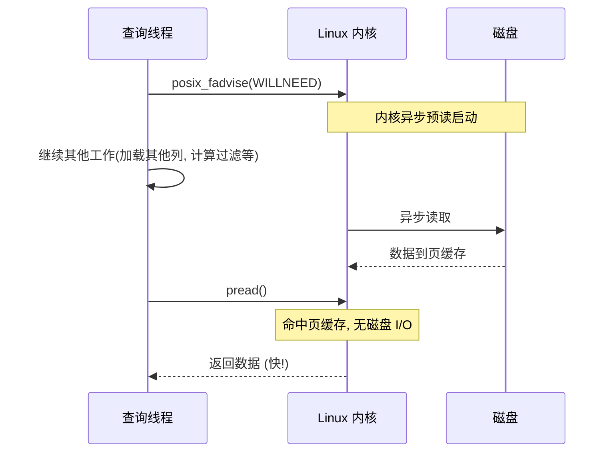
```mermaid
sequenceDiagram
    participant QT as 查询线程
    participant Kern as Linux 内核
    participant Disk as 磁盘

    QT->>Kern: posix_fadvise(WILLNEED)
    Note over Kern,Disk: 内核异步预读启动
    QT->>QT: 继续其他工作(加载其他列, 计算过滤等)
    Kern->>Disk: 异步读取
    Disk-->>Kern: 数据到页缓存

    QT->>Kern: pread()
    Note over Kern: 命中页缓存, 无磁盘 I/O
    Kern-->>QT: 返回数据 (快!)
```

### io_uring 双缓冲预取时序

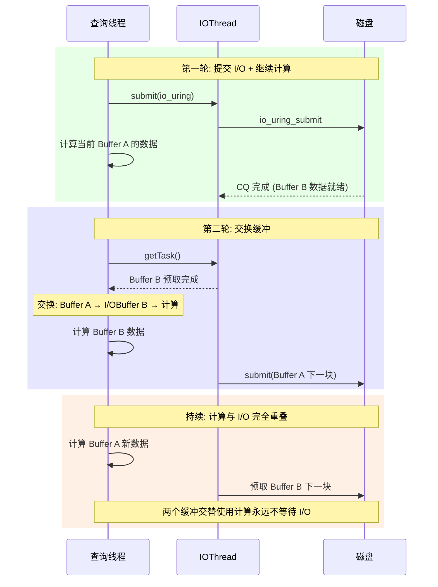
```mermaid
sequenceDiagram
    participant QT as 查询线程
    participant IO as IOThread
    participant Disk as 磁盘

    rect rgb(230, 255, 230)
        Note over QT,Disk: 第一轮: 提交 I/O + 继续计算
        QT->>IO: submit(io_uring)
        IO->>Disk: io_uring_submit
        QT->>QT: 计算当前 Buffer A 的数据
        Disk-->>IO: CQ 完成 (Buffer B 数据就绪)
    end

    rect rgb(230, 230, 255)
        Note over QT,Disk: 第二轮: 交换缓冲
        QT->>IO: getTask()
        IO-->>QT: Buffer B 预取完成
        Note over QT: 交换: Buffer A → I/OBuffer B → 计算
        QT->>QT: 计算 Buffer B 数据
        IO->>Disk: submit(Buffer A 下一块)
    end

    rect rgb(255, 240, 230)
        Note over QT,Disk: 持续: 计算与 I/O 完全重叠
        QT->>QT: 计算 Buffer A 新数据
        IO->>Disk: 预取 Buffer B 下一块
        Note over QT,Disk: 两个缓冲交替使用计算永远不等待 I/O
    end
```

### 多列并行预取

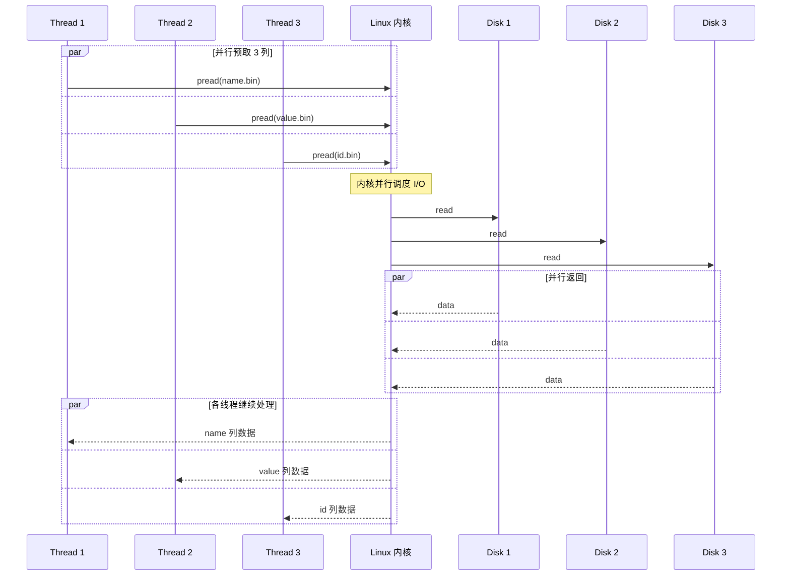
```mermaid
sequenceDiagram
    participant T1 as Thread 1
    participant T2 as Thread 2
    participant T3 as Thread 3
    participant K as Linux 内核
    participant D1 as Disk 1
    participant D2 as Disk 2
    participant D3 as Disk 3

    par 并行预取 3 列
        T1->>K: pread(name.bin)
        and
        T2->>K: pread(value.bin)
        and
        T3->>K: pread(id.bin)
    end

    Note over K: 内核并行调度 I/O
    K->>D1: read
    K->>D2: read
    K->>D3: read

    par 并行返回
        D1-->>K: data
        and
        D2-->>K: data
        and
        D3-->>K: data
    end

    par 各线程继续处理
        K-->>T1: name 列数据
        and
        K-->>T2: value 列数据
        and
        K-->>T3: id 列数据
    end
```

## 七、Seek 机制详解

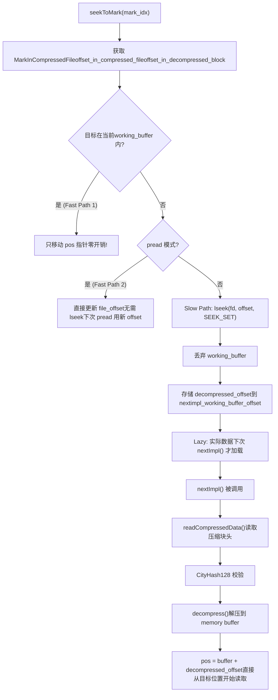
```mermaid
flowchart TD
    Start["seekToMark(mark_idx)"] --> GetMark["获取 MarkInCompressedFileoffset_in_compressed_fileoffset_in_decompressed_block"]
    GetMark --> Check1{"目标在当前working_buffer 内?"}

    Check1 -->|"是 (Fast Path 1)"| MovePtr["只移动 pos 指针零开销!"]

    Check1 -->|"否"| Check2{"pread 模式?"}
    Check2 -->|"是 (Fast Path 2)"| UpdateOffset["直接更新 file_offset无需 lseek下次 pread 用新 offset"]
    Check2 -->|"否"| SlowPath["Slow Path: lseek(fd, offset, SEEK_SET)"]

    SlowPath --> Discard["丢弃 working_buffer"]
    Discard --> StoreOffset["存储 decompressed_offset到 nextimpl_working_buffer_offset"]
    StoreOffset --> Lazy["Lazy: 实际数据下次 nextImpl() 才加载"]

    Lazy --> NextImpl["nextImpl() 被调用"]
    NextImpl --> ReadHeader["readCompressedData()读取压缩块头"]
    ReadHeader --> Verify["CityHash128 校验"]
    Verify --> Decompress["decompress()解压到 memory buffer"]
    Decompress --> Skip["pos = buffer + decompressed_offset直接从目标位置开始读取"]
```

### 连续 Mark vs 随机 Mark 读取

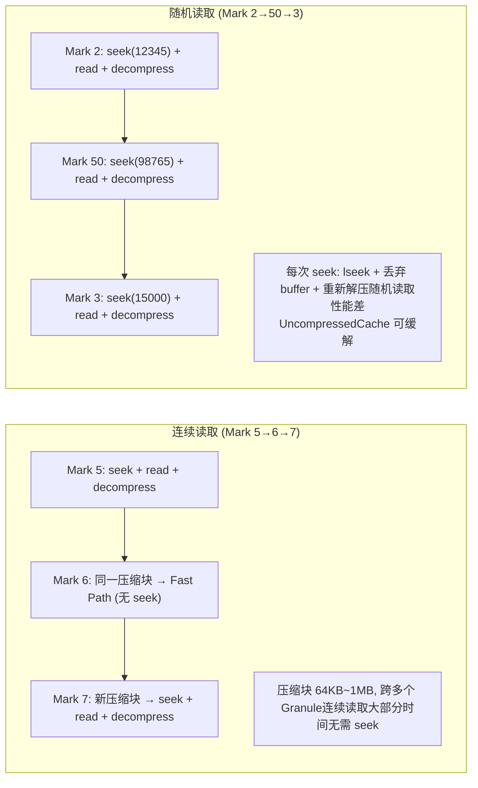
```mermaid
flowchart LR
    subgraph Sequential["连续读取 (Mark 5→6→7)"]
        direction TB
        S5["Mark 5: seek + read + decompress"]
        S6["Mark 6: 同一压缩块 → Fast Path (无 seek)"]
        S7["Mark 7: 新压缩块 → seek + read + decompress"]
        S5 --> S6 --> S7
        Note1["压缩块 64KB~1MB, 跨多个 Granule连续读取大部分时间无需 seek"]
    end

    subgraph Random["随机读取 (Mark 2→50→3)"]
        direction TB
        R2["Mark 2: seek(12345) + read + decompress"]
        R50["Mark 50: seek(98765) + read + decompress"]
        R3["Mark 3: seek(15000) + read + decompress"]
        R2 --> R50 --> R3
        Note2["每次 seek: lseek + 丢弃 buffer + 重新解压随机读取性能差UncompressedCache 可缓解"]
    end
```

## 八、远程存储 I/O

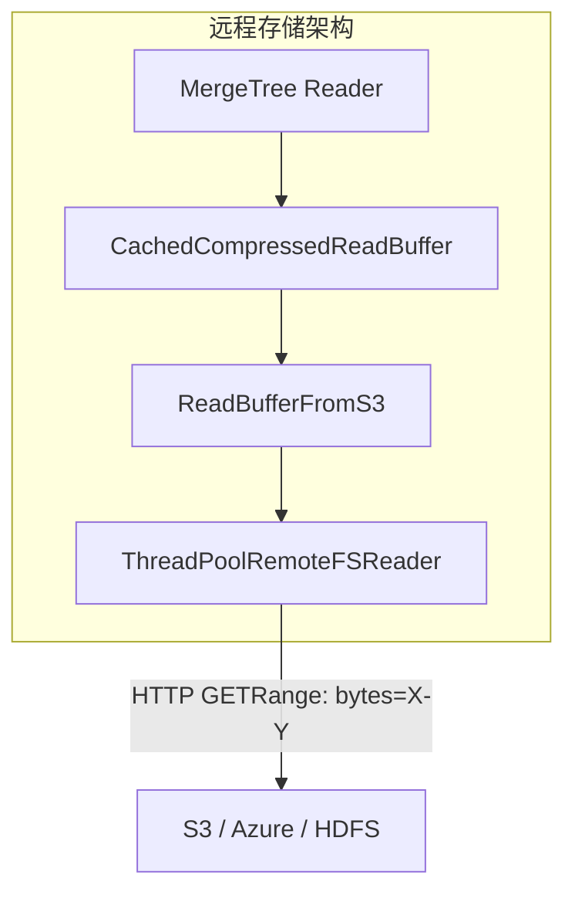
```mermaid
flowchart TB
    subgraph Remote["远程存储架构"]
        Reader["MergeTree Reader"]
        CCBuf["CachedCompressedReadBuffer"]
        S3Buf["ReadBufferFromS3"]
        TPRemote["ThreadPoolRemoteFSReader"]
    end

    Reader --> CCBuf --> S3Buf --> TPRemote
    TPRemote --> |HTTP GETRange: bytes=X-Y| S3["S3 / Azure / HDFS"]
```

### 远程存储优化策略

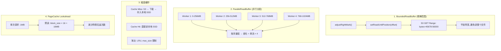
```mermaid
flowchart TB
    subgraph Opt1["1. BoundedReadBuffer (精确范围)"]
        direction LR
        Adj["adjustRightMark()"] --> Bounded["setReadUntilPosition(offset)"]
        Bounded --> Range["S3 GET Range: bytes=45678-56000"]
        Range --> Save["节省带宽, 避免读整个文件"]
    end

    subgraph Opt2["2. ParallelReadBuffer (并行分段)"]
        direction TB
        W1["Worker 1: 0-256MB"]
        W2["Worker 2: 256-512MB"]
        W3["Worker 3: 512-768MB"]
        W4["Worker 4: 768-1024MB"]
        Result["按序重组 → 吞吐 = 单流 × 4"]
        W1 --> Result
        W2 --> Result
        W3 --> Result
        W4 --> Result
    end

    subgraph Opt3["3. 磁盘缓存"]
        direction LR
        Miss["Cache Miss: S3 → 下载 → 存入本地 SSD"]
        Hit["Cache Hit: 直接读本地 SSD"]
        Evict["淘汰: LRU, max_size 限制"]
    end

    subgraph Opt4["4. PageCache Lookahead"]
        direction LR
        One["单次请求: 1MB"]
        Multi["预读: block_size × 16 = 16MB"]
        One --> Multi --> RTT["减少网络往返次数"]
    end
```

## 九、I/O 线程池与反压

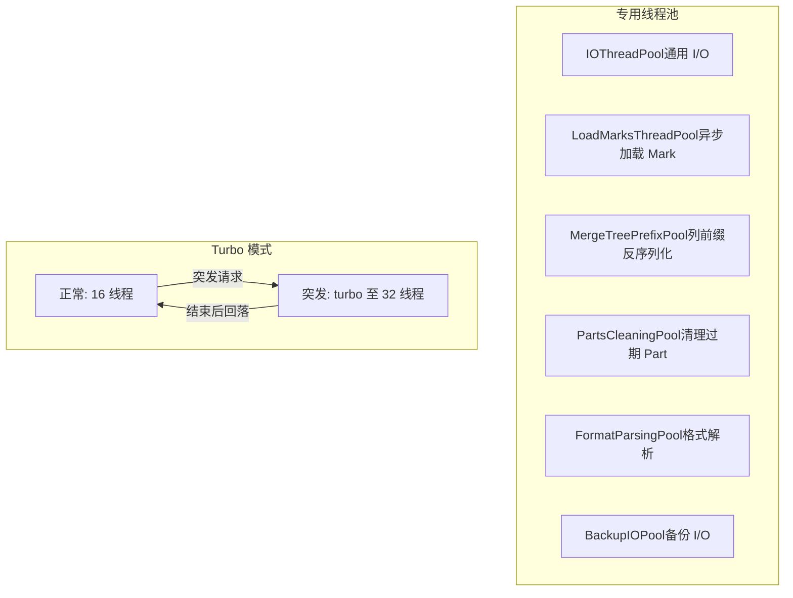
```mermaid
flowchart TB
    subgraph Pools["专用线程池"]
        P1["IOThreadPool通用 I/O"]
        P2["LoadMarksThreadPool异步加载 Mark"]
        P3["MergeTreePrefixPool列前缀反序列化"]
        P4["PartsCleaningPool清理过期 Part"]
        P5["FormatParsingPool格式解析"]
        P6["BackupIOPool备份 I/O"]
    end

    subgraph Turbo["Turbo 模式"]
        Normal["正常: 16 线程"]
        Burst["突发: turbo 至 32 线程"]
        Normal --> |"突发请求"| Burst
        Burst --> |"结束后回落"| Normal
    end
```

### 读反压机制

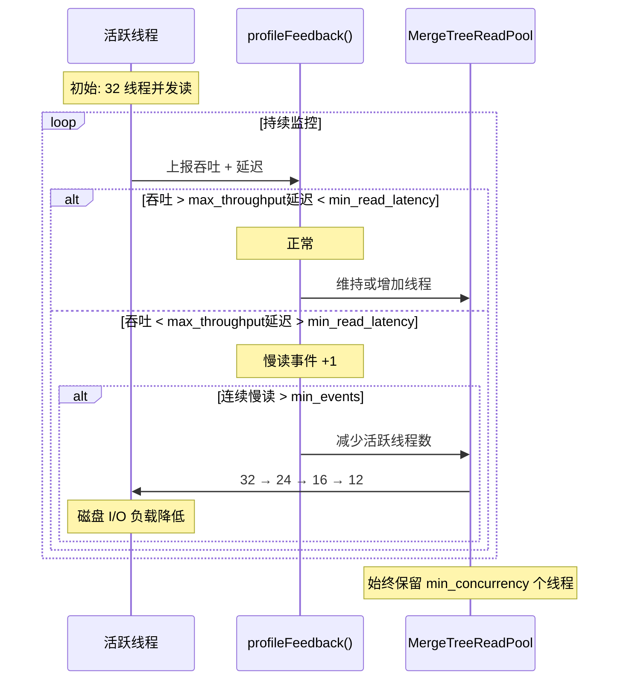
```mermaid
sequenceDiagram
    participant Threads as 活跃线程
    participant Monitor as profileFeedback()
    participant Pool as MergeTreeReadPool

    Note over Threads: 初始: 32 线程并发读

    loop 持续监控
        Threads->>Monitor: 上报吞吐 + 延迟
        alt 吞吐 > max_throughput延迟 < min_read_latency
            Note over Monitor: 正常
            Monitor->>Pool: 维持或增加线程
        else 吞吐 < max_throughput延迟 > min_read_latency
            Note over Monitor: 慢读事件 +1
            alt 连续慢读 > min_events
                Monitor->>Pool: 减少活跃线程数
                Pool->>Threads: 32 → 24 → 16 → 12
                Note over Threads: 磁盘 I/O 负载降低
            end
        end
    end

    Note over Pool: 始终保留 min_concurrency 个线程
```

## 十、完整查询 I/O 全景

```mermaid
sequenceDiagram
    participant Q as 查询
    participant PP as Part 过滤
    participant MR as Mark Range 选择
    participant PF as 预取
    participant MK as Mark 加载
    participant COL as 列数据读取
    participant VEC as 向量化过滤

    Note over Q: SELECT name, valueFROM t WHERE date='2025-01-15'

    rect rgb(255, 240, 230)
        Q->>PP: 解析查询, 生成执行计划
        PP->>PP: minmax 索引过滤3 分区 → 1 分区 (无 I/O)
        PP-->>Q: 过滤后的 Part 列表
    end

    rect rgb(240, 255, 230)
        Q->>MR: 加载 primary.idx
        MR->>MR: 二分查找 date='2025-01-15'
        MR-->>Q: 选中 3 个 Mark Range(少量 I/O, 可能已缓存)
    end

    rect rgb(230, 240, 255)
        Q->>PF: prefetchBeginOfRange()
        PF->>PF: posix_fadvise(WILLNEED)name.mrk2, value.mrk2name.bin, value.bin
        Note over PF: 内核后台预读(不等 I/O 完成)
    end

    rect rgb(255, 255, 230)
        Q->>MK: loadMarks()
        Note over MK: name.mrk2: MarkCache Hit (0 I/O)value.mrk2: Miss → 读磁盘 → 缓存
        MK-->>Q: Mark 数组
    end

    rect rgb(240, 230, 255)
        Q->>COL: 读取列数据 (3 列并行)
        par Thread 1: name 列
            COL->>COL: seek(Mark 2)
            COL->>COL: UncompressedCache Misspread → CityHash → LZ4 解压
        and Thread 2: value 列
            COL->>COL: seek(Mark 2)
            COL->>COL: UncompressedCache Misspread → CityHash → LZ4 解压
        and Thread 3: date 列 (过滤用)
            COL->>COL: seek(Mark 2)
            COL->>COL: UncompressedCache Hit! (零拷贝)
        end
    end

    rect rgb(255, 230, 240)
        Q->>VEC: SIMD 向量化过滤
        Note over VEC: WHERE date='2025-01-15'→ 过滤掩码 [1,0,0,1,0,...]→ 应用到 name 和 value 列
        VEC-->>Q: 结果 Block
    end

    rect rgb(230, 255, 255)
        Note over Q: 继续下一个 Mark Range...
    end
```

### I/O 统计对比

| 场景 | MarkCache | UncompressedCache | 磁盘读取 | 解压次数 | 估算耗时 |
|------|-----------|-------------------|----------|---------|---------|
| 首次查询 | Miss | Miss | ~500KB | 3 | ~6.5ms |
| 同查询重跑 | Hit | Hit | 0 | 0 | ~0.5ms |
| 不同列同 Part | Hit | Miss | ~350KB | 2 | ~4ms |

## 十一、为什么 ReadBuffer 有工厂方法而 WriteBuffer 没有？

### 设计对比

| 维度 | ReadBuffer | WriteBuffer |
|------|-----------|-------------|
| 工厂方法 | `createReadBufferFromFileBase()` 独立工厂函数 | 无，直接在各 `Disk` 子类中 `make_unique` |
| 工厂文件 | `src/Disks/IO/createReadBufferFromFileBase.h` | 不存在 |
| ReadMethod 选择 | 工厂根据 `ReadSettings.read_method` 选择 5 种 Buffer | 无类似机制，只有 `WriteBufferFromFile` 一种 |
| 创建位置 | 磁盘抽象层 + 工厂解耦 | 各 Disk 子类各自实现 `writeFile()` |

### ReadBuffer 工厂方法流程

```mermaid
sequenceDiagram
    participant Caller as 调用方 (MergeTreeReader)
    participant Disk as DiskLocal / DiskObjectStorage
    participant Factory as createReadBufferFromFileBase()
    participant Settings as ReadSettings

    Caller->>Disk: readFile(path, settings)
    Disk->>Factory: createReadBufferFromFileBase(path, settings)
    Factory->>Settings: settings.read_method

    alt read
        Factory-->>Caller: ReadBufferFromFile
    else pread
        Factory-->>Caller: PReadWithFDCache
    else mmap
        Factory-->>Caller: MMapReadBuffer
    else io_uring
        Factory-->>Caller: IOUringReader
    else pread_threadpool
        Factory-->>Caller: ThreadPoolReader
    end
```

### WriteBuffer 直接创建流程

```mermaid
sequenceDiagram
    participant Caller as 调用方 (MergeTreeWriter)
    participant Disk as DiskLocal
    participant CWBuf as CompressedWriteBuffer
    participant WBuf as WriteBufferFromFile

    Caller->>Disk: writeFile(path, buf_size, mode, settings)
    Note over Disk: 无工厂, 无 ReadMethod 式选择
    Disk->>Disk: make_unique of WriteBufferFromFile
    Note over Disk: 固定类型: open() + write() + fsync()
    Disk-->>Caller: unique_ptr of WriteBufferFromFile

    Caller->>CWBuf: CompressedWriteBuffer(底层 WBuf)
    Note over CWBuf: 复杂性在上层装饰器链<br/>CompressedWriteBuffer<br/>→ HashingWriteBuffer (可选)<br/>→ WriteBufferFromFile
```

### 根本原因：读 5 种 vs 写 1 种

```mermaid
flowchart TB
    subgraph ReadPath["读路径: 复杂, 需要工厂"]
        direction TB
        RS["ReadSettings.read_method"]
        RS --> R1["read: ReadBufferFromFile"]
        RS --> R2["pread: PReadWithFDCache"]
        RS --> R3["mmap: MMapReadBuffer"]
        RS --> R4["io_uring: IOUringReader"]
        RS --> R5["pread_threadpool: ThreadPoolReader"]
        Note1["5 种 I/O 方式需要运行时选择<br/>→ 工厂模式解耦"]
    end

    subgraph WritePath["写路径: 简单, 无需工厂"]
        direction TB
        WS["WriteSettings"]
        WS --> W1["WriteBufferFromFile (唯一实现)"]
        Note2["只有 open() + write() + fsync()<br/>→ 直接 make_unique 即可"]
        Note3["复杂性在上层装饰器链<br/>CompressedWriteBuffer<br/>HashingWriteBuffer 等"]
    end
```

读路径需要工厂是因为底层 I/O 方式多样（`read`/`pread`/`mmap`/`io_uring`/`pread_threadpool`），运行时根据 `ReadSettings` 选择。写路径底层只有一种实现，复杂性已被上层 `CompressedWriteBuffer` 等装饰器封装，不需要工厂。

## 十二、设计精髓总结

```mermaid
mindmap
    root((ClickHouse I/O 设计精髓))
        装饰器 Buffer 链
            每层单一职责
            组合实现各种 I/O 模式
            ReadBufferFromFile 系统调用
            CompressedReadBuffer 解压
            CachedCompressedReadBuffer 缓存
        Lazy Seek
            不立即执行 I/O
            只记录目标位置
            同一压缩块内零开销
            连续读取极少 seek
        零拷贝
            UncompressedCache 命中直指缓存
            readBig 直接到目标 buffer
            压缩块 in-place 引用
        三级缓存
            MarkCache 索引元数据
            UncompressedCache 解压数据
            PageCache 操作系统
            三者互补各司其职
        I/O 计算重叠
            posix_fadvise 预读
            io_uring 双缓冲
            多列并行 I/O
            预取在任务分配时开始
        远程存储适配
            BoundedReadBuffer 精确范围
            ParallelReadBuffer 多流并行
            磁盘缓存消除网络延迟
            PageCache Lookahead 减少往返
        自适应反压
            监控吞吐和延迟
            慢读自动降并发
            恢复时逐步增加
```
