# ClickHouse SELECT 流程分析

> 基于 ClickHouse 源码 (ClickHouse-master) 分析, 追踪 `SELECT a, b, c FROM DB_A.table_A WHERE event_date = '2025-04-15'` 的完整执行路径, 每一步标注元数据查询和磁盘读取细节

## 一、全链路总览

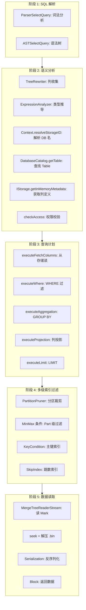

## 二、SQL 解析阶段

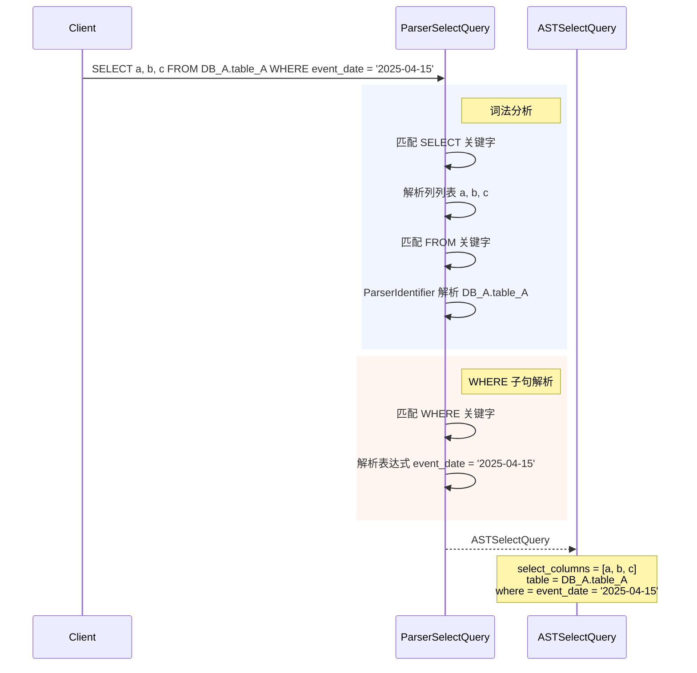

**此阶段不查询任何元数据**, 纯粹的语法分析, 生成 AST。

## 三、语义分析与元数据解析阶段

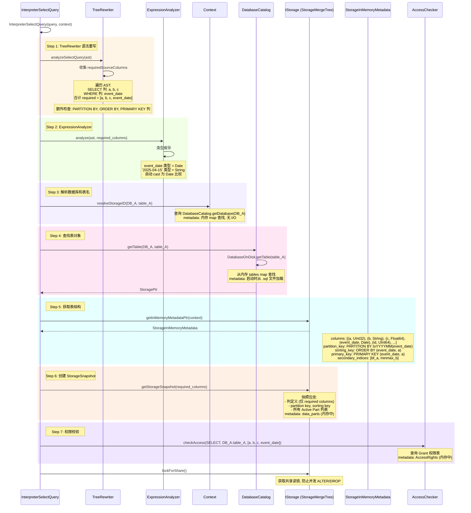

### 此阶段涉及的元数据查询汇总

| 步骤 | 查询内容 | 数据来源 | 是否磁盘 I/O |
|------|---------|---------|------------|
| 列收集 | requiredSourceColumns | AST 遍历 | 否 |
| 类型推导 | 列类型 | StorageInMemoryMetadata | 否 (内存中) |
| 解析 DB 名 | database 存在性 | DatabaseCatalog 内存 map | 否 |
| 查找表 | table 对象 | DatabaseOnDisk.tables map | 否 |
| 表结构 | 列名、类型、分区键、排序键、主键、跳数索引 | StorageInMemoryMetadata | 否 |
| StorageSnapshot | Active Part 列表 | data_parts (内存中) | 否 |
| 权限 | SELECT 权限 | AccessRights | 否 |

## 四、查询计划构建阶段

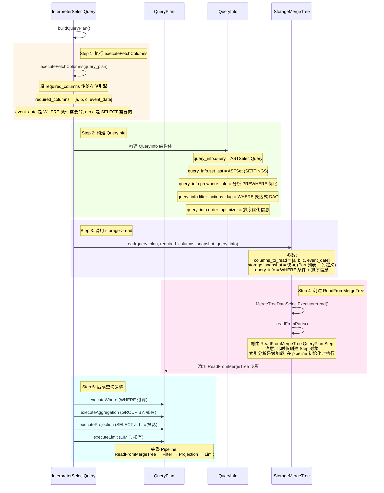

## 五、多级索引过滤阶段 (核心优化)

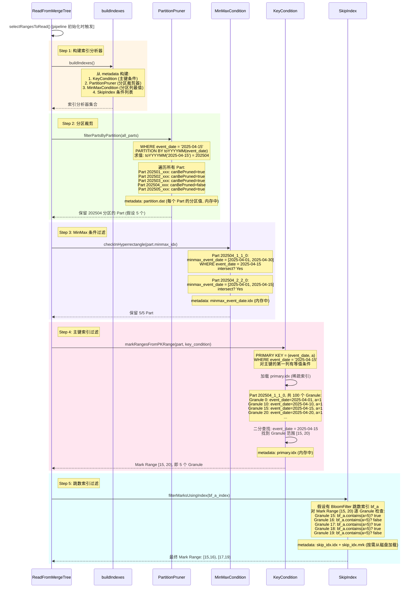

### 索引过滤效果汇总

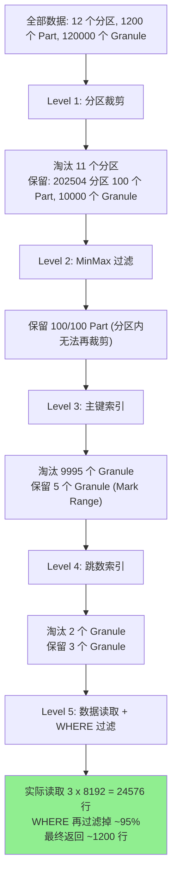

## 六、数据读取阶段 (从磁盘到内存)

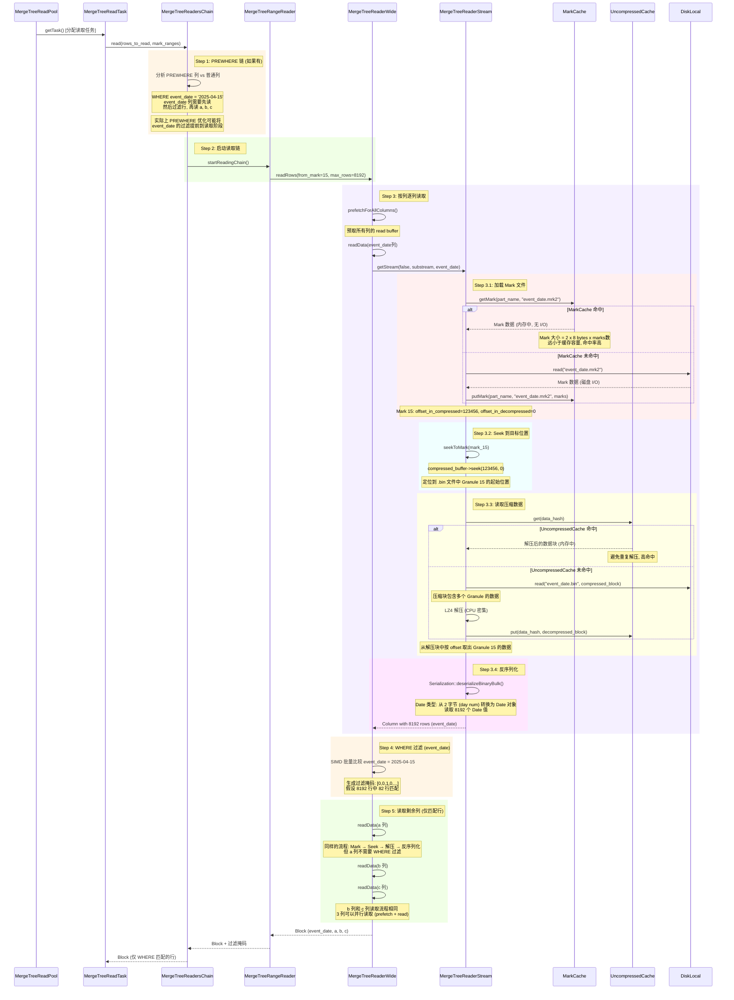

### 磁盘 I/O 细节: ReadBuffer 链

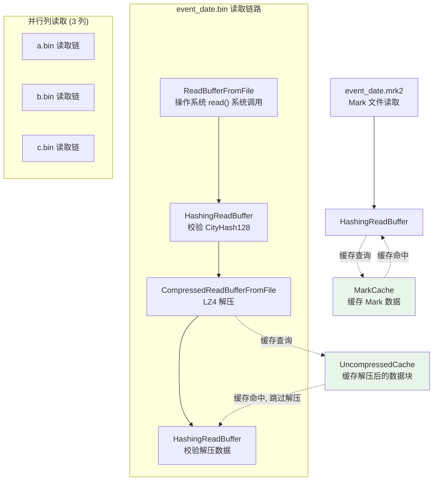

### 每个 .bin 文件的读取路径

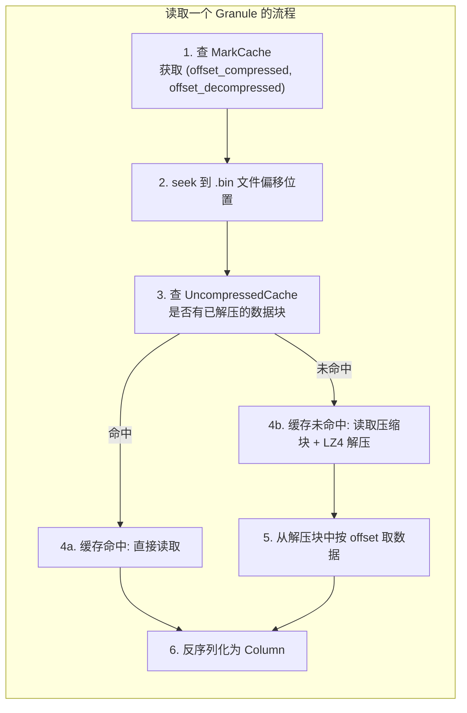

## 七、查询结果返回阶段

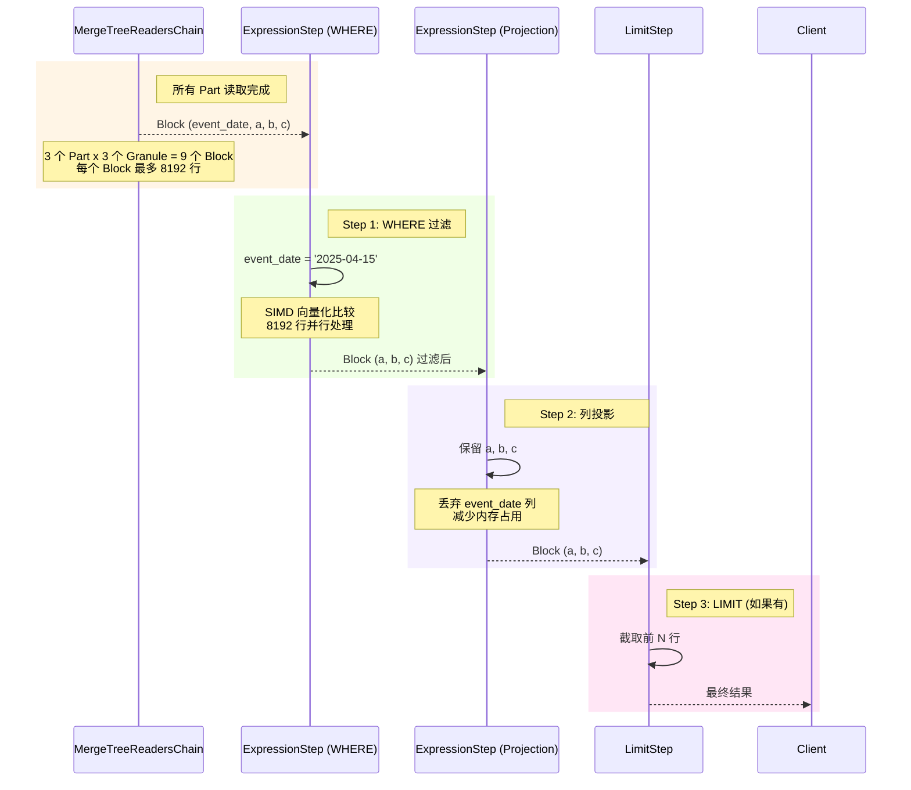

## 八、全程元数据访问热力图

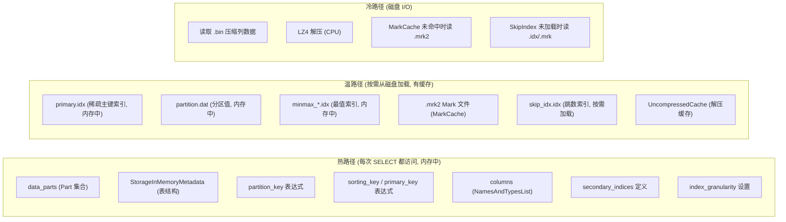

## 九、查询涉及的磁盘 I/O 完整清单

### 每个 Part 的读取文件

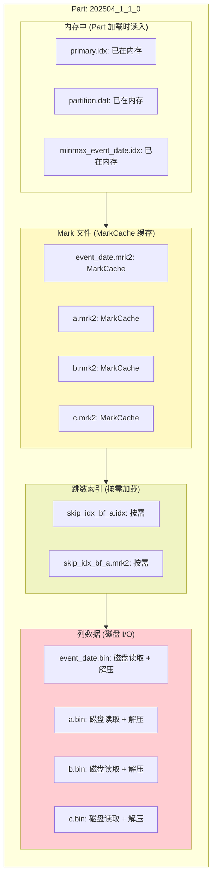

### 每个文件的读取方式

| 文件 | 读取方式 | 缓存策略 | 磁盘 I/O |
|------|---------|---------|---------|
| `primary.idx` | 整个文件 (Part 加载时) | 内存常驻 | 启动时加载一次 |
| `partition.dat` | 整个文件 (Part 加载时) | 内存常驻 | 启动时加载一次 |
| `minmax_*.idx` | 整个文件 (Part 加载时) | 内存常驻 | 启动时加载一次 |
| `event_date.mrk2` | 按需 seek | MarkCache | 未命中时 read |
| `a.mrk2` | 按需 seek | MarkCache | 未命中时 read |
| `b.mrk2` | 按需 seek | MarkCache | 未命中时 read |
| `c.mrk2` | 按需 seek | MarkCache | 未命中时 read |
| `event_date.bin` | seek + read + decompress | UncompressedCache | read + LZ4 解压 |
| `a.bin` | seek + read + decompress | UncompressedCache | read + LZ4 解压 |
| `b.bin` | seek + read + decompress | UncompressedCache | read + LZ4 解压 |
| `c.bin` | seek + read + decompress | UncompressedCache | read + LZ4 解压 |
| `skip_idx_bf_a.idx` | 按需加载 | 无缓存 | read |
| `skip_idx_bf_a.mrk2` | 按需加载 | 无缓存 | read |
| `columns.txt` | 不读取 (metadata 中已有) | - | 无 |
| `count.txt` | 不读取 | - | 无 |
| `checksums.txt` | 不读取 (查询时无需校验) | - | 无 |

## 十、PREWHERE 列裁剪优化

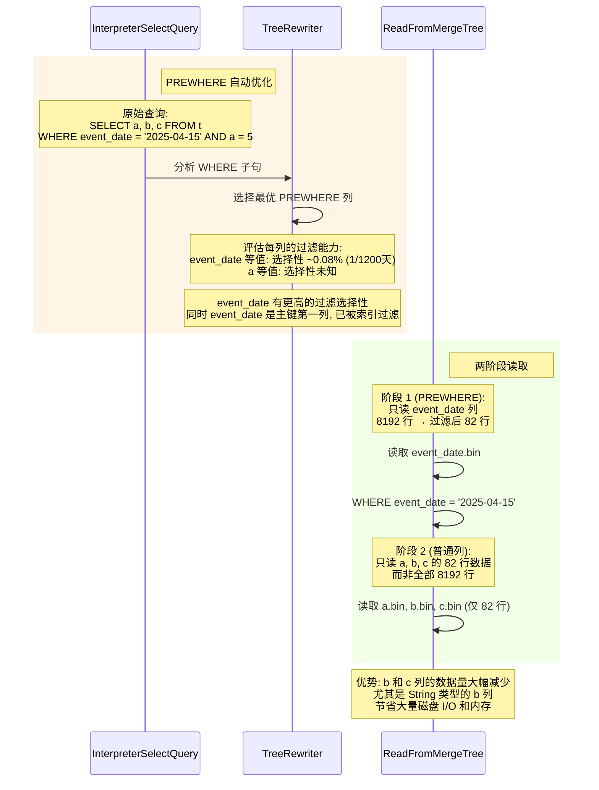

## 十一、多线程并行读取

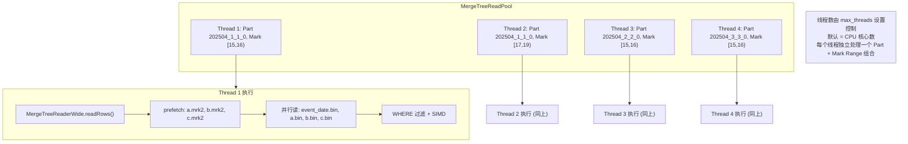

## 十二、性能优化要点

```
1. 多级索引过滤
   分区裁剪 → Part 级 MinMax → 主键稀疏索引 → 跳数索引
   逐层淘汰无关数据, 最终只读极少量 Granule
   本例: 120000 Granule → 3 Granule, 过滤率 99.997%

2. 列裁剪
   只读 SELECT + WHERE 涉及的列, 不读其他列
   本例: 表可能有 20 列, 但只读 4 列 (a,b,c,event_date)
   I/O 量减少 ~80%

3. PREWHERE 优化
   先读过滤列 (event_date), 过滤后再读数据列 (a,b,c)
   避免读取注定被过滤掉的数据

4. 缓存体系
   MarkCache: 缓存 .mrk2 文件, 避免重复 seek
   UncompressedCache: 缓存解压后的数据块, 避免重复解压
   两者共同减少磁盘 I/O 和 CPU 解压开销

5. 多线程并行
   不同 Part / Mark Range 分配到不同线程
   列级别并行预取 (prefetch)
   充分利用多核 CPU 和磁盘 I/O 带宽

6. 稀疏索引 + 范围扫描
   主键索引极小 (每 8192 行仅 1 条记录)
   二分查找定位 Mark Range, 然后顺序扫描
   索引完全在内存中, 无磁盘 I/O
```

## 十三、关键源码文件索引

| 文件 | 职责 |
|------|------|
| `Interpreters/InterpreterSelectQuery.cpp` | SELECT 解释器主入口, buildQueryPlan, executeFetchColumns |
| `Interpreters/TreeRewriter.cpp` | AST 语法重写, requiredSourceColumns 收集 |
| `Core/QueryProcessingStage.h` | 查询处理阶段枚举 |
| `Processors/QueryPlan/ReadFromMergeTree.cpp` | 核心索引分析, selectRangesToRead |
| `Storages/MergeTree/MergeTreeDataSelectExecutor.cpp` | Part/Mark 选择, filterPartsByPartition, markRangesFromPKRange |
| `Storages/MergeTree/KeyCondition.cpp` | 主键条件 RPN 构建, checkInRange |
| `Storages/MergeTree/PartitionPruner.cpp` | 分区裁剪器 |
| `Storages/MergeTree/MergeTreeIndices.h` | 跳数索引基类 |
| `Storages/MergeTree/MergeTreeIndexBloomFilter.h` | BloomFilter 跳数索引 |
| `Storages/MergeTree/MergeTreeReadPool.cpp` | 多线程任务分发 |
| `Storages/MergeTree/MergeTreeReadTask.cpp` | 单线程读取任务 |
| `Storages/MergeTree/MergeTreeReadersChain.cpp` | PREWHERE 读取链 |
| `Storages/MergeTree/MergeTreeReaderWide.cpp` | Wide 格式列读取, readRows |
| `Storages/MergeTree/MergeTreeReaderStream.cpp` | Mark 文件 + 压缩数据读取 |
| `Storages/MergeTree/MergeTreeRangeReader.h` | Granule 范围读取器 |
