# ClickHouse 元数据与副本一致性分析

> 基于 ClickHouse 源码 (ClickHouse-master) 分析，聚焦 ReplicatedMergeTree + ZooKeeper 的一致性机制

## 一、一致性架构总览

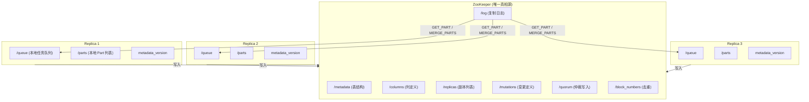

核心设计: **ZooKeeper 是所有副本的唯一真相源 (Single Source of Truth)**, `/log` 是共享的复制状态机, 每个副本的 `/queue` 是本地已处理的检查点。

## 二、ZooKeeper Znode 完整结构

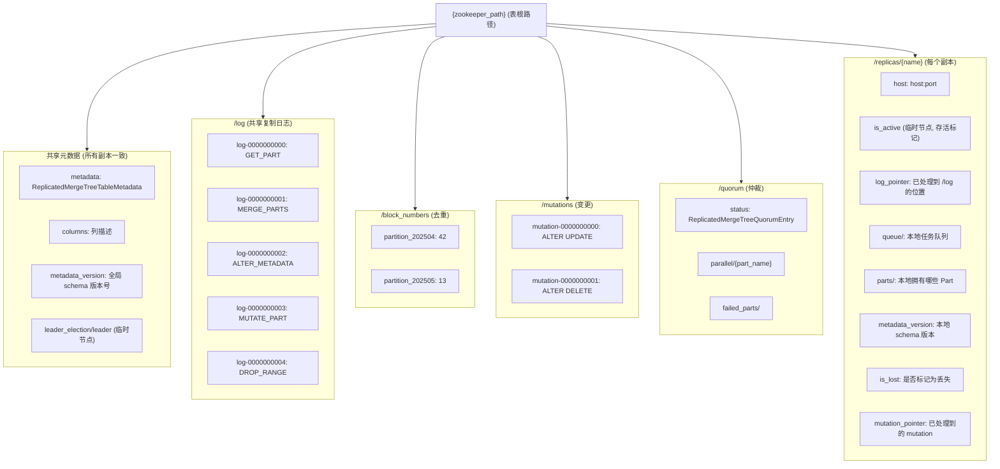

### 复制日志条目类型

| 类型 | 含义 | 说明 |
|------|------|------|
| `GET_PART` | 从其他副本拉取 Part | 最常见的条目 |
| `ATTACH_PART` | 挂载本地 Part | 可能来自 /detached |
| `MERGE_PARTS` | 合并多个 Part | 只记录合并结果, 各副本自行执行 |
| `DROP_RANGE` | 删除一个范围的 Part | 副本执行本地删除 |
| `REPLACE_RANGE` | 替换一个范围 | DROP + 插入 |
| `MUTATE_PART` | 对 Part 应用 Mutation | ALTER UPDATE/DELETE |
| `ALTER_METADATA` | Schema 变更 | 所有副本更新表结构 |

## 三、INSERT 数据复制流程

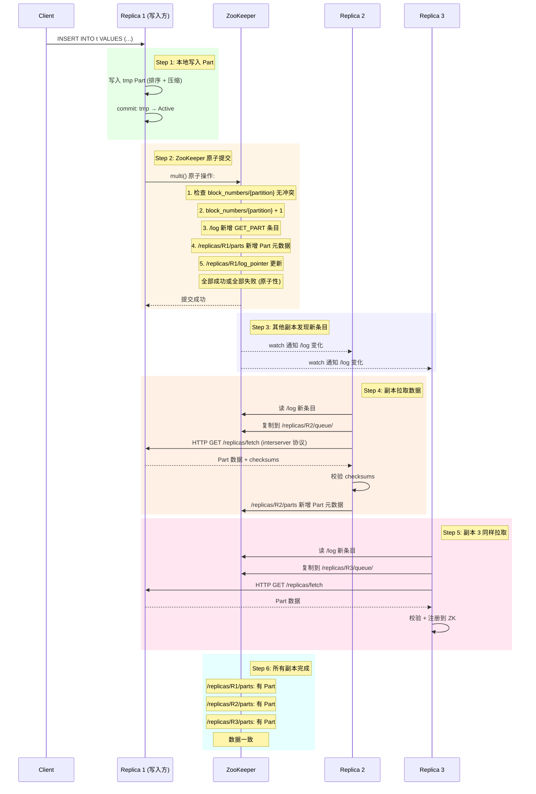

**关键保证**: `multi()` 原子操作确保 block_numbers 分配 + log 写入 + parts 注册要么全部成功要么全部失败, 不会出现分配了 block number 但 log 未写入的不一致状态。

## 四、Quorum INSERT 流程

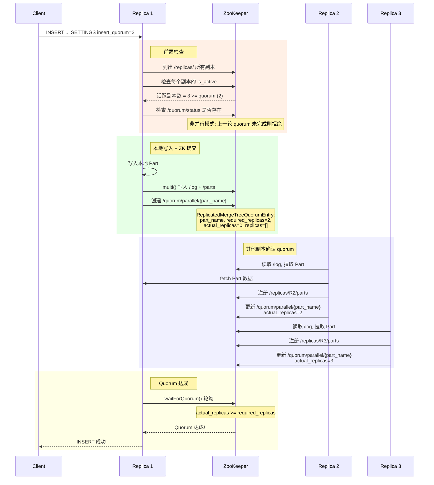

### Quorum 超时处理

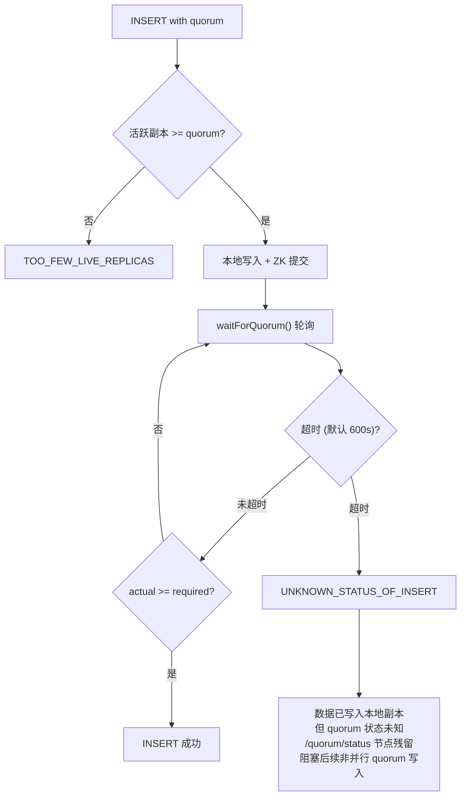

## 五、select_sequential_consistency 流程

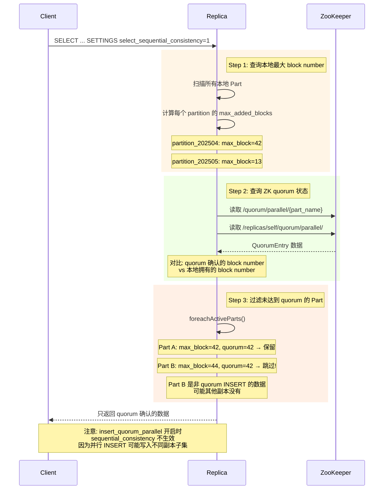

## 六、DDL ON CLUSTER 复制流程

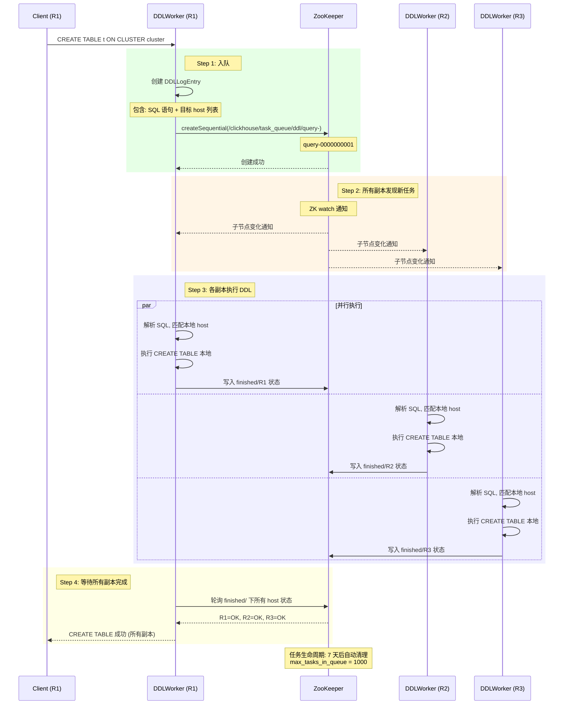

## 七、ALTER TABLE Schema 变更复制

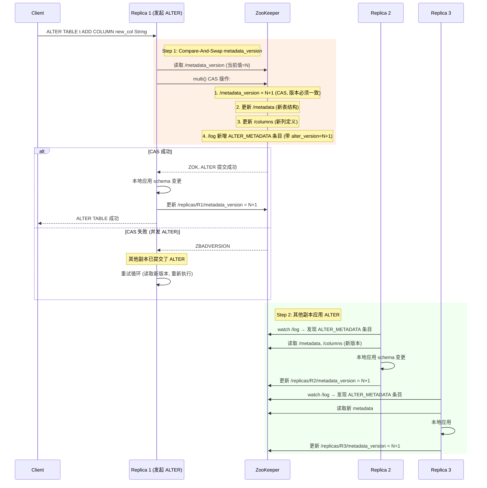

### 并发 ALTER 冲突解决

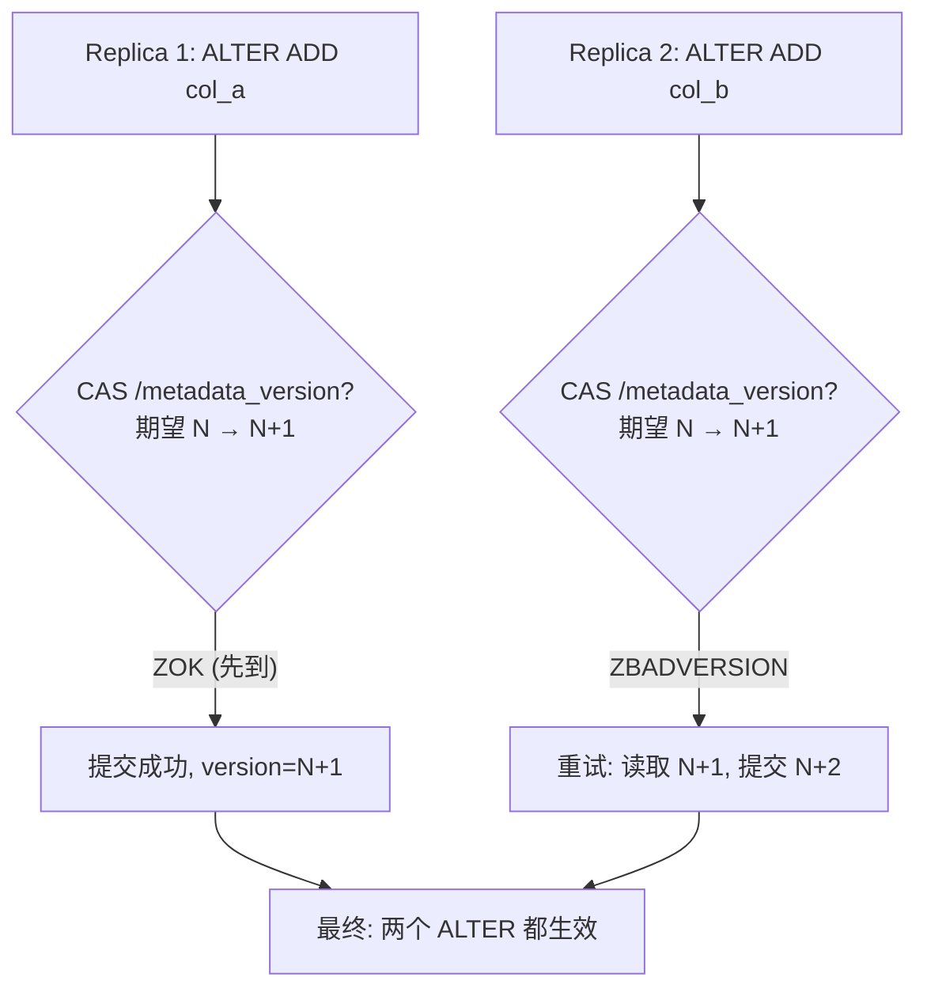

## 八、后台合并协调

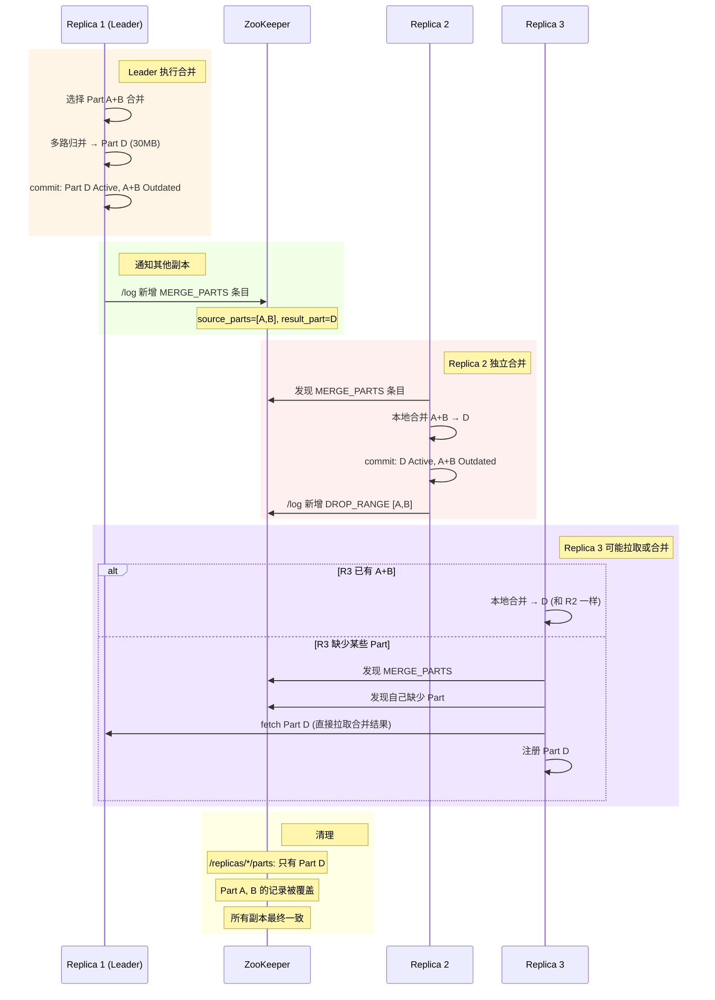

**关键设计**: 合并是**各副本独立执行**的, 不是由 Leader 推送合并后的数据。每个副本根据 `/log` 中的 `MERGE_PARTS` 条目自行执行合并。这避免了大数据量的网络传输。

## 九、副本恢复流程

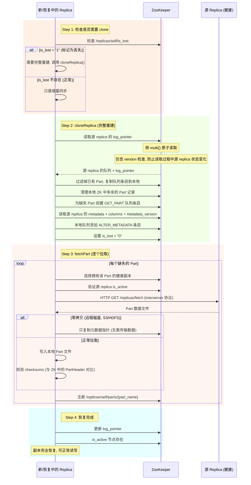

### ReplicatedMergeTreeAttachThread 后台恢复

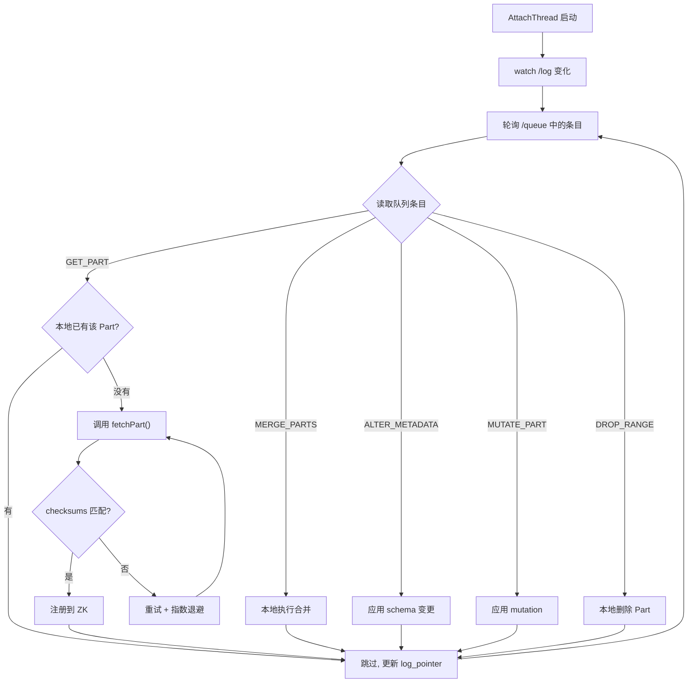

## 十、ZooKeeper Session 过期处理

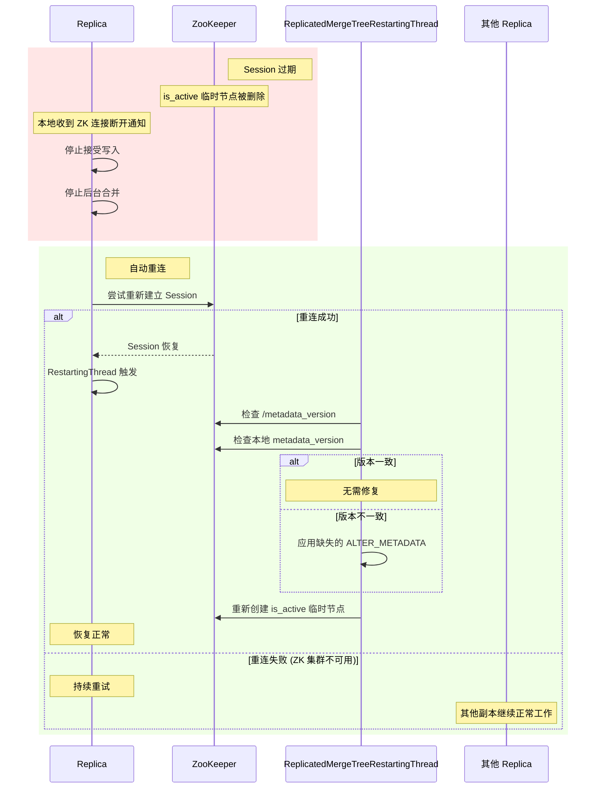

## 十一、多级一致性保证总结

```mermaid
mindmap
    root((ClickHouse 一致性保证))
        数据一致性
            INSERT: multi() 原子提交
            Quorum INSERT: 多副本确认
            select_sequential_consistency: 读取仲裁确认数据
            去重: block_numbers 防重复
            checksums: Part 级数据完整性
        元数据一致性
            CREATE ON CLUSTER: DDL 队列 + 状态跟踪
            ALTER: CAS metadata_version
            ALTER_METADATA log 条目
            .sql 文件: 启动时加载 + crash 恢复
        副本一致性
            /log: 全局复制日志 (共享状态机)
            /queue: 本地检查点 (每副本独立)
            cloneReplica: 完整重建
            fetchPart: 增量同步 + 校验
            AttachThread: 后台持续追赶
        故障恢复
            Session 过期: 自动重连 + 元数据修复
            副本丢失: is_lost 标记 + clone
            Part 损坏: 从其他副本重新拉取
            ZK 短暂不可用: 本地缓冲 + 重试
        设计权衡
            最终一致: 不是强一致
            异步复制: 其他副本异步拉取
            独立合并: 不推送合并数据, 各副本自行计算
            R=W=All: Quorum INSERT 实现读写都确认
```

## 十二、关键源码文件索引

| 文件 | 职责 |
|------|------|
| `Storages/StorageReplicatedMergeTree.h/cpp` | 副本引擎核心实现, clone/fetch/ALTER/quorum |
| `Storages/MergeTree/ReplicatedMergeTreeLogEntry.h` | 复制日志条目类型定义 |
| `Storages/MergeTree/ReplicatedMergeTreeSink.cpp` | INSERT + quorum 实现 |
| `Storages/MergeTree/ReplicatedMergeTreeQuorumEntry.h` | Quorum 状态数据结构 |
| `Storages/MergeTree/ReplicatedMergeTreeAttachThread.cpp` | 后台 Part 拉取线程 |
| `Storages/MergeTree/ReplicatedMergeTreeRestartingThread.cpp` | Session 恢复 + 元数据修复 |
| `Interpreters/DDLWorker.h/cpp` | DDL ON CLUSTER 队列处理 |
| `Interpreters/executeDDLQueryOnCluster.cpp` | DDL 分布式执行入口 |
| `Databases/DatabaseOnDisk.cpp` | .sql 元数据文件存储与加载 |
| `Common/ZooKeeper/ZooKeeper.h/cpp` | ZooKeeper 客户端封装 |
