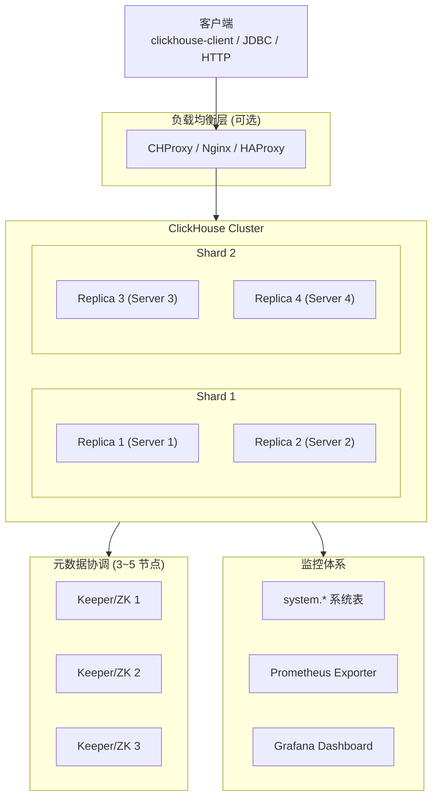
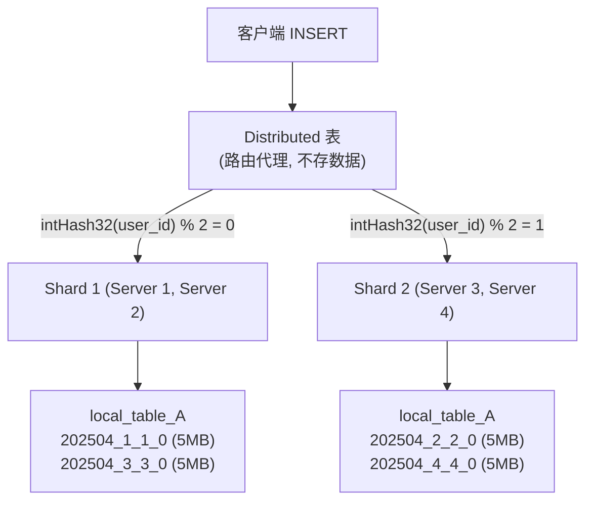
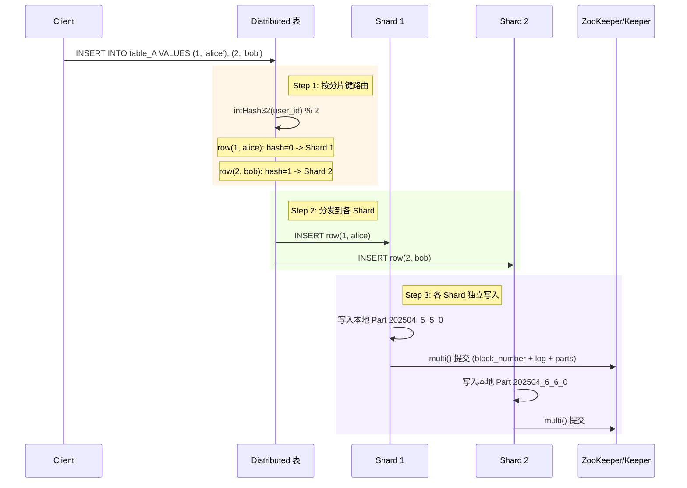
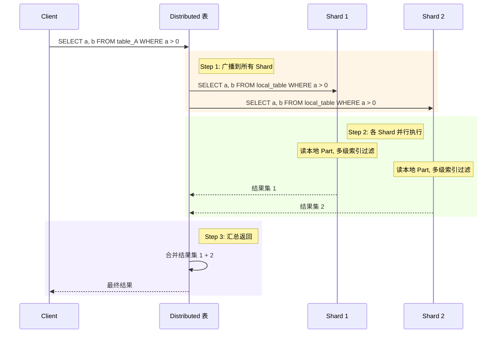
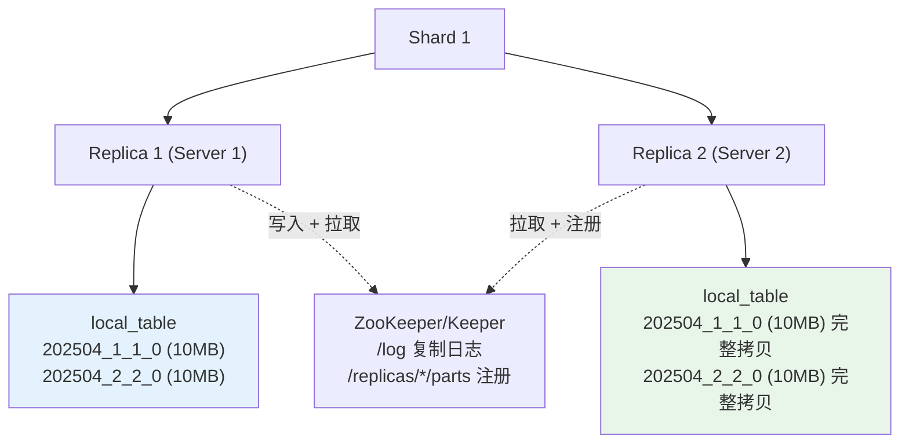
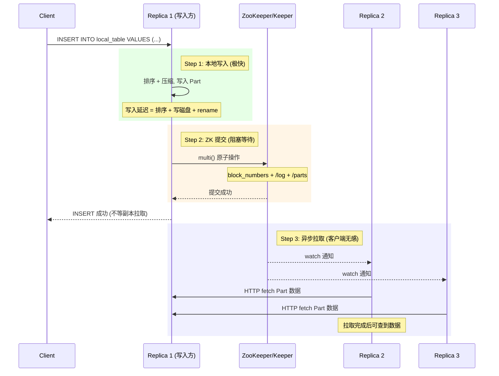
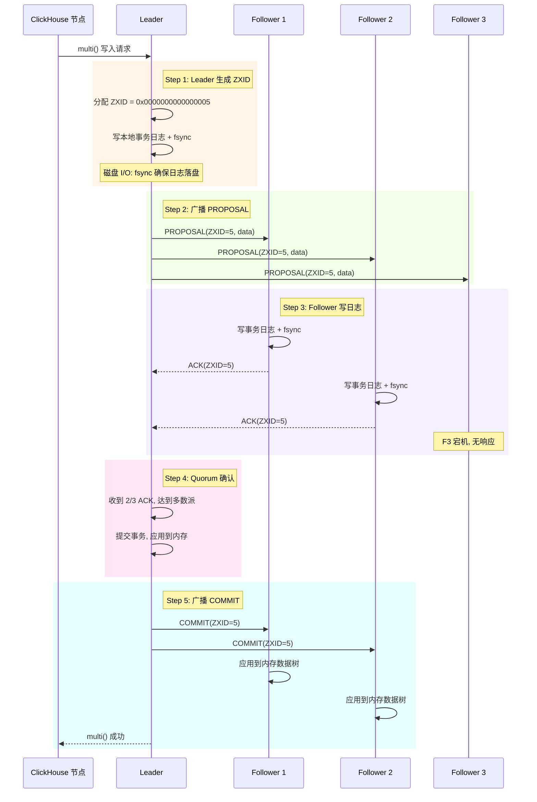
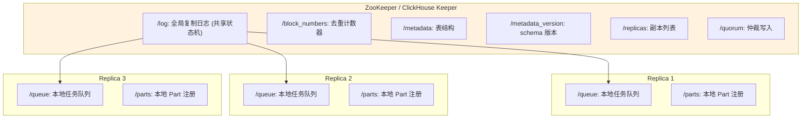
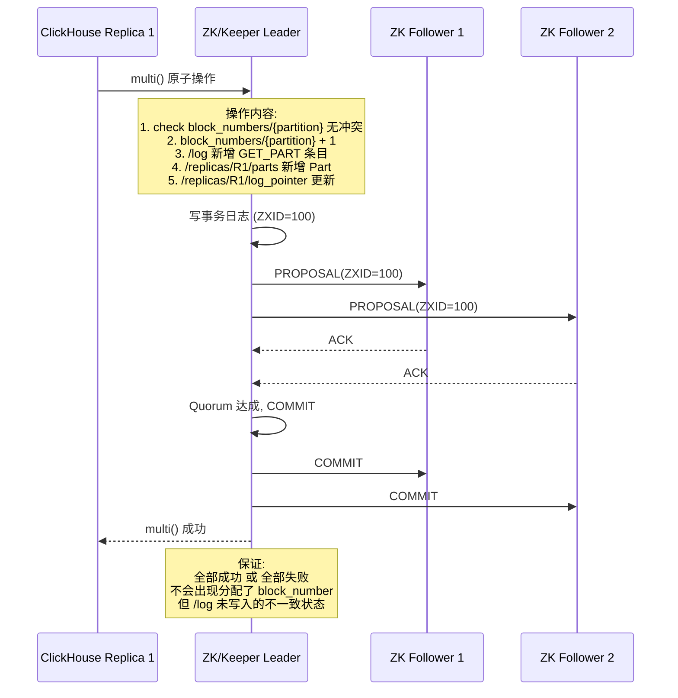

# ClickHouse 分布式部署分析

> 总结 4 个关键问题: 分布式模块、分片机制、副本配置、ZK/Keeper 一致性协议

## 一、ClickHouse 分布式部署模块总览

### 完整架构图



### 各模块职责

| 模块 | 职责 | 是否必须 |
|------|------|---------|
| **ClickHouse Server** | 数据存储 + 查询计算 | 必须 |
| **ClickHouse Keeper / ZooKeeper** | 副本协调, 复制日志, DDL 同步, block 去重 | 使用 ReplicatedMergeTree 时必须 |
| **Distributed 表引擎** | 跨分片查询路由, 结果汇总 | 分布式查询时必须 |
| **CHProxy / Nginx** | 负载均衡, 限流, 路由 | 可选, 推荐生产使用 |
| **clickhouse-backup** | 备份恢复 (S3/磁盘) | 可选 |
| **clickhouse-copier** | 跨集群数据迁移 | 可选 |
| **Prometheus + Grafana** | 监控告警 | 推荐 |

### 集群配置示例

```xml
<clickhouse>
    <remote_servers>
        <my_cluster>
            <shard>
                <replica><host>node1</host><port>9000</port></replica>
                <replica><host>node2</host><port>9000</port></replica>
            </shard>
            <shard>
                <replica><host>node3</host><port>9000</port></replica>
                <replica><host>node4</host><port>9000</port></replica>
            </shard>
        </my_cluster>
    </remote_servers>
</clickhouse>
```

- **Shard**: 水平分片, 每个 Shard 存储不同数据子集
- **Replica**: 同一 Shard 内的副本, 保证高可用

### 典型部署拓扑

| 场景 | 节点数 | 配置 |
|------|--------|------|
| 开发测试 | 1 | 单节点, 无副本 |
| 最小高可用 | 7 | 2 分片 x 2 副本 + 3 Keeper |
| 中等规模 | 10 | 3 分片 x 2 副本 + 1 负载均衡 |
| 大规模生产 | 15+ | 3 分片 x 3 副本 + 3 Keeper + 负载均衡 |

## 二、Part 分片机制: 数据如何分布到不同节点

### 核心结论

**Part 不会跨节点存储。每个 Part 完整存在于一个 Shard 内, 不同 Shard 的 Part 是不同的数据子集。**

### 未分片: 所有 Part 在同一节点

```
Server 1
└── table_A (local_table)
    ├── 202504_1_1_0   (10MB)
    ├── 202504_2_2_0   (10MB)
    ├── 202504_3_3_0   (10MB)
    └── 202504_4_6_1   (30MB, 合并后)
```

### 有分片: 数据按分片键打散



### 分片写入流程



### 分片查询流程



### 常见分片键选择

| 分片键 | 分布方式 | 适用场景 |
|--------|---------|---------|
| `intHash32(user_id)` | 哈希均匀分布 | 用户行为表, 按用户查询 |
| `toYYYYMM(event_date)` | 时间范围 | 日志表, 按时间查询 |
| `rand()` | 随机分布 | 无特定查询模式 |
| `''` (空) | 全部到一个 Shard | 相当于不分片 |

## 三、副本机制: Part 的副本数如何决定

### 核心结论

**ClickHouse 没有默认副本数。副本数 = 集群配置中每个 Shard 下的 replica 标签数量。**

### 副本配置方式

```xml
<shard>
    <replica><host>node1</host><port>9000</port></replica>  <!-- 副本 1 -->
    <replica><host>node2</host><port>9000</port></replica>  <!-- 副本 2 -->
    <replica><host>node5</host><port>9000</port></replica>  <!-- 副本 3 -->
</shard>
```

### 建表语句

```sql
-- 本地表 (每个 Shard 的每个副本上都创建)
CREATE TABLE local_table ON CLUSTER my_cluster (
    a UInt32, b String, event_date Date
) ENGINE = ReplicatedMergeTree(
    '/clickhouse/tables/{cluster}/local_table',  -- ZK 路径, 同 Shard 副本共享
    '{replica}'                                    -- 副本标识, 自动替换
)
PARTITION BY toYYYYMM(event_date)
ORDER BY a

-- 分布式表 (所有节点上都创建)
CREATE TABLE distributed_table ON CLUSTER my_cluster (
    a UInt32, b String, event_date Date
) ENGINE = Distributed(my_cluster, db, local_table, intHash32(a))
```

### 副本与 Part 的关系



### 副本对写入的影响



### 副本数选择建议

| 副本数 | 可容忍故障 | 存储开销 | 适用场景 |
|--------|-----------|---------|---------|
| 1 | 0 | 1x | 开发测试, 可重建数据 |
| 2 | 1 | 2x | 中小规模生产 (最常见) |
| 3 | 2 | 3x | 金融级, 大规模生产 |
| 3+ | 2 | 3x+ | 超过 3 副本意义不大 |

### 不需要副本的场景

```sql
-- MergeTree (非 Replicated), 无副本, 不依赖 ZK/Keeper
CREATE TABLE temp_table (
    a UInt32, b String
) ENGINE = MergeTree()
ORDER BY a
```

适用场景: 临时表, ETL 中间表, 可重建的数据。

## 四、ZooKeeper / ClickHouse Keeper 一致性协议

### 核心结论

**两者都使用 ZAB 协议 (ZooKeeper Atomic Broadcast), 基于事务日志 (Transaction Log) + 多数派确认 (Quorum) 保证一致性。**

### ZAB 协议写入流程



### ZXID 严格有序

```
ZXID = 64 位整数
  高 32 位: epoch (每次重新选举 Leader 递增)
  低 32 位: counter (每次写操作递增)

时间线:
  ZXID 0x0000000000000001  → 第一个事务
  ZXID 0x0000000000000002  → 第二个事务
  ZXID 0x0000000000000003  → 第三个事务
  ... Leader 重新选举 ...
  ZXID 0x0000000100000004  → 新 Leader 的第一个事务
  ZXID 0x0000000100000005  → 新 Leader 的第二个事务
```

所有 Follower 按 ZXID 顺序回放日志, 保证全局线性一致性。

### Quorum 多数派

| 节点数 | Quorum | 可容忍故障 | 写性能 |
|--------|--------|-----------|--------|
| 3 | 2 | 1 | 高 (推荐) |
| 5 | 3 | 2 | 中 |
| 7 | 4 | 3 | 低 |

生产环境推荐 3 或 5 个节点。超过 5 个写性能下降严重, 容错提升有限。

### ZK/Keeper 在 ClickHouse 中的角色



### ZAB 协议如何保证 ClickHouse 数据一致性



### ZooKeeper vs ClickHouse Keeper 对比

| 维度 | ZooKeeper | ClickHouse Keeper |
|------|-----------|-------------------|
| 协议 | ZAB | ZAB (兼容) |
| 实现 | Java | C++ |
| 事务日志 | 磁盘文件 log.XX | 磁盘文件 log.XX |
| 快照 | 定期 snap.XX | 定期 snap.XX |
| fsync | 每次事务 | 每次事务 |
| 写性能 | ~10k TPS | ~50k~100k TPS |
| GC 停顿 | Java GC, 调优复杂 | 无 GC |
| 运维 | 独立部署, Java 环境 | 内嵌或独立, 无额外依赖 |
| 推荐 | 老集群 / 已有基础设施 | 新集群首选 (21.8+) |

### 为什么 ClickHouse 需要 ZK/Keeper

| 场景 | ZK/Keeper 的作用 |
|------|-----------------|
| INSERT 复制 | multi() 原子提交, 分配 block_number, 写 /log |
| Part 去重 | block_numbers 防止重复 INSERT |
| 副本同步 | /log 复制日志, 各副本异步拉取 |
| ALTER 同步 | CAS metadata_version, /log 写 ALTER_METADATA |
| DDL ON CLUSTER | /clickhouse/task_queue/ddl 队列 |
| Leader 选举 | /leader_election/leader 临时节点 |
| Quorum INSERT | /quorum/parallel 跟踪多副本确认 |
| 副本恢复 | cloneReplica, is_lost 标记 |
