# ClickHouse 存储模型分析

> 基于 ClickHouse 源码 (ClickHouse-master) 分析，聚焦 MergeTree 存储引擎家族

## 一、整体架构

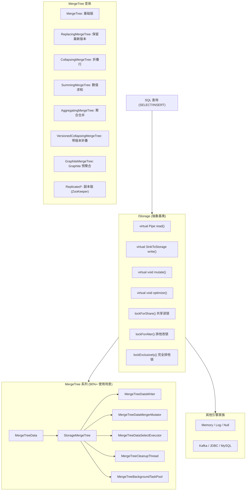

## 二、数据 Part 结构

### 磁盘目录结构

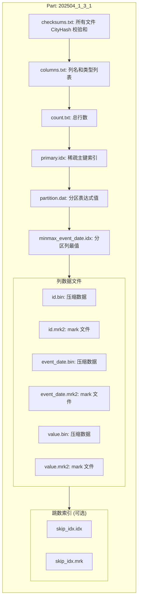

### Part 命名规则

`partition_min_block_max_block_level`
- 示例: `202504_1_3_1` → 分区=202504, 最小块=1, 最大块=3, 合并层级=1

### Part 状态机

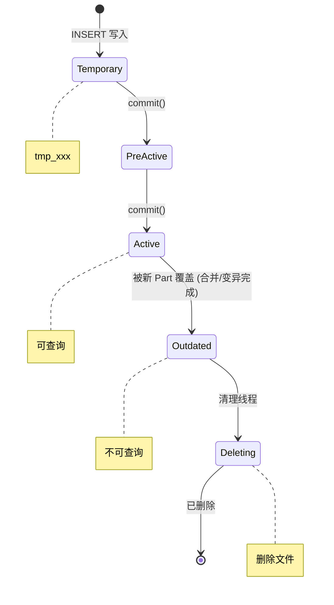

**两阶段提交**: 新 part 先进 PreActive，commit 时 PreActive → Active，被覆盖的 part → Outdated，保证查询始终看到完整一致的数据视图。

## 三、列式存储格式

### Wide 格式 (每列独立文件)

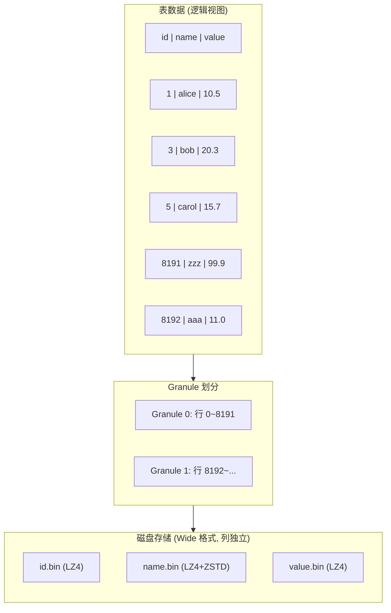

### Mark 文件与压缩块关系

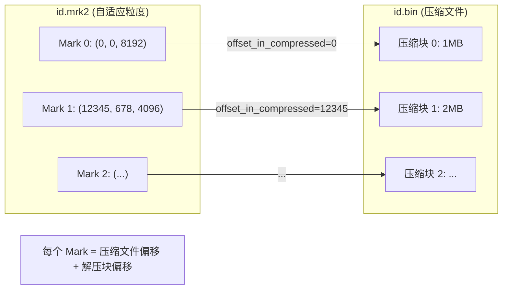

### 索引粒度对比

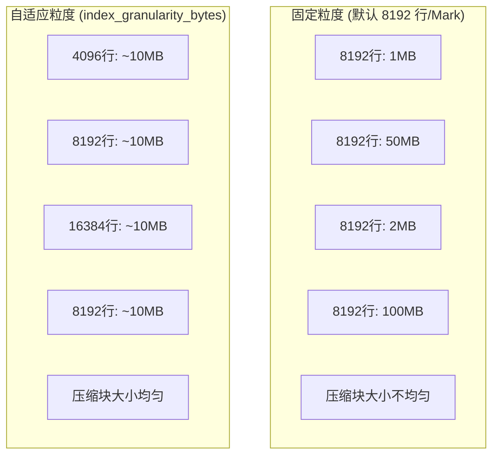

## 四、稀疏主键索引

### 索引查找流程

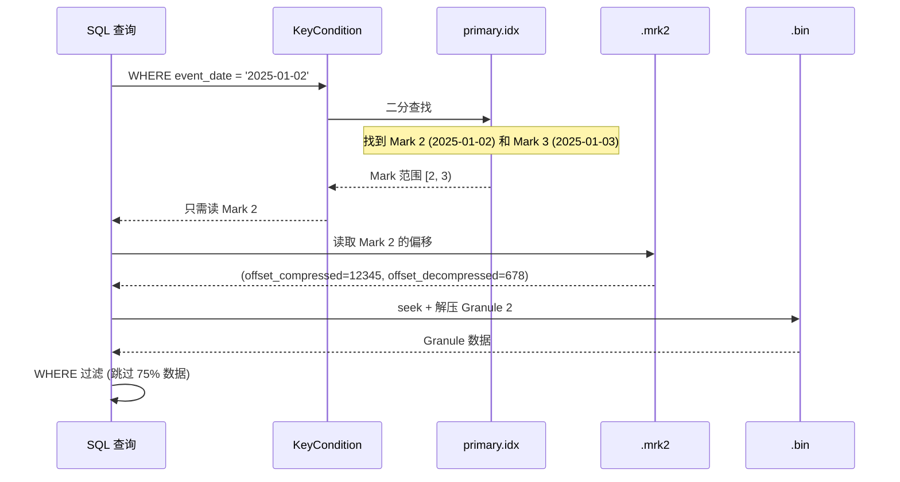

### 多级索引过滤 (层层裁剪)

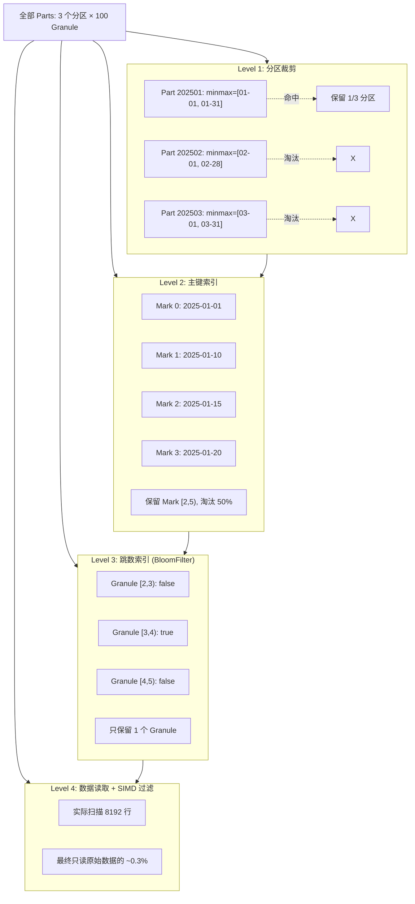

## 五、数据写入流程

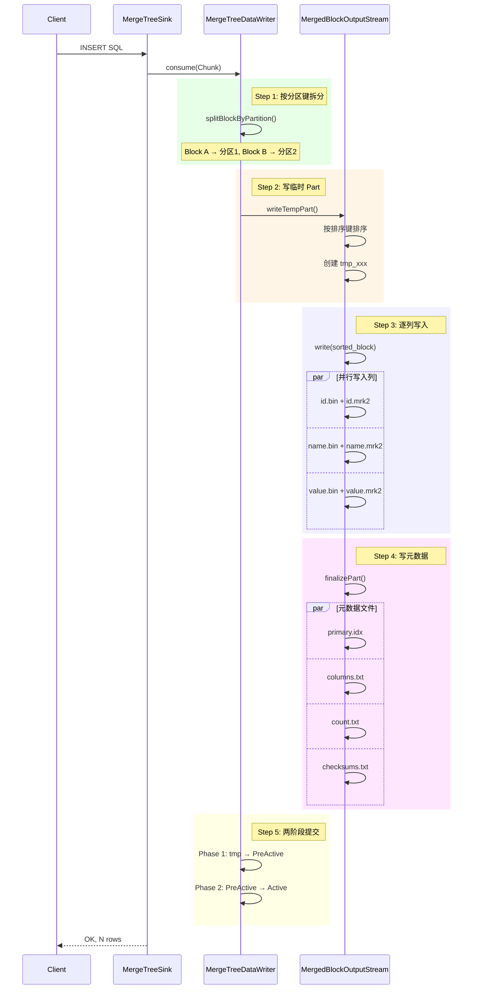

**关键特点**: 每个 INSERT 批次生成独立 Part; 数据先排序再写入; 两阶段提交保证原子性; 写完立即可查; 不需要 WAL。

## 六、数据读取流程

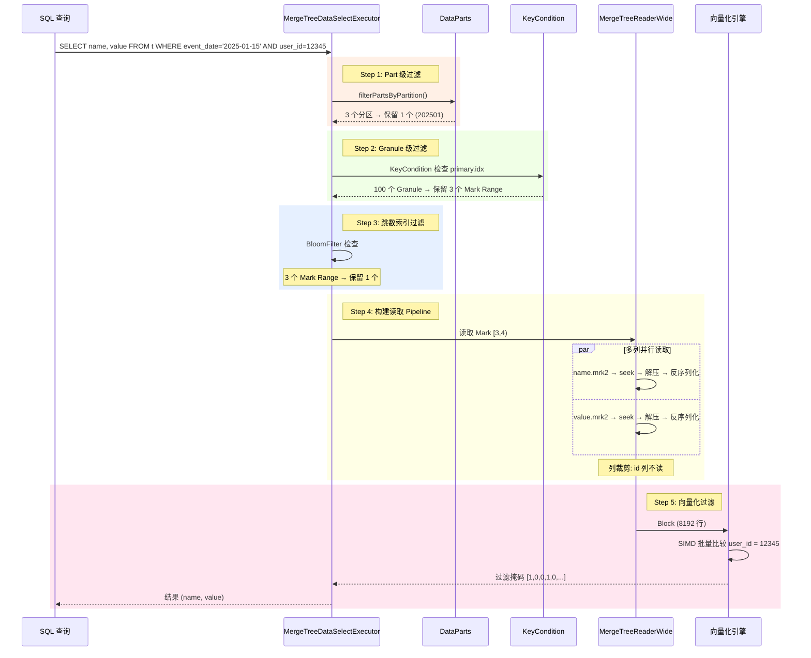

**性能优化要点**: 列裁剪 (只读需要的列); Mark 命中 (稀疏索引); 压缩缓存 (UncompressedCache); Mark 缓存 (MarkCache); 多 Part 并行; 向量化执行 (SIMD)。

## 七、后台合并流程

### 合并选择策略

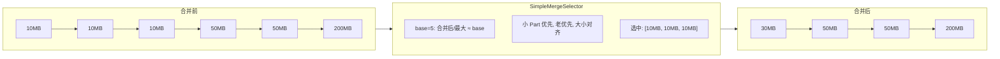

### 合并执行流程

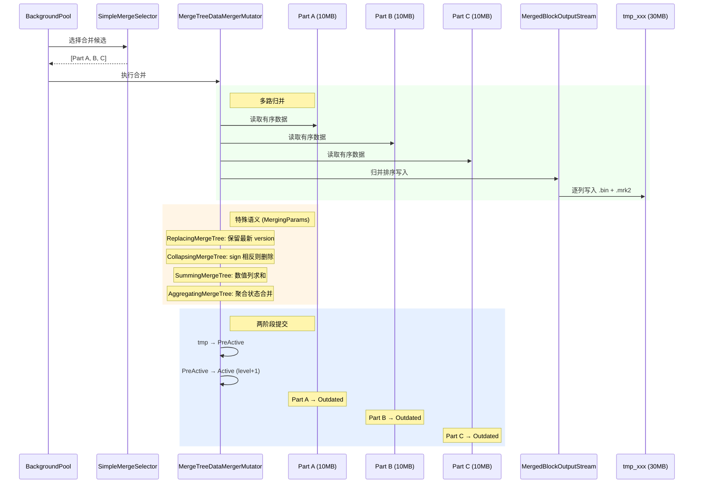

### 垂直合并 (内存不足时)

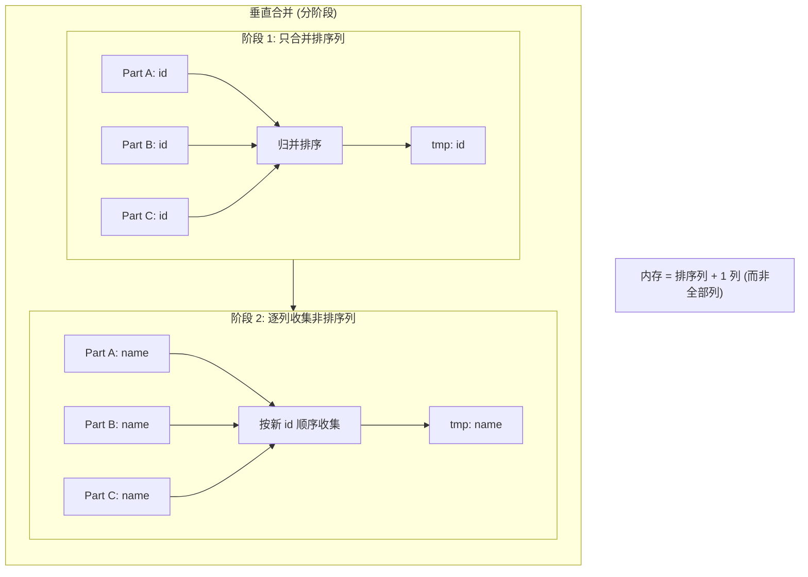

## 八、Part 演化全景

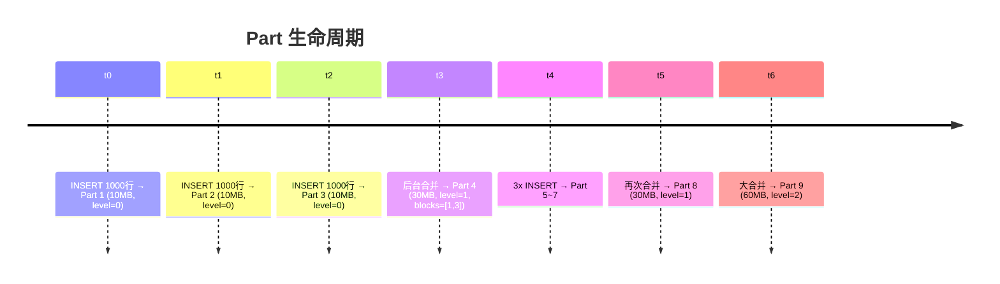

**写放大公式**: 总写入 = 原始数据 × (1 + 1/base + 1/base^2 + ...)
- base=5: 写放大 ≈ 1.25x
- base=2: 写放大 ≈ 2.0x
- base 越大 → 写放大小, Part 多, 查询慢; base 越小 → 写放大大, Part 少, 查询快

## 九、关键源码文件索引

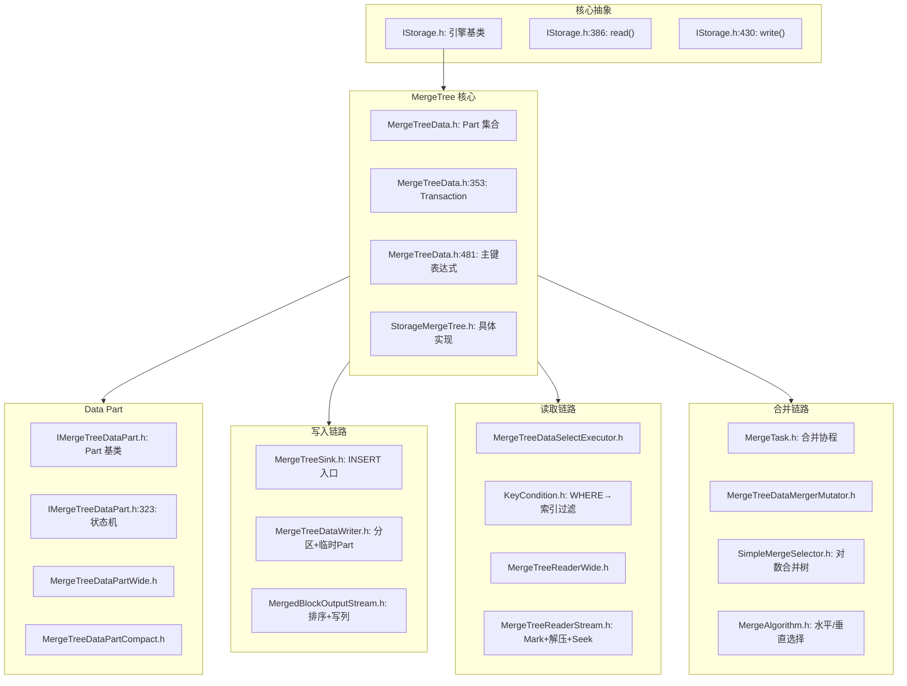

## 十、设计精髓总结

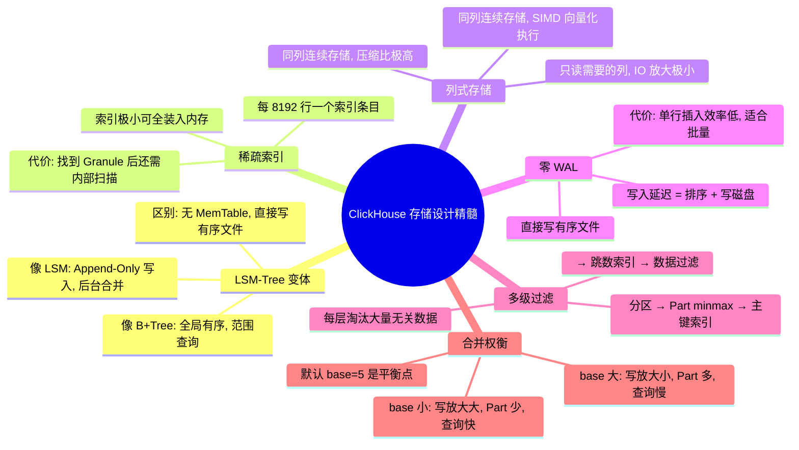
