# ClickHouse 崩溃一致性机制深度解析

> 基于 ClickHouse 源码分析, 聚焦数据落盘前后的崩溃一致性保证: 原子 rename、checksums 校验、ZK 状态机兜底、启动恢复流程

## 一、核心设计: 无 WAL 的原子提交

ClickHouse MergeTree **没有传统 WAL (Write-Ahead Log)**，崩溃时内存中未落盘的数据会丢失，但磁盘上的数据不会被损坏。它通过以下机制保证一致性:

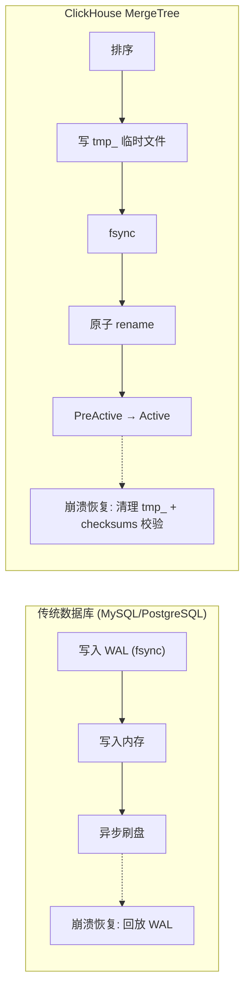

## 二、正常写入的原子提交流程

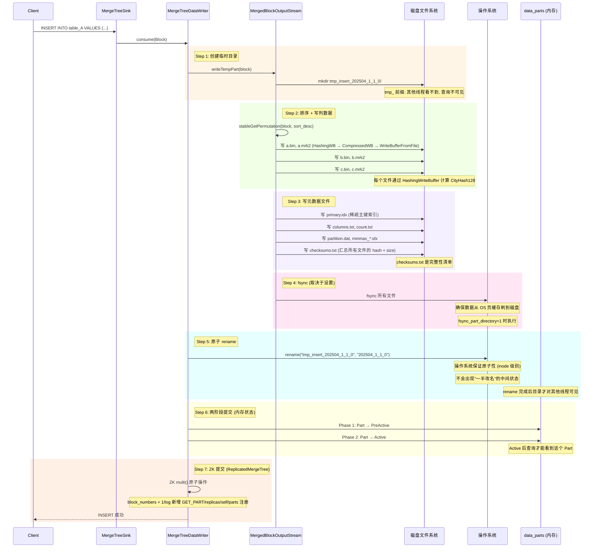

## 三、崩溃场景逐一分析

### 场景总览

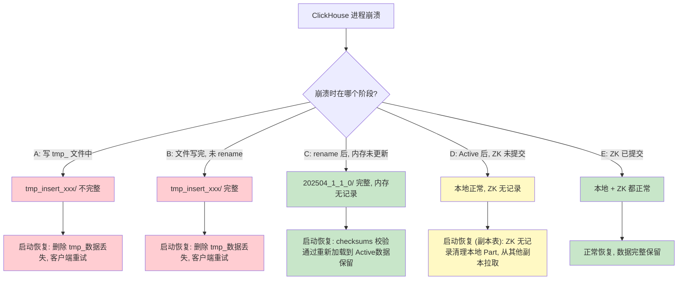

### 场景 A: 写 tmp_ 文件中崩溃

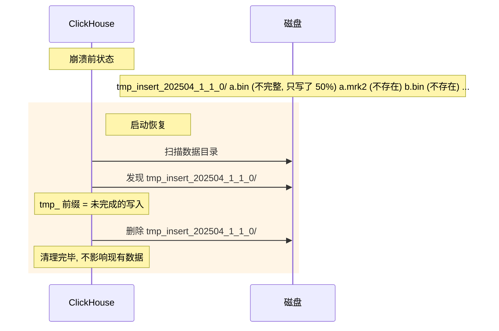

**结果**: 数据丢失, 客户端收到超时/连接错误, 可以重试 INSERT。

### 场景 B: 文件写完, 未 rename 崩溃

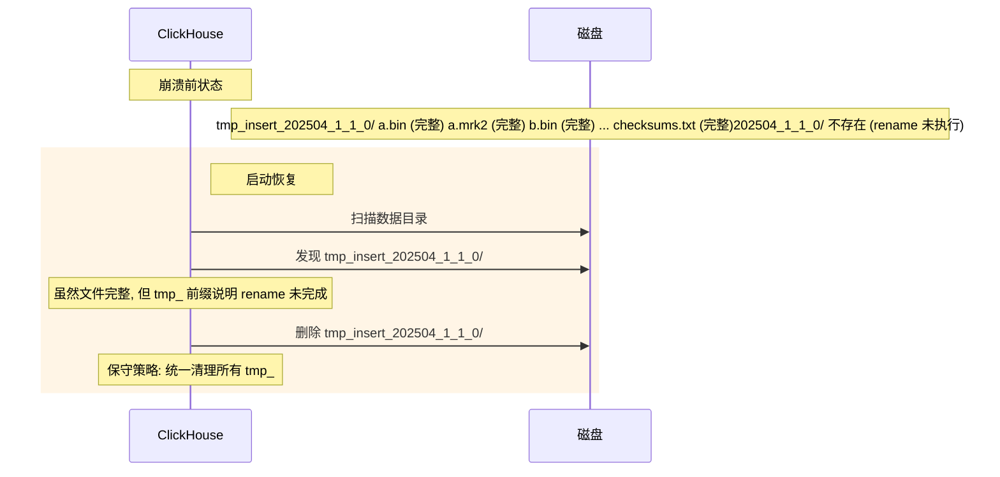

**结果**: 数据丢失, 但磁盘上没有残留的脏数据。

### 场景 C: rename 后, 内存未更新崩溃

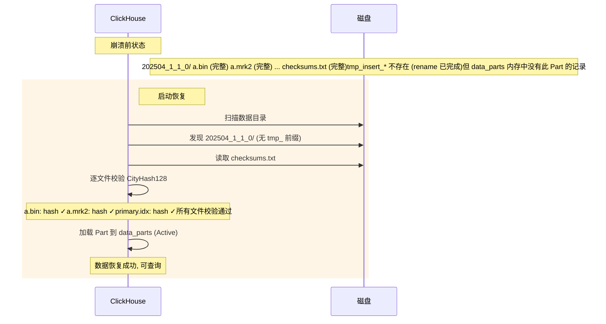

**结果**: 数据保留, 启动后重新加载到内存。

### 场景 D: Active 后, ZK 未提交崩溃 (副本表)

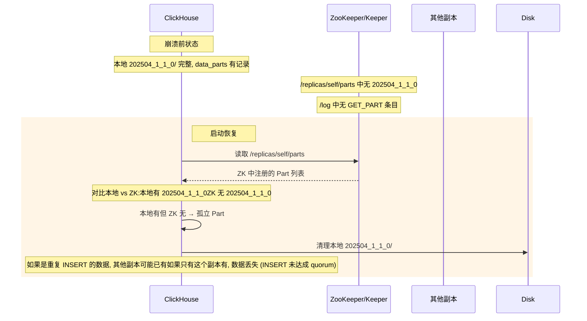

**结果**: ZK 是真相源, 本地与 ZK 不一致的 Part 被清理。

### 场景 E: ZK 已提交, 本地完整 (最安全)

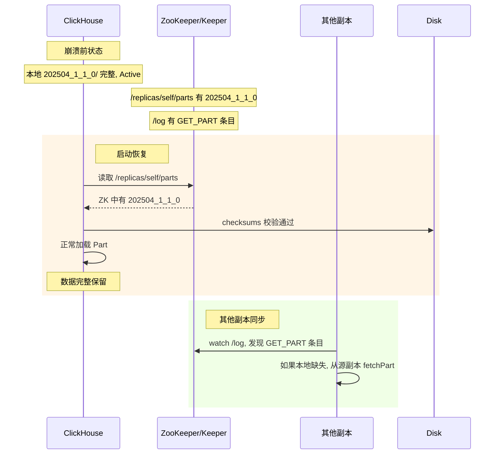

**结果**: 数据完整保留, 其他副本从 ZK 发现并拉取。

## 四、启动恢复完整流程

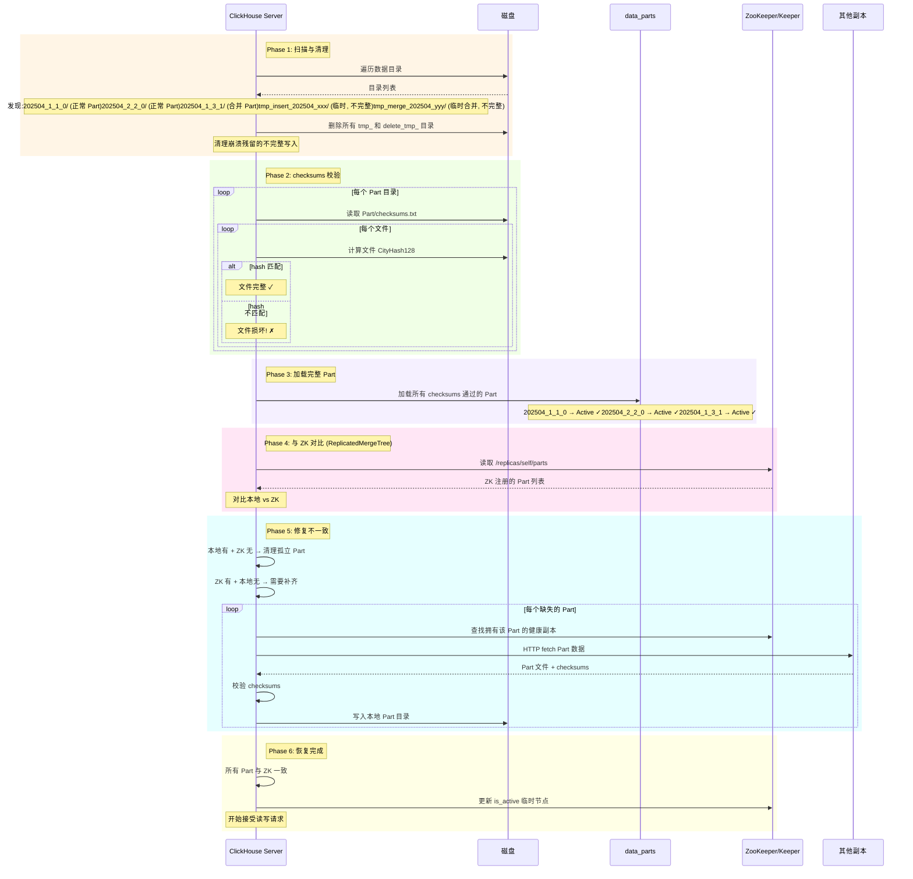

## 五、checksums.txt 校验机制

### 写入时的校验和计算

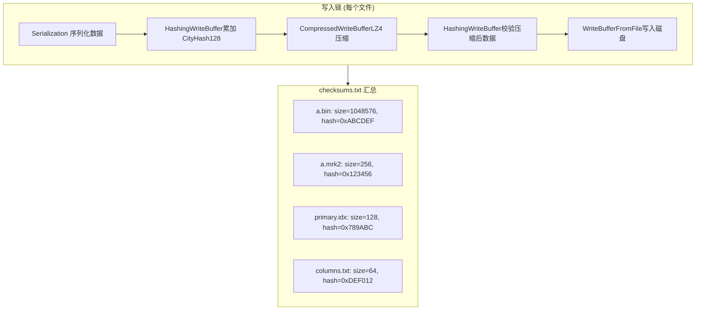

### 启动时的校验流程

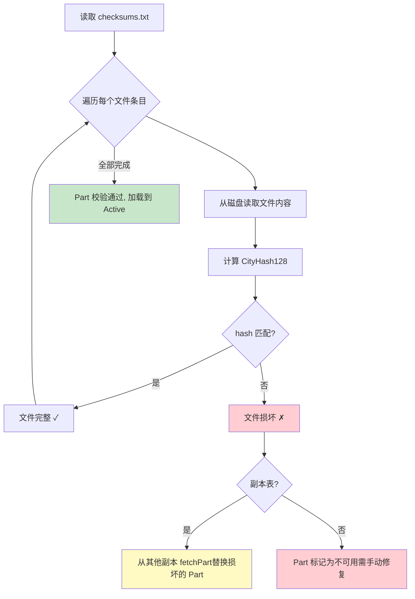

### 读取时的在线校验

```
正常查询时的校验链:
  ReadBufferFromFile → HashingReadBuffer (校验) → CompressedReadBuffer (解压) → HashingReadBuffer (校验) → 返回数据

如果校验失败:
  抛出异常: "Checksum doesn't match: expected ..., got ..."
  副本表: 自动尝试从其他副本读取
  非副本表: 查询失败, 报错
```

## 六、fsync 策略与数据安全权衡

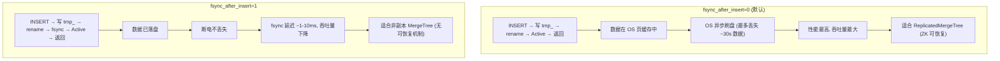

### fsync 相关设置

| 设置 | 默认值 | 说明 |
|------|--------|------|
| `fsync_after_insert` | `0` | INSERT 后是否 fsync |
| `fsync_part_directory` | `1` | Part 写完后是否 fsync 目录 |
| `write_buffer_size` | `1048576` | 写入缓冲区大小 |
| `compress_block_size` | `1048576` | 压缩块大小 |

### 生产环境建议

| 场景 | fsync 策略 | 原因 |
|------|-----------|------|
| ReplicatedMergeTree | `fsync_after_insert=0` | ZK 状态机保证可恢复, 无需每次 fsync |
| MergeTree (非副本) | `fsync_after_insert=1` | 没有副本兜底, fsync 防止断电丢数据 |
| 金融/审计数据 | `fsync_after_insert=1` | 即使有副本, 也保证本地落盘 |

## 七、两阶段提交的状态机保证

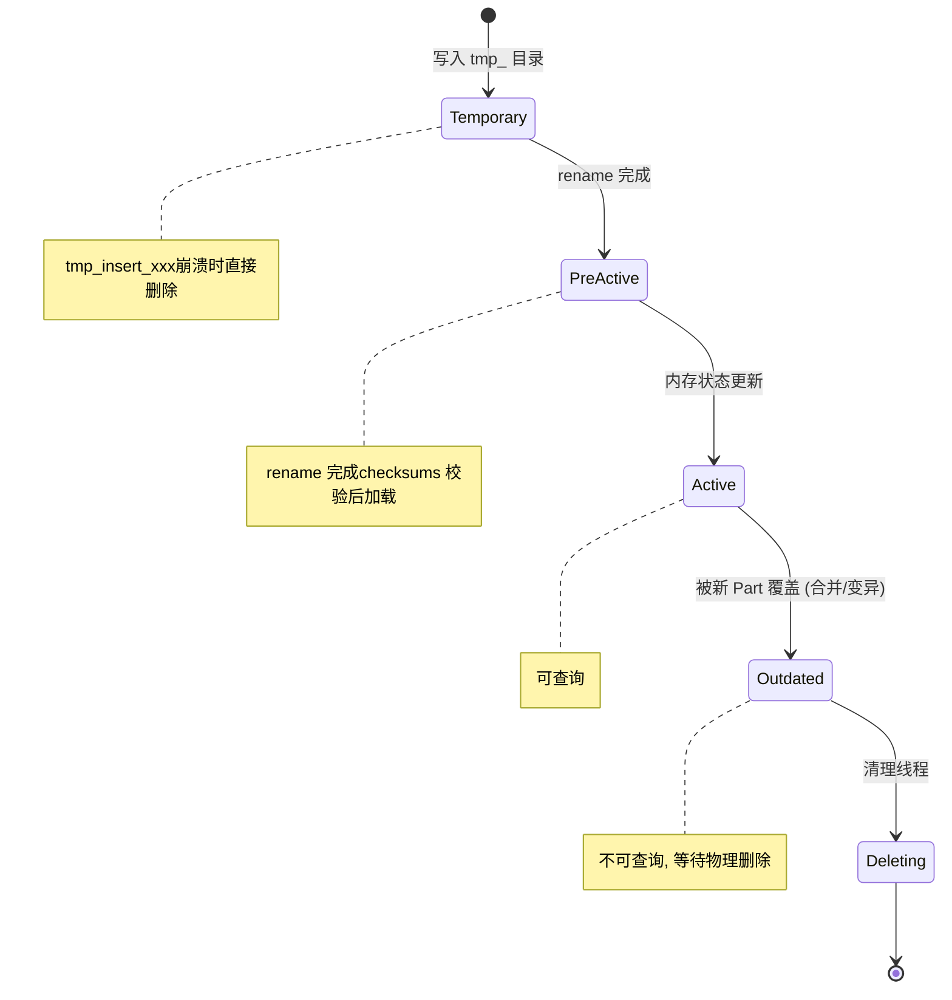

**两阶段提交的作用**: PreActive → Active 的切换是在持有 PartsLock 的情况下原子完成的。查询线程要么看到完整的 Part (Active)，要么看不到 (不存在)，不会看到中间状态。

## 八、崩溃一致性保证总结

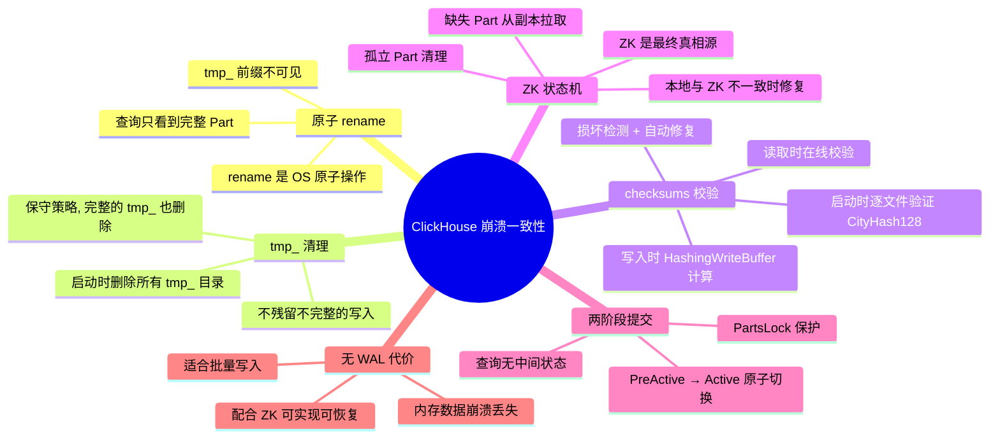

## 九、关键源码文件索引

| 文件 | 职责 |
|------|------|
| `Storages/MergeTree/MergeTreeData.h` | data_parts 容器, Transaction 两阶段提交, Part 状态管理 |
| `Storages/MergeTree/IMergeTreeDataPart.h` | Part 状态枚举 (Temporary/PreActive/Active/Outdated/Deleting) |
| `Storages/MergeTree/MergeTreeDataWriter.cpp` | writeTempPart, finalizePart, rename, 两阶段提交 |
| `Storages/MergeTree/MergedBlockOutputStream.cpp` | 列数据写入, finalizePartOnDisk, checksums 生成 |
| `Storages/MergeTree/MergeTreeDataPartWriterWide.cpp` | Wide 格式列写入, HashingWriteBuffer 链 |
| `IO/HashingWriteBuffer.h` | 写入时 CityHash128 校验 |
| `IO/HashingReadBuffer.h` | 读取时 CityHash128 校验 |
| `Storages/MergeTree/MergeTreeDataMergerMutator.cpp` | 合并时的原子提交 |
| `Storages/StorageReplicatedMergeTree.cpp` | 副本恢复, 与 ZK 对比, fetchPart |
| `Storages/MergeTree/ReplicatedMergeTreeRestartingThread.cpp` | ZK session 恢复 + 元数据修复 |
