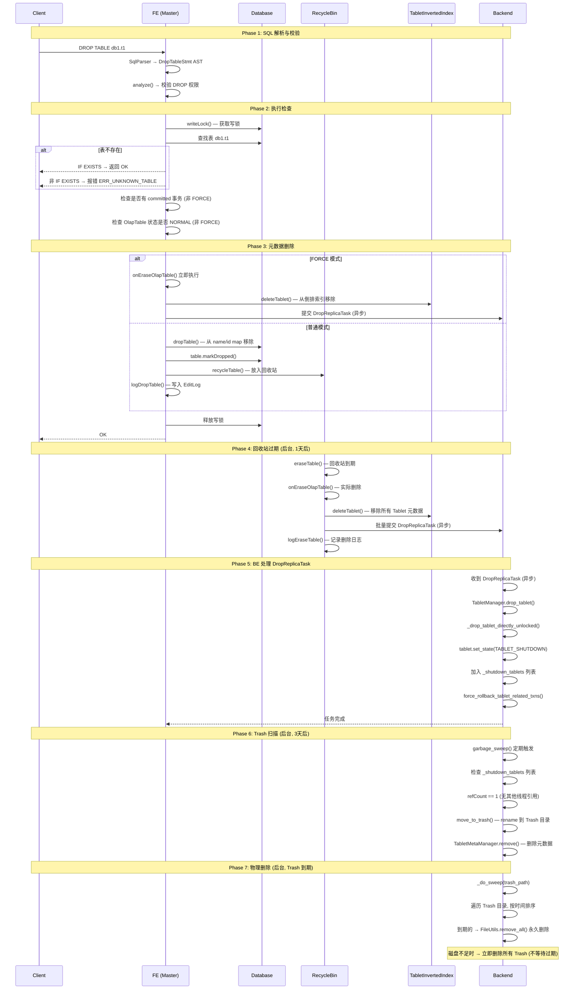

# Apache Doris DROP TABLE 执行流程

## 一、总体概览

DROP TABLE 是一个**多阶段异步删除**的过程，涉及 FE 元数据删除、Recycle Bin 保护、BE 数据移入 Trash、最终物理删除四个阶段：

```
SQL: DROP TABLE db1.t1

FE 元数据删除         BE 数据删除
───────────────       ──────────────
移除内存中的表定义     → Tablet 标记 SHUTDOWN
写入 EditLog          → 异步 DropReplicaTask
放入 Recycle Bin      → Tablet 移入 Trash 目录
(或 FORCE 直接删除)   → Trash 过期后永久删除

时间线:
  0s       10min     1天        1天+3天
  │         │         │          │
  ▼         ▼         ▼          ▼
元数据移除  可恢复    可恢复     物理删除
(FORCE模式  ──────────Recycle─── Trash 到期
 跳过回收站)           Bin 过期
```

---

## 二、完整时序流程



---

## 三、各阶段详解

### 3.1 SQL 解析与权限校验

```
语法: DROP TABLE [IF EXISTS] db_name.table_name [FORCE]

解析: sql_parser.cup → DropTableStmt { ifExists, tableName, forceDrop }

权限: PrivPredicate.DROP → 需要 DROP 权限
```

### 3.2 执行前检查

| 检查项 | 非 FORCE | FORCE | 说明 |
|--------|---------|-------|------|
| 表是否存在 | 报错 / 静默返回 | 同左 | IF EXISTS 控制行为 |
| 是否有 committed 事务 | **阻止删除** | 跳过 | 防止 Load 正在发布时删表 |
| OlapTable 状态是否 NORMAL | **阻止删除** | 跳过 | 防止 Schema Change 中删表 |
| 运行中的查询 | **阻塞等待** | **阻塞等待** | 写锁与读锁互斥，两者一样 |

### 3.3 普通删除 vs FORCE 删除

```
普通删除 (DROP TABLE):

  FE 内存: nameToTable.remove() + idToTable.remove()
  FE 回收站: recycleTable() → 可恢复
  FE EditLog: logDropTable()
  BE 数据: 不删除 (等回收站过期后才发 DropReplicaTask)
  恢复: RECOVER TABLE t1 ✓

FORCE 删除 (DROP TABLE FORCE):

  FE 内存: nameToTable.remove() + idToTable.remove()
  FE 回收站: 不进入回收站
  FE EditLog: logDropTable(force=true)
  BE 数据: 立即发送 DropReplicaTask
  恢复: 不可恢复 ✗
```

### 3.4 Recycle Bin 机制

```
CatalogRecycleBin (MasterDaemon 后台线程):

  存储结构:
    idToTable: Map<Long, Table>        ← 被删除的表
    idToRecycleTime: Map<Long, Long>    ← 删除时间戳

  过期条件 (两个都必须满足):
    ① currentTime - recycleTime > 10 分钟 (硬编码最低限度)
    ② currentTime - recycleTime > catalog_trash_expire_second (默认 1 天)

  过期后的操作:
    1. onEraseOlapTable() → 从 TabletInvertedIndex 移除
    2. 发送 DropReplicaTask 到 BE
    3. 从 idToTable 移除
    4. logEraseTable() 记录

  特殊规则:
    - 如果回收站中已有同名表, 新表进入回收站时旧表立即永久删除
    - RECOVER TABLE 可在过期前恢复 (重新加入 Database 的 map)
```

### 3.5 BE 端 DropReplicaTask 处理

```
FE → BE: DropReplicaTask { tabletId, schemaHash }
    ↓ (异步, 不等待完成)

BE 处理:
  1. TabletManager.drop_tablet(tabletId, schemaHash)
  2. 获取写锁
  3. _drop_tablet_directly_unlocked():
     a. 从 partition map 移除
     b. 从 in-memory tablet map 移除
     c. 设置 state = TABLET_SHUTDOWN
     d. 加入 _shutdown_tablets 列表
     e. 保存 meta (重启后已知该 tablet 已关闭)
  4. force_rollback_tablet_related_txns() (回滚相关事务)
  5. 返回完成状态给 FE

注意: 此时不删除任何磁盘文件!
```

### 3.6 BE 端 Trash 扫描与物理删除

```
后台 GC 线程 (garbage_sweep):

  周期: min=3分钟, max=1小时

  Step 1: 处理 _shutdown_tablets:
    ├── 检查 refCount == 1 (确认无其他线程使用)
    ├── 保存 tablet meta 快照 (.hdr 文件)
    ├── move_to_trash() — rename 到 Trash 目录
    └── TabletMetaManager.remove() — 删除元数据

  Step 2: 清理过期 Trash:
    ├── 遍历 trash/ 目录
    ├── 按时间戳排序
    ├── 到期的 → FileUtils.remove_all() 永久删除
    └── 磁盘不足时 → 所有 Trash 立即删除 (不等待过期)

Trash 目录结构:
  <storage_root>/trash/
    ├── 20240115.080000.1/1001/schema_hash_1/   ← Tablet 1001
    ├── 20240115.080000.2/2001/schema_hash_1/   ← Tablet 2001
    └── 20240116.120000.3/3001/schema_hash_1/   ← Tablet 3001

过期时间: trash_file_expire_time_sec = 259200 (3天)
```

---

## 四、数据删除的完整生命周期

```
时间线:

  ┌─────────┐  ┌──────────┐  ┌───────────┐  ┌───────────┐  ┌───────────┐
  │ 正常表   │→│ FE 元数据  │→│ 回收站    │→│ BE Trash  │→│ 物理删除   │
  │         │  │ 已移除    │  │ (可恢复)  │  │ (不可恢复)│  │           │
  └─────────┘  └──────────┘  └───────────┘  └───────────┘  └───────────┘
       │ 0s          │ 0s          │ 10min~1天     │ 3min~1h       │ 3天+
       │            │             │               │               │
  查询不可用    FORCE模式       RECOVER TABLE   move_to_trash    remove_all
  写入不可用    跳过回收站      可恢复 ✓       不可恢复 ✗      磁盘释放

  FORCE 模式跳过回收站, 直接从 FE 元数据移除 → BE Trash
```

---

## 五、并发控制与安全性

### 5.1 锁机制

```
DROP TABLE 获取的锁:
  1. Database.writeLock() — 排除其他 DDL 和 DML
  2. Table.writeLock() — 排除所有读写操作 (内部由 unprotectDropTable 调用)

效果:
  ├── 运行中的查询: 持有 Table 读锁 → DROP 等待查询完成
  ├── 并发的 DROP: 写锁互斥 → 第二个 DROP 等待
  ├── 并发的 SELECT: 等 DROP 完成后报错 "table not found"
  └── 并发的 INSERT: 等 DROP 完成后报错 "table not found"
```

### 5.2 与 Load 事务的交互

```
非 FORCE 模式:
  DROP TABLE → 检查 existCommittedTxns()
    ├── 有 committed 事务 → 拒绝删除, 提示使用 FORCE
    └── 无 committed 事务 → 允许删除

FORCE 模式:
  DROP TABLE FORCE → 跳过事务检查
    ├── BE 端 force_rollback_tablet_related_txns() 回滚相关事务
    └── 正在写入的数据可能丢失
```

### 5.3 全异步删除的安全性

```
删除的每一层都是异步的:

  FE → BE 的 DropReplicaTask: 异步提交, FE 不等待 BE 完成
  BE 标记 SHUTDOWN → move_to_trash: 周期性 GC, 非实时
  Trash → 永久删除: 周期性扫描, 3天后才执行

安全性保障:
  ├── FE 元数据先移除 → 新查询找不到表 → 不会读到半删状态的数据 ✓
  ├── BE Tablet SHUTDOWN → 新 I/O 被拒绝 → 不会写到待删除的 Tablet ✓
  ├── refCount 检查 → 确认无线程引用 → 不会删除正在读取的数据 ✓
  └── Trash 保留 3 天 → 磁盘误删后仍有恢复窗口 ✓
```

---

## 六、配置参数

| 参数 | 默认值 | 位置 | 说明 |
|------|-------|------|------|
| `catalog_trash_expire_second` | 86400 (1天) | FE Config | FE 回收站过期时间 |
| `minEraseLatency` | 600000 (10分钟) | RecycleBin 硬编码 | 回收站最低保留时间 |
| `trash_file_expire_time_sec` | 259200 (3天) | BE Config | BE Trash 过期时间 |
| `max_garbage_sweep_interval` | 3600 (1小时) | BE Config | GC 最大扫描间隔 |
| `min_garbage_sweep_interval` | 180 (3分钟) | BE Config | GC 最小扫描间隔 |
| `max_agent_task_threads_num` | 16 | FE Config | Agent Task 线程池大小 |

---

## 七、RECOVER TABLE（恢复）

```
前提: 非 FORCE 删除, 且回收站尚未过期

RECOVER TABLE t1:

  1. CatalogRecycleBin.recoverTable(dbId, tableName)
  2. 从 idToTable 取出 Table 对象
  3. 重新加入 Database 的 name/id map
  4. table.markRecovering() → markRecovered()
  5. 从回收站移除
  6. logRecoverTable() — 写入 EditLog

限制:
  ├── 回收站中已有同名表 → 恢复失败
  ├── 回收站已过期 → 恢复失败 (数据已开始从 BE 删除)
  └── FORCE 删除的表 → 恢复失败 (从未进入回收站)
```

---

## 八、关键代码文件索引

| 组件 | 文件路径 |
|------|---------|
| SQL 语法规则 | `fe/fe-core/src/main/cup/sql_parser.cup` |
| DropTableStmt | `fe/fe-core/src/main/java/org/apache/doris/analysis/DropTableStmt.java` |
| Catalog.dropTable() | `fe/fe-core/src/main/java/org/apache/doris/catalog/Catalog.java:4597` |
| Database.dropTable() | `fe/fe-core/src/main/java/org/apache/doris/catalog/Database.java:380` |
| RecycleBin | `fe/fe-core/src/main/java/org/apache/doris/catalog/CatalogRecycleBin.java` |
| onEraseOlapTable() | `fe/fe-core/src/main/java/org/apache/doris/catalog/Catalog.java:7235` |
| TabletInvertedIndex | `fe/fe-core/src/main/java/org/apache/doris/catalog/TabletInvertedIndex.java` |
| DropReplicaTask | `fe/fe-core/src/main/java/org/apache/doris/task/DropReplicaTask.java` |
| BE TabletManager.drop | `be/src/olap/tablet_manager.cpp:459` |
| BE move_to_trash | `be/src/olap/utils.cpp:588` |
| BE Trash Sweep | `be/src/olap/storage_engine.cpp:637` |

---
