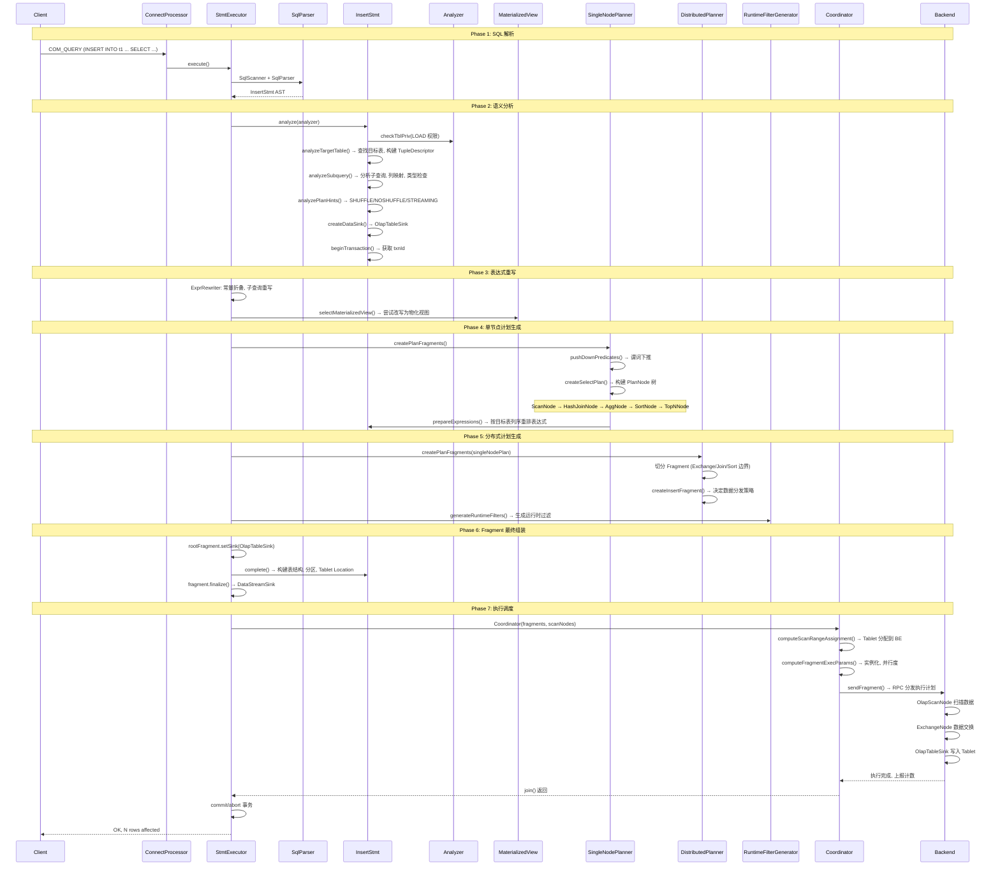
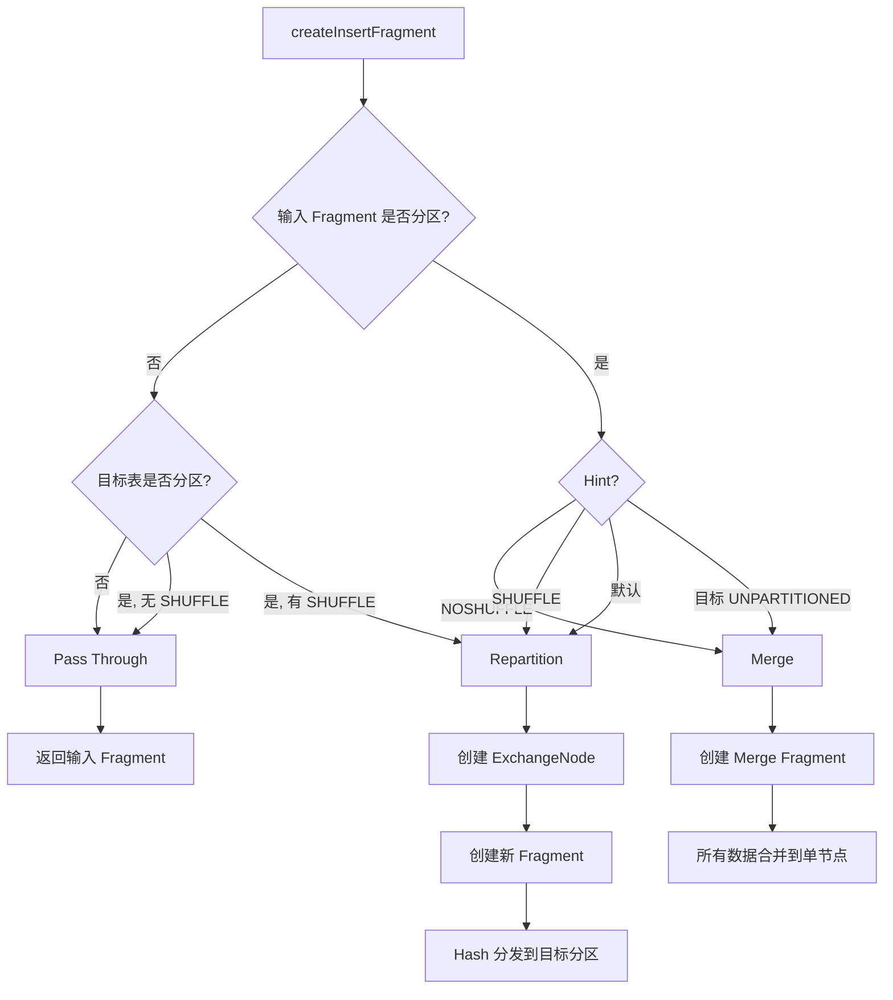
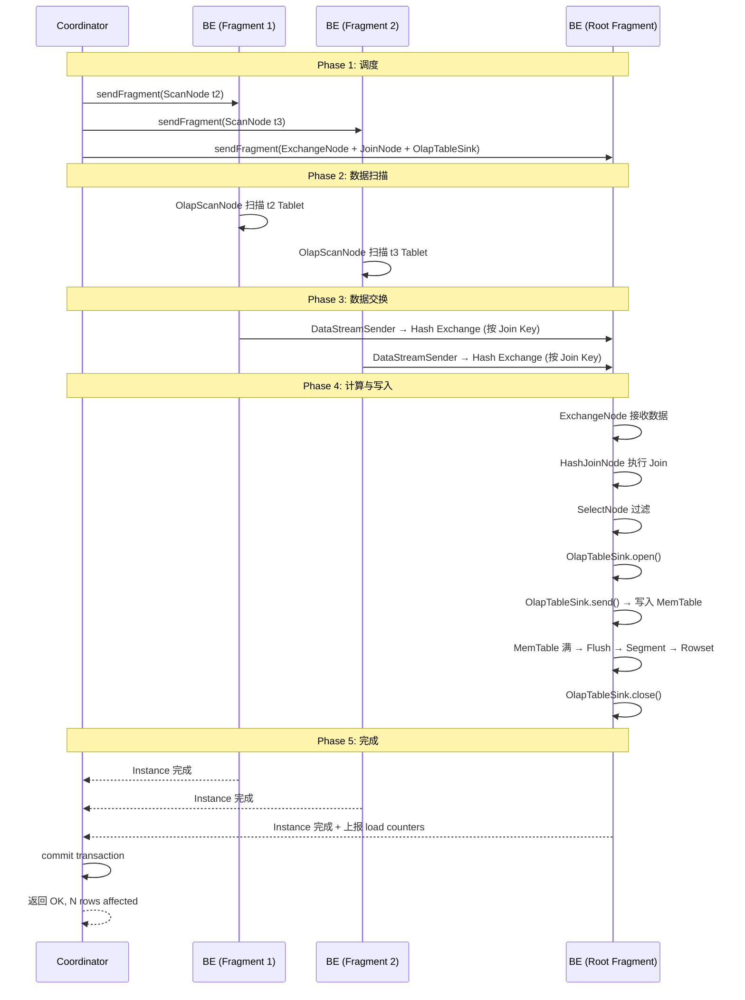

# Apache Doris INSERT 语句执行计划生成流程

## 一、总体概览

```
SQL: INSERT INTO t1 (c1, c2) SELECT c1, c2 FROM t2 WHERE c1 > 10

MySQL Protocol ──► Parse ──► Analyze ──► Optimize ──► Fragment ──► Execute
     │               │         │          │           │           │
     │               │         │          │           │           └── BE 写入
     │               │         │          │           └── 分片分发
     │               │         │          └── 规则优化 + 物化视图
     │               │         └── 语义分析 + 权限校验 + 事务开始
     │               └── AST: InsertStmt
     └── COM_QUERY
```

---

## 二、完整时序流程



---

## 三、各阶段详解

### 3.1 SQL 解析（Parse）

**入口**：`ConnectProcessor.handleQuery()` → `StmtExecutor.execute()`

**词法分析器**：JFlex 生成 (`sql_scanner.flex`)
**语法分析器**：CUP 生成 (`sql_parser.cup`)

```
INSERT 语法规则 (sql_parser.cup):
  insert_stmt ::=
    KW_INSERT KW_INTO insert_target:target
    opt_with_label:label opt_col_list:cols
    opt_plan_hints:hints insert_source:source
    {: RESULT = new InsertStmt(target, label, cols, source, hints); :}

  insert_source ::=
    KW_VALUES ...          ← INSERT INTO t VALUES (1,2), (3,4)
    | query_stmt           ← INSERT INTO t SELECT ... FROM ...

AST 产物:
  InsertStmt {
      target: InsertTarget(TableName, PartitionNames?)
      label: String?
      cols: List<String>?
      source: InsertSource(QueryStmt)
      hints: List<PlanHint>?
  }
```

### 3.2 语义分析（Analyze）

**入口**：`InsertStmt.analyze(Analyzer)` — 7 个步骤

```
Step 1: 权限检查
  └── CHECK LOAD PRIVILEGE ON target_table

Step 2: 目标表分析 — analyzeTargetTable()
  └── Catalog.lookupTable(db, table) → OlapTable
  └── 构建 TupleDescriptor + SlotDescriptor (每个列)
  └── 解析 PartitionNames → partitionIds

Step 3: 子查询分析 — analyzeSubquery()
  └── 列映射: INSERT 的列 → 目标表的列
  └── 类型检查: 源列类型 ↔ 目标列类型 (隐式转换)
  └── 非空检查: 非 NULL 且无 DEFAULT 的列必须有值
  └── Shadow Column 处理 (Schema Change 中间态)
  └── Materialized View 列补全
  └── queryStmt.analyze(analyzer) → 递归分析 SELECT 子句

Step 4: Plan Hints 分析 — analyzePlanHints()
  └── SHUFFLE:    强制按目标表分区重新分发
  └── NOSHUFFLE:  强制合并, 不重新分发
  └── STREAMING:  标记为流式 INSERT

Step 5: 创建 DataSink — createDataSink()
  └── OlapTable: → OlapTableSink(table, tuple, partitionIds)
  └── Broker:    → ExportSink
  └── MySQL/ODBC: → MysqlTableSink / OdbcTableSink

Step 6: 事务管理
  └── GlobalTransactionMgr.beginTransaction(label, dbId, tables)
  └── OlapTableSink.init(loadId, txnId, dbId)

Step 7: 物化视图改写 (独立步骤)
  └── selectMaterializedView() → 尝试用 MV 替换基表
```

### 3.3 表达式重写

```
ExprRewriter 执行的转换:
  ├── 常量折叠:    1 + 2 → 3,  CONCAT('a', 'b') → 'ab'
  ├── 子查询平展:  WHERE c1 IN (SELECT c1 FROM t2) → Hash Join
  ├── NULL 处理:   COALESCE(NULL, 0) → 0
  └── 类型强转:    '123' + 1 → CAST('123' AS INT) + 1
```

### 3.4 单节点计划生成（SingleNodePlanner）

**核心逻辑**：`SingleNodePlanner.createQueryPlan()`

```
输入: SELECT c1, c2 FROM t2 WHERE c1 > 10 JOIN t3 ON t2.id = t3.id

输出 PlanNode 树:

                  TopNNode (LIMIT)
                      │
                  SortNode (ORDER BY)
                      │
               SelectNode (剩余谓词)
                      │
              HashJoinNode (JOIN)
               /              \
        ScanNode(t2)      ScanNode(t3)
        [c1 > 10 推下]
```

**优化规则**（在计划构建时直接应用，非独立的 CBO 优化器）：

| 规则 | 作用 | 位置 |
|------|------|------|
| `pushDownPredicates()` | 谓词下推到 ScanNode | SingleNodePlanner:225 |
| `selectMaterializedView()` | 尝试改写为物化视图扫描 | Planner:188 |
| Join 顺序选择 | 基于 hint 或启发式 | SingleNodePlanner:createJoinPlan |
| 聚合下推 | SUM/COUNT 下推到存储层 | SingleNodePlanner |
| Sort + LIMIT 合并 | TopNNode 替代 SortNode + LIMIT | SingleNodePlanner |
| 向量化转换 | convertToVectorized() | Planner:172 |

### 3.5 分布式计划生成（DistributedPlanner）

**核心逻辑**：将单节点计划树切割为多个 Fragment

```
切割前 (单节点 PlanNode 树):

  OlapTableSink (INSERT 目标)
        │
   HashJoinNode
    /        \
ScanNode   ScanNode(t3)
(t2)

切割后 (Fragment 树):

  ┌── Fragment 0 (Root) ──────────────────┐
  │  ExchangeNode ←──── Fragment 1 输出    │
  │      │                                 │
  │  HashJoinNode                         │
  │    /        \                          │
  │ ScanNode  ExchangeNode ←── Fragement 2│
  └───────────────────────────────────────┘

  ┌── Fragment 1 ─────────────────────────┐
  │  ScanNode(t2) → DataStreamSender      │
  │  (Hash 分发到 Fragment 0)             │
  └───────────────────────────────────────┘

  ┌── Fragment 2 ─────────────────────────┐
  │  ScanNode(t3) → DataStreamSender      │
  │  (Hash 分发到 Fragment 0)             │
  └───────────────────────────────────────┘
```

**Fragment 切割边界**：

| 节点类型 | 是否切割 | 说明 |
|---------|---------|------|
| ExchangeNode | 是 | 明确的数据交换边界 |
| HashJoinNode | 是 | Build 侧单独一个 Fragment |
| SortNode | 是 | 需要全局有序时切割 |
| SubplanNode | 是 | 子计划独立 Fragment |

### 3.6 INSERT Fragment 分发策略

**核心决策**：`DistributedPlanner.createInsertFragment()`

```
决策矩阵:

                    目标表 UNPARTITIONED    目标表 PARTITIONED    目标表 RANDOM
                    ──────────────────     ─────────────────     ───────────
输入 Fragment
  UNPARTITIONED     Pass Through           Pass Through         Pass Through
  (单节点)          (直接写入)              (单节点写所有分区)     (直接写入)

  PARTITIONED       Merge                  视 Hint 决定          Pass Through
  (多节点)          (合并为单流)            见下表                (直接写入)

PARTITIONED + 目标 PARTITIONED 的 Hint 决策:

  Hint=默认(SHUFFLE) → Repartition (按目标表分区键 Hash 重新分发)
  Hint=NOSHUFFLE     → Merge (所有数据合并到一个节点写入)
  Hint=STREAMING     → Pass Through (流式, 不改变分发)
```



### 3.7 OlapTableSink 构建

`InsertStmt.complete()` 调用 `OlapTableSink.complete()`，构建写入所需的全部参数：

```
OlapTableSink.complete() 构建的参数:

TOlapTableSchemaParam          表结构
  ├── index_id → schema_hash    索引到 Schema 映射
  ├── slot descriptors          所有列的 Slot 描述
  └── tuple descriptor          Tuple 描述

TOlapTablePartitionParam        分区信息
  ├── partition_type            RANGE / LIST / UNPARTITIONED
  ├── partition_columns         分区列
  ├── distributed_columns       分桶列
  ├── partition → tablet list   每个分区的 Tablet 列表
  └── is_multi_partition        是否多分区

TOlapTableLocationParam         Tablet 位置
  └── tablet_id → [backend_id]  Tablet 到 BE 的映射
```

### 3.8 Coordinator 调度执行

```
Coordinator.exec() 执行流程:

Step 1: prepare()
  └── 为每个 Fragment 创建 FragmentExecParams

Step 2: computeScanRangeAssignment()
  └── 将 Tablet Scan 分配到 BE 节点
  └── 策略: 轮询 / Colocate / Bucket Shuffle

Step 3: computeFragmentExecParams()
  └── 分配 Instance ID (并行度)
  └── 计算 Exchange 目标地址和 Sender 数量

Step 4: sendFragment()
  └── 序列化为 Thrift: TPlanFragment + TExecPlanFragmentParams
  └── RPC 分发到各 BE 节点

Step 5: join()
  └── 等待所有 Instance 完成
  └── 收集计数: DPP_NORMAL_ALL (成功行数), DPP_ABNORMAL_ALL (失败行数)
  └── commit/abort 事务
```

---

## 四、BE 端执行流程



---

## 五、执行计划示例

以 `INSERT INTO t1 SELECT t2.c1, t2.c2 FROM t2 JOIN t3 ON t2.id = t3.id WHERE t2.c1 > 10` 为例：

```
EXPLAIN 输出 (简化):

PLAN FRAGMENT 0 (ROOT)
  SINK: OlapTableSink
    PARTITION: RANDOM
  5:EXCHANGE
     |
  4:HASH JOIN (INNER)
     |  join: t2.id = t3.id
     |
     |---3:EXCHANGE
     |
  2:PREDICATE (c1 > 10)
     |
  1:OLAP SCAN NODE (t2)
     TABLE: t2, PREAGGREGATION: OFF
     PREDICATES: t2.c1 > 10

PLAN FRAGMENT 1
  STREAM DATA SINK: EXCHANGE (HASH: id)
  0:OLAP SCAN NODE (t3)
     TABLE: t3

PLAN FRAGMENT 2
  STREAM DATA SINK: EXCHANGE (HASH: id)
  0:OLAP SCAN NODE (t2)
     TABLE: t2
```

---

## 六、关键文件索引

| 组件 | 文件路径 |
|------|---------|
| 解析器语法 | `fe/fe-core/src/main/cup/sql_parser.cup` |
| 词法规则 | `fe/fe-core/src/main/jflex/sql_scanner.flex` |
| InsertStmt AST | `fe/fe-core/src/main/java/org/apache/doris/analysis/InsertStmt.java` |
| 语句执行器 | `fe/fe-core/src/main/java/org/apache/doris/qe/StmtExecutor.java` |
| 单节点规划器 | `fe/fe-core/src/main/java/org/apache/doris/planner/SingleNodePlanner.java` |
| 分布式规划器 | `fe/fe-core/src/main/java/org/apache/doris/planner/DistributedPlanner.java` |
| 计划组装器 | `fe/fe-core/src/main/java/org/apache/doris/planner/Planner.java` |
| PlanFragment | `fe/fe-core/src/main/java/org/apache/doris/planner/PlanFragment.java` |
| OlapTableSink | `fe/fe-core/src/main/java/org/apache/doris/planner/OlapTableSink.java` |
| Coordinator | `fe/fe-core/src/main/java/org/apache/doris/qe/Coordinator.java` |
| MySQL 协议 | `fe/fe-core/src/main/java/org/apache/doris/qe/ConnectProcessor.java` |

---