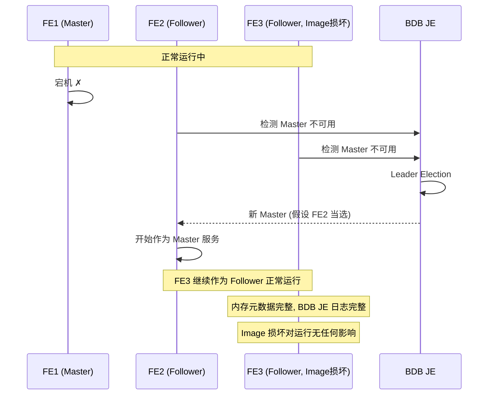
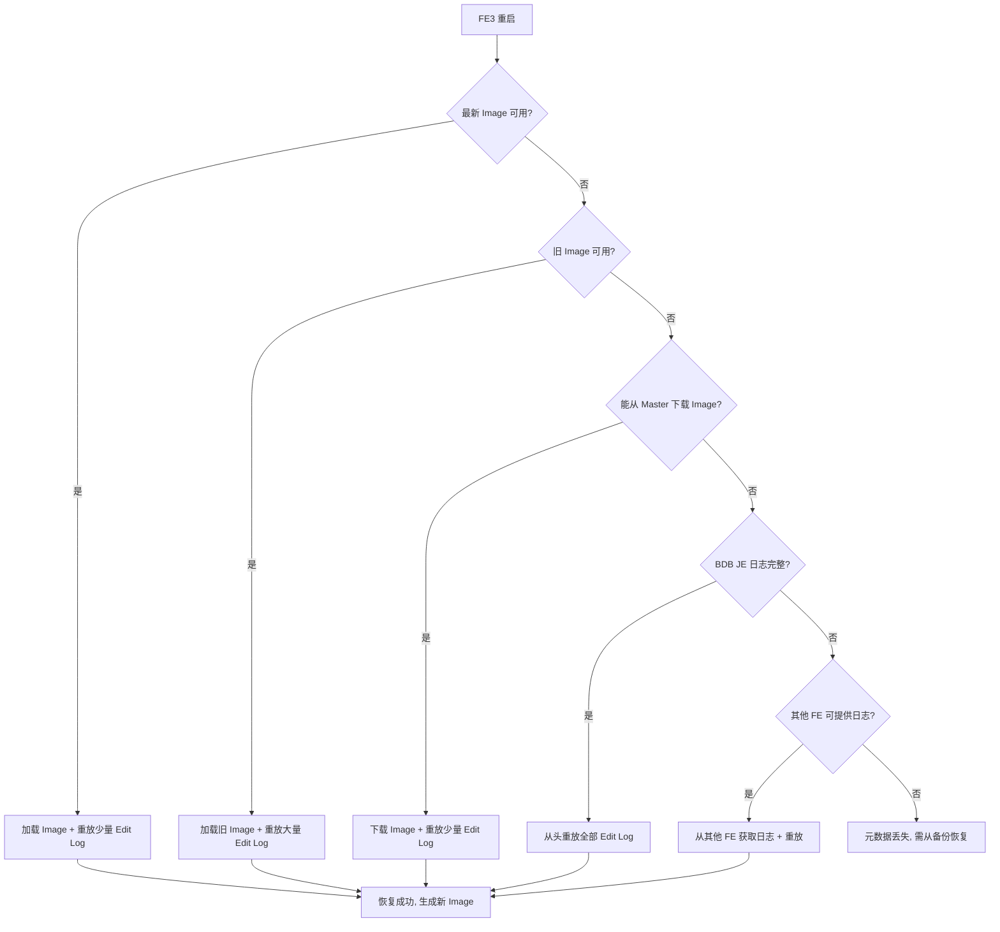
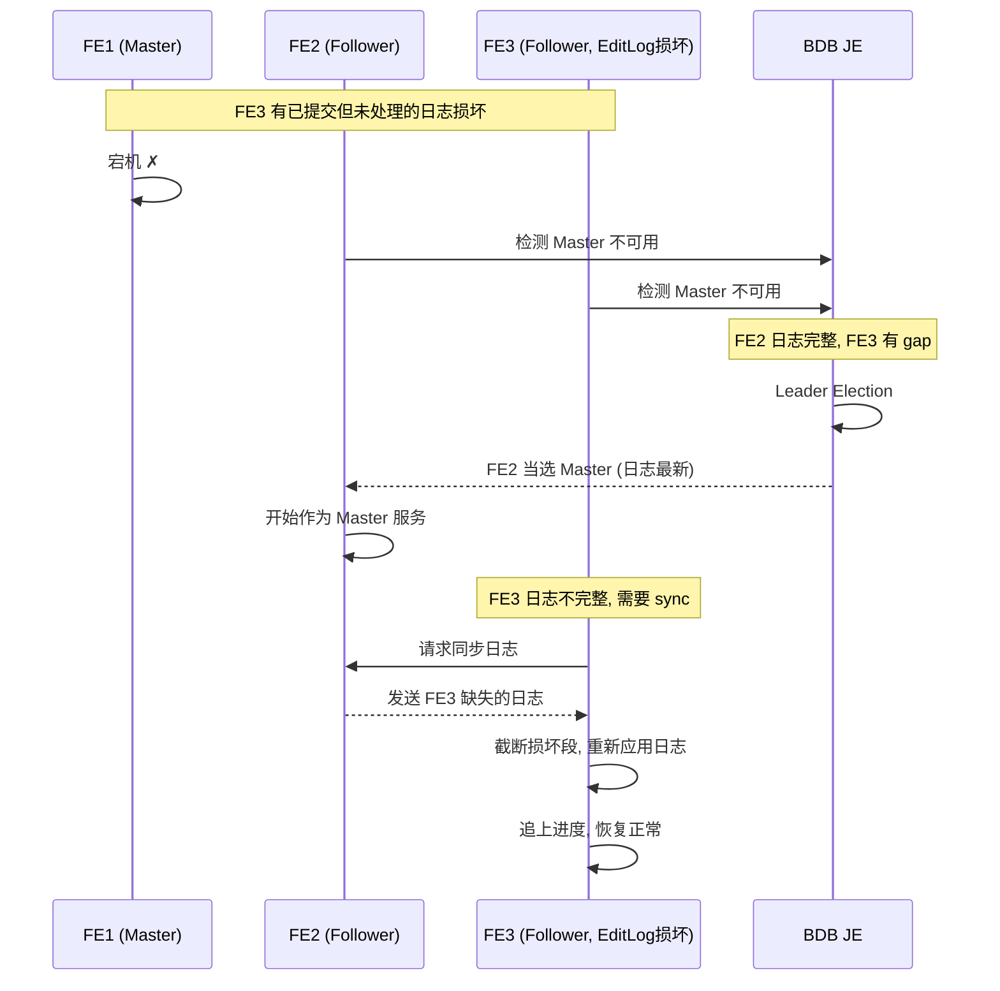
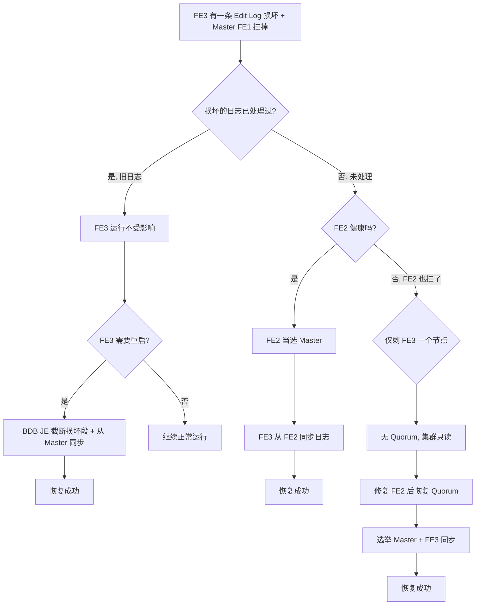

# Apache Doris FE 元数据容灾分析：Image 损坏 + Master 故障场景

## 一、FE 元数据存储架构

Doris FE 的元数据由两层存储组成，安全性依赖截然不同的机制：

```
┌──────────────────────────────────────────────────────────────────┐
│                     FE 元数据存储架构                              │
│                                                                   │
│  ┌─────────────────────────────────┐  ┌────────────────────────┐ │
│  │  Layer 1: Edit Log (BDB JE)     │  │  Layer 2: Image (本地)  │ │
│  │                                 │  │                        │ │
│  │  - 每次元数据变更写入一条 journal │  │  - 每 50,000 条 journal │ │
│  │  - BDB JE 多数派复制            │  │    生成一次全量快照      │ │
│  │  - Master 写 → Follower 同步    │  │  - 仅存储在本地文件系统   │ │
│  │  - SYNC + SIMPLE_MAJORITY       │  │  - 不通过 BDB JE 复制    │ │
│  │                                 │  │                        │ │
│  │  安全保障: ✓ 复制保护            │  │  安全保障: ✗ 无复制保护   │ │
│  │  作用: 元数据的真正保障           │  │  作用: 启动加速缓存       │ │
│  └─────────────────────────────────┘  └────────────────────────┘ │
│                                                                   │
│  启动流程: 加载最新 Image → 重放 Image 之后的 Edit Log             │
└──────────────────────────────────────────────────────────────────┘
```

### 关键区别

| 维度 | Edit Log (BDB JE) | Image (本地文件) |
|------|-------------------|-----------------|
| 复制 | 多数派复制 (2/3 FE) | 无复制，每个 FE 独立存储 |
| 持久化策略 | Master + Follower 均 fsync | 本地磁盘写入 |
| 作用 | 元数据变更的可靠日志 | 启动加速缓存 |
| 损坏影响 | 可能导致数据丢失 | 仅影响启动速度 |
| 数量 | 持续追加 | 滚动保留（新旧两个版本） |
| 选举依据 | BDB JE leader election | 与选举无关 |

---

## 二、故障场景设定

```
初始状态:
  FE1 (Master)    — 运行正常
  FE2 (Follower)  — 运行正常
  FE3 (Follower)  — Image 文件损坏, 但进程正在运行中

故障发生:
  FE1 (Master) 突然宕机
```

---

## 三、逐步故障分析

### 阶段 1：FE3 Image 损坏，但仍在运行

```
FE3 状态:
  ├── 进程: 运行中 ✓
  ├── 内存元数据: 完整 ✓ (启动时已加载)
  ├── BDB JE 日志: 完整 ✓ (持续同步)
  ├── Image 文件: 损坏 ✗ (但不影响运行)
  └── 服务能力: 读写正常 ✓

结论: 运行中的 FE 完全不受 Image 损坏影响
原因: Image 只在启动时读取一次, 运行期间元数据在内存中
```

### 阶段 2：Master FE1 宕机

```
FE1 宕机后集群状态:
  FE1 (Master)    — 不可用
  FE2 (Follower)  — 运行正常
  FE3 (Follower)  — 运行正常 (Image 损坏但不影响)

BDB JE 可用节点: FE2 + FE3 = 2 个 (Quorum = ⌈3/2⌉ = 2)
结论: BDB JE 多数派可用, 可以进行选举
```

### 阶段 3：BDB JE 选举新 Master

```
BDB JE 选举过程:
  1. FE2/FE3 检测到 Master 不可用
  2. BDB JE 内部发起 leader election
  3. 基于 BDB JE 日志复制状态 (非 Image 状态) 选择新 leader
  4. FE2 或 FE3 被选为新 Master

FE3 可以被选为 Master 吗?
  ├── BDB JE 日志完整?  ✓ (Image 损坏 ≠ 日志损坏)
  ├── 内存元数据完整?   ✓ (运行期间持续维护)
  └── 结论: 可以正常当选 ✓
```



### 阶段 4：新 Master 正常服务

```
无论 FE2 还是 FE3 当选为 Master:

  ├── 元数据读写: 正常 ✓
  ├── 新事务提交: 正常 ✓ (BDB JE 写入多数派)
  ├── 查询路由: 正常 ✓
  ├── Tablet 调度: 正常 ✓
  └── Clone/Repair: 正常 ✓

集群对外服务完全不受影响
```

### 阶段 5：FE3 重启 — 真正的问题出现

```
FE3 重启时:

Step 1: 加载最新 Image
  → 读取 image.20240115_080000
  → 校验失败 (文件损坏)
  → 返回错误 ✗

Step 2: 进入恢复流程 (见下方)
```

---

## 四、FE3 重启的恢复路径

### 路径 1：加载更早的可用 Image

```
前提: FE3 本地有多个 Image 版本, 至少一个可用

FE3 本地文件:
  ./doris-meta/image/image.20240101_120000  ← 旧, 可用 ✓
  ./doris-meta/image/image.20240115_080000  ← 最新, 损坏 ✗

恢复过程:
  1. 跳过损坏的最新 Image
  2. 加载旧 Image (20240101)
  3. 重放 14 天的 Edit Log (约数万~数十万条)
  4. 恢复到最新状态

恢复时间: 分钟级 (取决于需要重放的日志数量)
成功率: 高 ✓
```

### 路径 2：从新 Master 下载 Image

```
前提: 新 Master FE2 的 Image 正常, 且网络连通

恢复过程:
  1. FE3 启动时发现本地 Image 不可用
  2. 连接新 Master FE2
  3. 下载 FE2 的最新 Image 文件
  4. 加载下载的 Image
  5. 重放 Image 之后的少量 Edit Log

恢复时间: 秒级 (只需重放少量日志)
成功率: 高 ✓
```

### 路径 3：丢弃所有 Image, 从 Edit Log 头部重放

```
前提: FE3 所有本地 Image 都损坏, 但 BDB JE 日志完整

恢复过程:
  1. 跳过所有 Image
  2. 从 BDB JE 中最早的一条日志开始重放
  3. 逐条应用所有元数据变更
  4. 最终在内存中重建完整元数据
  5. 生成新的 Image

恢复时间: 很长 (可能数小时, 取决于集群历史)
成功率: ✓ (BDB JE 日志完整即可)
```

### 路径 4：最坏情况 — 元数据丢失

```
前提: FE3 所有 Image 损坏 + BDB JE 日志也不完整

恢复过程:
  1. 从其他健康 FE (FE2) 获取 BDB JE 日志副本
  2. 重放日志重建元数据

  如果所有 FE 的 BDB JE 都不完整:
  ┌─────────────────────────────────────────┐
  │ ✗ 元数据丢失                              │
  │                                          │
  │ 受影响的数据:                             │
  │ - 所有 Database/Table/Partition 定义      │
  │ - 用户权限信息                            │
  │ - Load Job 历史                          │
  │ - Colocate Group 信息                    │
  │ - Resource/Function 定义                 │
  │                                          │
  │ 不受影响的数据:                           │
  │ - BE 上的实际表数据 (Segment 文件)        │
  │   (数据在 BE 上, 不在 FE 上)              │
  │ - 正在运行的查询/Load 任务                │
  └─────────────────────────────────────────┘
```

---

## 五、恢复路径决策树



---

## 八、故障场景二：Edit Log 损坏 + Master 宕机

### 8.1 Edit Log vs Image：损坏影响的天壤之别

```
Image 损坏:   启动加速缓存坏了 → 换一个缓存就好, 数据不丢
Edit Log 损坏:  元数据的真正记录坏了 → 可能影响 BDB JE 复制链 → 可能影响 Quorum
```

### 8.2 BDB JE 的内部完整性保护

BDB JE 不是简单的文件追加，它有自己的完整性保护机制：

```
BDB JE 内部机制:
  ├── 每条日志条目有内部校验和 (BDB JE 自身的 checksum)
  ├── 日志文件 (.jdb) 有格式校验
  ├── 启动时验证日志完整性
  ├── 通过 VLSN (Virtual Log Sequence Number) 追踪日志位置
  └── 支持从 Master 同步日志 (replication sync)
```

### 8.3 场景设定

```
初始状态:
  FE1 (Master)    — 运行正常
  FE2 (Follower)  — 运行正常
  FE3 (Follower)  — 某条 Edit Log 损坏

  BDB JE 节点: 3 个, Quorum = 2
```

### 8.4 情况 A：损坏的 Edit Log 是已提交且已处理的（旧日志）

```
含义: 这条日志在 FE1 上成功写入 (多数派确认), FE3 也已处理并加载到内存

FE3 运行期间:
  ├── 内存元数据: 完整 ✓ (损坏的日志内容已在之前处理过)
  ├── BDB JE 后续日志: 正常接收 ✓ (损坏的是旧日志, 不影响新日志)
  └── 损坏只在未来重启时才暴露

FE1 挂掉后:
  ├── FE2 当选 Master ✓
  ├── FE3 继续作为 Follower 正常运行 ✓
  └── 集群完全不受影响

FE3 重启时:
  ├── BDB JE 启动校验 → 发现旧日志条目损坏
  ├── BDB JE 截断到损坏点之前的最后有效条目
  ├── 从新 Master (FE2) 同步缺失的日志
  └── 恢复成功 ✓
```

### 8.5 情况 B：损坏的 Edit Log 是已提交但 FE3 尚未处理

```
含义: 这条日志在 FE1 上写入成功 (FE1+FE2 确认), 但传到 FE3 时损坏了

FE3 运行期间:
  ├── 已处理的日志 → 内存元数据正确
  ├── 损坏的日志 → FE3 无法处理
  └── 后续日志 → FE3 无法处理 (日志是连续的, 中间断裂)
  → 结果: FE3 落后于 Master, 不再同步新日志

FE1 挂掉后:
  BDB JE 可用节点: FE2 (健康) + FE3 (日志不完整)

  FE3 能参与选举吗?
    ├── BDB JE 选举需要日志最新的节点
    ├── FE3 日志不完整 (有 gap) → 不能成为 Master ✗
    └── FE3 仍可作为 Follower 参与投票

  能选出 Master 吗?
    ├── BDB JE 需要 Quorum = 2
    ├── FE3 虽然日志不完整, 但仍是 BDB JE 复制组成员
    ├── FE2 有完整日志 → FE2 当选 Master ✓
    └── 集群恢复服务

  FE3 需要修复:
    ├── 从 FE2 (新 Master) 重新同步日志
    ├── 截断损坏的日志段
    ├── 重新应用同步过来的日志
    └── 追上进度后恢复正常
```



### 8.6 情况 C：损坏的 Edit Log 是未提交的

```
含义: 这条日志在 FE1 上写入, 但尚未获得多数派确认

最简单的情况:
  ├── 未提交的日志本来就不会生效
  ├── BDB JE 在选举时会自动丢弃未提交的日志
  └── FE3 截断到上一条已提交的日志即可
```

### 8.7 情况 D（最坏）：FE2 也不健康，仅剩 FE3

```
初始状态:
  FE1 (Master)    — 挂掉
  FE2 (Follower)  — 也挂掉 (或网络隔离)
  FE3 (Follower)  — Edit Log 损坏, 但进程在运行

BDB JE 可用节点: 仅 FE3
Quorum: 需要 2/3, 实际 1/3 → 无 Quorum

后果:
  ├── BDB JE 无法选举新 Master
  ├── 无法写入任何新的 Edit Log
  ├── 集群进入"只读模式" (已有内存元数据仍可查询)
  ├── 无法创建新事务、无法 DDL、无法 Load
  └── 必须恢复 FE2 才能恢复 Quorum

FE3 运行期间 (内存中元数据仍完整):
  ├── 查询: 可以 ✓ (内存中有元数据)
  ├── DDL: 不可以 ✗ (无法写 Edit Log)
  ├── Insert: 不可以 ✗ (需要事务, 无法写 Edit Log)
  └── Load: 不可以 ✗ (需要事务)

FE3 重启:
  ├── BDB JE 校验 → 发现日志损坏
  ├── BDB JE 截断损坏段
  ├── 无法从 Master 同步 (无 Master, 无 Quorum)
  └── FE3 启动但无法提供写服务

恢复:
  ├── 修复 FE2, 使其上线
  ├── FE2 和 FE3 形成 Quorum (2/3)
  ├── 选举 Master
  ├── FE3 从 Master 同步日志
  └── 恢复正常
```

### 8.8 Edit Log 损坏恢复决策树



### 8.9 两种损坏场景的对比

| 维度 | Image 损坏 + Master 挂 | Edit Log 损坏 + Master 挂 |
|------|----------------------|-------------------------|
| 严重程度 | 低 | **中~高** |
| FE3 运行中受影响 | 否 | **可能** (取决于损坏位置) |
| Master 选举受影响 | 否 | **可能** (FE3 不能当选) |
| Quorum 受影响 | 否 | **可能** (FE3 失去复制资格) |
| 恢复方式 | 加载旧 Image 或从 Master 下载 | BDB JE 截断 + 从 Master 同步 |
| 恢复难度 | 低 (分钟) | **中~高** (取决于 BDB JE 状态) |
| 数据丢失风险 | 无 | **可能** (极小概率) |

---

## 九、综合故障组合风险评估

| 故障组合 | 集群影响 | 恢复难度 | 数据丢失 |
|---------|---------|---------|---------|
| FE3 Image 损坏 + FE3 运行中 | 无 | — | 无 |
| FE3 Image 损坏 + FE1 宕机 + FE3 运行中 | 无 (秒级切换) | — | 无 |
| FE3 Image 损坏 + FE3 重启 + 有旧 Image | FE3 暂时不可用 | 低 (分钟) | 无 |
| FE3 Image 损坏 + FE3 重启 + 无旧 Image + BDB JE 完整 | FE3 暂时不可用 | 中 (小时) | 无 |
| FE3 Edit Log 损坏 (旧日志) + FE1 宕机 | 无 | 低 (重启时自动修复) | 无 |
| FE3 Edit Log 损坏 (未处理) + FE1 宕机 + FE2 健康 | FE3 落后, 需同步 | 中 | 无 |
| FE3 Edit Log 损坏 + FE1 宕机 + FE2 也宕机 | **集群只读** | **高** | — |
| FE3 Image + Edit Log 都损坏 + FE1 宕机 | FE3 可能无法同步 | 高 | 可能 |
| **所有 FE Image 损坏 + BDB JE 完整** | **全部重启很慢** | **中** | **无** |
| **所有 FE Image 损坏 + BDB JE 也损坏** | **全部不可用** | **极高** | **元数据丢失** |
| **所有 FE BDB JE 损坏** | **全部不可用** | **极高** | **元数据丢失** |

---

## 十、BDB JE 多数派与 Master 选举的关系

```
常见误解: "Image 损坏会影响 Master 选举"

实际情况:
  BDB JE 的 leader election 完全基于自身的日志复制状态
  与 Doris 的 Image 文件无关

  BDB JE 选举条件:
    1. 日志最新 (拥有最多已提交的日志)
    2. 网络连通 (能与其他节点通信)
    3. 节点存活 (心跳正常)

  不需要:
    ✗ Image 文件完好
    ✗ 本地磁盘健康 (BDB JE 日志在独立目录)

  所以 FE3 即使 Image 损坏, 仍然可以被选为 Master
```

---

## 十一、防护建议

| 措施 | 说明 |
|------|------|
| **多 FE 节点** | 至少 3 个 FE, 保证 BDB JE Quorum |
| **定期备份 Image** | 将 Image 文件备份到远程存储 (HDFS/S3) |
| **磁盘冗余** | FE 元数据目录使用 RAID 或多副本存储 |
| **监控 Image 完整性** | 定期校验 Image 文件的 checksum |
| **监控 BDB JE 状态** | 监控 journal 数量、复制延迟、磁盘使用 |
| **FE 元数据目录独立磁盘** | 与 BE 数据盘分开, 减少磁盘竞争和故障传播 |

---

## 十二、总结

```
核心结论:

1. Image 是启动加速缓存, 不是元数据的真正保障
   → Image 损坏 ≠ 元数据丢失

2. BDB JE Edit Log 才是元数据安全的真正保障
   → 多数派复制, 只要 Quorum 存在就不丢数据

3. 运行中的 FE 完全不受 Image 损坏影响
   → 元数据在内存中, 运行时不需要读取 Image

4. Image 损坏只影响 FE 重启速度
   → 有旧 Image: 慢几分钟
   → 无 Image: 慢几小时 (从 Edit Log 重放)
   → BDB JE 也坏了: 可能丢失元数据

5. Edit Log 损坏比 Image 损坏严重得多
   → 可能影响 BDB JE 复制链和 Quorum
   → 但 BDB JE 有内部校验和自动截断恢复机制
   → 多数情况下可从其他节点同步恢复

6. Master 宕机 + Follower 损坏 是可恢复的场景
   → 只要有健康的 Follower + BDB JE Quorum, 集群可自动恢复
   → 真正的危险: 所有 FE 同时损坏 (BDB JE 也损坏) → 元数据丢失
```

---