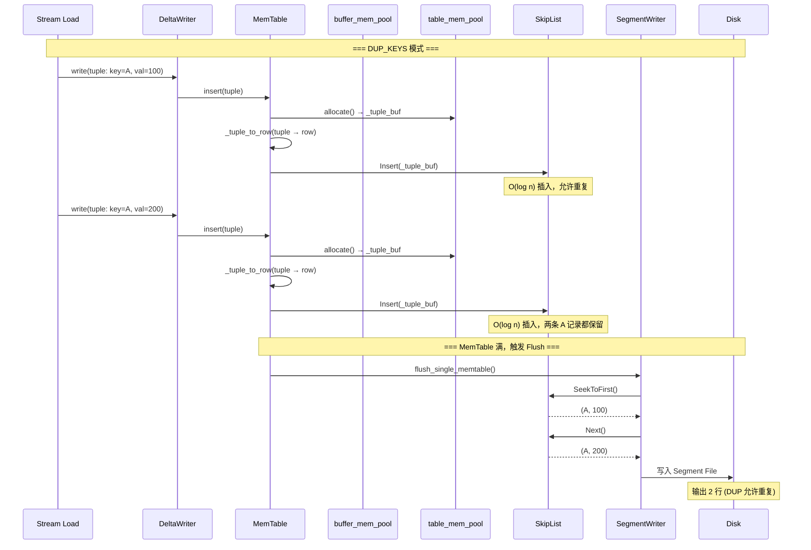
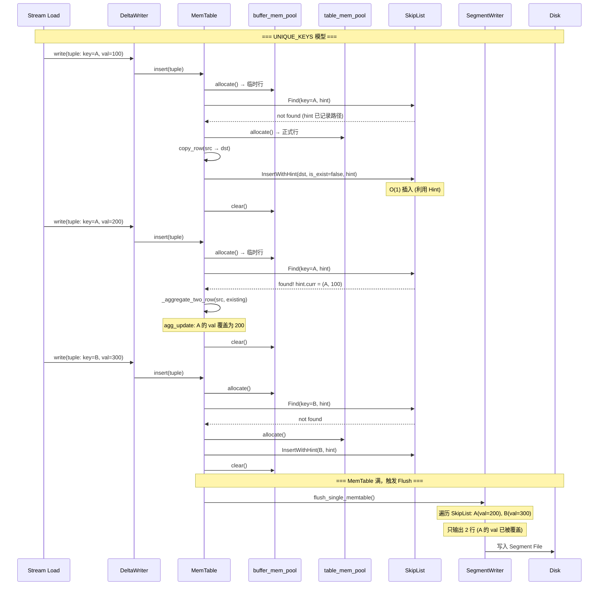

# Apache Doris MemTable 与 SkipList 详解

## 一、它们是什么，分别做什么

**MemTable** 是 Doris 写入路径的**内存缓冲区**，负责暂存正在导入的行数据，满后 Flush 为磁盘上的 Segment 文件。

**SkipList** 是 MemTable 内部的**核心有序索引结构**，以排序键（Sort Key）为序维护所有行，提供 O(log n) 的查找、插入和顺序遍历能力。

```
写入路径:

  Stream Load → DeltaWriter → MemTable → SkipList → Flush → Segment File (.dat)
                               ↑
                               │
                    MemTable 是"容器"
                    SkipList 是"索引引擎"
```

**简单类比**：

| 角色 | 类比 | 说明 |
|------|------|------|
| MemTable | 一个可排序的"暂存区" | 管理内存分配、聚合逻辑、Flush 流程 |
| SkipList | 暂存区内的"有序字典" | 按排序键组织数据，支持去重和有序遍历 |

---

## 二、MemTable 结构

### 2.1 类定义

```cpp
// be/src/olap/memtable.h

class MemTable {
    // SkipList 类型别名
    typedef SkipList<char*, RowComparator> Table;
    typedef Table::key_type TableKey;

    int64_t     _tablet_id;
    Schema*     _schema;            // 表 Schema
    KeysType    _keys_type;         // DUP_KEYS / UNIQUE_KEYS / AGG_KEYS

    std::shared_ptr<RowComparator> _row_comparator;  // 行比较器
    std::shared_ptr<MemTracker>    _mem_tracker;     // 内存追踪

    std::unique_ptr<MemPool> _buffer_mem_pool;  // 临时缓冲池 (待插入行)
    std::unique_ptr<MemPool> _table_mem_pool;   // 正式数据池 (SkipList 中的行)
    ObjectPool _agg_buffer_pool;                // 聚合对象缓冲
    ObjectPool _agg_object_pool;                // 聚合对象所有权池

    Table*      _skip_list;         // 核心: SkipList 实例
    Table::Hint _hint;              // 上次 Find 的位置缓存 (优化连续插入)

    RowsetWriter* _rowset_writer;   // Flush 目标
    int64_t _flush_size = 0;        // Flush 到磁盘的大小
    int64_t _rows = 0;              // 插入的总行数 (含被去重/聚合的)
};
```

### 2.2 双 MemPool 设计

MemTable 使用**两个 MemPool**，这是一个重要的内存管理优化：

```
_buffer_mem_pool (临时缓冲):
  - 每次 insert() 先在这里分配一行
  - 调用 SkipList::Find() 检查 Key 是否存在
  - 如果 Key 不存在 → copy 到 _table_mem_pool → 插入 SkipList
  - 如果 Key 已存在 → 聚合到 SkipList 中的现有行 → 不占用额外空间
  - 每次 insert() 结束后立即 clear() (不释放内存，仅重置)

_table_mem_pool (正式数据):
  - 只存储最终进入 SkipList 的行
  - memory_usage() 只统计此池 → 更准确地反映 MemTable 实际占用
  - 避免因临时行占内存导致提前 Flush，减少 Segment 文件数量
```

**为什么需要双池？** 如果所有行都直接进入 `_table_mem_pool`，那么重复 Key 的临时行会一直占用内存，导致 MemTable 看起来比实际大，触发不必要的 Flush，产生更多的小 Segment 文件。

### 2.3 构造函数

```cpp
// be/src/olap/memtable.cpp:32-54

MemTable::MemTable(..., KeysType keys_type, RowsetWriter* rowset_writer, ...) {
    // 1. 创建行比较器 (按 Sort Key 比较)
    if (tablet_schema->sort_type() == SortType::ZORDER) {
        _row_comparator = std::make_shared<TupleRowZOrderComparator>(...);
    } else {
        _row_comparator = std::make_shared<RowCursorComparator>(...);
    }

    // 2. 创建 SkipList (传入比较器和 can_dup 参数)
    //    DUP_KEYS → can_dup=true  (允许重复)
    //    UNIQUE_KEYS / AGG_KEYS → can_dup=false (不允许重复)
    _skip_list = new Table(_row_comparator.get(), _table_mem_pool.get(),
                           _keys_type == KeysType::DUP_KEYS);
}
```

---

## 三、SkipList 结构

### 3.1 源码来源

Doris 的 SkipList 直接源自 **LevelDB** 的实现（文件头注释 `Copyright (c) 2011 The LevelDB Authors`），并做了两处关键修改：

1. 新增 `can_dup` 参数控制是否允许重复 Key
2. 新增 `Find()` + `InsertWithHint()` 两步 API，避免重复查找

### 3.2 核心参数

```cpp
// be/src/olap/skiplist.h

template <typename Key, class Comparator>
class SkipList {
    static constexpr int kMaxHeight = 12;        // 最大层数
    static constexpr unsigned int kBranching = 4; // 分支因子 (1/4 概率晋升)

    Comparator* const compare_;   // 行比较器 (RowCursorComparator)
    bool _can_dup;                // 是否允许重复 Key
    MemPool* const _mem_pool;     // 节点内存分配器
    Node* const head_;            // 哨兵头节点 (高度 = kMaxHeight)
    std::atomic<int> max_height_; // 当前最大高度
    Random rnd_;                  // 随机数生成器 (种子: 0xdeadbeef)
};
```

### 3.3 节点结构

```cpp
struct Node {
    Key const key;                    // 指向行数据的指针 (char*)
    std::atomic<Node*> next_[1];      // 柔性数组，每层一个 next 指针

    // 内存布局: [Node header] [next_0] [next_1] ... [next_{height-1}]
    // 节点大小取决于随机高度，通过 NewNode() 在 MemPool 中分配
};
```

### 3.4 随机高度生成

```cpp
int RandomHeight() {
    int height = 1;
    while (height < kMaxHeight && ((rnd_.Next() % kBranching) == 0)) {
        height++;
    }
    return height;
}
```

- 每一层有 1/4 的概率晋升
- 期望高度 ≈ 1.33（O(log n) 查找性能的基础）
- 最大高度 = 12，理论上支持 ~16M 个节点

### 3.5 内存序保证

```cpp
// 写操作使用 release store
void SetNext(int n, Node* x) {
    next_[n].store(x, std::memory_order_release);
}

// 读操作使用 acquire load
Node* Next(int n) {
    return next_[n].load(std::memory_order_acquire);
}
```

- 写入时通过 `release store` 发布新节点
- 读取时通过 `acquire load` 获取已完全初始化的节点
- 保证无锁读安全（写操作需要外部加锁）

### 3.6 Hint 机制 (Find + InsertWithHint)

这是 Doris 在 LevelDB SkipList 上的关键增强，专为 MemTable 的 "先查后插" 模式优化：

```cpp
struct Hint {
    Node* curr;                // 查找结果: 找到的节点 (或应插入位置)
    Node* prev[kMaxHeight];    // 每一层的前驱节点 (用于直接插入)
};

// 第一步: 查找，同时记录路径信息
bool Find(const Key& key, Hint* hint) const {
    Node* x = FindGreaterOrEqual(key, hint->prev);  // O(log n)，记录所有层级的前驱
    hint->curr = x;
    return (x != nullptr && Equal(key, x->key));
}

// 第二步: 利用 Hint 直接插入，无需重新查找
void InsertWithHint(const Key& key, bool is_exist, Hint* hint) {
    if (!_can_dup && is_exist) return;  // 重复 Key，不插入

    int height = RandomHeight();
    Node* x = NewNode(key, height);
    Node** prev = hint->prev;           // 直接使用 Find 记录的 prev 数组
    for (int i = 0; i < height; i++) {
        x->NoBarrier_SetNext(i, prev[i]->NoBarrier_Next(i));
        prev[i]->SetNext(i, x);         // release store
    }
}
```

**性能收益**：连续插入时，`Find` 已经 O(log n) 地找到了插入位置，`InsertWithHint` 直接利用结果 O(1) 插入。如果没有 Hint 机制，每次插入都需要单独做一次 O(log n) 查找。

---

## 四、MemTable::insert() — 核心写入流程

### 4.1 三种数据模型的处理差异

```cpp
void MemTable::insert(const Tuple* tuple) {
    _rows++;
    bool overwritten = false;
    uint8_t* _tuple_buf = nullptr;

    // ============ DUP_KEYS: 直接插入，不做去重 ============
    if (_keys_type == KeysType::DUP_KEYS) {
        _tuple_buf = _table_mem_pool->allocate(_schema_size);
        ContiguousRow row(_schema, _tuple_buf);
        _tuple_to_row(tuple, &row, _table_mem_pool.get());
        _skip_list->Insert((TableKey)_tuple_buf, &overwritten);
        DCHECK(!overwritten);
        return;
    }

    // ============ UNIQUE_KEYS / AGG_KEYS: 先查后插 ============
    // Step 1: 在临时缓冲区分配一行
    _tuple_buf = _buffer_mem_pool->allocate(_schema_size);
    ContiguousRow src_row(_schema, _tuple_buf);
    _tuple_to_row(tuple, &src_row, _buffer_mem_pool.get());

    // Step 2: 查找 Key 是否已存在
    bool is_exist = _skip_list->Find((TableKey)_tuple_buf, &_hint);

    if (is_exist) {
        // Step 3a: Key 已存在 → 聚合/覆盖
        _aggregate_two_row(src_row, _hint.curr->key);
    } else {
        // Step 3b: Key 不存在 → 拷贝到正式池并插入
        _tuple_buf = _table_mem_pool->allocate(_schema_size);
        ContiguousRow dst_row(_schema, _tuple_buf);
        copy_row_in_memtable(&dst_row, src_row, _table_mem_pool.get());
        _skip_list->InsertWithHint((TableKey)_tuple_buf, is_exist, &_hint);
    }

    // Step 4: 清理临时缓冲 (不释放内存，仅重置偏移)
    _buffer_mem_pool->clear();
    _agg_buffer_pool.clear();
}
```

### 4.2 流程对比图

```
DUP_KEYS 模型:
  tuple → _table_mem_pool 分配 → _tuple_to_row() → SkipList::Insert()
                                                     ↑
                                              直接插入，O(log n)

UNIQUE_KEYS / AGG_KEYS 模型:
  tuple → _buffer_mem_pool 分配 → _tuple_to_row()
                                      ↓
                              SkipList::Find(key, &hint)  ← O(log n)
                                   ↓              ↓
                              Key 存在          Key 不存在
                                 ↓                  ↓
                          _aggregate_two_row()   copy → _table_mem_pool
                          (覆盖/聚合值列)        → InsertWithHint() ← O(1)
                                                   (利用 Hint 路径)
```

### 4.3 聚合逻辑

```cpp
void MemTable::_aggregate_two_row(const ContiguousRow& src_row, TableKey row_in_skiplist) {
    ContiguousRow dst_row(_schema, row_in_skiplist);
    if (_tablet_schema->has_sequence_col()) {
        // 有 Sequence 列: 比较 sequence 值，仅当新值 >= 旧值时更新
        agg_update_row_with_sequence(&dst_row, src_row,
                                     _tablet_schema->sequence_col_idx(), ...);
    } else {
        // 无 Sequence 列: 直接覆盖 (Last-Write-Wins)
        agg_update_row(&dst_row, src_row, ...);
    }
}
```

- **UNIQUE_KEYS**：`agg_update` 对每个 value 列执行覆盖操作（REPLACE 语义）
- **AGG_KEYS**：`agg_update` 对每个 value 列按聚合函数执行（SUM / MAX / MIN / REPLACE）
- **Sequence 列**：如果存在，先比较 sequence 值决定是否更新

---

## 五、MemTable::flush() — 刷盘流程

```cpp
OLAPStatus MemTable::flush() {
    // 优先使用 rowset_writer 的批量 flush 接口
    OLAPStatus st = _rowset_writer->flush_single_memtable(this, &_flush_size);

    if (st == OLAP_ERR_FUNC_NOT_IMPLEMENTED) {
        // Alpha Rowset 回退路径: 逐行遍历 SkipList
        Table::Iterator it(_skip_list);
        for (it.SeekToFirst(); it.Valid(); it.Next()) {
            char* row = (char*)it.key();
            ContiguousRow dst_row(_schema, row);
            agg_finalize_row(&dst_row, _table_mem_pool.get());  // 完成聚合状态
            RETURN_NOT_OK(_rowset_writer->add_row(dst_row));
        }
        RETURN_NOT_OK(_rowset_writer->flush());
    }
    return OLAP_SUCCESS;
}
```

**Flush 流程**：

```
MemTable::flush()
    │
    ├── flush_single_memtable() (Beta Rowset, 推荐)
    │     将 SkipList 数据批量写入 SegmentWriter
    │     跳过中间态，直接编码 + 压缩
    │
    └── 逐行遍历 SkipList (Alpha Rowset, 回退)
          SeekToFirst → agg_finalize_row → add_row → flush
          利用 SkipList 的有序性，输出已排序的行
```

---

## 六、MemTable::Iterator — 有序遍历

```cpp
class Iterator {
    Table::Iterator _it;  // SkipList 的迭代器

    void seek_to_first() { _it.SeekToFirst(); }
    bool valid()          { return _it.Valid(); }
    void next()           { _it.Next(); }       // 沿第 0 层 next 指针顺序遍历
    ContiguousRow get_current_row() {
        char* row = (char*)_it.key();
        agg_finalize_row(...);  // 完成聚合状态
        return row;
    }
};
```

SkipList 保证遍历顺序与**排序键一致**，因此 Flush 输出的 Segment 文件中行也是有序的。

---

## 七、SkipList 中的 Key 是什么

SkipList 的 Key 是 `char*`，实际指向 MemPool 中的一行数据的内存首地址。排序依据不是指针值，而是 `RowCursorComparator`：

```cpp
int RowCursorComparator::operator()(const char* left, const char* right) const {
    ContiguousRow lhs_row(_schema, left);   // left 指向行数据
    ContiguousRow rhs_row(_schema, right);   // right 指向行数据
    return compare_row(lhs_row, rhs_row);    // 按 Sort Key 逐列比较
}
```

**Sort Key 的组成**（默认按建表时的 `ORDER BY` 指定）：
- UNIQUE_KEYS：排序键 = 所有 Key 列
- AGG_KEYS：排序键 = 所有 Key 列
- DUP_KEYS：排序键 = 所有 Key 列（如果有）+ 所有 Value 列（保证排序确定性）

如果建表时指定了 `ZORDER`，则使用 `TupleRowZOrderComparator`，按多维空间曲线排序。

---

## 八、时序流程图

### 8.1 完整的写入 + Flush 流程





---

## 九、性能特性总结

| 特性 | MemTable | SkipList |
|------|----------|----------|
| **核心作用** | 内存缓冲 + 聚合逻辑 | 有序索引 + 去重 |
| **查找复杂度** | — | O(log n) |
| **插入复杂度** | — | O(log n) 查找 + O(1) 插入 (Hint) |
| **遍历** | 通过 SkipList Iterator | 沿第 0 层 O(n) 顺序遍历 |
| **内存分配** | 双 MemPool (buffer + table) | 每个节点通过 MemPool 分配 |
| **线程安全** | 需外部同步 (DeltaWriter 加锁) | 写需外部锁，读无锁 (acquire/release) |
| **来源** | Doris 自研 | LevelDB SkipList 改造 |
| **最大层数** | — | 12 层 (支持 ~16M 节点) |
| **分支因子** | — | 4 (1/4 概率晋升) |
| **去重能力** | 通过 SkipList 的 can_dup 参数 | can_dup=false 时拒绝重复 Key |
| **聚合能力** | 调用 _aggregate_two_row() | 仅提供 Find/Insert 接口 |

---

## 十、关键设计决策

### 10.1 为什么选择 SkipList 而不是 Hash Table / B-Tree

| 维度 | SkipList | Hash Table | B-Tree |
|------|----------|------------|--------|
| **有序遍历** | O(n) 天然支持 | 不支持 | O(n) 支持 |
| **范围查询** | 支持 (Seek) | 不支持 | 支持 |
| **去重插入** | O(log n) + Hint O(1) | O(1) | O(log n) |
| **实现复杂度** | 低 (LevelDB 成熟实现) | 低 | 高 |
| **内存开销** | 每节点 ~1.33 个指针 | 额外负载因子 | 每节点多子节点 |
| **Flush 需求** | 需要有序输出 → SkipList 天然满足 | 需要额外排序 | 天然满足 |

Doris 选择 SkipList 的核心原因：**Flush 时需要按 Sort Key 有序输出到 Segment 文件**，SkipList 天然是有序结构，且实现简单、内存开销可控。

### 10.2 为什么不用平衡树 (红黑树 / B-Tree)

- SkipList 基于概率平衡，实现远比红黑树简单
- LevelDB 的 SkipList 已经在工业界大规模验证
- 内存分配更友好（一次性分配，柔性数组）
- 无旋转操作，插入/删除路径可预测

### 10.3 Hint 优化的价值

```
无 Hint:  每次 insert = Find O(log n) + Insert O(log n) = O(log n) × 2
有 Hint:  每次 insert = Find O(log n) + InsertWithHint O(1) = O(log n) × 1

对于 MemTable 中大量数据的连续插入，Hint 减少了约 50% 的比较操作。
```

---