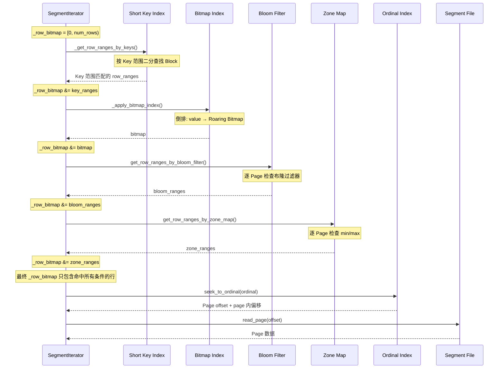

# Apache Doris 索引体系详解

## 一、索引总览

Doris 共有 **5 种索引**（不含 Inverted Index），分为 Segment 级和 Column 级两类：

```
索引层级:
┌─────────────────────────────────────────────────────────┐
│ Segment 级索引                                         │
│   Short Key Index — 按 Block (1024行) 粒度的前缀索引    │
├─────────────────────────────────────────────────────────┤
│ Column 级索引 (每列独立)                                │
│   Ordinal Index   — 行号 → Page 偏移 (基础设施)         │
│   Zone Map Index  — Page 级 min/max 统计                │
│   Bloom Filter    — Page 级布隆过滤器                   │
│   Bitmap Index    — 值 → Roaring Bitmap (倒排索引)      │
└─────────────────────────────────────────────────────────┘
```

---

## 二、五种索引对比

| 索引 | 作用 | 粒度 | 查询谓词 | 自动创建 | 配置方式 |
|------|------|------|---------|---------|---------|
| **Short Key** | 快速定位 Key 范围对应的 Block | Block (1024行) | 等值/范围 (Key列) | 是 | 自动 |
| **Ordinal** | 行号 → Page 物理偏移映射 | Page | — (内部基础设施) | 是 | 自动 |
| **Zone Map** | min/max 统计过滤 Page | Page + Segment | 等值/范围/比较 | 是 (大部分列) | 自动 |
| **Bloom Filter** | 概率性排除不含某值的 Page | Page | 等值/IN | 否 | `bloom_filter_columns` |
| **Bitmap** | 低基数字典 + 行号位图 | Segment | 等值/IN/NOT | 否 | `CREATE INDEX USING BITMAP` |

---

## 三、查询时的索引使用顺序



**过滤顺序**：Short Key → Bitmap → Bloom Filter → Zone Map，逐步收窄候选行集合。

---

## 四、Short Key Index（短键索引）

### 4.1 概念

Segment 级的**前缀索引**，将 Segment 按 Block（默认 1024 行）划分，每个 Block 记录第一行的 Sort Key 前缀。用于快速定位 Key 范围对应的 Block 范围。

### 4.2 结构

```
Segment (10000 行, num_rows_per_block=1024):
┌─────────────────────────────────────────────────────────┐
│ Block 0  (rows 0~1023)     Short Key: (A, 100, "Beijing") │
│ Block 1  (rows 1024~2047)  Short Key: (B, 200, "Shanghai")│
│ Block 2  (rows 2048~3071)  Short Key: (C, 300, "Guangzhou")│
│ Block 3  (rows 3072~4095)  Short Key: (D, 400, "Shenzhen") │
│ ...                                                        │
│ Block 9  (rows 9216~9999)  Short Key: (J, 900, "Chengdu")  │
└─────────────────────────────────────────────────────────┘
```

### 4.3 编码方式

每个 Short Key 使用 **Marker Byte 编码**，每列值前缀一个标记字节：

| Marker | 值 | 含义 |
|--------|-----|------|
| `0x00` | KEY_MINIMAL_MARKER | 最小值填充（用于 range scan 的下界） |
| `0x01` | KEY_NULL_FIRST_MARKER | NULL，排在最前 |
| `0x02` | KEY_NORMAL_MARKER + content | 正常值 |
| `0xFE` | KEY_NULL_LAST_MARKER | NULL，排在最后 |
| `0xFF` | KEY_MAXIMAL_MARKER | 最大值填充（用于 range scan 的上界） |

### 4.4 使用方式

```
查询: WHERE key_col BETWEEN 'B' AND 'D'

Step 1: 二分查找 Short Key Index
  lower_bound('B') → Block 1 (B ≤ B 的 Short Key)
  upper_bound('D') → Block 4 (D 的后一个 Block)

Step 2: 缩小范围到 rows 1024~4095

Step 3: 在缩小范围内逐行精确查找
  _seek_and_peek() → 找到精确的行号
```

### 4.5 关键参数

| 参数 | 默认值 | 说明 |
|------|-------|------|
| `num_rows_per_block` | 1024 | 每个 Block 的行数 |
| `num_short_key_columns` | 自动计算 | Sort Key 前缀列数（受最大字节限制） |

---

## 五、Ordinal Index（序号索引）

### 5.1 概念

每列的**行号 → Page 偏移**映射。所有其他索引（Zone Map、Bloom Filter）都需要 Ordinal Index 将 Page 级结果转换为行号范围。这是最基础的索引，**每列必有**。

### 5.2 结构

```
Column 0 的 Ordinal Index:
  Page 0: ordinal [0, 1023]       → offset=0, size=64KB
  Page 1: ordinal [1024, 2047]    → offset=65536, size=64KB
  Page 2: ordinal [2048, 3071]    → offset=131072, size=64KB
  ...

磁盘格式: IndexPage (二分查找)
  [ordinal_0: 0]     [offset_0: 0]     [size_0: 65536]
  [ordinal_1: 1024]  [offset_1: 65536] [size_1: 65536]
  ...
```

### 5.3 单页优化

如果列只有**一个** Data Page，Ordinal Index 不写入独立页面，而是将 PagePointer 直接存储在 `OrdinalIndexPB.root_page` 中，设 `is_root_data_page=true`，避免额外 I/O。

### 5.4 使用场景

- `FileColumnIterator::seek_to_ordinal()` → 找到目标行所在的 Page
- `ColumnReader::_calculate_row_ranges()` → Page 索引转行号范围
- Bloom Filter / Zone Map 的 Page 结果转行号

---

## 六、Zone Map Index（区域索引）

### 6.1 概念

每列的 **Page 级 min/max/null 统计**，外加一个 Segment 级汇总。用于**范围谓词下推**，快速排除不满足条件的 Page。

### 6.2 数据结构

```
Column "amount" (DECIMAL):

  Segment Zone Map:  min=10.00, max=99999.99, has_null=true

  Page 0 Zone Map:   min=10.00,   max=5000.00,  has_null=false
  Page 1 Zone Map:   min=500.00,  max=12000.00, has_null=true
  Page 2 Zone Map:   min=1000.00, max=99999.99, has_null=false
  Page 3 Zone Map:   min=50.00,   max=8000.00,  has_null=true
```

### 6.3 两级过滤

```
查询: WHERE amount > 50000

Step 1: Segment 级过滤 (零 I/O)
  Segment min=10.00, max=99999.99
  50000 在 [10.00, 99999.99] 范围内 → 不排除，继续

Step 2: Page 级过滤
  Page 0: [10.00, 5000.00]     → 50000 > 5000.00? 排除 ✓
  Page 1: [500.00, 12000.00]   → 50000 > 12000.00? 排除 ✓
  Page 2: [1000.00, 99999.99]  → 50000 在范围内 → 保留
  Page 3: [50.00, 8000.00]     → 50000 > 8000.00? 排除 ✓

结果: 只需读取 Page 2
```

### 6.4 自动创建规则

| 数据模型 | 自动创建 Zone Map 的列 |
|---------|----------------------|
| DUP_KEYS | **所有列** |
| UNIQUE_KEYS | **所有列** |
| AGG_KEYS | **仅 Key 列** |

### 6.5 特殊处理

- **行数过少的 Page**（< `zone_map_row_num_threshold`）：设 `pass_all=true`，跳过过滤（避免误排除）
- **Delete 条件**：通过 `del_eval()` 单独评估

---

## 七、Bloom Filter Index（布隆过滤器索引）

### 7.1 概念

每列的 **Page 级布隆过滤器**，包含该 Page 内所有不同值的摘要。用于**等值/IN 谓词**快速排除不含目标值的 Page。

### 7.2 算法

**BlockSplitBloomFilter**（Putze et al.）：

```
结构:
  ┌──────┬──────┬──────┬──────┬ ... ┬──────┐
  │Block0│Block1│Block2│Block3│     │BlockN│  每个 Block 32 字节 (一个 Cache Line)
  │32B   │32B   │32B   │32B   │     │32B   │
  └──────┴──────┴──────┴──────┴ ... ┴──────┘

每个 Block 设置 8 个 bit:
  hash = MurmurHash3_x64_64(value)
  block_idx = hash / 512
  bit_idx = (hash * SALT[i]) >> 27  (i = 0..7)
  block[block_idx] |= (1 << bit_idx)

大小计算:
  optimal_bits = -n * ln(fpp) / (ln(2)^2)，向上取整到 2 的幂
  最小 32 字节，最大 128 MB
```

### 7.3 构建方式

```
写入 Page 时:
  1. 用 std::set<CppType> 收集 Page 内所有不同值
  2. Page 满 → 创建 BlockSplitBloomFilter(n_distinct_values, fpp=0.05)
  3. 对每个不同值执行 bf->add_bytes()
  4. 序列化为 LZ4F 压缩的 IndexedColumn

额外: 末尾追加 1 字节 _has_null 标志
```

### 7.4 查询使用

```
查询: WHERE user_id = 12345

  对每个 Page:
    1. 读取该 Page 的 Bloom Filter
    2. bf->test_bytes(value)
    3. 返回 false → 该 Page 一定不含 user_id=12345 → 排除
    4. 返回 true  → 该 Page 可能含 → 保留（可能误判）
```

### 7.5 支持的数据类型

| 支持的 | 不支持的 |
|--------|---------|
| SMALLINT, INT, UNSIGNED_INT | TINYINT |
| BIGINT, LARGEINT | FLOAT, DOUBLE |
| CHAR, VARCHAR, STRING | HLL, ARRAY |
| DATE, DATETIME, DECIMAL | |

### 7.6 配置

```sql
CREATE TABLE t1 (
    user_id INT,
    ...
) PROPERTIES (
    "bloom_filter_columns" = "user_id,order_id",  -- 指定需要布隆过滤器的列
    "bloom_filter_fpp" = "0.01"                    -- 可选，默认 0.05 (5%)
);
```

FPP 范围：0.0001 ~ 0.05，越小误判率越低但内存越大。

---

## 八、Bitmap Index（位图索引）

### 8.1 概念

每列的**倒排索引**：每个唯一值对应一个 Roaring Bitmap，记录该值出现的所有行号。适合**低基数字典列**的等值/IN 查询。

### 8.2 结构

```
Column "city" (CHAR):

  Dictionary Column:    Bitmap Column:
  ┌─────────┬──────┐   ┌─────────────────────────────────┐
  │ ordinal │ value│   │ ordinal │ Roaring Bitmap         │
  ├─────────┼──────┤   ├─────────┼─────────────────────────┤
  │ 0       │北京  │   │ 0       │ [0, 3, 7, 12, 25, ...]   │
  │ 1       │上海  │   │ 1       │ [1, 5, 9, 18, ...]       │
  │ 2       │广州  │   │ 2       │ [2, 6, 10, 15, ...]      │
  │ 3       │深圳  │   │ 3       │ [4, 8, 11, 20, ...]      │
  └─────────┴──────┘   ├─────────┼─────────────────────────┤
                      │ 4       │ NULL: [13, 17, 22, ...]   │
  二分查找值 → ordinal │         │ (null bitmap, 可选)       │
  通过 ordinal 读 bitmap│         │                          │
                      └─────────┴─────────────────────────┘
```

### 8.3 构建方式

```
写入时:
  std::map<CppType, roaring::Roaring> _bitmap;

  add_value(row_id=0, "北京"):  _bitmap["北京"] |= {0}
  add_value(row_id=1, "上海"):  _bitmap["上海"] |= {1}
  add_value(row_id=2, "北京"):  _bitmap["北京"] |= {2}
  ...

finish():
  1. 写 Dictionary Column (LZ4F 压缩 + Ordinal Index)
  2. 写 Bitmap Column (无压缩 + Ordinal Index)
     每个 Bitmap 先 runOptimize() 压缩连续区间
  3. 追加 Null Bitmap (如有 NULL)
```

### 8.4 查询使用

```
查询: WHERE city = '北京' OR city = '上海'

Step 1: 查字典
  seek_dictionary("北京") → ordinal=0, exact=true
  seek_dictionary("上海") → ordinal=1, exact=true

Step 2: 读 Bitmap
  read_bitmap(0) → [0, 2, 5, 7, 12, ...]
  read_bitmap(1) → [1, 5, 9, 18, ...]

Step 3: 合并
  result = bitmap0 | bitmap1 (OR 操作)
  _row_bitmap &= result

优势: 只读 Dictionary + 两个 Bitmap，无需读取任何 Data Page
```

### 8.5 支持的数据类型

| 类型 | 支持 |
|------|------|
| TINYINT, SMALLINT, INT, UNSIGNED_INT, BIGINT, LARGEINT | ✓ |
| CHAR, VARCHAR, STRING | ✓ |
| DATE, DATETIME | ✓ |
| DECIMAL | ✓ |
| BOOL | ✓ |
| FLOAT, DOUBLE, HLL, ARRAY | ✗ |

### 8.6 创建方式

```sql
-- 显式创建
CREATE INDEX idx_city ON t1 (city) USING BITMAP COMMENT 'city bitmap index';

-- 查看索引
SHOW INDEX FROM t1;

-- 删除索引
DROP INDEX idx_city ON t1;
```

**限制**：
- 仅支持单列
- AGG_KEYS 表仅支持 Key 列
- BITMAP 索引是在后续的 Compaction / 数据写入时异步构建的

---

## 九、索引在 Segment 文件中的存储位置

```
+================================================================+
|                    SEGMENT FILE (.dat)                            |
+================================================================+
|                                                                  |
|  DATA SECTION                                                    |
|    Col0: [DataPage0][DataPage1]...[DictPage]                    │
|    Col1: [DataPage0][DataPage1]...                              │
|    ...                                                          |
|                                                                  |
|  INDEX SECTION (按列写入)                                        │
|    Col0: [OrdinalIndexPage]      ← 必有                         │
|    Col1: [OrdinalIndexPage]                                     │
|    ...                                                          |
|    Col0: [ZoneMapIndexPage]       ← 自动 (Key列/非AGG)          │
|    Col1: [ZoneMapIndexPage]                                     │
|    ...                                                          |
|    Col0: [BitmapIndexPage]        ← CREATE INDEX USING BITMAP    │
|    ColN: [BitmapIndexPage]                                     │
|    ...                                                          |
|    Col0: [BloomFilterIndexPage]   ← bloom_filter_columns 配置   │
|    ColM: [BloomFilterIndexPage]                                  │
|    ...                                                          |
|                                                                  |
|  [ShortKeyIndexPage]             ← Segment 级，必有              │
|                                                                  |
|  [SegmentFooterPB][FooterSize][CRC32C]["D0R1"]                   │
+================================================================+
```

SegmentFooterPB 中的索引元数据：

```protobuf
ColumnMetaPB {
    indexes: [                          // 每列的索引列表
        { type: ORDINAL_INDEX, ordinal_index: {...} },
        { type: ZONE_MAP_INDEX, zone_map_index: {...} },       // 可选
        { type: BITMAP_INDEX, bitmap_index: {...} },          // 可选
        { type: BLOOM_FILTER_INDEX, bloom_filter_index: {...} }, // 可选
    ]
}

SegmentFooterPB {
    columns: [...],                     // 每列元数据 (含索引列表)
    short_key_index_page: { offset, size },  // 短键索引位置
}
```

---

## 十、索引选择策略

### 10.1 不同谓词类型适用的索引

| 谓词类型 | Short Key | Bitmap | Bloom Filter | Zone Map |
|---------|-----------|--------|-------------|----------|
| `key = 'A'` | ✓ | ✓ | ✓ | ✓ |
| `key IN ('A','B')` | ✗ | ✓ | ✓ | ✓ (多次) |
| `key > 100` | ✓ | ✗ | ✗ | ✓ |
| `key BETWEEN 1 AND 100` | ✓ | ✗ | ✗ | ✓ |
| `val = 'X'` | ✗ (非Key) | ✓ | ✓ | ✓ |
| `val IS NULL` | ✗ | ✓ | ✗ | ✓ (has_null) |
| `val LIKE 'prefix%'` | ✗ | ✗ | ✗ | ✗ |

### 10.2 基数与索引选择

| 基数 (不同值数量) | 推荐索引 | 原因 |
|------------------|---------|------|
| 极低 (< 100) | Bitmap Index | Bitmap 紧凑，扫描快 |
| 低 (100 ~ 10K) | Bitmap / Bloom Filter | 都有效 |
| 中 (10K ~ 100K) | Bloom Filter | Bitmap 内存膨胀 |
| 高 (> 100K) | Zone Map / Bloom Filter | Bitmap 不适合 |
| 极高 (接近行数) | Zone Map | Bloom Filter 误判率高 |

### 10.3 索引的空间开销

| 索引 | 空间开销 | 说明 |
|------|---------|------|
| Short Key | 极小 | ~10 bytes × (num_rows / 1024) |
| Ordinal | 极小 | ~16 bytes × num_pages |
| Zone Map | 小 | ~20 bytes × (num_pages + 1) |
| Bloom Filter | 中 | 按 FPP 计算，约 10 bits/entry × distinct_values_per_page |
| Bitmap | 可能大 | 字典 + 每个 distinct value 一个 Roaring Bitmap |

---

## 十一、总结

| 索引 | 核心价值 | 适用场景 |
|------|---------|---------|
| **Short Key** | 快速定位 Key 范围 | 点查/范围查 (Key 列) |
| **Ordinal** | 行号到 Page 的映射 | 所有查询的基础设施 |
| **Zone Map** | 零 I/O 过滤不匹配 Page | 范围过滤，Segment 级快速排除 |
| **Bloom Filter** | 概率性排除不含目标值的 Page | 等值/IN 查询，高基数字典列 |
| **Bitmap** | 值到行号的精确倒排映射 | 等值/IN/NOT 查询，低基数字典列 |

**查询优化路径**：Short Key 定位 Block → Bitmap 精确匹配 → Bloom Filter 概率过滤 → Zone Map 范围过滤 → 最终只读取必要的 Data Page，最大限度减少 I/O。

---