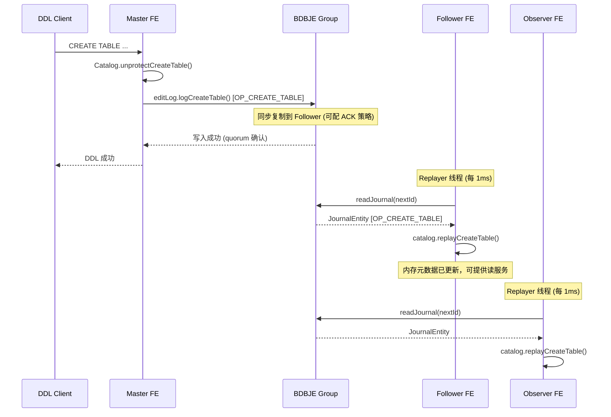
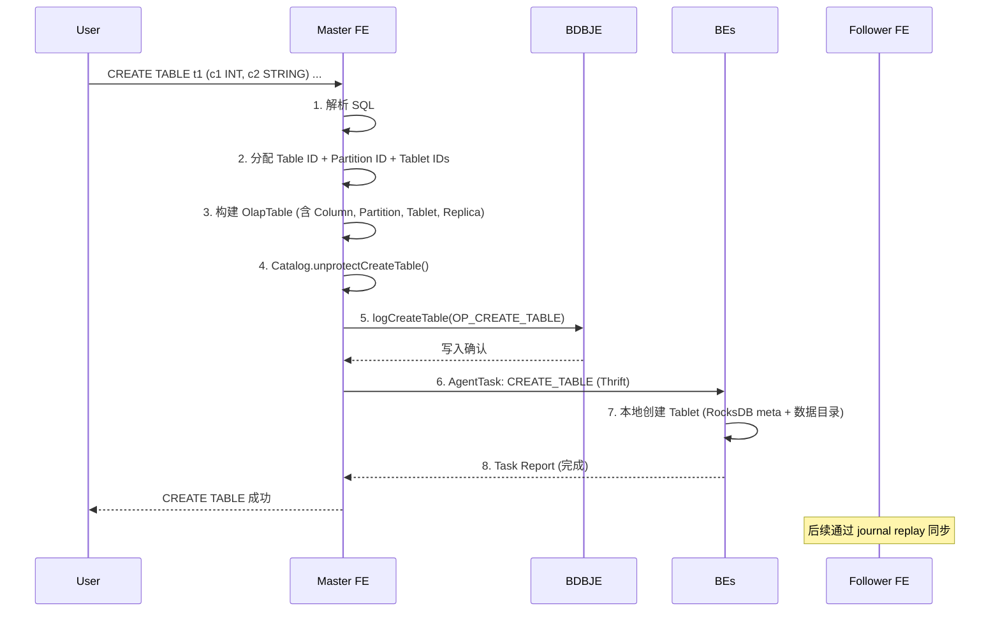
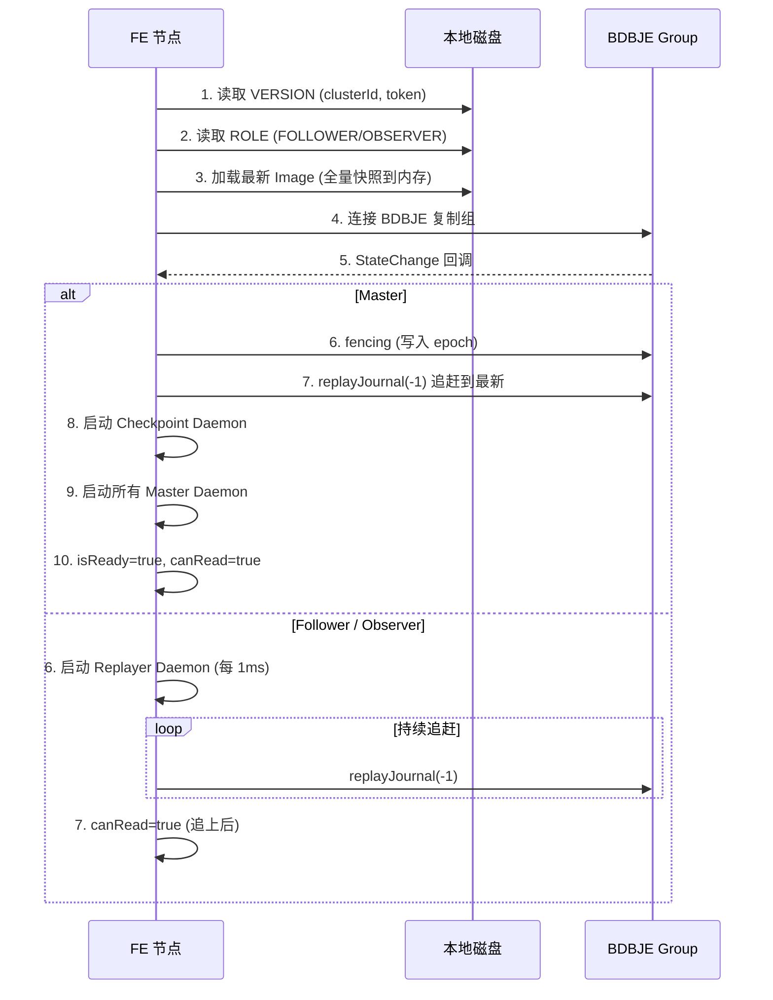
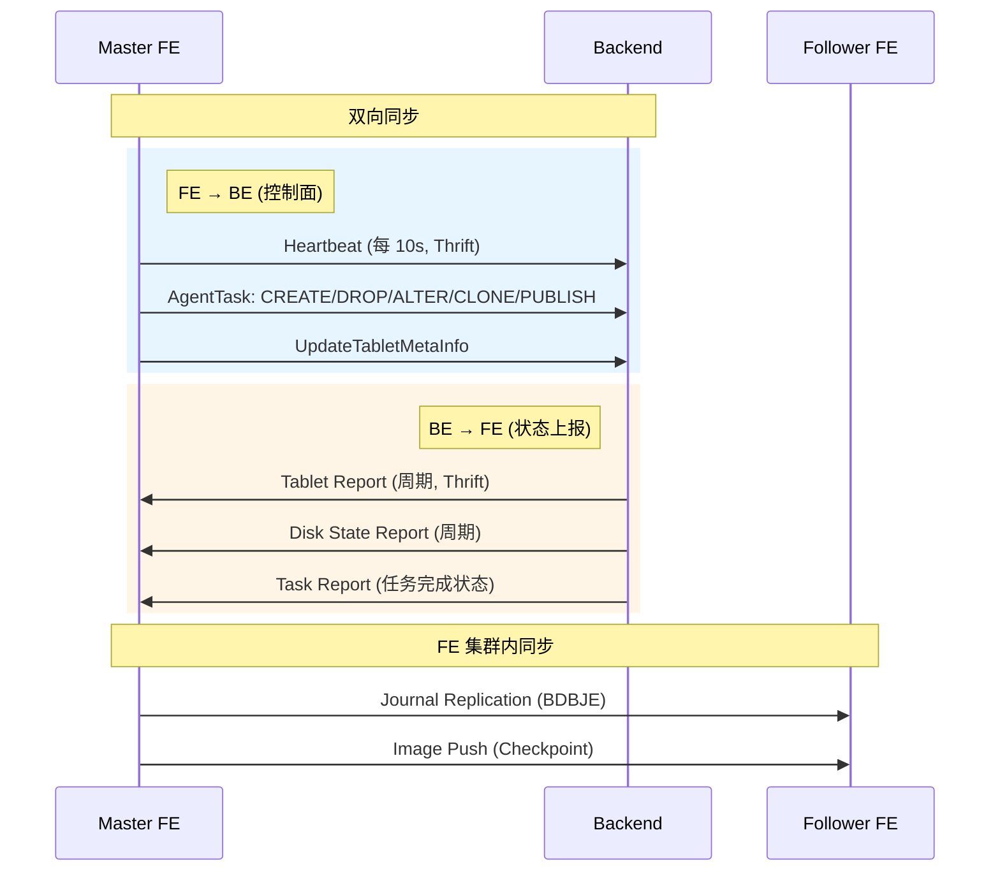
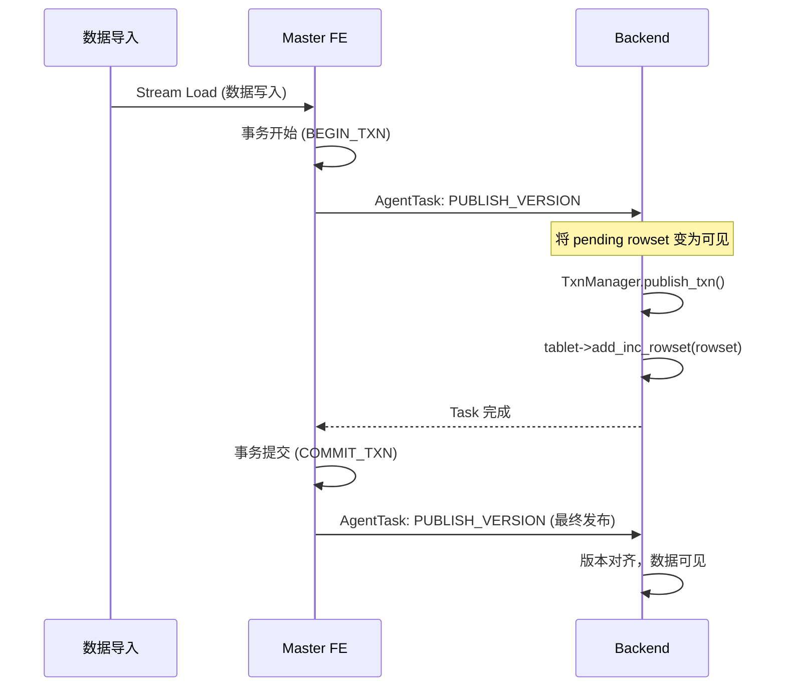
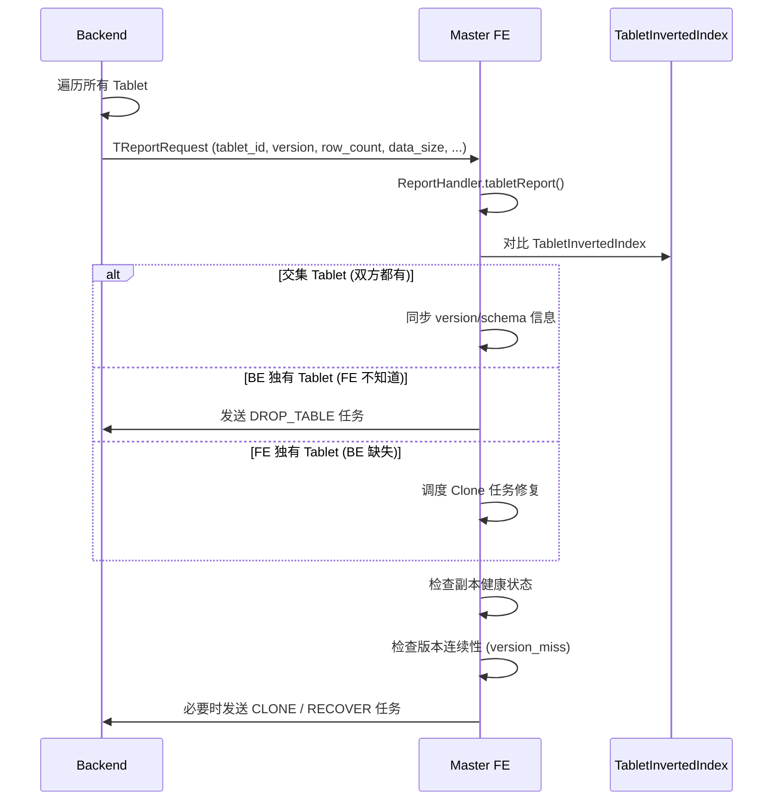
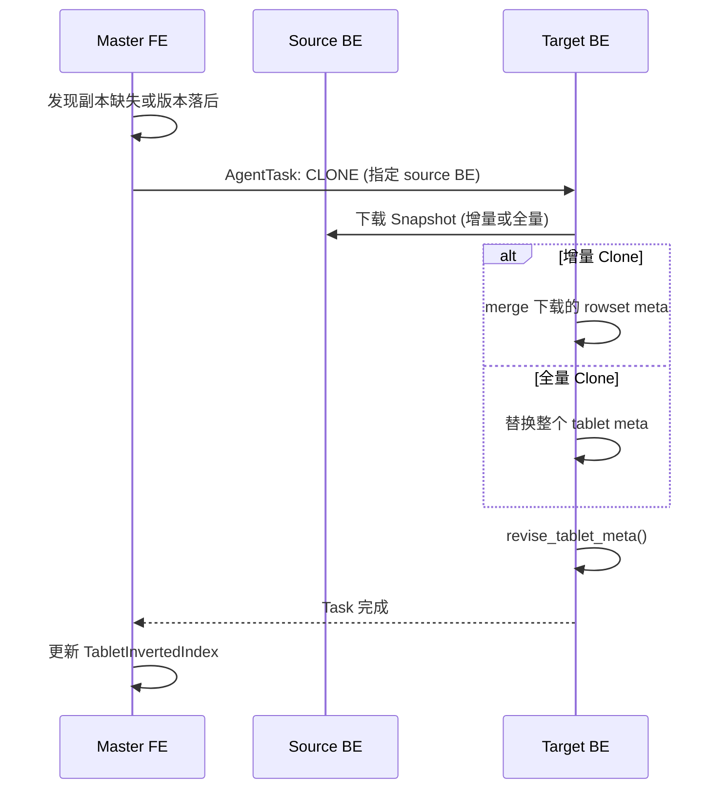

# Apache Doris 元数据管理策略

## 一、元数据架构总览

Doris 采用**FE 集中管理 + BE 本地存储**的元数据架构。FE 是元数据的唯一权威来源，BE 仅存储本地副本的元数据。两者通过心跳和 Task RPC 进行同步。

```
┌───────────────────────────────────────────────────────────────────────┐
│                         元数据全景                                     │
│                                                                       │
│  ┌─────────────────────────────────────────────────────────────┐     │
│  │                    FE (Frontend)                             │     │
│  │                                                              │     │
│  │  内存: Catalog → Database → OlapTable → Partition →          │     │
│  │        MaterializedIndex → Tablet → Replica                   │     │
│  │                                                              │     │
│  │  持久化: BDBJE (WAL) + Image (快照)                          │     │
│  │  角色: Master (唯一写入) / Follower (可选举) / Observer (只读) │     │
│  └──────────────────────┬──────────────────────────────────────┘     │
│                         │                                            │
│         心跳(10s) ──────┤─────── Agent Tasks ────── 报告             │
│                         │                                            │
│  ┌──────────────────────▼──────────────────────────────────────┐     │
│  │                    BE (Backend)                             │     │
│  │                                                              │     │
│  │  内存: Tablet → TabletMeta → RowsetMeta                     │     │
│  │  持久化: RocksDB (tablet meta + rowset meta)                 │     │
│  │  文件: Segment [data pages][index pages][footer]             │     │
│  └──────────────────────────────────────────────────────────────┘     │
└───────────────────────────────────────────────────────────────────────┘
```

---

## 二、FE 元数据管理

### 2.1 内存元数据层级

```
Catalog (全局单例)
├── idToDb: ConcurrentHashMap<Long, Database>
│   └── Database
│       ├── id, fullQualifiedName
│       ├── idToTable: Map<Long, Table>
│       └── nameToTable: Map<String, Table>
│           └── OlapTable (extends Table)
│               ├── id, name, type, fullSchema (List<Column>)
│               ├── indexIdToMeta: Map<Long, MaterializedIndexMeta>
│               │   └── MaterializedIndexMeta
│               │       ├── indexId, schemaHash, keysType
│               │       └── schema: List<Column>
│               ├── partitionInfo: PartitionInfo
│               ├── idToPartition: Map<Long, Partition>
│               │   └── Partition
│               │       ├── baseIndex: MaterializedIndex
│               │       │   └── idToTablets: Map<Long, Tablet>
│               │       │       └── Tablet
│               │       │           ├── id: long
│               │       │           └── replicas: List<Replica>
│               │       │               └── Replica
│               │       │                   ├── backendId, version
│               │       │                   ├── pathHash, isBad
│               │       │                   └── lastFailedVersion
│               │       └── visibleVersion, committedVersionHash
│               └── defaultDistributionInfo: DistributionInfo
│
├── tabletInvertedIndex: TabletInvertedIndex
│   └── tablet_id → {dbId, tableId, partitionId, indexId, schemaHash}
│   └── tablet_id → {backend_id → Replica}
│
├── editLog: EditLog                  ← WAL 写入接口
├── globalTransactionMgr              ← 全局事务管理
└── auth: PaloAuth                    ← 用户权限
```

### 2.2 持久化：Journal (WAL) + Image (快照)

Doris 使用经典的 **WAL + Checkpoint** 模型，类似 ZooKeeper / Chubby：

```
时间轴 ─────────────────────────────────────────────────────────►

  Image.1000         Journal 1001~2000           Image.2000
  ┌──────────┐      ┌──────────────────┐       ┌──────────┐
  │ 全量快照  │ ───→ │ 增量日志 (BDBJE)  │ ───→ │ 全量快照  │
  │ 所有元数据│      │ OP_CREATE_DB     │       │ 所有元数据│
  │ 序列化    │      │ OP_CREATE_TABLE  │       │ 序列化    │
  └──────────┘      │ OP_ADD_REPLICA   │       └──────────┘
                    │ ...              │
                    └──────────────────┘
                         ↑ 持续追加
```

#### Journal (BDBJE)

| 特性 | 说明 |
|------|------|
| **存储引擎** | Berkeley DB Java Edition (BDBJE) |
| **复制** | BDBJE ReplicatedEnvironment，Master 同步复制到 Follower |
| **Key** | 自增 long 类型 Journal ID |
| **Value** | JournalEntity (opCode:short + Writable data) |
| **数据库轮转** | 每 `edit_log_roll_num` 条日志轮换新 BDB 数据库 |
| **操作码** | 80+ 种 (OP_CREATE_DB, OP_CREATE_TABLE, OP_DROP_TABLE, ...) |
| **写入确认** | 可配置 (SYNC / SIMPLE_MAJORITY / ALL) |

#### Image (快照)

| 特性 | 说明 |
|------|------|
| **格式** | Magic(4) + HeaderLen(4) + Header(JSON) + Body(序列化对象) + Footer(Checksum+索引) + FooterLen(8) + Magic(4) |
| **触发** | Master 定期执行 (可配置间隔) |
| **生成方式** | 在**独立 Catalog 实例**上执行，不阻塞在线服务 |
| **分发** | HTTP PUT 推送到所有非 Master FE |
| **清理** | 确认所有 FE 都已收到后，删除旧 journal 和旧 image |
| **内存保护** | JVM old gen 使用超过阈值时跳过 checkpoint |

### 2.3 Master / Follower / Observer 模式



| 角色 | 写入 | 读取 | 选举 | 说明 |
|------|------|------|------|------|
| **Master** | 唯一写入 | 是 | 可被选举 | 通过 epochDB fencing 防止脑裂 |
| **Follower** | 否 | 是（追上后） | 可被选举 | BDBJE 同步复制 journal |
| **Observer** | 否 | 是（追上后） | 不可选举 | 只读副本，扩展读能力 |

**Fencing 机制**：Master 使用 BDBJE 的 `epochDB.putNoOverwrite()` 写入递增的 epoch 编号。如果两个节点同时声称是 Master，只有先成功写入 epoch 的节点合法。

### 2.4 元数据操作生命周期

#### 建表流程



#### Drop Table 流程

```
1. Catalog.dropTable()
2. 移动 Table → CatalogRecycleBin (软删除)
3. editLog.logDropTable(OP_DROP_TABLE)
4. [延时] RecycleBin 定期清理
5. editLog.logEraseTable(OP_ERASE_TABLE) (永久删除)
6. AgentTask: DROP_TABLE 发送到 BE
```

#### Schema Change 流程

```
1. 创建 AlterJobV2 (记录 schema 变更)
2. editLog.logAlterJobV2(OP_ALTER_JOB_V2)
3. FE Master 后台 Daemon 处理 AlterJob
4. AgentTask: ALTER_TABLE 发送到 BE
5. BE 创建新 schema_hash 的 Tablet，数据迁移
6. 完成后: editLog.logRemoveAlterJobV2(OP_REMOVE_ALTER_JOB_V2)
```

### 2.5 FE 启动恢复流程



---

## 三、BE 元数据管理

### 3.1 元数据存储层次

```
BE 磁盘布局:
├── storage/
│   └── data/
│       ├── tablet_meta/          ← RocksDB
│       │   ├── tabletmeta_<id>_<schema_hash> → TabletMetaPB
│       │   └── rowset_<uid>_<rowset_id>      → RowsetMetaPB
│       └── <shard_id>/          ← 数据分片目录
│           └── <tablet_id>/
│               ├── <schema_hash>/
│               │   ├── <version>/
│               │   │   └── <seg_num>.dat     ← Segment 文件
│               │   └── ...
│               └── ...

Segment 文件内部布局:
┌────────────┬────────────┬────────────┬─────────┬──────────┬──────────┬──────────┐
│ Column Data│ Column Index│ Short Key  │ Footer  │ Footer   │ Checksum │  Magic   │
│ Pages      │ Pages       │ Index Page │ (PB)    │ Size (4) │  (4)     │  (4)     │
└────────────┴────────────┴────────────┴─────────┴──────────┴──────────┴──────────┘
```

### 3.2 TabletMeta 结构

```
TabletMeta (内存 + RocksDB 持久化)
├── tablet_id, table_id, partition_id, schema_hash
├── tablet_uid          ← 唯一标识，区分同 ID 不同生命周期的 Tablet
├── tablet_state        ← NOTREADY / RUNNING / TOMBSTONED / STOPPED / SHUTDOWN
├── schema              ← shared_ptr<TabletSchema>
│   ├── keysType        ← DUP / UNIQUE / AGG
│   ├── columns         ← vector<TabletColumn>
│   │   └── TabletColumn: name, type, is_key, is_nullable, aggregation
│   ├── compression, bloom_filter_fpp, short_key_column_count
├── rs_metas            ← vector<RowsetMeta> (活跃 rowset 列表)
│   └── RowsetMeta
│       ├── rowset_id, txn_id
│       ├── start_version, end_version
│       ├── num_rows, total_disk_size, data_disk_size
│       ├── num_segments, segments_overlap
│       └── delete_predicate
├── stale_rs_metas      ← 已被 compaction 替换但未 GC 的 rowset
├── cumulative_layer_point ← base / cumulative 层分界
└── preferred_rowset_type  ← ALPHA / BETA (segment v2)
```

### 3.3 Segment 元数据

```
SegmentFooterPB (Protobuf, 位于文件末尾):
├── version: uint32
├── columns: repeated ColumnMetaPB
│   └── ColumnMetaPB:
│       ├── column_id, unique_id, type, encoding, compression
│       ├── indexes:
│       │   ├── ORDINAL_INDEX    ← 每页行数范围
│       │   ├── ZONE_MAP_INDEX   ← 列级 min/max 统计
│       │   ├── BITMAP_INDEX     ← 位图索引
│       │   └── BLOOM_FILTER_INDEX
│       └── dict_page (字典编码页指针)
├── num_rows: uint32
├── compress_type: LZ4F (默认)
├── short_key_index_page: PagePointerPB
├── index_footprint, data_footprint
└── file_meta_datas: repeated MetadataPairPB
```

---

## 四、FE-BE 元数据同步机制

### 4.1 同步通道总览



### 4.2 心跳机制

FE → BE，每 10 秒一次，携带：

| 字段 | 说明 |
|------|------|
| `cluster_id` | 校验 BE 属于正确集群 |
| `epoch` | 检测 FE Master 变更/重启 |
| `token` | 认证令牌 |
| `heartbeat_flags` | 控制标志 (如 rowset 格式切换) |

BE 收到心跳后：
- 校验 cluster_id
- 如果 epoch 变化 → Master 切换 → 立即触发 Tablet Report + Disk Report

### 4.3 Publish Version（事务发布）



### 4.4 Tablet Report（副本状态上报）

BE → FE，周期性上报所有本地 Tablet 的状态：



### 4.5 Clone（副本修复）



### 4.6 AgentTask 类型汇总

| Task Type | 方向 | 说明 |
|-----------|------|------|
| `CREATE_TABLE` | FE→BE | 创建 Tablet |
| `DROP_TABLE` | FE→BE | 删除 Tablet |
| `PUBLISH_VERSION` | FE→BE | 发布事务版本 |
| `CLONE` | FE→BE | 克隆/修复副本 |
| `ALTER_TABLE` | FE→BE | Schema Change / Rollup |
| `STORAGE_MEDIUM_MIGRATE` | FE→BE | SSD/HDD 数据迁移 |
| `CHECK_CONSISTENCY` | FE→BE | 一致性检查 |
| `UPDATE_TABLET_META_INFO` | FE→BE | 更新 Tablet 元信息 |
| `SUBMIT_TABLE_COMPACTION` | FE→BE | 触发 Compaction |

---

## 五、元数据一致性保证

### 5.1 FE 集群一致性

| 机制 | 说明 |
|------|------|
| **单写者** | 只有 Master FE 写入 BDBJE，避免分布式锁 |
| **同步复制** | BDBJE 复制 journal 到 Follower 后才确认 |
| **Fencing** | epochDB 防止脑裂，双 Master 只有一个成功 |
| **Journal + Image** | Image 提供快速恢复起点，Journal 提供增量恢复 |
| **优雅降级** | 落后的 FE 停止读服务 (canRead=false) 但继续追赶 |

### 5.2 FE-BE 一致性

| 机制 | 说明 |
|------|------|
| **版本号** | 每个 Replica 记录 version，FE 跟踪每个 Tablet 的期望版本 |
| **事务可见性** | 只有 PUBLISH_VERSION 后数据才对查询可见 |
| **Periodic Report** | BE 周期性上报版本，FE 对比发现不一致 |
| **Clone 修复** | FE 发现版本落后时自动调度 Clone 修复 |
| **TOMBSTONED** | BE 检测到数据损坏时标记 TOMBSTONED，FE 安排删除重建 |
| **Strict Mode** | 严格模式下 PUBLISH_VERSION 检查所有相关 Tablet 都已就绪 |

### 5.3 与 3FS 元数据一致性对比

| 维度 | Doris | 3FS |
|------|-------|-----|
| **元数据存储** | FE: BDBJE + Image, BE: RocksDB | FoundationDB (单一来源) |
| **一致性模型** | FE 内部: 强一致 (BDBJE), FE-BE: 最终一致 | 全局强一致 (FDB SSI) |
| **写入者** | 单 Master FE | 无单点，任何 Meta Server 可写 |
| **复制** | BDBJE 同步复制 | FDB 内置复制 |
| **恢复** | Image + Journal replay | FDB 内置恢复 |
| **脑裂防护** | epochDB fencing | FDB 内置 |
| **FE-BE 同步延迟** | 秒级 (10s 心跳 + Report) | 无此问题 (统一 FDB) |
| **副本修复** | FE 调度 Clone | Meta 服务管理 GC |
| **事务** | 两阶段 (FE 协调) | FDB 单事务原子提交 |

---

## 六、关键配置参数

| 参数 | 默认值 | 说明 |
|------|--------|------|
| `edit_log_roll_num` | 5000 | Journal 轮换间隔 |
| `checkpoint_interval_second` | 60 | Checkpoint 间隔 |
| `metadata_checkpoint_memory_threshold` | 0.8 | JVM old gen 超此比例跳过 checkpoint |
| `meta_delay_toleration_second` | 30 | FE 落后超过此时间停止读服务 |
| `replica_sync_policy` | SYNC | BDBJE Follower 复制策略 |
| `replica_ack_policy` | ALL | BDBJE 写入确认策略 |
| `heartbeat_interval` | 10s | FE→BE 心跳间隔 |
| `report_tablet_interval_seconds` | 60 | BE Tablet 上报间隔 |
| `report_disk_state_interval_seconds` | 60 | BE 磁盘状态上报间隔 |
| `publish_version_interval_ms` | 10 | Publish Version Daemon 间隔 |
| `max_compaction_threads` | 10 | Compaction 最大线程数 |

---