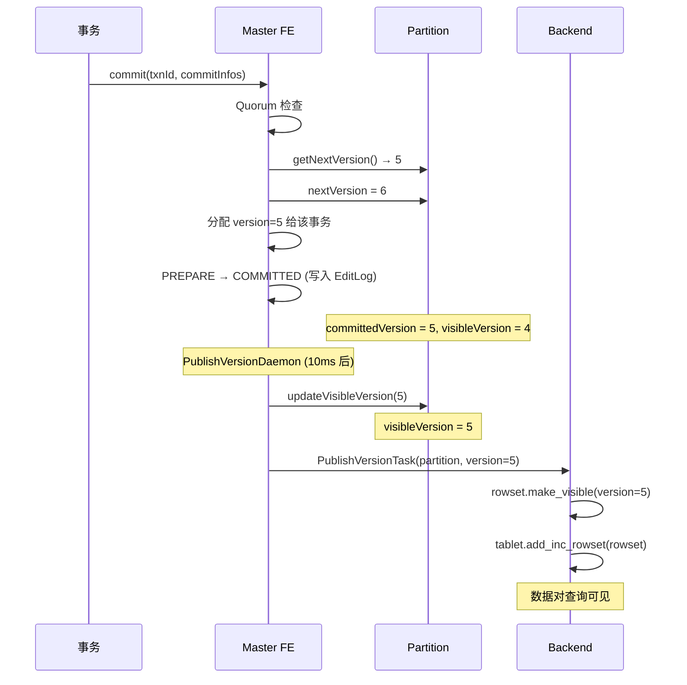
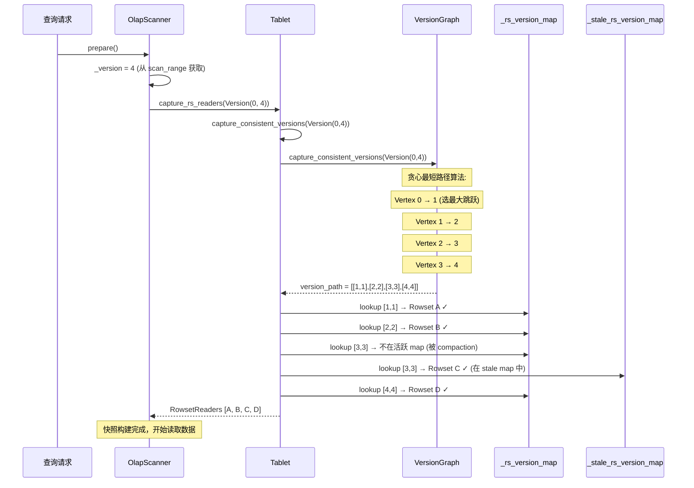
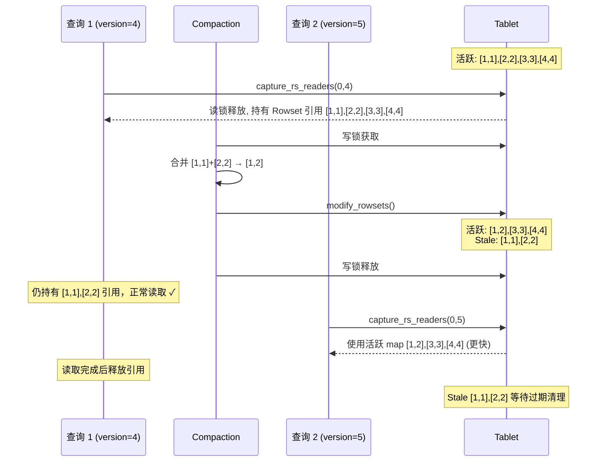
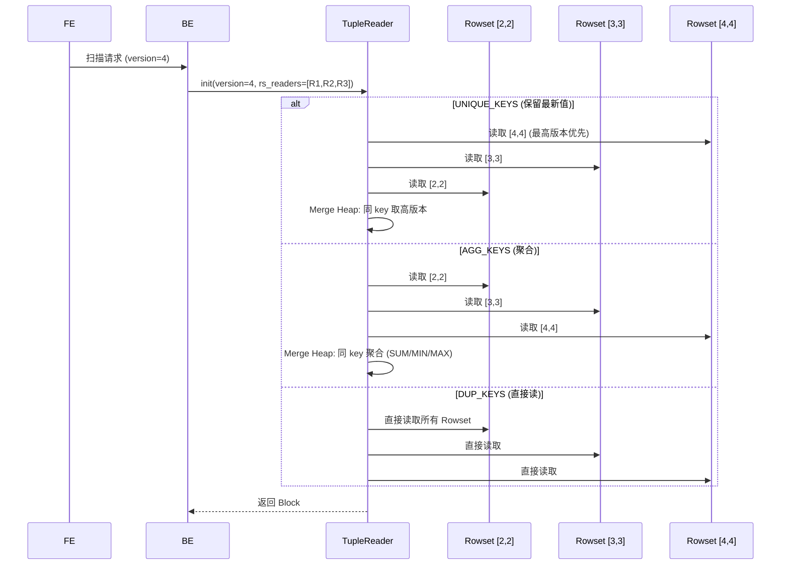
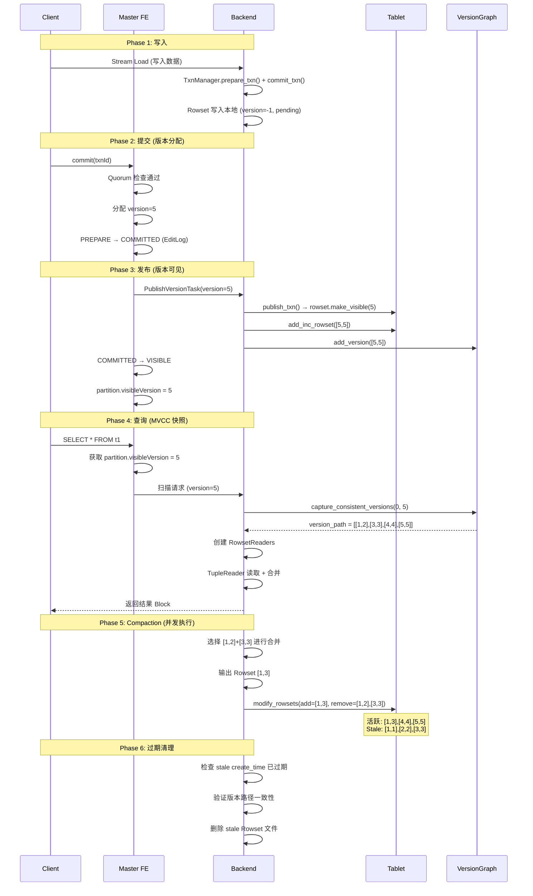

# Apache Doris MVCC 实现原理

## 一、MVCC 架构总览

Doris 通过 **Partition 版本号 + Tablet Rowset 版本链** 实现 MVCC。每个 Partition 维护一个单调递增的版本号，每个事务提交时分配一个版本。查询通过版本号构建快照，读取对应版本的 Rowset 数据，实现读写不阻塞。

```
┌──────────────────────────────────────────────────────────────────┐
│                      MVCC 全景                                   │
│                                                                   │
│  FE (版本分配与可见性):                                           │
│  ┌─────────────────────────────────────────────────────┐        │
│  │ Partition                                              │        │
│  │   visibleVersion = 4   ← 查询能看到的最大版本         │        │
│  │   nextVersion = 6       ← 下一个事务分配版本 5        │        │
│  │   committedVersion = 5 ← 最近提交版本 (=nextVersion-1) │        │
│  └─────────────────────────────────────────────────────┘        │
│                                                                   │
│  BE (版本链与快照读取):                                           │
│  ┌─────────────────────────────────────────────────────┐        │
│  │ Tablet                                                 │        │
│  │   _rs_version_map (活跃):                              │        │
│  │     [1,1] → Rowset(T1)                                │        │
│  │     [2,2] → Rowset(T2)                                │        │
│  │     [3,3] → Rowset(T3)                                │        │
│  │     [4,4] → Rowset(T4)                                │        │
│  │   _stale_rs_version_map (Compaction 后):              │        │
│  │     [1,2] → Rowset(T1+T2 merged) ← 旧读仍可用        │        │
│  └─────────────────────────────────────────────────────┘        │
└──────────────────────────────────────────────────────────────────┘
```

---

## 二、版本号生命周期

### 2.1 Partition 上的版本三要素

```
          分配                                发布
          ────►                               ────►

  nextVersion=5        committedVersion=5         visibleVersion=5
  (等待分配)           (事务已提交)                (数据已可见)

  时间线:
  ──────────────────────────────────────────────────────►
  │  T1:v2  │  T2:v3  │  T3:v4  │  T4:v5  │  查询    │
  │ PREPARE │ COMMIT  │ VISIBLE │ COMMIT  │ VISIBLE  │
```

| 字段 | 含义 | 变化时机 |
|------|------|---------|
| `visibleVersion` | 查询可见的最大版本 | PublishVersionDaemon 发布后递增 |
| `nextVersion` | 下一个待分配的版本号 | FE commit 时递增 |
| `committedVersion` | 最近提交版本 (= nextVersion - 1) | 隐式计算，无独立字段 |

**不变式**：`visibleVersion <= committedVersion < nextVersion`

### 2.2 版本号分配流程



---

## 三、BE 版本链结构

### 3.1 Version 与 Rowset

每个 Rowset 关联一个版本区间 `[start_version, end_version]`：

```
事务 T1 提交: Rowset [2,2]   (单版本，delta write)
事务 T2 提交: Rowset [3,3]
事务 T3 提交: Rowset [4,4]

Compaction 合并 T1+T2: Rowset [2,3]  (多版本，merged)
```

### 3.2 Version Graph（版本图）

BE 用有向图管理版本之间的拓扑关系：

```
Rowsets: [1,1], [2,2], [3,3], [4,4]

版本图:
  Vertex 1 ──→ Vertex 2 ──→ Vertex 3 ──→ Vertex 4 ──→ Vertex 5
  [1,1]       [2,2]        [3,3]        [4,4]

Compaction 合并 [1,1]+[2,2] 后:
  Vertex 1 ──────────→ Vertex 3 ──→ Vertex 4 ──→ Vertex 5
  [1,2] (merged)     [3,3]        [4,4]

  Vertex 1 ──→ Vertex 2 ──→ Vertex 3  (保留在 stale graph 中，供旧读使用)
  [1,1]       [2,2]
```

图的边按版本值**降序排列**，使最短路径算法一步选择最大跳跃。

### 3.3 capture_consistent_versions — 快照构建

查询到达 BE 时，需要找到一条从 0 到 visibleVersion 的完整版本路径：



### 3.4 最短路径算法详解

以 Compaction 后的场景为例：

```
活跃 Rowsets: [1,2], [3,3], [4,4]
Stale Rowsets: [1,1], [2,2]

版本图边 (降序排列):
  Vertex 0 → {5: [1,2]}          ← 最大跳跃，直接到 3
  Vertex 1 → {3: [1,2], 2: [1,1]}
  Vertex 3 → {4: [3,3], 2: [2,2]}
  Vertex 4 → {5: [4,4]}

查询 snapshot = (0, 4):

  Step 1: 从 Vertex 0, 选最大跳跃 → Vertex 3 (边 [1,2])
  Step 2: 从 Vertex 3, 选最大跳跃 ≤ 5 → Vertex 4 (边 [3,3])
  Step 3: 从 Vertex 4, 选最大跳跃 ≤ 5 → Vertex 5 (边 [4,4])
  到达目标 5

  version_path = [[1,2], [3,3], [4,4]]  (3 个 Rowset，而非 4 个)
```

**优化效果**：Compaction 后查询只需读 3 个 Rowset 而非 4 个，减少 I/O。

---

## 四、读写并发与 Compaction 交互

### 4.1 读写不阻塞



**关键设计**：
- 读操作持有 `RowsetReader` 的 `shared_ptr` 引用，即使 Rowset 被移到 stale map 也不会被删除
- 写操作（Compaction）在写锁内原子替换 Rowset，但影响的是未来的读
- 旧查询继续用旧的 Rowset 引用，新查询用合并后的 Rowset

### 4.2 Stale Rowset 过期清理

```
TimestampedVersionTracker:
  _stale_version_path_map:
    path_id=0: { [1,1], [2,2], create_time=T0 }
    path_id=1: { [3,3], [4,4], create_time=T1 }

过期条件: now - create_time > tablet_rowset_stale_sweep_time_sec

清理流程:
  1. capture_expired_paths(sweep_endtime)
  2. 对每个过期 path: 临时删除，验证 capture_consistent_versions(最新版本) 仍成立
  3. 验证通过 → 永久删除，移到 StorageEngine unused map
  4. 验证失败 → 恢复 (recover_versioned_tracker)，等待下次清理
```

---

## 五、不同数据模型的 MVCC 读取策略

### 5.1 读取策略选择

```
TabletReader 初始化:

switch (keys_type) {
  case DUP_KEYS:   直接读取，无合并   ← 纯追加，不关心版本顺序
  case UNIQUE_KEYS: 高版本到低版本合并 ← 保留最新值，丢弃旧值
  case AGG_KEYS:   合并堆 + 聚合      ← SUM/MIN/MAX/MERGE 等
}

优化: 如果只有单个非重叠 Rowset + 无 delete → 直接读取（跳过 merge heap）
```

### 5.2 各模型读取时序



---

## 六、Delete Predicate 与 MVCC

### 6.1 Delete 如何融入版本链

```
DELETE FROM t1 WHERE dt < '2024-01-01'

  生成一个特殊的 Rowset:
  - 版本: [5,5] (正常分配版本号)
  - 数据: 空 (无数据页)
  - DeletePredicate: { column="dt", op="<", values=["2024-01-01"] }

版本链:
  [1,1] → [2,2] → [3,3] → [4,4] → [5,5](delete predicate)
```

### 6.2 读取时 Delete 过滤

```
查询 snapshot version=4:
  只读到 [4,4]，不包含 [5,5] 的 delete predicate
  → dt < '2024-01-01' 的行仍然可见 ✓

查询 snapshot version=5:
  读到 [1,1]~[5,5]
  → DeletePredicate.init(version=5) 加载 [5,5] 的 predicate
  → 读取时过滤匹配的行 ✓

查询 snapshot version=6 (Compaction 后):
  Base Compaction 物理删除匹配行
  → [1,5] 已合并，delete 行已移除
  → 空间回收 ✓
```

| 读取类型 | Delete 行处理 |
|---------|-------------|
| 查询 (QUERY) | 过滤掉 (逻辑删除) |
| Base Compaction | 物理移除 |
| Cumulative Compaction | 跳过 (保留给 Base 处理) |

---

## 七、Schema Change 与 MVCC

### 7.1 Schema 变更的版本处理

```
ALTER TABLE t1 ADD COLUMN c3 INT

FE 侧:
  1. 创建 Shadow Index (schema_hash=新)
  2. Shadow 对用户查询不可见
  3. 后台转换数据 (旧 schema → 新 schema)
  4. 转换完成后: visualiseShadowIndex() → 可见

BE 侧:
  旧 Tablet (schema_hash=A):
    [1,1] → [2,2] → [3,3]

  新 Tablet (schema_hash=B):
    [1,1] → [2,2] → [3,3]  (相同版本号，不同 schema)
```

查询时 FE 指定 schema_hash，BE 选择对应 Tablet，在 Tablet 内用相同的版本快照机制读取。

---

## 八、MVCC 完整时序总结

### 8.1 从写入到查询的完整流程



---

## 九、MVCC 一致性保证

| 场景 | 保证机制 |
|------|---------|
| **读写不阻塞** | 读者持有 Rowset shared_ptr，Compaction 不影响进行中的读 |
| **版本连续性** | capture_consistent_versions 贪心算法保证路径完整 |
| **查询快照隔离** | 查询绑定 visibleVersion，只读该版本及之前的数据 |
| **Compaction 安全** | 旧 Rowset 移入 stale map，新读用合并结果 |
| **Delete 时效** | Delete Predicate 按 version 过滤，不影响历史快照 |
| **Schema Change** | Shadow Index 机制，新 Schema 有独立版本链 |
| **Stale 回收安全** | 删除前验证最新版本路径仍成立，失败则恢复 |

---

## 十、与 3FS MVCC 对比

| 维度 | Doris | 3FS |
|------|-------|-----|
| **版本粒度** | Partition 级单调递增版本号 | Inode truncateVer |
| **数据版本化** | Rowset 版本链 ([start, end]) | Chunk updateVer |
| **快照创建** | BE 按版本号构建 Rowset 读取器 | 无显式快照 (FDB SSI) |
| **读不阻塞写** | 读者持有 Rowset 引用 | FDB 快照隔离 |
| **写不阻塞读** | Compaction 使用 stale map | 链式复制不影响读取 |
| **旧版本回收** | TimestampedVersionTracker + 过期清理 | GC 延迟删除 |
| **Delete** | 版本化 Delete Predicate | 直接删除目录项 |
| **Compaction 影响** | 合并 Rowset，stale 保留供旧读 | 不涉及 (文件系统) |
| **隔离级别** | Snapshot Isolation (快照隔离) | Serializable Snapshot Isolation |

---