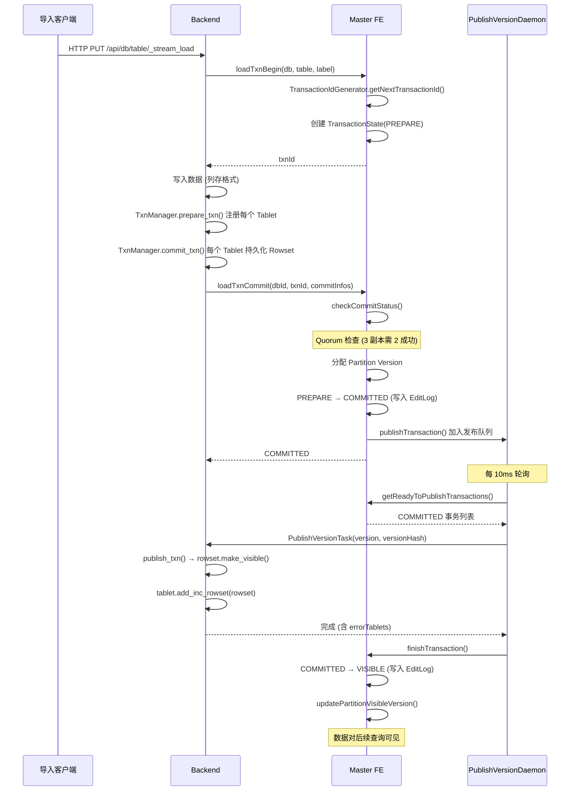
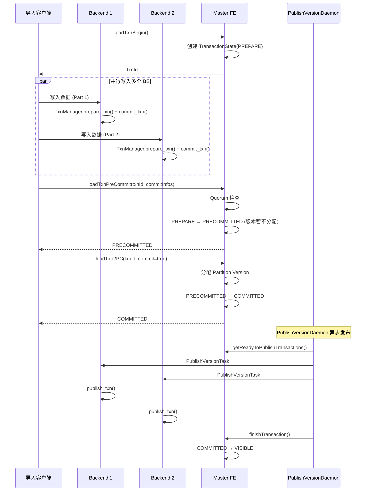
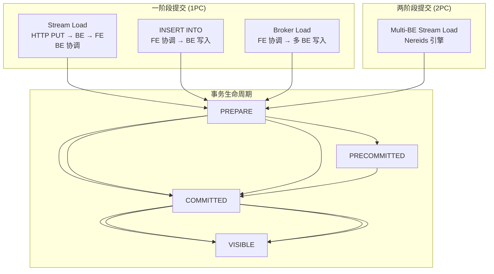
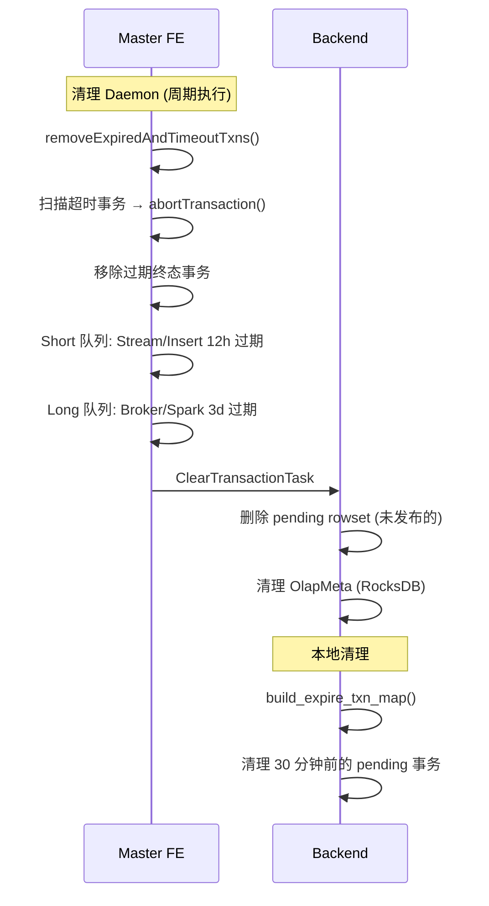

# Apache Doris 事务模型

## 一、事务状态机

Doris 的事务有 6 个状态，其中只有 `VISIBLE` 和 `ABORTED` 是终态：

```
                        ┌─────────────┐
                        │   PREPARE   │ ← 事务开始，数据写入中
                        └──────┬──────┘
                               │
              ┌────────────────┼────────────────┐
              │                │                │
              ▼                ▼                ▼
     ┌─────────────┐  ┌──────────────┐  ┌─────────────┐
     │  COMMITTED  │  │ PRECOMMITTED │  │   ABORTED   │
     └──────┬──────┘  └──────┬───────┘  └─────────────┘
            │                │                  ▲
            │                │           超时/失败/回滚
            │                │                  │
            │                │                ┌──┘
            │                ▼                │
            │        ┌─────────────┐          │
            │        │  COMMITTED  │──────────┘
            │        └──────┬──────┘  超时/失败
            │               │
            ▼               ▼
     ┌─────────────┐
     │   VISIBLE   │ ← 数据对查询可见 (终态)
     └─────────────┘
```

| 状态 | 说明 | 终态 |
|------|------|------|
| `PREPARE` | 事务已开始，数据正在写入 BE | 否 |
| `PRECOMMITTED` | 两阶段提交的预提交阶段 | 否 |
| `COMMITTED` | 提交成功，版本已分配，等待发布 | 否 |
| `VISIBLE` | 数据已发布，对查询可见 | 是 |
| `ABORTED` | 事务失败/取消/超时 | 是 |

---

## 二、事务全流程时序图

### 2.1 Stream Load 一阶段提交



### 2.2 两阶段提交 (Nereids / Multi-BE Stream Load)



两阶段提交的 `PRECOMMITTED` 阶段让所有 BE 完成写入后再统一分配版本，适用于多 BE 协同导入场景。

---

## 三、事务参与者详解

### 3.1 FE 事务管理器层级

```
GlobalTransactionMgr (全局单例)
├── TransactionIdGenerator        ← 批量分配事务 ID (每批 1000)
├── TxnStateCallbackFactory      ← 状态变更回调注册
└── dbIdToDatabaseTransactionMgrs: Map<Long, DatabaseTransactionMgr>
    └── DatabaseTransactionMgr (每库一个)
        ├── transactionLock: ReentrantReadWriteLock (公平锁)
        ├── idToRunningTransactionState: Map<Long, TransactionState>
        ├── idToFinalStatusTransactionState: Map<Long, TransactionState>
        ├── labelToTxnIds: Map<String, Set<Long>>
        └── partitionIdToRunningTransactionIds: Map<Long, Set<Long>>
```

### 3.2 TransactionState 核心字段

| 字段 | 说明 |
|------|------|
| `transactionId` | 全局唯一事务 ID |
| `dbId`, `label` | 所属库和导入标签 |
| `transactionStatus` | 当前状态 (PREPARE/COMMITTED/VISIBLE/...) |
| `idToTableCommitInfos` | 每个表的提交信息 (version, versionHash) |
| `sourceType` | FRONTEND / BACKEND_STREAMING / INSERT_STREAMING / BATCH_LOAD |
| `txnCoordinator` | 协调者 (FE 或 BE + IP) |
| `prepareTime`, `commitTime`, `finishTime` | 各阶段时间戳 |
| `errorReplicas` | 失败的副本集合 |
| `publishVersionTasks` | 每个 BE 的发布任务 |
| `callbackId` | 关联的 LoadJob 回调 |
| `timeoutMs` | PREPARE 阶段超时 (默认 600s) |
| `preCommittedTimeoutMs` | PRECOMMITTED 阶段超时 (默认 3600s) |

### 3.3 BE 事务管理器

```
TxnManager (StorageEngine 内)
├── _txn_tablet_maps[shard]: Map<(partitionId, txnId), Map<TabletInfo, TabletTxnInfo>>
├── _txn_partition_maps[shard]: Map<(partitionId, txnId), set<TabletInfo>>
├── _txn_map_locks[shard]: RW Lock (保护 map 结构)
└── _txn_mutex[shard]: Mutex (保护单个事务操作)
```

BE 端事务操作：

| 操作 | 说明 |
|------|------|
| `prepare_txn()` | 注册 (partitionId, txnId)，允许重复 |
| `commit_txn()` | 持久化 RowsetMeta 到 RocksDB，存储到 txn map |
| `publish_txn()` | 分配版本，使 Rowset 可见，从 txn map 移除 |
| `rollback_txn()` | 仅允许未 commit 的回滚 |
| `delete_txn()` | FE 发起的清理，删除未发布的 Rowset |

---

## 四、Quorum 与一致性

### 4.1 Quorum 语义

对于 3 副本 Tablet，至少需要 **2 个副本成功写入**才能提交：

```
3 副本 Tablet:
  Replica BE1: 写入成功 ✓
  Replica BE2: 写入成功 ✓
  Replica BE3: 写入失败 ✗
  ─────────────────────────
  quorum = 3/2 + 1 = 2  → 满足，可以提交
```

Quorum 检查在两个阶段执行：
1. **Commit 时**：FE 检查 commitInfos 中的副本数是否满足 quorum
2. **Publish 时**：再次检查健康副本数是否满足 quorum

### 4.2 版本严格有序

Publish 时检查版本连续性：

```
Partition Version 时间线:

  Txn1: version=5  (COMMITTED, 等待 publish)
  Txn2: version=6  (COMMITTED, 等待 publish)
  Txn3: version=7  (COMMITTED, 等待 publish)

  Publish Txn2 之前必须先完成 Txn1 的 publish
  因为: visibleVersion 必须等于 commitVersion - 1

  当前 visibleVersion=4
  Txn1 commitVersion=5: 4 == 5-1 ✓ → 可以 publish
  Txn2 commitVersion=6: 5 == 6-1 ✗ → 等待 Txn1 完成
```

### 4.3 事务超时

| 阶段 | 超时时间 | 默认值 |
|------|---------|--------|
| PREPARE | `stream_load_default_timeout_second` | 600s |
| PRECOMMITTED | `stream_load_default_precommit_timeout_second` | 3600s |
| Publish | `publish_version_timeout_second` | 30s |

超时后事务被自动 Abort。PRECOMMITTED 超时时间更长，因为需要等待协调者（客户端）发来最终 commit 请求。

---

## 五、不同导入路径的事务模型



| 导入方式 | 协调者 | 提交模式 | 超时 | 典型场景 |
|---------|--------|---------|------|---------|
| **Stream Load** | BE | 1PC | 600s | 实时小批量导入 |
| **INSERT INTO** | FE | 1PC | 300s | SQL 插入 |
| **Broker Load** | FE | 1PC | 14400s | 大批量外部数据 |
| **Multi-BE Stream** | Client | 2PC | 600s + 3600s | 大数据并行导入 |
| **Routine Load** | FE | 1PC | 持续运行 | Kafka 实时消费 |

---

## 六、事务回滚与清理

### 6.1 回滚触发条件

| 条件 | 处理 |
|------|------|
| Quorum 不满足 | FE 拒绝 commit，事务保持 PREPARE |
| 超时 (PREPARE/PRECOMMITTED) | FE 自动 abort |
| 协调 BE 宕机 | FE 检测后 abort 所有该 BE 协调的事务 |
| LoadJob 回调否决 | `beforeCommitted()` 抛异常，abort |
| 重复 label | 返回已有事务 ID（幂等） |

### 6.2 清理流程



| 清理参数 | 默认值 | 说明 |
|---------|--------|------|
| `streaming_label_keep_max_second` | 43200 (12h) | Stream/Insert 事务保留 |
| `label_keep_max_second` | 259200 (3d) | Broker/Spark 事务保留 |
| `max_remove_txn_per_round` | 10000 | 每轮最大清理数 |
| `pending_data_expire_time_sec` | 1800 (30min) | BE pending 事务过期 |
| `max_running_txn_num_per_db` | 100 | 每库最大运行事务数 |

---

## 七、BE 端事务数据流

```
写入请求到达 BE:

┌──────────────────────────────────────────────────────────┐
│  BE 事务处理流程                                          │
│                                                          │
│  1. prepare_txn(partitionId, txnId, tabletId)            │
│     → 注册到 _txn_tablet_maps                             │
│     → 保存 RowsetMeta (version=-1, pending)              │
│                                                          │
│  2. 写入数据到 Segment 文件                               │
│     → delta_writer → SegmentWriter → .dat 文件           │
│                                                          │
│  3. commit_txn(partitionId, txnId, tabletId, rowset)     │
│     → 更新 _txn_tablet_maps (rowset 不再为 null)          │
│     → 持久化 RowsetMeta (含数据大小、行数、segment 数)    │
│                                                          │
│  4. [等待 FE PublishVersionTask]                          │
│                                                          │
│  5. publish_txn(partitionId, txnId, tabletId, version)   │
│     → rowset.make_visible(version)  赋予版本号            │
│     → tablet.add_inc_rowset(rowset)  加入可见 Rowset 列表 │
│     → 持久化更新后的 RowsetMeta                          │
│     → 从 _txn_tablet_maps 移除                           │
│                                                          │
│  数据现在对查询可见 ✓                                     │
└──────────────────────────────────────────────────────────┘
```

---

## 八、与 3FS 事务模型对比

| 维度 | Doris | 3FS |
|------|-------|-----|
| **事务粒度** | Partition/Tablet 级别 | Inode/目录项级别 |
| **隔离级别** | 无传统隔离级别，靠版本号实现 MVCC | FDB SSI (可串行化快照隔离) |
| **一致性** | Quorum (多数派) | 强一致 (FDB 共识) |
| **提交协议** | 一阶段 (FE 协调) / 两阶段 (2PC) | 单事务原子提交 (FDB) |
| **可见性延迟** | 10ms~30s (PublishVersion Daemon) | 提交后立即可见 |
| **超时处理** | FE 自动 Abort + 清理 | FDB 事务超时自动回滚 |
| **回滚** | FE Abort + BE 清理 pending rowset | FDB 事务 abort + GC 清理 |
| **副本写入** | 并行写多 BE，Quorum 校验 | 链式复制 (Head → Members) |
| **版本模型** | Partition 单调递增版本号 | Inode truncateVer |
| **MVCC** | 通过版本号实现读写不阻塞 | 不需要 (SSI) |
| **死锁处理** | 锁排序约定避免死锁 | FDB 无死锁 (SSI) |

---