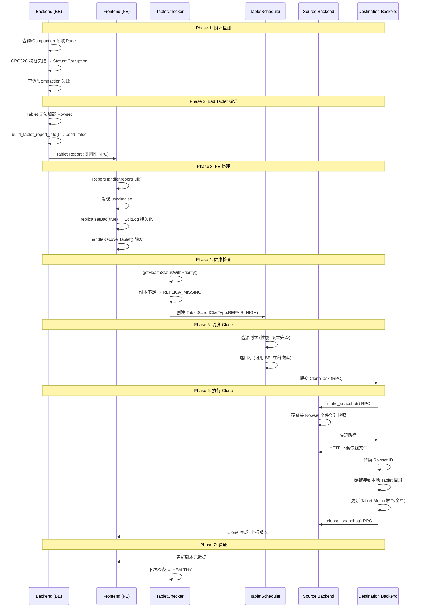

# Apache Doris 数据损坏检测与修复机制

## 一、核心结论

Doris 的损坏检测与修复是**粗粒度**的：
- **检测粒度**：Page 级（每个 Page 4 字节 CRC32C 校验）
- **标记粒度**：Tablet 级（整个 Tablet 标记为 bad）
- **修复粒度**：Tablet 级（整个 Tablet 克隆重建）

**不支持单 Segment 级别的修复**——一个 Segment 损坏会导致整个 Tablet 被标记为 bad，然后从健康副本克隆整个 Tablet 来恢复。

---

## 二、损坏检测机制

### 2.1 Page 级 CRC32C 校验（核心检测手段）

Segment 文件中的每个 Page 都带有 CRC32C 校验：

```
Page 文件布局:
┌──────────────────────────────────────────────┐
│  PageBody (压缩后的列数据)                     │
│  PageFooter (列统计信息: null bitmap, min/max)│
│  FooterSize (4 字节 LE)                       │
│  Checksum (4 字节 LE, CRC32C)                 │ ← 校验范围: body + footer + size
└──────────────────────────────────────────────┘

Segment Footer (文件末尾):
┌──────────────────────────────────────────────┐
│  SegmentFooterPB (Protobuf 序列化)            │
│  FooterPBSize (4 字节 LE)                     │
│  FooterPBChecksum (4 字节 LE, CRC32C)         │
│  MagicNumber (4 字节: "D0R1")                 │
└──────────────────────────────────────────────┘
```

**校验逻辑**（`page_io.cpp`）：

```cpp
// 写入时: 计算 body+footer+size 的 CRC32C
uint32_t checksum = crc32c::Value(page);  // page 包含 body+footer+size

// 读取时: 默认开启校验 (verify_checksum=true)
uint32_t expect = decode_fixed32_le(data + size - 4);
uint32_t actual = crc32c::Value(data, size - 4);
if (expect != actual) {
    return Status::Corruption("Bad page: checksum mismatch (actual vs expect)");
}
```

### 2.2 Segment Footer 校验

```cpp
// 读取 Segment 文件末尾:
uint32_t expect_checksum = decode_fixed32_le(fixed_buf + 4);
uint32_t actual_checksum = crc32c::Value(footer_buf.data(), footer_buf.size());
if (actual_checksum != expect_checksum) {
    return Status::Corruption("Bad segment file: footer checksum not match");
}
// 验证 Magic Number: "D0R1"
```

### 2.3 IO 错误分类

Doris 将校验错误归类为 IO 错误（`utils.h`）：

```cpp
inline bool is_io_error(OLAPStatus status) {
    return ((OLAP_ERR_IO_ERROR == status || OLAP_ERR_READ_UNENOUGH == status) && errno == EIO)
        || OLAP_ERR_CHECKSUM_ERROR == status      // 校验错误 = IO 错误
        || OLAP_ERR_FILE_DATA_ERROR == status     // 文件数据损坏
        || OLAP_ERR_TEST_FILE_ERROR == status;    // 测试文件失败
}
```

### 2.4 磁盘健康检查

BE 定期对每块磁盘做读写测试（`data_dir.cpp`）：

```
周期性检查:
  1. 在磁盘上写入一个测试文件 (.testfile)
  2. 读回并验证内容
  3. 失败 → _is_used = false (整块磁盘标记为不可用)
  4. 该磁盘上所有 Tablet 的 is_used() 返回 false
```

---

## 三、损坏发现到修复的完整链路



---

## 四、修复机制详解

### 4.1 Tablet 状态机

```
                    ┌──────────────┐
                    │  NOTREADY    │ ← Schema Change / Rollup / Clone 进行中
                    └──────┬───────┘
                           │ 完成
                           ▼
                    ┌──────────────┐
            ┌──────│   RUNNING    │──────┐
            │      └──────────────┘      │
            │ 校验失败 / 版本缺失        │ 关机
            ▼                            ▼
     ┌──────────────┐            ┌──────────────┐
     │  TOMBSTONED  │            │   STOPPED    │
     │ 完整性破坏   │            │ 文件保留     │
     │ 等待 FE 处理 │            └──────┬───────┘
     └──────────────┘                    │ 彻底移除
                                         ▼
                                  ┌──────────────┐
                                  │   SHUTDOWN   │
                                  │ 文件已删除   │
                                  └──────────────┘
```

### 4.2 FE 侧 Tablet 健康状态

| 状态 | 含义 | 是否可自动修复 |
|------|------|-------------|
| `HEALTHY` | 所有副本健康 | — |
| `REPLICA_MISSING` | 存活副本数不足 | 是 → Clone |
| `VERSION_INCOMPLETE` | 存活副本够但版本缺失 | 是 → Clone |
| `UNRECOVERABLE` | 无任何健康副本 | 否 → 人工介入 |
| `REPLICA_COMPACTION_TOO_SLOW` | 某副本 Compaction 落后太多 | 是 → Clone |
| `NEED_FURTHER_REPAIR` | 需要进一步修复 | 是 → Clone |

### 4.3 Clone 策略选择

```
                    损坏 Tablet
                         │
                         ▼
              ┌─────────────────────┐
              │  Tablet 本地存在?    │
              └──────┬──────────────┘
                     │
           ┌─────────┴─────────┐
           │ 是                │ 否
           ▼                   ▼
    ┌──────────────┐   ┌──────────────┐
    │ 增量 Clone   │   │ 全量 Clone   │
    │              │   │              │
    │ 1. 计算缺失  │   │ 1. 分配 Shard│
    │    版本      │   │ 2. 下载全部  │
    │ 2. 下载缺失  │   │    快照      │
    │    Rowset    │   │ 3. 加载到本地│
    │ 3. 补全 Meta │   │              │
    └──────────────┘   └──────────────┘
```

**增量 Clone**（推荐）：

```
本地 Tablet: version [1,5], 缺少 [6,7],[8,8]

Step 1: calc_missed_versions(committedVersion=8)
  → missed = [[6,7], [8,8]]

Step 2: 源 BE 创建快照 (硬链接 Rowset 文件)

Step 3: HTTP 下载快照文件到 CLONE 目录

Step 4: 转换 Rowset ID → 硬链接到 Tablet 目录

Step 5: 更新 Tablet Meta:
  _rs_version_map: [1,5], [6,7], [8,8]  (补全)
```

**全量 Clone**：

```
本地 Tablet: 不存在 或 严重损坏

Step 1: 分配新的 Shard 路径

Step 2: 源 BE 创建完整快照

Step 3: HTTP 下载全部文件

Step 4: 加载为本地 Tablet

Step 5: 比较版本, 替换旧数据
```

### 4.4 Clone 源副本选择策略

```
选择最优源副本的条件:
  1. isAlive() == true           ← 非 bad, 非 decommission
  2. version >= visibleVersion   ← 版本完整
  3. lastFailedVersion <= 0      ← 无失败版本
  4. BE 状态可用                 ← 调度可用
  5. 优先选择版本数最多的副本     ← 数据最新

多源候选时:
  srcBackends = [BE1, BE2, BE3]  ← 按优先级排序
  尝试 BE1 → 失败 → 尝试 BE2 → 成功
```

### 4.5 修复延迟机制

防止瞬态错误触发不必要的 Clone：

| 优先级 | 触发条件 | 修复延迟 |
|--------|---------|---------|
| `VERY_HIGH` | 低于 Quorum | 立即 |
| `HIGH` | 缺 1 个副本 | `delay_factor × 1` 秒 |
| `NORMAL` | 版本不完整 | `delay_factor × 2` 秒 |
| `LOW` | Compaction 落后 | `delay_factor × 3` 秒 |

---

## 五、各场景下的检测与修复行为

### 5.1 单个 Page 损坏

```
场景: Segment 中 1 个 Page 的 CRC32C 校验失败

检测: 读取该 Page 时校验失败 → Status::Corruption
影响: 查询/Compaction 失败
标记: Tablet set_bad(true) → Tablet Report → FE replica.setBad(true)
修复: 整个 Tablet Clone (非单个 Segment/Page)
代价: 下载整个 Tablet 数据, 而非仅修复损坏的 Page
```

### 5.2 Segment Footer 损坏

```
场景: Segment 文件末尾的 Footer 校验失败或 Magic Number 不匹配

检测: 打开 Segment 时 Footer 校验失败
影响: 整个 Segment 不可读
标记: Tablet set_bad(true)
修复: 整个 Tablet Clone
```

### 5.3 整块磁盘故障

```
场景: 磁盘硬件故障, 所有文件不可读

检测: DataDir.health_check() → 读写测试文件失败 → _is_used = false
影响: 该磁盘上所有 Tablet 不可用
标记: 所有 Tablet 的 used=false → 批量上报 FE
修复: FE TabletChecker 批量创建 CloneTask → 分配到其他磁盘/BE
并发: clone_worker_count=3 个线程并行执行
限速: max_download_speed_kbps=50000 (50 MB/s)
```

### 5.4 Compaction 遇到损坏

```
场景: Compaction 读取到损坏的 Page

行为:
  1. PageIO 返回 Status::Corruption
  2. Compaction 失败
  3. 记录失败时间戳 (_last_cumu/base_compaction_failure_millis)
  4. 等待下次调度重试
  5. 不自动标记 Tablet 为 bad

问题: 如果损坏是持久的, Compaction 会反复失败
解决: 最终查询也会失败 → Tablet 被标记为 bad → 触发 Clone
```

### 5.5 所有副本都损坏

```
场景: 3 副本全部损坏 (UNRECOVERABLE)

FE 行为:
  1. TabletChecker 检测到无健康副本
  2. 状态 = UNRECOVERABLE
  3. 不创建 CloneTask (无可用源)
  4. 需要人工介入:
     - 从备份恢复
     - 重新导入数据
     - Drop Table 重建

这是 Doris 数据安全的极限场景
```

---

## 六、修复过程对业务的影响

### 6.1 查询影响

```
修复期间, 剩余健康副本继续服务查询:
  3 副本 → 1 个损坏 → 2 个健康副本仍可查询 ✓
  3 副本 → 2 个损坏 → 1 个健康副本仍可查询 ✓
  3 副本 → 3 个损坏 → 查询失败 ✗

修复完成后, 新副本上线, 恢复完整冗余
```

### 6.2 写入影响

```
写入需要 Quorum (多数派) 确认:
  3 副本 → 1 个损坏 → 2/3 Quorum → 写入仍可成功 ✓
  3 副本 → 2 个损坏 → 1/3 不满足 Quorum → 写入阻塞 ✗

写入阻塞直到 Clone 完成恢复 Quorum
```

### 6.3 修复时间

| 场景 | 数据量 | 网络带宽 | 预计时间 |
|------|--------|---------|---------|
| 增量 Clone (少量版本) | < 100 MB | 50 MB/s | < 2 秒 |
| 全量 Clone (小 Tablet) | 1 GB | 50 MB/s | ~20 秒 |
| 全量 Clone (大 Tablet) | 100 GB | 50 MB/s | ~33 分钟 |
| 整盘故障 (1000 Tablet) | 10 TB | 50 MB/s | ~55 小时 |

---

## 七、与其他系统对比

| 维度 | Doris | HDFS | Ceph | 3FS |
|------|-------|------|------|-----|
| **校验粒度** | Page (CRC32C) | Block (CRC32C) | Object (CRC32C) | Chain (checksum) |
| **检测时机** | 读取时 | 读取时 + 后台 scrub | 读取时 + 后台 scrub | 读取时 |
| **损坏标记粒度** | Tablet | Block | PG | 无 (直接修复) |
| **修复粒度** | 整个 Tablet | 单个 Block | 单个 PG | 单个 Chunk |
| **修复方式** | Clone 副本 | 跨 DataNode 复制 | 跨 OSD 复制 | 链式复制重建 |
| **自动修复** | 是 (需健康副本) | 是 | 是 | 是 |
| **后台主动检测** | 无 | Scrub (定期) | Scrub (定期) | 无 |
| **无健康副本** | 数据丢失 | 数据丢失 | 数据丢失 | 数据丢失 |

### Doris 的不足

1. **修复粒度粗**：一个 Page 损坏需要重建整个 Tablet
2. **无后台主动检测**：只有读取时才发现损坏，冷数据可能长期损坏未被发现
3. **无单 Segment/Page 修复**：不支持局部修复，浪费网络和磁盘 I/O
4. **Clone 限速低**：默认 50 MB/s，大 Tablet 修复时间长

---

## 八、关键代码文件索引

| 组件 | 文件路径 |
|------|---------|
| Page CRC32C 校验 | `be/src/olap/rowset/segment_v2/page_io.cpp` |
| Segment Footer 校验 | `be/src/olap/rowset/segment_v2/segment.cpp` |
| CRC32C 实现 | `be/src/util/crc32c.h` |
| IO 错误分类 | `be/src/olap/utils.h` |
| Tablet bad 标记 | `be/src/olap/tablet.h` |
| Tablet Report 构建 | `be/src/olap/tablet.cpp:build_tablet_report_info()` |
| 磁盘健康检查 | `be/src/olap/data_dir.cpp:health_check()` |
| FE Tablet Report 处理 | `fe/.../master/ReportHandler.java` |
| FE Replica bad 标记 | `fe/.../catalog/Replica.java` |
| FE TabletChecker | `fe/.../clone/TabletChecker.java` |
| FE TabletScheduler | `fe/.../clone/TabletScheduler.java` |
| Clone Task (FE) | `fe/.../task/CloneTask.java` |
| Engine Clone (BE) | `be/src/olap/task/engine_clone_task.cpp` |
| 快照机制 (BE) | `be/src/olap/task/engine_snapshot_task.cpp` |

