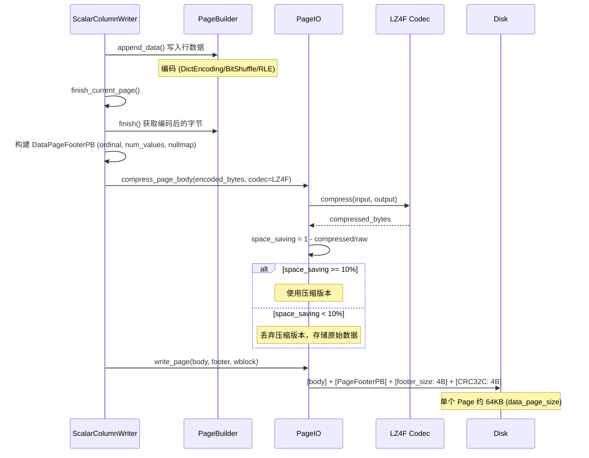
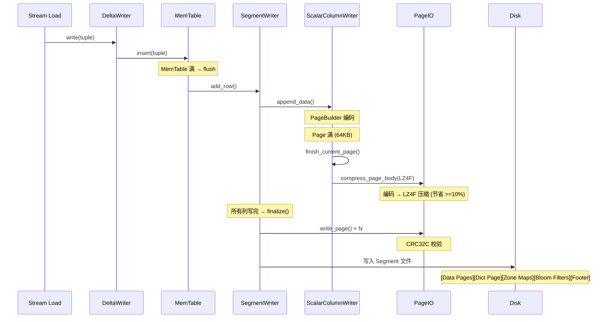
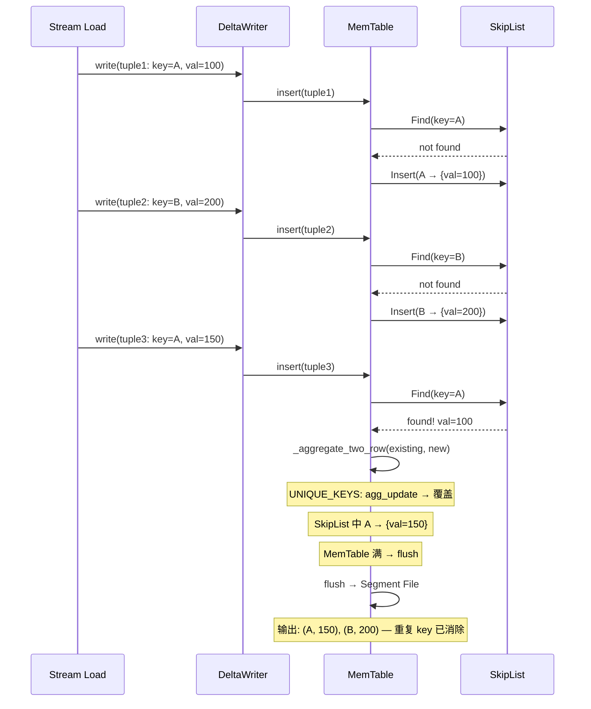
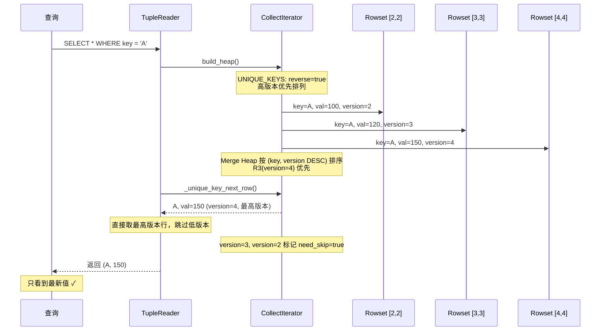
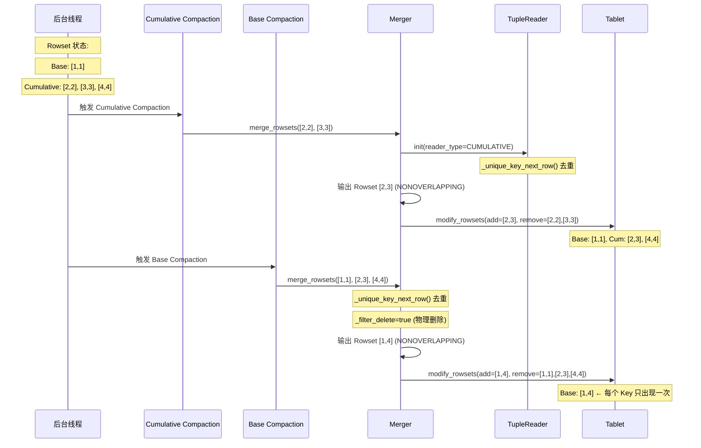
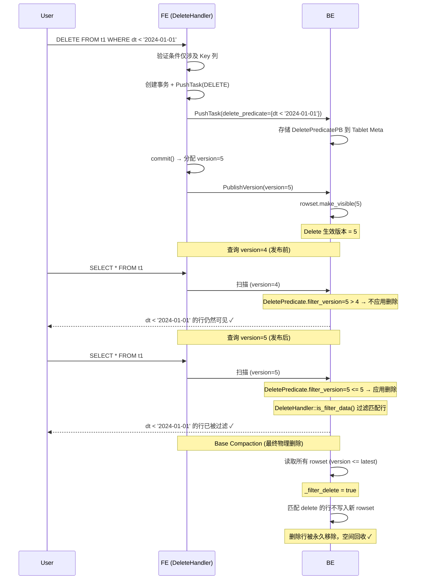
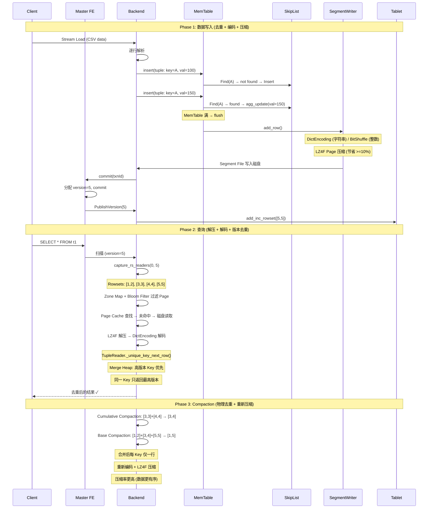

# Apache Doris 压缩与去重实现原理

## 一、压缩与去重总览

Doris 的压缩和去重是两个独立但互补的机制：

- **压缩（Compression）**：减少存储空间和 I/O，在 Page 级别对编码后的数据进行 LZ4F/ZSTD 等压缩
- **去重（Deduplication）**：保证 UNIQUE_KEYS 模型下每个 Key 只保留最新值，通过 Merge-on-Read + Compaction 实现

```
写入路径:
  Row Data → MemTable(SkipList 去重) → PageBuilder(编码) → LZ4F(压缩) → Segment File

读取路径:
  Segment File → LZ4F(解压) → PageDecoder(解码) → CollectIterator(多版本去重) → Result

压缩路径:
  Compaction → 读取多版本 → Merge去重 → 重新编码压缩 → 新 Segment
```

---

## 二、存储压缩

### 2.1 压缩架构：编码 + Page 级压缩

Doris 采用**两级压缩**策略：先编码消除数据冗余，再 Page 级压缩进一步压缩。

```
原始数据 (如: ["Beijing", "Shanghai", "Beijing", "Shanghai", "Beijing"])
    │
    ▼ [第一级: 列编码]
字典编码: "Beijing"→0, "Shanghai"→1
    → 编码值: [0, 1, 0, 1, 0]  (INT 类型)
    │
    ▼ [第二级: Page 级压缩]
LZ4F 压缩编码后的字节流
    │
    ▼ [磁盘存储]
压缩后的 Page (CRC32C 校验)
```

### 2.2 支持的压缩算法

| 算法 | 压缩率 | 压缩速度 | 解压速度 | 实现库 | 说明 |
|------|--------|---------|---------|--------|------|
| **LZ4F** (默认) | 中 | 快 | **极快** | `<lz4/lz4frame.h>` | Frame 格式，256KB Block，解压速度约 2x LZ4 |
| LZ4 | 中 | 快 | 极快 | `<lz4/lz4.h>` | Raw Block 格式，最大 2GB |
| SNAPPY | 低 | 快 | 快 | `<snappy/snappy.h>` | Google Snappy，零拷贝多 Slice 压缩 |
| ZLIB | 高 | 慢 | 中 | `<zlib.h>` | Deflate 算法，默认压缩级别 |

**默认算法**：`SegmentWriter::init_column_meta()` 硬编码所有列使用 `LZ4F`。

### 2.3 支持的列编码

| 数据类型 | 默认编码 | 值查找编码 | 说明 |
|---------|---------|-----------|------|
| TINYINT ~ LARGEINT | **BIT_SHUFFLE** | FOR | 位洗牌 + LZ4，适合有序整数 |
| FLOAT / DOUBLE | **BIT_SHUFFLE** | - | 位洗牌，利用 float 的 bit 模式 |
| CHAR / VARCHAR / STRING | **DICT_ENCODING** | PREFIX | 字典编码：字符串→整数码字 |
| BOOL | **RLE** | PLAIN | 游程编码，bool 值压缩率极高 |
| DATE / DATETIME | **BIT_SHUFFLE** | FOR | 位洗牌 |
| DECIMAL | **BIT_SHUFFLE** | BIT_SHUFFLE | 位洗牌 |

### 2.4 字典编码详解（字符串列的核心优化）

```
写入阶段:
  原始数据: ["Beijing", "Shanghai", "Beijing", "Shanghai", "Beijing"]

  1. 构建 Dictionary Page:
     ┌─────────┬──────┐
     │ Beijing │  0   │
     │ Shanghai│  1   │
     └─────────┴──────┘
     → PLAIN 编码 + LZ4F 压缩 → 写入 Dictionary Page

  2. Data Page 存储码字:
     [0, 1, 0, 1, 0]  → BitShuffle(INT) 编码 → LZ4F 压缩 → Data Page

  3. 字典溢出回退:
     当唯一值超过 dict_page_size (默认 1MB) → 切换为 PLAIN 编码

读取阶段:
  Data Page → LZ4F 解压 → BitShuffle 解码 → 码字 [0, 1, 0, 1, 0]
      → Dictionary Page 查找 → ["Beijing", "Shanghai", "Beijing", "Shanghai", "Beijing"]
```

### 2.5 Page 级压缩流程



### 2.6 Page 缓存（避免重复解压）

```
StoragePageCache (LRU, 默认占系统内存 20%):
┌─────────────────────────────────────────┐
│ _data_page_cache (90%)                  │
│   key=(filepath, offset) → 解压后的 Page │
│   避免重复磁盘读取和解压                  │
├─────────────────────────────────────────┤
│ _index_page_cache (10%)                 │
│   key=(filepath, offset) → 解压后的索引  │
│   包括 Dictionary Page、Ordinal Index 等 │
└─────────────────────────────────────────┘
```

读取路径：先查 Page Cache → 命中直接返回 → 未命中则读磁盘解压后写入缓存。

### 2.7 Bloom Filter（减少无效 I/O）

```
Segment 文件结构:
┌──────┐ ┌──────┐ ┌──────┐ ┌────────┐ ┌───────────┐ ┌──────┐
│Data 1│ │Data 2│ │Data 3│ │Dict Page│ │Ordinal Idx│ │Footer│
│Page  │ │Page  │ │Page  │ │         │ │           │ │+Magic│
└──┬───┘ └──┬───┘ └──┬───┘ └────┬────┘ └───────────┘ └──────┘
   │        │        │          │
   ▼        ▼        ▼          ▼
 ┌─────────────────────────────────────────┐
 │ Zone Map (per-page min/max 统计)       │ ← 第一级过滤
 │ Bloom Filter (per-page 布隆过滤器)      │ ← 第二级过滤
 └─────────────────────────────────────────┘
```

- **BlockSplitBloomFilter**：32 字节 Block（一个 Cache Line），SIMD 友好
- **FPP = 0.05**（5% 误判率）
- **过滤流程**：Zone Map (min/max) → Bloom Filter → 剩余 Page 才需读取和解压

### 2.8 压缩写入完整流程



---

## 三、去重

### 3.1 三种数据模型的去重策略

| 数据模型 | 写入去重 | 读取去重 | Compaction 去重 | 说明 |
|---------|---------|---------|---------------|------|
| **DUP_KEYS** | 无 | 无 | 无 | 允许完全重复，不去做重 |
| **UNIQUE_KEYS** | SkipList (单批次) | Merge Heap (跨版本) | Merge + 物理去重 | 保证每 Key 仅有最新值 |
| **AGG_KEYS** | SkipList + 聚合 | Merge Heap + 聚合 | Merge + 聚合 | 相同 Key 按聚合函数合并 |

### 3.2 UNIQUE_KEYS 去重：Merge-on-Read (MoR)

本版本 Doris 采用**纯 Merge-on-Read** 策略：写入时不查磁盘去重，读取时多版本合并去重。

```
                          去重时机
                    ┌──────────┬──────────┐
                    │ 写入时   │ 读取时   │
               ┌────┤          │          │
               │Mem │ SkipList │          │
               │Tbl │ 去重     │          │
               └────┤          │          │
                    │          │          │
               ┌────┤          ├──────────┤
               │跨  │          │ Merge    │
               │Row │          │ Heap     │
               │set │          │ 去重     │
               └────┤          │          │
                    │          │          │
               ┌────┤          │          │
               │跨  │          │          │
               │Txn │          │          │
               └────┤          │          │
                    │          │          │
               ┌────┤          ├──────────┤
               │Comp│          │ Merge +  │
               │act │          │ 物理     │
               │ion │          │ 去重     │
               └────┴──────────┴──────────┘
```

### 3.3 写入去重：MemTable SkipList



**SkipList 关键特性**：
- `can_dup = false`（UNIQUE_KEYS 模式下不允许重复）
- O(log n) 的 Find + InsertWithHint
- 单次 flush 内保证 Key 唯一

### 3.4 读取去重：Merge Heap



**Merge Heap 排序规则**（`LevelIteratorComparator`）：

```
比较两个 Row:
  1. 先比 Key → Key 不同则正常排序
  2. 再比 Sequence 列 (如果有) → Sequence 大的保留
  3. 最后比 Version → Version 高的保留，低版本标记 need_skip
```

### 3.5 Compaction 物理去重



### 3.6 Compaction 类型对比

| 维度 | Cumulative Compaction | Base Compaction |
|------|----------------------|-----------------|
| **触发条件** | 累积 rowset 数 > 阈值 | 累积/基线比例 > 阈值 |
| **处理范围** | 最近几个 delta rowset | 所有 rowset (base + cumulative) |
| **Delete 处理** | **跳过** (保留 delete predicate) | **物理删除**匹配行 |
| **输出** | NONOVERLAPPING rowset | 单个 NONOVERLAPPING rowset |
| **去重效果** | 合并近期版本 | 完全去重，每 Key 一行 |
| **频率** | 高频 | 低频 |

---

## 四、Delete 语句的实现

### 4.1 DELETE FROM 工作原理



### 4.2 Delete 在不同阶段的行为

| 阶段 | Delete 行处理 | 说明 |
|------|-------------|------|
| 写入 | 生成 DeletePredicatePB，存入 Tablet Meta | 不实际删除数据 |
| 查询 | `is_filter_data()` 逻辑过滤 | 仅过滤 `version <= 查询版本` 的 predicate |
| Cumulative Compaction | **跳过** delete predicate | 保留给 Base 处理 |
| Base Compaction | **物理移除**匹配行 | `_filter_delete = true`，空间回收 |

---

## 五、完整的写入→去重→压缩→查询流程



---

## 六、压缩率优化分析

### 6.1 为什么 Compaction 后压缩率更高

```
Compaction 前 (3 个 Rowset):
  Rowset [3,3]: Segment 内 Key 无序 → 字典编码效率低 → BitShuffle 效果差
  Rowset [4,4]: 同上
  Rowset [5,5]: 同上

Compaction 后 (1 个 Rowset):
  Rowset [3,5]: Key 有序 → 字典编码效率高 → BitShuffle 充分利用排序局部性
  → 压缩率显著提升

实际效果:
  3 个小 Rowset 总计 300MB
  → Compaction 后 1 个 Rowset 约 150~200MB (去重 + 有序编码 + 更高压缩率)
```

### 6.2 各编码的适用场景

| 场景 | 最佳编码 | 压缩效果 | 原因 |
|------|---------|---------|------|
| 低基数字符串 (如城市名) | DICT_ENCODING + LZ4F | **极高** | 字典将字符串映射为小整数，压缩率极高 |
| 有序整数 (自增 ID) | BIT_SHUFFLE + LZ4F | **高** | BitShuffle 将高位集中，LZ4 利用重复模式 |
| 日期列 | BIT_SHUFFLE + LZ4F | **高** | 日期连续，相邻行差异小 |
| Boolean 列 | RLE | **高** | 连续相同值，RLE 效果极佳 |
| 高基数字符串 (如 UUID) | PLAIN + LZ4F | **低** | 字典溢出回退，压缩效果有限 |
| 浮点数 | BIT_SHUFFLE + LZ4F | **中** | Bit 模式局部性不如整数 |

---

## 七、总结

| 维度 | 压缩 | 去重 |
|------|------|------|
| **目标** | 减少存储空间和 I/O | 保证数据一致性 |
| **时机** | 写入时 Page 级、Compaction 后重新压缩 | 写入(SkipList)、读取(Merge Heap)、Compaction(物理) |
| **粒度** | Page 级 (64KB) | Row 级 (按 Key) |
| **默认算法** | LZ4F | UNIQUE_KEYS: Last-Write-Wins |
| **回退策略** | 节省 <10% 则不压缩 | AGG_KEYS: 按聚合函数合并 |
| **缓存优化** | StoragePageCache (解压后缓存) | 无缓存 (每次查询重新合并) |
| **对查询的影响** | 减少磁盘 I/O 和内存占用 | Rowset 多时读性能下降，依赖 Compaction |

**核心设计理念**：压缩通过编码 + Page 级压缩在存储层消除冗余；去重通过 MoR 模型在读/写/Compaction 三个阶段分层消除重复。两者结合使得 Doris 在 AI 训练数据仓库场景下能以较低存储成本支持高并发查询。

---
