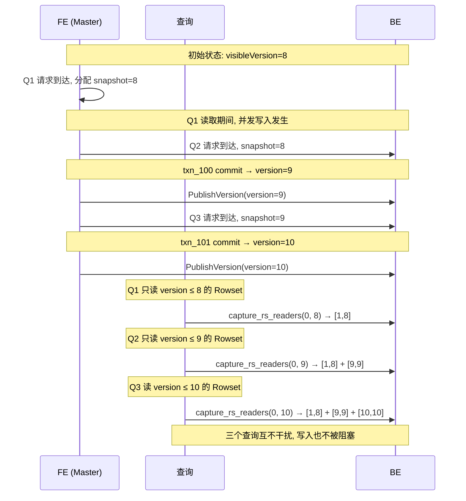
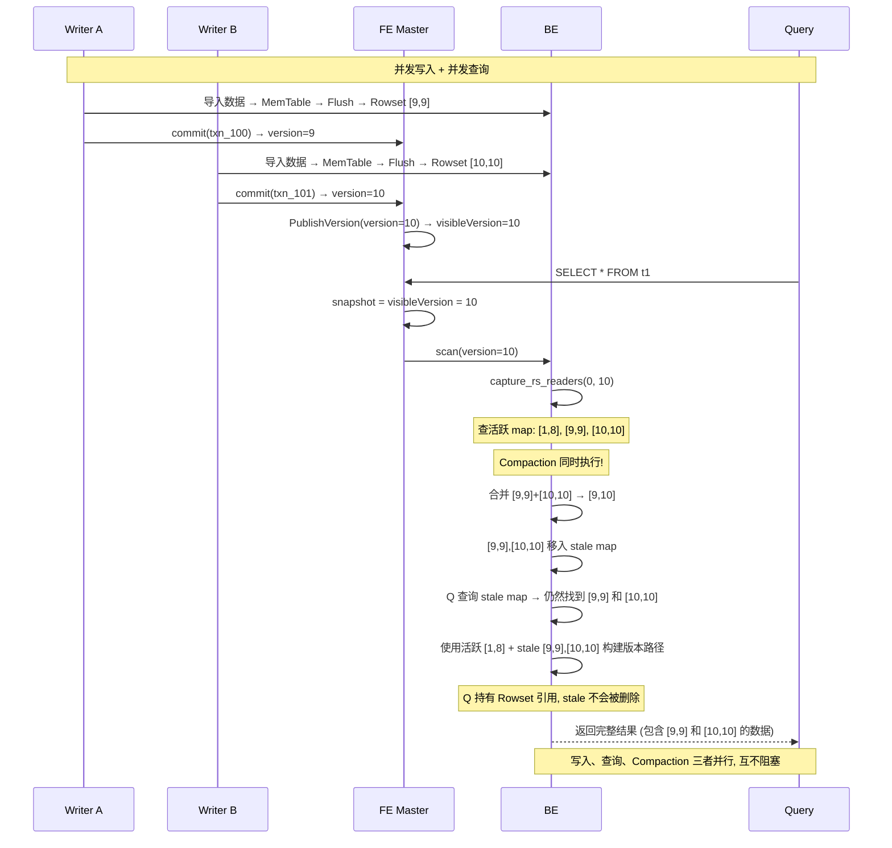

# Doris 并发写入与 MVCC 快照机制

## 一、核心结论

**Doris 天然支持多客户端并发导入同一张表，每个导入产生独立的 Rowset（版本号递增），读写互不阻塞。**

| 特性 | 说明 |
|------|------|
| 并发写入 | 多个客户端同时导入，各自追加独立 Rowset |
| 写入冲突 | 无（每个 Rowset 是独立文件） |
| 读写阻塞 | 无（MVCC 快照隔离） |
| 数据一致性 | 按数据模型处理（UNIQUE 取最新、DUP 全保留、AGG 聚合） |

---

## 二、并发写入原理

### 2.1 每个导入是独立事务

```
Client A: Stream Load → INSERT INTO t1 VALUES (...)  → txn_100, version=10
Client B: Stream Load → INSERT INTO t1 VALUES (...)  → txn_101, version=11
Client C: Broker Load → INSERT INTO t1 VALUES (...) → txn_102, version=12

三个事务完全独立:
  ├── 独立的 txn_id
  ├── 独立的 version (Partition 级单调递增)
  ├── 独立的 MemTable (内存)
  ├── 独立的 Rowset (磁盘 Segment 文件)
  └── 独立的提交和发布
```

### 2.2 写入路径无冲突

```
Client A 写入 Tablet X:
  → MemTable A (独立) → Flush → Segment_A 文件

Client B 写入 Tablet X:
  → MemTable B (独立) → Flush → Segment_B 文件

两个客户端写不同的 MemTable, Flush 到不同的 Segment 文件 → 零冲突
```

### 2.3 版本号分配

```
Partition 版本号 (FE 内存中单调递增):

  时间线:
  ── txn_100 commit → version=10 ── txn_101 commit → version=11 ── txn_102 commit → version=12 ──

  nextVersion = 10, 11, 12, ... (严格递增, 串行分配)
  分配是瞬间完成 (内存操作), 不阻塞其他事务
```

### 2.4 BE 侧的 Rowset 版本链

```
并发写入后的 Tablet 状态:

  _rs_version_map (活跃 Rowset):
    [1,8]    → 基线数据 (Compaction 后的大 Rowset)
    [9,9]    → Client A 的导入数据
    [10,10]  → Client B 的导入数据
    [11,11]  → Client C 的导入数据

  4 个 Rowset 独立存储, 互不干扰
  写入时没有任何 Rowset 被修改或覆盖
```

---

## 三、三种数据模型的并发行为

### 3.1 UNIQUE_KEYS（唯一键，最新版本胜出）

```
Client A: INSERT INTO t1 VALUES (1, "Alice")  → Rowset [10,10]
Client B: INSERT INTO t1 VALUES (1, "Bob")    → Rowset [11,11]

物理存储: 两个 Rowset 都保留
  [10,10] → {(1, "Alice")}
  [11,11] → {(1, "Bob")}

查询 (snapshot version=11):
  Merge Heap 从高版本到低版本:
    key=1: 取 version=11 的 "Bob", 丢弃 version=10 的 "Alice"
  → 结果: {(1, "Bob")}  ← 逻辑上 "Bob" 取代了 "Alice"

Compaction 后:
  [10,11] → {(1, "Bob")}  ← 物理合并, "Alice" 被永久删除
```

### 3.2 DUP_KEYS（重复键，全部保留）

```
Client A: INSERT INTO t1 VALUES (1, "Alice")  → Rowset [10,10]
Client B: INSERT INTO t1 VALUES (1, "Bob")    → Rowset [11,11]

查询 (snapshot version=11):
  直接读取所有 Rowset, 不做合并
  → 结果: {(1, "Alice"), (1, "Bob")}  ← 两行都保留

Compaction 后:
  [10,11] → {(1, "Alice"), (1, "Bob")}  ← 仍然保留两行
```

### 3.3 AGG_KEYS（聚合键，按聚合函数合并）

```
Client A: INSERT INTO t1 VALUES (1, 100)  → Rowset [10,10]
Client B: INSERT INTO t1 VALUES (1, 200)  → Rowset [11,11]

查询 (snapshot version=11, SUM 聚合):
  Merge Heap: key=1 → 100 + 200 = 300
  → 结果: {(1, 300)}

Compaction 后:
  [10,11] → {(1, 300)}  ← 聚合为一行, 100 和 200 被永久删除
```

### 3.4 三种模型对比

| 维度 | UNIQUE_KEYS | DUP_KEYS | AGG_KEYS |
|------|------------|----------|----------|
| 并发写入同一 Key | 不报错 | 不报错 | 不报错 |
| 读取时行为 | 取最新版本 | 全部返回 | 聚合计算 |
| Compaction 行为 | 删除旧版本 | 保留所有版本 | 聚合为一行 |
| 数据量变化 | 减少 | 不变或增加 | 减少 |
| 典型场景 | 用户画像更新 | 原始日志存储 | 指标聚合 |

---

## 四、"最新版本取代老版本"的精确理解

### 4.1 常见误解

| 误解 | 实际 |
|------|------|
| 写入时新版本覆盖旧版本 | 写入时只是追加新 Rowset, 不修改任何已有数据 |
| 物理上只保留最新版本 | 所有版本的 Rowset 都同时存在于磁盘上 |
| 所有数据模型都如此 | 只有 UNIQUE_KEYS 有"取代", DUP_KEYS 不取代 |

### 4.2 三个阶段的不同行为

```
阶段 1: 写入 (纯追加, 零覆盖)

  Client A → Rowset [10,10]  独立文件
  Client B → Rowset [11,11]  独立文件
  Client C → Rowset [12,12]  独立文件

  磁盘上: 3 个文件, 各自独立, 互不知道对方
  没有任何数据被覆盖或删除

阶段 2: 读取 (逻辑合并, 不修改磁盘)

  查询 snapshot=11:
    UNIQUE: Merge Heap 取最高版本 → "逻辑取代"
    DUP:    读取所有版本 → "不取代"
    AGG:    Merge Heap 聚合 → "逻辑合并"

  磁盘上: 仍然是 3 个文件, 没有任何修改
  "取代" 只是 Merge Heap 的计算结果, 不是磁盘操作

阶段 3: Compaction (物理合并, 真正删除旧数据)

  Base Compaction 合并 [10,10] + [11,11] + [12,12] → [10,12]

  UNIQUE: 新文件只保留最新值, 旧值物理删除
  DUP:    新文件保留所有行
  AGG:    新文件只保留聚合值, 原始值物理删除

  磁盘上: 新文件 [10,12] + 旧文件在 stale map 中等待删除
```

---

## 五、MVCC 快照原理

### 5.1 一句话理解

**查询开始时，记录当前可见版本号（拍"照片"），整个查询只读该版本及之前的数据，不管后续有多少新写入。**

### 5.2 生活类比

```
共享文档 (类比):

  10:00 - 文档有 3 行数据 (version 8)
  10:01 - Alice 开始阅读 (快照: version 8)
  10:02 - Bob 写入第 4 行 (version 9)   → Alice 看不到
  10:03 - Carol 写入第 5 行 (version 10) → Alice 看不到
  10:04 - Alice 读完了

  Alice 拿到的是 version 8 的 "快照"
  她的整个阅读过程只看到 3 行数据
  Bob 和 Carol 的写入不影响 Alice
  Alice 的阅读也不阻塞 Bob 和 Carol

  10:03 - Dave 开始阅读 (快照: version 9)
  → Dave 看到 4 行 (包括 Bob 写的, 不包括 Carol 的)
```

### 5.3 Doris 中的实现

```
版本号时间线:

  visibleVersion = 8          ← 查询 Q1 开始
  txn_100 提交 → version=9   ← 查询 Q2 开始
  txn_101 提交 → version=10  ← 查询 Q3 开始
  nextVersion = 11

  ┌─ Q1 (快照 version=8) ─────────────────────────────┐
  │  读取范围: [0, 8]                                  │
  │  读到的 Rowset: [1,8] (基线)                       │
  │  看不到 [9,9], [10,10]                            │
  │  读取过程中, 其他事务继续写入, 不影响 Q1            │
  └───────────────────────────────────────────────────┘

  ┌─ Q2 (快照 version=9) ─────────────────────────────┐
  │  读取范围: [0, 9]                                  │
  │  读到的 Rowset: [1,8] + [9,9]                      │
  │  看不到 [10,10]                                  │
  └───────────────────────────────────────────────────┘

  ┌─ Q3 (快照 version=10) ────────────────────────────┐
  │  读取范围: [0, 10]                                 │
  │  读到的 Rowset: [1,8] + [9,9] + [10,10]           │
  └───────────────────────────────────────────────────┘
```

### 5.4 快照如何创建

```
你以为的快照 (❌):
  拷贝一份数据给查询用 → GB 级拷贝, 太慢

Doris 的快照 (✓):
  只记录一个数字: snapshot = visibleVersion = 8
  查询时按版本范围选择 Rowset → 零拷贝
  创建快照 ≈ 0 纳
```

### 5.5 快照如何保证旧数据不被删除

```
问题: Q1 正在读取 [9,9], Compaction 要合并 [9,9] + [10,10]

Doris 解决方案: stale map (双层 Rowset 存储)

  Compaction 前:
    _rs_version_map (活跃):    [1,8], [9,9], [10,10], [11,11]

  Compaction:
    合并 [9,9] + [10,10] → [9,10]
    [9,9] → 移入 _stale_rs_version_map
    [10,10] → 移入 _stale_rs_version_map

  Compaction 后:
    _rs_version_map (活跃):    [1,8], [9,10], [11,11]
    _stale_rs_version_map:     [9,9], [10,10]  ← 旧查询仍在用

  Q1 查询:
    查活跃 map → 找不到 [9,9]
    查 stale map → 找到 [9,9] ✓
    持有引用 → Rowset 不被删除

  GC (后台定期):
    检查 stale map 中的 Rowset 引用计数
    引用计数 = 0 → 删除文件, 回收磁盘空间
```

### 5.6 快照创建到数据读取的完整流程



---

## 六、读写不阻塞的完整时序



---

## 七、总结

### Doris 并发写入三原则

```
1. 写入 = 追加
   每个客户端追加独立的 Rowset, 不修改已有数据
   不存在 "覆盖" 或 "冲突"

2. 读取 = 快照
   查询绑定一个版本号, 只读该版本之前的数据
   快照 = 一个数字, 不是数据拷贝, 创建成本为零

3. 合并 = Compaction
   Compaction 时才真正物理合并旧 Rowset
   在此之前, 旧 Rowset 保留在 stale map 中供查询使用
```

### 与 3FS 的关键区别

| 维度 | Doris | 3FS |
|------|-------|-----|
| 并发写入同目标 | 独立 Rowset, 不冲突 | Per-chunk 锁序列化 |
| 数据模型处理 | UNIQUE/AGG 自动合并 | 无合并机制 |
| 读取一致性 | MVCC 快照保证 | 无快照, 可能读到中间态 |
| 写入时读不阻塞 | 是 (MVCC) | 是 (链式复制) |
| 旧版本回收 | Compaction + stale map | 无 (无版本管理) |
| 应用层需协调 | 否 (Doris 内部处理) | 是 (重叠写入由用户保证) |

---
