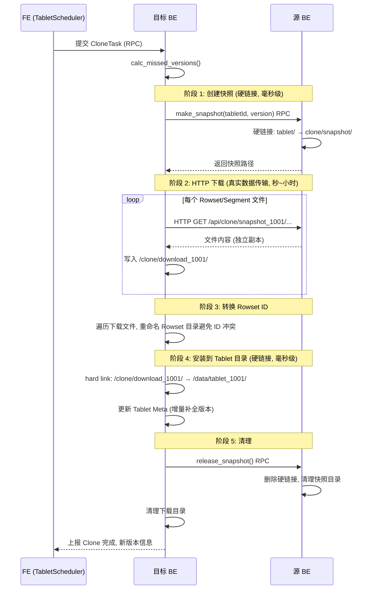

# Apache Doris Clone 机制深度解析

## 一、Clone 的完整数据流

```
源 BE                                      目标 BE
┌────────────────────────────────┐     ┌────────────────────────────────┐
│                                │     │                                │
│  /data/tablet_1001/            │     │  /data/tablet_1001/            │
│    (原始数据, refcount=2)       │     │    (修复后的数据, refcount=2)   │
│         │                      │     │         ▲                      │
│         │ hard link            │     │         │ hard link            │
│         ▼                      │     │         │                      │
│  /clone/snapshot_1001/         │     │  /clone/download_1001/         │
│    (快照, 共享 inode)          │     │    (独立副本, HTTP 下载而来)    │
│                                │     │                                │
│  HTTP Server (:8040)           │     │                                │
│                                │     │                                │
└──────────────┬─────────────────┘     └───────────┬────────────────────┘
               │                                     │
               │          HTTP GET (真实数据传输)     │
               │    逐文件下载, 消耗带宽和耗时          │
               │─────────────────────────────────────▶│
               │                                     │
```

整个过程涉及**两次硬链接 + 一次 HTTP 传输**，真正消耗时间和带宽的只有中间的网络传输环节。

---

## 二、快照机制：硬链接而非复制

### 2.1 为什么用硬链接

```
复制 (Copy) — 时间复杂, 空间翻倍:

  ┌─────────────┐         ┌─────────────┐
  │ 原始文件     │ ──复制──▶│ 副本文件     │  磁盘: ×2
  │ inode: 100  │         │ inode: 200  │  耗时: 分钟级
  └─────────────┘         └─────────────┘

硬链接 (Hard Link) — 即时, 零额外空间:

  ┌─────────────┐
  │ inode: 100  │ refcount = 2
  │ 10 GB       │
  └──┬──────────┘
     │
     ├─ /data/tablet_1001/.../0.dat     ← 原始路径
     └─ /clone/snapshot_1001/.../0.dat  ← 快照路径 (同一 inode)

  磁盘: +0 字节, 耗时: 毫秒级
```

### 2.2 make_snapshot 过程

```
源 BE 收到 make_snapshot(tablet_id, committedVersion) 请求:

Step 1: 创建快照根目录
  mkdir /clone/snapshot_1001/

Step 2: 硬链接 Tablet Meta
  link /data/tablet_1001/schema_hash/meta
    → /clone/snapshot_1001/meta

Step 3: 硬链接所有 (或指定版本的) Rowset 目录
  link /data/tablet_1001/schema_hash/100001_200001/0.dat
    → /clone/snapshot_1001/100001_200001/0.dat
  link /data/tablet_1001/schema_hash/200001_300001/0.dat
    → /clone/snapshot_1001/200001_300001/0.dat
  ...所有 Segment 文件

结果: 快照目录和原始目录指向相同的 inode, 零额外空间
```

### 2.3 增量快照

增量 Clone 时，可以只导出缺失的版本：

```
本地已有版本: [1,5]
 committedVersion: 8
 缺失版本: [6,7] 和 [8,8]

增量快照目录:
  /clone/snapshot_1001/
  ├── meta                    ← 完整 Meta (含全部版本信息)
  ├── 200001_300001/          ← Rowset [6,7]
  │   └── 0.dat
  └── 300001_400001/          ← Rowset [8,8]
      ├── 0.dat
      └── 1.dat

  只硬链接缺失的 Rowset, 而非全量
```

### 2.4 快照生命周期

```
make_snapshot()     创建硬链接          毫秒
      │
      ▼
HTTP download       目标 BE 下载文件     秒~小时 (瓶颈)
      │
      ▼
release_snapshot()  删除硬链接, refcount-1  毫秒

超时保护:
  snapshot_expire_time_sec = 172800 (48 小时)
  超时自动 release, 防止忘记清理导致磁盘泄漏
```

### 2.5 两端硬链接的目的不同

| | 源 BE | 目标 BE |
|---|---|---|
| **时机** | make_snapshot | _finish_clone |
| **方向** | tablet → clone | clone → tablet |
| **目的** | 创建可下载的"导出视图" | 将下载文件"安装"到 Tablet 目录 |
| **后续** | release 删除 clone 目录 | clone 目录后续清理 |
| **效果** | 避免本地复制 | 避免本地复制 |

---

## 三、目标端下载：HTTP 传输而非共享存储

### 3.1 目标 BE 拿到的是独立副本

目标 BE 通过 HTTP 从源 BE 下载文件，得到的是**独立的文件副本**，不与源 BE 共享 inode：

```
源 BE 的文件:  inode 100, refcount=2 (原始+快照)
目标 BE 的文件: inode 200, refcount=2 (下载+硬链接到tablet)

两者是完全独立的文件, 位于不同机器的不同磁盘上
```

### 3.2 为什么不用共享存储

```
假设用 NFS/共享存储:

  NFS 上: /shared/tablet_1001/0.dat (一份文件)
  源 BE: 直接访问
  目标 BE: 直接访问 → 硬链接即可, 无需下载

问题:
  1. Doris 不依赖共享存储 (设计上每个 BE 独立磁盘)
  2. 共享存储性能瓶颈 (网络文件系统延迟高)
  3. 共享存储单点故障风险
  4. 不符合 Doris 的 MPP 架构理念

所以: 每个副本独立存储, Clone 通过 HTTP 网络复制
```

### 3.3 网络传输是唯一瓶颈

```
总耗时分解:

  make_snapshot (源 BE)      ~1 ms      可忽略
  HTTP download (网络)       数秒~数小时  ← 瓶颈
  hard link install (目标)   ~1 ms      可忽略
  release_snapshot (源 BE)   ~1 ms      可忽略
  meta 更新                  ~1 ms      可忽略

网络限速: max_download_speed_kbps = 50000 (50 MB/s)

  1 GB Tablet  → ~20 秒
  10 GB Tablet → ~200 秒
  100 GB Tablet → ~33 分钟
```

---

## 四、为什么不能按 Segment/Page 粒度修复

### 4.1 技术上并非做不到

Doris 的 Rowset/Segment **本身是独立寻址的**——每个 Rowset 是一个独立目录：

```
tablet_1001/
  └── schema_hash_1/
      ├── 100001_200001/    ← Rowset (独立目录, 自包含)
      │   ├── 0.dat         ← Segment 0
      │   ├── 1.dat         ← Segment 1
      │   └── 2.dat         ← Segment 2
      ├── 200001_300001/    ← 另一个 Rowset
      └── 300001_400001/
```

每个 Rowset 目录是自包含的，理论上可以单独下载。

### 4.2 没有 Per-Segment 健康追踪

```
当前设计:
  Tablet → _is_bad (bool)     ← 只有一个标记, 整个 Tablet 级别
  Replica → bad (boolean)     ← FE 侧也只有一个标记

缺失的设计:
  Tablet → segment_health_map ← 不存在
  Replica → bad_segments[]    ← 不存在
```

校验失败时，系统只知道"这个 Tablet 有问题"，但**没有记录是哪个 Segment/Page 损坏**。`Status::Corruption` 错误向上传播后直接导致查询失败，错误信息被丢弃而不是记录到元数据中。

### 4.3 Clone 协议是 Tablet 级别

```
当前 Clone 协议 (TCloneReq):
  - tabletId, schemaHash
  - srcBackends[]
  - committedVersion, committedVersionHash
  ← 没有: segmentId, rowsetId 等细粒度参数

make_snapshot RPC:
  - 输入: tablet_id
  - 输出: 整个 Tablet 的硬链接快照
  ← 没有: 按 Rowset/Segment 创建部分快照的接口

下载 HTTP API:
  - /api/clone/snapshot_{tablet_id}/
  ← 没有: /api/clone/snapshot/{tablet_id}/rowset/{rowset_id}/segment/{seg_id}
```

整个链路都是 Tablet 粒度设计的。

### 4.4 Compaction 会快速消除"部分修复"的价值

```
修复一个 Segment 后, Compaction 可能把整个 Rowset 合并掉:

  修复前: [1,2] [3,3] [4,4] [5,5]  ← Segment 损坏在 [3,3]
  修复后: [1,2] [3,3] [4,4] [5,5]  ← [3,3] 已修复
  Compaction: [1,5]                ← 所有 Rowset 合并, 修复的 [3,3] 被丢弃

白修复了 — 花了网络带宽和时间, 但修复的 Segment 立刻被合并掉
```

### 4.5 实际收益分析

```
假设一个 Tablet 有 10 GB, 损坏了 1 个 Segment (64 MB):

  整 Tablet Clone:  下载 10 GB,  耗时 ~200s
  单 Segment 修复:  下载 64 MB,  耗时 ~1.3s
  理论节省: 99.4%

但实际:
  - Tablet 通常 1~4 GB (建表时自动分桶)
  - Segment 通常 256 MB
  - 实际节省: ~75%

  实现成本:
  - 新增 Per-Segment 健康追踪和元数据管理
  - 新增 Rowset 级别的快照/下载协议
  - 修复期间需要锁住该 Segment (防止 Compaction 写入)
  - 需要协调版本一致性
  - 代码改动量大, 测试覆盖复杂
```

### 4.6 设计哲学

| 维度 | 细粒度修复 (Segment) | 粗粒度修复 (Tablet) |
|------|---------------------|-------------------|
| 实现复杂度 | 高（新协议、状态追踪、并发控制） | 低（已有机制） |
| 一致性保证 | 需要额外协调 | 天然一致（原子替换） |
| Compaction 冲突 | 需要加锁/等待 | Clone 期间 Tablet 不可用 |
| 代码改动量 | 大 | 零 |
| 适用场景 | 大 Tablet + 极少量损坏 | 所有场景 |
| 修复后价值 | 可能被 Compaction 消除 | 稳定（整个 Tablet 重建） |

**一句话**：Doris 选择了简单可靠的粗粒度方案，把工程复杂度控制在可维护范围内。

---

## 五、完整 Clone 时序图



---

## 六、总结

| 问题 | 答案 |
|------|------|
| 快照是打包所有数据文件吗？ | 是，通过**硬链接**指向所有 Segment 文件，零额外空间 |
| 目标 BE 直接用硬链接吗？ | **不是**，通过 **HTTP 下载**获得独立副本，然后本地硬链接到 Tablet 目录 |
| 为什么不能按 Segment/Page 修复？ | 没有细粒度健康追踪 + Clone 协议是 Tablet 级别 + Compaction 会消除部分修复的价值 + 设计选择简单优先 |
| Clone 的瓶颈是什么？ | **网络传输**（HTTP 下载），默认限速 50 MB/s |
| 增量 Clone 省了什么？ | 省了**网络传输量**（只下载缺失版本的 Rowset），快照和安装仍是毫秒级 |

---
